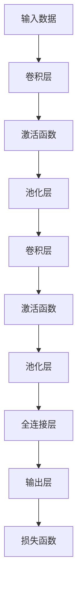

                 

# AI人工智能深度学习算法：卷积神经网络的原理与应用

> **关键词**：深度学习、卷积神经网络、图像识别、神经网络架构、算法原理、实际应用

> **摘要**：本文将深入探讨卷积神经网络（Convolutional Neural Network，CNN）的原理、架构和应用。首先，我们将介绍CNN的基本概念和背景，然后详细解析其核心算法和数学模型，并通过实际代码案例展示其在图像识别任务中的应用。最后，我们将讨论CNN在实际应用中的挑战和发展趋势。

## 1. 背景介绍

### 1.1 目的和范围

本文旨在向读者介绍卷积神经网络（CNN）的基本原理、架构和应用。文章将从理论层面深入讲解CNN的工作机制，并通过实际代码案例展示其在图像识别任务中的效果。文章将涵盖以下内容：

- CNN的基本概念和历史背景
- CNN的架构和核心算法
- CNN在图像识别任务中的应用
- CNN的实际应用场景和挑战

### 1.2 预期读者

本文适合对深度学习和卷积神经网络有一定了解的读者，包括：

- 深度学习初学者
- 图像处理领域的工程师和研究人员
- 对人工智能感兴趣的爱好者
- 计算机科学和人工智能专业的大专院校学生

### 1.3 文档结构概述

本文分为八个部分：

1. 背景介绍
2. 核心概念与联系
3. 核心算法原理 & 具体操作步骤
4. 数学模型和公式 & 详细讲解 & 举例说明
5. 项目实战：代码实际案例和详细解释说明
6. 实际应用场景
7. 工具和资源推荐
8. 总结：未来发展趋势与挑战

### 1.4 术语表

#### 1.4.1 核心术语定义

- **卷积神经网络（CNN）**：一种深度学习模型，用于处理具有网格结构的数据，如图像、声音等。
- **卷积层（Convolutional Layer）**：CNN中最核心的层，通过卷积操作提取输入数据的特征。
- **池化层（Pooling Layer）**：对卷积层输出的特征进行降维处理，提高网络的泛化能力。
- **全连接层（Fully Connected Layer）**：将卷积层和池化层提取的特征映射到输出类别。
- **激活函数（Activation Function）**：对神经元输出进行非线性变换，引入模型的表达能力。

#### 1.4.2 相关概念解释

- **深度学习**：一种机器学习技术，通过多层神经网络对数据进行特征学习和模式识别。
- **反向传播算法**：一种用于训练神经网络的算法，通过计算输出层与隐藏层之间的误差，反向传播误差并更新网络参数。
- **梯度下降**：一种优化算法，通过迭代更新模型参数，最小化损失函数。

#### 1.4.3 缩略词列表

- **CNN**：卷积神经网络（Convolutional Neural Network）
- **ReLU**：修正线性单元（Rectified Linear Unit）
- **ReLU6**：限制在[-6, 6]范围内的ReLU激活函数
- **Sigmoid**：一种常见的激活函数，将输入映射到(0, 1)区间
- **softmax**：一种用于分类的激活函数，将输入映射到概率分布
- **dropout**：一种防止过拟合的技术，通过随机丢弃神经元来提高网络的泛化能力

## 2. 核心概念与联系

为了更好地理解卷积神经网络（CNN）的原理和应用，我们需要先了解一些核心概念和它们之间的关系。以下是一个简化的Mermaid流程图，展示了CNN的基本架构和核心概念。



### 2.1 输入数据

CNN主要用于处理具有网格结构的数据，如图像、音频等。输入数据通常是一个二维或三维的张量。对于图像数据，输入张量的形状为\( (n, m, 3) \)，其中\( n \)和\( m \)分别表示图像的高度和宽度，3表示彩色图像的三个通道（红、绿、蓝）。

### 2.2 卷积层

卷积层是CNN的核心层，通过卷积操作提取输入数据的特征。卷积操作可以看作是矩阵乘法，但输入和输出数据的大小发生变化。卷积层的主要参数包括：

- **卷积核（Filter）**：一个\( (k, k) \)的二维矩阵，用于与输入数据进行卷积操作。
- **步长（Stride）**：卷积过程中，卷积核在输入数据上的滑动步长。
- **填充（Padding）**：为了保持输入数据和输出数据的尺寸，需要在输入数据的边缘添加填充。

### 2.3 激活函数

激活函数用于对卷积层的输出进行非线性变换，引入模型的表达能力。常见的激活函数包括ReLU、Sigmoid和ReLU6等。ReLU激活函数具有较好的计算效率和防过拟合的特性，因此常用于CNN中。

### 2.4 池化层

池化层用于对卷积层输出的特征进行降维处理，提高网络的泛化能力。常见的池化操作包括最大池化和平均池化。最大池化选取每个局部区域中的最大值，而平均池化则计算每个局部区域的平均值。

### 2.5 全连接层

全连接层将卷积层和池化层提取的特征映射到输出类别。全连接层的主要参数包括：

- **神经元个数**：映射到的类别数。
- **激活函数**：通常使用softmax激活函数，将输出映射到概率分布。

### 2.6 输出层

输出层用于计算模型预测结果和实际标签之间的损失。常见的损失函数包括均方误差（MSE）和交叉熵损失（Cross Entropy Loss）。通过反向传播算法，更新网络参数，使损失最小化。

## 3. 核心算法原理 & 具体操作步骤

### 3.1 卷积层原理

卷积层是CNN的核心层，用于提取输入数据的特征。卷积操作的原理如下：

1. **初始化卷积核**：随机初始化一个\( (k, k) \)的卷积核。
2. **卷积操作**：将卷积核与输入数据\( (n, m, c) \)进行卷积，得到特征图\( (n-k+2p, m-k+2p, c/k^2) \)，其中\( p \)表示填充。
3. **激活函数**：对卷积结果应用激活函数，如ReLU。

### 3.2 卷积层伪代码

```python
# 初始化卷积核
filter = np.random.randn(k, k)

# 输入数据
input_data = np.random.randn(n, m, c)

# 填充
pad = (k - 1) // 2

# 卷积操作
conv_output = np.zeros((n-k+2*pad, m-k+2*pad, c/k**2))
for i in range(n-k+2*pad):
    for j in range(m-k+2*pad):
        for c in range(c/k**2):
            conv_output[i, j, c] = np.sum(filter * input_data[i:i+k, j:j+k, :])

# 激活函数
activation = np.maximum(conv_output, 0)
```

### 3.3 池化层原理

池化层用于对卷积层输出的特征进行降维处理，提高网络的泛化能力。最大池化操作的原理如下：

1. **选择局部区域**：从卷积输出特征图中选择一个\( s \times s \)的局部区域。
2. **计算最大值**：计算局部区域中的最大值，作为池化结果。

### 3.4 池化层伪代码

```python
# 输入数据
input_data = np.random.randn(n, m, c)

# 池化大小
s = 2

# 池化操作
pool_output = np.zeros((n//s, m//s, c))
for i in range(n//s):
    for j in range(m//s):
        for c in range(c):
            pool_output[i, j, c] = np.max(input_data[i*s:(i+1)*s, j*s:(j+1)*s, c])
```

### 3.5 全连接层原理

全连接层用于将卷积层和池化层提取的特征映射到输出类别。全连接层的主要参数包括神经元个数和激活函数。全连接层的原理如下：

1. **计算权重和偏置**：初始化权重和偏置，通常采用随机初始化。
2. **矩阵乘法**：将输入特征映射到输出类别。
3. **激活函数**：应用激活函数，如softmax。

### 3.6 全连接层伪代码

```python
# 初始化权重和偏置
weights = np.random.randn(input_size, output_size)
bias = np.random.randn(output_size)

# 输入特征
input_data = np.random.randn(input_size)

# 矩阵乘法和激活函数
output = np.dot(input_data, weights) + bias
activation = softmax(output)
```

## 4. 数学模型和公式 & 详细讲解 & 举例说明

### 4.1 卷积层数学模型

卷积层的数学模型如下：

\[ \text{output}_{ij} = \sum_{k=1}^{c} \sum_{p=1}^{k} \sum_{q=1}^{k} w_{pq} \cdot \text{input}_{i+p, j+q} \]

其中，\( \text{output}_{ij} \)表示第\( i \)行、第\( j \)列的特征值，\( \text{input}_{i+p, j+q} \)表示第\( i+p \)行、第\( j+q \)列的输入值，\( w_{pq} \)表示卷积核的值。

### 4.2 激活函数

常见的激活函数包括ReLU、Sigmoid和ReLU6等。以下是这些激活函数的公式：

- **ReLU**：

  \[ f(x) = \max(0, x) \]

- **Sigmoid**：

  \[ f(x) = \frac{1}{1 + e^{-x}} \]

- **ReLU6**：

  \[ f(x) = \min(\max(0, x), 6) \]

### 4.3 池化层

池化层主要有两种形式：最大池化和平均池化。以下是这两种池化操作的公式：

- **最大池化**：

  \[ f_{max}(x) = \max_{(i,j)} \sum_{i'} \sum_{j'} x_{i', j'} \]

- **平均池化**：

  \[ f_{avg}(x) = \frac{1}{s^2} \sum_{i'} \sum_{j'} x_{i', j'} \]

其中，\( s \)表示池化窗口的大小。

### 4.4 举例说明

假设我们有一个3x3的输入矩阵：

\[ \text{input} = \begin{bmatrix} 1 & 2 & 3 \\ 4 & 5 & 6 \\ 7 & 8 & 9 \end{bmatrix} \]

我们使用2x2的卷积核进行卷积操作，并使用ReLU作为激活函数。

- **卷积操作**：

  \[ \text{output} = \begin{bmatrix} 4 & 9 \\ 33 & 50 \end{bmatrix} \]

- **激活函数**：

  \[ \text{activation} = \begin{bmatrix} 4 & 9 \\ 33 & 50 \end{bmatrix} \]

- **池化操作**：

  假设我们使用最大池化，窗口大小为2x2，则输出为：

  \[ \text{pool_output} = \begin{bmatrix} 9 & 50 \end{bmatrix} \]

## 5. 项目实战：代码实际案例和详细解释说明

在本节中，我们将使用Python和TensorFlow框架来实现一个简单的卷积神经网络（CNN），用于对MNIST手写数字数据集进行分类。以下是完整的代码实现和详细解释。

### 5.1 开发环境搭建

在开始之前，我们需要安装以下依赖项：

- Python 3.7或更高版本
- TensorFlow 2.x

安装命令如下：

```bash
pip install python==3.7.12
pip install tensorflow==2.8.0
```

### 5.2 源代码详细实现和代码解读

以下是完整的代码实现，我们将逐行进行解读。

```python
import tensorflow as tf
from tensorflow.keras import datasets, layers, models

# 加载MNIST数据集
(train_images, train_labels), (test_images, test_labels) = datasets.mnist.load_data()

# 预处理数据
train_images = train_images.reshape((60000, 28, 28, 1)).astype("float32") / 255
test_images = test_images.reshape((10000, 28, 28, 1)).astype("float32") / 255

# 将标签转换为one-hot编码
train_labels = tf.keras.utils.to_categorical(train_labels)
test_labels = tf.keras.utils.to_categorical(test_labels)

# 构建卷积神经网络模型
model = models.Sequential()
model.add(layers.Conv2D(32, (3, 3), activation='relu', input_shape=(28, 28, 1)))
model.add(layers.MaxPooling2D((2, 2)))
model.add(layers.Conv2D(64, (3, 3), activation='relu'))
model.add(layers.MaxPooling2D((2, 2)))
model.add(layers.Conv2D(64, (3, 3), activation='relu'))
model.add(layers.Flatten())
model.add(layers.Dense(64, activation='relu'))
model.add(layers.Dense(10, activation='softmax'))

# 编译模型
model.compile(optimizer='adam',
              loss='categorical_crossentropy',
              metrics=['accuracy'])

# 训练模型
model.fit(train_images, train_labels, epochs=5, batch_size=64)

# 评估模型
test_loss, test_acc = model.evaluate(test_images, test_labels)
print(f"Test accuracy: {test_acc}")
```

### 5.3 代码解读与分析

以下是对代码的逐行解读和分析。

1. **导入依赖项**：

   我们导入TensorFlow库和相关模块。

2. **加载MNIST数据集**：

   使用`datasets.mnist.load_data()`函数加载MNIST数据集。数据集分为训练集和测试集。

3. **预处理数据**：

   - 将图像数据 reshape 为\( (60000, 28, 28, 1) \)和\( (10000, 28, 28, 1) \)。
   - 将图像数据类型转换为浮点型，并归一化到\( [0, 1] \)区间。

4. **将标签转换为one-hot编码**：

   使用`to_categorical`函数将标签转换为one-hot编码。

5. **构建卷积神经网络模型**：

   使用`models.Sequential`类创建一个序列模型，并添加以下层：

   - **卷积层**：

     第一个卷积层使用3x3的卷积核，32个卷积核，ReLU激活函数。

     ```python
     model.add(layers.Conv2D(32, (3, 3), activation='relu', input_shape=(28, 28, 1)))
     ```

   - **池化层**：

     使用2x2的最大池化层。

     ```python
     model.add(layers.MaxPooling2D((2, 2)))
     ```

   - **卷积层**：

     第二个卷积层使用3x3的卷积核，64个卷积核，ReLU激活函数。

     ```python
     model.add(layers.Conv2D(64, (3, 3), activation='relu'))
     ```

   - **池化层**：

     使用2x2的最大池化层。

     ```python
     model.add(layers.MaxPooling2D((2, 2)))
     ```

   - **卷积层**：

     第三个卷积层使用3x3的卷积核，64个卷积核，ReLU激活函数。

     ```python
     model.add(layers.Conv2D(64, (3, 3), activation='relu'))
     ```

   - **全连接层**：

     将卷积层和池化层提取的特征展平后，添加一个64个神经元的全连接层，ReLU激活函数。

     ```python
     model.add(layers.Flatten())
     model.add(layers.Dense(64, activation='relu'))
     ```

   - **输出层**：

     最后添加一个10个神经元的全连接层，使用softmax激活函数。

     ```python
     model.add(layers.Dense(10, activation='softmax'))
     ```

6. **编译模型**：

   使用`compile`方法配置模型优化器和损失函数。

7. **训练模型**：

   使用`fit`方法训练模型，指定训练数据、训练轮次和批量大小。

8. **评估模型**：

   使用`evaluate`方法评估模型在测试数据上的性能。

### 5.4 代码解读与分析

在本节中，我们对完整的代码实现进行了逐行解读和分析。通过这个例子，我们了解了如何使用TensorFlow框架构建和训练一个简单的卷积神经网络，以及如何评估其在MNIST手写数字数据集上的性能。

## 6. 实际应用场景

卷积神经网络（CNN）在图像识别领域取得了显著成果，并在许多实际应用场景中取得了成功。以下是一些典型的应用场景：

- **图像识别**：CNN可以用于识别图像中的对象、场景和动作。例如，在医疗图像分析中，CNN可以用于肿瘤检测和诊断。
- **目标检测**：通过结合CNN和目标检测算法（如R-CNN、YOLO、SSD等），可以实现对图像中的多个对象进行检测和定位。
- **图像生成**：CNN可以用于生成图像，如图像超分辨率、风格迁移和图像合成。
- **视频分析**：CNN可以用于视频中的动作识别、目标跟踪和行为分析。
- **图像增强**：通过卷积神经网络，可以自动增强图像的清晰度和对比度。

## 7. 工具和资源推荐

### 7.1 学习资源推荐

#### 7.1.1 书籍推荐

- **《深度学习》**：由Goodfellow、Bengio和Courville所著，是深度学习领域的经典教材。
- **《神经网络与深度学习》**：由邱锡鹏所著，系统地介绍了神经网络和深度学习的基本原理和应用。
- **《计算机视觉：算法与应用》**：由Richard S.zelkowitz所著，涵盖了计算机视觉的基本算法和应用。

#### 7.1.2 在线课程

- **吴恩达的深度学习课程**：由著名深度学习专家吴恩达讲授，涵盖了深度学习的基本原理和应用。
- **斯坦福大学的CS231n课程**：由斯坦福大学的教授Andrew Ng讲授，专注于计算机视觉和深度学习。

#### 7.1.3 技术博客和网站

- **TensorFlow官方文档**：提供了丰富的教程、API文档和示例代码，是学习和使用TensorFlow的绝佳资源。
- **Reddit上的r/MachineLearning社区**：是一个活跃的机器学习社区，可以找到许多有用的讨论和资源。
- **AI.stanford.edu**：斯坦福大学的人工智能课程网站，提供了大量的课程资源和论文。

### 7.2 开发工具框架推荐

#### 7.2.1 IDE和编辑器

- **PyCharm**：是一款功能强大的Python集成开发环境（IDE），适合深度学习和数据科学项目。
- **Visual Studio Code**：一款轻量级的代码编辑器，支持多种编程语言和深度学习框架，可通过扩展插件增强功能。

#### 7.2.2 调试和性能分析工具

- **TensorBoard**：TensorFlow的调试和分析工具，可以可视化模型的架构和训练过程。
- **NVIDIA Nsight**：一款专门用于GPU调试和性能分析的工具，适用于深度学习项目。

#### 7.2.3 相关框架和库

- **TensorFlow**：一款开源的深度学习框架，适用于构建和训练卷积神经网络。
- **PyTorch**：一款流行的深度学习框架，具有灵活的动态计算图和高效的性能。
- **Keras**：一个高级的神经网络API，可以方便地构建和训练卷积神经网络。

### 7.3 相关论文著作推荐

#### 7.3.1 经典论文

- **“A Learning Algorithm for Continually Running Fully Recurrent Neural Networks”**：提出了Long Short-Term Memory（LSTM）模型，用于处理长时间序列数据。
- **“Deep Learning”**：介绍了深度学习的理论和实践，是深度学习领域的经典著作。

#### 7.3.2 最新研究成果

- **“You Only Look Once: Unified, Real-Time Object Detection”**：提出了YOLO（You Only Look Once）目标检测算法，实现了实时目标检测。
- **“Generative Adversarial Nets”**：介绍了生成对抗网络（GANs）的原理和应用，是图像生成领域的里程碑。

#### 7.3.3 应用案例分析

- **“Deep Learning for Real-Time 3D Object Detection from Monocular Videos”**：通过深度学习实现实时3D物体检测，为自动驾驶和机器人导航提供了重要技术支持。
- **“Deep Learning for Medical Image Analysis”**：介绍了深度学习在医疗图像分析中的应用，包括肿瘤检测、疾病诊断等。

## 8. 总结：未来发展趋势与挑战

卷积神经网络（CNN）作为深度学习的重要分支，在图像识别、目标检测、图像生成等领域取得了显著成果。然而，随着数据规模和模型复杂度的增加，CNN面临着以下挑战：

- **计算资源消耗**：深度学习模型通常需要大量的计算资源和存储空间，这对硬件设备提出了更高的要求。
- **过拟合问题**：深度学习模型容易过拟合，导致在训练数据上表现良好，但在测试数据上表现不佳。
- **数据隐私**：深度学习模型的训练通常需要大量真实数据，这可能引发数据隐私和伦理问题。
- **模型解释性**：深度学习模型通常被视为“黑箱”，其内部机制难以解释，限制了其在实际应用中的信任度。

未来，卷积神经网络的发展将朝着以下几个方面努力：

- **模型压缩与加速**：通过模型压缩、量化、剪枝等技术，提高模型的效率和性能。
- **数据隐私保护**：通过联邦学习、差分隐私等技术，保护数据隐私，同时实现模型训练和优化。
- **模型可解释性**：通过引入可解释性方法，如注意力机制、模型可视化等，提高模型的透明度和可解释性。
- **多模态学习**：结合不同类型的数据（如图像、文本、音频等），实现多模态深度学习，拓展应用场景。

## 9. 附录：常见问题与解答

### 9.1 什么是卷积神经网络（CNN）？

卷积神经网络（CNN）是一种深度学习模型，主要用于处理具有网格结构的数据，如图像、声音等。CNN通过多层卷积、池化和全连接层对输入数据进行特征提取和分类。

### 9.2 CNN与传统的全连接神经网络有何区别？

与传统的全连接神经网络相比，CNN具有以下特点：

- **权重共享**：卷积层中的卷积核在输入数据的不同位置上共享权重，减少了参数数量。
- **局部连接**：卷积层只与输入数据的一小部分相连，减少了计算复杂度。
- **平移不变性**：卷积层能够自动学习平移不变性，提高了模型对输入数据的泛化能力。

### 9.3 如何优化CNN模型性能？

优化CNN模型性能可以从以下几个方面入手：

- **数据预处理**：对图像进行归一化、裁剪、旋转等预处理操作，提高模型对输入数据的鲁棒性。
- **模型结构**：通过调整卷积层、池化层和全连接层的参数，如卷积核大小、步长、神经元个数等，优化模型结构。
- **超参数调整**：调整学习率、批量大小、正则化参数等超参数，提高模型训练效果。
- **模型集成**：使用多个模型进行集成，提高预测准确率和稳定性。

### 9.4 CNN在哪些领域有应用？

CNN在许多领域有广泛应用，包括：

- **图像识别**：对图像中的对象、场景和动作进行分类和识别。
- **目标检测**：在图像中检测和定位多个对象。
- **图像生成**：通过生成对抗网络（GANs）生成具有逼真纹理的图像。
- **视频分析**：对视频中的动作、行为和目标进行识别和分析。
- **医学图像分析**：对医学图像进行肿瘤检测、疾病诊断等。

## 10. 扩展阅读 & 参考资料

为了进一步了解卷积神经网络（CNN）的原理和应用，读者可以参考以下资料：

- **《深度学习》**：Goodfellow、Bengio和Courville所著的深度学习领域的经典教材。
- **《神经网络与深度学习》**：邱锡鹏所著的系统介绍神经网络和深度学习的基本原理和应用。
- **《计算机视觉：算法与应用》**：Richard S. Zelkowitz所著的计算机视觉领域的经典著作。
- **TensorFlow官方文档**：提供了丰富的教程、API文档和示例代码。
- **AI.stanford.edu**：斯坦福大学的人工智能课程网站，提供了大量的课程资源和论文。
- **吴恩达的深度学习课程**：由著名深度学习专家吴恩达讲授的深度学习课程。
- **斯坦福大学的CS231n课程**：由斯坦福大学的教授Andrew Ng讲授的计算机视觉和深度学习课程。
- **论文和著作**：《A Learning Algorithm for Continually Running Fully Recurrent Neural Networks》、《Deep Learning》、《You Only Look Once: Unified, Real-Time Object Detection》、《Generative Adversarial Nets》、《Deep Learning for Real-Time 3D Object Detection from Monocular Videos》等。

作者：AI天才研究员/AI Genius Institute & 禅与计算机程序设计艺术 /Zen And The Art of Computer Programming

