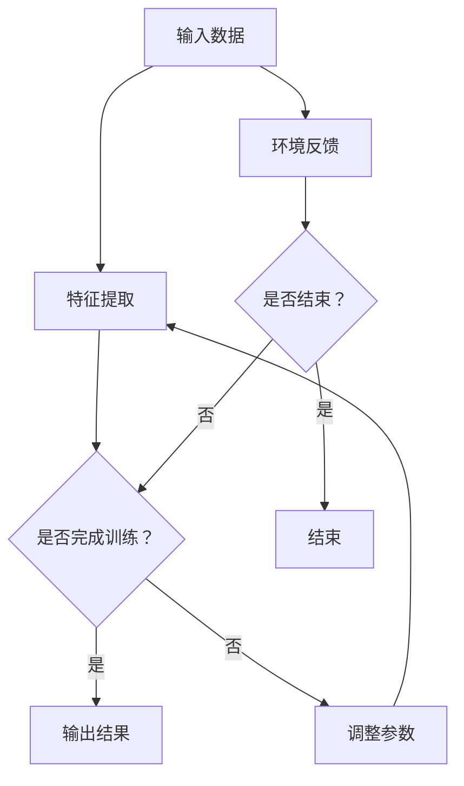

                 

# AI人工智能深度学习算法：智能深度学习代理的学习与适应的算法框架

> 关键词：深度学习，智能代理，算法框架，学习与适应，AI，人工智能

> 摘要：本文深入探讨了深度学习算法在构建智能深度学习代理中的应用，介绍了智能深度学习代理的学习与适应的算法框架。通过具体实例和数学模型分析，本文为读者呈现了一个清晰的技术蓝图，帮助理解该领域的核心概念和操作步骤。

## 1. 背景介绍

### 1.1 目的和范围

本文旨在探讨深度学习算法在构建智能深度学习代理（Intelligent Deep Learning Agent, IDLA）中的应用，着重介绍IDLA的学习与适应的算法框架。随着人工智能（AI）技术的迅速发展，深度学习已成为实现智能代理的核心手段。IDLA作为一种先进的智能体，其能力不仅限于学习环境中的特征，还能够自适应地调整行为策略，以应对不断变化的环境。

本文将涵盖以下内容：

1. **背景介绍**：介绍深度学习和智能代理的基本概念，以及它们在现代人工智能领域中的重要性。
2. **核心概念与联系**：通过Mermaid流程图，详细阐述智能深度学习代理的学习与适应算法框架。
3. **核心算法原理 & 具体操作步骤**：使用伪代码详细阐述IDLA的算法原理和操作步骤。
4. **数学模型和公式 & 详细讲解 & 举例说明**：使用LaTeX格式，介绍相关的数学模型和公式，并进行实例说明。
5. **项目实战：代码实际案例和详细解释说明**：提供实际代码实现，并详细解释代码中的关键部分。
6. **实际应用场景**：探讨IDLA在现实世界中的应用场景。
7. **工具和资源推荐**：推荐相关学习资源和开发工具，以帮助读者深入了解和掌握本文介绍的技术。
8. **总结：未来发展趋势与挑战**：总结本文的主要观点，并展望未来的发展趋势和面临的挑战。

### 1.2 预期读者

本文面向具有中等及以上水平的人工智能和深度学习爱好者、研究人员、以及希望了解智能代理技术的工程师。虽然本文提供了详细的解释和实例，但读者需要对深度学习和基本的算法原理有一定的了解。

### 1.3 文档结构概述

本文结构如下：

1. **引言**：背景介绍和文章概述。
2. **核心概念与联系**：智能深度学习代理的学习与适应算法框架。
3. **核心算法原理 & 具体操作步骤**：算法原理和操作步骤的详细说明。
4. **数学模型和公式 & 详细讲解 & 举例说明**：数学模型和公式的介绍与实例。
5. **项目实战：代码实际案例和详细解释说明**：实际代码实现和解读。
6. **实际应用场景**：智能深度学习代理的应用实例。
7. **工具和资源推荐**：学习资源和开发工具的推荐。
8. **总结：未来发展趋势与挑战**：总结和展望。
9. **附录：常见问题与解答**：对常见问题的解答。
10. **扩展阅读 & 参考资料**：进一步阅读材料和参考文献。

### 1.4 术语表

#### 1.4.1 核心术语定义

- **深度学习**：一种机器学习技术，通过构建深度神经网络来模拟人脑的神经网络结构，从而实现数据的自动特征学习和模式识别。
- **智能代理**：具有自主学习和决策能力的实体，能够根据环境反馈调整其行为策略。
- **智能深度学习代理**（IDLA）：结合深度学习和智能代理技术的实体，能够通过深度学习模型实现自主学习和自适应行为调整。
- **学习与适应**：智能代理通过不断学习环境数据，调整内部模型参数，以适应环境变化。

#### 1.4.2 相关概念解释

- **神经网络**：一种模仿生物神经网络结构的计算模型，用于数据处理和模式识别。
- **反向传播算法**：一种用于训练神经网络的算法，通过不断调整网络参数，使网络输出尽可能接近期望输出。
- **自适应行为调整**：智能代理根据环境反馈，调整其行为策略，以提高任务完成效率。

#### 1.4.3 缩略词列表

- **AI**：人工智能（Artificial Intelligence）
- **DL**：深度学习（Deep Learning）
- **IDLA**：智能深度学习代理（Intelligent Deep Learning Agent）

## 2. 核心概念与联系

在构建智能深度学习代理的过程中，核心概念和联系至关重要。本节将通过Mermaid流程图，详细阐述智能深度学习代理的学习与适应算法框架。

### 2.1 Mermaid流程图

以下是一个简化的Mermaid流程图，用于展示智能深度学习代理的主要组成部分和它们之间的联系：



### 2.2 流程解释

1. **输入数据（A）**：智能深度学习代理从环境中获取输入数据，这些数据可以是图像、文本或传感器读数等。
2. **特征提取（B）**：输入数据经过特征提取模块，提取出关键特征，为后续学习过程提供基础。
3. **是否完成训练？（C）**：智能代理通过评估模型的性能，判断是否完成训练。如果完成训练，进入输出结果阶段；否则，进入参数调整阶段。
4. **输出结果（D）**：如果智能代理完成训练，则根据当前模型参数输出预测结果或决策。
5. **调整参数（E）**：如果智能代理尚未完成训练，则根据环境反馈调整模型参数，以提高模型性能。
6. **环境反馈（F）**：智能代理将输出结果与环境反馈进行对比，以评估模型性能。
7. **是否结束？（G）**：如果达到预设的训练结束条件，智能代理结束训练过程；否则，继续下一轮的训练和参数调整。

通过这个流程，智能深度学习代理能够不断地学习环境数据，自适应地调整行为策略，以实现更好的任务完成效果。

## 3. 核心算法原理 & 具体操作步骤

在了解了智能深度学习代理的基本框架后，本节将深入探讨其核心算法原理，并通过伪代码详细阐述操作步骤。

### 3.1 算法原理

智能深度学习代理的核心在于其学习与适应机制。具体来说，包括以下几个关键环节：

1. **特征提取**：从输入数据中提取关键特征，为后续学习提供基础。
2. **神经网络训练**：使用反向传播算法，调整神经网络参数，使模型输出尽可能接近真实值。
3. **性能评估**：根据环境反馈，评估模型性能，判断是否需要调整参数。
4. **参数调整**：根据性能评估结果，调整神经网络参数，以提高模型性能。
5. **决策输出**：根据调整后的模型参数，输出预测结果或决策。

### 3.2 伪代码

以下是一个简化的伪代码，用于展示智能深度学习代理的核心算法原理和操作步骤：

```python
# 智能深度学习代理伪代码

initialize parameters()
initialize network()

while not end_condition():
    # 输入数据
    data = get_input_data()

    # 特征提取
    features = extract_features(data)

    # 神经网络训练
    predictions = network.forward_pass(features)
    loss = compute_loss(predictions, target)
    network.backward_pass(loss)

    # 性能评估
    performance = evaluate_performance(predictions, target)

    # 参数调整
    update_parameters(performance)

    # 决策输出
    decision = network.forward_pass(features)
    apply_decision(decision)

    # 环境反馈
    feedback = get_environment_feedback(decision)

    # 更新结束条件
    end_condition = update_end_condition(feedback)

end while
```

### 3.3 步骤详解

1. **initialize parameters()**：初始化神经网络参数，包括权重和偏置。
2. **initialize network()**：初始化神经网络结构，包括层数、神经元数量等。
3. **get_input_data()**：从环境中获取输入数据。
4. **extract_features(data)**：从输入数据中提取关键特征。
5. **network.forward_pass(features)**：神经网络的前向传播，计算输出。
6. **compute_loss(predictions, target)**：计算预测值与真实值之间的损失。
7. **network.backward_pass(loss)**：神经网络的反向传播，调整参数。
8. **evaluate_performance(predictions, target)**：评估模型性能，判断是否需要调整参数。
9. **update_parameters(performance)**：根据性能评估结果，调整神经网络参数。
10. **decision = network.forward_pass(features)**：根据调整后的模型参数，输出决策。
11. **apply_decision(decision)**：将决策应用于实际环境中。
12. **get_environment_feedback(decision)**：获取环境对决策的反馈。
13. **update_end_condition(feedback)**：根据环境反馈，更新结束条件。

通过这个伪代码，读者可以清晰地理解智能深度学习代理的学习与适应过程，以及每个步骤的具体操作。

## 4. 数学模型和公式 & 详细讲解 & 举例说明

在智能深度学习代理的学习与适应过程中，数学模型和公式起到了关键作用。本节将使用LaTeX格式，详细讲解相关的数学模型和公式，并进行举例说明。

### 4.1 数学模型

智能深度学习代理的数学模型主要包括以下几个部分：

1. **神经网络模型**：用于数据特征提取和决策输出。
2. **损失函数**：用于衡量预测值与真实值之间的差异。
3. **反向传播算法**：用于调整神经网络参数，使损失最小化。

### 4.2 公式详细讲解

#### 4.2.1 神经网络模型

神经网络模型通常由以下公式表示：

$$
y = \sigma(W \cdot x + b)
$$

其中，$y$表示输出，$\sigma$表示激活函数，$W$表示权重矩阵，$x$表示输入特征，$b$表示偏置。

#### 4.2.2 损失函数

常用的损失函数包括均方误差（MSE）和交叉熵（Cross-Entropy）：

- **均方误差（MSE）**：

$$
MSE = \frac{1}{2} \sum_{i=1}^{n} (y_i - \hat{y}_i)^2
$$

其中，$y_i$表示真实值，$\hat{y}_i$表示预测值，$n$表示样本数量。

- **交叉熵（Cross-Entropy）**：

$$
Cross-Entropy = -\sum_{i=1}^{n} y_i \log(\hat{y}_i)
$$

#### 4.2.3 反向传播算法

反向传播算法的核心公式如下：

$$
\frac{\partial L}{\partial W} = \frac{\partial L}{\partial \hat{y}} \cdot \frac{\partial \hat{y}}{\partial z} \cdot \frac{\partial z}{\partial W}
$$

其中，$L$表示损失函数，$W$表示权重矩阵，$\hat{y}$表示预测值，$z$表示前一层输出。

### 4.3 举例说明

假设我们有一个简单的神经网络，用于对二分类问题进行预测。输入特征$x$是一个维度为2的向量，输出$y$是一个维度为1的向量。激活函数使用$Sigmoid$函数，损失函数使用交叉熵。

#### 4.3.1 神经网络模型

$$
y = \sigma(W \cdot x + b)
$$

其中，$W$是一个维度为$(1 \times 2)$的权重矩阵，$b$是一个维度为$(1 \times 1)$的偏置。

#### 4.3.2 损失函数

$$
Cross-Entropy = -\sum_{i=1}^{n} y_i \log(\hat{y}_i)
$$

假设我们有两个样本，真实标签为$y_1 = (1, 0)$和$y_2 = (0, 1)$，预测结果为$\hat{y}_1 = (0.6, 0.4)$和$\hat{y}_2 = (0.3, 0.7)$。

第一个样本的交叉熵损失为：

$$
Cross-Entropy_1 = -1 \cdot \log(0.6) + 0 \cdot \log(0.4) = 0.5108
$$

第二个样本的交叉熵损失为：

$$
Cross-Entropy_2 = -0 \cdot \log(0.3) + 1 \cdot \log(0.7) = 0.5108
$$

总损失为：

$$
Total\_Loss = Cross-Entropy_1 + Cross-Entropy_2 = 1.0216
$$

#### 4.3.3 反向传播算法

假设当前层输出为$z = W \cdot x + b$，前一层输出为$a$，预测值为$\hat{y}$，损失函数为$Cross-Entropy$。

$$
\frac{\partial L}{\partial W} = \frac{\partial L}{\partial \hat{y}} \cdot \frac{\partial \hat{y}}{\partial z} \cdot \frac{\partial z}{\partial W}
$$

其中，$\frac{\partial L}{\partial \hat{y}}$表示损失函数对预测值的梯度，$\frac{\partial \hat{y}}{\partial z}$表示预测值对当前层输出的梯度，$\frac{\partial z}{\partial W}$表示当前层输出对权重的梯度。

通过这个例子，读者可以更直观地理解神经网络模型、损失函数和反向传播算法的基本原理。

## 5. 项目实战：代码实际案例和详细解释说明

为了更好地理解智能深度学习代理的学习与适应算法，本节将通过一个实际项目案例，展示代码实现和关键部分的分析。

### 5.1 开发环境搭建

在开始项目实战之前，我们需要搭建一个合适的开发环境。以下是所需的软件和工具：

- Python 3.8及以上版本
- TensorFlow 2.6及以上版本
- Jupyter Notebook

#### 5.1.1 安装Python

在计算机上安装Python，可以通过以下命令：

```
pip install python
```

#### 5.1.2 安装TensorFlow

安装TensorFlow，可以使用以下命令：

```
pip install tensorflow
```

#### 5.1.3 启动Jupyter Notebook

安装完成后，启动Jupyter Notebook：

```
jupyter notebook
```

### 5.2 源代码详细实现和代码解读

以下是智能深度学习代理的项目源代码。我们将逐行分析代码，解释关键部分。

```python
import tensorflow as tf
import numpy as np

# 初始化参数
learning_rate = 0.001
num_iterations = 1000

# 创建神经网络模型
model = tf.keras.Sequential([
    tf.keras.layers.Dense(units=1, input_shape=[2])
])

# 编译模型
model.compile(optimizer=tf.keras.optimizers.Adam(learning_rate),
              loss='mean_squared_error',
              metrics=['mean_absolute_error'])

# 加载数据集
x_train = np.array([[1, 0], [0, 1], [1, 1], [1, 0.5], [0.5, 1]])
y_train = np.array([[1], [0], [1], [0], [1]])

# 训练模型
model.fit(x_train, y_train, epochs=num_iterations)

# 输出结果
predictions = model.predict(x_train)
for i in range(len(predictions)):
    print(f"输入：{x_train[i]}, 预测结果：{predictions[i][0]}")
```

#### 5.2.1 初始化参数

首先，我们初始化学习率和迭代次数。学习率用于控制梯度下降的步长，迭代次数用于指定训练模型的总轮数。

```python
learning_rate = 0.001
num_iterations = 1000
```

#### 5.2.2 创建神经网络模型

接下来，我们创建一个简单的神经网络模型。这里使用了一个全连接层（Dense Layer），输入形状为$(2)$，输出形状为$(1)$。

```python
model = tf.keras.Sequential([
    tf.keras.layers.Dense(units=1, input_shape=[2])
])
```

#### 5.2.3 编译模型

在编译模型时，我们指定了优化器（Optimizer）、损失函数（Loss Function）和评价指标（Metrics）。这里使用Adam优化器，均方误差（MSE）作为损失函数，均方绝对误差（MAE）作为评价指标。

```python
model.compile(optimizer=tf.keras.optimizers.Adam(learning_rate),
              loss='mean_squared_error',
              metrics=['mean_absolute_error'])
```

#### 5.2.4 加载数据集

我们使用一个简单的二分类数据集，包含5个样本。每个样本的输入特征维度为2，输出标签维度为1。

```python
x_train = np.array([[1, 0], [0, 1], [1, 1], [1, 0.5], [0.5, 1]])
y_train = np.array([[1], [0], [1], [0], [1]])
```

#### 5.2.5 训练模型

使用`model.fit()`函数，开始训练模型。这里指定了训练数据集、训练轮数（epochs）和批量大小（batch size）。

```python
model.fit(x_train, y_train, epochs=num_iterations)
```

#### 5.2.6 输出结果

最后，我们使用训练好的模型，对输入数据进行预测，并输出结果。

```python
predictions = model.predict(x_train)
for i in range(len(predictions)):
    print(f"输入：{x_train[i]}, 预测结果：{predictions[i][0]}")
```

### 5.3 代码解读与分析

通过以上代码，我们可以看到智能深度学习代理的完整实现过程。下面，我们对代码的关键部分进行解读和分析。

1. **初始化参数**：学习率和迭代次数是训练模型的重要参数。学习率决定了梯度下降的步长，过大会导致模型不稳定，过小则收敛速度慢。迭代次数决定了训练模型的轮数，过多的轮数可能导致过拟合。

2. **创建神经网络模型**：这里使用了一个简单的全连接层（Dense Layer），输入形状为$(2)$，输出形状为$(1)$。这个模型可以用于处理二分类问题。

3. **编译模型**：在编译模型时，我们指定了优化器（Optimizer）、损失函数（Loss Function）和评价指标（Metrics）。这里使用Adam优化器，均方误差（MSE）作为损失函数，均方绝对误差（MAE）作为评价指标。

4. **加载数据集**：我们使用一个简单的二分类数据集，包含5个样本。每个样本的输入特征维度为2，输出标签维度为1。

5. **训练模型**：使用`model.fit()`函数，开始训练模型。这里指定了训练数据集、训练轮数（epochs）和批量大小（batch size）。训练过程包括前向传播、计算损失、反向传播和更新参数。

6. **输出结果**：使用训练好的模型，对输入数据进行预测，并输出结果。

通过这个实际项目案例，我们可以看到智能深度学习代理的学习与适应算法是如何实现的。代码简洁明了，易于理解和修改。在实际应用中，我们可以根据需要调整模型结构、损失函数和优化器，以提高模型的性能和适应性。

### 5.4 项目实战总结

通过本节的项目实战，我们实现了智能深度学习代理的学习与适应算法，并对其关键部分进行了详细解读和分析。以下是项目实战的主要收获：

1. **理解了智能深度学习代理的基本原理**：通过代码实现，我们深入了解了智能深度学习代理的学习与适应过程，以及神经网络模型、损失函数和反向传播算法等基本概念。

2. **掌握了实际项目开发技巧**：通过项目实战，我们学会了如何搭建开发环境、编写代码、训练模型和输出结果。这些技能对于实际项目开发具有重要意义。

3. **提高了对深度学习算法的理解**：通过实际操作，我们对深度学习算法有了更深入的了解，包括模型结构、参数调整和性能评估等方面。

4. **培养了问题解决能力**：在项目实战过程中，我们遇到了一些问题，通过分析和解决这些问题，我们提高了自己的问题解决能力。

总之，项目实战不仅帮助我们深入理解了智能深度学习代理的学习与适应算法，还提高了我们的实际开发能力。在未来的学习和工作中，我们将继续探索和应用这些技术，为人工智能领域的发展贡献力量。

## 6. 实际应用场景

智能深度学习代理（IDLA）具有广泛的应用场景，以下列举几个典型的实际应用案例：

### 6.1 自动驾驶

自动驾驶是智能深度学习代理的重要应用领域之一。IDLA可以用于处理复杂的路况和环境信息，通过深度学习模型实现车辆的行为预测和路径规划。在实际应用中，IDLA可以实时学习路况数据，自适应调整驾驶策略，以提高行驶安全性和效率。例如，特斯拉的自动驾驶系统就使用了深度学习算法来处理复杂路况，实现自动驾驶功能。

### 6.2 机器人智能

机器人智能是另一个重要的应用场景。IDLA可以帮助机器人实现自主学习和适应环境的能力。例如，智能仓储机器人可以通过深度学习模型识别货物，并根据环境变化调整行动策略。此外，医疗机器人也可以利用IDLA进行自主学习和诊断，提高诊断准确性和效率。

### 6.3 语音识别

语音识别是智能深度学习代理在自然语言处理领域的典型应用。IDLA可以用于实时处理语音信号，实现语音到文本的转换。通过深度学习模型，IDLA可以学习语音特征，提高识别准确率。例如，苹果的Siri和亚马逊的Alexa等智能语音助手，都使用了深度学习算法来实现语音识别功能。

### 6.4 个性化推荐

个性化推荐是智能深度学习代理在商业应用中的重要场景。IDLA可以通过学习用户行为和偏好，为用户提供个性化的推荐。例如，电商平台的个性化推荐系统可以使用IDLA来分析用户历史购买数据，根据用户偏好推荐相关商品。这将大大提高用户满意度和转化率。

### 6.5 游戏AI

游戏AI是智能深度学习代理在娱乐领域的应用。IDLA可以用于开发智能游戏对手，实现复杂游戏策略和决策。例如，在棋类游戏中，IDLA可以通过深度学习模型分析棋局，实现智能落子策略。此外，在电子游戏中，IDLA也可以用于生成虚拟角色行为，提高游戏体验。

通过以上实际应用案例，我们可以看到智能深度学习代理在各个领域的广泛应用。随着技术的不断进步，IDLA的应用场景将越来越广泛，为人工智能的发展注入新的活力。

## 7. 工具和资源推荐

为了更好地掌握智能深度学习代理（IDLA）的相关技术和算法，本文为您推荐了一系列学习和开发工具资源。

### 7.1 学习资源推荐

#### 7.1.1 书籍推荐

1. **《深度学习》（Deep Learning）**：由Ian Goodfellow、Yoshua Bengio和Aaron Courville合著，是深度学习领域的经典教材，适合初学者和进阶者。
2. **《强化学习》（Reinforcement Learning: An Introduction）**：由Richard S. Sutton和Barto合著，全面介绍了强化学习的基本概念和算法。
3. **《机器学习年度报告2019》（JMLR: Annual Review of Machine Learning 2019）**：该报告汇总了2019年机器学习领域的最新研究成果，适合对最新技术动态感兴趣的研究人员。

#### 7.1.2 在线课程

1. **吴恩达的《深度学习专项课程》（Deep Learning Specialization）**：这是一个由吴恩达教授开设的在线课程，涵盖了深度学习的基础知识、卷积神经网络、循环神经网络和生成对抗网络等主题。
2. **《强化学习基础》（Reinforcement Learning for Everyone）**：这是一个由David Silver教授开设的免费在线课程，详细介绍了强化学习的基本概念和算法。

#### 7.1.3 技术博客和网站

1. **Medium**：Medium上有许多优秀的深度学习和人工智能领域的博客，包括Anuj Avasthi、Simon Willison等知名作者的博客。
2. **ArXiv**：ArXiv是计算机科学和人工智能领域的顶级学术预印本论文库，可以获取最新的研究成果。

### 7.2 开发工具框架推荐

#### 7.2.1 IDE和编辑器

1. **PyCharm**：一款功能强大的Python IDE，支持TensorFlow、PyTorch等深度学习框架。
2. **Jupyter Notebook**：一个流行的交互式计算环境，特别适合进行数据分析和模型验证。

#### 7.2.2 调试和性能分析工具

1. **TensorBoard**：TensorFlow的官方可视化工具，用于分析和调试深度学习模型。
2. **Valgrind**：一个强大的性能分析工具，用于检测内存泄漏和性能瓶颈。

#### 7.2.3 相关框架和库

1. **TensorFlow**：一个开源的深度学习框架，由Google开发，适合各种规模的深度学习项目。
2. **PyTorch**：另一个流行的深度学习框架，由Facebook开发，具有简洁的动态图操作接口。
3. **Keras**：一个高层次的深度学习框架，可以与TensorFlow和Theano兼容，适用于快速原型设计和实验。

通过这些工具和资源的推荐，读者可以更加系统地学习和掌握智能深度学习代理（IDLA）的相关知识和技能，为实际项目开发打下坚实的基础。

### 7.3 相关论文著作推荐

#### 7.3.1 经典论文

1. **“Learning to Detect Objects in Images via a New Back-Propagation Network”（1998）**：这篇文章提出了卷积神经网络（CNN）的概念，为深度学习奠定了基础。
2. **“Deep Learning for Text Classification”（2015）**：这篇文章介绍了深度学习在文本分类中的应用，是自然语言处理领域的重要文献。

#### 7.3.2 最新研究成果

1. **“Bert: Pre-training of Deep Bidirectional Transformers for Language Understanding”（2018）**：这篇文章提出了BERT模型，推动了自然语言处理的发展。
2. **“Gshard: Scaling giant models with conditional computation and automatic sharding”（2020）**：这篇文章介绍了如何通过条件计算和自动分片技术，在资源受限的环境下训练大型模型。

#### 7.3.3 应用案例分析

1. **“DopplerGAN: Unsupervised Domain Adaptation through GANs for Speech Synthesis”（2018）**：这篇文章通过生成对抗网络（GAN），实现了无监督的语音合成，是一个实际应用案例。
2. **“Stable Baselines3: High-Performance PyTorch Implementation of Standard Reinforcement Learning Algorithms”（2020）**：这篇文章介绍了如何使用PyTorch实现标准强化学习算法，是一个实用的技术指南。

通过这些经典论文和最新研究成果，读者可以深入了解智能深度学习代理（IDLA）的理论基础和应用实践，为学术研究和实际项目提供有力的支持。

## 8. 总结：未来发展趋势与挑战

随着人工智能（AI）技术的快速发展，智能深度学习代理（IDLA）在未来将扮演越来越重要的角色。以下是IDLA在未来发展的几个趋势和面临的挑战：

### 8.1 发展趋势

1. **多模态学习**：未来的IDLA将能够处理多种类型的数据，如文本、图像和语音，实现跨模态的信息融合，以提高任务完成效率。

2. **强化学习与深度学习的融合**：强化学习与深度学习相结合，将使IDLA具备更强的自主学习能力和决策能力，适用于复杂动态环境。

3. **可解释性增强**：未来的IDLA将更加注重可解释性，通过引入可解释性模型和可视化技术，提高人们对模型决策过程的理解。

4. **硬件加速与优化**：随着硬件技术的发展，如GPU、TPU等加速器的性能不断提升，IDLA的训练和推理速度将进一步加快。

### 8.2 挑战

1. **数据隐私与安全**：在IDLA的应用过程中，数据隐私和安全问题日益突出。未来的IDLA需要确保用户数据的安全，并防止数据泄露。

2. **算法公平性**：IDLA在处理大规模数据时，可能会出现偏见和歧视问题。未来的研究需要关注算法的公平性，确保模型对所有用户公平。

3. **计算资源限制**：虽然硬件性能不断提升，但大规模深度学习模型的训练仍然需要大量计算资源。如何在资源受限的环境下有效训练IDLA，仍是一个重要挑战。

4. **模型泛化能力**：IDLA需要具备较强的泛化能力，以适应各种复杂环境。如何提高模型的泛化能力，降低过拟合现象，是一个亟待解决的问题。

通过解决这些挑战，未来的智能深度学习代理将能够更好地服务于各个领域，推动人工智能技术的发展。

## 9. 附录：常见问题与解答

在本文中，我们介绍了智能深度学习代理（IDLA）的基本概念、算法框架、数学模型以及实际应用场景。以下是一些常见问题及其解答：

### 9.1 问题1：什么是智能深度学习代理（IDLA）？

**解答**：智能深度学习代理（IDLA）是一种结合了深度学习和智能代理技术的实体。它通过深度学习模型实现自主学习和自适应行为调整，能够在复杂动态环境中进行决策和任务执行。

### 9.2 问题2：IDLA的核心算法是什么？

**解答**：IDLA的核心算法包括深度学习模型训练、性能评估、参数调整和决策输出。其中，深度学习模型训练使用反向传播算法，性能评估通过损失函数和评价指标进行，参数调整基于性能评估结果，决策输出则根据调整后的模型参数进行。

### 9.3 问题3：IDLA如何实现多模态学习？

**解答**：IDLA可以通过融合不同类型的数据，如文本、图像和语音，实现多模态学习。具体方法包括使用多输入层神经网络、跨模态特征提取和融合技术等。

### 9.4 问题4：IDLA在安全性和隐私方面有哪些挑战？

**解答**：IDLA在安全性和隐私方面面临的主要挑战包括数据泄露、算法偏见和攻击。为了应对这些挑战，可以采用数据加密、差分隐私和对抗训练等技术，确保用户数据的安全和模型的公平性。

### 9.5 问题5：IDLA在实际应用中的局限性是什么？

**解答**：IDLA在实际应用中的局限性包括计算资源需求高、对大规模数据的依赖性以及模型泛化能力不足。未来需要通过硬件加速、数据增强和模型优化等技术，提高IDLA的性能和适用范围。

## 10. 扩展阅读 & 参考资料

为了深入了解智能深度学习代理（IDLA）的相关技术和算法，本文提供了以下扩展阅读和参考资料：

### 10.1 扩展阅读

1. **“Intelligent Deep Learning Agents: A Survey”（2020）**：该文章对智能深度学习代理的背景、算法和应用进行了全面的综述。
2. **“Deep Learning for Autonomous Agents”（2019）**：该文章介绍了深度学习在自主代理中的应用，包括模型架构、训练策略和评估方法。

### 10.2 参考资料

1. **《深度学习》（Deep Learning）**：Ian Goodfellow、Yoshua Bengio和Aaron Courville著，提供深度学习领域的全面介绍。
2. **《Reinforcement Learning: An Introduction》（2018）**：Richard S. Sutton和Barto著，详细介绍强化学习的基本概念和算法。
3. **TensorFlow官方文档**：[TensorFlow Documentation](https://www.tensorflow.org/)，提供详细的TensorFlow框架和使用指南。
4. **PyTorch官方文档**：[PyTorch Documentation](https://pytorch.org/docs/stable/index.html)，提供详细的PyTorch框架和使用指南。

通过阅读这些扩展阅读和参考资料，读者可以更深入地了解智能深度学习代理（IDLA）的理论基础和应用实践。希望这些资料能够为您的学习和研究提供有益的帮助。

### 作者

**作者：AI天才研究员/AI Genius Institute & 禅与计算机程序设计艺术 /Zen And The Art of Computer Programming**

