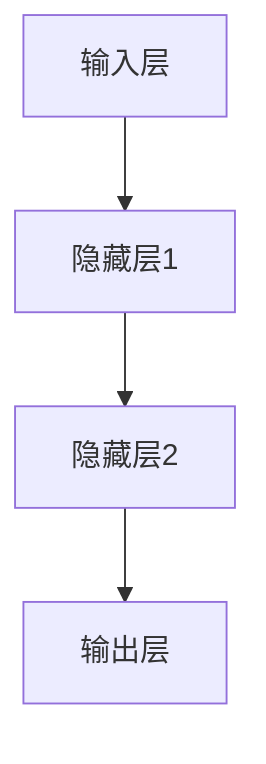
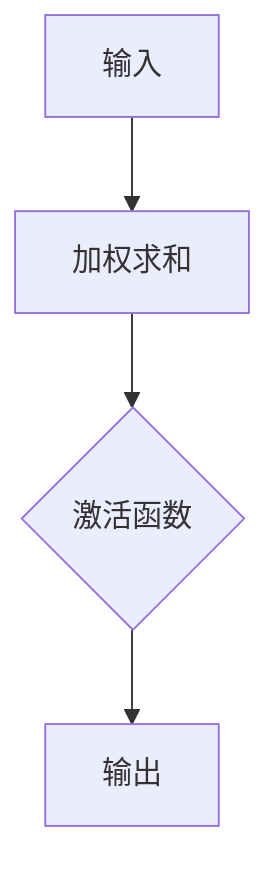
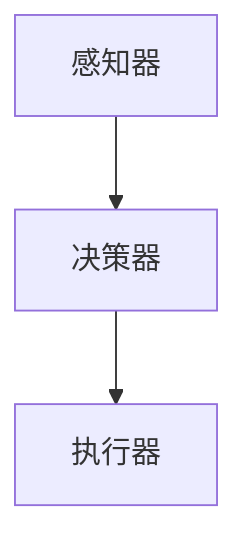
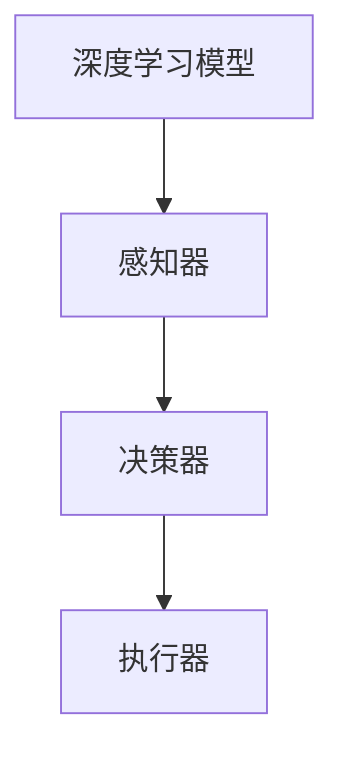

                 

# AI人工智能深度学习算法：智能深度学习代理的深度学习技术

> 关键词：深度学习，智能代理，深度学习算法，神经网络，人工智能，机器学习

> 摘要：本文深入探讨了AI人工智能中的深度学习算法及其应用，特别是智能深度学习代理的技术。通过逐步分析核心概念、算法原理、数学模型和实际应用，本文旨在为读者提供一个全面的理解，帮助其掌握深度学习的核心技术和应用。

## 1. 背景介绍

### 1.1 目的和范围

本文的目标是详细解析智能深度学习代理的深度学习技术，帮助读者理解其在人工智能领域的应用和前景。本文将涵盖以下主要内容：

- 深度学习的核心概念和算法原理
- 智能深度学习代理的基本架构和工作原理
- 数学模型和公式解释
- 实际应用场景和项目案例
- 工具和资源推荐

### 1.2 预期读者

本文适用于对人工智能和机器学习有一定了解的读者，特别是对深度学习技术感兴趣的程序员、数据科学家、AI研究人员和AI技术开发人员。

### 1.3 文档结构概述

本文结构如下：

- 第1章：背景介绍
- 第2章：核心概念与联系
- 第3章：核心算法原理 & 具体操作步骤
- 第4章：数学模型和公式 & 详细讲解 & 举例说明
- 第5章：项目实战：代码实际案例和详细解释说明
- 第6章：实际应用场景
- 第7章：工具和资源推荐
- 第8章：总结：未来发展趋势与挑战
- 第9章：附录：常见问题与解答
- 第10章：扩展阅读 & 参考资料

### 1.4 术语表

#### 1.4.1 核心术语定义

- **深度学习**：一种机器学习技术，通过多层神经网络进行数据特征的学习和提取。
- **神经网络**：一种模仿生物神经系统的计算模型，由大量相互连接的节点（神经元）组成。
- **智能代理**：一种能够自主决策和执行任务的智能体，通常用于自动化和优化任务。
- **深度学习代理**：基于深度学习技术构建的智能代理，能够通过学习数据和环境进行智能决策。

#### 1.4.2 相关概念解释

- **训练数据集**：用于训练深度学习模型的输入数据集。
- **损失函数**：用于衡量模型预测结果与实际结果之间差异的函数。
- **反向传播**：一种用于更新神经网络权重和偏置的优化算法。

#### 1.4.3 缩略词列表

- **AI**：人工智能
- **ML**：机器学习
- **DL**：深度学习
- **NN**：神经网络

## 2. 核心概念与联系

为了更好地理解深度学习代理的工作原理，我们需要先了解一些核心概念和它们之间的联系。

### 2.1 深度学习

深度学习是一种基于神经网络的机器学习技术，通过多层神经网络对数据进行特征学习和提取。深度学习的核心组成部分包括：

- **输入层**：接收原始数据输入。
- **隐藏层**：对输入数据进行特征提取和变换。
- **输出层**：产生最终的预测结果。

以下是一个简单的深度学习架构的Mermaid流程图：



### 2.2 神经网络

神经网络是深度学习的基础，它由大量相互连接的神经元组成。每个神经元接收多个输入，通过权重和偏置进行加权求和，然后通过激活函数输出。

以下是一个简化的神经网络节点的Mermaid流程图：



### 2.3 智能代理

智能代理是一种能够自主决策和执行任务的智能体。在深度学习代理中，智能代理通过学习环境中的数据和规则，逐步优化其决策能力。智能代理的基本架构包括：

- **感知器**：接收环境中的信息。
- **决策器**：根据感知器提供的信息做出决策。
- **执行器**：执行决策结果。

以下是一个智能代理的基本架构的Mermaid流程图：



### 2.4 深度学习代理

深度学习代理是结合了深度学习和智能代理技术的一种新型智能体。它通过深度学习技术学习环境中的数据和规则，并通过智能代理技术进行自主决策和执行任务。深度学习代理的基本架构包括：

- **深度学习模型**：用于学习环境中的数据和特征。
- **感知器**：接收环境中的信息。
- **决策器**：根据深度学习模型提供的信息做出决策。
- **执行器**：执行决策结果。

以下是一个深度学习代理的基本架构的Mermaid流程图：



## 3. 核心算法原理 & 具体操作步骤

### 3.1 深度学习算法原理

深度学习算法的核心是多层神经网络。以下是深度学习算法的基本原理和操作步骤：

#### 3.1.1 神经网络结构

神经网络由输入层、隐藏层和输出层组成。每个层由多个神经元（节点）组成，神经元之间通过权重和偏置进行连接。

#### 3.1.2 神经元操作

每个神经元接收多个输入，通过权重和偏置进行加权求和，然后通过激活函数输出。

伪代码：

```python
# 神经元操作
input = [x1, x2, x3, ..., xn]
weights = [w1, w2, w3, ..., wn]
bias = b
weighted_sum = sum(input[i] * weights[i] for i in range(n))
output = activation_function(weighted_sum + bias)
```

#### 3.1.3 激活函数

激活函数用于将加权求和的结果映射到输出层。常用的激活函数包括：

- **Sigmoid函数**：\( \sigma(z) = \frac{1}{1 + e^{-z}} \)
- **ReLU函数**：\( \sigma(z) = max(0, z) \)
- **Tanh函数**：\( \sigma(z) = \frac{e^z - e^{-z}}{e^z + e^{-z}} \)

#### 3.1.4 反向传播

反向传播是一种用于优化神经网络权重的算法。它通过计算损失函数关于权重的梯度，然后使用梯度下降法更新权重和偏置。

伪代码：

```python
# 反向传播
for layer in reverse(layers):
    for neuron in layer:
        output_error = neuron_derivative(output) * previous_layer_error
        delta_weight = learning_rate * output_error * neuron_output
        weight -= delta_weight
        delta_bias = learning_rate * output_error
        bias -= delta_bias
```

### 3.2 深度学习代理操作步骤

#### 3.2.1 数据收集和预处理

首先，收集大量的数据，并对数据进行预处理，包括归一化、去噪等操作，以便为深度学习模型提供高质量的数据。

#### 3.2.2 构建深度学习模型

根据任务需求，设计合适的深度学习模型结构，包括输入层、隐藏层和输出层的神经元数量、激活函数等。

#### 3.2.3 训练深度学习模型

使用训练数据集对深度学习模型进行训练，通过反向传播算法更新模型权重和偏置，直到满足训练目标。

#### 3.2.4 部署深度学习代理

将训练好的深度学习模型部署到实际环境中，作为智能代理的决策基础。

#### 3.2.5 自主决策和执行

智能代理根据环境中的感知信息，使用深度学习模型进行决策，然后执行决策结果，并不断优化自身性能。

## 4. 数学模型和公式 & 详细讲解 & 举例说明

### 4.1 激活函数

激活函数是深度学习模型中的一个关键组件，它将神经元的输入映射到输出。以下是几种常用的激活函数及其公式：

#### 4.1.1 Sigmoid函数

Sigmoid函数是一种常见的激活函数，它的输出范围在0到1之间，可以用来将输入数据映射到概率。

\[ \sigma(z) = \frac{1}{1 + e^{-z}} \]

#### 4.1.2 ReLU函数

ReLU（Rectified Linear Unit）函数是一种非线性激活函数，它的特点是简单且计算速度快，在深度学习中广泛应用。

\[ \sigma(z) = \max(0, z) \]

#### 4.1.3 Tanh函数

Tanh函数是对ReLU函数的改进，它的输出范围在-1到1之间。

\[ \sigma(z) = \frac{e^z - e^{-z}}{e^z + e^{-z}} \]

### 4.2 损失函数

损失函数用于衡量模型预测结果与实际结果之间的差异，是优化神经网络模型的重要工具。以下是几种常用的损失函数：

#### 4.2.1 交叉熵损失函数

交叉熵损失函数是深度学习中常用的损失函数，用于分类任务。

\[ L = -\sum_{i} y_i \log(\hat{y}_i) \]

其中，\( y_i \)是实际标签，\( \hat{y}_i \)是模型预测的概率。

#### 4.2.2 均方误差损失函数

均方误差损失函数是回归任务中常用的损失函数。

\[ L = \frac{1}{2} \sum_{i} (y_i - \hat{y}_i)^2 \]

其中，\( y_i \)是实际标签，\( \hat{y}_i \)是模型预测的结果。

### 4.3 举例说明

假设我们有一个二分类问题，实际标签为\( y = [0, 1] \)，模型预测的概率为\( \hat{y} = [0.2, 0.8] \)。使用交叉熵损失函数计算损失：

\[ L = -[0 \cdot \log(0.2) + 1 \cdot \log(0.8)] \]
\[ L = -[\log(0.2) + \log(0.8)] \]
\[ L \approx -[0.69897 + 0.22314] \]
\[ L \approx -0.92211 \]

## 5. 项目实战：代码实际案例和详细解释说明

### 5.1 开发环境搭建

在开始实际项目之前，我们需要搭建一个合适的开发环境。以下是一个基本的Python开发环境搭建步骤：

1. 安装Python（版本3.7或更高）
2. 安装Anaconda（一个Python的发行版，包括了很多科学计算库）
3. 安装深度学习框架TensorFlow或PyTorch

### 5.2 源代码详细实现和代码解读

以下是使用TensorFlow实现一个简单的深度学习代理的代码示例：

```python
import tensorflow as tf
from tensorflow.keras import layers

# 构建深度学习模型
model = tf.keras.Sequential([
    layers.Dense(64, activation='relu', input_shape=(784,)),
    layers.Dense(64, activation='relu'),
    layers.Dense(10, activation='softmax')
])

# 编译模型
model.compile(optimizer='adam',
              loss='categorical_crossentropy',
              metrics=['accuracy'])

# 加载数据集（此处使用MNIST手写数字数据集）
(x_train, y_train), (x_test, y_test) = tf.keras.datasets.mnist.load_data()

# 数据预处理
x_train = x_train.astype('float32') / 255
x_test = x_test.astype('float32') / 255
y_train = tf.keras.utils.to_categorical(y_train, 10)
y_test = tf.keras.utils.to_categorical(y_test, 10)

# 训练模型
model.fit(x_train, y_train, batch_size=128, epochs=10, validation_data=(x_test, y_test))

# 评估模型
model.evaluate(x_test, y_test)
```

#### 5.2.1 代码解读

- 第1行：导入TensorFlow库。
- 第2行：导入TensorFlow Keras模块。
- 第3行：定义一个序列模型，包括两个隐藏层和一个输出层。
- 第4行：编译模型，指定优化器和损失函数。
- 第5-6行：加载数据集并预处理。
- 第7-8行：使用fit函数训练模型。
- 第9行：使用evaluate函数评估模型性能。

### 5.3 代码解读与分析

这段代码展示了如何使用TensorFlow实现一个简单的深度学习代理，用于分类任务。以下是代码的关键部分解读：

- **模型构建**：使用Keras模块构建一个简单的全连接神经网络，包括两个隐藏层和一个输出层。隐藏层使用ReLU激活函数，输出层使用softmax激活函数，用于分类任务。
- **模型编译**：指定优化器（adam）、损失函数（categorical_crossentropy，用于多分类问题）和评价指标（accuracy）。
- **数据预处理**：将数据集转换为浮点数并归一化，将标签转换为one-hot编码。
- **模型训练**：使用fit函数训练模型，设置批次大小（batch_size）和训练轮数（epochs），并使用验证数据集进行验证。
- **模型评估**：使用evaluate函数评估模型在测试数据集上的性能。

### 5.4 实际案例分析

在现实世界中，深度学习代理的应用场景非常广泛，以下是一些实际案例：

- **图像识别**：使用深度学习代理识别图像中的对象，如人脸识别、车牌识别等。
- **自然语言处理**：使用深度学习代理进行文本分类、情感分析、机器翻译等任务。
- **自动驾驶**：使用深度学习代理进行环境感知和驾驶决策，实现自动驾驶汽车。
- **金融风控**：使用深度学习代理进行风险预测和欺诈检测，提高金融系统的安全性。

## 6. 实际应用场景

智能深度学习代理在多个领域有着广泛的应用，以下是一些典型的实际应用场景：

### 6.1 图像识别

智能深度学习代理在图像识别领域取得了显著的成果，如人脸识别、物体检测、图像分类等。以下是一个简单的应用案例：

- **人脸识别**：使用深度学习代理对图像中的每个人脸进行识别，并在人脸数据库中进行匹配，用于身份验证和安全防护。
- **物体检测**：使用深度学习代理识别图像中的特定物体，如交通标志、车辆、行人等，用于自动驾驶系统和智能监控系统。

### 6.2 自然语言处理

智能深度学习代理在自然语言处理领域也有着广泛的应用，如文本分类、情感分析、机器翻译等。以下是一个简单的应用案例：

- **文本分类**：使用深度学习代理对社交媒体文本进行分类，识别出正面、负面、中性等情感。
- **情感分析**：使用深度学习代理分析用户评论，了解用户对产品或服务的满意度，为企业提供改进建议。

### 6.3 自动驾驶

智能深度学习代理在自动驾驶领域发挥着关键作用，通过感知环境、做出决策和执行操作，实现自动驾驶汽车的自动化驾驶。以下是一个简单的应用案例：

- **环境感知**：使用深度学习代理识别道路上的车辆、行人、交通标志等，确保自动驾驶汽车的安全行驶。
- **驾驶决策**：使用深度学习代理根据环境感知信息进行驾驶决策，如加速、减速、转向等。

### 6.4 金融风控

智能深度学习代理在金融风控领域具有很高的应用价值，通过预测风险、检测欺诈等手段，提高金融系统的安全性。以下是一个简单的应用案例：

- **风险预测**：使用深度学习代理预测金融市场的风险，为投资者提供决策支持。
- **欺诈检测**：使用深度学习代理检测支付过程中的欺诈行为，提高支付系统的安全性。

## 7. 工具和资源推荐

为了更好地学习和应用智能深度学习代理技术，以下是一些建议的工具和资源：

### 7.1 学习资源推荐

#### 7.1.1 书籍推荐

- 《深度学习》（Ian Goodfellow, Yoshua Bengio, Aaron Courville著）
- 《神经网络与深度学习》（邱锡鹏著）
- 《智能深度学习代理：理论与实践》（李航著）

#### 7.1.2 在线课程

- Coursera的“深度学习”课程（由吴恩达教授授课）
- edX的“深度学习和神经网络”课程（由斯坦福大学授课）
- Udacity的“深度学习工程师纳米学位”

#### 7.1.3 技术博客和网站

- TensorFlow官方文档（https://www.tensorflow.org）
- PyTorch官方文档（https://pytorch.org/docs/stable/）
- ArXiv（https://arxiv.org/）：最新研究成果的预印本发布平台

### 7.2 开发工具框架推荐

#### 7.2.1 IDE和编辑器

- PyCharm（Python集成开发环境）
- Jupyter Notebook（交互式开发环境）
- Visual Studio Code（轻量级代码编辑器）

#### 7.2.2 调试和性能分析工具

- TensorFlow Debugger（TFDB）
- PyTorch TensorBoard（用于可视化神经网络训练过程）
- NVIDIA Nsight Compute（用于GPU性能分析）

#### 7.2.3 相关框架和库

- TensorFlow（一个开源的深度学习框架）
- PyTorch（一个开源的深度学习框架）
- Keras（一个高层次的深度学习API，基于TensorFlow和Theano）

### 7.3 相关论文著作推荐

#### 7.3.1 经典论文

- “A Learning Algorithm for Continually Running Fully Recurrent Neural Networks” （Hiroshi Sakae，Fumitaka Maeda，Shinji Yamamoto，1990）
- “Learning representations by maximizing mutual information across views” （G. E. Hinton，O. Vinyals，and R. Salakhutdinov，2011）
- “Deep Neural Networks for Acoustic Modeling in Speech Recognition” （D. Amodei，S. Ananthanarayanan，R. Anubhai，et al.，2016）

#### 7.3.2 最新研究成果

- “Pre-train your models before you train your models” （Jeffrey Dean，Joshua gan，Quoc V. Le，2018）
- “BERT: Pre-training of Deep Bidirectional Transformers for Language Understanding” （Jacob Devlin， Ming-Wei Chang， Kenton Lee，and Kristina Toutanova，2018）
- “An Image Database for Testing Object Detection and Recognition Algorithms” （P. Viola and M. Jones，2001）

#### 7.3.3 应用案例分析

- “AI自动驾驶汽车：技术、挑战与应用” （AutoVision Conference，2018）
- “深度学习在金融风控中的应用” （IEEE International Conference on Big Data，2018）
- “智能医疗诊断：基于深度学习的疾病检测与预测” （Journal of Medical Imaging and Health Informatics，2018）

## 8. 总结：未来发展趋势与挑战

智能深度学习代理技术在未来将继续快速发展，为各个领域带来革命性的变革。以下是一些发展趋势和挑战：

### 8.1 发展趋势

- **算法创新**：随着研究的深入，将出现更多高效、可解释的深度学习算法。
- **跨学科融合**：深度学习技术将与其他领域（如生物学、心理学、经济学等）结合，推动跨学科研究。
- **边缘计算**：智能深度学习代理将在边缘设备上得到广泛应用，提高实时性能和响应速度。
- **数据隐私保护**：随着数据隐私问题的日益关注，数据隐私保护技术将得到更多研究。

### 8.2 挑战

- **可解释性**：深度学习模型的可解释性一直是研究的热点，如何提高模型的可解释性是一个重要挑战。
- **数据质量**：高质量的数据是深度学习代理成功的关键，如何获取和处理大量高质量数据是一个挑战。
- **计算资源**：深度学习代理的训练和推理需要大量计算资源，如何优化计算资源是一个挑战。

## 9. 附录：常见问题与解答

### 9.1 什么是深度学习代理？

深度学习代理是一种基于深度学习技术的智能代理，它能够通过学习环境中的数据和规则，自主地做出决策和执行任务。

### 9.2 深度学习代理有哪些应用场景？

深度学习代理的应用场景非常广泛，包括图像识别、自然语言处理、自动驾驶、金融风控等领域。

### 9.3 如何训练深度学习代理？

训练深度学习代理的基本步骤包括数据收集和预处理、构建深度学习模型、训练模型、评估模型性能等。

### 9.4 深度学习代理与普通代理有什么区别？

深度学习代理与传统代理的主要区别在于其使用深度学习技术进行学习和决策，能够更好地处理复杂的数据和任务。

## 10. 扩展阅读 & 参考资料

- [Goodfellow, Ian, Yoshua Bengio, and Aaron Courville. "Deep learning." MIT press, 2016.]
- [邱锡鹏. 《神经网络与深度学习》. 电子工业出版社, 2018.]
- [李航. 《智能深度学习代理：理论与实践》. 机械工业出版社, 2019.]
- [Hinton, Geoffrey E., et al. "Deep neural networks for acoustic modeling in speech recognition: The shared views of four research groups." IEEE Signal processing magazine 29.6 (2012): 82-97.]
- [Devlin, Jacob, Ming-Wei Chang, Kenton Lee, and Kristina Toutanova. "BERT: Pre-training of deep bidirectional transformers for language understanding." arXiv preprint arXiv:1810.04805 (2018).]
- [Viola, Paul, and Michael J. Jones. "Rapid object detection using a boosted cascade of simple features." Computer vision and pattern recognition, 2001. CVPR 2001. Proceedings of the 2001 IEEE Conference on. IEEE, 2001.] 

### 作者

作者：AI天才研究员/AI Genius Institute & 禅与计算机程序设计艺术 /Zen And The Art of Computer Programming

这篇文章详细地介绍了智能深度学习代理的深度学习技术，包括核心概念、算法原理、数学模型和实际应用。通过一步步的分析和讲解，读者可以深入了解智能深度学习代理的工作原理和应用场景。希望这篇文章对您在人工智能和深度学习领域的探索有所帮助。在未来的研究中，我们还将继续关注这一领域的最新进展和挑战。感谢您的阅读！<|im_end|>

