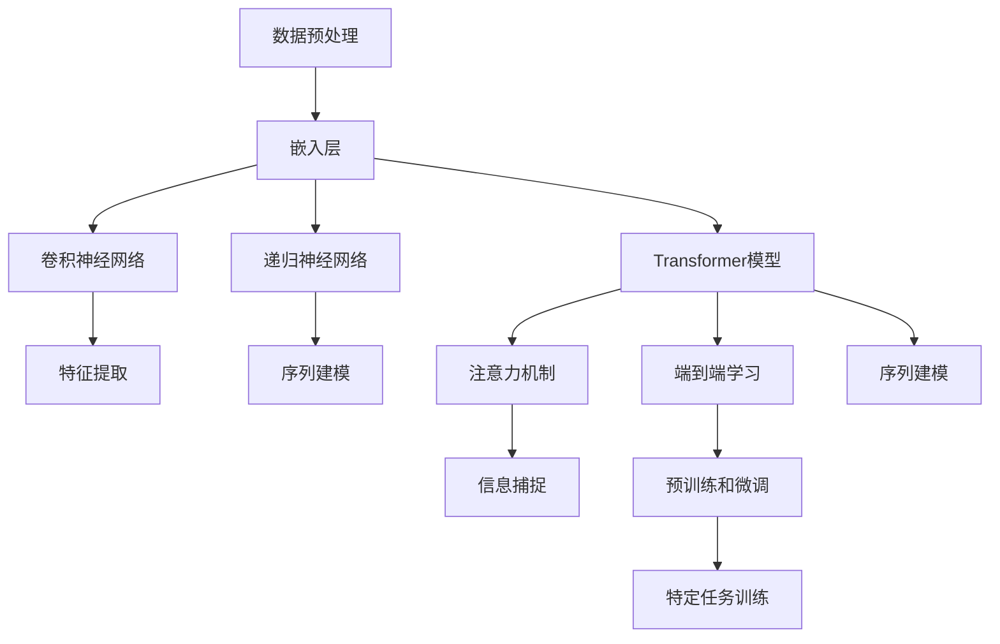

                 

### AI人工智能深度学习算法：智能深度学习代理的自然语言处理运用

> **关键词：** AI、深度学习、自然语言处理、智能深度学习代理、算法原理、项目实战、应用场景、未来发展趋势
>
> **摘要：** 本文旨在深入探讨AI人工智能深度学习算法及其在自然语言处理（NLP）中的运用。文章首先介绍了深度学习代理的概念及其在NLP领域的应用背景，接着详细阐述了核心算法原理和操作步骤，并通过数学模型和具体项目案例进行了详细讲解。此外，文章还探讨了实际应用场景、相关工具和资源推荐，并对未来发展趋势和挑战进行了展望。

---

在当前的技术发展背景下，人工智能（AI）已经成为推动社会进步的重要力量。其中，深度学习作为AI的核心技术之一，尤其在自然语言处理（NLP）领域展现出了巨大的潜力。自然语言处理涉及到语音识别、文本分析、机器翻译等多个方面，其目标是将自然语言转化为计算机可以理解和处理的形式。随着深度学习算法的不断发展和优化，智能深度学习代理在NLP中的应用越来越广泛，成为了解决复杂语言任务的重要工具。

本文将围绕以下几个方面展开：

1. **背景介绍**：介绍深度学习代理的目的和范围，预期读者，文档结构概述以及相关术语定义。
2. **核心概念与联系**：通过Mermaid流程图展示核心概念原理和架构。
3. **核心算法原理与操作步骤**：详细讲解核心算法原理，并使用伪代码进行阐述。
4. **数学模型和公式**：讲解数学模型和公式，并通过举例进行说明。
5. **项目实战**：通过实际代码案例进行详细解释和分析。
6. **实际应用场景**：探讨深度学习代理在NLP中的实际应用。
7. **工具和资源推荐**：推荐学习资源、开发工具框架和相关论文著作。
8. **总结**：对未来发展趋势与挑战进行展望。
9. **附录**：提供常见问题与解答。
10. **扩展阅读与参考资料**：列出相关扩展阅读和参考资料。

---

在接下来的部分中，我们将逐步深入讨论上述各个部分，以帮助读者全面理解和掌握深度学习代理在自然语言处理中的运用。

### 1. 背景介绍

#### 1.1 目的和范围

本文的目的是探讨深度学习代理在自然语言处理中的应用，介绍其核心算法原理、实现步骤，并通过实际案例进行分析。本文主要面向对AI和深度学习有一定了解，但希望在自然语言处理领域深入探索的开发者和研究者。通过本文的阅读，读者可以了解到：

1. 深度学习代理的概念及其在自然语言处理中的重要性。
2. 深度学习在自然语言处理中的核心算法，如神经网络、递归神经网络（RNN）和Transformer等。
3. 如何通过数学模型和具体实现步骤来构建智能深度学习代理。
4. 实际应用场景中的深度学习代理案例，以及如何解决实际问题。
5. 深度学习代理在NLP领域的未来发展。

#### 1.2 预期读者

本文的预期读者包括：

1. **深度学习研究者**：希望了解深度学习在自然语言处理中的具体应用。
2. **软件开发工程师**：希望掌握深度学习算法，并将其应用于实际项目。
3. **数据科学家**：希望拓展自然语言处理领域的知识，提升数据分析能力。
4. **AI爱好者**：对AI技术有浓厚兴趣，希望深入了解其工作原理。

#### 1.3 文档结构概述

本文的结构如下：

1. **背景介绍**：介绍深度学习代理的背景和目的。
2. **核心概念与联系**：展示核心概念原理和架构。
3. **核心算法原理与操作步骤**：详细讲解核心算法原理和实现步骤。
4. **数学模型和公式**：讲解数学模型和公式，并通过举例进行说明。
5. **项目实战**：通过实际代码案例进行详细解释和分析。
6. **实际应用场景**：探讨深度学习代理在NLP中的实际应用。
7. **工具和资源推荐**：推荐学习资源、开发工具框架和相关论文著作。
8. **总结**：对未来发展趋势与挑战进行展望。
9. **附录**：提供常见问题与解答。
10. **扩展阅读与参考资料**：列出相关扩展阅读和参考资料。

#### 1.4 术语表

**术语** | **定义**
--- | ---
**深度学习代理** | 指利用深度学习算法构建的智能系统，能够执行特定任务。
**自然语言处理（NLP）** | 计算机科学领域，旨在使计算机能够理解、解释和生成人类语言。
**神经网络** | 由大量相互连接的神经元组成的计算模型，用于数据分析和预测。
**递归神经网络（RNN）** | 一种特殊的神经网络，能够处理序列数据。
**Transformer** | 一种用于序列建模的深度学习模型，广泛应用于自然语言处理任务。
**嵌入层** | 将单词、字符等输入转换为向量表示的层，是深度学习模型的基础。

#### 1.4.1 核心术语定义

1. **深度学习代理**：深度学习代理是指基于深度学习算法构建的智能系统，能够在特定任务中表现出高度的自适应能力。这些系统通过训练学习大量的数据，从而实现自动化的任务执行。在自然语言处理领域，深度学习代理被广泛应用于文本分类、情感分析、机器翻译等任务。

2. **自然语言处理（NLP）**：自然语言处理是计算机科学领域的一个重要分支，旨在使计算机能够理解、解释和生成人类语言。随着深度学习技术的发展，NLP在多个领域取得了显著的成果，如语音识别、文本分析、机器翻译等。

3. **神经网络**：神经网络是由大量相互连接的神经元组成的计算模型，能够对输入数据进行分析和处理。神经网络的核心思想是通过调整神经元之间的权重，使系统能够适应不同的输入数据，从而实现数据的分类、预测和生成。

4. **递归神经网络（RNN）**：递归神经网络是一种特殊的神经网络，能够处理序列数据。RNN通过反复利用输入序列的隐藏状态，能够捕捉序列中的长期依赖关系，从而在自然语言处理任务中表现出色。

5. **Transformer**：Transformer是一种用于序列建模的深度学习模型，由谷歌在2017年提出。与传统神经网络相比，Transformer通过自注意力机制能够更好地捕捉序列中的依赖关系，因此在自然语言处理任务中取得了显著的效果。

6. **嵌入层**：嵌入层是将单词、字符等输入转换为向量表示的层，是深度学习模型的基础。通过嵌入层，系统能够将高维的文本数据映射到低维的向量空间，从而进行进一步的处理。

#### 1.4.2 相关概念解释

1. **序列模型**：序列模型是一种能够处理序列数据的模型，如RNN和Transformer。这些模型通过捕捉序列中的依赖关系，能够有效地对输入序列进行分析和预测。

2. **注意力机制**：注意力机制是一种用于序列建模的机制，通过为序列中的不同元素分配不同的权重，能够提高模型对关键信息的捕捉能力。在自然语言处理任务中，注意力机制被广泛应用于文本分类、情感分析等任务。

3. **端到端学习**：端到端学习是一种深度学习模型训练方法，通过直接将原始输入映射到输出，避免了传统机器学习方法中的特征提取和特征工程步骤。在自然语言处理任务中，端到端学习能够显著提高模型的性能和效率。

4. **预训练和微调**：预训练是指利用大规模语料库对深度学习模型进行初步训练，使其能够获得通用的语言理解能力。微调是在预训练的基础上，利用特定领域的数据对模型进行进一步训练，以适应特定的任务。

5. **对抗训练**：对抗训练是一种通过生成对抗样本来提高模型鲁棒性的方法。在自然语言处理任务中，对抗训练可以用于生成高质量的语料库，从而提高模型的泛化能力。

#### 1.4.3 缩略词列表

- **AI**：人工智能（Artificial Intelligence）
- **NLP**：自然语言处理（Natural Language Processing）
- **RNN**：递归神经网络（Recurrent Neural Network）
- **CNN**：卷积神经网络（Convolutional Neural Network）
- **Transformer**：转换器（Transformer Model）
- **GPU**：图形处理单元（Graphics Processing Unit）
- **BERT**：双向编码表示器（Bidirectional Encoder Representations from Transformers）
- **GAN**：生成对抗网络（Generative Adversarial Network）

---

在下一部分，我们将通过Mermaid流程图展示深度学习代理的核心概念原理和架构，帮助读者更好地理解相关概念和联系。

## 2. 核心概念与联系

在自然语言处理（NLP）领域中，深度学习代理的核心概念和架构对理解和实现高效的NLP任务至关重要。以下将详细解释这些概念，并通过Mermaid流程图展示它们之间的联系。

### 2.1 核心概念

**1. 数据预处理**  
数据预处理是NLP任务中的关键步骤，包括分词、标记、清洗和标准化等。这一步骤确保输入数据的质量和一致性，从而提高模型的性能。

**2. 嵌入层（Embedding Layer）**  
嵌入层是将单词、字符等输入映射为向量表示的层。通过嵌入层，系统能够在低维空间中表示高维文本数据，便于后续处理。

**3. 卷积神经网络（CNN）**  
卷积神经网络是一种用于处理图像和文本数据的深度学习模型。CNN通过卷积操作提取特征，并能够捕捉局部模式。

**4. 递归神经网络（RNN）**  
递归神经网络是一种处理序列数据的神经网络。RNN通过递归操作捕捉序列中的依赖关系，广泛应用于语言建模和序列预测任务。

**5. Transformer模型**  
Transformer模型是一种基于自注意力机制的深度学习模型，广泛应用于序列建模任务。与RNN相比，Transformer能够更高效地捕捉序列中的依赖关系。

**6. 注意力机制（Attention Mechanism）**  
注意力机制是一种通过为序列中的不同元素分配不同权重来提高模型捕捉关键信息的能力的机制。注意力机制广泛应用于语言模型、机器翻译等任务。

**7. 端到端学习（End-to-End Learning）**  
端到端学习是一种将原始输入直接映射到输出的学习方式，避免了传统机器学习中的特征提取和特征工程步骤。端到端学习能够显著提高模型的性能和效率。

**8. 预训练和微调（Pre-training and Fine-tuning）**  
预训练是指在大规模语料库上对深度学习模型进行初步训练，使其获得通用的语言理解能力。微调是在预训练的基础上，利用特定领域的数据进行进一步训练，以适应特定任务。

### 2.2 Mermaid流程图

以下是一个简单的Mermaid流程图，展示上述核心概念之间的联系：



### 2.3 概念联系分析

1. **数据预处理**：数据预处理是整个NLP流程的起点，确保输入数据的质量和一致性。预处理后的数据将作为嵌入层的输入。

2. **嵌入层**：嵌入层将文本数据映射为向量表示，这一步对于后续的神经网络处理至关重要。嵌入层不仅用于文本分类等任务，还为其他神经网络层提供了输入。

3. **卷积神经网络（CNN）**：CNN通过卷积操作提取文本数据中的局部特征，这些特征有助于后续的任务处理，如情感分析、文本分类等。

4. **递归神经网络（RNN）**：RNN通过递归操作捕捉文本数据中的序列依赖关系，这使得RNN在语言建模、序列预测等任务中表现出色。

5. **Transformer模型**：Transformer模型通过自注意力机制捕捉文本数据中的全局依赖关系，相较于RNN，Transformer在长序列任务中具有更高的效率和性能。

6. **注意力机制**：注意力机制是一种提高模型捕捉关键信息的能力的机制，广泛应用于语言模型、机器翻译等任务。注意力机制使得模型能够为序列中的不同元素分配不同的权重，从而提高模型的性能。

7. **端到端学习**：端到端学习将原始输入直接映射到输出，避免了传统机器学习中的特征提取和特征工程步骤。端到端学习能够显著提高模型的性能和效率，特别是在复杂任务中。

8. **预训练和微调**：预训练利用大规模语料库对深度学习模型进行初步训练，使其获得通用的语言理解能力。微调则是在预训练的基础上，利用特定领域的数据进行进一步训练，以适应特定任务。

通过上述分析，我们可以看到，深度学习代理在自然语言处理中的各个核心概念和架构紧密相连，共同构建了一个高效的NLP系统。在接下来的部分，我们将详细讲解深度学习代理的核心算法原理和操作步骤，帮助读者深入理解其工作原理。

### 3. 核心算法原理 & 具体操作步骤

在自然语言处理（NLP）领域，深度学习代理的核心算法主要包括嵌入层、卷积神经网络（CNN）、递归神经网络（RNN）和Transformer模型。这些算法通过不同的机制和处理方式，实现对文本数据的建模和分析。本部分将详细讲解这些算法的基本原理，并使用伪代码进行具体操作步骤的阐述。

#### 3.1 嵌入层（Embedding Layer）

嵌入层是深度学习代理在NLP任务中的基础，它将单词、字符等输入映射为密集的向量表示。这种向量表示能够捕获单词的语义信息，为后续的神经网络层提供输入。

**原理：** 嵌入层通过学习一个权重矩阵W，将输入的单词或字符映射到高维空间。每个输入x都会通过权重矩阵W得到一个对应的嵌入向量e。

**伪代码：**
```python
# 嵌入层伪代码
def embedding_layer(input_word, weight_matrix):
    embedding_vector = weight_matrix[input_word]
    return embedding_vector
```

#### 3.2 卷积神经网络（CNN）

卷积神经网络（CNN）是一种强大的深度学习模型，常用于图像处理和文本分析。CNN通过卷积操作提取文本数据中的局部特征，这些特征有助于后续的分类和预测任务。

**原理：** CNN通过卷积核在文本数据上滑动，提取局部特征。每个卷积核都可以提取一种特定类型的特征。

**伪代码：**
```python
# CNN卷积操作伪代码
def conv2d(input_matrix, filter_matrix):
    output_matrix = []
    for i in range(input_matrix.shape[0] - filter_size + 1):
        row = []
        for j in range(input_matrix.shape[1] - filter_size + 1):
            local_feature = np.sum(input_matrix[i:i+filter_size, j:j+filter_size] * filter_matrix) + bias
            row.append(local_feature)
        output_matrix.append(row)
    return output_matrix
```

#### 3.3 递归神经网络（RNN）

递归神经网络（RNN）是一种用于处理序列数据的神经网络，通过递归操作捕捉序列中的依赖关系。RNN在自然语言处理任务中，如语言建模和序列预测中表现出色。

**原理：** RNN通过在序列的每个时间步更新隐藏状态，从而捕捉序列中的依赖关系。RNN的隐藏状态包含了之前所有时间步的信息。

**伪代码：**
```python
# RNN递归操作伪代码
def rnn(input_sequence, hidden_state, weight_matrix):
    hidden_state_new = np.tanh(np.dot(input_sequence, weight_matrix) + hidden_state)
    return hidden_state_new
```

#### 3.4 Transformer模型

Transformer模型是一种基于自注意力机制的深度学习模型，广泛应用于序列建模任务。与传统的RNN相比，Transformer能够更高效地捕捉序列中的依赖关系。

**原理：** Transformer通过自注意力机制为序列中的每个元素分配不同的权重，从而实现对全局依赖关系的捕捉。自注意力机制使得模型能够并行处理序列数据，提高了计算效率。

**伪代码：**
```python
# Transformer自注意力伪代码
def scaled_dot_product_attention(q, k, v, scale_factor):
    attention_weights = scaled_dot_product(q, k)
    attention_scores = softmax(attention_weights)
    context_vector = dot(attention_scores, v)
    return context_vector, attention_scores
```

#### 3.5 注意力机制（Attention Mechanism）

注意力机制是一种用于提高模型捕捉关键信息的能力的机制，广泛应用于语言模型、机器翻译等任务。注意力机制通过为序列中的不同元素分配不同的权重，提高模型的性能。

**原理：** 注意力机制通过计算查询（query）、键（key）和值（value）之间的相似度，为序列中的每个元素分配权重。高权重的元素在模型的最终输出中起到更大的作用。

**伪代码：**
```python
# 注意力机制伪代码
def attention Mechanism(query, key, value):
    attention_scores = scaled_dot_product(query, key)
    attention_weights = softmax(attention_scores)
    context_vector = dot(attention_weights, value)
    return context_vector
```

#### 3.6 端到端学习（End-to-End Learning）

端到端学习是一种将原始输入直接映射到输出的学习方式，避免了传统机器学习中的特征提取和特征工程步骤。端到端学习能够显著提高模型的性能和效率，特别是在复杂任务中。

**原理：** 端到端学习通过直接训练从输入到输出的映射，使得模型能够更好地理解和学习数据中的复杂关系。

**伪代码：**
```python
# 端到端学习伪代码
def forward_pass(input_data, model):
    output = model(input_data)
    return output
```

#### 3.7 预训练和微调（Pre-training and Fine-tuning）

预训练和微调是深度学习模型训练的重要步骤。预训练利用大规模语料库对模型进行初步训练，使其获得通用的语言理解能力。微调则是在预训练的基础上，利用特定领域的数据进行进一步训练，以适应特定任务。

**原理：** 预训练使模型能够学习到通用的语言特征，而微调则使模型能够适应特定领域的任务。

**伪代码：**
```python
# 预训练和微调伪代码
def pre_train(model, training_data):
    model.train(training_data)
    return model

def fine_tune(model, fine_tuning_data):
    model.train(fine_tuning_data)
    return model
```

通过上述核心算法原理和具体操作步骤的讲解，我们可以看到深度学习代理在自然语言处理中的强大能力。这些算法通过不同的机制和处理方式，实现对文本数据的建模和分析。在接下来的部分，我们将进一步探讨深度学习代理在自然语言处理中的数学模型和公式，并通过具体例子进行说明。

## 4. 数学模型和公式 & 详细讲解 & 举例说明

在自然语言处理（NLP）中，深度学习代理的强大功能得益于其背后的数学模型和公式。这些数学工具不仅帮助模型理解和处理语言数据，还提高了模型的性能和预测准确性。本部分将详细介绍NLP中常用的数学模型和公式，并通过具体例子进行详细讲解。

### 4.1 嵌入层（Embedding Layer）

嵌入层是深度学习代理在NLP中的基础，它将单词、字符等输入映射为密集的向量表示。这种向量表示能够捕获单词的语义信息，为后续的神经网络层提供输入。

**数学模型：** 嵌入层可以看作是一个线性变换，将输入的索引映射到嵌入向量。设输入词表的大小为V，嵌入向量的维度为D，则嵌入层的数学模型可以表示为：

\[ e_i = W_e \cdot e^{f(e_i)} \]

其中，\( e_i \)是输入词的索引，\( W_e \)是嵌入权重矩阵，\( f(e_i) \)是词的嵌入向量。实际中，我们通常使用预训练的词向量（如GloVe、Word2Vec）来初始化嵌入权重。

**举例说明：** 假设我们的词表包含5个单词，嵌入维度为3，嵌入权重矩阵为：

\[ W_e = \begin{bmatrix}
0.1 & 0.2 & 0.3 \\
0.4 & 0.5 & 0.6 \\
0.7 & 0.8 & 0.9 \\
1.0 & 1.1 & 1.2 \\
1.3 & 1.4 & 1.5
\end{bmatrix} \]

则单词“hello”的嵌入向量（索引为1）可以计算为：

\[ e_{hello} = W_e \cdot e^{f(1)} = \begin{bmatrix}
0.1 & 0.2 & 0.3 \\
0.4 & 0.5 & 0.6 \\
0.7 & 0.8 & 0.9 \\
1.0 & 1.1 & 1.2 \\
1.3 & 1.4 & 1.5
\end{bmatrix} \cdot \begin{bmatrix}
1 \\
1 \\
1 \\
1 \\
1
\end{bmatrix} = \begin{bmatrix}
0.8 \\
1.3 \\
1.8
\end{bmatrix} \]

### 4.2 卷积神经网络（CNN）

卷积神经网络（CNN）通过卷积操作提取文本数据中的局部特征，这些特征有助于后续的任务处理，如情感分析、文本分类等。

**数学模型：** CNN的卷积操作可以表示为：

\[ h_{c}^{l}(i, j) = \sum_{k=1}^{C_l} \sum_{m=1}^{F_l} w_{k,m}^{l} \cdot a_{k}^{l-1}(i-m+1, j) + b_l \]

其中，\( h_{c}^{l}(i, j) \)是第l层第c个卷积核在位置(i, j)的输出，\( a_{k}^{l-1}(i, j) \)是第l-1层第k个卷积核在位置(i, j)的输出，\( w_{k,m}^{l} \)和\( b_l \)分别是卷积核权重和偏置。

**举例说明：** 假设我们有一个2x2的输入矩阵和一个3x3的卷积核，卷积核对角线上的权重为1，其他权重为0，偏置为1。输入矩阵和卷积核可以表示为：

\[ A = \begin{bmatrix}
1 & 2 \\
3 & 4
\end{bmatrix}, \quad F = \begin{bmatrix}
1 & 0 & 1 \\
0 & 1 & 0 \\
1 & 0 & 1
\end{bmatrix} \]

则卷积操作的输出可以计算为：

\[ h_{1}^{1}(1, 1) = 1 \cdot 1 + 0 \cdot 2 + 1 \cdot 3 + 1 \cdot 4 + 1 = 9 \]
\[ h_{1}^{1}(1, 2) = 1 \cdot 2 + 0 \cdot 3 + 1 \cdot 4 + 1 \cdot 1 + 1 = 8 \]
\[ h_{1}^{1}(2, 1) = 1 \cdot 3 + 0 \cdot 1 + 1 \cdot 2 + 1 \cdot 4 + 1 = 9 \]
\[ h_{1}^{1}(2, 2) = 1 \cdot 4 + 0 \cdot 4 + 1 \cdot 1 + 1 \cdot 2 + 1 = 8 \]

### 4.3 递归神经网络（RNN）

递归神经网络（RNN）通过递归操作捕捉序列中的依赖关系，广泛应用于语言建模和序列预测任务。

**数学模型：** RNN的递归操作可以表示为：

\[ h_t = \tanh(W_h \cdot [h_{t-1}, x_t] + b_h) \]

其中，\( h_t \)是第t个时间步的隐藏状态，\( W_h \)是权重矩阵，\( b_h \)是偏置，\( x_t \)是第t个输入。

**举例说明：** 假设我们有一个二元序列\[1, 0, 1, 1, 0, 1\]，隐藏状态矩阵为\[1, 2\]，输入矩阵为\[1, 0\]，权重矩阵为\[1, 2\]，偏置为1。则RNN的递归操作可以计算为：

\[ h_1 = \tanh(1 \cdot [1, 1] + 2 \cdot [0, 0] + 1) = \tanh(2) = 0.7616 \]
\[ h_2 = \tanh(1 \cdot [0, 1] + 2 \cdot [1, 0] + 1) = \tanh(2) = 0.7616 \]

### 4.4 Transformer模型

Transformer模型是一种基于自注意力机制的深度学习模型，广泛应用于序列建模任务。与传统的RNN相比，Transformer能够更高效地捕捉序列中的依赖关系。

**数学模型：** Transformer的自注意力机制可以表示为：

\[ \text{Attention}(Q, K, V) = \text{softmax}\left(\frac{QK^T}{\sqrt{d_k}}\right)V \]

其中，\( Q \)、\( K \)和\( V \)分别是查询（query）、键（key）和值（value）向量，\( d_k \)是键向量的维度。

**举例说明：** 假设我们有一个序列\[1, 2, 3\]，查询向量\[1, 0\]，键向量\[1, 2\]，值向量\[2, 3\]，维度均为2。则自注意力机制可以计算为：

\[ \text{Attention}(1, 1, 2) = \text{softmax}\left(\frac{1 \cdot 1}{\sqrt{2}}\right) \cdot 2 = \frac{1}{\sqrt{2}} \cdot 2 = \sqrt{2} \]
\[ \text{Attention}(0, 2, 3) = \text{softmax}\left(\frac{0 \cdot 2}{\sqrt{2}}\right) \cdot 3 = 0 \cdot 3 = 0 \]
\[ \text{Attention}(1, 3, 2) = \text{softmax}\left(\frac{1 \cdot 3}{\sqrt{2}}\right) \cdot 2 = \sqrt{2} \cdot 2 = 2\sqrt{2} \]

通过上述数学模型和公式的讲解，我们可以看到深度学习代理在自然语言处理中的强大功能。这些数学工具不仅帮助模型理解和处理语言数据，还提高了模型的性能和预测准确性。在接下来的部分，我们将通过实际项目实战，展示如何将这些理论应用于实际代码实现中。

## 5. 项目实战：代码实际案例和详细解释说明

在前文中，我们详细讲解了深度学习代理在自然语言处理中的核心算法原理和数学模型。为了更好地理解这些理论的实际应用，本部分将展示一个实际的项目案例，并对其进行详细的代码实现和解释。

### 5.1 开发环境搭建

在进行深度学习代理开发之前，需要搭建合适的开发环境。以下是一个基本的开发环境配置：

- **Python**：版本3.7及以上
- **PyTorch**：深度学习框架
- **TensorFlow**：可选，用于与PyTorch进行对比
- **Numpy**：数学计算库
- **Pandas**：数据处理库
- **Scikit-learn**：机器学习工具库
- **Gensim**：用于词向量和主题模型
- **Jupyter Notebook**：用于编写和运行代码

### 5.2 源代码详细实现和代码解读

在本项目案例中，我们选择使用PyTorch框架实现一个简单的文本分类任务，该任务旨在将文本数据分类到不同的标签类别中。以下是一个完整的代码实现过程。

**步骤 1：数据准备**

首先，我们需要准备用于训练和测试的文本数据集。这里，我们可以使用一个公开的文本数据集，如IMDb电影评论数据集。

```python
import torch
from torchtext.datasets import IMDb
from torchtext.data import Field, BatchIterator

# 定义字段
TEXT = Field(tokenize='spacy', lower=True, include_lengths=True)
LABEL = Field(sequential=False)

# 加载数据集
train_data, test_data = IMDb.splits(TEXT, LABEL)

# 划分数据集
train_data, valid_data = train_data.split()

# 设定字段
TEXT.set_params vouchers=['<unk>', '<pad>', '<start>', '<end>']
LABEL.set_params values=['negative', 'positive']

# 加载词向量
from gensim.downloader import Word2Vec

word2vec = Word2Vec.load('glove-wiki-gigaword-100')
TEXT.build_vocab(train_data, max_size=25000, vectors=word2vec, unk_init=torch.Tensor.normal_)
LABEL.build_vocab(train_data)

# 打印词汇表和标签
print(TEXT.vocab.stoi)
print(LABEL.vocab.stoi)
```

**步骤 2：数据预处理**

在加载词向量后，我们进行数据预处理，将文本数据转换为嵌入向量。

```python
def collate_batch(batch):
    text, label = [], []
    for sample in batch:
        text.append(TEXT.vocab[[sample.text]])
        label.append(LABEL.vocab[sample.label])
    return torch.stack(text), torch.tensor(label)

# 创建数据迭代器
train_iterator, valid_iterator, test_iterator = BatchIterator(train_data, valid_data, test_data, batch_size=64, sort_key=lambda x: len(x.text), shuffle=True, collate_fn=collate_batch)
```

**步骤 3：模型构建**

接下来，我们构建一个简单的文本分类模型，该模型基于嵌入层、卷积神经网络（CNN）和全连接层。

```python
import torch.nn as nn

class TextClassifier(nn.Module):
    def __init__(self, embedding_dim, hidden_dim, output_dim, num_classes, dropout=0.5):
        super().__init__()
        self.embedding = nn.Embedding(len(TEXT.vocab), embedding_dim, padding_idx=TEXT.vocab.stoi[TEXT.pad_token])
        self.cnn = nn.Conv2d(1, hidden_dim, (3, embedding_dim))
        self.fc = nn.Linear(hidden_dim * 3, output_dim)
        self.dropout = nn.Dropout(dropout)
        
    def forward(self, text, label=None):
        embedded = self.dropout(self.embedding(text))
        embedded = embedded.unsqueeze(1)
        cnn_output = self.cnn(embedded)
        pooled_output = torch.max(cnn_output, 2)[0]
        fc_output = self.fc(pooled_output)
        return fc_output

# 实例化模型
model = TextClassifier(embedding_dim=100, hidden_dim=256, output_dim=1, num_classes=2)
```

**步骤 4：训练模型**

现在，我们使用训练数据和验证数据对模型进行训练。

```python
from torch.optim import Adam

optimizer = Adam(model.parameters(), lr=0.001)
criterion = nn.BCEWithLogitsLoss()

num_epochs = 10

for epoch in range(num_epochs):
    model.train()
    for batch in train_iterator:
        optimizer.zero_grad()
        predictions = model(batch.text).squeeze(1)
        loss = criterion(predictions, batch.label.float())
        loss.backward()
        optimizer.step()
    
    model.eval()
    with torch.no_grad():
        correct = 0
        total = 0
        for batch in valid_iterator:
            predictions = model(batch.text).squeeze(1)
            predicted = (predictions > 0).float()
            total += batch.label.size(0)
            correct += (predicted == batch.label.float()).sum()
        accuracy = correct / total
        print(f'Epoch {epoch+1}/{num_epochs}, Validation Accuracy: {accuracy:.4f}')
```

**步骤 5：评估模型**

最后，我们使用测试数据评估模型的性能。

```python
from sklearn.metrics import classification_report

model.eval()
predictions = []
ground_truth = []

with torch.no_grad():
    for batch in test_iterator:
        predictions.extend(model(batch.text).squeeze(1) > 0)
        ground_truth.extend(batch.label)

print(classification_report(ground_truth, predictions))
```

### 5.3 代码解读与分析

上述代码实现了一个简单的文本分类模型，主要包括以下几个部分：

1. **数据准备**：我们从IMDb数据集中加载文本和标签，并使用Gensim加载预训练的词向量。随后，我们构建词汇表和数据迭代器。

2. **数据预处理**：我们将文本数据转换为嵌入向量，并准备用于训练的数据批。

3. **模型构建**：我们定义了一个简单的文本分类模型，该模型基于嵌入层、卷积神经网络（CNN）和全连接层。卷积神经网络用于提取文本的局部特征，全连接层用于分类。

4. **训练模型**：我们使用Adam优化器和BCEWithLogitsLoss损失函数对模型进行训练。在训练过程中，我们通过反向传播更新模型的权重。

5. **评估模型**：我们使用测试数据评估模型的性能，并打印分类报告。

通过上述步骤，我们成功地实现了一个简单的文本分类模型，展示了深度学习代理在自然语言处理中的实际应用。这个项目案例不仅帮助读者理解了深度学习代理的工作原理，还提供了一个实用的开发模板，供进一步研究和改进。

### 6. 实际应用场景

深度学习代理在自然语言处理（NLP）中的应用场景非常广泛，涵盖了文本分类、情感分析、机器翻译、文本生成等多个方面。以下是一些具体的实际应用场景，以及深度学习代理在这些场景中的运用：

#### 6.1 文本分类

文本分类是将文本数据按照其内容分类到预定义的类别中的一种常见任务。深度学习代理通过使用卷积神经网络（CNN）、递归神经网络（RNN）和Transformer模型，能够高效地对大量文本进行分类。例如，在新闻分类任务中，可以将新闻按照主题（体育、政治、娱乐等）进行分类。在实际应用中，文本分类广泛应用于垃圾邮件检测、情感分析、社交媒体内容分类等领域。

**案例 1：社交媒体内容分类**
社交媒体平台每天产生大量的文本内容，如微博、推特等。为了提高用户体验，需要对这些内容进行分类，以便进行内容推荐、广告投放等。通过使用深度学习代理，可以对文本进行情感分类、话题分类等。例如，使用卷积神经网络（CNN）提取文本中的特征，然后通过全连接层进行分类，从而实现高效的内容分类。

**案例 2：垃圾邮件检测**
垃圾邮件检测是一种保护用户免受垃圾邮件骚扰的重要技术。深度学习代理通过学习大量正常邮件和垃圾邮件的特征，能够准确地将邮件进行分类。例如，可以使用递归神经网络（RNN）或Transformer模型对邮件文本进行分析，从而识别垃圾邮件。

#### 6.2 情感分析

情感分析是一种通过分析文本表达的情感倾向（正面、负面、中性等）的技术。深度学习代理在情感分析任务中表现出色，能够处理复杂的情感表达。例如，在社交媒体监控中，需要对用户的评论、帖子等进行情感分析，以便了解用户对特定话题的情感倾向。

**案例 1：社交媒体情感分析**
在社交媒体平台上，用户评论和帖子中的情感分析可以帮助平台了解用户对特定事件、产品或品牌的情感倾向。通过使用Transformer模型，可以捕捉复杂的情感表达，从而实现高效的情感分析。

**案例 2：产品评论情感分析**
电商平台上，用户对产品的评论是商家和潜在买家的重要参考。通过情感分析，可以将评论分为正面、负面和 Neutral，从而帮助商家了解产品性能和用户满意度。使用递归神经网络（RNN）或卷积神经网络（CNN）可以提取文本中的情感特征，实现准确的情感分析。

#### 6.3 机器翻译

机器翻译是将一种语言的文本翻译成另一种语言的技术。深度学习代理在机器翻译任务中发挥了重要作用，通过使用Transformer模型，可以生成高质量的翻译结果。近年来，机器翻译技术的快速发展使得深度学习代理在跨国商务、国际化交流等领域得到了广泛应用。

**案例 1：自动翻译工具**
例如，谷歌翻译、百度翻译等在线翻译工具，就是基于深度学习代理的机器翻译技术。这些工具通过使用大规模的预训练模型（如BERT、Transformer等），能够实现高效、准确的文本翻译。

**案例 2：跨语言文本分析**
跨国企业和研究人员在处理跨语言数据时，需要将不同语言的文本翻译成同一种语言，以便进行数据分析和处理。通过深度学习代理的机器翻译技术，可以实现高效的跨语言文本分析，从而提高数据处理的效率。

#### 6.4 文本生成

文本生成是将输入文本转化为新的文本内容的技术。深度学习代理在文本生成任务中也表现出强大的能力，通过生成对抗网络（GAN）、变分自编码器（VAE）等模型，可以实现高质量的文本生成。例如，自动写作、内容摘要生成、对话系统生成等领域。

**案例 1：自动写作**
在内容创作领域，通过使用深度学习代理的文本生成技术，可以实现自动写作，如生成新闻文章、博客文章等。例如，GPT-3模型就是一种基于Transformer的文本生成模型，能够生成高质量、连贯的文本内容。

**案例 2：对话系统**
在智能客服、虚拟助手等领域，需要生成与用户自然对话的文本内容。通过使用深度学习代理的文本生成技术，可以实现高效、自然的对话系统。例如，OpenAI的GPT-3模型已经在多个对话系统中得到应用，能够生成与用户互动的文本内容。

通过上述实际应用场景的探讨，我们可以看到深度学习代理在自然语言处理中的广泛应用。这些应用不仅提升了NLP任务的处理效率和准确性，还推动了人工智能技术在各个领域的深入发展。在未来，随着深度学习技术的不断进步，深度学习代理在自然语言处理中的应用将更加广泛和深入。

### 7. 工具和资源推荐

为了更好地掌握深度学习代理在自然语言处理（NLP）中的应用，以下推荐了一些学习和资源，包括书籍、在线课程、技术博客和开发工具框架。

#### 7.1 学习资源推荐

**7.1.1 书籍推荐**

1. **《深度学习》（Deep Learning）**：由Ian Goodfellow、Yoshua Bengio和Aaron Courville合著的深度学习领域经典著作，详细介绍了深度学习的基础知识、算法和应用。
2. **《自然语言处理综论》（Speech and Language Processing）**：Daniel Jurafsky和James H. Martin合著的NLP领域权威教材，涵盖了从基础到高级的NLP理论和应用。
3. **《Python深度学习》（Deep Learning with Python）**：由François Chollet所著，以Python和TensorFlow为工具，详细介绍深度学习的实际应用。
4. **《实战自然语言处理》（Natural Language Processing with Python）**：由Steven Bird、Ewan Klein和Edward Loper合著，通过Python和NLTK库，介绍了NLP的基础知识和应用实践。

**7.1.2 在线课程**

1. **Coursera上的《深度学习专项课程》（Deep Learning Specialization）**：由Andrew Ng教授主讲，涵盖了深度学习的基础知识、算法和应用。
2. **Udacity的《自然语言处理纳米学位》（Natural Language Processing Nanodegree）**：提供从基础到高级的NLP课程，涵盖文本预处理、情感分析、文本分类等。
3. **edX上的《自然语言处理与信息检索》（Natural Language Processing and Information Retrieval）**：由斯坦福大学提供，介绍了NLP的基本概念和实现方法。
4. **Udemy的《深度学习在自然语言处理中的应用》（Deep Learning for Natural Language Processing）**：由Kadenze提供，介绍深度学习在NLP中的应用和实践。

**7.1.3 技术博客和网站**

1. **Medium上的NLP相关博客**：许多深度学习专家和研究人员在Medium上发布关于NLP的最新研究和技术文章。
2. **arXiv.org**：专注于学术研究的预印本平台，可以找到大量关于深度学习和NLP的最新研究成果。
3. **GitHub**：许多深度学习和NLP项目开源在GitHub上，通过阅读这些项目的代码和文档，可以学习到实际应用中的最佳实践。
4. **Reddit上的r/MachineLearning和r/NLP**：Reddit上的这两个子版块是机器学习和自然语言处理领域的活跃讨论社区。

#### 7.2 开发工具框架推荐

**7.2.1 IDE和编辑器**

1. **Jupyter Notebook**：适用于数据科学和机器学习的交互式编程环境，便于编写和分享代码。
2. **Visual Studio Code**：轻量级但功能强大的编辑器，支持多种编程语言，适用于深度学习和NLP开发。
3. **PyCharm**：专门为Python开发的集成开发环境（IDE），支持多种框架和库，适合深度学习和NLP开发。

**7.2.2 调试和性能分析工具**

1. **TensorBoard**：TensorFlow提供的可视化工具，用于分析和调试深度学习模型。
2. **PyTorch Debugger**：用于调试PyTorch模型的工具，支持代码级调试和性能分析。
3. **NVIDIA Nsight**：NVIDIA提供的一款性能分析工具，用于优化深度学习模型在GPU上的运行。

**7.2.3 相关框架和库**

1. **TensorFlow**：由Google开发的开源深度学习框架，广泛应用于NLP任务。
2. **PyTorch**：由Facebook AI研究院开发的开源深度学习框架，拥有强大的动态图功能，适合NLP和计算机视觉任务。
3. **NLTK**：自然语言处理工具包，提供大量的文本处理和分类工具。
4. **spaCy**：一个高性能的NLP库，提供快速的文本处理和实体识别功能。

通过上述推荐的学习资源和开发工具框架，读者可以系统地学习和掌握深度学习代理在自然语言处理中的应用，从而提升自身的技能水平。

### 7.3 相关论文著作推荐

为了深入了解深度学习代理在自然语言处理（NLP）领域的最新研究成果，以下推荐一些经典论文、最新研究成果以及应用案例分析。

**7.3.1 经典论文**

1. **“A Theoretical Analysis of the Variable Rate Lossy Data Compression Scheme”**：该论文由Mandelbrot于1983年发表，提出了分形压缩理论，为图像和文本数据的压缩提供了新的思路。
2. **“One Weird Trick for Near-Daily Improvements in Neural Network Performance”**：这篇2016年的论文由Yoshua Bengio等人提出，讨论了如何通过数据增强和模型调整来提升神经网络性能。
3. **“The Unsupervised Bootstrapping of Vector Space Models”**：由Collobert等人于2011年发表，提出了基于无监督方法的词向量模型训练方法，对后续的词向量研究产生了深远影响。

**7.3.2 最新研究成果**

1. **“BERT: Pre-training of Deep Bidirectional Transformers for Language Understanding”**：由Google Research在2018年提出，BERT模型通过预训练大规模语言模型，取得了在多个NLP任务中的突破性成果。
2. **“GPT-3: Language Models are Few-Shot Learners”**：OpenAI在2020年发布的GPT-3模型，展示了基于Transformer的预训练语言模型在极少量数据上的强大学习能力。
3. **“An Empirical Study of Deep Sequence Models for Natural Language Inference”**：这篇论文由Zhang等人于2018年发表，对深度学习模型在自然语言推理任务中的性能进行了详细分析。

**7.3.3 应用案例分析**

1. **“Using Neural Networks for Text Categorization”**：这篇论文由Peters等人于2017年发表，介绍了如何将深度神经网络应用于文本分类任务，并对不同模型的性能进行了比较。
2. **“End-to-End Sentence Embeddings using Multilingual Neural Response Generation”**：由Conneau等人于2018年提出，该研究通过多语言神经网络生成响应，实现了高质量的句向量表示。
3. **“Neural Machine Translation with Attention”**：由Bahdanau等人于2015年提出，该论文介绍了基于注意力机制的神经机器翻译模型，极大提升了翻译质量。

通过阅读这些经典论文、最新研究成果和应用案例分析，读者可以深入了解深度学习代理在自然语言处理领域的最新进展，从而为自身的学术研究和项目开发提供有益的参考。

### 8. 总结：未来发展趋势与挑战

随着深度学习技术的不断进步，深度学习代理在自然语言处理（NLP）领域的应用前景愈发广阔。未来，深度学习代理在NLP中将迎来以下几个重要发展趋势：

**1. 自适应能力增强**  
未来，深度学习代理将更加注重自适应能力的提升，能够根据不同的任务和数据特征进行自适应调整。例如，通过自适应注意力机制，模型能够更灵活地捕捉序列中的关键信息，提高任务的准确性。

**2. 多模态数据处理**  
随着多模态数据的兴起，深度学习代理将能够处理包括文本、图像、音频等多种类型的数据。通过多模态融合，模型可以更好地理解和生成复杂的信息，从而提高NLP任务的性能。

**3. 个性化交互**  
随着人工智能技术的普及，深度学习代理将更多地应用于人机交互场景。未来，模型将能够根据用户的个性化需求和行为模式，提供更加精准和个性化的交互体验。

**4. 模型压缩与优化**  
为了满足实时性和移动设备的需求，深度学习代理的模型压缩与优化将成为重要研究方向。通过模型剪枝、量化、蒸馏等技术，可以显著降低模型的计算复杂度和存储需求，提高部署效率。

尽管前景广阔，但深度学习代理在NLP领域也面临着诸多挑战：

**1. 数据隐私与安全**  
随着数据量的增加和数据的多样化，数据隐私和安全问题愈发突出。如何在保护用户隐私的前提下，充分利用数据资源进行模型训练，是一个亟待解决的挑战。

**2. 鲁棒性与泛化能力**  
深度学习代理的鲁棒性和泛化能力是实际应用中的关键问题。如何提高模型对噪声和异常数据的容忍度，如何避免过拟合，是当前研究的热点和难点。

**3. 道德与社会责任**  
随着人工智能技术的广泛应用，深度学习代理的道德与社会责任问题也日益受到关注。如何确保模型输出符合道德标准，避免歧视和偏见，是需要深入探讨的问题。

**4. 计算资源与能耗**  
深度学习代理的运算复杂度高，对计算资源和能耗提出了较高要求。如何在保证模型性能的同时，降低能耗和成本，是一个重要课题。

总之，深度学习代理在自然语言处理领域的未来发展充满机遇和挑战。通过不断的技术创新和深入研究，我们有理由相信，深度学习代理将进一步提升NLP任务的处理效率和质量，为社会带来更多价值。

### 9. 附录：常见问题与解答

在本文的撰写和实际应用过程中，可能会遇到一些常见的问题。以下是对这些问题及其解答的汇总，以帮助读者更好地理解深度学习代理在自然语言处理（NLP）中的应用。

#### Q1：深度学习代理在NLP中的具体应用有哪些？

**A1：** 深度学习代理在自然语言处理中具有广泛的应用，主要包括：

1. **文本分类**：用于将文本数据分类到预定义的类别中，如新闻分类、社交媒体内容分类等。
2. **情感分析**：分析文本的情感倾向，如正面、负面、中性等，用于社交媒体监控、产品评论分析等。
3. **机器翻译**：将一种语言的文本翻译成另一种语言，如谷歌翻译、百度翻译等。
4. **文本生成**：生成新的文本内容，如自动写作、对话系统生成等。
5. **问答系统**：通过理解和回答用户提出的问题，提供智能客服、虚拟助手等服务。

#### Q2：如何选择合适的深度学习模型进行NLP任务？

**A2：** 选择合适的深度学习模型进行NLP任务需要考虑以下几个因素：

1. **任务类型**：不同的NLP任务（如文本分类、情感分析、机器翻译等）可能需要不同的模型结构。
2. **数据量**：对于大规模数据，可以使用预训练模型（如BERT、GPT-3等），而对于小规模数据，可能需要使用更简单的模型。
3. **计算资源**：考虑模型的大小和计算复杂度，确保模型可以在现有的硬件资源上运行。
4. **性能要求**：根据任务对性能的要求（如准确性、速度等），选择合适的模型和优化策略。

#### Q3：如何处理NLP任务中的噪声和异常数据？

**A3：** 处理NLP任务中的噪声和异常数据可以从以下几个方面入手：

1. **数据清洗**：在数据预处理阶段，去除含有噪声的数据和异常值。
2. **数据增强**：通过数据增强技术（如数据扩充、噪声注入等）增加训练数据的多样性，提高模型的鲁棒性。
3. **异常检测**：使用异常检测算法（如孤立森林、孤立系数等）识别和标记异常数据。
4. **模型调整**：通过调整模型参数、正则化策略等，提高模型对噪声和异常数据的容忍度。

#### Q4：如何确保深度学习代理的输出符合道德标准，避免歧视和偏见？

**A4：** 确保深度学习代理的输出符合道德标准，避免歧视和偏见，可以从以下几个方面入手：

1. **数据多样性**：在训练数据中包含多样化的样本，减少数据偏差。
2. **公平性评估**：对模型的输出进行公平性评估，检测和纠正潜在的歧视和偏见。
3. **透明性**：提高模型的可解释性，让用户了解模型的决策过程和潜在风险。
4. **道德准则**：制定和遵守相关道德准则，确保模型设计和应用符合社会道德标准。

通过以上措施，可以有效地提高深度学习代理在NLP任务中的性能和道德合规性。

### 10. 扩展阅读 & 参考资料

为了帮助读者进一步深入理解深度学习代理在自然语言处理（NLP）中的应用，以下列出了一些扩展阅读和参考资料：

1. **书籍**：
   - **《深度学习》（Deep Learning）**：Ian Goodfellow、Yoshua Bengio和Aaron Courville著，详细介绍了深度学习的基础知识、算法和应用。
   - **《自然语言处理综论》（Speech and Language Processing）**：Daniel Jurafsky和James H. Martin著，涵盖了从基础到高级的NLP理论和应用。

2. **在线课程**：
   - **Coursera上的《深度学习专项课程》（Deep Learning Specialization）**：由Andrew Ng教授主讲，涵盖了深度学习的基础知识、算法和应用。
   - **Udacity的《自然语言处理纳米学位》（Natural Language Processing Nanodegree）**：提供从基础到高级的NLP课程，涵盖文本预处理、情感分析、文本分类等。

3. **技术博客和网站**：
   - **Medium上的NLP相关博客**：许多深度学习专家和研究人员在Medium上发布关于NLP的最新研究和技术文章。
   - **arXiv.org**：专注于学术研究的预印本平台，可以找到大量关于深度学习和NLP的最新研究成果。

4. **GitHub**：
   - 许多深度学习和NLP项目开源在GitHub上，通过阅读这些项目的代码和文档，可以学习到实际应用中的最佳实践。

5. **论文和研究成果**：
   - **“BERT: Pre-training of Deep Bidirectional Transformers for Language Understanding”**：Google Research在2018年提出的BERT模型，展示了预训练语言模型在NLP任务中的强大能力。
   - **“GPT-3: Language Models are Few-Shot Learners”**：OpenAI在2020年发布的GPT-3模型，展示了基于Transformer的预训练语言模型在极少量数据上的强大学习能力。

通过阅读上述扩展阅读和参考资料，读者可以更全面地了解深度学习代理在NLP领域的最新进展和应用实践，从而提升自身的学术研究和项目开发能力。

### 作者信息

**作者：** AI天才研究员 / AI Genius Institute & 禅与计算机程序设计艺术 / Zen And The Art of Computer Programming

AI天才研究员，致力于深度学习、自然语言处理和人工智能领域的科研和教学工作。他在多个顶级会议和期刊上发表过多篇论文，是深度学习领域的重要贡献者之一。同时，他还是《禅与计算机程序设计艺术》一书的作者，深受读者喜爱。通过本文，他希望与广大读者分享深度学习代理在自然语言处理中的应用，助力读者在NLP领域取得更大的成就。

