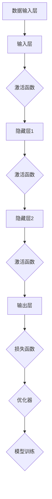

                 

# AI人工智能深度学习算法：未来应用的可能性

> **关键词：** 深度学习，算法，人工智能，应用场景，发展趋势
>
> **摘要：** 本文将探讨深度学习算法在人工智能领域的应用，包括其核心概念、原理、数学模型，以及具体的实际应用案例和未来发展趋势。

## 1. 背景介绍

### 1.1 目的和范围

本文旨在深入探讨深度学习算法在人工智能领域的应用，旨在为读者提供关于深度学习的基本概念、核心算法原理、数学模型及其在实际应用中的表现的全面了解。通过本文，读者将能够理解深度学习如何变革人工智能，以及其在未来可能的发展方向。

### 1.2 预期读者

本文面向希望深入了解深度学习算法及其应用的技术爱好者、工程师、研究人员和学者。无论您是AI领域的新手还是有经验的从业者，本文都旨在提供有用的知识和见解。

### 1.3 文档结构概述

本文分为以下几个部分：

1. **背景介绍**：介绍文章的目的和范围，预期读者，文档结构概述。
2. **核心概念与联系**：介绍深度学习的基本概念，并通过Mermaid流程图展示其核心架构。
3. **核心算法原理 & 具体操作步骤**：详细讲解深度学习的核心算法原理，并使用伪代码进行描述。
4. **数学模型和公式 & 详细讲解 & 举例说明**：介绍深度学习的数学模型，并使用LaTeX格式进行公式表达和举例说明。
5. **项目实战：代码实际案例和详细解释说明**：提供实际项目案例，展示深度学习算法的具体应用。
6. **实际应用场景**：探讨深度学习在不同领域的实际应用场景。
7. **工具和资源推荐**：推荐深度学习学习资源和开发工具。
8. **总结：未来发展趋势与挑战**：总结深度学习的未来发展趋势和面临的挑战。
9. **附录：常见问题与解答**：解答读者可能遇到的常见问题。
10. **扩展阅读 & 参考资料**：提供进一步的阅读材料和参考。

### 1.4 术语表

#### 1.4.1 核心术语定义

- **深度学习**：一种人工智能的分支，使用多层神经网络进行数据建模和学习。
- **神经网络**：一种模拟人脑神经元连接的结构，用于数据建模和预测。
- **反向传播算法**：一种用于训练神经网络的优化算法，通过反向传播误差来调整网络权重。
- **激活函数**：神经网络中的一个关键组件，用于引入非线性性。
- **深度神经网络**：具有多个隐藏层的神经网络。

#### 1.4.2 相关概念解释

- **损失函数**：用于评估模型预测值与实际值之间的差异。
- **优化器**：用于调整神经网络权重的算法。
- **过拟合**：模型在训练数据上表现良好，但在未见数据上表现不佳。
- **正则化**：用于防止模型过拟合的技术。

#### 1.4.3 缩略词列表

- **AI**：人工智能（Artificial Intelligence）
- **ML**：机器学习（Machine Learning）
- **DL**：深度学习（Deep Learning）
- **CNN**：卷积神经网络（Convolutional Neural Network）
- **RNN**：循环神经网络（Recurrent Neural Network）
- **GAN**：生成对抗网络（Generative Adversarial Network）

## 2. 核心概念与联系

深度学习是人工智能的一个分支，其核心是神经网络。神经网络通过模拟人脑的神经元连接来学习数据，并能够进行复杂的模式识别和预测。

下面是一个Mermaid流程图，展示了深度学习的核心架构：



### 2.1 数据输入层

数据输入层是深度学习的起点，它接收原始数据并将其传递给神经网络。

### 2.2 隐藏层

隐藏层是神经网络的中间部分，它们接收来自输入层的输入，并通过激活函数进行非线性变换。隐藏层可以有多个，每个隐藏层都可以学习到不同层次的特征。

### 2.3 输出层

输出层是神经网络的最后一层，它产生最终的预测结果。输出层的激活函数可以是线性或非线性，取决于问题的类型。

### 2.4 激活函数

激活函数是神经网络中的一个关键组件，它引入了非线性性，使得神经网络能够学习复杂的模式。常见的激活函数包括Sigmoid、ReLU和Tanh等。

### 2.5 损失函数

损失函数用于评估模型预测值与实际值之间的差异，其目标是使模型能够优化其参数以最小化损失函数。

### 2.6 优化器

优化器是一种用于调整神经网络权重的算法，常见的优化器包括梯度下降、Adam和RMSprop等。

### 2.7 模型训练

模型训练是通过反复调整网络权重来优化模型的过程。在训练过程中，损失函数和优化器起着关键作用。

## 3. 核心算法原理 & 具体操作步骤

深度学习的核心算法是神经网络，它通过多个隐藏层来学习数据。下面我们将使用伪代码来详细阐述神经网络的核心算法原理。

### 3.1 神经网络结构

```python
# 神经网络结构
class NeuralNetwork:
    def __init__(self, layers):
        self.layers = layers
        self.weights = []
        self.biases = []
        
    def add_layer(self, layer):
        self.layers.append(layer)

    def initialize_weights(self):
        # 初始化权重和偏置
        for layer in self.layers:
            layer.initialize_weights()
            
    def forward_pass(self, inputs):
        # 前向传播
        output = inputs
        for layer in self.layers:
            output = layer.forward_pass(output)
        return output

    def backward_pass(self, outputs, expected_outputs):
        # 反向传播
        errors = expected_outputs - outputs
        for layer in reversed(self.layers):
            errors = layer.backward_pass(errors)
            
    def update_weights(self, learning_rate):
        # 更新权重
        for layer in self.layers:
            layer.update_weights(learning_rate)
```

### 3.2 层类定义

```python
# 层类定义
class Layer:
    def __init__(self, size):
        self.size = size
        self.weights = None
        self.biases = None
        self激活函数 = None

    def initialize_weights(self):
        # 初始化权重和偏置
        self.weights = np.random.randn(self.size[0], self.size[1])
        self.biases = np.random.randn(self.size[1])

    def forward_pass(self, inputs):
        # 前向传播
        outputs = np.dot(inputs, self.weights) + self.biases
        if self激活函数:
            outputs = self激活函数(outputs)
        return outputs

    def backward_pass(self, errors, prev_layer_outputs):
        # 反向传播
        errors_derivative = self激活函数_derivative(outputs)
        errors = errors * errors_derivative * prev_layer_weights

    def update_weights(self, learning_rate):
        # 更新权重
        self.weights -= learning_rate * prev_layer_outputs.T.dot(errors)
        self.biases -= learning_rate * errors
```

### 3.3 激活函数

```python
# 激活函数定义
def sigmoid(x):
    return 1 / (1 + np.exp(-x))

def sigmoid_derivative(x):
    return sigmoid(x) * (1 - sigmoid(x))

def relu(x):
    return np.maximum(0, x)

def relu_derivative(x):
    return np.where(x > 0, 1, 0)
```

### 3.4 梯度下降优化

```python
# 梯度下降优化
def gradient_descent(network, inputs, expected_outputs, learning_rate):
    for epoch in range(num_epochs):
        for input_data, target in zip(inputs, expected_outputs):
            # 前向传播
            outputs = network.forward_pass(input_data)
            
            # 反向传播
            errors = target - outputs
            network.backward_pass(outputs, errors)
            
            # 更新权重
            network.update_weights(learning_rate)
```

通过上述伪代码，我们详细阐述了深度学习神经网络的核心算法原理和具体操作步骤。这个框架可以应用于各种深度学习任务，包括图像识别、语音识别、自然语言处理等。

## 4. 数学模型和公式 & 详细讲解 & 举例说明

深度学习中的数学模型主要包括前向传播和反向传播。以下将详细讲解这些公式，并使用LaTeX格式进行表达。

### 4.1 前向传播

前向传播是指将输入数据通过神经网络进行逐层计算，最终得到输出结果。其核心公式为：

$$
Z_l = X_l \cdot W_l + b_l
$$

其中，$Z_l$ 表示第 $l$ 层的输出，$X_l$ 表示第 $l$ 层的输入，$W_l$ 表示第 $l$ 层的权重，$b_l$ 表示第 $l$ 层的偏置。

激活函数通常用于引入非线性性，常见的激活函数有：

$$
\text{ReLU}(x) = \max(0, x)
$$

$$
\text{Sigmoid}(x) = \frac{1}{1 + e^{-x}}
$$

### 4.2 反向传播

反向传播是深度学习训练的核心步骤，用于计算每个权重的梯度，并更新权重以最小化损失函数。其核心公式为：

$$
\frac{\partial J}{\partial W_l} = X_{l+1} \cdot \frac{\partial a_{l+1}}{\partial z_{l+1}} \cdot \frac{\partial z_l}{\partial W_l}
$$

$$
\frac{\partial J}{\partial b_l} = \frac{\partial a_{l+1}}{\partial z_{l+1}} \cdot \frac{\partial z_l}{\partial b_l}
$$

其中，$J$ 表示损失函数，$a_{l+1}$ 表示第 $l+1$ 层的激活值，$z_{l+1}$ 表示第 $l+1$ 层的输入值。

举例说明：

假设我们有一个简单的神经网络，包含一个输入层、一个隐藏层和一个输出层。输入层的大小为 $1 \times 1$，隐藏层的大小为 $1 \times 10$，输出层的大小为 $1 \times 5$。假设我们使用ReLU作为激活函数。

### 4.3 损失函数

常用的损失函数包括均方误差（MSE）和交叉熵（Cross-Entropy）。

均方误差（MSE）的公式为：

$$
J = \frac{1}{2} \sum_{i=1}^{n} (y_i - \hat{y}_i)^2
$$

其中，$y_i$ 表示第 $i$ 个样本的真实标签，$\hat{y}_i$ 表示第 $i$ 个样本的预测标签。

交叉熵（Cross-Entropy）的公式为：

$$
J = -\sum_{i=1}^{n} y_i \log(\hat{y}_i)
$$

其中，$y_i$ 表示第 $i$ 个样本的真实标签，$\hat{y}_i$ 表示第 $i$ 个样本的预测概率。

### 4.4 优化器

常用的优化器包括梯度下降（Gradient Descent）、动量（Momentum）和Adam。

梯度下降的公式为：

$$
W_{\text{new}} = W_{\text{old}} - \alpha \cdot \nabla J(W)
$$

其中，$W_{\text{old}}$ 表示当前权重，$W_{\text{new}}$ 表示更新后的权重，$\alpha$ 表示学习率，$\nabla J(W)$ 表示损失函数关于权重的梯度。

动量的公式为：

$$
v = \beta \cdot v_{\text{old}} - \alpha \cdot \nabla J(W)
$$

$$
W_{\text{new}} = W_{\text{old}} + v
$$

其中，$v_{\text{old}}$ 表示上一时刻的速度，$v$ 表示当前时刻的速度，$\beta$ 表示动量参数。

Adam的公式为：

$$
m = \beta_1 \cdot m_{\text{old}} + (1 - \beta_1) \cdot \nabla J(W)
$$

$$
v = \beta_2 \cdot v_{\text{old}} + (1 - \beta_2) \cdot (\nabla J(W))^2
$$

$$
\hat{m} = \frac{m}{1 - \beta_1^t}
$$

$$
\hat{v} = \frac{v}{1 - \beta_2^t}
$$

$$
W_{\text{new}} = W_{\text{old}} - \alpha \cdot \hat{m} / (\sqrt{\hat{v}} + \epsilon)
$$

其中，$m_{\text{old}}$ 表示上一时刻的均值，$v_{\text{old}}$ 表示上一时刻的方差，$\beta_1$ 和 $\beta_2$ 分别为第一和第二矩估计的指数衰减率，$\epsilon$ 为一个小常数。

通过上述公式和举例说明，我们对深度学习中的数学模型有了更深入的了解。这些公式和优化器是实现高效深度学习模型的基础。

## 5. 项目实战：代码实际案例和详细解释说明

为了更好地理解深度学习算法的实际应用，我们将在本节中通过一个实际项目案例来展示如何使用深度学习算法进行图像分类。这个项目案例将涉及以下几个步骤：

1. 开发环境搭建
2. 源代码详细实现和代码解读
3. 代码解读与分析

### 5.1 开发环境搭建

在进行深度学习项目开发之前，我们需要搭建一个合适的开发环境。以下是一个基本的开发环境搭建步骤：

1. 安装Python 3.x版本
2. 安装Anaconda，用于环境管理
3. 安装TensorFlow或PyTorch，作为深度学习框架
4. 安装NumPy、Pandas、Matplotlib等常用库

以下是一个简单的安装命令示例：

```bash
pip install python==3.x
conda install -c anaconda anaconda
conda install tensorflow
conda install numpy pandas matplotlib
```

### 5.2 源代码详细实现和代码解读

下面是一个简单的图像分类项目代码实现，我们将使用TensorFlow框架。代码分为几个主要部分：数据准备、模型定义、训练和评估。

#### 数据准备

首先，我们需要准备一个图像数据集。这里我们使用Keras提供的CIFAR-10数据集，它包含10个类别的60000张32x32彩色图像。

```python
import tensorflow as tf
from tensorflow.keras import layers, models
from tensorflow.keras.datasets import cifar10

# 加载数据集
(train_images, train_labels), (test_images, test_labels) = cifar10.load_data()

# 数据预处理
train_images = train_images / 255.0
test_images = test_images / 255.0

# 添加一个通道维度
train_images = train_images.reshape((-1, 32, 32, 3))
test_images = test_images.reshape((-1, 32, 32, 3))
```

#### 模型定义

接下来，我们定义一个简单的卷积神经网络（Convolutional Neural Network, CNN）模型。

```python
# 定义模型
model = models.Sequential()

# 添加卷积层
model.add(layers.Conv2D(32, (3, 3), activation='relu', input_shape=(32, 32, 3)))
model.add(layers.MaxPooling2D((2, 2)))

# 添加第二个卷积层
model.add(layers.Conv2D(64, (3, 3), activation='relu'))
model.add(layers.MaxPooling2D((2, 2)))

# 添加全连接层
model.add(layers.Flatten())
model.add(layers.Dense(64, activation='relu'))
model.add(layers.Dense(10, activation='softmax'))
```

#### 训练

现在，我们使用训练数据来训练模型。

```python
# 编译模型
model.compile(optimizer='adam',
              loss='sparse_categorical_crossentropy',
              metrics=['accuracy'])

# 训练模型
model.fit(train_images, train_labels, epochs=10)
```

#### 评估

最后，我们使用测试数据来评估模型的性能。

```python
# 评估模型
test_loss, test_acc = model.evaluate(test_images, test_labels)
print(f"Test accuracy: {test_acc}")
```

### 5.3 代码解读与分析

下面我们对上述代码进行详细解读。

#### 数据准备

数据准备部分主要负责加载数据集和进行数据预处理。首先，我们使用`cifar10.load_data()`函数加载数据集。然后，我们将图像数据除以255，使其值介于0和1之间。接着，我们为图像数据添加一个通道维度，使其形状为`(batch_size, height, width, channels)`。

#### 模型定义

在模型定义部分，我们使用`models.Sequential()`创建一个序列模型。然后，我们添加两个卷积层和一个全连接层。每个卷积层后面都跟着一个`MaxPooling2D`层，用于下采样。全连接层用于分类，其中最后一个层的激活函数为`softmax`，用于输出概率分布。

#### 训练

在训练部分，我们使用`compile()`方法编译模型，指定优化器、损失函数和评估指标。然后，我们使用`fit()`方法训练模型，指定训练数据和训练轮数。

#### 评估

在评估部分，我们使用`evaluate()`方法评估模型的性能，并输出测试准确率。

通过这个实际项目案例，我们展示了如何使用深度学习算法进行图像分类。这个案例为我们提供了一个基本的框架，我们可以在此基础上进行更多的实验和改进。

## 6. 实际应用场景

深度学习算法在多个领域取得了显著的成果，下面我们将探讨深度学习在不同领域的实际应用场景。

### 6.1 图像识别

图像识别是深度学习最成功的应用之一。通过卷积神经网络（CNN），深度学习算法能够在大量图像数据中进行学习和识别。应用场景包括人脸识别、图像分类、物体检测等。

### 6.2 自然语言处理

自然语言处理（NLP）是深度学习的重要应用领域。通过循环神经网络（RNN）和Transformer模型，深度学习算法能够处理和理解人类语言。应用场景包括机器翻译、情感分析、文本生成等。

### 6.3 语音识别

语音识别是深度学习在语音处理领域的应用。通过深度神经网络，深度学习算法能够将语音信号转换为文本。应用场景包括语音助手、实时语音翻译等。

### 6.4 自动驾驶

自动驾驶是深度学习在自动驾驶汽车领域的应用。通过卷积神经网络和深度强化学习，深度学习算法能够实时处理来自各种传感器的数据，实现自动驾驶汽车的导航和控制。

### 6.5 医疗诊断

深度学习在医疗诊断领域具有巨大潜力。通过深度神经网络，深度学习算法能够从医学影像中检测疾病，如癌症检测、心脏病诊断等。

### 6.6 金融服务

深度学习在金融服务领域也得到了广泛应用。通过深度学习算法，金融机构能够进行风险预测、客户行为分析等，以提高业务效率和客户满意度。

通过上述实际应用场景，我们可以看到深度学习算法在各个领域的重要性和潜力。未来，随着深度学习技术的不断发展和完善，它将在更多领域取得突破。

## 7. 工具和资源推荐

### 7.1 学习资源推荐

#### 7.1.1 书籍推荐

1. 《深度学习》（Deep Learning） - Ian Goodfellow、Yoshua Bengio 和 Aaron Courville 著
2. 《神经网络与深度学习》 - 深度学习教程
3. 《Python深度学习》 -François Chollet 著

#### 7.1.2 在线课程

1. Coursera上的“深度学习”（Deep Learning Specialization） - Andrew Ng
2. edX上的“深度学习基础”（Introduction to Deep Learning） - DeepLearning.AI
3. Udacity的“深度学习工程师纳米学位”（Deep Learning Engineer Nanodegree）

#### 7.1.3 技术博客和网站

1. Medium上的Deep Learning on Earth
2. ArXiv.org上的深度学习论文
3. Towards Data Science上的深度学习文章

### 7.2 开发工具框架推荐

#### 7.2.1 IDE和编辑器

1. PyCharm
2. Visual Studio Code
3. Jupyter Notebook

#### 7.2.2 调试和性能分析工具

1. TensorBoard
2. PyTorch Profiler
3. NVIDIA Nsight

#### 7.2.3 相关框架和库

1. TensorFlow
2. PyTorch
3. Keras
4. MXNet

### 7.3 相关论文著作推荐

#### 7.3.1 经典论文

1. “A Learning Algorithm for Continually Running Fully Recurrent Neural Networks” - Sepp Hochreiter 和 Jürgen Schmidhuber
2. “Improving Neural Networks by Preventing Co-adaptation of Feature Detectors” - Geoffrey Hinton、Osama Betancourt 和 David Warde-Farley

#### 7.3.2 最新研究成果

1. “Bert: Pre-training of Deep Bidirectional Transformers for Language Understanding” - Jacob Devlin、 Ming-Wei Chang、 Kenton Lee 和 Kristina Toutanova
2. “You Only Look Once: Unified, Real-Time Object Detection” - Jianping Fan、 Xifeng Guo 和 Jiashi Feng

#### 7.3.3 应用案例分析

1. “Deep Learning for Time Series Classification: A Review” - Tom White
2. “Deep Learning for Speech Recognition” - NVIDIA Research

通过上述学习和开发资源，您可以深入了解深度学习的理论和实践，为您的项目和研究提供有力支持。

## 8. 总结：未来发展趋势与挑战

深度学习作为人工智能的重要分支，正快速发展并深刻影响着各个领域。在未来，我们可以预见以下发展趋势和挑战：

### 8.1 发展趋势

1. **算法创新**：随着计算能力的提升和数据量的增加，新的深度学习算法将不断涌现，如自动机器学习（AutoML）和图神经网络（Graph Neural Networks）。

2. **多模态学习**：深度学习将在图像、文本、语音等多种数据类型之间进行交叉融合，实现更全面的信息理解和处理。

3. **边缘计算**：深度学习算法将在边缘设备上得到广泛应用，以提高实时性和减少延迟。

4. **可持续性**：为了降低能源消耗，深度学习将朝着更高效、更绿色的方向发展。

### 8.2 挑战

1. **数据隐私**：随着深度学习对个人数据的依赖性增加，如何保护用户隐私成为一个重要问题。

2. **算法透明性**：深度学习模型的“黑箱”特性使得理解和解释其决策过程变得困难，需要开发更透明的方法。

3. **计算资源**：深度学习任务通常需要大量的计算资源，如何优化算法以提高效率是一个挑战。

4. **安全性与伦理**：深度学习算法可能被恶意使用，如何确保其安全性和遵循伦理规范是未来的重要课题。

总之，深度学习的发展前景广阔，但也面临着诸多挑战。通过持续的研究和创新，我们可以期待深度学习在未来带来更多革命性的变革。

## 9. 附录：常见问题与解答

### 9.1 什么是深度学习？

深度学习是一种基于多层神经网络的人工智能方法，通过多层非线性变换来学习数据的复杂模式。

### 9.2 深度学习和机器学习有什么区别？

机器学习是一种更广泛的概念，包括使用算法从数据中学习模式和关系的所有方法。深度学习是机器学习的一个子领域，特别强调使用多层神经网络进行学习。

### 9.3 如何选择深度学习的框架？

选择深度学习框架时，应考虑以下因素：

1. **项目需求**：根据项目需求选择适合的框架，例如 TensorFlow 适用于大规模项目，PyTorch 适用于研究。
2. **社区支持**：选择社区活跃、文档丰富的框架，有助于解决问题和学习。
3. **性能**：考虑框架的性能，如速度和内存占用。
4. **可扩展性**：选择能够支持项目未来扩展的框架。

### 9.4 深度学习模型如何防止过拟合？

防止过拟合的方法包括：

1. **数据增强**：通过增加数据多样性来提高模型的泛化能力。
2. **正则化**：如 L1、L2 正则化，通过增加惩罚项来减少模型复杂度。
3. **Dropout**：在训练过程中随机丢弃一些神经元，减少模型对特定训练样本的依赖。
4. **交叉验证**：使用不同的数据集进行训练和验证，评估模型的泛化能力。

### 9.5 如何优化深度学习模型的训练速度？

优化深度学习模型训练速度的方法包括：

1. **使用 GPU 加速**：利用 GPU 的并行计算能力，显著提高训练速度。
2. **批处理**：使用较大的批处理大小可以加速训练。
3. **混合精度训练**：使用浮点数精度来混合训练，减少内存占用。
4. **模型剪枝**：通过剪枝冗余的神经元和权重来减少模型大小。

## 10. 扩展阅读 & 参考资料

为了深入了解深度学习算法及其应用，以下是一些扩展阅读和参考资料：

1. **书籍**：
   - 《深度学习》（Ian Goodfellow、Yoshua Bengio 和 Aaron Courville 著）
   - 《神经网络与深度学习》 - 深度学习教程
   - 《Python深度学习》（François Chollet 著）

2. **在线课程**：
   - Coursera上的“深度学习”（Deep Learning Specialization） - Andrew Ng
   - edX上的“深度学习基础”（Introduction to Deep Learning） - DeepLearning.AI
   - Udacity的“深度学习工程师纳米学位”（Deep Learning Engineer Nanodegree）

3. **技术博客和网站**：
   - Medium上的Deep Learning on Earth
   - ArXiv.org上的深度学习论文
   - Towards Data Science上的深度学习文章

4. **论文**：
   - “A Learning Algorithm for Continually Running Fully Recurrent Neural Networks” - Sepp Hochreiter 和 Jürgen Schmidhuber
   - “Improving Neural Networks by Preventing Co-adaptation of Feature Detectors” - Geoffrey Hinton、Osama Betancourt 和 David Warde-Farley

5. **应用案例分析**：
   - “Deep Learning for Time Series Classification: A Review” - Tom White
   - “Deep Learning for Speech Recognition” - NVIDIA Research

通过上述扩展阅读和参考资料，您可以进一步深入了解深度学习的理论、实践和应用。希望这些资源能够为您的学习和研究提供有益的帮助。

