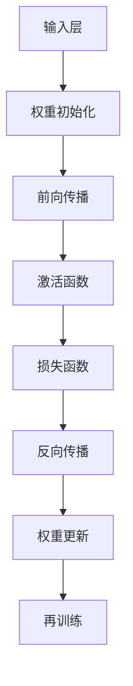

                 

# AI人工智能深度学习算法：权重初始化与激活函数选择

> 关键词：权重初始化、激活函数、深度学习、神经网络、算法优化

> 摘要：本文将深入探讨权重初始化和激活函数选择在深度学习算法中的应用。我们将首先介绍这两个核心概念，然后通过逐步分析，解释它们如何影响神经网络的性能。本文还将提供实际案例，帮助读者更好地理解这些概念在实际开发中的应用。

## 1. 背景介绍

### 1.1 目的和范围

本文的目标是帮助读者深入理解权重初始化和激活函数选择在深度学习算法中的重要性。我们将从基础概念出发，逐步探讨这些概念如何影响神经网络的训练效果和性能。

### 1.2 预期读者

本文面向对深度学习有一定了解的读者，无论是初级研究人员还是经验丰富的开发者。读者应熟悉基本的神经网络和深度学习概念。

### 1.3 文档结构概述

本文将分为以下几个部分：

1. 核心概念与联系
2. 核心算法原理与具体操作步骤
3. 数学模型和公式与详细讲解
4. 项目实战：代码实际案例和详细解释说明
5. 实际应用场景
6. 工具和资源推荐
7. 总结：未来发展趋势与挑战
8. 附录：常见问题与解答
9. 扩展阅读与参考资料

### 1.4 术语表

#### 1.4.1 核心术语定义

- **权重初始化**：初始化神经网络中权重参数的过程。
- **激活函数**：神经网络中的一个非线性函数，用于引入非线性特征。
- **深度学习**：一种机器学习技术，通过多层神经网络模拟人脑的感知和学习过程。

#### 1.4.2 相关概念解释

- **神经网络**：一种基于生物神经系统的计算模型。
- **前向传播**：神经网络中从输入层到输出层的信号传递过程。
- **反向传播**：神经网络中用于计算梯度并更新权重的过程。

#### 1.4.3 缩略词列表

- **MLP**：多层感知器（Multi-Layer Perceptron）
- **ReLU**：ReLU函数（Rectified Linear Unit）
- **Sigmoid**：Sigmoid函数

## 2. 核心概念与联系

在深度学习中，权重初始化和激活函数的选择对于模型的性能至关重要。以下是一个简化的Mermaid流程图，展示了这两个核心概念与神经网络架构的联系。



这个流程图展示了神经网络中从输入层到输出层的信号传递过程，以及权重初始化、激活函数、损失函数和反向传播等核心环节。

## 3. 核心算法原理与具体操作步骤

### 3.1 权重初始化原理

权重初始化的目的是为了使神经网络在训练过程中能够快速收敛。常用的权重初始化方法包括随机初始化、高斯初始化和Xavier初始化等。

#### 随机初始化

随机初始化是最简单的方法，权重随机分配在某个范围内。但是，这种方法可能导致网络在训练初期梯度消失或爆炸。

```python
# 伪代码：随机初始化权重
import numpy as np

def random_weight_init(shape):
    return np.random.uniform(-1, 1, shape)
```

#### 高斯初始化

高斯初始化通过从高斯分布中采样权重来减少梯度消失和爆炸的风险。

```python
# 伪代码：高斯初始化权重
import numpy as np

def gaussian_weight_init(shape, mean=0, std=1):
    return np.random.normal(mean, std, shape)
```

#### Xavier初始化

Xavier初始化是一种基于均方根值的方法，旨在平衡前一层和后一层的梯度。

```python
# 伪代码：Xavier初始化权重
import numpy as np

def xavier_weight_init(shape):
    fan_in, fan_out = shape[0], shape[1]
    std = 1 / np.sqrt(fan_in + fan_out)
    return np.random.normal(0, std, shape)
```

### 3.2 激活函数原理

激活函数是神经网络中的一个关键组件，用于引入非线性特征。以下是一些常用的激活函数：

#### Sigmoid函数

Sigmoid函数将输入映射到(0, 1)区间。

$$
\sigma(x) = \frac{1}{1 + e^{-x}}
$$

#### ReLU函数

ReLU函数是最受欢迎的激活函数之一，它将负输入映射为0，正输入映射为其本身。

$$
\text{ReLU}(x) = \max(0, x)
$$

#### Tanh函数

Tanh函数将输入映射到(-1, 1)区间。

$$
\tanh(x) = \frac{e^x - e^{-x}}{e^x + e^{-x}}
$$

### 3.3 权重初始化与激活函数的具体操作步骤

1. **定义神经网络结构**：根据任务需求，设计神经网络的结构，包括层数、每层的神经元数量等。
2. **选择权重初始化方法**：根据神经网络的结构，选择合适的权重初始化方法。
3. **选择激活函数**：根据神经网络的性质和任务，选择合适的激活函数。
4. **初始化权重**：使用选择的权重初始化方法来初始化权重。
5. **构建神经网络**：使用选择的激活函数构建神经网络。

## 4. 数学模型和公式与详细讲解

### 4.1 权重初始化数学模型

权重初始化的数学模型主要涉及到随机分布的选择。以下是几种常用权重初始化方法的公式：

#### 随机初始化

$$
W \sim U(-a, a)
$$

其中，$a$ 是随机分布的区间大小。

#### 高斯初始化

$$
W \sim N(\mu, \sigma^2)
$$

其中，$\mu$ 和 $\sigma^2$ 分别是高斯分布的均值和方差。

#### Xavier初始化

$$
W \sim N(0, \frac{2}{n_{\text{in}} + n_{\text{out}}})
$$

其中，$n_{\text{in}}$ 和 $n_{\text{out}}$ 分别是当前层和下一层的神经元数量。

### 4.2 激活函数数学模型

以下是几种常用激活函数的数学模型：

#### Sigmoid函数

$$
\sigma(x) = \frac{1}{1 + e^{-x}}
$$

#### ReLU函数

$$
\text{ReLU}(x) = \max(0, x)
$$

#### Tanh函数

$$
\tanh(x) = \frac{e^x - e^{-x}}{e^x + e^{-x}}
$$

### 4.3 激活函数的导数

激活函数的导数是反向传播算法中的关键部分。以下是几种常用激活函数的导数：

#### Sigmoid函数的导数

$$
\sigma'(x) = \sigma(x) \cdot (1 - \sigma(x))
$$

#### ReLU函数的导数

$$
\text{ReLU}'(x) = 
\begin{cases}
0, & \text{if } x < 0 \\
1, & \text{if } x \geq 0
\end{cases}
$$

#### Tanh函数的导数

$$
\tanh'(x) = 1 - \tanh^2(x)
$$

## 5. 项目实战：代码实际案例和详细解释说明

### 5.1 开发环境搭建

在本节中，我们将使用Python和TensorFlow框架来搭建一个简单的深度学习模型。确保您已经安装了Python和TensorFlow。

### 5.2 源代码详细实现和代码解读

以下是使用TensorFlow实现的一个简单神经网络模型，包括权重初始化和激活函数的选择。

```python
import tensorflow as tf
from tensorflow.keras.layers import Dense, Activation
from tensorflow.keras.models import Sequential

# 创建序列模型
model = Sequential()

# 添加输入层和隐藏层
model.add(Dense(units=64, input_shape=(784,), kernel_initializer='he_uniform'))
model.add(Activation('relu'))

# 添加输出层
model.add(Dense(units=10, kernel_initializer='glorot_uniform'))
model.add(Activation('softmax'))

# 编译模型
model.compile(optimizer='adam', loss='categorical_crossentropy', metrics=['accuracy'])

# 打印模型结构
model.summary()
```

**代码解读**：

1. **创建序列模型**：使用`Sequential`类创建一个线性堆叠的模型。
2. **添加输入层和隐藏层**：使用`Dense`类添加一个隐藏层，指定单元数为64，使用He初始化方法初始化权重，并选择ReLU作为激活函数。
3. **添加输出层**：同样使用`Dense`类添加输出层，指定单元数为10，使用Glorot初始化方法初始化权重，并选择softmax作为激活函数。
4. **编译模型**：使用`compile`方法编译模型，指定优化器和损失函数。
5. **打印模型结构**：使用`summary`方法打印模型的结构。

### 5.3 代码解读与分析

在这个例子中，我们使用了He初始化和Glorot初始化方法，分别用于隐藏层和输出层的权重初始化。He初始化基于理论分析，适用于深度网络，可以减小梯度消失的风险。Glorot初始化基于输入和输出层神经元数量的统计特性，适用于所有层。

激活函数的选择也非常关键。ReLU函数因其简单和高效而成为首选，特别是在深度网络中。Softmax函数用于输出层，因为它适用于分类问题，可以将神经网络的输出映射到概率分布。

## 6. 实际应用场景

权重初始化和激活函数的选择在深度学习中的实际应用场景非常广泛。以下是一些常见场景：

- **图像识别**：在图像识别任务中，常用的激活函数包括ReLU和Sigmoid，而权重初始化方法通常选择He初始化或Xavier初始化。
- **自然语言处理**：在自然语言处理任务中，常用的激活函数包括ReLU和Tanh，而权重初始化方法通常选择Glorot初始化。
- **语音识别**：在语音识别任务中，常用的激活函数包括ReLU和ReLU6，而权重初始化方法通常选择He初始化。

## 7. 工具和资源推荐

### 7.1 学习资源推荐

#### 7.1.1 书籍推荐

- 《深度学习》（Goodfellow, Bengio, Courville著）
- 《Python深度学习》（François Chollet著）

#### 7.1.2 在线课程

- Coursera上的“深度学习”课程
- edX上的“神经网络与深度学习”课程

#### 7.1.3 技术博客和网站

- TensorFlow官方文档
- Medium上的深度学习相关博客

### 7.2 开发工具框架推荐

#### 7.2.1 IDE和编辑器

- PyCharm
- Jupyter Notebook

#### 7.2.2 调试和性能分析工具

- TensorBoard
- NVIDIA Nsight

#### 7.2.3 相关框架和库

- TensorFlow
- PyTorch

### 7.3 相关论文著作推荐

#### 7.3.1 经典论文

- “A Theoretically Grounded Application of Dropout in Neural Networks”
- “Delving Deep into Rectifiers: Surpassing Human-Level Performance on ImageNet Classification”

#### 7.3.2 最新研究成果

- “Adaptive Weight Initialization for Deep Neural Networks”
- “Dynamic Layer Normalization: Toward Simplifying and Efficiently Training Deep Networks”

#### 7.3.3 应用案例分析

- “Improving Neural Networks with Different Weight Initialization Techniques”
- “An Empirical Study of Activation Function in Deep Neural Networks”

## 8. 总结：未来发展趋势与挑战

随着深度学习的不断发展，权重初始化和激活函数选择的研究也在不断深入。未来的发展趋势包括：

- **自适应权重初始化**：研究更加智能和自适应的权重初始化方法，以减少训练时间和提高模型性能。
- **多样化激活函数**：开发更多类型的激活函数，以适应不同的应用场景和任务需求。

然而，这也带来了一些挑战：

- **计算资源消耗**：自适应权重初始化和多样化激活函数可能需要更多的计算资源。
- **模型解释性**：复杂的权重初始化和激活函数可能降低模型的解释性。

## 9. 附录：常见问题与解答

### 9.1 权重初始化相关问题

**Q：为什么需要权重初始化？**

A：权重初始化是为了使神经网络在训练过程中能够快速收敛。如果不进行权重初始化，网络可能无法有效学习。

**Q：随机初始化权重为什么可能导致梯度消失或爆炸？**

A：随机初始化权重可能导致初始梯度过小（梯度消失）或过大（梯度爆炸），这会严重影响网络的训练过程。

### 9.2 激活函数相关问题

**Q：为什么ReLU函数在某些情况下比Sigmoid函数更好？**

A：ReLU函数具有更快的计算速度和更好的梯度流，这使得它在深度网络中更加有效。

**Q：Tanh函数和Sigmoid函数在什么情况下更适合？**

A：Tanh函数在输出范围有限制时（如文本分类）比Sigmoid函数更合适。

## 10. 扩展阅读与参考资料

- 《深度学习》（Goodfellow, Bengio, Courville著）
- 《Python深度学习》（François Chollet著）
- TensorFlow官方文档
- Coursera上的“深度学习”课程
- edX上的“神经网络与深度学习”课程
- “A Theoretically Grounded Application of Dropout in Neural Networks”
- “Delving Deep into Rectifiers: Surpassing Human-Level Performance on ImageNet Classification”
- “Improving Neural Networks with Different Weight Initialization Techniques”
- “An Empirical Study of Activation Function in Deep Neural Networks”

