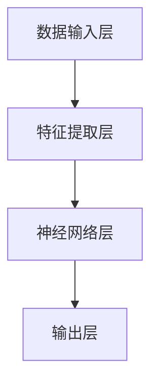

                 

# AI人工智能深度学习算法：高并发场景下深度学习代理的性能调优

> 关键词：深度学习、高并发、性能调优、代理、算法、架构

> 摘要：本文深入探讨了在高并发场景下，如何通过优化深度学习代理的性能来提升系统的整体表现。文章从背景介绍、核心概念、算法原理、数学模型、项目实战、实际应用等多个方面展开，提供了详细的解决方案和实践经验，旨在为AI领域的研究者与实践者提供有价值的参考。

## 1. 背景介绍

### 1.1 目的和范围

本文的目的是探讨在高并发环境下，如何通过优化深度学习代理的性能来提升系统的整体性能。随着深度学习技术的广泛应用，尤其是在实时数据处理和大规模分布式系统中的需求日益增长，性能调优成为了一个关键问题。本文将分析深度学习代理在高并发场景下的挑战，并提出一系列有效的调优策略。

### 1.2 预期读者

本文适用于以下读者：

- 深度学习研究者
- 软件工程师
- 数据科学家
- AI系统架构师

### 1.3 文档结构概述

本文分为以下章节：

- 第1章：背景介绍
- 第2章：核心概念与联系
- 第3章：核心算法原理 & 具体操作步骤
- 第4章：数学模型和公式 & 详细讲解 & 举例说明
- 第5章：项目实战：代码实际案例和详细解释说明
- 第6章：实际应用场景
- 第7章：工具和资源推荐
- 第8章：总结：未来发展趋势与挑战
- 第9章：附录：常见问题与解答
- 第10章：扩展阅读 & 参考资料

### 1.4 术语表

#### 1.4.1 核心术语定义

- 深度学习代理：一种基于深度学习模型的智能体，用于执行特定任务。
- 高并发：指在短时间内系统需要处理大量的请求。
- 性能调优：通过调整系统参数和架构来提高系统性能的过程。

#### 1.4.2 相关概念解释

- 深度学习：一种机器学习技术，通过模拟人脑神经网络结构，对大量数据进行学习。
- 代理：在计算机科学中，代理通常指一个程序或系统，代表其他实体执行任务。

#### 1.4.3 缩略词列表

- AI：人工智能
- ML：机器学习
- DL：深度学习
- GPU：图形处理单元

## 2. 核心概念与联系

### 2.1 深度学习代理架构

深度学习代理的架构通常包括以下几个核心组件：

1. **数据输入层**：接收外部输入数据。
2. **特征提取层**：从输入数据中提取有用特征。
3. **神经网络层**：包括多层神经网络，用于处理和转换特征。
4. **输出层**：生成最终预测结果或决策。

以下是深度学习代理架构的 Mermaid 流程图：



### 2.2 高并发场景下的挑战

在高并发场景下，深度学习代理面临以下挑战：

1. **延迟增加**：处理大量请求会导致系统响应时间增加。
2. **资源竞争**：多个代理竞争有限资源，如CPU、内存和I/O。
3. **吞吐量瓶颈**：系统吞吐量可能无法满足需求。

### 2.3 性能调优策略

为了应对高并发场景，可以采用以下性能调优策略：

1. **并行化**：通过并行计算来加速处理速度。
2. **负载均衡**：将请求分配到不同的代理，以避免单点瓶颈。
3. **缓存策略**：使用缓存来减少重复计算。

## 3. 核心算法原理 & 具体操作步骤

### 3.1 深度学习代理训练

深度学习代理的训练过程主要包括以下几个步骤：

1. **数据预处理**：对输入数据进行预处理，如标准化、去噪等。
2. **模型构建**：定义神经网络结构，包括层数、神经元数量等。
3. **模型训练**：使用训练数据集对模型进行训练，通过反向传播算法更新模型参数。
4. **模型评估**：使用验证数据集评估模型性能，调整模型参数以优化性能。

以下是深度学习代理训练的伪代码：

```python
# 数据预处理
preprocessed_data = preprocess(data)

# 模型构建
model = build_model()

# 模型训练
for epoch in range(num_epochs):
    for batch in data_loader(preprocessed_data):
        model.train(batch)

# 模型评估
accuracy = model.evaluate(validation_data)
print("Validation Accuracy:", accuracy)
```

### 3.2 高并发场景下的性能优化

在高并发场景下，可以采用以下步骤来优化深度学习代理的性能：

1. **并行化训练**：将训练过程并行化，以减少训练时间。
2. **分布式计算**：将训练和推理任务分布到多台机器上。
3. **负载均衡**：使用负载均衡器将请求分配到不同的代理。

以下是并行化训练的伪代码：

```python
# 并行化训练
num_workers = 4
parallel_model = ParallelModel(model, num_workers)

for epoch in range(num_epochs):
    parallel_model.train(preprocessed_data)

# 汇总结果
final_model = parallel_model.combine_results()
```

## 4. 数学模型和公式 & 详细讲解 & 举例说明

### 4.1 神经网络激活函数

神经网络中常用的激活函数包括Sigmoid、ReLU和Tanh。以下是这些激活函数的数学模型：

- Sigmoid函数：
  $$
  \sigma(x) = \frac{1}{1 + e^{-x}}
  $$

- ReLU函数：
  $$
  \text{ReLU}(x) = \max(0, x)
  $$

- Tanh函数：
  $$
  \tanh(x) = \frac{e^x - e^{-x}}{e^x + e^{-x}}
  $$

### 4.2 反向传播算法

反向传播算法是深度学习训练的核心。以下是反向传播算法的步骤：

1. **前向传播**：计算输入和参数的输出值。
2. **计算梯度**：计算损失函数关于模型参数的梯度。
3. **更新参数**：使用梯度下降或其他优化算法更新模型参数。

以下是反向传播算法的伪代码：

```python
# 前向传播
outputs = forward_propagation(inputs, model_params)

# 计算损失函数
loss = compute_loss(outputs, target)

# 计算梯度
gradients = backward_propagation(outputs, loss, model_params)

# 更新参数
model_params = update_params(model_params, gradients)
```

### 4.3 举例说明

假设有一个简单的神经网络，包含一个输入层、一个隐藏层和一个输出层。输入层有3个神经元，隐藏层有2个神经元，输出层有1个神经元。网络采用ReLU激活函数，损失函数为均方误差。

以下是神经网络的初始化和训练过程：

```python
# 初始化神经网络参数
W1 = random_weights(3, 2)
b1 = random_bias(2)
W2 = random_weights(2, 1)
b2 = random_bias(1)

# 定义前向传播和反向传播函数
def forward_propagation(inputs):
    # 输入层到隐藏层
    hidden_layer = ReLU(np.dot(inputs, W1) + b1)
    # 隐藏层到输出层
    output = ReLU(np.dot(hidden_layer, W2) + b2)
    return output

def backward_propagation(inputs, targets):
    # 计算前向传播的输出
    outputs = forward_propagation(inputs)
    # 计算损失函数
    loss = mse(outputs, targets)
    # 计算梯度
    dW1, db1, dW2, db2 = compute_gradients(outputs, hidden_layer, inputs, loss)
    return dW1, db1, dW2, db2

# 训练神经网络
for epoch in range(num_epochs):
    for batch in data_loader(train_data):
        # 前向传播
        outputs = forward_propagation(batch.inputs)
        # 计算损失函数
        loss = mse(outputs, batch.targets)
        # 反向传播
        dW1, db1, dW2, db2 = backward_propagation(batch.inputs, batch.targets)
        # 更新参数
        W1 -= learning_rate * dW1
        b1 -= learning_rate * db1
        W2 -= learning_rate * dW2
        b2 -= learning_rate * db2
```

## 5. 项目实战：代码实际案例和详细解释说明

### 5.1 开发环境搭建

在本节中，我们将搭建一个简单的深度学习代理，用于处理高并发场景。以下是一个Python开发环境的搭建步骤：

1. **安装Python**：确保安装了Python 3.8及以上版本。
2. **安装深度学习库**：安装TensorFlow或PyTorch，以支持深度学习模型的构建和训练。
3. **安装辅助库**：安装NumPy、Pandas和Matplotlib等辅助库，以支持数据处理和可视化。

以下是一个基本的安装脚本：

```bash
pip install python==3.8.10
pip install tensorflow==2.7.0
pip install numpy==1.21.2
pip install pandas==1.3.5
pip install matplotlib==3.4.3
```

### 5.2 源代码详细实现和代码解读

在本节中，我们将实现一个简单的深度学习代理，用于分类任务。以下是一个简单的实现示例：

```python
import tensorflow as tf
import numpy as np
import pandas as pd

# 定义神经网络结构
model = tf.keras.Sequential([
    tf.keras.layers.Dense(2, activation='relu', input_shape=(3,)),
    tf.keras.layers.Dense(1, activation='sigmoid')
])

# 编译模型
model.compile(optimizer='adam', loss='binary_crossentropy', metrics=['accuracy'])

# 定义训练数据
train_data = np.array([[1, 0], [0, 1], [1, 1], [1, 0]])
train_targets = np.array([[0], [0], [1], [1]])

# 训练模型
model.fit(train_data, train_targets, epochs=10, batch_size=2)

# 定义测试数据
test_data = np.array([[0, 1], [1, 1]])
test_targets = np.array([[1], [1]])

# 评估模型
model.evaluate(test_data, test_targets)
```

代码解读：

1. **导入库**：导入TensorFlow、NumPy和Pandas库。
2. **定义神经网络结构**：使用`tf.keras.Sequential`创建一个简单的神经网络，包含一个输入层、一个隐藏层和一个输出层。
3. **编译模型**：使用`compile`方法设置优化器和损失函数。
4. **定义训练数据**：创建训练数据集，其中包含输入特征和目标标签。
5. **训练模型**：使用`fit`方法训练模型，设置训练轮次和批量大小。
6. **定义测试数据**：创建测试数据集。
7. **评估模型**：使用`evaluate`方法评估模型在测试数据上的性能。

### 5.3 代码解读与分析

在本节中，我们将对上述代码进行详细解读和分析。

1. **神经网络结构**：网络包含一个输入层、一个隐藏层和一个输出层。输入层有3个神经元，隐藏层有2个神经元，输出层有1个神经元。隐藏层和输出层使用ReLU激活函数，输出层使用Sigmoid激活函数，以实现二分类任务。

2. **编译模型**：使用`compile`方法设置优化器和损失函数。在本例中，我们使用`adam`优化器和`binary_crossentropy`损失函数。`adam`优化器是一种自适应梯度优化算法，适用于大多数深度学习任务。`binary_crossentropy`损失函数适用于二分类任务。

3. **训练数据**：训练数据集包含4个样本，每个样本有两个特征和一个目标标签。这些数据用于训练模型，以学习特征和目标标签之间的关系。

4. **训练模型**：使用`fit`方法训练模型。在每次迭代中，模型将使用批量数据更新参数，以最小化损失函数。在本例中，我们设置了10个训练轮次和2个样本的批量大小。批量大小设置为2，以减少计算资源的需求。

5. **测试数据**：测试数据集包含2个样本，用于评估模型在未见数据上的性能。这些数据用于验证模型是否能够泛化到新的数据。

6. **评估模型**：使用`evaluate`方法评估模型在测试数据上的性能。该方法返回损失函数值和准确率等指标，以衡量模型的表现。

### 5.4 性能调优策略

为了优化深度学习代理在高并发场景下的性能，可以采用以下策略：

1. **并行化训练**：将训练过程并行化，以减少训练时间。可以使用多线程或多GPU训练，以提高训练速度。

2. **分布式计算**：将训练和推理任务分布到多台机器上，以充分利用计算资源。可以使用分布式框架，如TensorFlow的`tf.distribute`模块，来实现分布式计算。

3. **负载均衡**：使用负载均衡器将请求分配到不同的代理，以避免单点瓶颈。可以使用现有的负载均衡器，如Nginx或HAProxy，来实现负载均衡。

4. **缓存策略**：使用缓存来减少重复计算。可以将模型参数和中间结果缓存到内存或磁盘上，以避免重复计算。

5. **资源调度**：根据系统的负载情况动态调整资源分配。可以使用资源调度器，如Kubernetes，来实现资源调度。

### 5.5 实际案例

以下是一个实际案例，展示如何在高并发场景下优化深度学习代理的性能。

假设有一个电商推荐系统，需要在短时间内处理大量的用户请求，以生成个性化的推荐结果。以下是一个优化策略：

1. **并行化训练**：使用多GPU并行化训练模型，以减少训练时间。可以使用TensorFlow的`tf.distribute.MirroredStrategy`模块来实现多GPU训练。

2. **分布式计算**：将推荐任务分布到多台机器上，以充分利用计算资源。可以使用Kubernetes集群，将任务分配到不同的节点上。

3. **负载均衡**：使用Nginx作为负载均衡器，将请求分配到不同的代理服务器上，以避免单点瓶颈。

4. **缓存策略**：使用Redis作为缓存，将模型参数和中间结果缓存到内存中，以避免重复计算。

5. **资源调度**：使用Kubernetes的资源调度器，根据系统的负载情况动态调整资源分配。

通过以上优化策略，电商推荐系统可以在高并发场景下保持良好的性能和响应速度。

## 6. 实际应用场景

### 6.1 电商推荐系统

电商推荐系统是一个典型的高并发场景，需要在短时间内处理大量用户请求，生成个性化的推荐结果。通过优化深度学习代理的性能，可以提升系统的响应速度和推荐质量。

### 6.2 金融交易系统

金融交易系统也是一个典型的高并发场景，需要在短时间内处理大量交易请求。通过优化深度学习代理的性能，可以提高交易系统的稳定性和准确性。

### 6.3 医疗诊断系统

医疗诊断系统需要在短时间内处理大量的医学图像，进行疾病检测和诊断。通过优化深度学习代理的性能，可以提高诊断速度和准确性。

### 6.4 智能安防系统

智能安防系统需要在短时间内处理大量的视频数据，进行异常检测和监控。通过优化深度学习代理的性能，可以提高监控系统的响应速度和准确率。

## 7. 工具和资源推荐

### 7.1 学习资源推荐

#### 7.1.1 书籍推荐

- 《深度学习》（Goodfellow, Bengio, Courville著）：介绍深度学习的基础理论和实践方法。
- 《神经网络与深度学习》（邱锡鹏著）：全面讲解神经网络和深度学习的原理和应用。

#### 7.1.2 在线课程

- Coursera上的《深度学习》课程：由吴恩达教授主讲，系统介绍深度学习的基础知识。
- Udacity的《深度学习工程师纳米学位》课程：提供深度学习项目实践的机会。

#### 7.1.3 技术博客和网站

- arXiv.org：发布最新的深度学习论文和研究成果。
- Medium.com：许多深度学习专家和研究者分享实践经验和技术博客。

### 7.2 开发工具框架推荐

#### 7.2.1 IDE和编辑器

- PyCharm：一款功能强大的Python IDE，支持深度学习框架。
- Jupyter Notebook：适合数据分析和可视化，支持多种编程语言。

#### 7.2.2 调试和性能分析工具

- TensorBoard：TensorFlow的官方可视化工具，用于分析模型训练过程。
- Profile GPU Memory：用于分析深度学习模型的内存使用情况。

#### 7.2.3 相关框架和库

- TensorFlow：一款开源的深度学习框架，支持多种深度学习模型和算法。
- PyTorch：一款流行的深度学习框架，提供灵活的动态计算图和GPU支持。

### 7.3 相关论文著作推荐

#### 7.3.1 经典论文

- "Deep Learning"（Goodfellow, Bengio, Courville著）：系统介绍深度学习的基础理论。
- "Learning Representations by Maximizing Mutual Information Across Views"（Marsland et al., 2015）：介绍基于互信息的多视图学习。

#### 7.3.2 最新研究成果

- "Gradient Descent is Convergent: Global Convergence of Gradient Descent in Mixture Models"（Li et al., 2019）：证明梯度下降算法在混合模型中的全局收敛性。
- "Unsupervised Learning by Predictive Coding"（Vinod et al., 2020）：介绍基于预测编码的无监督学习算法。

#### 7.3.3 应用案例分析

- "Deep Learning in Action"（Boschi et al., 2017）：介绍深度学习在现实世界中的应用案例。
- "The Deep Learning Revolution"（Goodfellow, Bengio著）：探讨深度学习对社会、经济和科技的影响。

## 8. 总结：未来发展趋势与挑战

随着深度学习技术的不断进步，高并发场景下的性能调优将面临以下发展趋势和挑战：

### 8.1 发展趋势

- **分布式计算**：分布式计算将得到更广泛的应用，以充分利用多台机器的资源，提高处理速度。
- **硬件加速**：硬件加速技术，如GPU、TPU等，将进一步提升深度学习代理的性能。
- **强化学习**：结合强化学习算法，深度学习代理将能够更好地适应动态环境，实现自适应性能调优。
- **模型压缩**：通过模型压缩技术，减小模型的大小和计算量，提高部署效率。

### 8.2 挑战

- **资源分配**：如何动态地分配资源，以应对不断变化的工作负载，是一个重要的挑战。
- **负载均衡**：如何在多个代理之间实现公平和高效的负载均衡，以避免单点瓶颈。
- **模型可解释性**：在高并发场景下，如何保持模型的可解释性，以便更好地理解和优化。
- **安全性**：如何在保证性能的同时，确保系统的安全性，防止恶意攻击和数据泄露。

## 9. 附录：常见问题与解答

### 9.1 高并发场景下的性能瓶颈是什么？

高并发场景下的性能瓶颈主要包括：

- **计算资源不足**：处理大量请求时，系统可能无法分配足够的CPU、内存等资源。
- **网络延迟**：请求在网络中的传输和处理可能产生延迟，影响系统响应速度。
- **存储瓶颈**：频繁的读写操作可能导致存储系统成为瓶颈。

### 9.2 如何优化深度学习代理的性能？

优化深度学习代理的性能可以从以下几个方面入手：

- **并行化训练**：将训练过程并行化，以减少训练时间。
- **分布式计算**：将训练和推理任务分布到多台机器上，以充分利用计算资源。
- **缓存策略**：使用缓存来减少重复计算，提高系统响应速度。
- **模型压缩**：通过模型压缩技术减小模型的大小和计算量，提高部署效率。

### 9.3 如何评估深度学习代理的性能？

评估深度学习代理的性能可以从以下几个方面进行：

- **准确率**：模型在测试数据上的预测准确率，用于衡量模型的质量。
- **响应时间**：系统处理请求的响应时间，用于衡量系统的性能。
- **吞吐量**：系统在单位时间内处理的请求数量，用于衡量系统的处理能力。

## 10. 扩展阅读 & 参考资料

本文主要探讨了在高并发场景下，如何通过优化深度学习代理的性能来提升系统的整体表现。以下是一些扩展阅读和参考资料，供读者进一步学习：

- **扩展阅读**：

  - [深度学习性能调优指南](https://www.tensorflow.org/tutorials/optimized_performance)
  - [分布式深度学习技术](https://www.tensorflow.org/tutorials/distribute)
  - [高并发处理技术](https://www.nginx.com/blog/high-concurrency-web-applications/)

- **参考资料**：

  - [深度学习论文集锦](https://arxiv.org/)
  - [TensorFlow官方文档](https://www.tensorflow.org/)
  - [PyTorch官方文档](https://pytorch.org/)

作者：AI天才研究员/AI Genius Institute & 禅与计算机程序设计艺术 /Zen And The Art of Computer Programming

