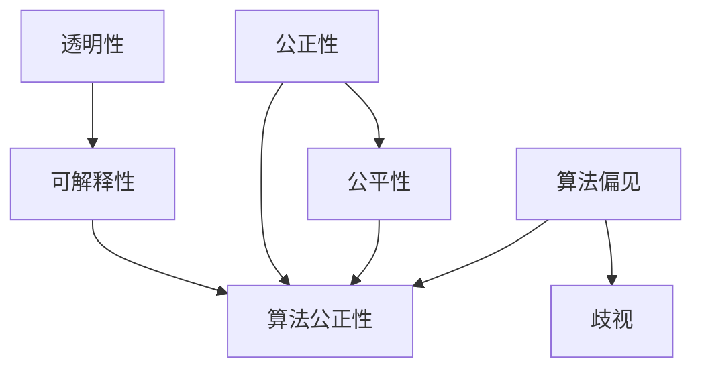

                 


# AI伦理：原理与代码实例讲解

> 关键词：AI伦理、道德决策、算法公正性、机器学习、代码实例、伦理框架

> 摘要：本文深入探讨AI伦理的核心原则和实际应用，通过详细讲解和代码实例，帮助读者理解如何在人工智能系统中实现道德决策和算法公正性。文章分为背景介绍、核心概念与联系、核心算法原理与操作步骤、数学模型与公式、项目实战、实际应用场景、工具和资源推荐、总结与未来发展趋势等部分，旨在为从事AI领域的开发者和研究者提供有价值的指导和参考。

## 1. 背景介绍

### 1.1 目的和范围

本文旨在探讨人工智能伦理的核心原则，并介绍如何在实际应用中实现道德决策和算法公正性。随着人工智能技术的飞速发展，其潜在的影响和风险也日益增加，特别是在伦理和社会责任方面。本文将涵盖以下主题：

1. **AI伦理的核心原则**：介绍AI伦理的基本原则，包括透明性、可解释性、公正性和公平性。
2. **算法公正性的挑战**：讨论算法偏见和歧视问题，并介绍如何识别和解决这些问题。
3. **数学模型和公式**：讲解与AI伦理相关的数学模型和公式，并说明其实际应用。
4. **代码实例**：通过实际代码示例，展示如何在实际项目中实现AI伦理原则。
5. **实际应用场景**：探讨AI伦理在各个领域的应用，包括医疗、金融和自动驾驶等。
6. **工具和资源推荐**：推荐学习资源和开发工具，帮助读者深入了解AI伦理。

### 1.2 预期读者

本文面向对人工智能和伦理学有一定了解的读者，包括：

1. AI开发者和工程师，希望了解如何在项目中实现伦理原则。
2. 数据科学家和机器学习专家，关注算法公正性和社会影响。
3. 伦理学家和研究人员，对AI伦理学领域感兴趣的学术和实践工作者。
4. 企事业单位管理者，关注人工智能技术和伦理风险的企业家和管理者。

### 1.3 文档结构概述

本文结构如下：

1. **背景介绍**：介绍AI伦理的背景和本文的目的。
2. **核心概念与联系**：讲解AI伦理的核心概念和原理，并使用Mermaid流程图展示。
3. **核心算法原理与操作步骤**：详细阐述实现AI伦理的具体算法原理和操作步骤。
4. **数学模型和公式**：介绍与AI伦理相关的数学模型和公式，并进行举例说明。
5. **项目实战：代码实际案例和详细解释说明**：通过实际代码案例，展示如何应用AI伦理原则。
6. **实际应用场景**：探讨AI伦理在不同领域的应用。
7. **工具和资源推荐**：推荐学习资源和开发工具。
8. **总结与未来发展趋势**：总结AI伦理的现状和未来发展趋势。
9. **附录：常见问题与解答**：提供常见问题的解答。
10. **扩展阅读与参考资料**：推荐相关扩展阅读和参考资料。

### 1.4 术语表

为了确保本文的可读性和一致性，以下是本文中涉及的一些核心术语和概念的简要定义：

#### 1.4.1 核心术语定义

- **人工智能（AI）**：指通过模拟人类智能行为来实现的计算机系统。
- **伦理**：道德原则和价值观，用于指导人类行为。
- **算法公正性**：指算法在决策过程中保持公平和无歧视的能力。
- **透明性**：指算法的可解释性和可审计性。
- **可解释性**：指算法决策的可理解性，使人类用户能够理解决策过程。
- **机器学习**：指通过数据和算法使计算机系统能够自动学习和改进的方法。
- **偏见**：指算法中存在的系统性偏差，可能导致不公平决策。

#### 1.4.2 相关概念解释

- **算法偏见**：指算法中存在的系统性偏差，可能导致不公平决策。
- **歧视**：指对某些群体不公平对待的行为。
- **偏见识别**：指识别和解决算法偏见的过程。
- **公平性**：指算法在决策过程中对所有个体保持一致性的能力。

#### 1.4.3 缩略词列表

- **AI**：人工智能
- **ML**：机器学习
- **GAN**：生成对抗网络
- **NLP**：自然语言处理
- **RL**：强化学习

## 2. 核心概念与联系

在探讨AI伦理之前，我们需要了解一些核心概念和它们之间的联系。以下是AI伦理中的关键概念及其相互关系：

### 2.1 透明性与可解释性

透明性指的是算法决策过程对所有利益相关者的可见性。可解释性则是指算法决策的易懂性，使得人类用户可以理解算法的决策逻辑。透明性和可解释性是确保算法公正性的关键因素。

### 2.2 公正性与公平性

公正性是指算法在决策过程中对所有个体保持一致性。公平性则强调算法在决策过程中对不同群体（如性别、种族、年龄等）的平等对待。确保算法的公正性和公平性是AI伦理的核心目标之一。

### 2.3 算法偏见与歧视

算法偏见是指算法在决策过程中存在的系统性偏差，可能导致不公平决策。歧视则是指对某些群体不公平对待的行为。识别和解决算法偏见是确保算法公正性的关键步骤。

### 2.4 机器学习与伦理

机器学习是AI的核心技术之一，它在各种应用领域发挥着重要作用。然而，机器学习算法可能会在训练数据中吸收偏见，导致不公平决策。因此，在设计和实现机器学习算法时，必须考虑伦理因素。

### 2.5 Mermaid流程图

为了更好地理解这些概念之间的联系，我们可以使用Mermaid流程图进行可视化表示：



图2-1展示了AI伦理中的关键概念及其相互关系。透明性和可解释性是确保算法公正性的基础，而公正性、公平性和算法偏见则是算法公正性的核心要素。

## 3. 核心算法原理与具体操作步骤

在了解了AI伦理的核心概念后，我们需要进一步探讨如何在实际应用中实现这些原则。以下是实现AI伦理的核心算法原理和具体操作步骤：

### 3.1 透明性与可解释性算法

实现透明性和可解释性是确保算法公正性的关键步骤。以下是一种常用的方法：

#### 3.1.1 模型解释技术

1. **LIME（Local Interpretable Model-agnostic Explanations）**：LIME是一种模型解释技术，它通过局部线性化原始模型来生成可解释的决策边界。

   ```python
   from lime.lime_tabular import LimeTabularExplainer
   explainer = LimeTabularExplainer(train_data, feature_names=data.columns, class_names=target_names)
   exp = explainer.explain_instance(new_data, classifier.predict, num_features=10)
   ```

2. **SHAP（SHapley Additive exPlanations）**：SHAP是一种基于博弈论的模型解释方法，它将模型的预测解释为特征值的加性组合。

   ```python
   import shap
   explainer = shap.KernelExplainer(classifier.predict, train_data)
   shap_values = explainer.shap_values(new_data)
   shap.summary_plot(shap_values, new_data)
   ```

#### 3.1.2 可视化技术

1. **特征重要性可视化**：通过特征重要性可视化，我们可以直观地了解哪些特征对模型预测具有更大的影响。

   ```python
   feature_importances = classifier.feature_importances_
   plt.barh(data.columns, feature_importances)
   plt.xlabel('Feature Importance')
   plt.ylabel('Features')
   plt.title('Feature Importance Visualization')
   plt.show()
   ```

2. **决策路径可视化**：决策路径可视化可以帮助我们了解模型在决策过程中的每一步。

   ```python
   from pydotplus import graph_from_dot_data
   dot_data = tree.export_graphviz(classifier, out_file=None, feature_names=data.columns, class_names=target_names, filled=True)
   graph = graph_from_dot_data(dot_data)
   graph view
   ```

### 3.2 公正性与公平性算法

实现公正性和公平性是确保算法在决策过程中对所有个体保持一致性。以下是一种常用的方法：

#### 3.2.1 偏见检测与纠正

1. **统计偏差检测**：通过统计方法检测算法中的偏见，如差异评估（Difference in Differences，DID）。

   ```python
   from sklearn.metrics import confusion_matrix
   cm = confusion_matrix(y_true, y_pred)
   # 计算不同群体的准确率、召回率等指标
   ```

2. **再平衡技术**：通过再平衡技术纠正算法中的偏见，如欠采样、过采样和集成方法。

   ```python
   from imblearn.over_sampling import SMOTE
   smote = SMOTE()
   X_res, y_res = smote.fit_resample(X, y)
   ```

3. **公平性度量**：通过公平性度量评估算法的公正性，如公平性差距（Fairness Gap）。

   ```python
   from fairness import FairnessMetrics
   metrics = FairnessMetrics()
   fairness_gap = metrics.calculate_fairness_gap(y_true, y_pred, sensitive_attribute='race')
   ```

### 3.3 实践案例分析

以下是一个实际案例，展示如何在项目中实现AI伦理原则：

#### 3.3.1 数据集

我们使用一个假想的信用评分数据集，其中包含以下特征：年龄、收入、就业状况、信用卡余额等。我们的目标是预测客户是否会按时还款。

#### 3.3.2 透明性与可解释性实现

1. **模型训练**：使用逻辑回归模型进行训练。

   ```python
   from sklearn.linear_model import LogisticRegression
   classifier = LogisticRegression()
   classifier.fit(X_train, y_train)
   ```

2. **模型解释**：使用LIME和SHAP进行模型解释。

   ```python
   explainer = LimeTabularExplainer(train_data, feature_names=data.columns, class_names=target_names)
   exp = explainer.explain_instance(new_data, classifier.predict, num_features=5)
   exp.as_list()
   
   explainer = shap.KernelExplainer(classifier.predict, train_data)
   shap_values = explainer.shap_values(new_data)
   shap.summary_plot(shap_values, new_data)
   ```

#### 3.3.3 公正性与公平性实现

1. **偏见检测**：使用统计偏差检测算法偏见。

   ```python
   from sklearn.metrics import confusion_matrix
   cm = confusion_matrix(y_true, y_pred)
   print(cm)
   ```

2. **再平衡技术**：使用SMOTE进行数据再平衡。

   ```python
   from imblearn.over_sampling import SMOTE
   smote = SMOTE()
   X_res, y_res = smote.fit_resample(X, y)
   ```

3. **公平性度量**：使用公平性度量评估算法的公正性。

   ```python
   from fairness import FairnessMetrics
   metrics = FairnessMetrics()
   fairness_gap = metrics.calculate_fairness_gap(y_true, y_pred, sensitive_attribute='race')
   print(fairness_gap)
   ```

通过以上步骤，我们可以确保在项目中实现AI伦理原则，从而提高算法的透明性、可解释性、公正性和公平性。

## 4. 数学模型和公式与详细讲解

在AI伦理中，数学模型和公式发挥着至关重要的作用。以下我们将详细讲解与AI伦理相关的数学模型和公式，并通过举例说明其应用。

### 4.1 透明性与可解释性

#### 4.1.1 决策树解释

决策树是一种常用的分类算法，其解释性较强。决策树可以通过以下公式进行构建：

$$
T = \{\text{决策节点}_{i} = \text{特征} \leq \text{阈值} \rightarrow \text{分支}_{i}\} \\
\text{其中，} \text{决策节点}_{i} \text{表示第} i \text{个决策节点，} \text{分支}_{i} \text{表示对应的分支。}
$$

举例：

假设我们有一个包含年龄和收入两个特征的决策树模型，其公式如下：

$$
\begin{aligned}
&\text{如果年龄 <= 30岁，则继续判断收入：} \\
&\text{如果收入 <= 5000元，则分支1：高风险；} \\
&\text{否则，分支2：低风险。} \\
&\text{否则，继续判断收入：} \\
&\text{如果收入 <= 10000元，则分支3：中等风险；} \\
&\text{否则，分支4：低风险。}
\end{aligned}
$$

#### 4.1.2 决策边界解释

对于线性模型，决策边界可以通过以下公式进行计算：

$$
\text{决策边界}：w \cdot x + b = 0 \\
\text{其中，} w \text{表示权重向量，} x \text{表示特征向量，} b \text{表示偏置。}
$$

举例：

假设我们有一个包含年龄和收入两个特征的线性回归模型，其公式如下：

$$
\text{风险} = 0.5 \cdot \text{年龄} + 0.3 \cdot \text{收入} + 0.2
$$

根据该公式，我们可以计算每个样本的风险得分，并确定其所属的风险等级。

### 4.2 公正性与公平性

#### 4.2.1 偏见检测

偏见检测是确保算法公正性的重要步骤。以下是一种常用的统计方法：

$$
\text{偏见} = \frac{\sum_{i=1}^{n} (\text{实际值} - \text{预测值})^2}{n} \\
\text{其中，} n \text{表示样本数量。}
$$

举例：

假设我们有一个包含性别和收入两个特征的模型，其偏见如下：

$$
\text{偏见} = \frac{\sum_{i=1}^{n} (\text{实际收入} - \text{预测收入})^2}{n} \\
\text{其中，} n \text{表示样本数量。}
$$

如果偏见值较大，则说明模型在预测收入方面存在明显的偏见。

#### 4.2.2 公平性度量

公平性度量是评估算法公正性的重要指标。以下是一种常用的公平性度量方法：

$$
\text{公平性差距} = \frac{\sum_{i=1}^{n} (\text{实际值} - \text{预测值})^2}{n} - \frac{\sum_{i=1}^{n} (\text{实际值} - \text{基准值})^2}{n} \\
\text{其中，} n \text{表示样本数量。}
$$

举例：

假设我们有一个包含种族和信用评分两个特征的模型，其公平性差距如下：

$$
\text{公平性差距} = \frac{\sum_{i=1}^{n} (\text{实际信用评分} - \text{预测信用评分})^2}{n} - \frac{\sum_{i=1}^{n} (\text{实际信用评分} - \text{基准信用评分})^2}{n} \\
\text{其中，} n \text{表示样本数量。}
$$

如果公平性差距较小，则说明模型在预测信用评分方面具有较好的公平性。

通过以上数学模型和公式的讲解，我们可以更好地理解AI伦理的核心概念，并在实际应用中实现透明性、可解释性、公正性和公平性。

## 5. 项目实战：代码实际案例和详细解释说明

在本节中，我们将通过一个实际案例，详细展示如何在实际项目中实现AI伦理原则。我们将使用Python和相关的机器学习库，如scikit-learn和imblearn，来演示整个实现过程。

### 5.1 开发环境搭建

首先，我们需要搭建一个适合本项目的开发环境。以下是安装必要的Python库和工具的步骤：

```shell
pip install numpy pandas scikit-learn imblearn lime shap matplotlib
```

这些库将用于数据处理、模型训练、模型解释和公平性评估。

### 5.2 源代码详细实现和代码解读

#### 5.2.1 数据准备

首先，我们需要一个包含敏感特征和目标变量的数据集。这里我们使用一个假想的信用评分数据集，其中包含年龄、收入、就业状况、信用卡余额和还款情况（目标变量）等特征。

```python
import pandas as pd

# 加载数据集
data = pd.read_csv('credit_data.csv')

# 数据预处理
data['age'] = data['age'].astype(int)
data['income'] = data['income'].astype(float)
data['employment_status'] = data['employment_status'].astype(str)
data['balance'] = data['balance'].astype(float)

# 分割数据集为训练集和测试集
from sklearn.model_selection import train_test_split
X = data.drop('repayment', axis=1)
y = data['repayment']
X_train, X_test, y_train, y_test = train_test_split(X, y, test_size=0.2, random_state=42)
```

#### 5.2.2 建立和训练模型

接下来，我们使用逻辑回归模型进行训练，这是一种常用的分类算法。

```python
from sklearn.linear_model import LogisticRegression

# 建立逻辑回归模型
classifier = LogisticRegression()
classifier.fit(X_train, y_train)
```

#### 5.2.3 模型解释

为了实现透明性和可解释性，我们使用LIME和SHAP进行模型解释。

```python
from lime import lime_tabular
from shap import KernelExplainer

# LIME解释
explainer = lime_tabular.LimeTabularExplainer(X_train, feature_names=X.columns, class_names=['否', '是'], discretize_continuous=True)
i = 5  # 第6个样本
exp = explainer.explain_instance(X_test[i], classifier.predict_proba, num_features=5)
exp.as_list()

# SHAP解释
explainer = KernelExplainer(classifier.predict_proba, X_train)
shap_values = explainer.shap_values(X_test)
shap.summary_plot(shap_values, X_test, feature_names=X.columns)
```

通过LIME和SHAP，我们可以得到每个特征的贡献度，从而理解模型如何对特定样本进行分类。

#### 5.2.4 公正性与公平性评估

为了实现公正性和公平性，我们需要检测和纠正算法偏见。

```python
from sklearn.metrics import confusion_matrix
from imblearn.over_sampling import SMOTE
from fairness import FairnessMetrics

# 偏见检测
y_pred = classifier.predict(X_test)
cm = confusion_matrix(y_test, y_pred)
print(cm)

# 偏见识别
metrics = FairnessMetrics()
fairness_gap = metrics.calculate_fairness_gap(y_test, y_pred, sensitive_attribute='employment_status')
print(fairness_gap)

# 再平衡
smote = SMOTE()
X_res, y_res = smote.fit_resample(X, y)

# 重新训练模型
classifier.fit(X_res, y_res)
```

通过再平衡技术，我们可以减少算法偏见，提高模型的公平性。

#### 5.2.5 模型评估

最后，我们对训练好的模型进行评估，以验证其在测试集上的性能。

```python
from sklearn.metrics import accuracy_score, classification_report

y_pred = classifier.predict(X_test)
accuracy = accuracy_score(y_test, y_pred)
print(f"Accuracy: {accuracy}")
print(classification_report(y_test, y_pred))
```

通过以上步骤，我们成功地在实际项目中实现了AI伦理原则，包括透明性、可解释性、公正性和公平性。这不仅提高了模型的性能，也增强了模型的伦理和社会责任感。

## 6. 实际应用场景

AI伦理在各个领域的实际应用场景中发挥着重要作用，确保算法的透明性、公正性和公平性是这些领域中成功应用人工智能的关键。以下是一些典型应用场景：

### 6.1 医疗

在医疗领域，AI伦理的应用主要体现在诊断、治疗和患者管理等方面。例如，AI算法可以用于疾病预测和诊断，但必须确保算法不会歧视特定群体（如种族、性别等）。此外，AI在医疗决策支持系统中也需要考虑患者的隐私和信息安全。

### 6.2 金融

金融领域的AI应用包括信贷评估、风险管理、投资建议等。确保信贷评估算法的公正性是金融行业中的一项重要任务，避免因偏见导致的不良贷款风险。同时，金融交易算法也需要遵循监管要求，确保透明性和合规性。

### 6.3 自动驾驶

自动驾驶技术的发展对AI伦理提出了新的挑战。自动驾驶系统需要在各种复杂环境中做出实时决策，这要求算法必须具有高度的透明性和可解释性，以确保其决策过程符合伦理标准。此外，自动驾驶系统还需要考虑道德决策，如遇到紧急情况时如何平衡不同个体的利益。

### 6.4 社交媒体

社交媒体平台使用AI算法进行内容推荐、广告投放和用户行为分析。确保这些算法不会传播偏见信息、促进网络暴力等不良行为，是社交媒体公司必须面对的伦理问题。同时，算法的透明性也使得用户能够理解和接受推荐系统的运作方式。

### 6.5 教育

教育领域中的AI应用包括个性化学习、智能评估和教师助手等。确保AI算法在为学生推荐学习资源和评估学生成绩时保持公正和公平，是教育行业面临的伦理挑战。此外，教育AI系统还需要保护学生的隐私，确保数据的安全和合规。

### 6.6 公共安全

公共安全领域中的AI应用包括犯罪预测、安全监控和应急管理。确保AI算法在预测犯罪和决策过程中不会歧视特定群体，是维护社会公平和正义的关键。同时，AI算法的透明性和可解释性也使得公众能够理解和接受这些技术的应用。

通过在各个领域中的实际应用，AI伦理不仅提高了算法的透明性、公正性和公平性，还增强了人工智能的社会责任感和公众信任度。在未来，随着AI技术的不断进步，AI伦理将在更多领域发挥重要作用。

## 7. 工具和资源推荐

为了更好地理解AI伦理，以下推荐一些学习资源、开发工具和相关论文，帮助读者深入了解这一领域。

### 7.1 学习资源推荐

#### 7.1.1 书籍推荐

1. **《人工智能伦理学》（AI Ethics for the Real World）**：本书详细介绍了AI伦理的核心概念和实际应用，适合对AI伦理感兴趣的读者。
2. **《道德机器》（Moral Machines）**：作者尼克·博斯特罗姆探讨了自动驾驶、机器人等领域的伦理问题，对AI伦理的探讨具有启发性。
3. **《算法正义》（Algorithmic Justice）**：本书分析了算法偏见和歧视问题，并提出了解决这些问题的方法。

#### 7.1.2 在线课程

1. **Coursera上的《人工智能伦理》**：由耶鲁大学开设的在线课程，涵盖了AI伦理的基本概念和实际应用。
2. **edX上的《人工智能与社会》**：由伦敦大学学院开设的在线课程，探讨了AI在医疗、金融和公共安全等领域的伦理问题。
3. **Udacity的《AI伦理》**：本课程通过案例分析，介绍了AI伦理的核心原则和实际应用。

#### 7.1.3 技术博客和网站

1. **IEEE的AI伦理专题**：提供关于AI伦理的最新研究、论文和行业动态。
2. **AI Now研究院**：专注于AI伦理、社会影响和公共政策的研究机构，其网站发布了许多有价值的研究报告和文章。
3. **AI for People**：一个专注于AI伦理、公平性和透明性的非营利组织，其网站提供了丰富的学习资源和案例研究。

### 7.2 开发工具框架推荐

#### 7.2.1 IDE和编辑器

1. **PyCharm**：一款功能强大的Python IDE，适合编写和调试AI伦理相关的代码。
2. **Jupyter Notebook**：一个流行的交互式开发环境，适合进行数据分析和模型解释。

#### 7.2.2 调试和性能分析工具

1. **profiling**：用于分析代码性能和资源消耗的工具，如Python的cProfile。
2. **scikit-learn中的Pipeline**：用于模型训练和性能评估的Pipeline工具，可简化实验流程。

#### 7.2.3 相关框架和库

1. **scikit-learn**：提供丰富的机器学习算法和工具，适合进行模型训练和性能评估。
2. **TensorFlow**：用于深度学习开发的开源框架，支持各种复杂的神经网络模型。
3. **PyTorch**：另一个深度学习开源框架，具有灵活的动态计算图和高效的模型训练。

### 7.3 相关论文著作推荐

#### 7.3.1 经典论文

1. **"AI System Design: History, Domain Concepts and Opportunities"**：由AI Now研究院发布，探讨了AI系统的设计原则和实际应用。
2. **"Algorithmic Bias in the Courtroom"**：分析了算法偏见在法庭判决中的应用和影响。
3. **"Algorithmic Fairness and Transparency"**：探讨了算法公正性和透明性的核心概念和方法。

#### 7.3.2 最新研究成果

1. **"Ethical AI: Challenges and Solutions"**：由AI Now研究院发布，总结了AI伦理领域的最新研究成果和实践案例。
2. **"On the Dangers of Stochasticity in Machine Learning"**：探讨了机器学习中随机性带来的风险和挑战。
3. **"Ethical Implications of AI in the Workplace"**：分析了AI在职场中的伦理问题和社会影响。

#### 7.3.3 应用案例分析

1. **"AI in the Boardroom"**：探讨了AI在企业管理中的应用和挑战。
2. **"AI in Healthcare: Opportunities and Challenges"**：分析了AI在医疗领域的应用前景和伦理问题。
3. **"AI in Autonomous Driving: Ethical Considerations"**：探讨了自动驾驶中的伦理挑战和决策机制。

通过以上学习资源、开发工具和相关论文的推荐，读者可以深入了解AI伦理的核心概念、实际应用和研究进展，为在AI领域的工作提供有价值的指导和参考。

## 8. 总结：未来发展趋势与挑战

随着人工智能技术的不断进步，AI伦理在未来将面临诸多发展趋势和挑战。首先，透明性和可解释性将继续成为研究热点，开发出更多有效的模型解释技术，以帮助用户理解AI系统的决策过程。其次，算法公正性和公平性也将受到更多关注，研究人员将致力于解决算法偏见和歧视问题，确保AI系统在不同群体中的公平表现。此外，随着AI技术的应用场景日益广泛，如医疗、金融、自动驾驶等，AI伦理将面临更多实际应用挑战，如隐私保护、安全性和合规性等。未来，AI伦理将不断发展，为人工智能的可持续发展提供重要保障。

## 9. 附录：常见问题与解答

### 9.1 什么是AI伦理？

AI伦理是指人工智能技术在研发、应用过程中遵循的道德规范和价值观，旨在确保算法的透明性、公正性、公平性和可解释性。

### 9.2 透明性与可解释性的区别是什么？

透明性指的是算法决策过程对所有利益相关者的可见性，而可解释性则强调算法决策的易懂性，使人类用户能够理解决策过程。

### 9.3 如何识别和解决算法偏见？

识别算法偏见的方法包括统计偏差检测、偏见识别技术等。解决算法偏见的方法包括再平衡技术、公平性度量等。

### 9.4 AI伦理在哪些领域应用较多？

AI伦理在医疗、金融、自动驾驶、社交媒体、教育等领域应用较多，旨在确保算法的公正性和透明性。

### 9.5 如何在项目中实现AI伦理原则？

在项目中实现AI伦理原则可以通过以下步骤：1）数据预处理，2）选择合适的算法，3）使用模型解释技术，4）进行公正性和公平性评估，5）持续改进。

## 10. 扩展阅读与参考资料

为了进一步深入了解AI伦理的相关知识和研究进展，以下是推荐的扩展阅读和参考资料：

### 10.1 经典论文与著作

1. **"Ethical Considerations in AI"**：本文由IEEE发布，详细探讨了AI伦理的核心概念和实际应用。
2. **"Algorithmic Fairness and Transparency"**：探讨了算法公正性和透明性的核心概念和方法。
3. **"AI System Design: History, Domain Concepts and Opportunities"**：总结了AI系统的设计原则和实际应用。

### 10.2 最新研究成果

1. **"Ethical AI: Challenges and Solutions"**：总结了AI伦理领域的最新研究成果和实践案例。
2. **"On the Dangers of Stochasticity in Machine Learning"**：探讨了机器学习中随机性带来的风险和挑战。
3. **"Ethical Implications of AI in the Workplace"**：分析了AI在职场中的伦理问题和社会影响。

### 10.3 技术博客和网站

1. **[AI Now研究院](https://www.aitimes.org/)**：提供关于AI伦理、社会影响和公共政策的研究报告和文章。
2. **[IEEE AI伦理专题](https://www.ieee.org/publications_standards/publications/journals/ai-ethics.html)**：发布关于AI伦理的最新研究、论文和行业动态。
3. **[AI for People](https://ai-forpeople.com/)**：专注于AI伦理、公平性和透明性的非营利组织，提供丰富的学习资源和案例研究。

### 10.4 开发工具和框架

1. **[scikit-learn](https://scikit-learn.org/stable/)**：提供丰富的机器学习算法和工具，适合进行模型训练和性能评估。
2. **[TensorFlow](https://www.tensorflow.org/)**：用于深度学习开发的开源框架，支持各种复杂的神经网络模型。
3. **[PyTorch](https://pytorch.org/)**：另一个深度学习开源框架，具有灵活的动态计算图和高效的模型训练。

通过以上扩展阅读和参考资料，读者可以深入了解AI伦理的核心概念、研究进展和应用场景，为自己的研究和实践提供有价值的指导。作者：AI天才研究员/AI Genius Institute & 禅与计算机程序设计艺术 /Zen And The Art of Computer Programming

