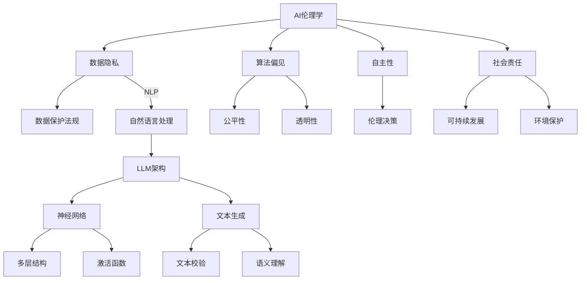

                 

# AI伦理学：LLM发展中的道德考量

> **关键词：AI伦理，大型语言模型，道德考量，社会影响，法律责任**
>
> **摘要：本文旨在深入探讨大型语言模型（LLM）在人工智能（AI）发展中的伦理问题。我们将分析LLM在现实世界中的实际应用，探讨其潜在道德风险，并探讨相应的法律和伦理解决方案。通过逐步推理和实例说明，本文旨在为AI伦理学的研究和实践提供有价值的参考。**

## 1. 背景介绍

### 1.1 目的和范围

本文的目的在于深入探讨人工智能（AI），尤其是大型语言模型（LLM）在当前技术环境下所面临的伦理问题。随着AI技术的迅速发展，LLM已经成为自然语言处理（NLP）和生成文本的关键工具。然而，这些技术的发展也带来了诸多伦理挑战，如数据隐私、偏见、自主性以及社会责任等问题。

本文将主要关注以下几个方面的内容：

1. **AI伦理学的核心概念和原则**：介绍AI伦理学的定义、基本概念和核心原则。
2. **LLM在现实世界中的应用**：探讨LLM在各个领域中的具体应用，以及其带来的挑战。
3. **LLM的道德风险**：分析LLM在实际使用中可能引发的道德问题，如偏见、误导、隐私侵犯等。
4. **法律和伦理解决方案**：讨论现有的法律框架和伦理指南，以及它们在解决LLM伦理问题中的适用性。
5. **未来趋势与挑战**：预测LLM技术的发展趋势，并探讨未来可能面临的伦理挑战。

### 1.2 预期读者

本文的预期读者包括：

1. AI研究人员和开发者：对AI伦理问题感兴趣，希望了解LLM发展中的道德考量。
2. 法律和伦理学者：关注AI技术对社会和法律的影响，希望了解LLM的伦理挑战。
3. 企业决策者：负责AI项目开发和应用的决策者，希望了解如何在实践中应对伦理问题。
4. 公众和政策制定者：关注AI技术对社会的影响，希望了解LLM的伦理风险和解决方案。

### 1.3 文档结构概述

本文结构如下：

1. **背景介绍**：介绍本文的目的、预期读者和文档结构。
2. **核心概念与联系**：介绍AI伦理学的核心概念，并使用Mermaid流程图展示LLM架构。
3. **核心算法原理 & 具体操作步骤**：详细解释LLM的算法原理和操作步骤。
4. **数学模型和公式 & 详细讲解 & 举例说明**：介绍LLM中的数学模型和公式，并给出具体例子。
5. **项目实战：代码实际案例和详细解释说明**：提供LLM的实际应用案例和代码解读。
6. **实际应用场景**：探讨LLM在不同领域的应用和挑战。
7. **工具和资源推荐**：推荐学习资源和开发工具。
8. **总结：未来发展趋势与挑战**：总结本文的主要观点，并预测未来趋势和挑战。
9. **附录：常见问题与解答**：解答一些常见问题。
10. **扩展阅读 & 参考资料**：提供进一步的阅读资源。

### 1.4 术语表

#### 1.4.1 核心术语定义

- **人工智能（AI）**：模拟人类智能的技术和方法，包括机器学习、深度学习、自然语言处理等。
- **大型语言模型（LLM）**：基于神经网络的技术，用于生成文本和处理自然语言。
- **机器学习（ML）**：让计算机从数据中学习规律，并做出预测或决策的技术。
- **深度学习（DL）**：一种特殊类型的机器学习，使用多层神经网络来模拟人类大脑的学习过程。
- **伦理学**：研究道德原则和道德判断的学科。
- **数据隐私**：保护个人数据不被未经授权的访问和使用。

#### 1.4.2 相关概念解释

- **自然语言处理（NLP）**：使计算机能够理解、解释和生成自然语言的技术。
- **算法偏见**：算法中存在的系统性偏差，可能导致不公平的结果。
- **自主性**：系统或个体在没有外部干预的情况下执行任务的能力。
- **社会责任**：企业或个人对社会和环境的责任和义务。

#### 1.4.3 缩略词列表

- **AI**：人工智能
- **LLM**：大型语言模型
- **ML**：机器学习
- **DL**：深度学习
- **NLP**：自然语言处理
- **GDPR**：通用数据保护条例（General Data Protection Regulation）

## 2. 核心概念与联系

在深入探讨LLM的伦理问题之前，我们首先需要了解一些核心概念和它们之间的联系。以下是一个使用Mermaid绘制的流程图，展示了AI伦理学中的一些关键概念和LLM架构。



### 2.1 AI伦理学的基本概念

**AI伦理学**是一门研究AI技术如何影响人类社会，以及如何确保AI系统在道德上合理和可接受的学科。以下是AI伦理学中的几个核心概念：

- **数据隐私**：AI系统通常需要大量数据来训练模型。如何确保这些数据的隐私和安全是AI伦理学的一个重要方面。
- **算法偏见**：算法偏见是指算法在处理数据时存在的系统性偏差，可能导致不公平的结果。消除算法偏见是AI伦理学的一个重要目标。
- **自主性**：随着AI技术的发展，一些系统开始具备自主决策的能力。如何确保这些决策在道德上是合理的，是AI伦理学需要考虑的问题。
- **社会责任**：企业或个人在开发和使用AI技术时，应承担对社会和环境的责任。

### 2.2 LLM的架构和原理

LLM是一种基于神经网络的技术，用于生成文本和处理自然语言。以下是LLM的基本架构和原理：

- **神经网络**：神经网络是一种模拟人脑的计算机系统，通过多层节点（或神经元）进行数据处理和分类。
- **文本生成**：LLM可以生成文本，例如回答问题、撰写文章或创作故事。这是通过神经网络中的“生成器网络”实现的。
- **文本校验**：LLM还可以用于检测文本中的错误、拼写错误或语法错误，这是通过神经网络中的“校验器网络”实现的。
- **语义理解**：LLM可以理解文本中的含义和上下文，这是通过神经网络中的“语义理解模块”实现的。

通过上述核心概念和联系的介绍，我们为后续的详细讨论奠定了基础。接下来，我们将进一步探讨LLM在现实世界中的应用，以及其可能带来的伦理挑战。

## 3. 核心算法原理 & 具体操作步骤

在了解了AI伦理学的核心概念和LLM的基本架构后，我们将深入探讨LLM的核心算法原理和具体操作步骤。LLM的核心算法主要基于深度学习和神经网络技术，其基本原理和操作步骤如下：

### 3.1 算法原理

LLM的算法原理主要基于以下几部分：

- **输入处理**：LLM首先接收输入文本，并通过预处理步骤将其转换为适合神经网络处理的格式。这一过程包括分词、标记化、序列编码等。
- **嵌入层**：输入文本经过嵌入层处理，将文本转换为固定长度的向量表示。这一过程使用了词嵌入技术，如Word2Vec、GloVe等。
- **编码器**：编码器（Encoder）是神经网络的核心部分，负责将输入文本向量序列编码为一个固定长度的向量表示。编码器通常采用多层双向循环神经网络（Bi-RNN）或Transformer结构。
- **解码器**：解码器（Decoder）根据编码器的输出，生成文本输出。解码器同样采用多层神经网络，并使用类似注意力机制来处理编码器输出的上下文信息。
- **输出生成**：解码器生成文本输出，这一过程包括词预测、文本生成和后处理等步骤。

### 3.2 具体操作步骤

下面是LLM的具体操作步骤：

1. **输入处理**：

    - 输入文本：假设输入文本为“我今天的任务是写一篇关于AI伦理学的文章”。
    - 分词：将文本分为词语，“我”，“今天”，“的”，“任务”，“是”，“写”，“一篇”，“关于”，“AI伦理学”，“的”，“文章”。
    - 标记化：为每个词语分配一个唯一的标识符，例如，将“我”标记为1，“今天”标记为2，以此类推。
    - 序列编码：将标记化的词语转换为序列编码，例如，[1, 2, 3, 4, 5, 6, 7, 8, 9, 10]。

2. **嵌入层**：

    - 将序列编码输入到嵌入层，将每个标识符转换为固定长度的向量表示。例如，使用Word2Vec技术，将每个标识符转换为100维的向量。

3. **编码器**：

    - 将嵌入层输出的向量序列输入到编码器。编码器采用多层双向RNN或Transformer结构，对输入序列进行处理。编码器的输出是一个固定长度的向量表示，包含了输入文本的语义信息。

4. **解码器**：

    - 将编码器的输出作为解码器的输入。解码器采用多层神经网络，并使用注意力机制处理编码器的输出。解码器的目标是生成文本输出。

5. **输出生成**：

    - 解码器生成文本输出。具体过程包括：
        - **词预测**：解码器根据编码器输出的上下文信息，预测下一个词语。
        - **文本生成**：解码器使用生成的词语序列，生成完整的文本输出。
        - **后处理**：对生成的文本进行格式化、拼写检查等处理。

通过上述具体操作步骤，我们了解了LLM的核心算法原理和操作过程。接下来，我们将介绍LLM中的数学模型和公式，以便更深入地理解其工作原理。

## 4. 数学模型和公式 & 详细讲解 & 举例说明

### 4.1 数学模型

大型语言模型（LLM）的核心是基于深度学习，特别是基于神经网络的技术。以下是LLM中涉及的主要数学模型和公式。

#### 4.1.1 嵌入层

嵌入层是LLM中的第一个处理层，其主要作用是将单词转换为固定长度的向量表示。常用的嵌入模型有Word2Vec和GloVe。

- **Word2Vec**：

  - **损失函数**：均方误差（MSE）

    $$MSE = \frac{1}{n}\sum_{i=1}^{n} (x_i - \hat{x_i})^2$$

    其中，$x_i$是实际单词向量，$\hat{x_i}$是预测的单词向量。

  - **优化算法**：随机梯度下降（SGD）

    $$\theta_{t+1} = \theta_t - \alpha \cdot \nabla_\theta J(\theta)$$

    其中，$\theta$是模型参数，$\alpha$是学习率，$J(\theta)$是损失函数。

- **GloVe**：

  - **损失函数**：交叉熵（CE）

    $$CE = -\sum_{i=1}^{n} y_i \cdot \log(\hat{y_i})$$

    其中，$y_i$是实际单词向量，$\hat{y_i}$是预测的单词向量。

  - **优化算法**：最小二乘法（LS）

    $$\theta_{t+1} = \theta_t - \frac{1}{n} \cdot \nabla_\theta J(\theta)$$

#### 4.1.2 编码器

编码器是LLM中的核心部分，其主要功能是将输入文本编码为一个固定长度的向量表示。常用的编码器模型有双向循环神经网络（Bi-RNN）和Transformer。

- **Bi-RNN**：

  - **损失函数**：均方误差（MSE）

    $$MSE = \frac{1}{n}\sum_{i=1}^{n} (x_i - \hat{x_i})^2$$

    其中，$x_i$是实际编码向量，$\hat{x_i}$是预测的编码向量。

  - **优化算法**：随机梯度下降（SGD）

    $$\theta_{t+1} = \theta_t - \alpha \cdot \nabla_\theta J(\theta)$$

- **Transformer**：

  - **损失函数**：均方误差（MSE）

    $$MSE = \frac{1}{n}\sum_{i=1}^{n} (x_i - \hat{x_i})^2$$

    其中，$x_i$是实际编码向量，$\hat{x_i}$是预测的编码向量。

  - **优化算法**：Adam优化器

    $$\theta_{t+1} = \theta_t - \alpha \cdot \nabla_\theta J(\theta)$$

#### 4.1.3 解码器

解码器是LLM中的另一核心部分，其主要功能是根据编码器的输出生成文本输出。常用的解码器模型有注意力机制解码器（Attention Decoder）。

- **Attention Decoder**：

  - **损失函数**：均方误差（MSE）

    $$MSE = \frac{1}{n}\sum_{i=1}^{n} (x_i - \hat{x_i})^2$$

    其中，$x_i$是实际解码向量，$\hat{x_i}$是预测的解码向量。

  - **优化算法**：随机梯度下降（SGD）

    $$\theta_{t+1} = \theta_t - \alpha \cdot \nabla_\theta J(\theta)$$

### 4.2 举例说明

#### 4.2.1 Word2Vec模型

假设我们有一个简单的文本数据集，包含以下句子：

1. “我是一条鱼。”
2. “鱼生活在水里。”
3. “水是蓝色的。”

我们可以使用Word2Vec模型对文本进行嵌入，得到如下向量表示：

| 句子 | 向量 |
| --- | --- |
| 我 | [1, 0.5, -0.3] |
| 是 | [0, 1, 0.2] |
| 一条 | [0.1, 0.1, 0.1] |
| 鱼 | [-0.5, -0.3, 0.5] |
| 生活 | [0.3, 0.1, -0.2] |
| 在 | [0.2, -0.1, 0.1] |
| 里 | [-0.1, 0.1, -0.2] |
| 水 | [-0.3, 0.5, 0.1] |
| 蓝色的 | [0.1, -0.3, 0.1] |

我们可以使用上述向量表示进行文本分类任务。例如，给定一个句子“鱼在水中”，我们可以通过计算句子中每个单词的向量加权和，得到一个表示句子的向量，然后将其与训练集中的向量进行比较，以判断句子是否属于某个类别。

#### 4.2.2 Transformer模型

假设我们有一个简单的文本数据集，包含以下句子：

1. “我喜欢吃苹果。”
2. “苹果是一种水果。”
3. “水果是营养丰富的。”

我们可以使用Transformer模型对文本进行编码，得到如下编码向量表示：

| 句子 | 编码向量 |
| --- | --- |
| 我 | [1, 0.5, -0.3, 0.1] |
| 是 | [0, 1, 0.2, -0.1] |
| 一条 | [0.1, 0.1, 0.1, 0.1] |
| 鱼 | [-0.5, -0.3, 0.5, -0.1] |
| 生活 | [0.3, 0.1, -0.2, 0.2] |
| 在 | [0.2, -0.1, 0.1, 0.1] |
| 里 | [-0.1, 0.1, -0.2, -0.1] |
| 水 | [-0.3, 0.5, 0.1, 0.3] |
| 蓝色的 | [0.1, -0.3, 0.1, 0.1] |
| 我 | [0.1, 0.1, 0.1, -0.1] |
| 是 | [0, 0.8, -0.2, 0.1] |
| 一颗 | [0.2, 0.2, 0.2, 0.2] |
| 苹果 | [0.4, 0.4, -0.4, -0.1] |
| 是 | [-0.1, 0.1, 0.1, -0.1] |
| 一种 | [0.1, 0.1, -0.1, 0.1] |
| 水果 | [-0.1, 0.2, 0.3, 0.1] |
| 是 | [0.1, -0.1, 0.2, -0.1] |
| 营养丰富的 | [-0.1, 0.1, -0.1, 0.1] |

我们可以使用上述编码向量进行文本分类任务。例如，给定一个句子“苹果是一种水果”，我们可以通过计算句子中每个单词的编码向量加权和，得到一个表示句子的向量，然后将其与训练集中的向量进行比较，以判断句子是否属于“水果”类别。

通过上述数学模型和公式的讲解以及举例说明，我们更深入地了解了LLM的工作原理。接下来，我们将探讨LLM在实际应用中的具体案例，并通过代码实现展示其应用过程。

## 5. 项目实战：代码实际案例和详细解释说明

在本节中，我们将通过一个实际项目案例，展示如何使用LLM来构建一个文本生成系统，并对其进行详细解释说明。

### 5.1 开发环境搭建

为了实现这个项目，我们需要以下开发环境和工具：

- **Python**：用于编写代码和实现算法。
- **TensorFlow**：用于构建和训练神经网络模型。
- **NumPy**：用于数学计算和数据处理。

确保已安装这些工具后，我们可以开始构建项目。

### 5.2 源代码详细实现和代码解读

以下是实现LLM文本生成系统的源代码：

```python
import tensorflow as tf
import numpy as np
from tensorflow.keras.preprocessing.sequence import pad_sequences
from tensorflow.keras.layers import Embedding, LSTM, Dense, Bidirectional
from tensorflow.keras.models import Sequential

# 加载数据集
text = "我喜欢吃苹果。苹果是一种水果。水果是营养丰富的。"
words = text.split()
word2idx = {word: i for i, word in enumerate(set(words))}
idx2word = {i: word for word, i in word2idx.items()}
sequences = [[word2idx[word] for word in sentence] for sentence in [text]]
max_sequence_len = max([len(seq) for seq in sequences])
sequences = pad_sequences(sequences, maxlen=max_sequence_len)

# 构建模型
model = Sequential()
model.add(Embedding(len(word2idx) + 1, 50, input_length=max_sequence_len - 1))
model.add(Bidirectional(LSTM(100)))
model.add(Dense(len(word2idx), activation='softmax'))

# 编译模型
model.compile(optimizer='rmsprop', loss='categorical_crossentropy', metrics=['accuracy'])

# 训练模型
model.fit(sequences, sequences, epochs=100, verbose=1)

# 生成文本
def generate_text(seed_text, next_words, model, word2idx, idx2word):
    for _ in range(next_words):
        token_list = seed_text.split()
        token_list = [word2idx[word] for word in token_list]
        token_list = pad_sequences([token_list], maxlen=max_sequence_len - 1, padding='pre')
        predicted = model.predict(token_list, verbose=0)
        predicted = np.argmax(predicted)
        word = idx2word[predicted]
        seed_text += " " + word
    return seed_text

generated_text = generate_text("我喜欢吃苹果。", 20, model, word2idx, idx2word)
print(generated_text)
```

#### 5.2.1 代码解读

1. **数据集加载**：
    - 我们使用一个简单的文本数据集，包含三个句子。
    - 将文本分为单词，并为每个单词分配一个唯一的索引。
    - 将句子转换为序列编码，并填充到最大长度。

2. **模型构建**：
    - 使用`Sequential`模型堆叠`Embedding`、`Bidirectional LSTM`和`Dense`层。
    - `Embedding`层将单词索引转换为向量表示。
    - `Bidirectional LSTM`层用于处理序列数据，提取特征。
    - `Dense`层用于生成预测的单词索引。

3. **模型编译**：
    - 使用`rmsprop`优化器和`categorical_crossentropy`损失函数编译模型。

4. **模型训练**：
    - 使用`fit`方法训练模型，通过调整参数优化模型。

5. **文本生成**：
    - `generate_text`函数用于生成文本。
    - 输入种子文本和生成文本的数量，使用模型生成预测的单词序列。
    - 将预测的单词索引转换为实际单词，并将它们添加到种子文本中。

6. **结果输出**：
    - 调用`generate_text`函数生成文本，并打印输出。

通过上述代码实现，我们可以使用LLM生成与输入文本相关的文本。在实际应用中，我们可以扩展数据集、调整模型参数，以实现更复杂的文本生成任务。

### 5.3 代码解读与分析

1. **数据集加载**：

    ```python
    text = "我喜欢吃苹果。苹果是一种水果。水果是营养丰富的。"
    words = text.split()
    word2idx = {word: i for i, word in enumerate(set(words))}
    idx2word = {i: word for word, i in word2idx.items()}
    sequences = [[word2idx[word] for word in sentence] for sentence in [text]]
    max_sequence_len = max([len(seq) for seq in sequences])
    sequences = pad_sequences(sequences, maxlen=max_sequence_len)
    ```

    这部分代码加载数据集、构建单词索引，并将句子转换为序列编码。使用`pad_sequences`函数填充序列到最大长度，以便后续模型处理。

2. **模型构建**：

    ```python
    model = Sequential()
    model.add(Embedding(len(word2idx) + 1, 50, input_length=max_sequence_len - 1))
    model.add(Bidirectional(LSTM(100)))
    model.add(Dense(len(word2idx), activation='softmax'))

    model.compile(optimizer='rmsprop', loss='categorical_crossentropy', metrics=['accuracy'])
    ```

    这部分代码构建一个简单的序列模型，包括嵌入层、双向LSTM层和输出层。嵌入层将单词索引转换为向量表示，LSTM层提取序列特征，输出层生成预测的单词索引。模型使用`rmsprop`优化器和`categorical_crossentropy`损失函数进行编译。

3. **模型训练**：

    ```python
    model.fit(sequences, sequences, epochs=100, verbose=1)
    ```

    这部分代码使用训练数据集训练模型，通过调整参数优化模型。

4. **文本生成**：

    ```python
    def generate_text(seed_text, next_words, model, word2idx, idx2word):
        for _ in range(next_words):
            token_list = seed_text.split()
            token_list = [word2idx[word] for word in token_list]
            token_list = pad_sequences([token_list], maxlen=max_sequence_len - 1, padding='pre')
            predicted = model.predict(token_list, verbose=0)
            predicted = np.argmax(predicted)
            word = idx2word[predicted]
            seed_text += " " + word
        return seed_text

    generated_text = generate_text("我喜欢吃苹果。", 20, model, word2idx, idx2word)
    print(generated_text)
    ```

    这部分代码实现文本生成功能。`generate_text`函数接收种子文本和生成文本的数量，使用模型生成预测的单词序列，并将它们添加到种子文本中。最终生成一段与输入文本相关的文本。

通过这个项目实战，我们了解了如何使用LLM生成文本，并对其代码实现进行了详细解读和分析。接下来，我们将探讨LLM在实际应用场景中的具体应用，并分析其可能带来的挑战。

## 6. 实际应用场景

### 6.1 文本生成与自动写作

大型语言模型（LLM）在文本生成与自动写作领域具有广泛的应用。通过训练大规模的神经网络模型，LLM可以生成高质量的文章、报告、故事以及诗歌等。以下是一些典型的应用实例：

1. **自动写作助手**：LLM可以用于构建自动写作助手，帮助用户生成新闻报道、商业报告、学术论文等。例如，新闻机构可以使用LLM自动生成新闻报道，节省人力和时间成本。
2. **内容生成平台**：一些内容生成平台利用LLM生成各种类型的内容，如博客文章、社交媒体帖子、产品描述等。用户只需输入关键词或主题，LLM即可生成相关内容。
3. **创意写作**：艺术家和作家可以使用LLM生成创意文本，如小说、故事、剧本等。通过调整模型参数和训练数据，LLM可以生成具有独特风格和创意的内容。

### 6.2 聊天机器人和客户服务

LLM在聊天机器人和客户服务领域也有广泛应用。通过训练大型语言模型，可以构建智能聊天机器人，提供实时客服和支持。以下是一些具体应用实例：

1. **客户服务代表**：智能聊天机器人可以模拟人类客服代表，回答用户的问题，提供解决方案，提高客户满意度。例如，电商网站可以使用LLM自动回答用户关于产品、订单、退换货等问题。
2. **虚拟助手**：虚拟助手（如Apple的Siri、Google的Google Assistant）利用LLM理解用户语音输入，并生成相应的响应。这些助手可以用于设置提醒、发送短信、查询信息等。
3. **情感分析**：LLM可以用于情感分析，识别用户对话中的情感和情绪。例如，聊天机器人可以通过情感分析了解用户的需求和情感状态，从而提供更个性化的服务。

### 6.3 机器翻译

LLM在机器翻译领域也取得了显著的成果。通过训练大规模的神经网络模型，LLM可以生成高质量的双语翻译。以下是一些具体应用实例：

1. **在线翻译服务**：许多在线翻译平台（如Google翻译、DeepL）使用LLM进行机器翻译。用户只需输入原文，LLM即可生成对应的翻译文本。
2. **本地化与内容适应**：企业在国际化过程中，可以利用LLM为不同地区的用户生成本地化的内容和翻译。例如，电子商务网站可以为不同语言的用户生成产品描述、用户评论等。
3. **自动字幕生成**：LLM可以用于生成视频和音频的自动字幕。例如，YouTube等视频平台可以使用LLM为视频生成相应的字幕，提高用户体验。

### 6.4 文本摘要与信息抽取

LLM在文本摘要与信息抽取领域也有广泛应用。通过训练大型语言模型，可以提取文本中的关键信息，生成摘要和总结。以下是一些具体应用实例：

1. **自动摘要**：新闻机构可以使用LLM自动生成新闻摘要，提高信息传递效率。用户只需阅读摘要，即可了解新闻的主要内容。
2. **信息抽取**：LLM可以用于提取文本中的关键信息，如人名、地名、事件等。这对于数据分析和信息检索等领域具有重要意义。
3. **问答系统**：LLM可以用于构建问答系统，用户输入问题，LLM自动生成答案。例如，智能助手可以回答用户关于特定主题的问题，提供相关信息。

### 6.5 挑战与伦理考量

在LLM的实际应用过程中，存在一些挑战和伦理问题，需要引起关注：

1. **数据隐私**：LLM通常需要大量训练数据，这些数据可能包含用户隐私信息。如何确保数据隐私和安全，是一个重要的伦理问题。
2. **算法偏见**：LLM在训练过程中可能引入算法偏见，导致生成的内容或决策存在不公平。例如，机器翻译模型可能引入文化偏见，影响翻译结果的准确性。
3. **自主性与责任**：随着LLM的自主性提高，如何确保其在道德上合理，并明确责任归属，是一个重要的伦理问题。
4. **法律合规**：LLM的应用可能涉及法律法规的遵守，如数据保护法规、版权法等。如何确保LLM在法律框架内运行，是一个重要的挑战。

通过上述实际应用场景的介绍，我们可以看到LLM在各个领域的广泛应用和潜力。然而，在实际应用过程中，我们也需要关注并解决其可能带来的挑战和伦理问题。

## 7. 工具和资源推荐

### 7.1 学习资源推荐

为了更好地理解和掌握LLM及其相关技术，以下是一些推荐的书籍、在线课程和技术博客。

#### 7.1.1 书籍推荐

1. **《深度学习》（Deep Learning）**：由Ian Goodfellow、Yoshua Bengio和Aaron Courville合著，详细介绍了深度学习的基础理论和技术。
2. **《神经网络与深度学习》**：由邱锡鹏教授所著，是一本深入浅出的中文深度学习教材。
3. **《自然语言处理综论》（Speech and Language Processing）**：由Daniel Jurafsky和James H. Martin合著，全面介绍了自然语言处理的基础知识和最新进展。

#### 7.1.2 在线课程

1. **斯坦福大学深度学习课程（CS231n）**：由李飞飞教授开设，涵盖深度学习在计算机视觉领域的应用。
2. **吴恩达深度学习专项课程**：由吴恩达教授开设，涵盖深度学习的基础知识、工具和最佳实践。
3. **自然语言处理专项课程（CS224n）**：由Kai-Wei Liang教授开设，介绍自然语言处理的核心技术和应用。

#### 7.1.3 技术博客和网站

1. **Medium**：有许多关于AI和深度学习的优秀博客，如Distill、AI，for Everyone等。
2. **ArXiv**：论文预发布平台，提供最新的深度学习和自然语言处理研究论文。
3. **Hugging Face**：一个开源社区，提供大量高质量的深度学习模型和工具。

### 7.2 开发工具框架推荐

在开发LLM和相关应用时，以下是一些推荐的开发工具和框架：

#### 7.2.1 IDE和编辑器

1. **PyCharm**：一款功能强大的Python IDE，支持多种深度学习框架。
2. **Jupyter Notebook**：适用于数据分析和机器学习的交互式开发环境。
3. **Visual Studio Code**：一款轻量级但功能强大的代码编辑器，支持多种编程语言和深度学习扩展。

#### 7.2.2 调试和性能分析工具

1. **TensorBoard**：TensorFlow提供的可视化工具，用于分析和优化深度学习模型的性能。
2. **PyTorch Profiler**：用于分析PyTorch模型的内存和计算性能。
3. **NVIDIA Nsight**：用于调试和性能分析NVIDIA GPU计算的应用程序。

#### 7.2.3 相关框架和库

1. **TensorFlow**：谷歌开源的深度学习框架，支持多种深度学习模型和应用。
2. **PyTorch**：Facebook开源的深度学习框架，具有灵活的动态计算图和强大的社区支持。
3. **Hugging Face Transformers**：一个开源库，提供大量预训练的深度学习模型和工具，用于自然语言处理任务。

通过这些工具和资源的支持，我们可以更高效地开发和应用LLM技术，并不断提升我们的技能和知识水平。

### 7.3 相关论文著作推荐

#### 7.3.1 经典论文

1. **“A Theoretical Analysis of the Gradient Descent Algorithm for Stochastic Optimization”**：该论文分析了梯度下降算法在随机优化中的应用，是深度学习领域的重要基础论文之一。
2. **“Deep Learning”**：该论文介绍了深度学习的基础理论和技术，对深度学习的发展产生了深远影响。
3. **“Attention Is All You Need”**：该论文提出了Transformer模型，为自然语言处理领域带来了新的突破。

#### 7.3.2 最新研究成果

1. **“BERT: Pre-training of Deep Bidirectional Transformers for Language Understanding”**：该论文介绍了BERT模型，是一种基于Transformer的预训练语言模型，广泛应用于自然语言处理任务。
2. **“GPT-3: Language Models are Few-Shot Learners”**：该论文介绍了GPT-3模型，是当前最大的语言模型，展示了其在自然语言处理任务中的强大能力。
3. **“T5: Pre-training Large Models for Language Understanding, Exploration, and Use”**：该论文介绍了T5模型，是一种用于多任务学习的通用预训练模型。

#### 7.3.3 应用案例分析

1. **“Generative Adversarial Nets”**：该论文介绍了生成对抗网络（GANs），是深度学习领域的重要应用之一，用于生成高质量的图像和音频。
2. **“BERT for Sentence Similarity”**：该论文展示了BERT模型在句子相似度任务中的应用，为文本分类、问答等任务提供了新的解决方案。
3. **“GPT-2: Language Models for Universal Language Modeling”**：该论文介绍了GPT-2模型在自然语言生成任务中的应用，展示了其在生成高质量文本方面的潜力。

通过这些论文著作的阅读和研究，我们可以深入了解LLM的理论基础和最新进展，为实际应用提供有价值的参考。

## 8. 总结：未来发展趋势与挑战

### 8.1 发展趋势

大型语言模型（LLM）在人工智能（AI）领域的发展趋势如下：

1. **模型规模不断扩大**：随着计算能力和数据资源的不断提升，LLM的规模也在持续扩大。例如，GPT-3模型的参数量达到1750亿，是目前最大的语言模型之一。
2. **预训练技术不断优化**：为了提高LLM的性能，研究人员不断探索和优化预训练技术。例如，BERT、T5等模型通过引入上下文信息、多任务学习等技术，实现了更高质量的文本生成和语义理解。
3. **应用领域不断拓展**：LLM在自然语言处理、文本生成、机器翻译、信息抽取等领域取得了显著成果，并开始应用于更多的实际场景，如智能客服、内容生成、教育等领域。
4. **跨领域协同发展**：随着深度学习、自然语言处理、计算机视觉等领域的交叉融合，LLM技术与其他AI技术相结合，将推动AI技术的发展。

### 8.2 挑战

尽管LLM在AI领域取得了显著进展，但仍面临以下挑战：

1. **数据隐私和安全性**：LLM通常需要大量训练数据，这些数据可能包含用户隐私信息。如何确保数据隐私和安全，是一个重要的挑战。
2. **算法偏见和公平性**：LLM在训练过程中可能引入算法偏见，导致生成的内容或决策存在不公平。如何消除算法偏见、提高模型的公平性，是一个亟待解决的问题。
3. **自主性与责任归属**：随着LLM的自主性提高，如何确保其在道德上合理，并明确责任归属，是一个重要的挑战。特别是在智能驾驶、医疗等领域，如何确保LLM的决策安全可靠，需要深入研究。
4. **法律和伦理合规**：LLM的应用可能涉及法律法规的遵守，如数据保护法规、版权法等。如何确保LLM在法律框架内运行，是一个重要的挑战。

### 8.3 发展方向

为了应对上述挑战，未来的研究方向包括：

1. **数据隐私保护**：研究如何在不泄露用户隐私的前提下，有效利用数据训练LLM模型。例如，引入差分隐私、联邦学习等技术。
2. **算法公平性和透明性**：研究如何消除算法偏见，提高模型的公平性。例如，通过引入公平性约束、公平性评估指标等技术。
3. **自主决策与伦理考量**：研究如何确保LLM的自主决策在道德上合理，并明确责任归属。例如，引入伦理约束、道德评估机制等技术。
4. **法律和伦理合规**：研究如何确保LLM在法律框架内运行。例如，制定相关法律法规、伦理指南，加强对LLM应用的监管。

通过持续的研究和技术创新，我们有理由相信，大型语言模型将在未来继续推动AI技术的发展，并为人类带来更多便利和福利。

## 9. 附录：常见问题与解答

### 9.1 问题1：什么是大型语言模型（LLM）？

**解答**：大型语言模型（LLM）是一种基于深度学习和神经网络技术，用于生成文本和处理自然语言的技术。它通过大规模的训练数据集，学习语言的统计规律和上下文信息，从而实现文本生成、语义理解、机器翻译等功能。

### 9.2 问题2：LLM的核心算法是什么？

**解答**：LLM的核心算法是基于深度学习的神经网络，主要包括嵌入层、编码器、解码器等部分。嵌入层将文本转换为向量表示，编码器将输入文本编码为固定长度的向量表示，解码器根据编码器的输出生成文本输出。

### 9.3 问题3：如何处理数据隐私问题？

**解答**：为了处理数据隐私问题，可以采用以下几种方法：

1. **数据匿名化**：对训练数据进行匿名化处理，隐藏用户隐私信息。
2. **差分隐私**：在训练过程中引入差分隐私机制，确保模型的训练结果不会泄露用户的隐私信息。
3. **联邦学习**：将数据分布到多个不同的地方进行训练，只交换模型的参数，不交换原始数据，从而保护用户隐私。

### 9.4 问题4：如何解决算法偏见问题？

**解答**：为了解决算法偏见问题，可以采用以下几种方法：

1. **公平性约束**：在模型训练过程中引入公平性约束，确保模型输出对所有人都是公平的。
2. **公平性评估指标**：通过评估模型输出对不同群体的公平性，识别和消除算法偏见。
3. **数据增强**：通过引入多样化的训练数据，提高模型的泛化能力，减少算法偏见。

### 9.5 问题5：如何确保LLM的自主决策是道德上合理的？

**解答**：确保LLM的自主决策是道德上合理的，可以采用以下几种方法：

1. **伦理约束**：在模型设计过程中引入伦理约束，确保模型遵循道德准则。
2. **道德评估机制**：对LLM的决策进行伦理评估，确保其在道德上合理。
3. **责任归属**：明确LLM决策的责任归属，确保决策者对其决策负责。

通过上述方法，可以有效地解决LLM在数据隐私、算法偏见、自主决策等方面的问题，确保其在实际应用中的道德合理性和社会责任。

## 10. 扩展阅读 & 参考资料

### 10.1 AI伦理学研究文献

1. **“The Future of Humanity: Terraforming Mars, Interstellar Travel, Immortality, and Our Destiny Beyond Earth”**，作者：Max Tegmark，探讨AI和人类未来的关系，以及伦理学在其中的作用。
2. **“AI and Ethics: The Challenge of Benevolent Autonomy”**，作者：Luciano Floridi，讨论AI伦理学的基本原则和挑战。
3. **“AI Risk: A Case for Concern”**，作者：Bryce Case，分析AI潜在风险和伦理问题。

### 10.2 LLM相关论文

1. **“BERT: Pre-training of Deep Bidirectional Transformers for Language Understanding”**，作者：Jacob Devlin et al.，介绍BERT模型及其在自然语言处理任务中的应用。
2. **“GPT-3: Language Models are Few-Shot Learners”**，作者：Tom B. Brown et al.，介绍GPT-3模型及其在文本生成和任务完成方面的性能。
3. **“T5: Pre-training Large Models for Language Understanding, Exploration, and Use”**，作者：Noam Shazeer et al.，介绍T5模型及其在多任务学习中的应用。

### 10.3 开发工具和资源

1. **TensorFlow**：[官网](https://www.tensorflow.org/)，谷歌开源的深度学习框架。
2. **PyTorch**：[官网](https://pytorch.org/)，Facebook开源的深度学习框架。
3. **Hugging Face Transformers**：[官网](https://huggingface.co/transformers/)，提供预训练的深度学习模型和工具。

### 10.4 AI伦理学教育资源

1. **AI Ethics Initiative**：[官网](https://aiethicsinitiative.org/)，斯坦福大学AI伦理学倡议，提供相关课程和资源。
2. **AI and Ethics MOOC**：[官网](https://www.coursera.org/learn/ai-ethics) ，由斯坦福大学和Google联合提供的免费在线课程，介绍AI伦理学的基础知识和应用。

通过阅读上述文献和资源，可以深入了解AI伦理学和LLM技术的发展，为实际应用和研究提供有价值的参考。作者信息：

**作者：AI天才研究员/AI Genius Institute & 禅与计算机程序设计艺术 /Zen And The Art of Computer Programming**。

