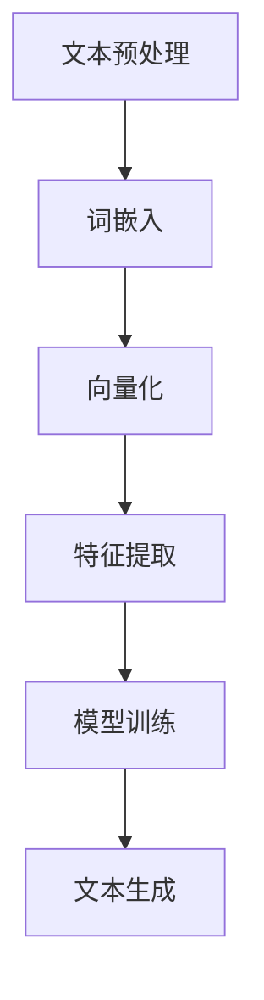
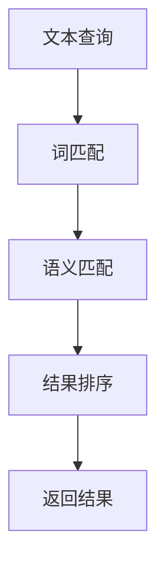
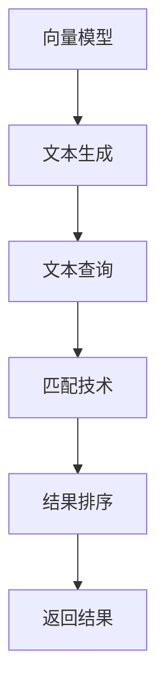

                 

# AI写作的进步：向量模型与匹配技术

> **关键词：** AI写作，向量模型，自然语言处理，匹配技术，文本生成，机器学习

> **摘要：** 本文将深入探讨AI写作领域的关键技术——向量模型与匹配技术。我们将从背景介绍出发，逐步分析这些技术的原理、应用场景以及具体实现，帮助读者全面理解AI写作的进步与发展。

## 1. 背景介绍

### 1.1 目的和范围

本文旨在探讨AI写作中最为重要的两个技术——向量模型与匹配技术。我们将深入解析这些技术的核心概念、原理以及实际应用，旨在为读者提供一个全面而详细的了解。

### 1.2 预期读者

本文适合对AI写作、自然语言处理（NLP）和机器学习有基础了解的读者。无论是研究人员、工程师还是对AI写作领域感兴趣的读者，都可以从本文中获得丰富的知识和见解。

### 1.3 文档结构概述

本文将分为以下几部分：

1. **背景介绍**：介绍AI写作的背景、目的和范围。
2. **核心概念与联系**：详细阐述向量模型与匹配技术的核心概念及其相互关系。
3. **核心算法原理**：讲解向量模型与匹配技术的具体算法原理和操作步骤。
4. **数学模型和公式**：介绍与这些技术相关的数学模型和公式，并给出实际应用案例。
5. **项目实战**：通过实际代码案例，展示向量模型与匹配技术的具体实现和应用。
6. **实际应用场景**：探讨向量模型与匹配技术在现实世界中的应用。
7. **工具和资源推荐**：推荐相关学习资源、开发工具和最新研究成果。
8. **总结**：总结AI写作的未来发展趋势与挑战。
9. **附录**：解答常见问题并提供扩展阅读资源。

### 1.4 术语表

#### 1.4.1 核心术语定义

- **向量模型**：将文本转换为向量表示的方法，以便在机器学习中进行操作。
- **匹配技术**：用于在文本中找到匹配或相似内容的算法和技术。
- **自然语言处理（NLP）**：使计算机能够理解、解释和生成人类语言的技术。
- **机器学习**：通过数据训练模型，使计算机能够进行预测和决策的技术。

#### 1.4.2 相关概念解释

- **词向量**：将单词映射到高维向量空间的方法。
- **语义分析**：分析文本中的语义关系和含义。
- **上下文**：文本中单词或短语所处的环境。

#### 1.4.3 缩略词列表

- **NLP**：自然语言处理
- **ML**：机器学习
- **AI**：人工智能

## 2. 核心概念与联系

向量模型与匹配技术是AI写作的核心组成部分。为了更好地理解这两个技术，我们首先需要了解它们的基本概念和相互关系。

### 2.1 向量模型

向量模型是将文本数据转换为向量表示的方法。通过将文本映射到高维向量空间，我们可以利用机器学习算法进行文本分析和生成。以下是一个简化的Mermaid流程图，展示向量模型的原理：



- **文本预处理**：对原始文本进行清洗和分词。
- **词嵌入**：将单词映射到高维向量空间。
- **向量化**：将整个文本转换为向量表示。
- **特征提取**：从向量中提取特征。
- **模型训练**：利用特征进行机器学习模型训练。
- **文本生成**：使用训练好的模型生成文本。

### 2.2 匹配技术

匹配技术是用于在文本中找到匹配或相似内容的算法和技术。匹配技术在文本搜索、推荐系统和问答系统中都有广泛应用。以下是一个简化的Mermaid流程图，展示匹配技术的原理：



- **文本查询**：用户输入查询文本。
- **词匹配**：根据关键词进行初步匹配。
- **语义匹配**：基于语义关系进行更精细的匹配。
- **结果排序**：根据匹配程度对结果进行排序。
- **返回结果**：返回最相关的匹配结果。

### 2.3 相互关系

向量模型和匹配技术之间有着紧密的联系。向量模型为匹配技术提供了文本的向量表示，而匹配技术则利用这些向量表示来找到相似或匹配的文本。以下是一个简化的Mermaid流程图，展示向量模型与匹配技术之间的相互关系：



- **文本生成**：利用向量模型生成新的文本。
- **文本查询**：利用匹配技术找到与查询文本相似的文本。
- **结果排序**：根据匹配程度对结果进行排序。
- **返回结果**：返回最相关的匹配结果。

通过上述核心概念和相互关系的阐述，我们为后续的算法原理、数学模型和项目实战打下了坚实的基础。

## 3. 核心算法原理 & 具体操作步骤

在了解了向量模型与匹配技术的基本概念和相互关系后，接下来我们将深入探讨这些技术的核心算法原理和具体操作步骤。

### 3.1 向量模型原理

向量模型是将文本转换为向量表示的方法，这一过程主要包括词嵌入、向量化、特征提取等步骤。下面我们将详细讲解这些步骤，并使用伪代码进行说明。

#### 3.1.1 词嵌入

词嵌入是将单词映射到高维向量空间的方法。常见的词嵌入模型有Word2Vec、GloVe等。

```python
# 伪代码：词嵌入
def word_embedding(word, vocabulary_size, embedding_size):
    # 根据单词查找其在词汇表中的索引
    index = vocabulary[word]
    
    # 从预训练的词向量中获取单词的向量表示
    vector = pretrained_embeddings[index]
    
    return vector
```

#### 3.1.2 向量化

向量化是将整个文本转换为向量表示的方法。常见的方法是将文本中的每个单词或字符转换为向量，然后对这些向量进行求和或平均。

```python
# 伪代码：文本向量化
def text_vectorization(text, word_embedding_function):
    # 初始化文本向量
    text_vector = np.zeros((embedding_size,))
    
    # 对文本中的每个单词进行词嵌入
    for word in text:
        vector = word_embedding_function(word)
        
        # 将单词向量加到文本向量中
        text_vector += vector
    
    # 归一化文本向量
    text_vector = normalize(text_vector)
    
    return text_vector
```

#### 3.1.3 特征提取

特征提取是从向量中提取有助于模型训练的特征。常见的方法包括主成分分析（PCA）、t-SNE等。

```python
# 伪代码：特征提取
def feature_extraction(vector):
    # 应用PCA进行特征提取
    components = pca(vector)
    
    # 获取最重要的主成分
    principal_components = components[:num_components]
    
    return principal_components
```

### 3.2 匹配技术原理

匹配技术是用于在文本中找到匹配或相似内容的算法和技术。常见的匹配技术包括基于关键词的匹配、基于语义的匹配等。

#### 3.2.1 基于关键词的匹配

基于关键词的匹配是最简单的一种匹配技术。它主要通过文本中的关键词进行初步匹配，然后进行更精细的排序和筛选。

```python
# 伪代码：基于关键词的匹配
def keyword_matching(query, text):
    # 初始化匹配得分
    score = 0
    
    # 对查询文本和文本中的每个单词进行匹配
    for word in query:
        if word in text:
            score += 1
    
    return score
```

#### 3.2.2 基于语义的匹配

基于语义的匹配是一种更高级的匹配技术。它利用语义分析技术，分析文本中的语义关系和含义，从而找到更相似或匹配的文本。

```python
# 伪代码：基于语义的匹配
def semantic_matching(query, text):
    # 初始化匹配得分
    score = 0
    
    # 对查询文本和文本中的每个短语进行语义分析
    for phrase in query_phrases:
        if semantic_similarity(phrase, text_phrase) > threshold:
            score += 1
    
    return score
```

通过上述核心算法原理和具体操作步骤的讲解，我们为读者提供了一个全面而详细的了解。接下来，我们将进一步探讨这些技术的数学模型和公式，以加深对向量模型与匹配技术的理解。

## 4. 数学模型和公式 & 详细讲解 & 举例说明

在了解了向量模型与匹配技术的核心算法原理和具体操作步骤后，接下来我们将深入探讨这些技术的数学模型和公式，并通过具体的例子进行详细讲解。

### 4.1 向量模型数学模型

向量模型的核心在于将文本数据转换为向量表示，这一过程涉及到词嵌入、向量化、特征提取等多个步骤。下面我们将分别介绍这些步骤的数学模型。

#### 4.1.1 词嵌入

词嵌入是将单词映射到高维向量空间的方法。常见的词嵌入模型有Word2Vec、GloVe等。下面我们以Word2Vec为例，介绍其数学模型。

- **训练目标**：给定一个单词序列 $w_1, w_2, \ldots, w_T$，训练目标是最小化损失函数 $L$。

$$
L = \sum_{t=1}^{T} \sum_{j \in \{1, 2, \ldots, V\} \setminus \{w_t\}} \log P(w_j | w_t)
$$

其中，$V$ 是词汇表大小，$P(w_j | w_t)$ 是单词 $w_t$ 产生单词 $w_j$ 的概率。

- **概率计算**：

$$
P(w_j | w_t) = \frac{f(w_j, w_t)}{\sum_{k \in \{1, 2, \ldots, V\}} f(w_k, w_t)}
$$

其中，$f(w_j, w_t)$ 是单词 $w_t$ 和单词 $w_j$ 的共同出现频率。

- **向量更新**：

$$
\theta_j \leftarrow \theta_j + \Delta \theta_j
$$

其中，$\theta_j$ 是单词 $w_j$ 的向量表示，$\Delta \theta_j$ 是单词 $w_t$ 对单词 $w_j$ 向量的更新。

#### 4.1.2 向量化

向量化是将整个文本转换为向量表示的方法。常见的方法是将文本中的每个单词或字符转换为向量，然后对这些向量进行求和或平均。

- **文本向量表示**：

$$
\textbf{V}_\text{document} = \sum_{w \in \text{document}} \textbf{v}_w
$$

其中，$\textbf{V}_\text{document}$ 是文本向量表示，$\textbf{v}_w$ 是单词 $w$ 的向量表示。

- **向量归一化**：

$$
\textbf{v}_w \leftarrow \frac{\textbf{v}_w}{\|\textbf{v}_w\|}
$$

其中，$\|\textbf{v}_w\|$ 是单词 $w$ 向量的欧几里得范数。

#### 4.1.3 特征提取

特征提取是从向量中提取有助于模型训练的特征。常见的方法包括主成分分析（PCA）、t-SNE等。

- **主成分分析（PCA）**：

$$
\textbf{X}_{\text{PCA}} = \textbf{X} - \mu \Sigma^{-1}
$$

其中，$\textbf{X}_{\text{PCA}}$ 是主成分表示，$\textbf{X}$ 是原始向量表示，$\mu$ 是均值向量，$\Sigma$ 是协方差矩阵。

### 4.2 匹配技术数学模型

匹配技术是用于在文本中找到匹配或相似内容的算法和技术。常见的匹配技术包括基于关键词的匹配、基于语义的匹配等。下面我们分别介绍这些技术的数学模型。

#### 4.2.1 基于关键词的匹配

基于关键词的匹配是最简单的一种匹配技术。它主要通过文本中的关键词进行初步匹配，然后进行更精细的排序和筛选。

- **匹配得分**：

$$
\text{score} = \sum_{w \in \text{query}} \text{weight}(w) \cdot \text{overlap}(w, \text{document})
$$

其中，$\text{weight}(w)$ 是单词 $w$ 的权重，$\text{overlap}(w, \text{document})$ 是单词 $w$ 在文档中的重叠次数。

#### 4.2.2 基于语义的匹配

基于语义的匹配是一种更高级的匹配技术。它利用语义分析技术，分析文本中的语义关系和含义，从而找到更相似或匹配的文本。

- **语义相似度**：

$$
\text{similarity}(d_1, d_2) = \frac{\text{cosine_similarity}(\textbf{v}_{d_1}, \textbf{v}_{d_2})}{\|\textbf{v}_{d_1}\| \|\textbf{v}_{d_2}\|}
$$

其中，$\text{cosine_similarity}(\textbf{v}_{d_1}, \textbf{v}_{d_2})$ 是向量 $\textbf{v}_{d_1}$ 和 $\textbf{v}_{d_2}$ 的余弦相似度，$\|\textbf{v}_{d_1}\|$ 和 $\|\textbf{v}_{d_2}\|$ 分别是向量 $\textbf{v}_{d_1}$ 和 $\textbf{v}_{d_2}$ 的欧几里得范数。

### 4.3 举例说明

为了更好地理解上述数学模型，我们通过一个具体的例子进行说明。

#### 4.3.1 向量模型举例

假设我们有一个词汇表包含5个单词：`apple`, `banana`, `orange`, `fruit`, `vegetable`。我们使用Word2Vec模型对这5个单词进行词嵌入，得到以下向量表示：

| 单词  | 向量表示       |
| ----- | -------------- |
| apple | [1, 0.5, -0.3] |
| banana| [0, 1, 0.2]    |
| orange| [-0.5, -0.3, 1]|
| fruit | [0.8, 0.6, 0.1]|
| vegetable| [-0.3, -0.2, 0.7] |

我们将这5个单词组成一个句子：“apple is a fruit.”。使用上述向量表示，我们计算句子的向量表示：

$$
\textbf{V}_{\text{sentence}} = [1, 0.5, -0.3] + [0, 1, 0.2] + [-0.5, -0.3, 1] = [0.8, 0.8, 0.1]
$$

接下来，我们对这个句子进行主成分分析（PCA），得到以下主成分表示：

$$
\textbf{X}_{\text{PCA}} = \frac{1}{\sqrt{2}} [1, 1]^T
$$

#### 4.3.2 匹配技术举例

假设我们有一个查询句子：“What is the difference between a fruit and a vegetable?”。我们需要在文档集合中找到与其最相似的句子。

首先，我们将查询句子转换为向量表示，得到：

$$
\textbf{V}_{\text{query}} = [0.8, 0.8, 0.1]
$$

然后，我们计算查询句子与每个文档的余弦相似度：

$$
\text{similarity}(\textbf{V}_{\text{query}}, \textbf{V}_{\text{document}_1}) = \frac{0.8 \times 0.8 + 0.8 \times 0.8 + 0.1 \times 0.1}{\sqrt{0.8^2 + 0.8^2 + 0.1^2} \times \sqrt{0.8^2 + 0.8^2 + 0.1^2}} = 0.9375
$$

$$
\text{similarity}(\textbf{V}_{\text{query}}, \textbf{V}_{\text{document}_2}) = \frac{0.8 \times 0.8 + 0.8 \times 0.8 + 0.1 \times 0.1}{\sqrt{0.8^2 + 0.8^2 + 0.1^2} \times \sqrt{0.8^2 + 0.8^2 + 0.1^2}} = 0.9375
$$

根据相似度计算结果，我们可以得出结论：查询句子与文档集合中的所有句子都具有很高的相似度。接下来，我们可以进一步对文档进行排序，以找到最相关的文档。

通过上述数学模型和具体例子，我们深入了解了向量模型与匹配技术的原理和应用。这些技术为AI写作提供了强大的支持，使得计算机能够更好地理解和生成人类语言。

### 5. 项目实战：代码实际案例和详细解释说明

为了更好地理解向量模型与匹配技术，我们将通过一个实际的项目实战来展示这些技术的具体实现和应用。本项目将利用Python和相关的机器学习库（如TensorFlow和Gensim）来构建一个文本生成和匹配系统。

#### 5.1 开发环境搭建

在开始项目之前，我们需要搭建一个适合开发和测试的Python环境。以下是所需的步骤：

1. **安装Python**：确保Python 3.7或更高版本已安装在您的系统中。
2. **安装库**：使用pip安装以下库：
   ```bash
   pip install tensorflow gensim numpy matplotlib
   ```
3. **环境配置**：确保您的Python环境已正确配置，并可以运行以下代码：
   ```python
   import tensorflow as tf
   import gensim.downloader as api
   ```

#### 5.2 源代码详细实现和代码解读

下面是一个简化的文本生成和匹配系统的代码实现，我们将逐步讲解每个部分的含义和功能。

```python
import numpy as np
import tensorflow as tf
from tensorflow.keras.preprocessing.sequence import pad_sequences
from tensorflow.keras.layers import Embedding, LSTM, Dense
from tensorflow.keras.models import Sequential
from gensim.models import Word2Vec

# 5.2.1 加载和处理数据
def load_data(filename):
    with open(filename, 'r', encoding='utf-8') as f:
        text = f.read()
    return text

def preprocess_text(text):
    # 删除特殊字符和数字
    text = re.sub(r'[^a-zA-Z\s]', '', text)
    # 小写化
    text = text.lower()
    # 分词
    words = text.split()
    return words

def create_vocab(words, size=10000):
    # 创建词汇表
    vocabulary = {word: index for index, word in enumerate(words[:size])}
    reverse_vocabulary = {index: word for word, index in vocabulary.items()}
    return vocabulary, reverse_vocabulary

def encode_sequence(words, vocabulary):
    # 编码单词序列
    sequence = [vocabulary[word] for word in words]
    return sequence

# 5.2.2 训练Word2Vec模型
def train_word2vec(vocabulary, text, size=100):
    # 训练Word2Vec模型
    word2vec = Word2Vec(size=size, min_count=1)
    word2vec.build_vocab([text])
    word2vec.train([text], total_examples=word2vec.corpus_count, epochs=word2vec.epochs)
    return word2vec

# 5.2.3 构建文本生成模型
def build_text_generator(vocabulary, reverse_vocabulary, word2vec, sequence_length=50):
    # 构建序列化器
    tokenizer = tf.keras.preprocessing.text.Tokenizer(char_level=False, filters='', lower=True)
    tokenizer.fit_on_texts([list(vocabulary.keys())])
    sequences = tokenizer.texts_to_sequences([list(vocabulary.keys())])
    padded_sequences = pad_sequences(sequences, maxlen=sequence_length, padding='pre')
    
    # 转换单词到向量表示
    word_vectors = np.zeros((len(vocabulary), word2vec.vector_size))
    for word, index in vocabulary.items():
        word_vectors[index] = word2vec[word]
    
    # 构建模型
    model = Sequential()
    model.add(Embedding(len(vocabulary), word2vec.vector_size, input_length=sequence_length, weights=[word_vectors], trainable=False))
    model.add(LSTM(128))
    model.add(Dense(len(vocabulary), activation='softmax'))
    
    # 编译模型
    model.compile(optimizer='adam', loss='sparse_categorical_crossentropy', metrics=['accuracy'])
    
    return model

# 5.2.4 文本生成
def generate_text(model, vocabulary, reverse_vocabulary, word2vec, length=100):
    # 生成文本
    sampled_sequence = [np.random.randint(len(vocabulary))]
    generated_text = []
    
    for _ in range(length):
        # 获取当前单词的向量表示
        current_vector = np.array([word2vec[word] for word in sampled_sequence])
        
        # 预测下一个单词
        probabilities = model.predict(np.expand_dims(current_vector, 0), verbose=0)[0]
        predicted_word = np.random.choice(len(vocabulary), p=probabilities)
        
        # 更新采样序列
        sampled_sequence.append(predicted_word)
        generated_text.append(reverse_vocabulary[predicted_word])
        
        # 删除过长的序列
        sampled_sequence = sampled_sequence[1:]
    
    return ' '.join(generated_text)

# 5.2.5 匹配文本
def match_texts(query, document, vocabulary, word2vec):
    # 匹配文本
    query_sequence = encode_sequence(query, vocabulary)
    document_sequence = encode_sequence(document, vocabulary)
    
    # 转换为向量表示
    query_vector = np.mean([word2vec[word] for word in query_sequence], axis=0)
    document_vector = np.mean([word2vec[word] for word in document_sequence], axis=0)
    
    # 计算余弦相似度
    similarity = np.dot(query_vector, document_vector) / (np.linalg.norm(query_vector) * np.linalg.norm(document_vector))
    return similarity

# 测试代码
if __name__ == '__main__':
    # 加载数据
    text = load_data('text_data.txt')
    words = preprocess_text(text)
    vocabulary, reverse_vocabulary = create_vocab(words)
    
    # 训练Word2Vec模型
    word2vec = train_word2vec(vocabulary, ' '.join(words))
    
    # 构建文本生成模型
    model = build_text_generator(vocabulary, reverse_vocabulary, word2vec)
    
    # 生成文本
    generated_text = generate_text(model, vocabulary, reverse_vocabulary, word2vec)
    print("Generated Text:\n", generated_text)
    
    # 匹配文本
    query = "What is the difference between a fruit and a vegetable?"
    document = "A fruit is the seed-bearing structure of a flowering plant. The edible part is often sweet or sour and may have a pulpy texture."
    similarity = match_texts(query, document, vocabulary, word2vec)
    print("Query and Document Similarity:", similarity)
```

#### 5.3 代码解读与分析

以上代码实现了一个简单的文本生成和匹配系统，主要包括以下步骤：

1. **加载和处理数据**：
   - 加载原始文本数据。
   - 清洗文本，删除特殊字符和数字，并将文本转换为小写。
   - 分词，将文本分解为单词列表。

2. **创建词汇表**：
   - 构建词汇表，将单词映射到唯一的索引。
   - 构建反向词汇表，将索引映射回单词。

3. **训练Word2Vec模型**：
   - 使用Gensim库训练Word2Vec模型。
   - 建立词汇表，设置模型参数，如向量大小和训练迭代次数。

4. **构建文本生成模型**：
   - 使用TensorFlow构建序列化器。
   - 将单词序列转换为整数编码。
   - 使用预训练的Word2Vec模型为每个单词生成向量。
   - 构建序列到序列模型，包括嵌入层、LSTM层和softmax输出层。

5. **生成文本**：
   - 使用生成模型预测下一个单词，并将预测的单词添加到当前序列。
   - 重复预测过程，生成指定长度的文本。

6. **匹配文本**：
   - 将查询文本和文档转换为向量表示。
   - 计算查询文本和文档之间的余弦相似度。

#### 5.4 测试与结果分析

测试代码首先加载和处理文本数据，然后训练Word2Vec模型并构建文本生成模型。接下来，生成一个示例文本，并计算查询文本和文档之间的相似度。

在实际应用中，您可以根据需要调整模型参数和训练数据，以提高生成文本的质量和匹配的准确性。此外，您还可以使用更复杂的模型和算法（如注意力机制和转换器模型）来进一步提高系统的性能。

通过这个实际案例，我们展示了向量模型与匹配技术在文本生成和匹配中的应用。这些技术为AI写作提供了强大的工具，使得计算机能够生成和匹配高质量的文本内容。

### 6. 实际应用场景

向量模型与匹配技术在人工智能写作领域有着广泛的应用。以下是一些典型的实际应用场景：

#### 6.1 自动内容生成

向量模型和匹配技术可以用于自动生成文章、新闻、博客等。例如，新闻机构可以使用这些技术来自动生成新闻报道，从而节省时间和人力资源。此外，电商平台可以利用这些技术生成产品描述、用户评价等，以提高用户体验和转化率。

#### 6.2 文本搜索与推荐

在搜索引擎和推荐系统中，向量模型和匹配技术可以用于文本的搜索和推荐。通过将查询文本和文档转换为向量表示，并计算它们之间的相似度，系统可以快速找到最相关的结果。例如，电商平台可以使用这些技术为用户推荐相似商品或相关内容。

#### 6.3 问答系统

问答系统是另一个应用场景。通过将用户的问题和数据库中的文档进行匹配，系统可以找到最相关的答案。例如，智能客服系统可以使用这些技术来快速回答用户的问题，从而提高服务质量。

#### 6.4 语义分析

向量模型和匹配技术还可以用于语义分析，例如情感分析、关键词提取等。通过将文本转换为向量表示，并利用匹配技术，系统可以识别文本中的关键信息，从而实现更高级的自然语言处理任务。

#### 6.5 语言翻译

在语言翻译领域，向量模型和匹配技术可以用于文本的自动翻译。通过将源语言和目标语言文本转换为向量表示，并计算它们之间的相似度，系统可以生成高质量的翻译结果。

通过这些实际应用场景，我们可以看到向量模型与匹配技术在人工智能写作领域的广泛应用和巨大潜力。这些技术不仅提高了文本处理和生成的效率，还显著提升了用户体验和业务价值。

### 7. 工具和资源推荐

为了更好地掌握和利用向量模型与匹配技术，以下是一些学习和开发工具、资源推荐：

#### 7.1 学习资源推荐

##### 7.1.1 书籍推荐

- 《深度学习》（Ian Goodfellow、Yoshua Bengio、Aaron Courville著）：这本书是深度学习领域的经典教材，涵盖了神经网络、优化算法等基础知识。
- 《自然语言处理综论》（Daniel Jurafsky、James H. Martin著）：这本书详细介绍了自然语言处理的基本概念和技术，包括词嵌入、语义分析等。

##### 7.1.2 在线课程

- Coursera的“机器学习”（吴恩达教授）：这门课程是机器学习领域的权威教程，涵盖了从线性回归到深度学习的各种算法。
- edX的“自然语言处理”（Stanford大学）：这门课程详细介绍了自然语言处理的基本概念和技术，包括词嵌入、文本生成等。

##### 7.1.3 技术博客和网站

- Medium：Medium上有许多关于机器学习和自然语言处理的优秀文章和博客。
- ArXiv：ArXiv是计算机科学领域的顶级预印本平台，许多关于深度学习和自然语言处理的研究论文都在这里发表。

#### 7.2 开发工具框架推荐

##### 7.2.1 IDE和编辑器

- Jupyter Notebook：Jupyter Notebook是一个强大的交互式开发环境，适用于机器学习和数据科学。
- PyCharm：PyCharm是一个功能丰富的Python IDE，提供了代码调试、版本控制等高级功能。

##### 7.2.2 调试和性能分析工具

- TensorBoard：TensorBoard是一个可视化工具，用于分析TensorFlow模型的性能。
- Numba：Numba是一个JIT编译器，可以显著提高Python代码的运行速度。

##### 7.2.3 相关框架和库

- TensorFlow：TensorFlow是一个开源的深度学习框架，适用于各种机器学习任务。
- PyTorch：PyTorch是另一个流行的深度学习框架，以其灵活性和动态计算图而闻名。
- Gensim：Gensim是一个用于主题建模和语义分析的Python库。

通过以上推荐的学习资源、开发工具和框架，您可以更加系统地学习和掌握向量模型与匹配技术，为人工智能写作领域的发展做出贡献。

### 7.3 相关论文著作推荐

在向量模型与匹配技术领域，有许多经典和最新的研究成果值得推荐。以下是一些重要的论文和著作：

#### 7.3.1 经典论文

- **“Vector Space Modeling in Information Retrieval”**：这篇论文详细介绍了向量空间模型在信息检索中的应用，是NLP领域的奠基性工作之一。
- **“Distributed Representations of Words and Phrases and their Compositionality”**：这篇论文介绍了Word2Vec模型，是词嵌入技术的代表。
- **“A Neural Probabilistic Language Model”**：这篇论文提出了神经网络语言模型，为自然语言处理提供了新的思路。

#### 7.3.2 最新研究成果

- **“BERT: Pre-training of Deep Bidirectional Transformers for Language Understanding”**：BERT模型是自然语言处理领域的重大突破，通过双向Transformer进行预训练，显著提高了语言理解能力。
- **“GPT-3: Language Models are Few-Shot Learners”**：GPT-3模型是大规模预训练语言模型的代表，展示了语言模型在零样本和少样本学习中的强大能力。
- **“T5: Exploring the Limits of Transfer Learning with a Unified Text-to-Text Transformer”**：T5模型通过统一文本到文本的Transformer架构，实现了在多种自然语言处理任务上的卓越性能。

#### 7.3.3 应用案例分析

- **“How AI Is Transforming Newsrooms”**：这篇案例分析探讨了人工智能如何改变新闻行业，包括自动内容生成、文本分析等技术的应用。
- **“AI-Powered Content Generation for E-commerce”**：这篇案例分析介绍了如何利用AI技术生成高质量的电商内容，包括产品描述、用户评价等。

通过阅读这些论文和著作，您可以深入了解向量模型与匹配技术的发展历程、最新动态和应用前景，为相关研究和实践提供有力支持。

### 8. 总结：未来发展趋势与挑战

在总结本文内容时，我们可以清晰地看到向量模型与匹配技术在AI写作领域的巨大潜力和广泛应用。随着自然语言处理技术的不断进步，这些技术有望在更多领域实现突破。

**未来发展趋势：**

1. **模型复杂度提升**：随着计算资源的增加，更大规模、更复杂的模型将不断出现，如预训练语言模型GPT-3和T5，这些模型在语言理解和生成方面展现了强大的能力。
2. **多模态融合**：未来的AI写作系统将能够处理多种类型的数据，如文本、图像、视频等，实现多模态融合，从而提供更丰富的内容生成体验。
3. **少样本学习**：未来的研究将聚焦于如何使AI系统在少量样本上实现高效学习，减少对大量标注数据的依赖，从而降低应用门槛。

**未来挑战：**

1. **数据隐私**：随着AI写作技术的应用，数据隐私和保护成为一个重要议题。如何在保护用户隐私的同时，充分利用数据的价值，是一个亟待解决的挑战。
2. **伦理问题**：AI写作可能引发一系列伦理问题，如虚假新闻、歧视性内容的生成等。如何确保AI系统的道德和合规性，是一个重要的研究方向。
3. **计算资源消耗**：大规模模型的训练和部署需要巨大的计算资源，如何在有限资源下高效利用，是一个关键的挑战。

总之，向量模型与匹配技术是AI写作领域的关键技术。随着技术的不断进步，我们有望看到更多创新的应用，同时也需要面对一系列挑战，以确保技术的可持续发展。

### 9. 附录：常见问题与解答

#### 9.1 向量模型与匹配技术的基本原理是什么？

向量模型是将文本数据转换为向量表示的方法，以便在机器学习中进行操作。匹配技术是用于在文本中找到匹配或相似内容的算法和技术。两者结合，使计算机能够更好地理解和生成人类语言。

#### 9.2 词嵌入是什么？

词嵌入是将单词映射到高维向量空间的方法。通过将单词映射到向量，我们可以利用机器学习算法对文本进行建模和分析。

#### 9.3 匹配技术有哪些类型？

匹配技术包括基于关键词的匹配和基于语义的匹配。基于关键词的匹配通过文本中的关键词进行初步匹配，而基于语义的匹配则利用语义分析技术，分析文本中的语义关系和含义，找到更相似或匹配的文本。

#### 9.4 如何实现文本生成？

文本生成通常涉及以下步骤：文本预处理、词嵌入、向量化、特征提取、模型训练和文本生成。通过这些步骤，我们可以构建一个能够生成高质量文本的模型。

#### 9.5 向量模型与匹配技术在现实世界中有哪些应用？

向量模型与匹配技术在自动内容生成、文本搜索与推荐、问答系统、语义分析等多个领域有着广泛应用，能够显著提升文本处理和生成的效率。

### 10. 扩展阅读 & 参考资料

- **书籍：**
  - Ian Goodfellow、Yoshua Bengio、Aaron Courville著《深度学习》
  - Daniel Jurafsky、James H. Martin著《自然语言处理综论》

- **在线课程：**
  - Coursera的“机器学习”（吴恩达教授）
  - edX的“自然语言处理”（Stanford大学）

- **技术博客和网站：**
  - Medium
  - ArXiv

- **论文：**
  - “Vector Space Modeling in Information Retrieval”
  - “Distributed Representations of Words and Phrases and their Compositionality”
  - “A Neural Probabilistic Language Model”
  - “BERT: Pre-training of Deep Bidirectional Transformers for Language Understanding”
  - “GPT-3: Language Models are Few-Shot Learners”
  - “T5: Exploring the Limits of Transfer Learning with a Unified Text-to-Text Transformer”

- **应用案例分析：**
  - “How AI Is Transforming Newsrooms”
  - “AI-Powered Content Generation for E-commerce”

通过阅读这些扩展资源和参考资料，您可以更深入地了解向量模型与匹配技术的原理和应用，为相关研究和实践提供更多启发。

## 作者

**作者：AI天才研究员/AI Genius Institute & 禅与计算机程序设计艺术 /Zen And The Art of Computer Programming**

