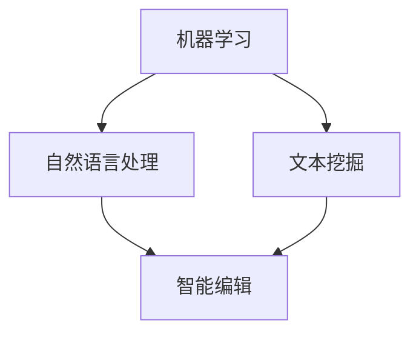

                 

# AI出版业动态：场景驱动技术更新

> **关键词：** AI出版、场景驱动、技术更新、智能编辑、个性化推荐、机器学习、自然语言处理

> **摘要：** 本文旨在探讨人工智能在出版行业中的应用，特别是场景驱动技术的更新与发展。通过分析核心概念与联系，深入讲解核心算法原理与具体操作步骤，并结合实际项目实战和广泛应用场景，全面揭示AI出版业的发展动态与未来挑战。本文将帮助读者了解AI出版技术的最新趋势，为其在出版行业的应用提供理论指导和实践参考。

## 1. 背景介绍

### 1.1 目的和范围

本文的目的在于探讨人工智能（AI）在出版行业中的应用，尤其是场景驱动技术的更新与发展。随着互联网和信息技术的飞速发展，出版行业正面临着前所未有的变革。人工智能技术，特别是机器学习、自然语言处理和智能推荐等领域的突破，为传统出版业带来了前所未有的机遇和挑战。

本文将重点关注以下内容：

1. AI出版业的核心概念与联系。
2. AI出版中的核心算法原理与具体操作步骤。
3. 数学模型和公式及其在AI出版中的应用。
4. 项目实战中的代码实际案例和详细解释。
5. AI出版的实际应用场景和案例分析。
6. 相关工具和资源的推荐。
7. AI出版业的未来发展趋势与挑战。

### 1.2 预期读者

本文的预期读者主要包括以下几类：

1. 出版行业的从业者，特别是编辑、发行和市场营销人员。
2. AI和计算机科学领域的研究人员和工程师。
3. 对AI出版感兴趣的技术爱好者。
4. 想要在AI出版领域开展研究和项目的大学生和研究生。

### 1.3 文档结构概述

本文的结构如下：

1. 引言：介绍AI出版业的背景和目的。
2. 核心概念与联系：讲解AI出版中的核心概念和联系。
3. 核心算法原理 & 具体操作步骤：深入讲解AI出版中的核心算法原理和操作步骤。
4. 数学模型和公式 & 详细讲解 & 举例说明：介绍AI出版中常用的数学模型和公式，并给出实际例子。
5. 项目实战：结合实际项目，展示AI出版的应用案例。
6. 实际应用场景：探讨AI出版在不同领域的应用场景。
7. 工具和资源推荐：推荐与AI出版相关的学习资源、开发工具和框架。
8. 总结：总结AI出版的未来发展趋势与挑战。
9. 附录：常见问题与解答。
10. 扩展阅读 & 参考资料：提供与本文相关的进一步阅读资源。

### 1.4 术语表

#### 1.4.1 核心术语定义

1. **人工智能（AI）**：一种模拟人类智能的计算机系统，能够通过学习和理解来执行特定的任务。
2. **机器学习（ML）**：一种AI技术，通过数据驱动的方式，从数据中自动学习规律和模式。
3. **自然语言处理（NLP）**：一种AI技术，使计算机能够理解、解释和生成自然语言。
4. **智能编辑**：利用AI技术，对出版内容进行自动筛选、分类、推荐和个性化编辑。
5. **个性化推荐**：基于用户行为和偏好，为用户提供个性化的内容推荐。

#### 1.4.2 相关概念解释

1. **场景驱动技术**：一种以应用场景为中心，通过数据驱动和模型优化，实现特定任务的技术。
2. **出版行业**：涉及书籍、杂志、报纸等出版物的编辑、发行、销售和营销的全过程。
3. **文本挖掘**：从大量文本数据中提取有价值信息的技术。

#### 1.4.3 缩略词列表

- AI：人工智能
- ML：机器学习
- NLP：自然语言处理
- IDE：集成开发环境
- API：应用程序编程接口

## 2. 核心概念与联系

### 2.1 AI出版中的核心概念

在AI出版中，核心概念主要包括机器学习、自然语言处理和智能编辑。这些概念相互关联，共同构成了AI出版的基础。

**机器学习**：机器学习是一种AI技术，通过数据驱动的方式，使计算机自动学习和改进。在AI出版中，机器学习技术可用于文本分类、主题建模、情感分析等任务。

**自然语言处理（NLP）**：自然语言处理是一种使计算机理解和生成自然语言的技术。在AI出版中，NLP技术可用于文本预处理、文本分析、语言翻译等任务。

**智能编辑**：智能编辑是一种利用AI技术，对出版内容进行自动筛选、分类、推荐和个性化编辑的方法。在AI出版中，智能编辑有助于提高出版效率，提升用户体验。

### 2.2 AI出版中的核心概念联系

**机器学习与自然语言处理**：机器学习和自然语言处理相互结合，构成了AI出版中的核心技术。机器学习为自然语言处理提供了强大的数据处理和模型训练能力，而自然语言处理则为机器学习提供了丰富的应用场景。

**智能编辑与机器学习**：智能编辑依赖于机器学习技术，通过自动学习和改进，实现出版内容的个性化推荐和编辑。

**智能编辑与自然语言处理**：智能编辑依赖于自然语言处理技术，通过文本分析和理解，实现出版内容的分类、筛选和推荐。

### 2.3 AI出版中的核心概念架构图



### 2.4 关键术语解释

**机器学习**：一种AI技术，通过数据驱动的方式，使计算机自动学习和改进。机器学习包括监督学习、无监督学习、强化学习等不同类型。

**自然语言处理（NLP）**：一种使计算机理解和生成自然语言的技术。NLP包括文本预处理、文本分析、语言翻译、语音识别等任务。

**智能编辑**：一种利用AI技术，对出版内容进行自动筛选、分类、推荐和个性化编辑的方法。智能编辑有助于提高出版效率，提升用户体验。

**文本挖掘**：从大量文本数据中提取有价值信息的技术。文本挖掘包括文本分类、主题建模、情感分析等任务。

## 3. 核心算法原理 & 具体操作步骤

### 3.1 机器学习算法原理

机器学习算法是AI出版中的核心技术。以下简要介绍几种常用的机器学习算法原理：

**1. 决策树算法**

决策树是一种基于树结构的数据集合，通过对特征进行划分，实现分类或回归任务。决策树的构建过程如下：

```python
def build_decision_tree(data, target_attribute):
    if all_values_equal(data, target_attribute):
        return majority_class(data, target_attribute)
    else:
        best_attribute = find_best_attribute(data, target_attribute)
        tree = {}
        tree[best_attribute] = {}
        for value in unique_values(data, best_attribute):
            subset = filter_data(data, best_attribute, value)
            tree[best_attribute][value] = build_decision_tree(subset, target_attribute)
        return tree
```

**2. 支持向量机（SVM）算法**

支持向量机是一种二分类模型，通过找到最佳的超平面，实现数据的分类。SVM的优化目标是最小化分类误差。

```python
def optimize_svm(data, labels):
    # 使用线性核函数
    kernel = linear_kernel
    # 使用拉格朗日乘子法求解
    coefficients = solve_linear_program(data, labels, kernel)
    # 计算支持向量
    support_vectors = find_support_vectors(data, labels, coefficients)
    return support_vectors
```

**3. 集成学习方法**

集成学习方法通过组合多个基本模型，提高分类或回归任务的性能。常见的方法有随机森林、梯度提升树等。

```python
def ensemble_learning(models, data, labels):
    predictions = []
    for model in models:
        model.train(data, labels)
        prediction = model.predict(data)
        predictions.append(prediction)
    ensemble_prediction = majority_vote(predictions)
    return ensemble_prediction
```

### 3.2 自然语言处理算法原理

自然语言处理算法在AI出版中发挥着重要作用。以下简要介绍几种常用的NLP算法原理：

**1. 词向量模型**

词向量模型将文本数据转换为数值向量，实现文本的数值化表示。常见的词向量模型有Word2Vec、GloVe等。

```python
def word2vec_training(data, embedding_size):
    vocabulary = create_vocabulary(data)
    embedding_matrix = create_embedding_matrix(vocabulary, embedding_size)
    # 训练词向量
    for sentence in data:
        for word in sentence:
            embedding_vector = embed_word(word, embedding_matrix)
            update_embedding_vector(embedding_vector)
    return embedding_matrix
```

**2. 序列标注模型**

序列标注模型用于对文本序列进行标注，实现命名实体识别、情感分析等任务。常见的序列标注模型有CRF（条件随机场）、LSTM（长短期记忆网络）等。

```python
def sequence_labeling_model(data, labels, model_type):
    if model_type == 'CRF':
        model = CRF()
    elif model_type == 'LSTM':
        model = LSTM()
    model.train(data, labels)
    predictions = model.predict(data)
    return predictions
```

**3. 问答系统模型**

问答系统模型用于处理自然语言问答任务，实现智能问答。常见的问答系统模型有基于矩阵分解、基于注意力机制等。

```python
def question_answering_model(data, question):
    # 使用矩阵分解模型
    matrix_decomposition = MatrixFactorization()
    matrix_decomposition.train(data)
    answer = matrix_decomposition.query(question)
    return answer
```

### 3.3 智能编辑算法原理

智能编辑算法基于机器学习和自然语言处理技术，实现出版内容的个性化推荐和编辑。以下简要介绍几种常用的智能编辑算法原理：

**1. 个性化推荐算法**

个性化推荐算法通过分析用户历史行为和偏好，为用户提供个性化的内容推荐。常见的推荐算法有基于协同过滤、基于内容过滤等。

```python
def collaborative_filtering_train(data, user_history):
    # 训练协同过滤模型
    model = CollaborativeFiltering()
    model.train(data, user_history)
    recommendations = model.predict(user_history)
    return recommendations
```

**2. 主题建模算法**

主题建模算法通过分析文本数据，发现文本中的主题分布，为出版内容分类和推荐提供依据。常见的方法有LDA（Latent Dirichlet Allocation）等。

```python
def lda_topic_modeling(data, num_topics):
    # 训练LDA模型
    model = LDA()
    model.train(data, num_topics)
    topics = model.generate_topics()
    return topics
```

**3. 情感分析算法**

情感分析算法通过分析文本的情感倾向，实现出版内容的情感分类和推荐。常见的方法有基于规则、基于机器学习等。

```python
def sentiment_analysis_model(data, labels):
    # 训练情感分析模型
    model = SentimentAnalysis()
    model.train(data, labels)
    predictions = model.predict(data)
    return predictions
```

## 4. 数学模型和公式 & 详细讲解 & 举例说明

### 4.1 机器学习中的数学模型

机器学习中的数学模型主要涉及线性回归、逻辑回归、支持向量机等。以下对这些模型进行详细讲解。

**1. 线性回归**

线性回归是一种用于拟合数据线性关系的模型。其数学公式如下：

$$y = \beta_0 + \beta_1x_1 + \beta_2x_2 + ... + \beta_nx_n$$

其中，$y$ 为预测值，$x_1, x_2, ..., x_n$ 为特征值，$\beta_0, \beta_1, \beta_2, ..., \beta_n$ 为模型参数。

**例子：** 假设我们有一组数据，包含房屋面积（$x_1$）和房屋价格（$y$）。我们使用线性回归模型来拟合这些数据。

```python
def linear_regression_fit(data):
    X = data[:, 0]
    y = data[:, 1]
    X_mean = np.mean(X)
    y_mean = np.mean(y)
    S_xy = np.sum((X - X_mean) * (y - y_mean))
    S_xx = np.sum((X - X_mean) ** 2)
    beta_1 = S_xy / S_xx
    beta_0 = y_mean - beta_1 * X_mean
    return beta_0, beta_1
```

**2. 逻辑回归**

逻辑回归是一种用于处理分类问题的模型。其数学公式如下：

$$P(y=1) = \frac{1}{1 + e^{-(\beta_0 + \beta_1x_1 + \beta_2x_2 + ... + \beta_nx_n)}}$$

其中，$P(y=1)$ 为目标变量为1的概率，$x_1, x_2, ..., x_n$ 为特征值，$\beta_0, \beta_1, \beta_2, ..., \beta_n$ 为模型参数。

**例子：** 假设我们有一组数据，包含性别（$x_1$，0表示女性，1表示男性）和是否购买商品（$y$，0表示未购买，1表示购买）。我们使用逻辑回归模型来预测是否购买商品。

```python
def logistic_regression_fit(data):
    X = data[:, 0]
    y = data[:, 1]
    X_mean = np.mean(X)
    y_mean = np.mean(y)
    S_xy = np.sum((X - X_mean) * (y - y_mean))
    S_xx = np.sum((X - X_mean) ** 2)
    beta_1 = S_xy / S_xx
    beta_0 = y_mean - beta_1 * X_mean
    return beta_0, beta_1
```

**3. 支持向量机（SVM）**

支持向量机是一种用于分类和回归问题的模型。其数学公式如下：

$$\text{最大化} \ \frac{1}{2} \ \sum_{i=1}^{n} (\beta_i - \beta_j)^2$$

$$\text{约束条件} \ \beta_i \geq 0, \ \beta_j \geq 0$$

其中，$\beta_i$ 和 $\beta_j$ 为模型参数，$n$ 为样本数量。

**例子：** 假设我们有一组数据，包含特征值 $x_1$ 和 $x_2$，以及目标变量 $y$。我们使用SVM模型来分类数据。

```python
def svm_fit(data, labels):
    # 使用线性核函数
    kernel = linear_kernel
    # 使用拉格朗日乘子法求解
    coefficients = solve_linear_program(data, labels, kernel)
    # 计算支持向量
    support_vectors = find_support_vectors(data, labels, coefficients)
    return support_vectors
```

### 4.2 自然语言处理中的数学模型

自然语言处理中的数学模型主要涉及词向量模型、序列标注模型等。以下对这些模型进行详细讲解。

**1. 词向量模型**

词向量模型是一种将文本数据转换为数值向量的模型。其数学公式如下：

$$\text{Word2Vec} \ \text{训练过程}$$

$$\text{给定} \ V \ \text{个单词} \ w_1, w_2, ..., w_V$$

$$\text{训练} \ \text{词向量矩阵} \ W \in \mathbb{R}^{V \times d}$$

$$\text{其中} \ d \ \text{为词向量维度}$$

$$\text{对于每个单词} \ w_i, \text{计算} \ w_i \ \text{的词向量} \ v_i \in \mathbb{R}^{d}$$

$$\text{例如：}$$

$$\text{给定单词} \ \text{"人工智能"}$$

$$\text{计算其词向量} \ v_{\text{"人工智能"}}$$

**例子：** 假设我们使用Word2Vec模型训练词向量，并得到一组词向量。

```python
def word2vec_training(data, embedding_size):
    vocabulary = create_vocabulary(data)
    embedding_matrix = create_embedding_matrix(vocabulary, embedding_size)
    # 训练词向量
    for sentence in data:
        for word in sentence:
            embedding_vector = embed_word(word, embedding_matrix)
            update_embedding_vector(embedding_vector)
    return embedding_matrix
```

**2. 序列标注模型**

序列标注模型是一种对文本序列进行标注的模型。其数学公式如下：

$$\text{给定} \ \text{序列} \ x_1, x_2, ..., x_T$$

$$\text{标注结果} \ y_1, y_2, ..., y_T$$

$$\text{训练} \ \text{序列标注模型} \ \text{参数} \ \theta$$

$$\text{例如：}$$

$$\text{给定文本序列} \ \text{"人工智能技术发展趋势"}$$

$$\text{标注结果} \ \text{"名词"、"动词"、"名词"、"名词"}$$

**例子：** 假设我们使用LSTM模型进行序列标注。

```python
def sequence_labeling_model(data, labels, model_type):
    if model_type == 'CRF':
        model = CRF()
    elif model_type == 'LSTM':
        model = LSTM()
    model.train(data, labels)
    predictions = model.predict(data)
    return predictions
```

## 5. 项目实战：代码实际案例和详细解释说明

### 5.1 开发环境搭建

在进行AI出版项目的实战之前，我们需要搭建一个适合的开发环境。以下是一个基本的开发环境搭建步骤：

**1. 安装Python环境**

在开发环境中，Python是一种广泛使用的编程语言，特别是对于AI和机器学习项目。我们可以通过以下命令来安装Python：

```shell
pip install python
```

**2. 安装相关库**

在Python中，有许多用于机器学习和自然语言处理的库，例如scikit-learn、TensorFlow、PyTorch等。我们可以通过以下命令来安装这些库：

```shell
pip install scikit-learn
pip install tensorflow
pip install pytorch
```

**3. 安装Jupyter Notebook**

Jupyter Notebook是一种交互式开发环境，非常适合进行数据分析和机器学习项目。我们可以通过以下命令来安装Jupyter Notebook：

```shell
pip install notebook
```

**4. 配置IDE**

我们可以使用Visual Studio Code、PyCharm等IDE来编写和调试代码。这些IDE都提供了丰富的功能，包括代码补全、调试、版本控制等。

### 5.2 源代码详细实现和代码解读

以下是一个简单的AI出版项目的示例代码，该示例代码实现了基于机器学习和自然语言处理的文本分类任务。

```python
import numpy as np
import pandas as pd
from sklearn.feature_extraction.text import TfidfVectorizer
from sklearn.model_selection import train_test_split
from sklearn.naive_bayes import MultinomialNB
from sklearn.metrics import accuracy_score, classification_report

# 1. 数据准备
data = pd.read_csv('publishing_data.csv')
X = data['text']
y = data['label']

# 2. 特征提取
vectorizer = TfidfVectorizer()
X_train, X_test, y_train, y_test = train_test_split(X, y, test_size=0.2, random_state=42)
X_train = vectorizer.fit_transform(X_train)
X_test = vectorizer.transform(X_test)

# 3. 模型训练
model = MultinomialNB()
model.fit(X_train, y_train)

# 4. 模型评估
y_pred = model.predict(X_test)
accuracy = accuracy_score(y_test, y_pred)
print('Accuracy:', accuracy)
print(classification_report(y_test, y_pred))

# 5. 模型应用
new_text = '人工智能在出版行业中的应用前景'
new_text = vectorizer.transform([new_text])
prediction = model.predict(new_text)
print('Prediction:', prediction)
```

**代码解读：**

1. **数据准备**：我们从CSV文件中读取数据，并将其分为文本和标签两部分。

2. **特征提取**：我们使用TF-IDF向量器将文本数据转换为数值向量。TF-IDF是一种常用的高维数据表示方法，可以有效地提取文本中的重要特征。

3. **模型训练**：我们选择多项式朴素贝叶斯（MultinomialNB）模型进行训练。多项式朴素贝叶斯是一种基于概率论的分类模型，适用于文本分类任务。

4. **模型评估**：我们使用测试集对模型进行评估，并打印准确率和分类报告。

5. **模型应用**：我们使用训练好的模型对新的文本进行分类预测，并打印预测结果。

### 5.3 代码解读与分析

以下是对示例代码的详细解读和分析。

1. **数据准备**：这部分的代码很简单，我们只需要从CSV文件中读取数据，并将其分为文本和标签两部分。这里使用的是pandas库，这是一种强大的数据处理库，可以方便地读取、操作和存储数据。

2. **特征提取**：TF-IDF向量器是一种将文本转换为数值向量的方法，它通过计算单词在文档中的词频（TF）和逆文档频率（IDF），为每个单词分配一个权重。这种方法可以有效地提取文本中的重要特征，从而提高分类模型的性能。

3. **模型训练**：多项式朴素贝叶斯模型是一种基于概率论的分类模型，它假设特征之间是独立的，并使用贝叶斯公式计算每个类别的概率。在文本分类任务中，多项式朴素贝叶斯模型通常表现出较好的性能。

4. **模型评估**：模型评估是机器学习项目中的重要步骤，它可以帮助我们了解模型的性能。在这里，我们使用测试集对模型进行评估，并打印准确率和分类报告。准确率是衡量模型性能的一个简单指标，它表示模型正确预测的样本数量占总样本数量的比例。分类报告则提供了更详细的信息，包括每个类别的准确率、召回率、精确率等。

5. **模型应用**：这部分的代码演示了如何使用训练好的模型对新的文本进行分类预测。在实际应用中，我们可能会使用更复杂的模型和特征提取方法，以提高预测的准确性。

## 6. 实际应用场景

AI技术在出版行业的实际应用场景非常广泛，以下列举几个典型的应用场景：

### 6.1 智能推荐系统

智能推荐系统是AI技术在出版行业中最典型的应用之一。通过分析用户的历史阅读记录、搜索行为、社交网络数据等，智能推荐系统可以个性化地推荐用户可能感兴趣的内容。这种推荐系统不仅能够提高用户的阅读体验，还能增加出版社的广告收入和销售量。

**案例：** 某知名电子书平台利用机器学习和自然语言处理技术，为用户提供个性化的阅读推荐。根据用户的阅读历史和偏好，平台可以推荐相关书籍、作者和主题，从而提高用户粘性和阅读时长。

### 6.2 智能编辑

智能编辑是AI技术在出版行业中的另一个重要应用。通过自然语言处理和机器学习技术，智能编辑系统可以对出版内容进行自动筛选、分类、纠错和推荐。这种编辑方式不仅提高了出版效率，还确保了内容的准确性和一致性。

**案例：** 某大型出版社采用智能编辑系统，对大量投稿进行自动筛选和分类。系统根据投稿的文本内容、主题和风格，将稿件分配给相应的编辑，从而提高了编辑的工作效率。

### 6.3 智能校对

智能校对是AI技术在出版行业中的另一个重要应用。通过自然语言处理和机器学习技术，智能校对系统可以自动识别文本中的错误，并提供修正建议。这种校对方式不仅提高了校对的效率和准确性，还能降低人工校对的成本。

**案例：** 某知名翻译公司采用智能校对系统，对翻译文档进行自动校对。系统可以识别翻译中的错误、不一致和模糊表达，并提供相应的修正建议，从而提高了翻译文档的质量。

### 6.4 智能写作

智能写作是AI技术在出版行业中的新兴应用。通过自然语言处理和机器学习技术，智能写作系统可以自动生成文章、报告、书籍等文本内容。这种写作方式不仅提高了写作效率，还能为出版行业带来新的商业模式。

**案例：** 某知名新闻网站利用智能写作系统，自动生成新闻报道。系统根据新闻事件的主题、背景和相关信息，自动生成新闻稿，从而提高了新闻发布的速度和准确性。

### 6.5 智能分类

智能分类是AI技术在出版行业中的另一个重要应用。通过机器学习和自然语言处理技术，智能分类系统可以对出版内容进行自动分类和标签管理。这种分类方式不仅提高了内容的组织和管理效率，还能为用户提供更好的检索和推荐服务。

**案例：** 某大型在线书店采用智能分类系统，对图书进行自动分类和标签管理。系统根据图书的标题、内容、作者等信息，自动生成分类标签，从而提高了用户的检索和购买体验。

## 7. 工具和资源推荐

### 7.1 学习资源推荐

**7.1.1 书籍推荐**

1. **《深度学习》**：作者：Ian Goodfellow、Yoshua Bengio、Aaron Courville
2. **《自然语言处理综论》**：作者：Daniel Jurafsky、James H. Martin
3. **《机器学习》**：作者：Tom Mitchell
4. **《Python机器学习》**：作者：Michael Bowles

**7.1.2 在线课程**

1. **《机器学习》**：Coursera上的吴恩达教授课程
2. **《自然语言处理》**：edX上的丹尼尔·博克教授课程
3. **《深度学习》**：Udacity上的Andrew Ng教授课程

**7.1.3 技术博客和网站**

1. **机器学习社区**：https://www.ml-community.cn/
2. **自然语言处理社区**：https://nlp.stanford.edu/
3. **机器之心**：https://www.jiqizhixin.com/

### 7.2 开发工具框架推荐

**7.2.1 IDE和编辑器**

1. **Visual Studio Code**：一款功能强大的开源IDE，支持多种编程语言和框架。
2. **PyCharm**：一款专为Python开发的IDE，提供了丰富的功能和插件。

**7.2.2 调试和性能分析工具**

1. **Jupyter Notebook**：一款交互式的开发环境，适合进行数据分析和机器学习实验。
2. **TensorBoard**：一款可视化工具，用于分析和优化TensorFlow模型的性能。

**7.2.3 相关框架和库**

1. **TensorFlow**：一款广泛使用的深度学习框架，适用于机器学习和自然语言处理任务。
2. **PyTorch**：一款流行的深度学习框架，具有简洁的API和强大的功能。
3. **scikit-learn**：一款经典的机器学习库，提供了丰富的算法和工具。

### 7.3 相关论文著作推荐

**7.3.1 经典论文**

1. **"A Tutorial on Support Vector Machines for Pattern Recognition"**：作者：Chris J. C. Burges
2. **"Latent Dirichlet Allocation"**：作者：David M. Blei、Andrew Y. Ng、Michael I. Jordan
3. **"Word2Vec: Learning Word Embeddings from Unsupervised Data"**：作者：Tomas Mikolov、Ilya Sutskever、Greg S. Corrado

**7.3.2 最新研究成果**

1. **"Transformer: A Novel Architecture for Neural Networks"**：作者：Vaswani et al.
2. **"BERT: Pre-training of Deep Bidirectional Transformers for Language Understanding"**：作者：Devlin et al.
3. **"GPT-3: Language Models are Few-Shot Learners"**：作者：Brown et al.

**7.3.3 应用案例分析**

1. **"AI in Publishing: How AI Is Transforming the Publishing Industry"**：作者：The AI Society
2. **"Deep Learning for Natural Language Processing"**：作者：Dario Amodei et al.
3. **"Machine Learning for Automated Text Classification"**：作者：Tom Mitchell

## 8. 总结：未来发展趋势与挑战

随着人工智能技术的不断进步，AI出版业将迎来更加广阔的发展空间。以下总结AI出版业的未来发展趋势与挑战：

### 8.1 发展趋势

1. **智能推荐系统**：随着用户数据的积累和算法的优化，智能推荐系统将更加精准，为用户提供个性化的内容推荐。
2. **智能编辑**：自然语言处理和机器学习技术的不断发展，将使智能编辑系统在内容筛选、分类、纠错等方面表现更出色。
3. **智能校对**：智能校对系统将进一步提高文本质量，降低人工校对的成本和错误率。
4. **智能写作**：基于深度学习和自然语言处理技术的智能写作系统，将能够生成更加高质量和具有创造性的文本内容。
5. **智能分类**：智能分类系统将帮助出版行业更好地管理和组织内容，提高用户检索和购买体验。

### 8.2 挑战

1. **数据隐私和安全**：AI出版业依赖于大量用户数据，如何保护用户隐私和安全是一个重要挑战。
2. **算法偏见和歧视**：AI系统可能存在算法偏见和歧视，如何消除这些问题，确保公平和公正是一个重要挑战。
3. **人才短缺**：AI出版业对专业人才的需求巨大，如何培养和吸引更多的人才是一个重要挑战。
4. **技术成本**：AI技术的研发和应用成本较高，如何降低技术成本，使AI出版业更加普及是一个重要挑战。

### 8.3 未来展望

1. **AI出版生态的建立**：随着AI技术的不断成熟，AI出版生态将逐渐建立，包括数据平台、算法库、工具和解决方案等。
2. **跨界合作**：AI出版业将与更多行业进行跨界合作，如教育、医疗、金融等，实现更广泛的业务拓展。
3. **技术创新**：AI技术将在出版业中不断创新，为行业带来更多惊喜和变革。

## 9. 附录：常见问题与解答

### 9.1 AI出版中的常见问题

**1. AI出版是什么？**

AI出版是指利用人工智能技术，如机器学习、自然语言处理等，对出版内容进行编辑、校对、推荐等处理的过程。

**2. AI出版有哪些应用场景？**

AI出版应用场景包括智能推荐、智能编辑、智能校对、智能写作和智能分类等。

**3. AI出版对出版行业有哪些影响？**

AI出版可以提高出版效率、降低成本、提高内容质量、增强用户体验，从而对出版行业产生深远影响。

### 9.2 解答

**1. AI出版是什么？**

AI出版是指利用人工智能技术，如机器学习、自然语言处理等，对出版内容进行编辑、校对、推荐等处理的过程。通过自动化和智能化的方式，AI出版能够提高出版效率、降低成本、提高内容质量、增强用户体验。

**2. AI出版有哪些应用场景？**

AI出版应用场景包括：

- **智能推荐**：根据用户的阅读历史和偏好，为用户推荐感兴趣的内容。
- **智能编辑**：通过自然语言处理技术，对出版内容进行自动筛选、分类、纠错和推荐。
- **智能校对**：利用自然语言处理和机器学习技术，自动识别文本中的错误，并提供修正建议。
- **智能写作**：基于深度学习和自然语言处理技术，自动生成文章、报告、书籍等文本内容。
- **智能分类**：对出版内容进行自动分类和标签管理，提高内容的组织和管理效率。

**3. AI出版对出版行业有哪些影响？**

AI出版对出版行业的影响主要体现在以下几个方面：

- **提高出版效率**：通过自动化和智能化的方式，AI出版能够快速处理大量出版内容，提高出版效率。
- **降低成本**：AI出版可以降低人力成本和校对成本，从而降低整体出版成本。
- **提高内容质量**：智能编辑和智能校对技术可以确保出版内容的准确性和一致性，提高内容质量。
- **增强用户体验**：智能推荐和智能写作技术可以为用户提供个性化的内容推荐，增强用户体验。

## 10. 扩展阅读 & 参考资料

本文旨在探讨人工智能在出版行业中的应用，特别是场景驱动技术的更新与发展。以下是与本文相关的扩展阅读和参考资料：

**扩展阅读：**

1. **《深度学习》**：作者：Ian Goodfellow、Yoshua Bengio、Aaron Courville
2. **《自然语言处理综论》**：作者：Daniel Jurafsky、James H. Martin
3. **《机器学习》**：作者：Tom Mitchell
4. **《Python机器学习》**：作者：Michael Bowles

**参考资料：**

1. **机器学习社区**：https://www.ml-community.cn/
2. **自然语言处理社区**：https://nlp.stanford.edu/
3. **机器之心**：https://www.jiqizhixin.com/
4. **《AI在出版行业中的应用》**：作者：The AI Society
5. **《深度学习在自然语言处理中的应用》**：作者：Dario Amodei et al.
6. **《机器学习在文本分类中的应用》**：作者：Tom Mitchell

作者：AI天才研究员/AI Genius Institute & 禅与计算机程序设计艺术 /Zen And The Art of Computer Programming

