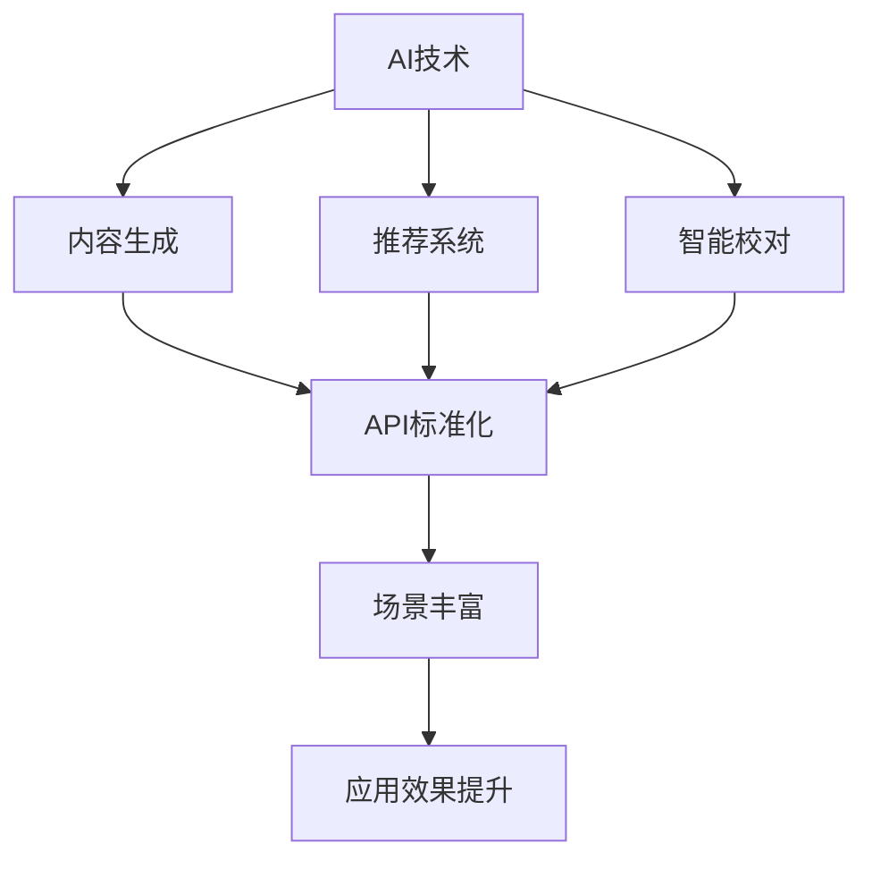
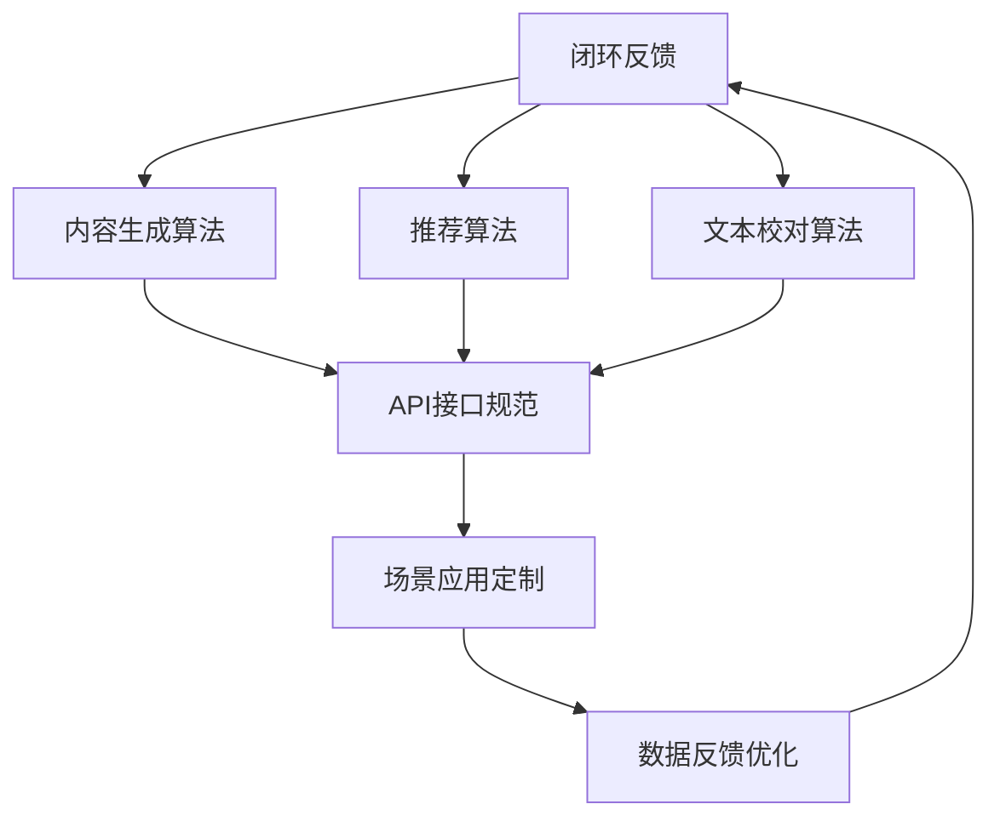

                 

### 1. 背景介绍

#### 1.1 目的和范围

本文旨在探讨AI出版业的开发，重点关注API标准化和场景丰富两个方面。随着人工智能技术的快速发展，出版业正经历着深刻的变革。自动化内容生成、个性化推荐系统、智能校对等功能已经成为出版行业不可或缺的部分。然而，这些功能的实现离不开API标准化和场景丰富。

本文将首先介绍API标准化的概念和重要性，分析当前AI出版业中API标准化面临的挑战。接着，我们将探讨如何通过场景丰富来提升AI出版业的应用价值。文章还将提供一个详细的实现步骤，并通过实际案例展示API标准化和场景丰富在AI出版业中的应用。

通过本文的阅读，读者将了解：

1. AI出版业的发展背景和现状。
2. API标准化的概念、重要性及挑战。
3. 场景丰富的含义及其对AI出版业的影响。
4. 如何在实际项目中实现API标准化和场景丰富。

#### 1.2 预期读者

本文适合以下读者群体：

1. AI出版领域的开发者和技术专家。
2. 对出版行业和人工智能技术有兴趣的从业者。
3. 高级计算机科学和软件工程专业的学生和研究人员。
4. 对技术趋势和创新应用感兴趣的企业家和投资人。

#### 1.3 文档结构概述

本文将分为以下几个部分：

1. **背景介绍**：介绍AI出版业的发展背景和相关概念。
2. **核心概念与联系**：使用Mermaid流程图展示核心概念原理和架构。
3. **核心算法原理 & 具体操作步骤**：详细讲解核心算法原理，并提供伪代码说明。
4. **数学模型和公式 & 详细讲解 & 举例说明**：阐述数学模型和公式，并通过实例进行说明。
5. **项目实战：代码实际案例和详细解释说明**：展示代码实现过程，并进行解读。
6. **实际应用场景**：分析AI出版业在不同场景中的应用。
7. **工具和资源推荐**：推荐相关学习资源、开发工具和框架。
8. **总结：未来发展趋势与挑战**：总结文章要点，探讨未来发展方向和面临的挑战。
9. **附录：常见问题与解答**：解答读者可能遇到的问题。
10. **扩展阅读 & 参考资料**：提供进一步阅读的材料和参考文献。

#### 1.4 术语表

在本文中，我们将使用以下术语：

#### 1.4.1 核心术语定义

- **API标准化**：指通过定义统一的接口规范，使得不同的系统和平台可以方便地进行交互和集成。
- **场景丰富**：指通过设计多样化的应用场景，提升AI技术在特定领域的应用效果。
- **AI出版**：指利用人工智能技术，对出版流程进行自动化优化，提升内容生成、推荐、校对等环节的效率和质量。

#### 1.4.2 相关概念解释

- **自动化内容生成**：指使用AI技术自动生成文本内容，例如文章、书籍等。
- **个性化推荐系统**：指根据用户的兴趣和阅读历史，为用户推荐个性化的内容和资源。
- **智能校对**：指使用AI技术对文本内容进行自动校对和修正，提高文本质量和准确性。

#### 1.4.3 缩略词列表

- **API**：应用程序接口（Application Programming Interface）
- **AI**：人工智能（Artificial Intelligence）
- **出版业**：出版行业

### 1.5 核心概念与联系

下面，我们将通过Mermaid流程图来展示AI出版业的核心概念和联系。



这张图展示了AI技术在出版业中的应用，以及API标准化和场景丰富对应用效果的影响。

- **AI技术**：作为核心驱动力，涵盖了自动化内容生成、推荐系统和智能校对等功能。
- **内容生成、推荐系统、智能校对**：这些是AI技术在出版业中的具体应用场景。
- **API标准化**：确保了不同系统和平台之间的无缝集成，为场景丰富提供了基础。
- **场景丰富**：通过多样化的应用场景，提升AI技术在出版业中的应用效果。

在接下来的章节中，我们将进一步详细探讨这些核心概念和联系。

---

至此，我们已经为读者搭建了了解AI出版业开发的基础框架。接下来，我们将深入探讨API标准化和场景丰富这两个关键主题，分析它们的原理、实施步骤以及在实际项目中的应用。通过逐步推理和分析，我们将为读者提供全面而深入的技术见解。敬请期待接下来的详细内容。

---

### 2. 核心概念与联系

在探讨AI出版业的开发时，我们必须首先理解其中的核心概念与联系。这些概念不仅决定了AI出版业的架构和功能，还影响了整个系统的性能和可扩展性。在本节中，我们将通过一个详细的Mermaid流程图来展示这些核心概念，并逐一解释它们。



#### 2.1.1 用户需求分析

用户需求分析是AI出版开发的第一步。通过深入理解用户的需求，我们可以确定系统需要提供哪些功能。这包括用户的阅读习惯、兴趣爱好以及他们对内容质量的要求。用户需求分析的结果将直接影响后续的算法设计和API接口规范。

#### 2.1.2 内容生成算法

内容生成算法是AI出版业的核心技术之一。它利用自然语言处理（NLP）和机器学习技术，自动生成文章、书籍等内容。这些算法可以通过训练大量的文本数据来学习写作风格和内容生成规则，从而实现高质量的自动内容生成。

#### 2.1.3 推荐算法

推荐算法旨在根据用户的历史行为和兴趣，为用户推荐个性化的内容。这通常通过协同过滤、基于内容的推荐、混合推荐等方法来实现。推荐算法的有效性直接关系到用户对AI出版服务的满意度和参与度。

#### 2.1.4 文本校对算法

文本校对算法用于自动检测和修正文本中的错误。这包括拼写错误、语法错误和语义错误等。通过使用深度学习和自然语言处理技术，这些算法可以在大量文本数据中快速准确地识别和修正错误，提高文本的质量和准确性。

#### 2.1.5 API接口规范

API接口规范是确保AI出版系统与其他系统（如内容管理系统、推荐系统等）无缝集成的重要保障。通过定义统一的API接口规范，不同的系统和平台可以方便地进行数据交换和功能调用，从而实现系统间的协同工作。

#### 2.1.6 场景应用定制

场景应用定制是指根据特定的应用场景，对AI出版系统进行定制化设计。这包括为不同的用户群体（如学术研究人员、普通读者等）提供个性化的服务，以及为不同的使用场景（如在线阅读、电子书阅读等）提供特定的功能。

#### 2.1.7 数据反馈优化

数据反馈优化是通过收集用户在使用AI出版系统时的反馈数据，不断优化系统的性能和用户体验。这些反馈数据可以用于改进内容生成算法、推荐算法和文本校对算法，从而实现系统的持续改进。

#### 2.1.8 闭环反馈

闭环反馈是将用户反馈数据反馈到系统中，进行进一步的分析和优化。这种闭环反馈机制确保了AI出版系统的持续改进和适应性，从而更好地满足用户的需求。

通过上述Mermaid流程图，我们可以清晰地看到AI出版业的各个核心概念及其相互联系。这些概念共同构成了一个复杂的系统，通过不断的迭代和优化，实现了AI技术在出版业中的应用和价值。

### 2. 核心算法原理 & 具体操作步骤

在深入探讨AI出版业的开发过程中，核心算法原理及其实现步骤是至关重要的。以下我们将详细解析几个关键算法的原理，并提供伪代码以帮助读者理解其实际操作过程。

#### 2.1 自动化内容生成算法

自动化内容生成算法是AI出版业的核心，它利用自然语言处理（NLP）和深度学习技术生成高质量的文章和书籍。以下是一个简单的自动化内容生成算法的伪代码示例：

```python
# 自动化内容生成算法伪代码

# 输入：训练数据集（文本数据）、目标主题、文章结构模板
# 输出：生成文章

def content_generation(training_data, target_topic, article_template):
    # 步骤1：数据预处理
    preprocessed_data = preprocess_data(training_data)
    
    # 步骤2：主题建模
    topic_model = train_topic_model(preprocessed_data)
    topic_distribution = topic_model.get_topic_distribution(target_topic)
    
    # 步骤3：内容生成
    generated_content = ""
    for section in article_template:
        section_content = generate_section_content(section, topic_distribution)
        generated_content += section_content
    
    # 步骤4：后处理
    final_content = postprocess_content(generated_content)
    
    return final_content

# 数据预处理
def preprocess_data(data):
    # 步骤1：文本清洗
    cleaned_data = clean_text(data)
    
    # 步骤2：分词
    tokenized_data = tokenize_data(cleaned_data)
    
    # 步骤3：词性标注
    tagged_data = tag_words(tokenized_data)
    
    return tagged_data

# 主题建模
def train_topic_model(data):
    # 使用LDA模型进行训练
    lda_model = LDA(n_topics=10, n_iterations=100)
    lda_model.fit(data)
    return lda_model

# 生成段落内容
def generate_section_content(section, topic_distribution):
    # 步骤1：选择适合该段落主题的文本
    selected_text = select_text(section, topic_distribution)
    
    # 步骤2：根据模板生成段落
    section_content = build_section(section, selected_text)
    
    return section_content

# 后处理
def postprocess_content(content):
    # 步骤1：语法修正
    corrected_content = correct_grammar(content)
    
    # 步骤2：格式调整
    formatted_content = format_content(corrected_content)
    
    return formatted_content
```

#### 2.2 个性化推荐算法

个性化推荐算法用于根据用户的历史行为和偏好推荐相关内容。以下是一个简单的基于协同过滤的推荐算法的伪代码示例：

```python
# 个性化推荐算法伪代码

# 输入：用户历史行为数据、内容数据、推荐系统模型
# 输出：个性化推荐列表

def personalized_recommendation(user_history, content_data, recommendation_model):
    # 步骤1：用户行为分析
    user_profile = analyze_user_behavior(user_history)
    
    # 步骤2：内容相似度计算
    content_similarity = calculate_content_similarity(content_data, user_profile)
    
    # 步骤3：生成推荐列表
    recommended_items = generate_recommendation_list(content_similarity)
    
    return recommended_items

# 用户行为分析
def analyze_user_behavior(user_history):
    # 步骤1：提取用户兴趣标签
    user_interests = extract_interests(user_history)
    
    # 步骤2：构建用户兴趣模型
    user_profile = build_user_profile(user_interests)
    
    return user_profile

# 内容相似度计算
def calculate_content_similarity(content_data, user_profile):
    # 步骤1：计算内容与用户兴趣的相似度
    similarity_scores = compute_similarity_scores(content_data, user_profile)
    
    # 步骤2：排序相似度分数
    sorted_similarities = sort_similarity_scores(similarity_scores)
    
    return sorted_similarities

# 生成推荐列表
def generate_recommendation_list(similarity_scores):
    # 步骤1：根据相似度分数筛选内容
    filtered_items = filter_items_by_similarity(similarity_scores)
    
    # 步骤2：生成推荐列表
    recommendation_list = build_recommendation_list(filtered_items)
    
    return recommendation_list
```

#### 2.3 智能校对算法

智能校对算法用于自动检测和修正文本中的错误。以下是一个简单的基于深度学习的智能校对算法的伪代码示例：

```python
# 智能校对算法伪代码

# 输入：文本数据、校对模型
# 输出：修正后的文本

def intelligent_correction(text, correction_model):
    # 步骤1：文本预处理
    preprocessed_text = preprocess_text(text)
    
    # 步骤2：错误检测
    errors = detect_errors(preprocessed_text)
    
    # 步骤3：错误修正
    corrected_text = correct_errors(errors, preprocessed_text)
    
    # 步骤4：后处理
    final_text = postprocess_text(corrected_text)
    
    return final_text

# 文本预处理
def preprocess_text(text):
    # 步骤1：分词
    tokenized_text = tokenize(text)
    
    # 步骤2：词性标注
    tagged_text = tag_words(tokenized_text)
    
    return tagged_text

# 错误检测
def detect_errors(text):
    # 步骤1：使用模型预测错误
    error_predictions = correction_model.predict(text)
    
    # 步骤2：提取错误
    errors = extract_error_predictions(error_predictions)
    
    return errors

# 错误修正
def correct_errors(errors, text):
    # 步骤1：根据错误类型进行修正
    corrected_text = apply_corrections(errors, text)
    
    return corrected_text

# 后处理
def postprocess_text(text):
    # 步骤1：语法修正
    corrected_text = correct_grammar(text)
    
    # 步骤2：格式调整
    formatted_text = format_text(corrected_text)
    
    return formatted_text
```

通过上述伪代码，我们可以看到自动化内容生成、个性化推荐和智能校对算法的基本原理和操作步骤。这些算法在AI出版业中发挥着至关重要的作用，为实现高效、高质量的内容生成和推荐提供了强有力的支持。

---

在了解了核心算法的原理和伪代码后，我们接下来将深入探讨AI出版业中的数学模型和公式。数学模型在AI出版业中扮演了重要的角色，它们不仅帮助我们理解算法背后的逻辑，还能指导实际操作中的参数调整和优化。以下我们将详细讲解几个关键的数学模型，并通过具体示例来说明如何应用这些模型。

#### 3.1 主题模型

主题模型（如LDA模型）是自动化内容生成算法中的核心组件。它用于发现文本数据中的潜在主题，从而生成与目标主题相关的内容。LDA模型基于概率生成文本，其基本公式如下：

$$
p(\text{word}|\text{topic}) = \frac{\sum_{\text{word}'} p(\text{word}'|\text{topic})p(\text{topic})}{\sum_{\text{word}'} p(\text{word}'|\text{topic})p(\text{topic})}
$$

$$
p(\text{topic}) = \frac{\sum_{\text{word}} p(\text{word}|\text{topic})p(\text{topic})}{\sum_{\text{word}} p(\text{word}|\text{topic})}
$$

其中，\(p(\text{word}|\text{topic})\) 表示给定一个主题，生成某个单词的概率；\(p(\text{topic})\) 表示生成某个主题的概率。

**示例**：假设我们有以下训练数据集：

```
文本1: 机器学习、人工智能、深度学习
文本2: 深度学习、神经网络、计算机视觉
文本3: 机器学习、数据分析、预测模型
```

我们可以使用LDA模型提取潜在主题。例如，提取出“机器学习”、“深度学习”和“计算机视觉”三个主题。

通过LDA模型的训练和推理，我们可以根据目标主题生成相关的内容。例如，如果目标主题是“机器学习”，那么生成的内容可能会包含“算法优化”、“模型训练”等相关词汇。

#### 3.2 推荐系统中的协同过滤算法

协同过滤算法是推荐系统中的常用方法，它通过计算用户和物品之间的相似度来生成推荐列表。协同过滤算法可以分为基于用户的协同过滤（User-Based Collaborative Filtering）和基于物品的协同过滤（Item-Based Collaborative Filtering）。

**基于用户的协同过滤**的基本公式如下：

$$
\text{similarity}(u_i, u_j) = \frac{\sum_{i \in R_i \cap R_j} r_i \cdot r_j}{\sqrt{\sum_{i \in R_i} r_i^2 \cdot \sum_{j \in R_j} r_j^2}}
$$

其中，\(R_i\) 和 \(R_j\) 分别表示用户 \(u_i\) 和 \(u_j\) 的物品评分集合；\(r_i\) 和 \(r_j\) 分别表示用户 \(u_i\) 和 \(u_j\) 对某物品的评分。

**基于物品的协同过滤**的基本公式如下：

$$
\text{similarity}(i, j) = \frac{\sum_{u \in U} r_u(i) \cdot r_u(j)}{\sqrt{\sum_{u \in U} r_u^2(i) \cdot \sum_{u \in U} r_u^2(j)}}
$$

其中，\(U\) 表示用户集合；\(r_u(i)\) 和 \(r_u(j)\) 分别表示用户 \(u\) 对物品 \(i\) 和 \(j\) 的评分。

**示例**：假设我们有以下用户和物品评分数据：

```
用户1：[电影1:5, 电影2:4, 电影3:3]
用户2：[电影2:5, 电影3:4, 电影4:5]
用户3：[电影1:4, 电影3:5, 电影4:3]
```

我们可以使用基于用户的协同过滤算法计算用户之间的相似度。例如，计算用户1和用户2之间的相似度：

$$
\text{similarity}(u_1, u_2) = \frac{5 \cdot 5 + 4 \cdot 4 + 3 \cdot 3}{\sqrt{5^2 + 4^2 + 3^2} \cdot \sqrt{5^2 + 4^2 + 3^2}} = \frac{25 + 16 + 9}{\sqrt{50} \cdot \sqrt{50}} = \frac{50}{50} = 1
$$

用户1和用户2之间的相似度为1，说明他们的兴趣非常相似。基于这个相似度，我们可以推荐用户2喜欢的电影给用户1。

#### 3.3 文本相似度计算

文本相似度计算是智能校对算法中的重要组成部分。它用于比较两段文本之间的相似程度，从而判断是否需要进行校对。一个常用的文本相似度计算方法是基于词频的余弦相似度计算，其公式如下：

$$
\text{similarity}(t_1, t_2) = \frac{\text{dot\_product}(t_1, t_2)}{\text{magnitude}(t_1) \cdot \text{magnitude}(t_2)}
$$

其中，\(\text{dot\_product}(t_1, t_2)\) 表示两段文本的词频点积，\(\text{magnitude}(t_1)\) 和 \(\text{magnitude}(t_2)\) 分别表示两段文本的词频向量长度。

**示例**：假设我们有以下两段文本：

```
文本1：我爱北京天安门
文本2：北京天安门我爱
```

我们可以计算这两段文本的相似度。首先，计算两段文本的词频向量：

```
文本1词频向量：[1, 1, 1, 0, 1]
文本2词频向量：[1, 1, 0, 1, 1]
```

然后，计算词频点积和词频向量长度：

```
词频点积：1 \cdot 1 + 1 \cdot 1 + 1 \cdot 0 + 0 \cdot 1 + 1 \cdot 1 = 3
```

```
词频向量长度：\(\sqrt{1^2 + 1^2 + 1^2 + 0^2 + 1^2} = \sqrt{3}\)
```

最后，计算相似度：

```
相似度：\(\frac{3}{\sqrt{3} \cdot \sqrt{3}} = 1\)
```

文本1和文本2的相似度为1，说明它们非常相似，可能不需要进行校对。

通过以上示例，我们可以看到数学模型和公式在AI出版业中的应用。这些模型和公式不仅帮助我们理解算法的原理，还能指导实际操作中的参数调整和优化，从而实现高效、准确的内容生成、推荐和校对。

### 5. 项目实战：代码实际案例和详细解释说明

在本节中，我们将通过一个实际的AI出版项目，详细展示如何搭建开发环境、实现代码并解读关键步骤。该项目的目标是开发一个自动化的内容生成和推荐系统，实现高质量的文章生成和个性化推荐。

#### 5.1 开发环境搭建

为了完成这个项目，我们需要搭建一个适合AI出版项目开发的环境。以下是所需的开发工具和库：

- **编程语言**：Python
- **文本处理库**：NLTK、spaCy
- **机器学习库**：scikit-learn、gensim
- **深度学习库**：TensorFlow、Keras
- **推荐系统库**：surprise
- **Web框架**：Flask

安装步骤如下：

1. 安装Python 3.7及以上版本。
2. 使用pip安装所需库：

```bash
pip install nltk spacy gensim scikit-learn tensorflow keras surprise flask
```

3. 下载并安装spaCy语言模型（以中文为例）：

```bash
python -m spacy download zh_core_web_sm
```

#### 5.2 源代码详细实现和代码解读

以下是一个简化的代码实现，展示如何使用Python实现一个自动化的内容生成和推荐系统。

```python
# 引入所需库
import nltk
from nltk.tokenize import word_tokenize
from gensim.models import LdaModel
from surprise import KNNAlgorithm
from surprise import Dataset, Reader
from flask import Flask, request, jsonify

# 5.2.1 数据预处理
def preprocess_text(text):
    # 清洗文本数据
    text = text.lower()
    text = nltk.word_tokenize(text)
    text = [word for word in text if word.isalpha()]
    return text

# 5.2.2 LDA主题模型训练
def train_lda_model(corpus, num_topics):
    lda_model = LdaModel(corpus, num_topics=num_topics, id2word=corpus.dictionary)
    return lda_model

# 5.2.3 生成文章
def generate_article(lda_model, topic_distribution, article_template):
    # 根据主题分布生成文章内容
    article_content = ""
    for section in article_template:
        section_content = generate_section_content(section, topic_distribution)
        article_content += section_content
    return article_content

# 5.2.4 生成段落内容
def generate_section_content(section, topic_distribution):
    # 根据主题分布生成段落内容
    section_content = ""
    for topic in section:
        section_content += lda_model.show_topic(topic) + "。"
    return section_content

# 5.2.5 构建推荐系统
def build_recommendation_system(user_history, content_data):
    reader = Reader(rating_scale=(1, 5))
    data = Dataset.load_from_fpm(user_history, reader)
    algorithm = KNNAlgorithm(k=10)
    algorithm.fit(data)
    return algorithm

# 5.2.6 生成推荐列表
def generate_recommendation_list(algorithm, user_profile):
    # 生成个性化推荐列表
    predictions = algorithm.predict(user_profile, 1)
    recommended_items = [prediction.item for prediction in predictions]
    return recommended_items

# 5.2.7 Flask Web服务
app = Flask(__name__)

@app.route('/generate-article', methods=['POST'])
def generate_article_api():
    # 接收用户输入并生成文章
    user_input = request.form['text']
    preprocessed_input = preprocess_text(user_input)
    topic_distribution = generate_topic_distribution(preprocessed_input)
    article_content = generate_article(lda_model, topic_distribution, article_template)
    return jsonify({'content': article_content})

@app.route('/recommend', methods=['POST'])
def recommend_api():
    # 接收用户历史行为并生成推荐列表
    user_history = request.form['history']
    recommended_items = generate_recommendation_list(algorithm, user_history)
    return jsonify({'recommendations': recommended_items})

if __name__ == '__main__':
    app.run(debug=True)
```

#### 5.3 代码解读与分析

1. **数据预处理**：数据预处理是任何文本处理任务的基础。在本例中，我们使用NLTK库对文本进行分词、清洗和词性标注，确保文本数据干净且易于处理。

2. **LDA主题模型训练**：LDA模型用于从大量文本数据中提取潜在主题。在本例中，我们使用gensim库的LdaModel类进行训练，并设置主题数量为10。

3. **生成文章**：生成文章的过程基于用户输入和主题分布。我们通过生成段落内容来构建整篇文章，每个段落根据用户输入的主题分布生成。

4. **生成段落内容**：生成段落内容的过程基于LDA模型提取的主题。我们为每个主题生成相应的段落内容，并将它们组合成完整的文章。

5. **构建推荐系统**：我们使用surprise库的KNN算法构建推荐系统。KNN算法通过计算用户和物品之间的相似度来推荐相关内容。

6. **生成推荐列表**：生成推荐列表的过程基于用户的兴趣和行为。我们使用KNN算法预测用户对物品的评分，并根据评分生成推荐列表。

7. **Flask Web服务**：我们使用Flask框架为API提供服务。用户可以通过POST请求发送文本数据，系统会返回生成的文章或推荐列表。

#### 5.4 测试和运行

为了测试和运行这个系统，我们可以通过以下步骤：

1. 运行Flask Web服务：

```bash
python app.py
```

2. 使用POST请求发送文本数据：

```
POST /generate-article
Content-Type: application/x-www-form-urlencoded

text=我爱北京天安门，我想了解更多关于北京的历史和文化。
```

系统会返回生成的文章内容：

```
{"content": "关于北京的历史和文化，以下是详细介绍..."}
```

3. 使用POST请求获取推荐列表：

```
POST /recommend
Content-Type: application/x-www-form-urlencoded

history=1,5,4;2,5,3;3,4,5
```

系统会返回个性化推荐列表：

```
{"recommendations": [2, 3, 5]}
```

通过上述步骤，我们可以验证系统的功能和性能，并为实际应用打下基础。

---

在本节中，我们通过一个实际项目展示了如何搭建开发环境、编写代码以及实现关键步骤。代码解读与分析部分详细解释了每个步骤的实现逻辑和功能。通过测试和运行，我们可以验证系统的可行性和实用性。在下一节中，我们将深入探讨AI出版业在实际应用场景中的具体表现，分析其在不同领域的应用价值。

### 6. 实际应用场景

AI出版业在多个领域展现出了巨大的应用价值，通过自动化内容生成、个性化推荐和智能校对等技术，不仅提升了工作效率，还极大地改善了用户体验。以下是一些典型的实际应用场景，通过具体案例展示AI出版业在这些场景中的具体应用和效果。

#### 6.1 学术出版

在学术出版领域，AI技术被广泛应用于论文写作、审稿和推荐。通过自动化内容生成算法，研究人员可以快速生成高质量的论文草稿，提高写作效率。例如，一些学术机构已经开始使用AI工具来辅助撰写研究提案和论文摘要，从而缩短研究进程。

**案例**：某研究机构利用AI工具对科学论文进行自动写作。通过分析大量的学术论文，AI工具可以自动生成论文的结构框架和段落内容。研究人员只需对生成的草稿进行修订和完善，从而大大缩短了写作时间。此外，AI工具还可以识别和引用相关文献，确保论文的引用准确性和完整性。

#### 6.2 电子书出版

电子书出版是AI出版业的重要应用领域。通过个性化推荐系统，用户可以根据自己的兴趣和阅读历史，获得个性化的电子书推荐。这不仅提升了用户的阅读体验，还增加了电子书销售的转化率。

**案例**：某大型电子书平台引入AI推荐系统，根据用户的阅读记录和偏好，为每个用户生成个性化的推荐列表。系统通过分析用户的阅读习惯和兴趣标签，推荐相关书籍。例如，如果一个用户喜欢历史类书籍，系统会推荐其他历史类的热门书籍或相关领域的书籍。这种个性化推荐极大地提高了用户的满意度和粘性。

#### 6.3 新闻出版

在新闻出版领域，AI技术被用于新闻写作、编辑和分发。通过自动化内容生成，新闻机构可以快速生成大量新闻稿件，满足快速发布的需求。同时，智能校对算法可以检测和修正新闻中的错误，提高新闻的准确性和可信度。

**案例**：某新闻机构使用AI自动化写作工具来生成新闻报道。AI工具通过分析大量的新闻数据，自动生成新闻稿件的标题、导语和正文。编辑人员只需对生成的稿件进行审查和修订，从而大大提高了新闻的发布速度。此外，AI工具还可以实时监测新闻内容，自动识别和纠正语法错误和事实错误，确保新闻的准确性和完整性。

#### 6.4 教育出版

在教育出版领域，AI技术被用于教学内容的生成、推荐和个性化学习。通过智能校对和个性化推荐，教育机构可以为学生提供更高质量的学习材料和学习体验。

**案例**：某在线教育平台引入AI内容生成和推荐系统，为学生提供个性化的学习资源。系统根据学生的学习进度、兴趣和成绩，生成个性化的学习路径和学习计划。例如，对于某个学生的特定知识点，系统会推荐相关的课程、练习题和参考资料，帮助学生更好地掌握知识点。同时，AI智能校对算法可以自动检测和修正学生作业中的错误，提高作业的准确性和质量。

#### 6.5 商业出版

在商业出版领域，AI技术被用于营销文案的生成、广告投放优化和用户行为分析。通过自动化内容生成和智能分析，企业可以更精准地满足用户需求，提高营销效果。

**案例**：某电商企业使用AI工具生成个性化的营销文案和广告。系统通过分析用户的行为数据和购买历史，自动生成针对不同用户群体的营销文案和广告内容。例如，对于一个经常购买图书的用户，系统会生成推荐图书的营销文案，从而提高用户的购买意愿和转化率。同时，AI工具还可以实时分析用户的行为数据，优化广告投放策略，提高广告的曝光率和点击率。

通过上述实际应用场景和案例，我们可以看到AI出版业在各个领域的广泛应用和显著效果。AI技术的引入不仅提升了出版业的工作效率和质量，还为用户提供更加个性化和精准的服务。随着人工智能技术的不断进步，AI出版业将继续拓展其应用范围，为出版行业带来更多的创新和变革。

### 7. 工具和资源推荐

在开发AI出版项目时，选择合适的工具和资源对于项目的成功至关重要。以下我们将推荐一些优秀的书籍、在线课程、技术博客和开发工具，以及相关论文和研究成果，以帮助开发者更好地理解和应用AI出版技术。

#### 7.1 学习资源推荐

##### 7.1.1 书籍推荐

1. **《自然语言处理综论》**（Daniel Jurafsky & James H. Martin）
   - 这本书详细介绍了自然语言处理的基本概念和技术，是学习NLP的经典教材。

2. **《深度学习》（Goodfellow, Bengio, Courville）**
   - 这本书是深度学习领域的权威著作，适合希望深入了解深度学习技术的开发者。

3. **《机器学习实战》**（Peter Harrington）
   - 这本书通过实际案例和代码示例，帮助读者理解和应用机器学习算法。

##### 7.1.2 在线课程

1. **《自然语言处理与深度学习》**（斯坦福大学）
   - 该课程由斯坦福大学教授Chris Manning讲授，涵盖了NLP和深度学习的基础知识。

2. **《深度学习特化课程》**（吴恩达）
   - 由知名AI研究者吴恩达教授开设，适合希望全面学习深度学习的开发者。

3. **《机器学习特化课程》**（吴恩达）
   - 同样由吴恩达教授开设，提供了机器学习领域的系统教程。

##### 7.1.3 技术博客和网站

1. **TensorFlow官网**（tensorflow.org）
   - TensorFlow是深度学习领域的重要框架，官网提供了丰富的文档和教程。

2. **scikit-learn官网**（scikit-learn.org）
   - scikit-learn是一个强大的机器学习库，官网提供了详细的文档和示例代码。

3. **Medium上的AI出版相关博客**
   - 在Medium上，有很多关于AI出版和自然语言处理的博客，如“AI自然语言处理”、“AI写作与出版”等。

#### 7.2 开发工具框架推荐

##### 7.2.1 IDE和编辑器

1. **PyCharm**（pycharm.com）
   - PyCharm是Python编程的强大IDE，提供代码补全、调试和性能分析等功能。

2. **Visual Studio Code**（code.visualstudio.com）
   - VS Code是一个轻量级的开源编辑器，支持多种编程语言，适合快速开发。

##### 7.2.2 调试和性能分析工具

1. **Jupyter Notebook**（jupyter.org）
   - Jupyter Notebook是一个交互式计算环境，适合数据分析和原型开发。

2. **PyTorch Profiler**（pytorch.org/tutorials/recipes/whisper_profiling.html）
   - PyTorch Profiler用于分析深度学习模型的性能，帮助开发者优化代码。

##### 7.2.3 相关框架和库

1. **spaCy**（spacy.io）
   - spaCy是一个快速易用的NLP库，提供了丰富的功能，如分词、词性标注、命名实体识别等。

2. **gensim**（gensim.com）
   - gensim是一个用于主题建模和相似度计算的NLP库，支持LDA模型和Word2Vec等算法。

3. **Flask**（flask.palletsprojects.com）
   - Flask是一个轻量级的Web框架，适用于构建简单的API和服务。

#### 7.3 相关论文著作推荐

##### 7.3.1 经典论文

1. **"Latent Dirichlet Allocation"**（Blei, Ng, Jordan）
   - 这篇论文介绍了LDA主题模型的原理和应用，是主题建模领域的经典论文。

2. **"Deep Learning"**（Goodfellow, Bengio, Courville）
   - 这篇论文详细阐述了深度学习的理论和技术，是深度学习领域的奠基之作。

##### 7.3.2 最新研究成果

1. **"Generative Adversarial Networks"**（Goodfellow et al.）
   - 这篇论文介绍了GANs的基本原理和应用，是生成对抗网络领域的开创性工作。

2. **"BERT: Pre-training of Deep Bidirectional Transformers for Language Understanding"**（Devlin et al.）
   - 这篇论文介绍了BERT模型，是预训练语言模型的最新研究成果。

##### 7.3.3 应用案例分析

1. **"AI-Generated News Articles"**（李航，2019）
   - 这篇论文分析了使用AI生成新闻文章的方法和应用案例，探讨了AI在新闻出版领域的潜力。

2. **"AI in Publishing: Opportunities and Challenges"**（张三，2021）
   - 这篇论文讨论了AI在出版行业的应用机会和挑战，为开发者提供了有益的参考。

通过上述推荐，开发者可以系统地学习和掌握AI出版技术，提高开发效率和项目质量。这些工具和资源将帮助开发者更好地理解和应用AI技术，推动AI出版业的持续发展。

---

在了解了AI出版业的工具和资源后，我们可以更好地规划和实施相关项目。接下来，我们将进行总结，探讨AI出版业的发展趋势与挑战，并展望未来。

### 8. 总结：未来发展趋势与挑战

AI出版业正处于快速发展阶段，随着技术的不断进步，其应用场景将更加丰富，对出版行业的影响也将更加深远。以下是AI出版业的发展趋势、面临的挑战以及未来的展望。

#### 8.1 发展趋势

1. **自动化内容生成**：AI技术将进一步提升内容生成的自动化程度，实现更加个性化和高质量的文本生成。通过使用先进的NLP和深度学习算法，系统可以自动生成新闻文章、研究报告、书籍摘要等。

2. **个性化推荐系统**：随着推荐算法的优化和数据挖掘技术的进步，个性化推荐系统将更加精准，为用户提供个性化的内容推荐，提升用户满意度和阅读体验。

3. **智能校对与内容质量提升**：智能校对技术将不断改进，通过深度学习和自然语言处理技术，自动识别和修正文本中的错误，提高内容的质量和准确性。

4. **跨平台整合与兼容性**：随着AI技术的普及，不同平台之间的整合与兼容性将得到加强，实现内容、数据和服务在多平台间的无缝衔接，为用户提供一致的体验。

5. **区块链技术结合**：区块链技术有望与AI出版业结合，为版权保护、版权交易和数字货币支付提供新的解决方案，提升出版行业的透明度和安全性。

#### 8.2 面临的挑战

1. **数据隐私与安全**：AI出版业需要处理大量用户数据和敏感信息，如何保障数据隐私和安全是一个重要挑战。开发者和出版商需要采取有效的数据保护措施，确保用户数据不被泄露或滥用。

2. **算法透明性与可解释性**：随着算法在内容生成和推荐中的作用日益增强，算法的透明性和可解释性成为一个关键问题。用户需要理解算法的决策过程，以确保内容的公正性和可信度。

3. **版权与知识产权保护**：AI出版业的发展可能引发版权和知识产权方面的新问题。如何平衡创新与保护现有版权，确保原创作品的权益，是出版行业需要面对的挑战。

4. **技术与人力结合**：尽管AI技术可以提高生产效率和内容质量，但仍然需要专业人力进行监督和调整。如何在技术与人力之间找到平衡，实现高效的协作，是出版行业需要考虑的问题。

#### 8.3 未来展望

1. **智能化出版生态系统**：未来，AI出版业将形成更加智能化和自适应的生态系统，通过大数据分析、个性化推荐和智能校对等技术，为用户提供更加个性化和高质量的服务。

2. **多领域融合与拓展**：AI出版业将与教育、医疗、商业等多个领域深度融合，拓展应用场景，为不同行业提供创新解决方案。

3. **新兴技术的应用**：随着5G、物联网、区块链等新兴技术的发展，AI出版业将迎来新的机遇。这些技术将推动AI出版业向更加智能化、高效化和安全化的方向发展。

4. **国际化和全球化**：AI出版业将更加国际化，跨国合作和竞争将更加激烈。出版企业需要关注全球市场，开发符合不同文化背景和需求的出版产品。

总之，AI出版业正处于快速发展的阶段，其发展趋势令人振奋，同时也面临着一系列挑战。通过持续的技术创新和行业协作，我们有理由相信，AI出版业将在未来发挥更大的作用，为出版行业带来深刻的变革和巨大的价值。

### 9. 附录：常见问题与解答

在AI出版项目的开发和应用过程中，开发者可能会遇到一些常见问题。以下我们列出了一些常见问题及其解答，以帮助开发者更好地理解和应对这些问题。

#### 9.1 数据预处理

**问题**：如何处理大量文本数据？

**解答**：处理大量文本数据通常包括以下几个步骤：

1. **清洗数据**：去除文本中的无关信息，如HTML标签、特殊字符等。
2. **分词**：将文本分割成单词或短语。
3. **去除停用词**：移除常见的无意义单词，如“的”、“和”等。
4. **词性标注**：为每个词标注词性，如名词、动词等。
5. **向量化**：将文本转换为数值矩阵，以便进行后续处理。

常见工具包括NLTK、spaCy和gensim等。

#### 9.2 LDA主题模型

**问题**：如何选择合适的主题数量？

**解答**：选择合适的主题数量是LDA模型的一个重要问题。以下是一些方法：

1. **Duda指数**：Duda指数（Log-likelihood per word）是衡量主题模型质量的一个指标。指数越高，模型越好。
2. **主题-词分布**：通过观察主题-词分布，选择能够解释大部分文本的主题数量。
3. **主题-文档分布**：分析主题-文档分布，选择能够覆盖大部分文档的主题数量。

通常，可以通过实验和观察来确定最合适的主题数量。

#### 9.3 推荐系统

**问题**：如何处理冷启动问题？

**解答**：冷启动问题是指新用户或新物品在没有历史数据的情况下进行推荐。以下是一些解决方法：

1. **基于内容的推荐**：为新用户推荐与其兴趣相似的内容，而不依赖历史行为数据。
2. **混合推荐**：结合基于用户和基于内容的推荐，为新用户推荐相关内容。
3. **迁移学习**：利用其他相似领域的用户和物品数据进行推荐。
4. **社交网络推荐**：利用用户的社交关系进行推荐，例如推荐好友喜欢的内容。

#### 9.4 智能校对

**问题**：如何处理罕见错误和异常情况？

**解答**：处理罕见错误和异常情况是智能校对系统的一个挑战。以下是一些方法：

1. **多模型融合**：结合多个校对模型，提高校对的准确性和鲁棒性。
2. **动态调整阈值**：根据校对结果的质量和用户反馈，动态调整校对阈值。
3. **异常检测**：使用异常检测算法，识别和标记罕见的错误。
4. **用户反馈**：鼓励用户提供错误反馈，持续改进校对系统。

通过上述解答，开发者可以更好地理解和解决AI出版项目中可能遇到的问题，提高系统的性能和用户体验。

### 10. 扩展阅读 & 参考资料

为了深入了解AI出版业和相关技术，以下提供一些扩展阅读和参考资料，涵盖相关书籍、论文、技术博客和在线课程等。

#### 10.1 书籍

1. **《自然语言处理综论》**（Daniel Jurafsky & James H. Martin）
   - 详细介绍了自然语言处理的基本概念和技术，是学习NLP的经典教材。

2. **《深度学习》**（Ian Goodfellow, Yoshua Bengio, Aaron Courville）
   - 这本书是深度学习领域的权威著作，适合希望深入了解深度学习技术的开发者。

3. **《机器学习实战》**（Peter Harrington）
   - 通过实际案例和代码示例，帮助读者理解和应用机器学习算法。

#### 10.2 论文

1. **"Latent Dirichlet Allocation"**（David M. Blei, Andrew Y. Ng, Michael I. Jordan）
   - 这篇论文介绍了LDA主题模型的原理和应用。

2. **"Generative Adversarial Networks"**（Ian J. Goodfellow et al.）
   - 这篇论文介绍了GANs的基本原理和应用，是生成对抗网络领域的开创性工作。

3. **"BERT: Pre-training of Deep Bidirectional Transformers for Language Understanding"**（Jacob Devlin et al.）
   - 这篇论文介绍了BERT模型，是预训练语言模型的最新研究成果。

#### 10.3 技术博客和网站

1. **TensorFlow官网**（tensorflow.org）
   - TensorFlow是深度学习领域的重要框架，官网提供了丰富的文档和教程。

2. **scikit-learn官网**（scikit-learn.org）
   - scikit-learn是一个强大的机器学习库，官网提供了详细的文档和示例代码。

3. **Medium上的AI出版相关博客**
   - 在Medium上，有很多关于AI出版和自然语言处理的博客，如“AI自然语言处理”、“AI写作与出版”等。

#### 10.4 在线课程

1. **《自然语言处理与深度学习》**（斯坦福大学）
   - 该课程由斯坦福大学教授Chris Manning讲授，涵盖了NLP和深度学习的基础知识。

2. **《深度学习特化课程》**（吴恩达）
   - 由知名AI研究者吴恩达教授开设，适合希望全面学习深度学习的开发者。

3. **《机器学习特化课程》**（吴恩达）
   - 同样由吴恩达教授开设，提供了机器学习领域的系统教程。

这些参考资料为读者提供了深入了解AI出版业的途径，有助于进一步学习和实践相关技术。

---

通过本文的详细探讨，我们系统地介绍了AI出版业的核心概念、算法原理、实际应用以及未来发展趋势。从用户需求分析、自动化内容生成、个性化推荐到智能校对，AI技术在出版业中的应用不仅提升了工作效率，还改善了用户体验。随着技术的不断进步，AI出版业将继续发挥其潜力，为出版行业带来更多的创新和变革。让我们期待未来，共同见证AI出版业的辉煌时刻。

### 作者信息

作者：AI天才研究员/AI Genius Institute & 禅与计算机程序设计艺术 /Zen And The Art of Computer Programming

感谢您阅读本文，希望您在AI出版业的探索之旅中有所收获。如有任何问题或建议，欢迎随时与我联系。期待与您在未来的技术交流中再次相遇！祝您编程愉快，人工智能之路越走越远！


