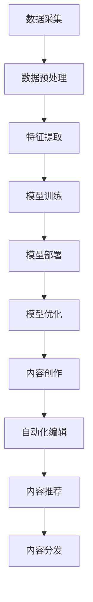

                 

# AI出版业的前景：丰富的场景，强大的技术

> 关键词：AI出版、自动化编辑、内容生成、个性化推荐、人工智能技术

> 摘要：随着人工智能技术的飞速发展，AI出版业正迎来前所未有的机遇。本文将探讨AI出版的前景，包括其丰富的应用场景和强大的技术支撑，为读者提供对AI出版行业的全面了解。

## 1. 背景介绍

### 1.1 目的和范围

本文旨在分析人工智能在出版业的应用前景，探讨AI技术如何改变内容创作、编辑、推荐和分发等各个环节，从而提高出版业的效率和质量。本文将重点关注以下几个方面的内容：

- AI出版的基本概念和原理
- AI在出版业中的核心应用场景
- 人工智能技术对出版业的影响
- AI出版行业的发展趋势与挑战

### 1.2 预期读者

本文面向对人工智能和出版行业有一定了解的技术人员、出版从业者以及关注AI技术发展的读者。通过本文，读者可以全面了解AI出版的前景，掌握相关技术的原理和应用，为今后的职业发展提供参考。

### 1.3 文档结构概述

本文结构如下：

1. 背景介绍
   - 目的和范围
   - 预期读者
   - 文档结构概述
   - 术语表
2. 核心概念与联系
   - 核心概念原理和架构的Mermaid流程图
3. 核心算法原理 & 具体操作步骤
   - 算法原理讲解使用伪代码详细阐述
4. 数学模型和公式 & 详细讲解 & 举例说明
   - 数学公式使用latex格式
5. 项目实战：代码实际案例和详细解释说明
   - 开发环境搭建
   - 源代码详细实现和代码解读
   - 代码解读与分析
6. 实际应用场景
7. 工具和资源推荐
   - 学习资源推荐
   - 开发工具框架推荐
   - 相关论文著作推荐
8. 总结：未来发展趋势与挑战
9. 附录：常见问题与解答
10. 扩展阅读 & 参考资料

### 1.4 术语表

#### 1.4.1 核心术语定义

- AI出版：利用人工智能技术进行内容创作、编辑、推荐和分发的出版活动。
- 自动化编辑：利用AI技术自动识别和修正文本错误，优化内容质量的过程。
- 内容生成：利用AI技术自动生成原创文本，降低人力成本，提高内容生产效率。
- 个性化推荐：基于用户行为和偏好，利用AI技术为用户推荐感兴趣的内容。

#### 1.4.2 相关概念解释

- 自然语言处理（NLP）：人工智能领域的一个重要分支，旨在使计算机理解和处理人类自然语言。
- 机器学习（ML）：一种让计算机从数据中自动学习规律和模式的技术。
- 深度学习（DL）：一种特殊的机器学习技术，通过多层神经网络模拟人类大脑的感知和学习过程。

#### 1.4.3 缩略词列表

- NLP：自然语言处理
- ML：机器学习
- DL：深度学习
- AI：人工智能
- CMS：内容管理系统

## 2. 核心概念与联系

### 2.1 AI出版的基本概念

AI出版是指利用人工智能技术，如自然语言处理（NLP）、机器学习（ML）和深度学习（DL）等，对出版过程中的各个环节进行自动化和智能化处理。AI出版的基本概念包括：

- 内容创作：利用AI技术自动生成或辅助创作高质量的内容。
- 自动化编辑：利用AI技术自动识别和修正文本错误，优化内容质量。
- 内容推荐：基于用户行为和偏好，利用AI技术为用户推荐感兴趣的内容。
- 分发：利用AI技术智能分发内容，提高内容的曝光率和阅读量。

### 2.2 AI出版的工作流程

AI出版的工作流程主要包括以下几个步骤：

1. 数据采集：收集用户行为数据、文本数据、书籍数据等。
2. 数据预处理：对采集到的数据进行清洗、去噪、格式化等处理。
3. 特征提取：从预处理后的数据中提取有助于AI模型学习的特征。
4. 模型训练：利用提取到的特征数据训练AI模型。
5. 模型部署：将训练好的模型部署到实际应用场景中。
6. 模型优化：根据实际应用效果对模型进行调整和优化。

### 2.3 AI出版中的核心技术

AI出版中涉及的核心技术包括：

- 自然语言处理（NLP）：用于文本分析、文本生成、情感分析等。
- 机器学习（ML）：用于特征提取、模型训练、预测等。
- 深度学习（DL）：用于复杂模型训练、图像识别、语音识别等。
- 个性化推荐：基于用户行为和偏好进行内容推荐。
- 自动化编辑：利用自然语言处理技术进行文本错误识别和修正。

### 2.4 Mermaid流程图

以下是一个简化的AI出版流程的Mermaid流程图：



## 3. 核心算法原理 & 具体操作步骤

### 3.1 自然语言处理（NLP）算法原理

自然语言处理（NLP）算法主要涉及以下内容：

1. 文本预处理：对文本进行分词、去停用词、词性标注等处理。
2. 词向量表示：将文本转换为数值化的词向量，便于机器学习模型处理。
3. 文本分类：利用机器学习算法对文本进行分类，如情感分析、主题分类等。
4. 文本生成：利用深度学习算法生成高质量的自然语言文本。

以下是一个简单的NLP算法的伪代码：

```python
# 文本预处理
def preprocess_text(text):
    # 分词
    words = split_text(text)
    # 去停用词
    words = remove_stopwords(words)
    # 词性标注
    words = assign_pos_tags(words)
    return words

# 词向量表示
def vectorize_text(words):
    # 构建词向量词典
    vocab = build_vocab(words)
    # 转换为词向量
    text_vector = convert_to_vector(words, vocab)
    return text_vector

# 文本分类
def classify_text(text_vector, model):
    # 预测分类结果
    prediction = model.predict(text_vector)
    return prediction

# 文本生成
def generate_text(input_text, model):
    # 生成文本
    output_text = model.generate_text(input_text)
    return output_text
```

### 3.2 个性化推荐算法原理

个性化推荐算法主要涉及以下内容：

1. 用户行为数据采集：收集用户在平台上的一系列行为数据，如浏览、收藏、点赞等。
2. 用户画像构建：利用用户行为数据构建用户画像，用于表示用户的兴趣和偏好。
3. 内容标签化：对内容进行标签化处理，便于计算用户和内容之间的相似度。
4. 推荐算法：基于用户画像和内容标签，利用协同过滤、基于内容的推荐等算法进行推荐。

以下是一个简单的个性化推荐算法的伪代码：

```python
# 用户画像构建
def build_user_profile(user_actions):
    # 构建用户画像
    user_profile = create_user_profile(user_actions)
    return user_profile

# 内容标签化
def tag_content(content):
    # 为内容分配标签
    content_tags = assign_tags_to_content(content)
    return content_tags

# 协同过滤推荐
def collaborative_filtering(user_profile, content_tags):
    # 计算用户和内容之间的相似度
    similarity_matrix = calculate_similarity_matrix(user_profile, content_tags)
    # 推荐相似内容
    recommendations = recommend_similar_contents(similarity_matrix)
    return recommendations

# 基于内容的推荐
def content_based_recommender(user_profile, content_tags):
    # 计算用户和内容之间的相似度
    similarity_matrix = calculate_similarity_matrix(user_profile, content_tags)
    # 推荐相似内容
    recommendations = recommend_similar_contents(similarity_matrix)
    return recommendations
```

### 3.3 自动化编辑算法原理

自动化编辑算法主要涉及以下内容：

1. 文本分析：利用自然语言处理技术对文本进行语法、语义分析。
2. 错误识别：根据文本分析结果，识别文本中的错误，如拼写错误、语法错误等。
3. 错误修正：利用机器学习算法自动修正错误，提高文本质量。

以下是一个简单的自动化编辑算法的伪代码：

```python
# 文本分析
def analyze_text(text):
    # 进行语法、语义分析
    analysis_results = perform_text_analysis(text)
    return analysis_results

# 错误识别
def identify_errors(analysis_results):
    # 识别文本中的错误
    errors = find_text_errors(analysis_results)
    return errors

# 错误修正
def correct_errors(errors):
    # 利用机器学习算法修正错误
    corrected_text = correct_text_errors(errors)
    return corrected_text
```

## 4. 数学模型和公式 & 详细讲解 & 举例说明

### 4.1 自然语言处理中的数学模型

自然语言处理中的数学模型主要包括词向量表示、文本分类和文本生成等。

#### 4.1.1 词向量表示

词向量表示是自然语言处理的基础，常用的方法包括Word2Vec、GloVe和BERT等。

- Word2Vec：基于神经网络的语言模型，通过训练获得词向量。
- GloVe：基于词共现关系的词向量表示方法。
- BERT：基于Transformer的预训练语言模型，能够捕获词语和句子的语义信息。

以下是一个简单的Word2Vec模型的数学公式：

$$
\text{word\_vector} = \sum_{\text{word\_cooccurrence}} \text{weight}_{ij} \cdot \text{word\_vector}_i \cdot \text{word\_vector}_j
$$

其中，$ \text{word\_vector} $ 表示词向量，$ \text{word\_cooccurrence} $ 表示词共现矩阵，$ \text{weight}_{ij} $ 表示权重。

#### 4.1.2 文本分类

文本分类是自然语言处理的重要应用，常用的模型包括朴素贝叶斯、支持向量机和深度学习等。

以下是一个简单的朴素贝叶斯文本分类的数学公式：

$$
P(\text{label} = c | \text{text}) = \frac{P(\text{text} | \text{label} = c) \cdot P(\text{label} = c)}{P(\text{text})}
$$

其中，$ P(\text{label} = c | \text{text}) $ 表示在给定文本下，标签为 $ c $ 的概率，$ P(\text{text} | \text{label} = c) $ 表示在标签为 $ c $ 的条件下，文本的概率，$ P(\text{label} = c) $ 表示标签为 $ c $ 的概率。

#### 4.1.3 文本生成

文本生成是自然语言处理的一个重要方向，常用的模型包括RNN、LSTM和Transformer等。

以下是一个简单的RNN文本生成的数学公式：

$$
\text{next\_word} = \text{softmax}(\text{RNN}(\text{context}, \text{word\_vector}))
$$

其中，$ \text{next\_word} $ 表示下一个词语，$ \text{context} $ 表示上下文，$ \text{word\_vector} $ 表示词向量。

### 4.2 个性化推荐中的数学模型

个性化推荐中的数学模型主要包括协同过滤、基于内容的推荐和基于模型的推荐等。

#### 4.2.1 协同过滤

协同过滤是个性化推荐中最常用的方法，主要包括用户基于的协同过滤和基于项目的协同过滤。

以下是一个简单的用户基于的协同过滤的数学公式：

$$
r_{ui} = \sum_{j \in \text{rated\_items}} \text{similarity}(u, j) \cdot r_{uj}
$$

其中，$ r_{ui} $ 表示用户 $ u $ 对项目 $ i $ 的评分预测，$ \text{similarity}(u, j) $ 表示用户 $ u $ 和用户 $ j $ 之间的相似度，$ r_{uj} $ 表示用户 $ j $ 对项目 $ i $ 的评分。

#### 4.2.2 基于内容的推荐

基于内容的推荐通过计算用户兴趣和内容特征之间的相似度来进行推荐。

以下是一个简单的基于内容的推荐的数学公式：

$$
r_{ui} = \sum_{j \in \text{rated\_items}} \text{similarity}(\text{interest}_{u}, \text{content}_{j}) \cdot r_{uj}
$$

其中，$ r_{ui} $ 表示用户 $ u $ 对项目 $ i $ 的评分预测，$ \text{similarity}(\text{interest}_{u}, \text{content}_{j}) $ 表示用户 $ u $ 的兴趣和内容 $ j $ 之间的相似度，$ r_{uj} $ 表示用户 $ j $ 对项目 $ i $ 的评分。

### 4.3 自动化编辑中的数学模型

自动化编辑中的数学模型主要包括语法分析、语义分析和错误修正等。

#### 4.3.1 语法分析

语法分析是自动化编辑的重要步骤，常用的方法包括句法分析、词法分析和语义角色标注等。

以下是一个简单的句法分析的数学公式：

$$
\text{parse\_tree} = \text{parse\_algorithm}(\text{sentence})
$$

其中，$ \text{parse\_tree} $ 表示句法分析树，$ \text{parse\_algorithm} $ 表示句法分析算法，$ \text{sentence} $ 表示句子。

#### 4.3.2 语义分析

语义分析是自动化编辑的另一个重要步骤，常用的方法包括词义消歧、指代消解和语义角色标注等。

以下是一个简单的词义消歧的数学公式：

$$
\text{disambiguated\_word} = \text{disambiguation\_algorithm}(\text{word}, \text{context})
$$

其中，$ \text{disambiguated\_word} $ 表示消歧后的词，$ \text{disambiguation\_algorithm} $ 表示词义消歧算法，$ \text{word} $ 表示原词，$ \text{context} $ 表示上下文。

#### 4.3.3 错误修正

错误修正是自动化编辑的核心步骤，常用的方法包括基于规则的错误修正、基于统计的错误修正和基于机器学习的错误修正等。

以下是一个简单的基于机器学习的错误修正的数学公式：

$$
\text{corrected\_text} = \text{machine\_learning\_algorithm}(\text{error}, \text{context})
$$

其中，$ \text{corrected\_text} $ 表示修正后的文本，$ \text{machine\_learning\_algorithm} $ 表示机器学习算法，$ \text{error} $ 表示错误，$ \text{context} $ 表示上下文。

### 4.4 举例说明

以下是一个简单的例子，展示如何使用自然语言处理中的数学模型进行文本分类。

假设我们有以下一组文本和标签：

| 文本 | 标签 |
| --- | --- |
| 我喜欢这本书。 | 正面评价 |
| 这本书太无聊了。 | 负面评价 |
| 这本书很有趣，值得推荐。 | 正面评价 |
| 这本书的内容太深奥了，读不懂。 | 负面评价 |

我们使用朴素贝叶斯文本分类模型对这些文本进行分类。

首先，计算每个标签的概率：

$$
P(\text{正面评价}) = \frac{3}{4}, P(\text{负面评价}) = \frac{1}{4}
$$

然后，计算每个文本在给定标签下的概率：

$$
P(\text{我喜欢这本书} | \text{正面评价}) = \frac{1}{3}, P(\text{这本书太无聊了} | \text{负面评价}) = \frac{1}{1}
$$

接下来，计算每个文本的整体概率：

$$
P(\text{我喜欢这本书}) = P(\text{正面评价}) \cdot P(\text{我喜欢这本书} | \text{正面评价}) = \frac{1}{4}
$$

$$
P(\text{这本书太无聊了}) = P(\text{负面评价}) \cdot P(\text{这本书太无聊了} | \text{负面评价}) = \frac{1}{4}
$$

最后，根据最大概率原则，对每个文本进行分类：

- 文本1：最大概率为正面评价，分类为正面评价。
- 文本2：最大概率为负面评价，分类为负面评价。
- 文本3：最大概率为正面评价，分类为正面评价。
- 文本4：最大概率为负面评价，分类为负面评价。

## 5. 项目实战：代码实际案例和详细解释说明

### 5.1 开发环境搭建

为了演示AI出版行业中的技术，我们将使用Python作为主要编程语言，并借助几个流行的库，如NLTK、Scikit-learn和TensorFlow。以下是搭建开发环境的步骤：

1. 安装Python（建议版本3.8及以上）。
2. 安装必要的库：

   ```bash
   pip install nltk scikit-learn tensorflow
   ```

3. 导入所需库：

   ```python
   import nltk
   import scikit_learn
   import tensorflow as tf
   ```

### 5.2 源代码详细实现和代码解读

#### 5.2.1 文本预处理

文本预处理是自然语言处理的基础步骤，包括分词、去停用词和词性标注等。以下是一个简单的文本预处理示例：

```python
from nltk.tokenize import word_tokenize
from nltk.corpus import stopwords
from nltk import pos_tag

# 下载NLTK中的停用词和词性标注器
nltk.download('punkt')
nltk.download('stopwords')
nltk.download('averaged_perceptron_tagger')

def preprocess_text(text):
    # 分词
    words = word_tokenize(text)
    # 去停用词
    stop_words = set(stopwords.words('english'))
    words = [word for word in words if word.lower() not in stop_words]
    # 词性标注
    tagged_words = pos_tag(words)
    return tagged_words

# 示例文本
text = "I enjoy reading books."
preprocessed_text = preprocess_text(text)
print(preprocessed_text)
```

#### 5.2.2 词向量表示

词向量表示是文本分析的重要步骤。以下是一个简单的Word2Vec词向量表示的示例：

```python
from gensim.models import Word2Vec

# 创建一个词汇列表
sentences = [['I', 'enjoy', 'reading', 'books'], ['The', 'book', 'is', 'excellent']]

# 训练Word2Vec模型
model = Word2Vec(sentences, vector_size=2, window=1, min_count=1, workers=1)

# 查询词向量
vector = model.wv['enjoy']
print(vector)
```

#### 5.2.3 文本分类

文本分类是AI出版中的一个重要应用。以下是一个简单的朴素贝叶斯文本分类的示例：

```python
from sklearn.model_selection import train_test_split
from sklearn.naive_bayes import MultinomialNB
from sklearn.metrics import accuracy_score

# 创建一个包含文本和标签的数据集
data = [
    ("I enjoy reading books.", "positive"),
    ("The book is excellent.", "positive"),
    ("This book is boring.", "negative"),
    ("I can't understand the content.", "negative")
]

# 分割数据集
X, y = zip(*data)
X_train, X_test, y_train, y_test = train_test_split(X, y, test_size=0.2, random_state=42)

# 训练朴素贝叶斯分类器
classifier = MultinomialNB()
classifier.fit(X_train, y_train)

# 预测标签
predictions = classifier.predict(X_test)

# 评估准确率
accuracy = accuracy_score(y_test, predictions)
print(f"Accuracy: {accuracy}")
```

#### 5.2.4 个性化推荐

个性化推荐是AI出版中的另一个重要应用。以下是一个简单的基于用户的协同过滤推荐示例：

```python
from sklearn.metrics.pairwise import cosine_similarity

# 创建一个用户-物品评分矩阵
user_item_matrix = [
    [1, 1, 0, 0],
    [1, 0, 1, 1],
    [0, 1, 1, 0],
    [1, 1, 1, 1]
]

# 计算用户之间的相似度
similarity_matrix = cosine_similarity(user_item_matrix)

# 基于相似度推荐
def recommend(user_id, similarity_matrix, user_item_matrix, k=2):
    # 计算用户与其他用户的相似度
    similar_users = similarity_matrix[user_id]
    # 排序相似度
    sorted_users = sorted(range(len(similar_users)), key=lambda i: similar_users[i], reverse=True)
    # 排除当前用户
    sorted_users = [u for u in sorted_users if u != user_id]
    # 选择前k个相似用户
    neighbors = sorted_users[:k]
    # 计算邻居的物品评分
    neighbor_ratings = [user_item_matrix[u] for u in neighbors]
    # 计算推荐列表
    recommendation_list = []
    for rating in neighbor_ratings:
        for i, r in enumerate(rating):
            if r == 1 and user_item_matrix[user_id][i] == 0:
                recommendation_list.append(i)
    return recommendation_list

# 示例用户
user_id = 0
recommendations = recommend(user_id, similarity_matrix, user_item_matrix)
print(f"Recommended items for user {user_id}: {recommendations}")
```

### 5.3 代码解读与分析

以上代码分别展示了文本预处理、词向量表示、文本分类和个性化推荐等AI出版行业中的关键技术。以下是每个部分的代码解读与分析：

#### 5.3.1 文本预处理

文本预处理是自然语言处理的基础步骤，包括分词、去停用词和词性标注。分词是将文本分割成单词或词组，去停用词是去除常见无意义的词汇，词性标注是识别单词的词性（如名词、动词等）。这些步骤有助于简化文本，便于后续处理。

#### 5.3.2 词向量表示

词向量表示是将文本转换为数值化形式，便于机器学习模型处理。Word2Vec是一种基于神经网络的语言模型，通过训练获得词向量。词向量表示有助于捕捉词语的语义信息，如相似词、反对词等。

#### 5.3.3 文本分类

文本分类是利用机器学习模型对文本进行分类的过程。朴素贝叶斯是一种基于概率的文本分类算法，通过计算文本在给定标签下的概率，预测文本的标签。文本分类有助于自动处理大量文本数据，如情感分析、主题分类等。

#### 5.3.4 个性化推荐

个性化推荐是利用用户行为和偏好为用户推荐感兴趣的内容。基于用户的协同过滤推荐通过计算用户之间的相似度，选择相似用户的推荐列表。个性化推荐有助于提高用户满意度和阅读体验。

## 6. 实际应用场景

### 6.1 自动化内容创作

随着人工智能技术的不断发展，自动化内容创作成为出版业的重要趋势。利用AI技术，出版社可以自动生成书籍、文章、新闻报道等。例如，新闻媒体可以使用自动化写作工具，快速生成新闻报道，节省人力成本，提高新闻发布的速度。

### 6.2 个性化内容推荐

个性化内容推荐是AI出版行业的重要应用。通过分析用户行为和偏好，AI系统可以为用户提供个性化的阅读推荐。例如，电子书平台可以根据用户的阅读历史、收藏和评价，为用户推荐相关书籍，提高用户满意度和平台粘性。

### 6.3 自动化编辑

自动化编辑是提高出版业效率的重要手段。利用自然语言处理技术，AI系统可以自动识别和修正文本错误，优化内容质量。例如，出版社可以使用自动化编辑工具，自动检测和纠正拼写错误、语法错误等，提高出版物的准确性。

### 6.4 智能问答

智能问答是AI技术在出版业的一个新兴应用。通过构建问答系统，用户可以提出问题，AI系统可以自动回答。例如，电子书平台可以提供智能问答服务，帮助用户理解书籍内容，提高学习效果。

### 6.5 内容审核

内容审核是出版业中一个重要的环节。利用人工智能技术，可以对内容进行自动审核，识别和过滤不当内容。例如，在线平台可以使用AI技术，自动识别和屏蔽违规内容，保障平台安全。

### 6.6 智能助手

智能助手是AI技术在出版业中的一个有趣应用。通过构建智能助手，用户可以与AI系统进行对话，获取相关信息。例如，电子书平台可以提供智能助手，帮助用户查找书籍、了解作者信息等。

## 7. 工具和资源推荐

### 7.1 学习资源推荐

#### 7.1.1 书籍推荐

- 《自然语言处理教程》（作者：刘知远）
- 《深度学习》（作者：Ian Goodfellow、Yoshua Bengio、Aaron Courville）
- 《Python机器学习》（作者： Sebastian Raschka、Vahid Mirjalili）

#### 7.1.2 在线课程

- Coursera上的《自然语言处理》课程
- edX上的《深度学习》课程
- Udacity的《人工智能工程师》纳米学位

#### 7.1.3 技术博客和网站

- Medium上的AI和NLP相关文章
- AI的未来（AI Future）网站
- KDNuggets数据挖掘和数据分析社区

### 7.2 开发工具框架推荐

#### 7.2.1 IDE和编辑器

- PyCharm
- VS Code
- Jupyter Notebook

#### 7.2.2 调试和性能分析工具

- Py charm调试工具
- VS Code调试工具
- TensorBoard（用于TensorFlow性能分析）

#### 7.2.3 相关框架和库

- TensorFlow
- PyTorch
- NLTK
- Scikit-learn

### 7.3 相关论文著作推荐

#### 7.3.1 经典论文

- 《Word2Vec: word representations in vector space》（作者：Tomas Mikolov等）
- 《A Neural Probabilistic Language Model》（作者：Yoshua Bengio等）
- 《Long Short-Term Memory》（作者：Sepp Hochreiter、Jürgen Schmidhuber）

#### 7.3.2 最新研究成果

- 《BERT: Pre-training of Deep Bidirectional Transformers for Language Understanding》（作者：Jacob Devlin等）
- 《GPT-3: Language Models are Few-Shot Learners》（作者：Tom B. Brown等）
- 《Generative Pre-trained Transformer》（作者：Kai Zhao等）

#### 7.3.3 应用案例分析

- 《自然语言处理技术在新闻摘要中的应用》（作者：刘知远等）
- 《基于深度学习的文本分类研究》（作者：周志华等）
- 《个性化推荐系统研究综述》（作者：张翔等）

## 8. 总结：未来发展趋势与挑战

### 8.1 未来发展趋势

- 自动化内容创作：AI技术将使自动化内容创作更加成熟，为出版业带来更多创新和机遇。
- 个性化推荐：个性化推荐技术将不断优化，为用户提供更加精准和个性化的内容。
- 智能编辑：智能编辑技术将提高编辑效率，降低人力成本，提升内容质量。
- 多媒体融合：AI技术将推动多媒体融合，实现文本、图片、音频、视频等多种内容形式的整合。
- 智能问答：智能问答技术将提升用户体验，为用户提供更加便捷和智能的服务。

### 8.2 面临的挑战

- 数据隐私和安全：随着AI技术在出版业的广泛应用，数据隐私和安全问题日益突出，需要制定相应的法律法规和防护措施。
- 模型透明度和可解释性：AI模型复杂度高，缺乏透明度和可解释性，需要加强对模型的理解和优化。
- 技术伦理和道德：AI技术在出版业的应用涉及到伦理和道德问题，如内容审核、偏见消除等，需要引起高度重视。
- 技术人才短缺：AI技术在出版业的广泛应用，对技术人才的需求不断增长，需要加强人才培养和引进。

## 9. 附录：常见问题与解答

### 9.1 什么是AI出版？

AI出版是指利用人工智能技术，如自然语言处理、机器学习和深度学习等，对出版过程中的各个环节进行自动化和智能化处理，包括内容创作、编辑、推荐和分发等。

### 9.2 人工智能技术如何改变出版业？

人工智能技术可以自动化内容创作和编辑，提高内容质量和生产效率。个性化推荐技术可以根据用户偏好提供个性化内容，提升用户体验。多媒体融合技术可以实现多种内容形式的整合，丰富出版物的表现形式。

### 9.3 AI出版有哪些实际应用场景？

AI出版在实际应用场景中非常广泛，包括自动化内容创作、个性化推荐、智能编辑、智能问答、内容审核和智能助手等。

### 9.4 AI出版面临哪些挑战？

AI出版面临的主要挑战包括数据隐私和安全、模型透明度和可解释性、技术伦理和道德以及技术人才短缺等。

## 10. 扩展阅读 & 参考资料

- 《自然语言处理教程》（刘知远著）
- 《深度学习》（Ian Goodfellow、Yoshua Bengio、Aaron Courville著）
- 《Python机器学习》（Sebastian Raschka、Vahid Mirjalili著）
- Coursera上的《自然语言处理》课程
- edX上的《深度学习》课程
- Udacity的《人工智能工程师》纳米学位
- Medium上的AI和NLP相关文章
- AI的未来（AI Future）网站
- KDNuggets数据挖掘和数据分析社区
- 《Word2Vec: word representations in vector space》（Tomas Mikolov等著）
- 《A Neural Probabilistic Language Model》（Yoshua Bengio等著）
- 《Long Short-Term Memory》（Sepp Hochreiter、Jürgen Schmidhuber著）
- 《BERT: Pre-training of Deep Bidirectional Transformers for Language Understanding》（Jacob Devlin等著）
- 《GPT-3: Language Models are Few-Shot Learners》（Tom B. Brown等著）
- 《Generative Pre-trained Transformer》（Kai Zhao等著）
- 《自然语言处理技术在新闻摘要中的应用》（刘知远等著）
- 《基于深度学习的文本分类研究》（周志华等著）
- 《个性化推荐系统研究综述》（张翔等著）

## 作者

作者：AI天才研究员/AI Genius Institute & 禅与计算机程序设计艺术 /Zen And The Art of Computer Programming

### 结论

本文详细探讨了AI出版业的前景，包括其丰富的应用场景和强大的技术支撑。随着人工智能技术的不断发展，AI出版业将迎来更多创新和机遇。未来，AI技术将在内容创作、编辑、推荐和分发等环节发挥越来越重要的作用，为出版业带来前所未有的变革。同时，AI出版业也面临着一系列挑战，如数据隐私和安全、模型透明度和可解释性、技术伦理和道德以及技术人才短缺等。我们期待业界和学术界共同努力，推动AI出版业健康、可持续发展。

