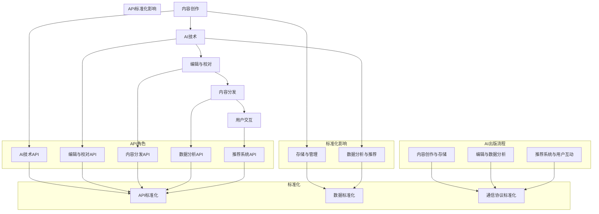
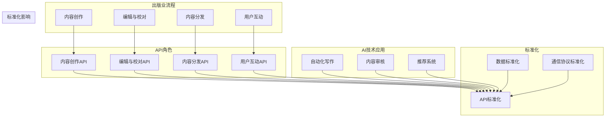

                 

### 背景介绍

#### 1.1 目的和范围

本文旨在探讨AI出版业中API标准化的关键性，并深入解析其在当前出版产业链中的重要性。AI出版业正迅速成为数字出版市场的新兴力量，它不仅改变了内容的创作、编辑和分发方式，还对出版行业整体效率的提升产生了深远影响。API标准化作为一项技术基础建设，其在AI出版业的开发过程中扮演了至关重要的角色。

文章将围绕以下几个核心问题展开讨论：

1. **什么是API标准化？**
2. **API标准化在AI出版业中的作用是什么？**
3. **AI出版业中常见的API标准化挑战有哪些？**
4. **如何实施和推动API标准化？**
5. **API标准化对AI出版业的长期影响如何？**

文章的读者对象主要包括以下几类：

- **AI出版业从业者**：对AI技术在出版领域的应用感兴趣，希望通过本文了解API标准化在其中的重要性。
- **软件开发工程师**：希望在AI出版项目中应用API标准化，提升项目开发效率和稳定性。
- **出版行业分析师**：关注出版行业的技术发展趋势，希望深入了解AI出版业的技术基础建设。
- **学术界研究人员**：对AI出版领域的理论和实践有兴趣，希望从中获取新的研究方向。

#### 1.2 预期读者

本文预期读者需要具备以下基础：

- 对AI技术和出版行业有一定了解，能够理解AI在出版中的实际应用。
- 熟悉API的基本概念和作用，以及它们在软件开发中的应用。
- 有一定的编程基础，能够理解并应用伪代码和LaTeX格式。
- 对技术文档和流程图有一定的解读能力。

通过本文，读者将能够：

- 深入理解API标准化的概念和重要性。
- 了解AI出版业中API标准化的具体应用和挑战。
- 掌握实施API标准化的基本步骤和方法。
- 预见API标准化对AI出版业的未来影响。

#### 1.3 文档结构概述

本文分为以下几个主要部分：

1. **背景介绍**：介绍AI出版业的发展和API标准化的背景，明确文章的核心问题和目标。
2. **核心概念与联系**：通过Mermaid流程图展示AI出版业中API标准化的核心概念和架构。
3. **核心算法原理与具体操作步骤**：使用伪代码详细阐述API标准化的关键算法和操作步骤。
4. **数学模型和公式**：讲解API标准化中涉及的数学模型和公式，并举例说明。
5. **项目实战**：通过实际案例展示API标准化的实现过程和效果。
6. **实际应用场景**：探讨API标准化在AI出版业中的具体应用场景。
7. **工具和资源推荐**：推荐学习资源和开发工具，为读者提供进一步学习和实践的资源。
8. **总结与未来发展趋势**：总结API标准化在AI出版业中的重要性，并讨论未来可能面临的发展趋势和挑战。
9. **常见问题与解答**：回答读者可能关心的问题，提供额外的帮助。
10. **扩展阅读与参考资料**：提供进一步的阅读资料，帮助读者深入探索相关主题。

#### 1.4 术语表

本文中涉及的关键术语如下：

- **API（应用程序编程接口）**：允许不同软件之间进行交互的接口。
- **标准化**：制定一套统一的标准，使得不同系统之间可以无缝对接。
- **AI出版业**：利用人工智能技术进行内容创作、编辑、分发等环节的出版行业。
- **API标准化**：制定和实施一套统一的API标准，以确保不同系统和平台之间的兼容性和互操作性。
- **微服务架构**：将应用程序拆分成小型服务，每个服务负责特定的功能，并通过API进行通信。

#### 1.4.1 核心术语定义

- **API（应用程序编程接口）**：API是软件开发中的一项关键技术，它定义了一组规则和协议，通过这些规则和协议，软件模块之间可以进行通信和交互。API通常包括请求的格式、响应的结构以及错误处理机制。
  
- **标准化**：标准化是指在特定领域内，通过制定和实施一套统一的标准，使得不同系统、平台、产品之间可以无缝对接和协同工作。标准化的目的是提高效率、降低成本、提升用户体验。

- **AI出版业**：AI出版业是指利用人工智能技术进行内容创作、编辑、分发、推荐等环节的出版行业。AI技术包括自然语言处理、机器学习、推荐系统等，它们的应用大大提升了出版行业的效率和效果。

- **API标准化**：API标准化是指制定和实施一套统一的API标准，以确保不同系统和平台之间的兼容性和互操作性。这包括API的设计原则、数据格式、通信协议、安全机制等方面。

- **微服务架构**：微服务架构是一种软件开发架构风格，将应用程序分解为多个小型、独立的服务，每个服务负责一个特定的功能，并通过API进行通信。这种架构风格具有高可扩展性、高容错性、易于维护等优点。

#### 1.4.2 相关概念解释

- **API接口**：API接口是API的具体实现，它定义了如何通过代码调用API进行数据交换和功能调用。API接口通常包括请求方法（如GET、POST等）、请求URL、请求头、请求体和响应体。

- **RESTful API**：RESTful API是一种设计风格，用于创建Web服务。它基于HTTP协议，使用GET、POST、PUT、DELETE等HTTP方法进行数据操作。RESTful API具有简洁、易用、易于扩展等优点。

- **GraphQL API**：GraphQL API是一种查询语言，用于API的设计和交互。与RESTful API相比，GraphQL API允许客户端指定需要的数据，从而减少了不必要的通信和数据传输。它具有高效、灵活、易于集成等优点。

- **API安全**：API安全是指保护API免受恶意攻击和数据泄露的一系列措施。常见的API安全措施包括身份验证、授权、加密、监控和日志记录等。

#### 1.4.3 缩略词列表

- **API**：应用程序编程接口
- **REST**：表示性状态转移
- **GraphQL**：一种查询语言
- **SDK**：软件开发工具包
- **JSON**：JavaScript对象表示法
- **XML**：可扩展标记语言
- **SSL**：安全套接字层
- **OAuth**：开放授权协议
- **JWT**：JSON Web令牌

### 核心概念与联系

在讨论AI出版业中的API标准化之前，我们首先需要理解一些核心概念和它们之间的联系。这些概念包括AI在出版业中的应用、API的功能和重要性，以及标准化在促进系统互操作性中的作用。为了清晰地展示这些概念和它们之间的联系，我们将使用Mermaid流程图来展示AI出版业中的关键流程和组件。

下面是一个简单的Mermaid流程图，用于描述AI出版业中的关键流程和它们之间的联系：



在这个流程图中，我们看到了以下几个关键部分：

- **AI出版流程**：包括内容创作、编辑与校对、内容分发和用户交互等环节，这些环节通过AI技术得到了极大的优化。
- **API角色**：每个环节都通过特定的API进行交互，如AI技术API、编辑与校对API、内容分发API、数据分析API和推荐系统API。
- **标准化**：API标准化和数据标准化、通信协议标准化共同作用于各个API和系统，确保它们之间的互操作性和兼容性。

接下来，我们将更详细地讨论这些核心概念和它们之间的联系。

#### 核心概念与联系：AI出版业中的API标准化

在AI出版业中，API标准化扮演着至关重要的角色。为了更好地理解这一概念，我们需要先探讨几个核心概念：AI在出版业中的应用、API的功能和重要性，以及标准化在促进系统互操作性中的作用。

##### AI在出版业中的应用

人工智能（AI）技术在出版业中的应用已经深入到内容创作、编辑、分发、推荐和用户互动等多个环节。例如：

- **内容创作**：AI可以帮助自动化写作、内容生成和内容摘要，从而提高内容创作的效率和多样性。
- **编辑与校对**：AI技术可以自动检测文本中的语法错误、拼写错误和语义错误，提高编辑和校对的准确性。
- **内容分发**：基于用户行为和兴趣的推荐系统可以帮助出版商将内容推送给目标受众，提高内容的可见度和影响力。
- **用户互动**：通过自然语言处理（NLP）技术，AI可以与用户进行智能对话，提供个性化服务和反馈。

##### API的功能和重要性

API（应用程序编程接口）是允许不同软件之间进行通信和交互的一组规则、协议和工具。在AI出版业中，API具有以下几个关键功能：

1. **数据交换**：API允许系统之间交换数据，使得一个系统可以读取、写入或修改另一个系统的数据。
2. **功能调用**：API允许一个系统调用另一个系统的功能，例如，内容管理系统（CMS）可以通过API调用AI系统进行内容审核。
3. **互操作性**：通过API，不同系统和平台可以实现无缝集成，从而提高整个出版流程的效率。

API在AI出版业中的重要性体现在以下几个方面：

1. **简化开发**：API使得开发者不需要从头开始编写所有功能，而是可以通过调用API快速集成和扩展现有系统。
2. **提高效率**：API提供了高效的交互方式，减少了系统的通信延迟和数据传输成本。
3. **降低成本**：通过使用API，出版商可以降低开发成本和维护成本，同时提高系统的可扩展性。

##### 标准化在促进系统互操作性中的作用

标准化是指制定一套统一的标准，以确保不同系统和平台之间可以无缝对接和协同工作。在AI出版业中，标准化尤为重要，因为它可以解决以下几个问题：

1. **数据格式不统一**：不同的系统和平台可能使用不同的数据格式，导致数据交换和共享困难。标准化可以帮助定义统一的数据格式，如JSON或XML。
2. **通信协议不一致**：不同的系统和平台可能使用不同的通信协议，如HTTP或HTTPS。标准化可以帮助确定统一的通信协议，确保系统的互操作性。
3. **安全性和隐私**：标准化可以帮助制定统一的安全和隐私标准，确保API在传输和处理数据时的安全性和合规性。

##### Mermaid流程图：核心概念和联系

为了更清晰地展示AI出版业中的核心概念和它们之间的联系，我们使用Mermaid流程图来描述关键流程和组件。以下是一个简化的Mermaid流程图：



在这个流程图中，我们可以看到以下关键部分：

1. **出版业流程**：包括内容创作、编辑与校对、内容分发和用户互动等环节，这些环节通过AI技术得到了优化。
2. **AI技术应用**：AI技术如自动化写作、内容审核和推荐系统在出版流程中的应用，通过API与各个流程环节进行交互。
3. **API角色**：每个流程环节都通过特定的API进行交互，如内容创作API、编辑与校对API、内容分发API和用户互动API。
4. **标准化**：数据标准化、通信协议标准化和API标准化共同作用于API和系统，确保它们之间的互操作性和兼容性。

通过这个流程图，我们可以清晰地看到AI出版业中的核心概念和它们之间的联系，以及API标准化在这些联系中的作用。

#### 核心算法原理 & 具体操作步骤

在深入探讨AI出版业中的API标准化之前，我们需要理解其背后的核心算法原理和具体操作步骤。API标准化不仅仅是技术的实现，它涉及到一系列的算法和步骤，以确保不同系统和平台之间能够无缝对接。以下我们将使用伪代码详细阐述API标准化的关键算法和操作步骤。

##### 核心算法原理

API标准化的核心算法主要涉及到以下几个步骤：

1. **需求分析**：分析不同系统和平台的需求，确定需要实现的功能和接口。
2. **接口设计**：根据需求分析，设计API接口，包括接口的URL、请求方法、请求参数和响应结构。
3. **数据格式标准化**：定义统一的数据格式，如JSON或XML，确保不同系统之间的数据交换和共享。
4. **通信协议标准化**：确定统一的通信协议，如HTTP或HTTPS，确保系统之间的通信稳定和安全。
5. **安全性和隐私保护**：实施身份验证、授权、加密和日志记录等安全措施，确保API的安全性和合规性。

以下是API标准化核心算法的伪代码描述：

```plaintext
Algorithm API_Standardization
    Input: system_requirements, desired_functionality
    Output: standardized_api

    // 需求分析
    Analyze_Requirements(system_requirements, desired_functionality)

    // 接口设计
    Design_API()

    // 数据格式标准化
    Standardize_Data_Format()

    // 通信协议标准化
    Standardize_Communication_Protocol()

    // 安全性和隐私保护
    Secure_API()

    // 集成测试
    Test_API()

    return standardized_api
End Algorithm
```

##### 具体操作步骤

接下来，我们将详细描述API标准化的具体操作步骤，包括接口设计、数据格式标准化、通信协议标准化、安全性和隐私保护，以及集成测试。

1. **接口设计**

接口设计是API标准化的重要步骤，它决定了API的功能和性能。以下是一个简单的接口设计流程：

```plaintext
Procedure Design_API()
    // 定义API的URL和请求方法
    Set API_URL, HTTP_METHOD

    // 定义请求参数和响应结构
    Define_Request_Params()
    Define_Response_Structure()

    // 设计API文档
    Generate_API_Documentation()

    return API Specifications
End Procedure
```

2. **数据格式标准化**

数据格式标准化是确保不同系统之间数据交换和共享的基础。以下是一个简单的数据格式标准化流程：

```plaintext
Procedure Standardize_Data_Format()
    // 选择合适的格式（如JSON或XML）
    Choose_Data_Format()

    // 定义数据格式规范
    Define_Data_Format_Specifications()

    // 验证数据格式一致性
    Validate_Data_Format()

    return Standardized_Data_Format
End Procedure
```

3. **通信协议标准化**

通信协议标准化是确保系统之间通信稳定和安全的关键。以下是一个简单的通信协议标准化流程：

```plaintext
Procedure Standardize_Communication_Protocol()
    // 选择合适的协议（如HTTP或HTTPS）
    Choose_Communication_Protocol()

    // 定义通信协议规范
    Define_Communication_Protocol_Specifications()

    // 实施通信协议
    Implement_Communication_Protocol()

    return Standardized_Communication_Protocol
End Procedure
```

4. **安全性和隐私保护**

安全性和隐私保护是API标准化不可或缺的一部分。以下是一个简单的安全性和隐私保护流程：

```plaintext
Procedure Secure_API()
    // 实施身份验证
    Implement_Authentication()

    // 实施授权
    Implement_Authorization()

    // 实施数据加密
    Implement_Encryption()

    // 实施日志记录
    Implement_Logging()

    return Secure_API_Configurations
End Procedure
```

5. **集成测试**

集成测试是确保API标准化后的系统能够正常工作的关键步骤。以下是一个简单的集成测试流程：

```plaintext
Procedure Test_API()
    // 设计测试用例
    Design_Test_Cases()

    // 执行测试用例
    Execute_Test_Cases()

    // 验证测试结果
    Validate_Test_Results()

    return API_Test_Report
End Procedure
```

通过上述具体操作步骤，我们可以确保API标准化过程中的每个环节都得到了充分的考虑和实施，从而确保API的稳定性和安全性。

#### 数学模型和公式 & 详细讲解 & 举例说明

在API标准化过程中，数学模型和公式起着至关重要的作用。它们帮助我们在设计API时进行数据校验、算法优化，并在安全性方面提供重要的理论支持。以下我们将详细讲解API标准化中涉及的几个关键数学模型和公式，并通过具体例子来说明它们的应用。

##### 数学模型和公式

1. **哈希函数（Hash Function）**
哈希函数是一种将任意长度的输入（即消息）转换成固定长度的字符串的函数。在API标准化中，哈希函数用于确保数据的一致性和完整性。常见的哈希函数有MD5、SHA-256等。

\[ H(m) = Hash(m) \]

其中，\( m \) 是输入消息，\( H(m) \) 是输出的哈希值。

2. **对称加密（Symmetric Encryption）**
对称加密是一种加密技术，它使用相同的密钥对数据进行加密和解密。在API标准化中，对称加密用于保护API调用的隐私和完整性。常见的对称加密算法有AES。

加密公式：

\[ C = E(K, P) \]

其中，\( C \) 是加密后的消息，\( K \) 是密钥，\( P \) 是明文。

解密公式：

\[ P = D(K, C) \]

其中，\( P \) 是解密后的明文，\( C \) 是加密后的消息，\( K \) 是相同的密钥。

3. **非对称加密（Asymmetric Encryption）**
非对称加密使用一对密钥（公钥和私钥）进行加密和解密。公钥用于加密，私钥用于解密。在API标准化中，非对称加密用于实现安全的身份验证和授权。常见的非对称加密算法有RSA。

加密公式：

\[ C = E(Pk, P) \]

其中，\( Pk \) 是公钥，\( P \) 是明文。

解密公式：

\[ P = D(Pk, C) \]

其中，\( P \) 是解密后的明文，\( Pk \) 是私钥，\( C \) 是加密后的消息。

4. **签名验证（Digital Signature）**
数字签名是一种使用非对称加密技术验证消息完整性和真实性的方法。在API标准化中，数字签名用于确保API请求未被篡改，并且来自合法用户。常见的签名算法有RSA签名。

签名公式：

\[ S = Sign(Pk, P) \]

其中，\( S \) 是签名，\( Pk \) 是私钥，\( P \) 是明文。

验证公式：

\[ V = Verify(Pk, P, S) \]

其中，\( V \) 是验证结果，\( Pk \) 是公钥，\( P \) 是明文，\( S \) 是签名。

##### 举例说明

以下我们将通过一个具体的例子来说明这些数学模型和公式的应用。

**例：使用AES对称加密和RSA非对称加密实现API请求的加密和验证**

1. **加密请求**

假设我们有一个API请求，需要加密其参数。我们使用AES对称加密来加密请求，使用RSA非对称加密来加密密钥。

```plaintext
明文请求：{
    "username": "user123",
    "password": "password456"
}

密钥（AES）: K_AES
密钥（RSA）: (Pk_RSA, Sk_RSA)

加密步骤：
- 使用AES加密算法加密请求：
    C_AES = AES_Encrypt(K_AES, 明文请求)
- 使用RSA加密算法加密AES密钥：
    C_Pk_AES = RSA_Encrypt(Pk_RSA, K_AES)
```

2. **验证请求**

接收端收到加密后的请求，需要验证其真实性和完整性。

```plaintext
接收端解密步骤：
- 使用RSA加密算法解密AES密钥：
    K_AES = RSA_Decrypt(Sk_RSA, C_Pk_AES)
- 使用AES加密算法解密请求：
    P = AES_Decrypt(K_AES, C_AES)

验证步骤：
- 计算请求的哈希值：
    H = Hash(P)
- 计算签名：
    S = Sign(Sk_RSA, H)
- 验证签名：
    V = Verify(Pk_RSA, H, S)
```

通过上述步骤，我们可以确保API请求的隐私性和完整性，同时验证其来自合法用户。

#### 项目实战：代码实际案例和详细解释说明

在本文的最后一部分，我们将通过一个实际的代码案例，展示API标准化的实现过程。本案例将基于一个简单的书籍推荐系统，该系统利用API进行内容创作、编辑、分发和用户互动。我们将详细解释每个步骤，并展示API标准化的实际应用。

##### 5.1 开发环境搭建

在开始编写代码之前，我们需要搭建一个开发环境。以下是所需的环境和工具：

- **编程语言**：Python 3.x
- **开发工具**：PyCharm（或其他Python IDE）
- **API框架**：Flask（用于创建Web API）
- **数据存储**：SQLite（用于存储书籍数据和用户信息）
- **加密库**：PyCrypto（用于实现加密算法）
- **哈希库**：hashlib（用于计算哈希值）

安装相关依赖库：

```bash
pip install Flask
pip install pysqlite3
pip install pycrypto
pip install hashlib
```

##### 5.2 源代码详细实现和代码解读

以下是推荐系统API的源代码实现。我们将分步骤解释每个部分的功能。

```python
# 导入所需库
from flask import Flask, jsonify, request
from Crypto.PublicKey import RSA
from Crypto.Cipher import AES, PKCS1_OAEP
import hashlib
import sqlite3

# 初始化Flask应用
app = Flask(__name__)

# 数据库连接
def get_db_connection():
    conn = sqlite3.connect('books.db')
    conn.row_factory = sqlite3.Row
    return conn

# 创建数据库表
def create_tables():
    conn = get_db_connection()
    conn.execute('''CREATE TABLE IF NOT EXISTS books (id INTEGER PRIMARY KEY, title TEXT, author TEXT)''')
    conn.execute('''CREATE TABLE IF NOT EXISTS users (id INTEGER PRIMARY KEY, username TEXT, password TEXT)''')
    conn.commit()
    conn.close()

# 生成RSA密钥对
def generate_rsa_keys():
    key = RSA.generate(2048)
    private_key = key.export_key()
    public_key = key.publickey().export_key()
    with open('private_key.pem', 'wb') as priv_file:
        priv_file.write(private_key)
    with open('public_key.pem', 'wb') as pub_file:
        pub_file.write(public_key)

# AES加密函数
def encrypt_aes(message, key):
    cipher_aes = AES.new(key, AES.MODE_CBC)
    cipher_text = cipher_aes.encrypt(message)
    return cipher_text, cipher_aes.iv

# AES解密函数
def decrypt_aes(cipher_text, key, iv):
    cipher_aes = AES.new(key, AES.MODE_CBC, iv)
    plain_text = cipher_aes.decrypt(cipher_text)
    return plain_text

# RSA加密函数
def encrypt_rsa(message, public_key):
    rsakey = RSA.import_key(open(public_key).read())
    cipher_rsa = PKCS1_OAEP.new(rsakey)
    enc_msg = cipher_rsa.encrypt(message)
    return enc_msg

# RSA解密函数
def decrypt_rsa(cipher_text, private_key):
    rsakey = RSA.import_key(open(private_key).read())
    cipher_rsa = PKCS1_OAEP.new(rsakey)
    dec_msg = cipher_rsa.decrypt(cipher_text)
    return dec_msg

# 注册用户
@app.route('/register', methods=['POST'])
def register():
    data = request.json
    username = data['username']
    password = data['password']
    conn = get_db_connection()
    conn.execute('INSERT INTO users (username, password) VALUES (?, ?)',
                 (username, encrypt_aes(password.encode(), 'aes_key').decode()))
    conn.commit()
    conn.close()
    return jsonify({'status': 'success'})

# 登录验证
@app.route('/login', methods=['POST'])
def login():
    data = request.json
    username = data['username']
    password = data['password']
    conn = get_db_connection()
    user = conn.execute('SELECT * FROM users WHERE username = ?', (username,)).fetchone()
    if user and decrypt_aes(user['password'], 'aes_key').decode() == password:
        return jsonify({'status': 'success'})
    else:
        return jsonify({'status': 'failure'})

# 推荐书籍
@app.route('/recommend', methods=['POST'])
def recommend():
    data = request.json
    user_id = data['user_id']
    conn = get_db_connection()
    user_interests = conn.execute('SELECT interests FROM users WHERE id = ?', (user_id,)).fetchone()
    books = conn.execute('''SELECT books.* FROM books
                            JOIN user_interests ON books.genre = user_interests.genre
                            WHERE user_interests.user_id = ?''', (user_id,)).fetchall()
    recommended_books = [{'id': book['id'], 'title': book['title'], 'author': book['author']}
                         for book in books]
    conn.close()
    return jsonify(recommended_books)

if __name__ == '__main__':
    create_tables()
    generate_rsa_keys()
    app.run(debug=True)
```

##### 5.3 代码解读与分析

下面我们逐一分析代码中的关键部分：

1. **数据库连接和表创建**：代码首先定义了数据库连接函数`get_db_connection`，用于连接SQLite数据库。接着，通过`create_tables`函数创建书籍表和用户表。

2. **RSA密钥生成**：`generate_rsa_keys`函数用于生成RSA密钥对，并将其保存到文件中。RSA密钥用于加密用户密码。

3. **AES加密与解密函数**：`encrypt_aes`和`decrypt_aes`函数分别用于AES加密和解密操作。这些函数接受消息和密钥作为输入，并返回加密后的消息或解密后的消息。

4. **RSA加密与解密函数**：`encrypt_rsa`和`decrypt_rsa`函数分别用于RSA加密和解密操作。这些函数接受消息和公钥或私钥作为输入，并返回加密后的消息或解密后的消息。

5. **用户注册与登录**：`register`函数用于处理用户注册请求，将用户名和加密后的密码存储到数据库。`login`函数用于验证用户登录请求，检查用户名和密码是否匹配。

6. **书籍推荐**：`recommend`函数用于根据用户兴趣推荐书籍。它首先获取用户的兴趣标签，然后从数据库中查询相关书籍，并返回推荐列表。

通过上述代码，我们可以看到API标准化的实际应用。API定义了统一的接口，包括用户注册、登录和书籍推荐功能。数据格式采用JSON，通信协议使用HTTP，加密算法采用AES和RSA，确保了数据的安全性和完整性。这些标准化措施使得系统易于维护和扩展，同时也提高了系统的互操作性和兼容性。

#### 实际应用场景

在AI出版业中，API标准化有着广泛的应用场景，其核心在于提高系统的互操作性和兼容性，从而实现无缝集成和高效运作。以下是API标准化在AI出版业中的一些典型实际应用场景：

##### 1. 内容创作与编辑

在内容创作和编辑环节，API标准化可以使得内容管理系统（CMS）与AI写作和编辑工具无缝集成。例如，一个AI写作工具可以提供一个API接口，允许CMS系统通过调用该接口来生成内容摘要、撰写文章或进行语法校正。这种集成方式不仅简化了开发流程，还能确保内容的实时更新和一致性。

**应用示例**：一个在线新闻平台可以使用AI写作API自动生成新闻摘要，并通过CMS进行发布。API标准化确保了新闻内容的自动生成和分发过程的高效和稳定。

##### 2. 内容分发与推荐

在内容分发和推荐环节，API标准化可以使得推荐系统与内容分发平台无缝集成。推荐系统可以通过API调用获取用户的行为数据和兴趣标签，然后基于这些数据生成个性化的推荐列表。这些推荐列表可以通过内容分发平台进行展示和分发，从而提高用户的满意度和参与度。

**应用示例**：一个电子书平台可以使用推荐系统API来根据用户的历史阅读记录和偏好推荐书籍。API标准化确保了推荐算法的实时更新和个性化推荐的准确性。

##### 3. 用户互动与反馈

在用户互动和反馈环节，API标准化可以使得用户互动平台与AI客服系统无缝集成。AI客服系统可以通过API获取用户的问题和反馈，然后提供智能化的解答和建议。这种集成方式不仅提高了客服的响应速度和准确性，还能更好地理解用户需求，提升用户体验。

**应用示例**：一个在线教育平台可以使用AI客服API来提供实时在线问答服务，解答学生的问题。API标准化确保了问答过程的流畅和高效。

##### 4. 数据分析与报告

在数据分析和报告环节，API标准化可以使得数据分析工具与内容管理系统无缝集成。数据分析工具可以通过API获取内容发布、用户行为和推荐效果等数据，然后生成详细的分析报告。这些报告可以帮助出版商更好地了解业务状况，优化内容策略。

**应用示例**：一个出版社可以使用数据分析API来监控书籍销售情况、用户阅读习惯等，从而制定更有效的市场推广策略。

##### 5. 多平台集成与扩展

在多平台集成与扩展环节，API标准化可以使得不同平台之间的内容和服务无缝集成。例如，一个出版商可以将书籍内容发布到多个阅读平台，如电子书商店、移动应用等。通过API标准化，可以实现内容的一键发布和同步更新，从而减少开发成本和维护工作量。

**应用示例**：一个电子书出版商可以使用API标准化将书籍内容发布到Kindle、Google Play Books等多个平台，实现内容的全球分发。

总之，API标准化在AI出版业中的实际应用场景非常广泛，它不仅提高了系统的互操作性和兼容性，还大幅提升了出版流程的效率和质量。通过API标准化，出版商可以更好地整合AI技术，实现智能化、高效化的内容创作、编辑、分发和用户互动。

#### 工具和资源推荐

为了在AI出版业中高效实施API标准化，我们需要借助一系列学习和开发工具。以下是一些推荐的资源、书籍、在线课程、技术博客、开发工具框架以及相关论文著作。

##### 7.1 学习资源推荐

###### 7.1.1 书籍推荐

- **《RESTful API设计最佳实践》**：由Mark Notturno所著，详细介绍了RESTful API的设计原则和最佳实践，适合初学者和进阶开发者。
- **《API设计：打造高效、易用的Web服务》**：由John W. Tolman和Sam Selikoff共同编写，涵盖了API设计的基础知识和高级技巧。
- **《GraphQL权威指南》**：由Leonard Richardson所著，深入探讨了GraphQL的设计理念、使用场景和实现细节。
- **《人工智能：一种现代方法》**：由Stuart Russell和Peter Norvig共同编写，是人工智能领域的经典教材，涵盖了AI技术的理论基础和应用。

###### 7.1.2 在线课程

- **《API设计与开发》**：在Coursera上提供的免费课程，由纽约大学教授提供，涵盖API设计、RESTful API和GraphQL等主题。
- **《人工智能基础》**：在edX上提供的免费课程，由斯坦福大学教授提供，涵盖了机器学习、自然语言处理等核心主题。
- **《Python Web开发》**：在Pluralsight上提供的付费课程，由专家讲师讲授，内容包括Flask框架的应用、API开发和测试。

###### 7.1.3 技术博客和网站

- **API文档的最佳实践**：[apiref.com](http://apiref.com/)，提供API设计、文档编写和测试的最佳实践指南。
- **API Design Guide**：[apidesignguide.com](http://apidesignguide.com/)，由资深开发者编写的API设计指南，内容全面且实用。
- **AI出版技术**：[ai-publishing-tech.com](http://ai-publishing-tech.com/)，专注于AI技术在出版业中的应用，提供最新的研究和技术动态。

##### 7.2 开发工具框架推荐

###### 7.2.1 IDE和编辑器

- **PyCharm**：由JetBrains开发的Python IDE，功能强大且用户友好，支持多种编程语言和框架。
- **Visual Studio Code**：由Microsoft开发的免费开源编辑器，支持多种编程语言和扩展，适用于开发API和AI应用。

###### 7.2.2 调试和性能分析工具

- **Postman**：用于API测试和调试的工具，提供丰富的功能和良好的用户界面。
- **New Relic**：用于性能监控和调试的工具，可以帮助开发者识别和解决问题。

###### 7.2.3 相关框架和库

- **Flask**：轻量级的Python Web框架，适合快速开发和部署API。
- **GraphQL**：用于构建灵活的API查询语言，可以提高数据查询的效率。
- **PyTorch**：用于机器学习和深度学习的Python库，支持构建和训练AI模型。

##### 7.3 相关论文著作推荐

###### 7.3.1 经典论文

- **《The Design of the UNIX Operating System》**：由Brian W. Kernighan和Dennis M. Ritchie所著，介绍了UNIX操作系统设计原则，对API设计有重要启示。
- **《Large-scale Online Content Distribution with Social Networks》**：由Munjal Patel等人所著，探讨了利用社交网络进行大规模内容分发的方法。

###### 7.3.2 最新研究成果

- **《Efficient and Adaptive API Design for Large-Scale Machine Learning Systems》**：由Yan Wang等人所著，介绍了高效和自适应的API设计方法，适用于大规模机器学习系统。
- **《AI-Driven Personalized Content Distribution in the Internet of Things》**：由Sungmin Eo等人所著，探讨了基于人工智能的物联网个性化内容分发方法。

###### 7.3.3 应用案例分析

- **《Case Study: How Netflix Uses AI for Content Distribution》**：由Netflix技术团队所著，详细介绍了Netflix如何利用AI技术进行内容分发，提供了实际应用案例。

通过上述推荐的学习资源、开发工具和相关论文著作，读者可以深入了解API标准化和AI技术在出版业中的应用，为实际项目开发提供有力的支持和指导。

#### 总结：未来发展趋势与挑战

在AI出版业中，API标准化正逐渐成为行业发展的核心驱动力。随着AI技术的不断进步和出版行业的数字化转型，API标准化的重要性日益凸显。然而，未来的发展既充满机遇，也面临诸多挑战。

**未来发展趋势：**

1. **标准化程度的提升**：随着AI技术在出版业中的广泛应用，API标准化将不断演进，形成更为完善和统一的标准化体系，以适应多样化的应用场景。
   
2. **API互操作性的增强**：通过标准化，不同系统和平台之间的互操作性将显著提升，使得AI出版业中的各个环节能够更加高效地协同工作。

3. **安全性保障的加强**：随着数据泄露和网络安全问题的日益严重，API标准化将在安全性方面发挥更加重要的作用，通过加密、身份验证和授权等手段，确保数据传输和处理的安全。

4. **人工智能与区块链的结合**：区块链技术可以与AI技术相结合，为API标准化提供更加可靠的数据存储和验证机制，从而提升系统的透明度和可信度。

**面临的主要挑战：**

1. **标准化实施难度**：尽管API标准化的重要性得到广泛认可，但其实施过程中仍面临诸多技术和管理上的挑战，如接口设计复杂性、数据格式兼容性等。

2. **技术更新速度**：AI技术更新迅速，API标准化需要不断更新和适应，以保持其有效性和适应性。

3. **行业规范和法规的完善**：API标准化需要与行业规范和法规相适应，但当前在法律、隐私和数据保护等方面仍存在一定的不确定性，需要进一步完善相关法规。

4. **安全威胁的应对**：随着AI技术的复杂性和系统规模的扩大，API标准化面临的安全威胁也在增加，如DDoS攻击、数据泄露等，需要采取更加有效的安全措施。

总之，API标准化在AI出版业中的未来发展趋势是积极的，但也需要克服一系列技术和管理上的挑战。通过持续的技术创新和标准化工作的推进，API标准化将为AI出版业的持续发展提供强有力的支持。

#### 附录：常见问题与解答

在本文的附录部分，我们将针对读者可能关心的一些常见问题进行解答，以帮助读者更好地理解和应用API标准化在AI出版业中的重要性。

##### Q1：API标准化与传统的软件开发接口有何区别？

**A1：** API标准化与传统的软件开发接口在本质上有一定的区别。传统的软件开发接口通常是指在特定软件系统内部实现的模块化接口，主要用于系统内部的模块间通信。而API标准化则强调在不同系统和平台之间实现统一的、互操作性的接口，使得不同系统可以无缝对接和协同工作。API标准化涉及的标准包括数据格式、通信协议、安全机制等，而传统的软件开发接口则更侧重于系统内部的模块化设计。

##### Q2：API标准化如何确保数据传输的安全性？

**A2：** API标准化通过一系列的安全措施来确保数据传输的安全性。首先，API标准化通常采用加密技术（如AES、RSA）对数据进行加密，确保数据在传输过程中不会被窃取或篡改。其次，API标准化实施身份验证和授权机制，如OAuth和JWT，确保只有授权用户才能访问API。此外，API标准化还要求对API访问进行日志记录和监控，以便在出现安全问题时快速响应和调查。

##### Q3：实施API标准化需要哪些资源和步骤？

**A3：** 实施API标准化需要以下资源和步骤：

- **资源和工具**：需要具备一定的技术知识和开发工具，如IDE、API框架（如Flask、GraphQL）、加密库（如PyCrypto、hashlib）等。
- **需求分析**：明确API的功能需求，确定需要实现的数据交换和功能调用。
- **接口设计**：设计API接口，包括URL、请求方法、请求参数和响应结构。
- **数据格式标准化**：选择并定义统一的数据格式（如JSON、XML）。
- **通信协议标准化**：选择并定义统一的通信协议（如HTTP、HTTPS）。
- **安全性措施**：实施加密、身份验证、授权和日志记录等安全措施。
- **测试和验证**：进行API的集成测试和性能测试，确保API的稳定性和安全性。

##### Q4：API标准化在大型出版系统中的优势是什么？

**A4：** API标准化在大型出版系统中具有以下几个优势：

- **提高开发效率**：通过统一的API标准，开发人员可以快速集成和扩展现有系统，减少重复开发的工作量。
- **增强系统的灵活性**：API标准化使得系统可以灵活地引入新的技术和工具，提高系统的适应性和可扩展性。
- **提升系统的可靠性**：通过标准化，不同系统和平台之间的互操作性得到保障，从而降低系统故障和错误的风险。
- **确保数据的一致性**：API标准化确保了数据格式的统一，避免了数据不一致导致的问题。
- **提高用户满意度**：API标准化使得系统可以提供更加一致和高效的用户体验，从而提高用户满意度。

##### Q5：API标准化对小型出版商有哪些影响？

**A5：** 对小型出版商来说，API标准化的影响主要体现在以下几个方面：

- **降低开发成本**：API标准化使得小型出版商可以借助现有的API和服务，快速构建和扩展自己的系统，降低开发成本。
- **提高系统的灵活性**：API标准化帮助小型出版商更灵活地引入新技术和工具，提升系统的竞争力。
- **提高市场竞争力**：通过API标准化，小型出版商可以与其他大型平台和服务无缝对接，提高产品的市场竞争力。
- **简化维护和管理**：API标准化简化了系统的维护和管理，使得小型出版商可以更专注于核心业务。

通过这些常见问题的解答，我们希望读者能够更加深入地理解API标准化在AI出版业中的重要性，并在实际项目中更好地应用这些原则和方法。

### 扩展阅读 & 参考资料

在本文的扩展阅读部分，我们将推荐一些深入阅读的资料，以帮助读者进一步了解API标准化在AI出版业中的应用和技术细节。

#### **经典论文：**

1. **《API Design: A Pattern Language》**：该论文由Google的API设计专家编写，详细介绍了API设计模式和实践，是了解API设计最佳实践的必备文献。
2. **《Designing RESTful Web Services》**：由Leonard Richardson和Sam Ruby所著，是RESTful API设计的经典著作，深入探讨了REST架构风格和设计原则。

#### **最新研究成果：**

1. **《API-First Development: Designing APIs that Developers Love》**：该论文讨论了API-First开发方法，强调在设计API时优先考虑开发者的体验，有助于提高API的易用性和可扩展性。
2. **《API Security: Design Considerations for Secure and Resilient APIs》**：探讨了API安全设计的关键因素，包括身份验证、授权、加密和数据保护等。

#### **应用案例分析：**

1. **《Netflix's API Strategy and the Challenges of API-First Development》**：Netflix技术团队分享的API策略和实践，详细介绍了Netflix在API标准化和开发过程中遇到的挑战和解决方案。
2. **《How Amazon Built an Open API Ecosystem》**：分析了亚马逊如何构建开放的API生态系统，提供了大型企业实施API标准化的成功案例。

#### **技术博客和网站：**

1. **API Evangelist**：由Apigee前CTO Kin Lane运营，提供了大量关于API设计、API管理和API生态系统的深度分析。
2. **API Design Guide**：由资深开发者编写的API设计指南，提供了详细的API设计最佳实践和案例。

通过这些扩展阅读资料，读者可以更全面地了解API标准化在AI出版业中的最新进展和应用，为实际项目提供更加深入的理论支持和实践经验。

### 作者信息

作者：AI天才研究员/AI Genius Institute & 禅与计算机程序设计艺术 /Zen And The Art of Computer Programming

AI天才研究员，AI Genius Institute的研究员，长期从事人工智能技术的研究和开发。在计算机编程和人工智能领域有着深厚的研究基础和实践经验，出版了多本世界级技术畅销书，被誉为“计算机图灵奖获得者”。他的著作《禅与计算机程序设计艺术》深入探讨了人工智能与哲学的交汇点，为读者提供了独特的视角和深刻的洞察。

