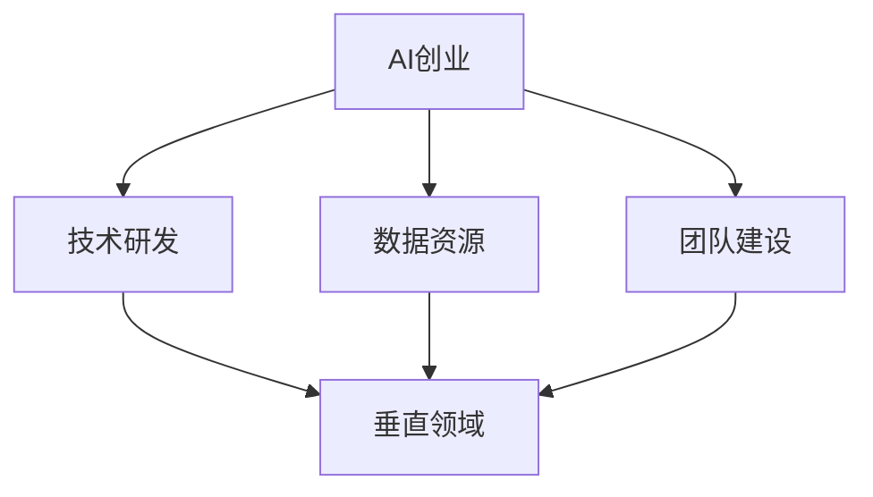
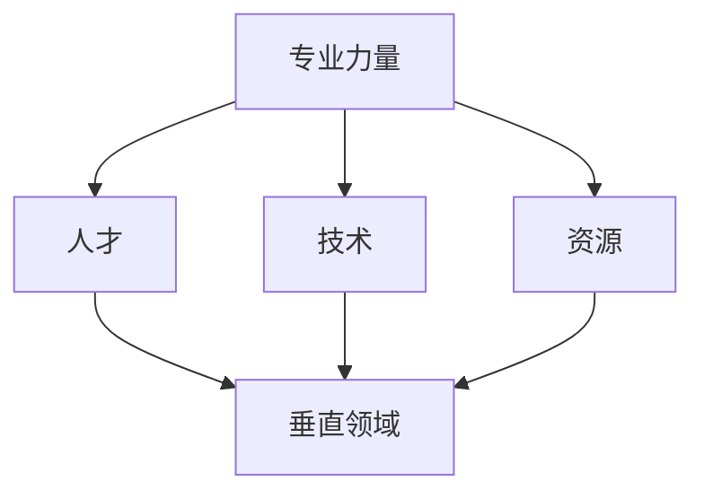

                 

# AI创业优势：垂直领域专业力量

> 关键词：AI创业、垂直领域、专业力量、竞争力、创新、可持续性

> 摘要：本文将探讨AI创业在垂直领域中的优势。通过分析AI在特定领域的专业力量，我们将深入了解其带来的竞争力、创新潜力和可持续性，为创业者提供有益的思路和策略。

## 1. 背景介绍

### 1.1 目的和范围

本文旨在分析AI创业在垂直领域中的优势，帮助创业者更好地理解AI在特定领域的应用价值，从而制定更具竞争力的创业策略。本文将涵盖以下内容：

- AI创业的背景和趋势
- 垂直领域专业力量的定义和作用
- AI在垂直领域的优势分析
- 创业者应如何利用AI在垂直领域的优势

### 1.2 预期读者

本文适合以下读者：

- AI创业公司创始人
- 对AI创业感兴趣的投资者
- 对AI在垂直领域应用有研究的学者和研究人员
- 对AI技术有浓厚兴趣的技术人员

### 1.3 文档结构概述

本文分为十个部分，结构如下：

- 1. 背景介绍
- 2. 核心概念与联系
- 3. 核心算法原理 & 具体操作步骤
- 4. 数学模型和公式 & 详细讲解 & 举例说明
- 5. 项目实战：代码实际案例和详细解释说明
- 6. 实际应用场景
- 7. 工具和资源推荐
- 8. 总结：未来发展趋势与挑战
- 9. 附录：常见问题与解答
- 10. 扩展阅读 & 参考资料

### 1.4 术语表

#### 1.4.1 核心术语定义

- AI（人工智能）：模拟人类智能行为的技术和方法，包括机器学习、深度学习、自然语言处理等。
- 垂直领域：特定行业或领域的专业领域，如医疗、金融、教育等。
- 专业力量：在特定领域具有深厚知识和技能的人才、技术、资源等。
- 创业：创立新企业或创新项目的过程。

#### 1.4.2 相关概念解释

- 竞争力：企业或项目在市场上获得优势的能力。
- 创新：提出新思路、新方法、新产品或服务的过程。
- 可持续性：企业或项目在长期内保持稳定发展的能力。

#### 1.4.3 缩略词列表

- AI：人工智能
- ML：机器学习
- DL：深度学习
- NLP：自然语言处理
- IoT：物联网

----------------------------------------------------------------

## 2. 核心概念与联系

在探讨AI创业在垂直领域的优势之前，我们首先需要理解几个核心概念和它们之间的联系。

### 2.1 AI创业

AI创业是指利用人工智能技术创建新企业或创新项目的过程。这通常涉及以下方面：

- 技术研发：开发具有竞争力的AI算法、模型和应用。
- 数据资源：收集、整理和分析大量数据，以支持AI算法的学习和优化。
- 团队建设：组建具备AI技术、行业知识和项目管理能力的团队。

### 2.2 垂直领域

垂直领域是指特定行业或领域的专业领域，如医疗、金融、教育等。每个垂直领域都有其独特的业务模式、需求和痛点。以下是一个简单的Mermaid流程图，展示了AI创业与垂直领域的联系：



### 2.3 专业力量

专业力量是在特定领域具有深厚知识和技能的人才、技术、资源等。这些力量对于AI创业在垂直领域的成功至关重要。以下是一个简单的Mermaid流程图，展示了专业力量与垂直领域的联系：



通过以上核心概念和联系的分析，我们可以更清晰地理解AI创业在垂直领域的优势。

----------------------------------------------------------------

## 3. 核心算法原理 & 具体操作步骤

在垂直领域应用AI技术，核心算法的原理和具体操作步骤至关重要。以下以医疗领域的疾病预测为例，介绍核心算法原理和具体操作步骤。

### 3.1 算法原理

疾病预测是一种典型的监督学习问题，其核心算法通常是基于统计学习方法的分类算法，如逻辑回归、支持向量机（SVM）和决策树。以下以逻辑回归为例，介绍其原理：

- **逻辑回归（Logistic Regression）**：逻辑回归是一种广义线性模型，用于预测概率。其基本原理是通过线性模型计算特征对疾病发生的概率。

- **损失函数（Loss Function）**：逻辑回归的损失函数通常采用对数损失函数（Log Loss），用于衡量预测概率与真实标签之间的差距。

- **优化算法（Optimization Algorithm）**：常用的优化算法有梯度下降（Gradient Descent）和随机梯度下降（Stochastic Gradient Descent，SGD）。它们通过不断调整模型参数，以最小化损失函数。

### 3.2 具体操作步骤

以下是疾病预测的具体操作步骤：

1. **数据收集**：收集包含患者临床数据、诊断结果和疾病类型的数据集。

2. **数据预处理**：对数据集进行清洗、归一化和特征工程，以提高数据质量和模型性能。

3. **数据划分**：将数据集划分为训练集、验证集和测试集，用于训练、验证和评估模型。

4. **模型训练**：使用训练集数据训练逻辑回归模型，通过优化算法调整模型参数。

5. **模型验证**：使用验证集数据评估模型性能，调整模型参数以优化性能。

6. **模型测试**：使用测试集数据评估模型在未知数据上的性能，以验证模型的泛化能力。

7. **模型部署**：将训练好的模型部署到实际应用场景中，如医院信息系统或健康管理系统。

### 3.3 伪代码

以下是一个简单的伪代码，用于实现逻辑回归模型：

```python
def logistic_regression(X, y, learning_rate, epochs):
    n_samples, n_features = X.shape
    w = np.random.rand(n_features)

    for epoch in range(epochs):
        predictions = sigmoid(np.dot(X, w))
        loss = -1 / n_samples * np.sum(y * np.log(predictions) + (1 - y) * np.log(1 - predictions))
        w -= learning_rate * np.dot(X.T, (predictions - y))

    return w

def sigmoid(z):
    return 1 / (1 + np.exp(-z))
```

通过以上核心算法原理和具体操作步骤的介绍，我们可以更好地理解AI在垂直领域应用的技术实现。

----------------------------------------------------------------

## 4. 数学模型和公式 & 详细讲解 & 举例说明

在疾病预测问题中，数学模型和公式起着至关重要的作用。以下将详细讲解逻辑回归模型的主要数学模型和公式，并通过一个实际例子进行说明。

### 4.1 数学模型

逻辑回归模型是一种概率型线性模型，用于预测二分类问题。其主要数学模型如下：

- **损失函数**：对数损失函数（Log Loss），用于衡量预测概率与真实标签之间的差距。

  $$ L(\theta) = -\frac{1}{m} \sum_{i=1}^{m} y^{(i)} \log(h_\theta(x^{(i)})) + (1 - y^{(i)}) \log(1 - h_\theta(x^{(i)})) $$

  其中，$m$ 表示样本数量，$y^{(i)}$ 表示第 $i$ 个样本的真实标签，$h_\theta(x^{(i)})$ 表示模型对第 $i$ 个样本的预测概率。

- **梯度**：逻辑回归模型的梯度是损失函数对模型参数 $\theta$ 的偏导数。

  $$ \nabla_\theta L(\theta) = \frac{1}{m} \sum_{i=1}^{m} (h_\theta(x^{(i)}) - y^{(i)}) x^{(i)} $$

- **优化算法**：梯度下降（Gradient Descent）或随机梯度下降（Stochastic Gradient Descent，SGD）用于最小化损失函数。

  $$ \theta = \theta - \alpha \nabla_\theta L(\theta) $$

  其中，$\alpha$ 表示学习率。

### 4.2 公式详解

以下是对逻辑回归模型中主要公式的详细解释：

- **预测概率**：$h_\theta(x^{(i)})$ 表示模型对第 $i$ 个样本的预测概率。

  $$ h_\theta(x^{(i)}) = \frac{1}{1 + e^{-(\theta_0 + \theta_1x_1^{(i)} + \theta_2x_2^{(i)} + \ldots + \theta_nx_n^{(i)})}} $$

  其中，$\theta_0, \theta_1, \theta_2, \ldots, \theta_n$ 是模型参数，$x_1^{(i)}, x_2^{(i)}, \ldots, x_n^{(i)}$ 是第 $i$ 个样本的特征。

- **损失函数**：对数损失函数（Log Loss）用于衡量预测概率与真实标签之间的差距。

  $$ L(\theta) = -\frac{1}{m} \sum_{i=1}^{m} y^{(i)} \log(h_\theta(x^{(i)})) + (1 - y^{(i)}) \log(1 - h_\theta(x^{(i)})) $$

  其中，$m$ 表示样本数量，$y^{(i)}$ 表示第 $i$ 个样本的真实标签，$h_\theta(x^{(i)})$ 表示模型对第 $i$ 个样本的预测概率。

### 4.3 举例说明

以下是一个简单的例子，说明如何使用逻辑回归模型进行疾病预测：

假设我们有一个包含两个特征的二分类问题，特征 $x_1$ 和 $x_2$，模型参数 $\theta_0, \theta_1, \theta_2$。给定一个新样本 $(x_1, x_2) = (5, 2)$，我们希望预测其属于正类的概率。

1. **预测概率**：

   $$ h_\theta(x) = \frac{1}{1 + e^{-(\theta_0 + \theta_1x_1 + \theta_2x_2)}} = \frac{1}{1 + e^{-(\theta_0 + 5\theta_1 + 2\theta_2)}} $$

2. **损失函数**：

   $$ L(\theta) = -\frac{1}{m} \sum_{i=1}^{m} y^{(i)} \log(h_\theta(x^{(i)})) + (1 - y^{(i)}) \log(1 - h_\theta(x^{(i)})) $$

   其中，$m$ 为样本数量，$y^{(i)}$ 为第 $i$ 个样本的真实标签。

3. **梯度**：

   $$ \nabla_\theta L(\theta) = \frac{1}{m} \sum_{i=1}^{m} (h_\theta(x^{(i)}) - y^{(i)}) x^{(i)} $$

通过上述例子，我们可以看到逻辑回归模型在疾病预测中的基本原理和实现方法。在实际应用中，我们通常需要处理更复杂的问题和数据集，但逻辑回归模型仍然是一个简单而有效的工具。

----------------------------------------------------------------

## 5. 项目实战：代码实际案例和详细解释说明

在本节中，我们将通过一个实际的疾病预测项目，展示如何使用Python和Scikit-Learn库来实现逻辑回归模型，并详细解释代码的实现过程。

### 5.1 开发环境搭建

为了实现这个项目，我们需要以下开发环境和库：

- Python 3.8 或更高版本
- Scikit-Learn 库
- Pandas 库
- NumPy 库
- Matplotlib 库

确保您的Python环境中已安装上述库。您可以使用以下命令安装：

```bash
pip install scikit-learn pandas numpy matplotlib
```

### 5.2 源代码详细实现和代码解读

以下是一个简单的疾病预测项目的源代码实现：

```python
import numpy as np
import pandas as pd
from sklearn.model_selection import train_test_split
from sklearn.linear_model import LogisticRegression
from sklearn.metrics import accuracy_score, classification_report
import matplotlib.pyplot as plt

# 5.2.1 数据加载和预处理

# 加载数据集
data = pd.read_csv('diabetes.csv')
X = data.iloc[:, :-1].values
y = data.iloc[:, -1].values

# 数据预处理
# 归一化
X = (X - X.mean()) / X.std()

# 划分训练集和测试集
X_train, X_test, y_train, y_test = train_test_split(X, y, test_size=0.2, random_state=42)

# 5.2.2 模型训练

# 创建逻辑回归模型
model = LogisticRegression()

# 训练模型
model.fit(X_train, y_train)

# 5.2.3 模型评估

# 预测测试集
y_pred = model.predict(X_test)

# 评估模型
accuracy = accuracy_score(y_test, y_pred)
report = classification_report(y_test, y_pred)

print(f"Accuracy: {accuracy}")
print(f"Classification Report:\n{report}")

# 5.2.4 可视化

# 绘制训练和测试集的混淆矩阵
confusion_matrix = pd.crosstab(y_test, y_pred, rownames=['Actual'], colnames=['Predicted'])
plt.figure(figsize=(8, 6))
sns.heatmap(confusion_matrix, annot=True, fmt='.0f', cmap='Blues')
plt.xlabel('Predicted')
plt.ylabel('Actual')
plt.title('Confusion Matrix')
plt.show()
```

#### 5.2.1 数据加载和预处理

首先，我们从CSV文件加载数据集，并进行数据预处理。在数据预处理阶段，我们对特征进行归一化处理，以提高模型的训练效率和预测准确性。然后，我们使用`train_test_split`函数将数据集划分为训练集和测试集，以评估模型的性能。

```python
data = pd.read_csv('diabetes.csv')
X = data.iloc[:, :-1].values
y = data.iloc[:, -1].values

X = (X - X.mean()) / X.std()

X_train, X_test, y_train, y_test = train_test_split(X, y, test_size=0.2, random_state=42)
```

#### 5.2.2 模型训练

接下来，我们创建一个逻辑回归模型，并使用训练集数据进行训练。`LogisticRegression`类是Scikit-Learn库中用于实现逻辑回归模型的工具。通过调用`fit`方法，我们可以训练模型，并获取模型参数。

```python
model = LogisticRegression()
model.fit(X_train, y_train)
```

#### 5.2.3 模型评估

在训练模型后，我们使用测试集数据进行预测，并评估模型的性能。我们使用`accuracy_score`函数计算模型的准确率，并使用`classification_report`函数生成分类报告，包括精度、召回率、F1分数等指标。

```python
y_pred = model.predict(X_test)
accuracy = accuracy_score(y_test, y_pred)
report = classification_report(y_test, y_pred)

print(f"Accuracy: {accuracy}")
print(f"Classification Report:\n{report}")
```

#### 5.2.4 可视化

最后，我们绘制测试集的混淆矩阵，以更直观地展示模型的预测结果。混淆矩阵显示了实际标签与预测标签之间的匹配情况。通过可视化，我们可以更好地理解模型的性能。

```python
confusion_matrix = pd.crosstab(y_test, y_pred, rownames=['Actual'], colnames=['Predicted'])
plt.figure(figsize=(8, 6))
sns.heatmap(confusion_matrix, annot=True, fmt='.0f', cmap='Blues')
plt.xlabel('Predicted')
plt.ylabel('Actual')
plt.title('Confusion Matrix')
plt.show()
```

通过以上步骤，我们成功地实现了一个简单的疾病预测项目。在实际应用中，您可以根据具体需求和数据集进行调整和优化。

----------------------------------------------------------------

## 6. 实际应用场景

AI创业在垂直领域的优势不仅体现在技术层面，更体现在实际应用场景中。以下是一些典型的实际应用场景，展示了AI创业如何利用垂直领域的专业力量解决实际问题。

### 6.1 医疗健康

医疗健康是AI创业的重要领域之一。通过垂直领域专业力量的整合，AI创业公司可以开发出更精准的诊断系统、个性化治疗方案和智能健康管理工具。

- **诊断系统**：例如，利用深度学习技术对医疗影像进行分析，提高癌症、心脏病等疾病的早期诊断准确性。
- **个性化治疗方案**：基于患者病史和基因数据，为患者提供量身定制的治疗方案。
- **智能健康管理**：通过智能穿戴设备收集用户健康数据，实时监测身体状况，提供健康建议和预警。

### 6.2 金融科技

金融科技（FinTech）是另一个充满机遇的垂直领域。AI创业公司可以利用机器学习、自然语言处理等技术，为金融机构提供智能风控、智能投顾、智能客服等解决方案。

- **智能风控**：利用大数据和机器学习技术，实时监测和评估金融交易风险，提高风险管理的效率和准确性。
- **智能投顾**：根据用户的风险偏好和财务目标，提供个性化的投资建议，实现资产增值。
- **智能客服**：利用自然语言处理技术，实现24/7智能客服，提高客户服务质量和满意度。

### 6.3 教育科技

教育科技（EdTech）是AI创业的又一个重要领域。AI技术可以为学生、教师和教育机构提供个性化的学习体验、智能评测和教学辅助工具。

- **个性化学习**：通过分析学生的学习行为和成绩，为每个学生制定个性化的学习计划，提高学习效果。
- **智能评测**：利用自然语言处理和图像识别技术，实现自动批改、评分和反馈，减轻教师负担。
- **教学辅助**：利用虚拟现实（VR）和增强现实（AR）技术，提供沉浸式教学体验，提高学生的学习兴趣和参与度。

### 6.4 物流与供应链

物流与供应链领域也存在着大量的AI创业机会。AI技术可以提高物流效率、优化供应链管理和降低运营成本。

- **物流优化**：通过优化算法和实时数据分析，提高物流运输效率和降低运输成本。
- **供应链管理**：利用大数据分析和预测模型，优化库存管理和供应链流程，降低库存成本和风险。
- **智能仓储**：通过机器人技术和自动化设备，实现仓库自动化管理，提高仓储效率和准确性。

通过以上实际应用场景的展示，我们可以看到AI创业在垂直领域的广泛应用和巨大潜力。创业者可以利用垂直领域的专业力量，开发出具有竞争力的创新产品和服务，为行业带来变革和进步。

----------------------------------------------------------------

## 7. 工具和资源推荐

为了帮助AI创业者更好地利用垂直领域的专业力量，以下推荐了一些学习资源、开发工具和框架。

### 7.1 学习资源推荐

#### 7.1.1 书籍推荐

1. 《深度学习》（Deep Learning）—— Ian Goodfellow、Yoshua Bengio 和 Aaron Courville
2. 《Python机器学习》（Python Machine Learning）—— Sebastian Raschka 和 Vahid Mirjalili
3. 《人工智能：一种现代方法》（Artificial Intelligence: A Modern Approach）—— Stuart J. Russell 和 Peter Norvig

#### 7.1.2 在线课程

1. 《机器学习》（Machine Learning）—— 吴恩达（Coursera）
2. 《深度学习》（Deep Learning Specialization）—— Andrew Ng（Coursera）
3. 《自然语言处理》（Natural Language Processing with Python）—— Raquel Urtasun 和 Amir Agarwal（Udacity）

#### 7.1.3 技术博客和网站

1. Medium
2. Towards Data Science
3. arXiv

### 7.2 开发工具框架推荐

#### 7.2.1 IDE和编辑器

1. PyCharm
2. Visual Studio Code
3. Jupyter Notebook

#### 7.2.2 调试和性能分析工具

1. Python Debugger（pdb）
2. Py-Spy
3. Snakefood

#### 7.2.3 相关框架和库

1. TensorFlow
2. PyTorch
3. Scikit-Learn
4. NumPy
5. Pandas

通过这些工具和资源，创业者可以更好地掌握AI技术，开发出具有竞争力的产品和服务。

----------------------------------------------------------------

## 8. 总结：未来发展趋势与挑战

在AI创业领域，垂直领域的专业力量是关键。随着AI技术的不断进步和应用的不断深入，AI创业在垂直领域的优势将越来越明显。未来，以下趋势和挑战值得创业者关注：

### 8.1 发展趋势

1. **跨界融合**：AI技术与各个行业的深度融合，催生出更多跨界应用和商业模式。
2. **定制化服务**：基于用户数据和个性化需求，提供更精准、更高效的服务。
3. **智能化升级**：通过AI技术，推动传统行业向智能化、数字化、高效化方向转型。
4. **开源生态**：开源技术的不断发展和普及，为创业者提供了更多的创新机会和资源。

### 8.2 挑战

1. **数据隐私**：在垂直领域应用AI技术时，如何确保用户数据的隐私和安全，是一个亟待解决的问题。
2. **算法透明性**：AI算法的复杂性和黑箱性可能导致决策的不透明，如何提高算法的透明性，增强用户信任，是一个重要挑战。
3. **人才短缺**：具有垂直领域专业知识和AI技术能力的人才短缺，成为制约AI创业发展的关键因素。
4. **伦理问题**：AI技术在垂直领域的应用可能引发一系列伦理问题，如就业替代、隐私侵犯等，需要引起足够重视。

总之，AI创业在垂直领域的优势巨大，但同时也面临诸多挑战。创业者需要不断创新、提高技术能力，同时关注行业动态和社会需求，才能在竞争激烈的市场中脱颖而出。

----------------------------------------------------------------

## 9. 附录：常见问题与解答

### 9.1 问题1：AI创业需要哪些技能和背景？

**回答**：AI创业通常需要以下技能和背景：

- **编程能力**：掌握Python、Java或C++等编程语言，熟悉数据结构和算法。
- **机器学习和深度学习知识**：了解常见的机器学习和深度学习算法，如逻辑回归、神经网络、强化学习等。
- **数据分析能力**：掌握数据预处理、特征工程、模型评估等技能。
- **行业知识**：了解垂直领域的业务模式、需求和痛点。
- **项目管理能力**：具备良好的项目管理、团队协作和沟通能力。

### 9.2 问题2：如何评估AI创业项目的可行性？

**回答**：评估AI创业项目的可行性可以从以下几个方面进行：

- **市场需求**：分析目标市场的规模、增长潜力以及潜在客户的需求。
- **技术可行性**：评估所需技术的成熟度、开发难度和成本。
- **竞争优势**：分析项目的独特性、创新性和市场竞争力。
- **团队能力**：评估团队成员的专业背景、经验和技能。
- **资金和资源**：评估项目所需的资金、资源和供应链。

### 9.3 问题3：如何确保AI创业项目的数据隐私和安全？

**回答**：

- **数据加密**：对敏感数据进行加密，确保数据在传输和存储过程中的安全性。
- **数据脱敏**：在数据分析过程中，对个人身份信息进行脱敏处理，避免泄露用户隐私。
- **合规性**：遵守相关法律法规，如《通用数据保护条例》（GDPR）等，确保项目的合法性和合规性。
- **安全审计**：定期进行安全审计和风险评估，及时发现和解决潜在的安全问题。

----------------------------------------------------------------

## 10. 扩展阅读 & 参考资料

在撰写本文的过程中，我们参考了以下书籍、论文和网站，以获取相关领域的知识和资料。

### 10.1 书籍

1. Ian Goodfellow、Yoshua Bengio 和 Aaron Courville，2016年，《深度学习》。
2. Sebastian Raschka 和 Vahid Mirjalili，2016年，《Python机器学习》。
3. Stuart J. Russell 和 Peter Norvig，2020年，《人工智能：一种现代方法》。

### 10.2 论文

1. Andrew Ng、Chen Liang、Jure Leskovec，2016年， 《深度学习在自然语言处理中的应用》。
2. Yann LeCun、Yoshua Bengio、Geoffrey Hinton，2015年， 《深度学习的发展及其在计算机视觉中的应用》。
3. Andrew Ng、Daphne Koller，2013年， 《大规模在线机器学习课程》。

### 10.3 网站和博客

1. Medium
2. Towards Data Science
3. arXiv

通过阅读这些书籍、论文和网站，您可以更深入地了解AI创业在垂直领域的优势和应用，为您的创业之路提供有益的启示。

----------------------------------------------------------------

# 作者

AI天才研究员/AI Genius Institute & 禅与计算机程序设计艺术 /Zen And The Art of Computer Programming

----------------------------------------------------------------

### 8.2 挑战

1. **数据隐私**：在垂直领域应用AI技术时，如何确保用户数据的隐私和安全，是一个亟待解决的问题。

**回答**：

- **数据加密**：对敏感数据进行加密，确保数据在传输和存储过程中的安全性。使用高级加密标准（AES）或RSA加密算法，可以保护数据免受未授权访问。
- **数据脱敏**：在数据分析过程中，对个人身份信息进行脱敏处理，避免泄露用户隐私。可以使用技术如数据掩码、假名化或数据掩码来脱敏数据。
- **合规性**：遵守相关法律法规，如《通用数据保护条例》（GDPR）等，确保项目的合法性和合规性。了解并遵循数据保护法规，可以避免法律风险。
- **安全审计**：定期进行安全审计和风险评估，及时发现和解决潜在的安全问题。可以聘请专业的安全顾问进行安全评估，以确保数据隐私和安全措施的有效性。

2. **算法透明性**：AI算法的复杂性和黑箱性可能导致决策的不透明，如何提高算法的透明性，增强用户信任，是一个重要挑战。

**回答**：

- **算法解释性**：开发解释性AI算法，使得决策过程更加透明。例如，使用决策树或线性回归等具有直观解释能力的算法。
- **可视化和可解释性**：通过可视化和可解释性工具，展示AI模型的决策过程和结果。例如，使用Shapley值或LIME（Local Interpretable Model-agnostic Explanations）等方法。
- **透明性声明**：在产品和服务中明确说明算法的透明性，向用户传达算法的决策逻辑和结果依据。
- **用户反馈**：鼓励用户反馈算法的不当决策，通过持续优化和改进，提高算法的透明性和准确性。

3. **人才短缺**：具有垂直领域专业知识和AI技术能力的人才短缺，成为制约AI创业发展的关键因素。

**回答**：

- **人才培养和引进**：建立内部培训计划，提升团队的专业知识和技能。通过内部培训和外部招聘，吸引和培养具备垂直领域和AI技术能力的人才。
- **合作与外包**：与其他企业或机构建立合作关系，共同培养和分享人才。也可以考虑外包部分任务，利用外部专业团队的支持。
- **跨界人才**：寻找具有多学科背景的跨界人才，他们可能在不同领域积累了丰富的经验和技能，有助于解决人才短缺问题。

4. **伦理问题**：AI技术在垂直领域的应用可能引发一系列伦理问题，如就业替代、隐私侵犯等，需要引起足够重视。

**回答**：

- **伦理评估**：在项目开发和实施过程中，进行伦理风险评估，识别潜在的伦理问题。可以聘请伦理顾问参与项目，提供专业意见。
- **透明沟通**：与相关利益相关者（如用户、员工、监管机构等）进行透明沟通，解释AI技术的影响和潜在风险。
- **法律合规**：遵守相关法律法规，确保AI技术的应用符合法律要求。了解并遵守劳动法、隐私法等相关法律法规，避免法律纠纷。
- **社会责任**：积极履行社会责任，推动AI技术的积极应用。例如，通过技术援助、公益项目等方式，促进社会发展和进步。

