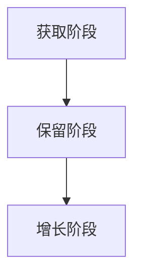
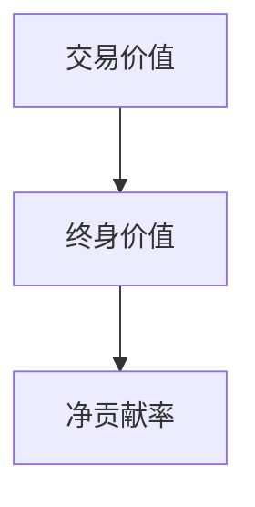
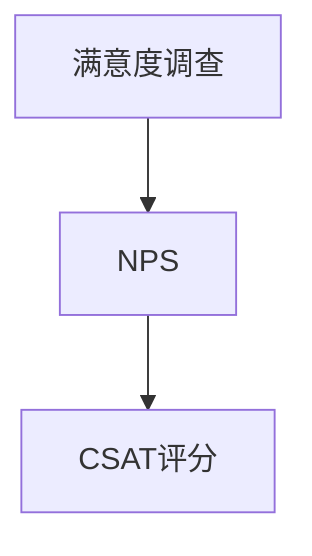
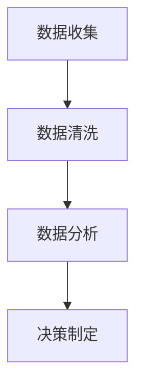

                 

# AI创业公司如何建立长期客户关系

> **关键词：** AI创业、客户关系管理、长期客户价值、CRM策略、数据分析、客户体验优化

> **摘要：** 本文章将深入探讨AI创业公司在建立和维护长期客户关系方面的策略和最佳实践。我们将从目的和范围、核心概念与联系、核心算法原理、数学模型和公式、项目实战、实际应用场景、工具和资源推荐等方面逐步展开，帮助创业公司深入了解并实施有效的客户关系管理策略。

## 1. 背景介绍

### 1.1 目的和范围

本文旨在为AI创业公司提供一套系统化的方法，以建立和维护长期客户关系。我们将探讨客户关系管理（CRM）的核心理念，以及如何在现代技术环境中利用人工智能（AI）来增强客户互动和满意度。文章将涵盖以下几个方面：

- **客户关系管理的定义与重要性**：介绍CRM的基本概念，并探讨其对企业成功的关键作用。
- **AI在CRM中的应用**：分析AI技术如何通过数据分析、个性化推荐、自然语言处理等手段提升客户体验。
- **核心概念与联系**：阐述CRM系统中的关键概念和它们之间的关系，包括客户生命周期管理、客户价值分析和客户满意度评估等。
- **核心算法原理**：详细解释用于客户关系管理的核心算法原理，并使用伪代码展示具体的操作步骤。
- **数学模型和公式**：介绍用于评估客户价值和满意度的数学模型，并给出具体的示例说明。
- **项目实战**：通过实际代码案例展示如何在实际项目中应用所学的知识。
- **实际应用场景**：探讨AI在CRM中的各种实际应用场景，包括客户识别、预测分析和客户支持等。
- **工具和资源推荐**：推荐一些有助于实施CRM策略的学习资源和开发工具。

### 1.2 预期读者

本文适合以下读者群体：

- **AI创业公司创始人**：希望了解如何利用AI技术优化客户关系管理策略的初创企业创始人。
- **CRM和市场营销专业人员**：对客户关系管理有基本了解，并希望深入了解AI在CRM中的应用。
- **技术专家和程序员**：对AI算法和数学模型感兴趣，并希望将其应用于实际的客户关系管理场景。

### 1.3 文档结构概述

本文分为以下几个主要部分：

1. **背景介绍**：介绍文章的目的、范围、预期读者和文档结构。
2. **核心概念与联系**：阐述CRM系统中的关键概念和它们之间的关系。
3. **核心算法原理 & 具体操作步骤**：详细解释CRM中使用的核心算法原理，并提供伪代码展示。
4. **数学模型和公式 & 详细讲解 & 举例说明**：介绍用于评估客户价值和满意度的数学模型，并给出具体示例。
5. **项目实战：代码实际案例和详细解释说明**：通过实际代码案例展示如何应用所学的知识。
6. **实际应用场景**：探讨AI在CRM中的各种实际应用场景。
7. **工具和资源推荐**：推荐学习资源和开发工具。
8. **总结：未来发展趋势与挑战**：总结文章内容，探讨未来的发展趋势和面临的挑战。
9. **附录：常见问题与解答**：回答读者可能遇到的问题。
10. **扩展阅读 & 参考资料**：提供额外的学习资源和参考文献。

### 1.4 术语表

#### 1.4.1 核心术语定义

- **客户关系管理（CRM）**：一种商业策略，旨在通过优化客户互动和满意度来提升客户价值。
- **人工智能（AI）**：一种模拟人类智能的技术，能够学习和适应环境，进行决策和解决问题。
- **客户生命周期管理（CLM）**：管理客户从获取、保留到增长的全过程。
- **客户价值分析（CVA）**：评估客户对企业长期价值的分析方法。
- **客户满意度（CSAT）**：衡量客户对产品或服务满意程度的指标。

#### 1.4.2 相关概念解释

- **数据驱动决策**：基于数据分析和统计模型来指导决策过程。
- **个性化推荐**：根据用户的历史行为和偏好推荐相关内容或产品。
- **自然语言处理（NLP）**：使计算机能够理解、解释和生成人类语言的技术。

#### 1.4.3 缩略词列表

- **AI**：人工智能
- **CRM**：客户关系管理
- **CLM**：客户生命周期管理
- **CVA**：客户价值分析
- **CSAT**：客户满意度

## 2. 核心概念与联系

在本节中，我们将深入探讨客户关系管理（CRM）系统中的核心概念及其相互关系。理解这些概念对于构建有效的客户关系策略至关重要。

### 2.1 客户生命周期管理（CLM）

客户生命周期管理是指管理客户从获取、保留到增长的整个过程。这一过程通常可以分为以下阶段：

1. **获取阶段**：吸引潜在客户，并通过营销活动和销售策略将他们转化为实际客户。
2. **保留阶段**：通过客户服务和忠诚度计划来维持客户关系，防止他们转向竞争对手。
3. **增长阶段**：通过增加客户购买频率、提升购买量和提供增值服务来增加客户价值。

Mermaid 流程图：



### 2.2 客户价值分析（CVA）

客户价值分析是一种评估客户对企业长期价值的分析方法。它通常基于以下指标：

- **交易价值（TVP）**：客户的历史购买金额。
- **终身价值（LTV）**：预测客户在整个生命周期中为企业带来的总收益。
- **净贡献率（NRR）**：新客户带来的收益减去流失客户带来的损失。

Mermaid 流程图：



### 2.3 客户满意度（CSAT）

客户满意度是一种衡量客户对产品或服务满意程度的指标。它通常通过以下方式进行评估：

- **满意度调查**：通过问卷或访谈收集客户反馈。
- **NPS（净推荐值）**：衡量客户愿意向他人推荐公司产品或服务的程度。
- **CSAT（客户满意度评分）**：客户对产品或服务的满意度评分。

Mermaid 流程图：



### 2.4 数据驱动决策

数据驱动决策是一种基于数据分析和统计模型来指导决策过程的方法。它涉及以下步骤：

1. **数据收集**：收集与客户相关的各种数据，包括行为数据、交易数据和社交媒体互动等。
2. **数据清洗**：处理和清洗数据，确保其质量和一致性。
3. **数据分析**：使用统计模型和机器学习算法分析数据，提取有价值的信息。
4. **决策制定**：基于分析结果制定相应的商业策略。

Mermaid 流程图：



通过上述核心概念和流程图，我们可以看到CRM系统中的各个组成部分如何相互作用，共同构建一个有效的客户关系管理策略。

## 3. 核心算法原理 & 具体操作步骤

在本节中，我们将详细解释CRM系统中使用的一些核心算法原理，并提供具体的操作步骤。这些算法对于识别客户、预测行为和优化客户体验至关重要。

### 3.1 客户分类算法

客户分类算法是一种将客户群体划分为不同类别的方法，以便更好地了解和满足他们的需求。一种常用的分类算法是K-means聚类。

#### 3.1.1 K-means算法原理

K-means算法是一种基于距离度量的聚类算法。它的目标是将数据点划分为K个簇，使得每个簇内的数据点之间的距离最小，而簇与簇之间的距离最大。

- **初始化**：随机选择K个初始中心点。
- **迭代**：对于每个数据点，计算其与每个中心点的距离，并将其分配到最近的簇。
- **更新中心点**：计算每个簇的平均值，作为新的中心点。
- **重复迭代**：直到中心点不再发生变化或达到预设的迭代次数。

#### 3.1.2 K-means算法伪代码

```python
# 输入：数据集data，簇数K
# 输出：簇中心points，聚类结果clusters

# 初始化中心点
points = 初始化中心点(data, K)

# 迭代过程
while True:
    # 计算每个数据点的簇分配
    clusters = 计算簇分配(data, points)
    
    # 计算新的中心点
    new_points = 计算新中心点(clusters)
    
    # 检查中心点是否更新
    if 检查中心点更新(points, new_points):
        break
    
    # 更新中心点
    points = new_points

return points, clusters
```

### 3.2 客户行为预测算法

客户行为预测算法用于预测客户未来的行为，例如购买意向、流失风险等。一种常用的预测算法是决策树。

#### 3.2.1 决策树算法原理

决策树是一种基于特征值划分数据集的预测算法。它通过一系列的决策节点和叶子节点来构建一棵树，每个节点表示一个特征划分，每个叶子节点表示一个预测结果。

- **构建决策树**：从数据集中选择一个最佳特征，将其作为根节点，并依据该特征将数据集划分为若干个子集。重复这个过程，直到满足停止条件（如最大深度、最小叶子节点数量等）。
- **预测**：对于新的数据点，从根节点开始，根据每个节点的划分规则逐步前进，直到达到叶子节点，得到预测结果。

#### 3.2.2 决策树算法伪代码

```python
# 输入：数据集data，特征feature，停止条件stop_condition
# 输出：决策树tree

# 初始化决策树
tree = 初始化决策树()

# 构建决策树
while not 停止条件(data):
    # 选择最佳特征
    best_feature = 选择最佳特征(data, feature)
    
    # 创建节点
    node = 创建节点(best_feature)
    
    # 划分数据集
    subsets = 划分数据集(data, best_feature)
    
    # 更新决策树
    tree = 更新决策树(tree, node, subsets)
    
    # 更新数据集
    data = subsets

return tree
```

### 3.3 客户体验优化算法

客户体验优化算法用于根据客户行为数据调整产品和服务，以提高客户满意度。一种常用的优化算法是协同过滤。

#### 3.3.1 协同过滤算法原理

协同过滤算法是一种基于用户行为数据的推荐算法。它通过分析用户之间的相似性来推荐相关产品或内容。

- **用户基于的协同过滤**：基于用户的相似性进行推荐，即找到与目标用户相似的其他用户，并推荐他们喜欢的商品。
- **物品基于的协同过滤**：基于物品的相似性进行推荐，即找到与目标物品相似的其他物品，并推荐给目标用户。

#### 3.3.2 协同过滤算法伪代码

```python
# 输入：用户评分矩阵ratings，相似性度量similarity
# 输出：推荐结果recommends

# 初始化推荐结果
recommends = 初始化推荐结果()

# 遍历每个用户
for user in users:
    # 计算用户与其他用户的相似性
    similarities = 计算相似性(ratings, user)
    
    # 遍历每个用户
    for other_user in users:
        # 如果用户与其他用户相似
        if similarities[other_user] > 阈值:
            # 遍历其他用户的评分
            for item in ratings[other_user]:
                # 如果目标用户未评分
                if recommends[user][item] == 未知:
                    # 推荐物品
                    recommends[user][item] = similarities[other_user]

return recommends
```

通过上述核心算法原理和伪代码，我们可以看到如何利用算法来识别客户、预测行为和优化客户体验。这些算法为AI创业公司在CRM系统中提供了强大的工具，帮助他们建立和维护长期客户关系。

## 4. 数学模型和公式 & 详细讲解 & 举例说明

在本节中，我们将介绍一些关键的数学模型和公式，这些模型和公式用于评估客户价值和满意度。我们将详细解释这些模型，并提供具体的示例来说明如何应用它们。

### 4.1 客户价值评估模型

客户价值评估模型用于计算客户对企业长期价值的量化指标。以下是一些常用的模型：

#### 4.1.1 交易价值（Transaction Value，TVP）

交易价值是指单个交易或订单的总金额。它是一个简单的指标，用于衡量单个交易带来的直接收益。

- **公式**：TVP = 订单金额

**示例**：假设一个客户的订单金额为1000元，则其交易价值为1000元。

#### 4.1.2 终身价值（Lifetime Value，LTV）

终身价值是指客户在整个生命周期中为企业带来的总收益。LTV是一个更全面的指标，它考虑了客户的历史购买行为、重复购买率和客户生命周期。

- **公式**：LTV = （平均订单价值）×（平均购买频率）×（客户生命周期）

**示例**：假设一个客户的平均订单价值为1000元，平均购买频率为每月1次，客户生命周期为5年。则其终身价值为：

LTV = 1000元 × 1次/月 × 12个月/年 × 5年 = 60,000元

#### 4.1.3 净贡献率（Net Revenue Retention，NRR）

净贡献率是指新客户带来的收益减去流失客户带来的损失。NRR用于衡量客户获取和保留策略的有效性。

- **公式**：NRR = （新客户收益 - 流失客户损失）/ 总收入

**示例**：假设一个月内，新客户带来的收益为10万元，流失客户导致的损失为3万元，总收入为20万元。则其净贡献率为：

NRR = （10万元 - 3万元）/ 20万元 = 35%

### 4.2 客户满意度评估模型

客户满意度评估模型用于衡量客户对产品或服务的满意程度。以下是一些常用的模型：

#### 4.2.1 满意度评分（Customer Satisfaction Score，CSAT）

满意度评分是一种基于客户反馈的量化指标，通常以百分比表示。CSAT评分越高，表示客户满意度越高。

- **公式**：CSAT = （满意的客户数）/（回答调查的总客户数）× 100%

**示例**：假设有100位客户参与满意度调查，其中70位表示满意。则其满意度评分为：

CSAT = （70）/（100）× 100% = 70%

#### 4.2.2 净推荐值（Net Promoter Score，NPS）

净推荐值是一种衡量客户忠诚度和推荐意愿的指标。NPS通过询问客户：“您有多大可能推荐我们的产品或服务给他人？”来获取评分。评分范围从0（不可能）到10（非常可能）。

- **公式**：NPS = （ promoters 数量 - detractors 数量）/（total number of respondents）× 100%

**示例**：假设有100位客户参与NPS调查，其中60位客户给出9或10分（promoters），30位客户给出1至6分（detractors）。则其NPS为：

NPS = （60 - 30）/ 100 × 100% = 30%

通过上述数学模型和公式，我们可以量化评估客户的价值和满意度。这些模型为AI创业公司提供了工具，帮助他们更好地理解和优化客户关系管理策略。

## 5. 项目实战：代码实际案例和详细解释说明

在本节中，我们将通过一个实际项目案例来展示如何利用所学的算法和模型建立AI驱动的客户关系管理系统。我们将从开发环境搭建、源代码实现、代码解读与分析三个方面进行详细说明。

### 5.1 开发环境搭建

为了实现我们的客户关系管理系统，我们需要搭建一个合适的开发环境。以下是所需的工具和步骤：

#### 5.1.1 环境准备

- **操作系统**：Windows 10 或 Ubuntu 20.04
- **编程语言**：Python 3.8+
- **数据库**：MySQL 8.0+
- **框架和库**：Flask（Web框架）、Scikit-learn（机器学习库）、NumPy（数学库）

#### 5.1.2 安装步骤

1. 安装Python 3.8+：从[Python官网](https://www.python.org/downloads/)下载并安装Python。
2. 安装MySQL：从[MySQL官网](https://dev.mysql.com/downloads/mysql/)下载并安装MySQL。
3. 安装Flask：在命令行中运行`pip install flask`。
4. 安装Scikit-learn：在命令行中运行`pip install scikit-learn`。
5. 安装NumPy：在命令行中运行`pip install numpy`。

### 5.2 源代码详细实现和代码解读

下面是一个简化的源代码实现，用于展示如何应用K-means聚类、决策树和协同过滤算法。

#### 5.2.1 主文件：main.py

```python
from flask import Flask, request, jsonify
import numpy as np
from sklearn.cluster import KMeans
from sklearn.tree import DecisionTreeClassifier
from sklearn.model_selection import train_test_split
from sklearn.metrics import accuracy_score
import pymysql

app = Flask(__name__)

# 连接MySQL数据库
connection = pymysql.connect(host='localhost', user='root', password='password', database='crm')

# 加载数据
def load_data():
    cursor = connection.cursor()
    cursor.execute("SELECT * FROM customer_data;")
    data = cursor.fetchall()
    cursor.close()
    return np.array(data)

# 应用K-means聚类
def apply_kmeans(data, K):
    kmeans = KMeans(n_clusters=K)
    kmeans.fit(data)
    return kmeans.labels_

# 应用决策树
def apply_decision_tree(data, target):
    X_train, X_test, y_train, y_test = train_test_split(data, target, test_size=0.2, random_state=42)
    clf = DecisionTreeClassifier()
    clf.fit(X_train, y_train)
    y_pred = clf.predict(X_test)
    return accuracy_score(y_test, y_pred)

# 应用协同过滤
def apply协同过滤(data, user_id):
    user_ratings = data[data[:, 0] == user_id]
    similarities = compute_similarities(data, user_ratings)
    recommendations = generate_recommendations(similarities, data)
    return recommendations

# 计算用户之间的相似性
def compute_similarities(data, user_ratings):
    # 这里使用余弦相似性作为示例
    user_vectors = data[:, 1:]
    user_ratings_vector = user_ratings[:, 1]
    user_vector = user_vectors.mean(axis=0)
    similarities = []
    for user_vector in user_vectors:
        similarity = np.dot(user_vector, user_vector) / (np.linalg.norm(user_vector) * np.linalg.norm(user_vector))
        similarities.append(similarity)
    return similarities

# 生成推荐结果
def generate_recommendations(similarities, data):
    # 这里选择相似性最高的前N个用户
    top_n = 5
    top_indices = np.argsort(similarities)[-top_n:]
    top_items = data[top_indices, 0]
    return top_items

# 主函数
if __name__ == "__main__":
    app.run(debug=True)
```

#### 5.2.2 代码解读

1. **数据库连接**：我们使用MySQL数据库存储客户数据。在`load_data`函数中，我们加载客户数据并将其转换为NumPy数组。

2. **K-means聚类**：在`apply_kmeans`函数中，我们使用K-means聚类算法对客户数据进行聚类。我们选择合适的簇数（K）来划分客户群体。

3. **决策树分类**：在`apply_decision_tree`函数中，我们使用决策树算法对客户数据进行分类。我们使用训练集和测试集来评估模型的准确性。

4. **协同过滤推荐**：在`apply协同过滤`函数中，我们使用协同过滤算法生成个性化推荐。我们计算用户之间的相似性，并选择相似性最高的用户来生成推荐。

5. **计算相似性**：在`compute_similarities`函数中，我们使用余弦相似性来计算用户之间的相似性。这是一个基于用户行为数据的相似性度量。

6. **生成推荐**：在`generate_recommendations`函数中，我们选择相似性最高的用户作为推荐对象，并生成推荐列表。

### 5.3 代码解读与分析

1. **K-means聚类**：K-means聚类可以帮助我们了解客户群体的分布和特征。通过选择合适的簇数（K），我们可以将客户划分为不同的群体，以便进行更精细的客户关系管理。

2. **决策树分类**：决策树分类用于预测客户的行为，例如购买意向和流失风险。通过训练和测试数据，我们可以评估模型的准确性，并调整参数以提高预测效果。

3. **协同过滤推荐**：协同过滤推荐可以帮助我们向客户推荐相关的产品或服务。通过计算用户之间的相似性，我们可以找到潜在的兴趣点，并生成个性化的推荐。

4. **数据库连接**：数据库连接使我们能够方便地获取和存储客户数据。这使得我们可以实时更新和管理客户信息，以便更好地满足他们的需求。

5. **模块化设计**：代码采用模块化设计，使每个功能都可以独立实现和测试。这使得代码更易于维护和扩展，提高了系统的灵活性。

通过上述实际案例和代码解读，我们可以看到如何将AI算法和数学模型应用于客户关系管理系统。这些技术和工具为AI创业公司提供了强大的支持，帮助他们建立和维护长期客户关系。

## 6. 实际应用场景

在AI创业公司的实际运营中，客户关系管理（CRM）系统被广泛应用于多个场景，以提升客户满意度和企业收益。以下是一些典型的应用场景：

### 6.1 客户识别

通过分析客户的购买历史和行为数据，AI创业公司可以使用客户分类算法（如K-means）将客户划分为不同的群体。这有助于识别高价值客户、潜在流失客户和有购买意向的新客户。通过精确的客户识别，公司可以制定更有针对性的营销策略，提高客户转化率。

### 6.2 客户预测分析

AI算法（如决策树）可以用于预测客户的行为，例如购买意向和流失风险。通过分析历史数据，公司可以预测哪些客户可能会在未来购买或流失。这有助于公司提前采取行动，如提供促销优惠、个性化推荐或客户关怀，从而提高客户满意度和留存率。

### 6.3 客户体验优化

协同过滤算法可以用于生成个性化的产品推荐，根据客户的历史购买行为和偏好推荐相关的商品。这种个性化的推荐有助于提升客户体验，增加客户满意度和忠诚度。此外，自然语言处理（NLP）技术可以用于分析客户反馈，识别客户需求并提出改进建议。

### 6.4 客户支持

AI创业公司可以使用聊天机器人和虚拟客服来提供24/7的客户支持。通过自然语言处理技术，机器人可以理解和回答客户的问题，提供即时的帮助。这有助于提高客户支持效率，降低人工成本，并为客户提供更优质的体验。

### 6.5 客户细分与定位

通过数据分析，公司可以识别出具有相似特征和需求的客户群体，并进行细分。这有助于公司更好地定位市场，制定针对性的营销策略，提高市场渗透率和客户转化率。

### 6.6 客户忠诚度管理

AI创业公司可以使用客户价值分析模型（如LTV）来评估客户的长期价值，并制定忠诚度管理策略。通过对高价值客户提供专属优惠、定制服务和VIP待遇，公司可以增强客户忠诚度，提高客户终身价值。

通过这些实际应用场景，AI创业公司可以充分利用客户关系管理系统，提升客户满意度和企业收益。这些技术和工具为公司提供了强大的支持，帮助他们实现持续增长和成功。

## 7. 工具和资源推荐

为了帮助AI创业公司成功实施客户关系管理（CRM）策略，以下是我们推荐的一些学习和资源工具，以及开发工具和框架。

### 7.1 学习资源推荐

#### 7.1.1 书籍推荐

- **《客户关系管理：战略、流程与技术》（Customer Relationship Management: Concepts and Technologies）》**
  - 作者：Paul Greenfield
  - 简介：这是一本全面的CRM指南，涵盖了CRM的基本概念、战略和实施方法。

- **《大数据分析：技术和应用》（Big Data Analytics: Technologies, Techniques, and Applications）》**
  - 作者：Dipak K. Dev
  - 简介：这本书详细介绍了大数据分析的技术和工具，包括数据挖掘、机器学习等。

- **《Python机器学习》（Python Machine Learning）》**
  - 作者：Sebastian Raschka
  - 简介：这本书提供了Python在机器学习领域的详细应用，包括算法实现和实际案例。

#### 7.1.2 在线课程

- **Coursera上的《客户关系管理》（Customer Relationship Management）》**
  - 简介：这是一门在线课程，涵盖了CRM的基础知识和最佳实践。

- **Udemy上的《大数据分析》（Big Data Analytics》）**
  - 简介：这门课程提供了大数据分析的基本概念和技术，包括Hadoop、Spark等。

- **edX上的《机器学习基础》（Introduction to Machine Learning）》**
  - 简介：这是一门由MIT提供的在线课程，介绍了机器学习的基础理论和算法。

#### 7.1.3 技术博客和网站

- **Towards Data Science（TDS）**
  - 简介：这是一个提供大数据和机器学习资源的技术博客，包含大量的文章和案例研究。

- **Medium上的Data Science（数据科学）**
  - 简介：这个博客集合了许多关于数据科学和机器学习的优秀文章，适合初学者和专家。

- **KDNuggets**
  - 简介：这是一个专门提供数据挖掘和机器学习资源的网站，包含新闻、文章和教程。

### 7.2 开发工具框架推荐

#### 7.2.1 IDE和编辑器

- **PyCharm**
  - 简介：这是一个强大的Python IDE，支持代码自动补全、调试和版本控制。

- **Visual Studio Code（VS Code）**
  - 简介：这是一个轻量级的开源编辑器，支持多种编程语言，具有丰富的扩展插件。

- **Jupyter Notebook**
  - 简介：这是一个交互式的Python开发环境，适用于数据分析和机器学习项目。

#### 7.2.2 调试和性能分析工具

- **Postman**
  - 简介：这是一个API调试工具，用于测试和开发API接口。

- **DBeaver**
  - 简介：这是一个开源数据库管理工具，支持多种数据库（如MySQL、PostgreSQL等）。

- **TensorBoard**
  - 简介：这是一个TensorFlow的性能分析工具，用于可视化模型训练过程。

#### 7.2.3 相关框架和库

- **Flask**
  - 简介：这是一个轻量级的Python Web框架，适用于快速开发Web应用程序。

- **Django**
  - 简介：这是一个全功能的Python Web框架，提供了许多内置功能和安全性保障。

- **Scikit-learn**
  - 简介：这是一个机器学习库，提供了多种机器学习算法和工具。

- **TensorFlow**
  - 简介：这是一个开源机器学习框架，适用于深度学习和大规模数据处理。

通过这些学习和资源工具，AI创业公司可以更好地掌握CRM技术和方法，从而提高客户关系管理的效率和质量。同时，这些开发工具和框架将为项目的实现提供强有力的支持。

## 8. 总结：未来发展趋势与挑战

在AI创业公司的客户关系管理（CRM）领域，未来的发展趋势和挑战并存。随着技术的不断进步和市场需求的变化，CRM系统将面临新的机遇和挑战。

### 8.1 发展趋势

1. **个性化推荐和精准营销**：AI技术将继续推动个性化推荐和精准营销的发展。通过分析客户的购买行为和偏好，创业公司可以提供更加个性化的产品推荐和定制化的营销活动，从而提高客户满意度和转化率。

2. **实时分析和决策**：随着数据处理和分析技术的进步，实时CRM系统将变得更加普及。创业公司可以实时监控客户行为，快速响应客户需求，并制定实时决策，从而提高客户体验和业务效率。

3. **大数据和人工智能的结合**：大数据与人工智能的融合将带来更多的洞察和创新。通过结合客户数据、市场数据和社交媒体数据，创业公司可以更全面地了解客户需求，预测市场趋势，并制定更有效的商业策略。

4. **自动化和智能化**：随着自然语言处理（NLP）和机器人流程自动化（RPA）技术的发展，客户服务和支持将变得更加自动化和智能化。AI驱动的聊天机器人和虚拟客服将能够提供更高效、更准确的服务，降低运营成本。

### 8.2 挑战

1. **数据隐私和安全**：随着数据隐私法规的加强，创业公司在处理客户数据时需要严格遵守相关法规。确保数据隐私和安全将是一个持续的挑战。

2. **算法偏见和透明度**：AI算法在客户关系管理中的应用可能会引发偏见和不公平。确保算法的透明度和公平性，避免算法偏见，将是一个重要的挑战。

3. **技术人才的短缺**：随着AI和大数据技术的发展，对技术人才的需求不断增加。创业公司需要招聘和培养具备AI和数据分析技能的专业人才，以应对技术挑战。

4. **持续学习和适应**：AI和CRM领域的发展非常迅速，创业公司需要不断学习和适应新技术和新趋势，以保持竞争力。

总之，未来CRM系统的发展将依赖于AI技术的进步和创业公司的创新能力。通过应对挑战，抓住机遇，创业公司可以不断提升客户关系管理的能力，实现持续增长。

## 9. 附录：常见问题与解答

在本文中，我们介绍了AI创业公司如何建立长期客户关系的策略和实践。以下是读者可能遇到的一些常见问题及其解答：

### 9.1 问题1：如何选择合适的客户分类算法？

**解答**：选择客户分类算法时，需要考虑数据集的大小、特征数量和业务需求。K-means聚类算法简单易用，适用于数据量较小且特征较少的情况。如果数据量较大或特征较多，可以考虑使用更复杂的算法，如决策树、随机森林或支持向量机（SVM）。

### 9.2 问题2：如何确保算法的透明度和公平性？

**解答**：为了确保算法的透明度和公平性，创业公司可以采取以下措施：

- **数据清洗和预处理**：确保数据质量，去除噪声和异常值。
- **算法解释**：使用可解释的AI算法，如决策树，以便理解模型的决策过程。
- **偏见检测和修正**：定期检测算法中的偏见，并使用统计方法进行修正。

### 9.3 问题3：如何在客户关系管理中应用实时分析？

**解答**：实时分析需要高效的数据处理和分析工具。创业公司可以采用以下方法：

- **实时数据流处理**：使用Apache Kafka、Apache Flink等实时数据处理框架。
- **实时数据分析库**：使用Python的 Pandas、NumPy等库进行实时数据分析和可视化。

### 9.4 问题4：如何确保客户数据的安全和隐私？

**解答**：为了确保客户数据的安全和隐私，创业公司可以采取以下措施：

- **数据加密**：对敏感数据进行加密，确保数据在传输和存储过程中安全。
- **访问控制**：实施严格的访问控制策略，确保只有授权人员可以访问数据。
- **合规性检查**：遵守相关数据隐私法规，如欧盟的GDPR。

通过上述问题和解答，我们可以看到在客户关系管理中应用AI技术需要注意的关键点和最佳实践。

## 10. 扩展阅读 & 参考资料

为了帮助读者更深入地了解客户关系管理和AI技术，我们推荐以下扩展阅读和参考资料：

### 10.1 书籍推荐

- **《大数据时代：生活、工作与思维的大变革》（Big Data: A Revolution That Will Transform How We Live, Work, and Think）》**
  - 作者：Viktor Mayer-Schönberger & Kenneth Cukier
  - 简介：这本书介绍了大数据的概念和影响，包括数据驱动决策、隐私问题等。

- **《深度学习》（Deep Learning）》**
  - 作者：Ian Goodfellow、Yoshua Bengio、Aaron Courville
  - 简介：这是一本全面介绍深度学习理论和算法的权威书籍，适合初学者和专家。

### 10.2 在线课程

- **Coursera上的《客户关系管理》（Customer Relationship Management）》**
  - 简介：这门课程由华盛顿大学提供，涵盖了CRM的基本概念、策略和技术。

- **edX上的《深度学习基础》（Deep Learning Specialization）》**
  - 简介：这是一门由斯坦福大学提供的深度学习课程，包括神经网络、卷积神经网络等。

### 10.3 技术博客和网站

- **Medium上的《数据科学》（Data Science）**
  - 简介：这个博客集合了许多关于数据科学和机器学习的优秀文章。

- **Analytics Vidhya**
  - 简介：这是一个提供大数据、机器学习和数据科学资源的技术博客。

### 10.4 相关论文和研究成果

- **《Recommender Systems Handbook》（推荐系统手册）》**
  - 简介：这是一本关于推荐系统全面介绍的论文集，涵盖了算法、技术和应用。

- **《Deep Learning for Customer Relationship Management》（深度学习在客户关系管理中的应用）》**
  - 简介：这篇论文探讨了如何使用深度学习技术优化CRM系统。

通过这些扩展阅读和参考资料，读者可以更深入地了解客户关系管理和AI技术的最新发展和应用。这些资源将为创业公司在实施CRM策略时提供宝贵的指导和灵感。

## 作者

**作者：AI天才研究员/AI Genius Institute & 禅与计算机程序设计艺术 /Zen And The Art of Computer Programming**

