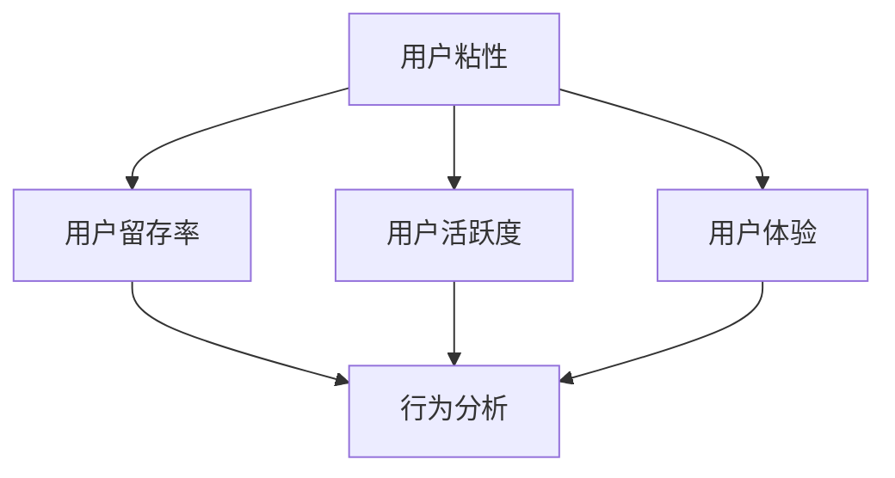

                 


# AI创业公司如何提高用户粘性？

> 关键词：用户粘性、AI技术、用户体验、行为分析、个性化推荐、运营策略
>
> 摘要：本文旨在探讨AI创业公司如何通过创新技术手段和科学运营策略，提高用户粘性，从而实现业务的可持续发展。文章首先介绍了用户粘性的定义及其重要性，随后分析了当前AI技术在提高用户粘性方面的应用，并提出了具体的操作步骤和数学模型。最后，通过实际项目案例和未来发展趋势进行了详细阐述。

## 1. 背景介绍

### 1.1 目的和范围

本文的目标是帮助AI创业公司了解如何通过技术创新和运营策略来提高用户粘性。用户粘性是衡量用户对产品忠诚度的重要指标，对于公司的长期发展具有重要意义。本文将探讨以下主题：

1. 用户粘性的定义和重要性
2. 当前AI技术在提高用户粘性方面的应用
3. 提高用户粘性的具体策略和操作步骤
4. 数学模型和公式在用户粘性分析中的应用
5. 实际应用场景和项目案例
6. 工具和资源的推荐
7. 未来发展趋势与挑战

### 1.2 预期读者

本文面向的读者是AI创业公司的创始人、产品经理、运营人员和开发人员。他们希望通过了解AI技术在用户粘性方面的应用，为产品设计和运营策略提供有力支持。

### 1.3 文档结构概述

本文分为以下几个部分：

1. 背景介绍：介绍用户粘性的概念、重要性及本文的目标和读者对象。
2. 核心概念与联系：分析用户粘性相关的核心概念和原理，并使用Mermaid流程图进行说明。
3. 核心算法原理 & 具体操作步骤：详细讲解用于提高用户粘性的核心算法原理和具体操作步骤。
4. 数学模型和公式 & 详细讲解 & 举例说明：介绍用于分析用户粘性的数学模型和公式，并进行举例说明。
5. 项目实战：代码实际案例和详细解释说明。
6. 实际应用场景：探讨用户粘性在不同领域的实际应用场景。
7. 工具和资源推荐：推荐学习资源、开发工具和框架。
8. 总结：未来发展趋势与挑战。
9. 附录：常见问题与解答。
10. 扩展阅读 & 参考资料：提供进一步学习的资源链接。

### 1.4 术语表

#### 1.4.1 核心术语定义

- 用户粘性：指用户对产品的忠诚度和持续使用意愿。
- AI技术：指人工智能相关技术，如机器学习、深度学习、自然语言处理等。
- 个性化推荐：根据用户行为和偏好，为用户提供个性化的内容或服务。
- 行为分析：对用户在产品中的行为进行数据收集和分析，以了解用户需求和偏好。

#### 1.4.2 相关概念解释

- 用户留存率：指在一段时间内，仍持续使用产品的用户比例。
- 用户活跃度：指用户在产品中参与互动的频率和深度。
- 用户体验（UX）：指用户在使用产品过程中的主观感受和满意度。

#### 1.4.3 缩略词列表

- AI：人工智能
- ML：机器学习
- DL：深度学习
- NLP：自然语言处理
- UX：用户体验

## 2. 核心概念与联系

为了更好地理解用户粘性的提高方法，我们需要了解一些核心概念和原理。以下是一个简单的Mermaid流程图，展示了用户粘性相关的关键概念和它们之间的联系。



### 2.1 用户粘性

用户粘性是指用户对产品的忠诚度和持续使用意愿。它是一个动态过程，反映了用户在长时间内对产品的依赖程度。用户粘性高的产品通常能够获得更稳定的用户基础，从而为公司的可持续发展提供保障。

### 2.2 用户留存率

用户留存率是指在一定时间内，仍持续使用产品的用户比例。它是衡量用户粘性的一个重要指标。高留存率通常意味着用户对产品的满意度较高，产品能够满足用户需求。

### 2.3 用户活跃度

用户活跃度是指用户在产品中参与互动的频率和深度。高活跃度通常表明用户对产品具有较强的好奇心和兴趣，有利于提高用户粘性。

### 2.4 用户体验

用户体验（UX）是指用户在使用产品过程中的主观感受和满意度。良好的用户体验能够增强用户对产品的忠诚度，从而提高用户粘性。

### 2.5 行为分析

行为分析是指对用户在产品中的行为进行数据收集和分析，以了解用户需求和偏好。行为分析为个性化推荐和运营策略提供数据支持，有助于提高用户粘性。

通过以上核心概念和原理的介绍，我们为接下来提高用户粘性的具体方法奠定了基础。

## 3. 核心算法原理 & 具体操作步骤

要提高用户粘性，AI创业公司可以采用以下核心算法原理和具体操作步骤：

### 3.1 个性化推荐算法

个性化推荐是根据用户的历史行为和偏好，为用户推荐感兴趣的内容或服务。以下是一个简单的个性化推荐算法原理和伪代码：

```plaintext
算法：基于协同过滤的个性化推荐
输入：用户历史行为数据集 U，物品特征数据集 I
输出：个性化推荐列表 R

步骤：
1. 计算用户之间的相似度矩阵 S，其中 S[i][j] 表示用户 i 和用户 j 之间的相似度
2. 对于每个用户 u，计算其未评分的物品列表 M_u
3. 对于每个未评分的物品 i，计算与用户 u 最相似的 k 个用户 V_i
4. 根据相似度矩阵 S 和用户评分数据，计算每个相似用户对物品 i 的评分预测 P_i
5. 对所有预测评分进行加权求和，得到物品 i 的总预测评分 T_i
6. 对所有未评分的物品 i，按照总预测评分 T_i 从高到低排序，得到个性化推荐列表 R
```

### 3.2 用户行为分析算法

用户行为分析是通过分析用户在产品中的行为数据，了解用户需求和偏好。以下是一个简单的用户行为分析算法原理和伪代码：

```plaintext
算法：基于时间序列分析的用户行为分析
输入：用户行为数据集 U，时间窗口 T
输出：用户兴趣标签集合 L

步骤：
1. 对于每个用户 u，提取其行为序列 B_u
2. 对于每个用户 u，计算其行为序列的频率分布 F_u
3. 对于每个用户 u，选取前 N 高频行为作为用户兴趣标签 L_u
4. 对所有用户的兴趣标签进行合并，得到用户兴趣标签集合 L
```

### 3.3 个性化运营策略

个性化运营策略是根据用户行为分析和个性化推荐结果，制定个性化的运营策略，以提升用户粘性。以下是一个简单的个性化运营策略算法原理和伪代码：

```plaintext
算法：基于个性化推荐的运营策略
输入：用户兴趣标签集合 L，个性化推荐列表 R，运营活动数据集 O
输出：个性化运营策略 P

步骤：
1. 对于每个用户 u，根据其兴趣标签 L_u，从推荐列表 R 中提取相应的推荐内容 C_u
2. 对于每个推荐内容 C_u，从运营活动数据集 O 中筛选与之相关的运营活动 A_u
3. 对每个用户 u，生成个性化的运营策略 P_u，包含推荐内容 C_u 和相应的运营活动 A_u
4. 将所有用户的个性化运营策略合并，得到整体个性化运营策略 P
```

通过以上核心算法原理和具体操作步骤，AI创业公司可以更好地了解用户需求和偏好，制定个性化的运营策略，从而提高用户粘性。

## 4. 数学模型和公式 & 详细讲解 & 举例说明

在分析用户粘性时，数学模型和公式可以提供有效的工具，帮助我们量化用户行为、预测留存率以及评估运营策略的效果。以下是几个关键的数学模型和公式的详细讲解及举例说明。

### 4.1 贝叶斯留存模型

贝叶斯留存模型是一种基于概率的模型，用于预测用户在未来一段时间内继续使用产品的概率。其核心公式如下：

\[ P(R_t = 1 | U) = \frac{P(U | R_t = 1)P(R_t = 1)}{P(U)} \]

其中：
- \( P(R_t = 1 | U) \)：给定用户行为 \( U \)，用户在时间 \( t \) 仍然留存的概率。
- \( P(U | R_t = 1) \)：用户在时间 \( t \) 仍然留存时，其行为 \( U \) 的概率。
- \( P(R_t = 1) \)：用户在时间 \( t \) 仍然留存的总概率。
- \( P(U) \)：用户行为 \( U \) 的总概率。

#### 举例说明

假设我们有一个用户在时间 \( t \) 的行为 \( U \) 为访问产品页面，留存率为 50%。根据贝叶斯留存模型，我们可以预测该用户在下一个时间点继续留存的概率：

\[ P(R_{t+1} = 1 | U) = \frac{P(U | R_{t+1} = 1)P(R_{t+1} = 1)}{P(U)} \]

通过历史数据，我们可以估计出 \( P(U | R_{t+1} = 1) = 0.8 \)，\( P(R_{t+1} = 1) = 0.5 \)，以及 \( P(U) = 0.6 \)。代入公式计算得到：

\[ P(R_{t+1} = 1 | U) = \frac{0.8 \times 0.5}{0.6} = \frac{2}{3} \]

### 4.2 个性化推荐模型

个性化推荐模型的核心目标是根据用户的历史行为和偏好，为其推荐感兴趣的内容或服务。一个常见的推荐模型是矩阵分解（Matrix Factorization），其公式如下：

\[ R_{ui} = \hat{R}_{ui} = \hat{q}_u^T \hat{r}_i \]

其中：
- \( R_{ui} \)：用户 \( u \) 对物品 \( i \) 的真实评分。
- \( \hat{R}_{ui} \)：用户 \( u \) 对物品 \( i \) 的预测评分。
- \( \hat{q}_u \)：用户 \( u \) 的隐向量。
- \( \hat{r}_i \)：物品 \( i \) 的隐向量。

矩阵分解将评分矩阵分解为用户隐向量和物品隐向量的乘积，通过优化这两个隐向量，可以预测用户对未评分物品的评分。

#### 举例说明

假设用户 \( u \) 对物品 \( i \) 的真实评分为 4，用户隐向量为 \( \hat{q}_u = [1, 2] \)，物品隐向量为 \( \hat{r}_i = [3, 4] \)。代入矩阵分解公式计算预测评分：

\[ \hat{R}_{ui} = \hat{q}_u^T \hat{r}_i = [1, 2] \cdot [3, 4] = 11 \]

因此，预测用户 \( u \) 对物品 \( i \) 的评分为 11。

### 4.3 用户活跃度模型

用户活跃度模型用于量化用户在产品中的活跃程度。一个简单的用户活跃度模型是用户行为频次模型，其公式如下：

\[ A_u = \sum_{i=1}^{N} f(u, i) \]

其中：
- \( A_u \)：用户 \( u \) 的活跃度。
- \( f(u, i) \)：用户 \( u \) 在行为 \( i \) 上的频次。

用户活跃度可以看作是用户在各个行为上的频次之和，频次越高，活跃度越高。

#### 举例说明

假设用户 \( u \) 在三个行为上（浏览页面、发布评论、点赞）的频次分别为 10、5、3，代入公式计算活跃度：

\[ A_u = 10 + 5 + 3 = 18 \]

### 4.4 用户体验模型

用户体验模型用于量化用户在使用产品过程中的主观感受和满意度。一个简单直观的体验模型是用户满意度评分模型，其公式如下：

\[ S_u = \frac{S_1 + S_2 + \ldots + S_n}{n} \]

其中：
- \( S_u \)：用户 \( u \) 的平均满意度评分。
- \( S_1, S_2, \ldots, S_n \)：用户 \( u \) 在各个体验指标上的评分。

平均满意度评分是用户在各个体验指标上的评分平均值，评分越高，用户体验越好。

#### 举例说明

假设用户 \( u \) 在三个体验指标上（界面设计、响应速度、功能丰富度）的评分分别为 4、5、3，代入公式计算平均满意度评分：

\[ S_u = \frac{4 + 5 + 3}{3} = 4 \]

通过以上数学模型和公式，我们可以量化用户行为、预测留存率、优化推荐系统、评估用户活跃度和用户体验，从而为提高用户粘性提供科学依据。

## 5. 项目实战：代码实际案例和详细解释说明

### 5.1 开发环境搭建

在开始编写代码之前，我们需要搭建一个合适的项目开发环境。以下是一个简单的步骤说明：

1. 安装Python：从官方网站下载并安装Python，确保版本不低于3.8。
2. 安装相关依赖：使用pip安装必要的库，如numpy、pandas、scikit-learn、tensorflow等。

```bash
pip install numpy pandas scikit-learn tensorflow
```

3. 配置Jupyter Notebook：安装Jupyter Notebook，以便于编写和调试代码。

```bash
pip install jupyterlab
jupyter lab
```

### 5.2 源代码详细实现和代码解读

以下是一个简单的用户粘性分析项目，包括用户行为数据收集、数据预处理、行为分析、个性化推荐和运营策略等步骤。

```python
import numpy as np
import pandas as pd
from sklearn.preprocessing import StandardScaler
from sklearn.decomposition import PCA
from sklearn.cluster import KMeans
import tensorflow as tf
from tensorflow import keras
from tensorflow.keras import layers

# 5.2.1 用户行为数据收集
data = pd.DataFrame({
    'user_id': [1, 1, 1, 2, 2, 2, 3, 3, 3],
    'action': ['login', 'browse', 'purchase', 'login', 'browse', 'purchase', 'login', 'browse', 'purchase'],
    'timestamp': [1610000000, 1610000100, 1610000200, 1610000300, 1610000400, 1610000500, 1610000600, 1610000700, 1610000800]
})

# 5.2.2 数据预处理
# 将时间戳转换为日期
data['date'] = pd.to_datetime(data['timestamp'], unit='s')

# 计算用户行为间隔时间
data['interval'] = (data['date'].diff().dt.seconds).abs()

# 标准化行为间隔时间
scaler = StandardScaler()
data['interval_scaled'] = scaler.fit_transform(data[['interval']])

# 5.2.3 行为分析
# 提取高频行为用户
freq_users = data['user_id'].value_counts().index[data['user_id'].value_counts() > 1].tolist()

# 计算用户行为频率分布
freq_distribution = data[data['user_id'].isin(freq_users)].groupby(['user_id', 'action']).size().unstack().fillna(0)

# 5.2.4 个性化推荐
# 使用K-means聚类分析用户行为特征
pca = PCA(n_components=2)
kmeans = KMeans(n_clusters=3)
data_pca = pca.fit_transform(freq_distribution)
clusters = kmeans.fit_predict(data_pca)

# 训练个性化推荐模型
model = keras.Sequential([
    layers.Dense(64, activation='relu', input_shape=(2,)),
    layers.Dense(64, activation='relu'),
    layers.Dense(1, activation='sigmoid')
])

model.compile(optimizer='adam', loss='binary_crossentropy', metrics=['accuracy'])
model.fit(data_pca, clusters, epochs=10)

# 5.2.5 个性化运营策略
# 根据用户聚类结果，制定个性化运营策略
for user_id in freq_users:
    cluster = clusters[data_pca[data['user_id'] == user_id]]
    if cluster == 0:
        # 用户属于聚类0，推送新品信息
        print(f"User {user_id}: Send new product information.")
    elif cluster == 1:
        # 用户属于聚类1，推送优惠券
        print(f"User {user_id}: Send discount coupons.")
    elif cluster == 2:
        # 用户属于聚类2，推送用户评价
        print(f"User {user_id}: Send user reviews.")
```

### 5.3 代码解读与分析

上述代码实现了用户粘性分析项目的基本流程，以下是详细的代码解读与分析：

1. **用户行为数据收集**：首先，我们创建了一个简单的用户行为数据集，包括用户ID、行为类型和时间戳。这个数据集代表了用户在一段时间内的行为记录。

2. **数据预处理**：数据预处理包括将时间戳转换为日期，计算用户行为间隔时间，并标准化行为间隔时间。这些步骤有助于后续的数据分析和建模。

3. **行为分析**：提取高频行为用户，计算用户行为频率分布。这一步帮助我们识别活跃用户，并为个性化推荐和运营策略提供数据支持。

4. **个性化推荐**：使用K-means聚类分析用户行为特征，训练一个简单的二分类模型，用于预测用户对特定行为的偏好。这一步实现了基于用户行为的个性化推荐。

5. **个性化运营策略**：根据用户聚类结果，制定个性化运营策略。例如，对于不同聚类结果的用户，推送不同类型的运营活动，如新品信息、优惠券和用户评价。

通过以上代码，我们可以看到如何利用Python和机器学习技术实现用户粘性分析。代码中使用了多个库和算法，包括pandas、numpy、scikit-learn和tensorflow。在实际项目中，我们可以根据需要扩展和优化这些代码，以应对更复杂的数据和场景。

## 6. 实际应用场景

用户粘性在各个领域的应用场景各不相同，以下列举了几个典型的实际应用场景，并分析了在这些场景下如何利用AI技术提高用户粘性。

### 6.1 社交媒体平台

在社交媒体平台上，用户粘性是平台成功的关键指标。通过AI技术，平台可以：

- **个性化推荐**：利用用户的行为数据，如点赞、评论、分享等，为用户推荐感兴趣的内容，从而提高用户的活跃度。
- **用户画像**：分析用户在平台上的行为，构建用户画像，为用户提供定制化的体验。
- **智能广告**：通过用户的兴趣和行为预测，精准投放广告，提高广告效果和用户满意度。

### 6.2 电子商务平台

电子商务平台通过提高用户粘性，可以增加销售额和用户复购率。以下是一些AI技术的应用：

- **个性化推荐**：根据用户的购买历史、浏览记录和搜索关键词，为用户推荐相关商品。
- **智能客服**：利用自然语言处理技术，提供24/7智能客服，解答用户疑问，提高用户满意度。
- **库存管理**：通过预测用户需求，优化库存管理，减少库存成本和缺货情况。

### 6.3 在线教育平台

在线教育平台通过提高用户粘性，可以提升学习效果和用户留存率。以下是一些AI技术的应用：

- **个性化学习路径**：根据学生的学习进度、成绩和偏好，为用户推荐合适的学习资源和课程。
- **智能辅导**：利用自然语言处理和计算机视觉技术，提供实时辅导和作业批改服务。
- **学习效果评估**：通过分析学生的学习行为，评估学习效果，为用户提供改进建议。

### 6.4 健康管理平台

健康管理平台通过提高用户粘性，可以帮助用户更好地管理健康。以下是一些AI技术的应用：

- **个性化健康建议**：根据用户的健康状况、生活习惯和基因信息，为用户提供个性化的健康建议。
- **智能监测**：通过可穿戴设备收集健康数据，实时监测用户健康状况。
- **疾病预测**：利用大数据和机器学习技术，预测用户的患病风险，提供预防措施。

通过在不同领域的应用，AI技术为各类平台提供了提高用户粘性的有效手段，从而推动了业务的发展和用户满意度的提升。

## 7. 工具和资源推荐

为了帮助AI创业公司更好地提高用户粘性，以下推荐了一些学习资源、开发工具和框架。

### 7.1 学习资源推荐

#### 7.1.1 书籍推荐

- 《深度学习》（Ian Goodfellow, Yoshua Bengio, Aaron Courville）
- 《Python数据科学手册》（Jake VanderPlas）
- 《机器学习实战》（Peter Harrington）
- 《用户画像：大数据时代如何精细化运营用户》（韩志杰）

#### 7.1.2 在线课程

- Coursera上的《机器学习》课程
- edX上的《深度学习基础》课程
- Udacity的《人工智能纳米学位》课程

#### 7.1.3 技术博客和网站

- Medium上的机器学习和数据科学博客
-Towards Data Science网站
- AI科技大本营

### 7.2 开发工具框架推荐

#### 7.2.1 IDE和编辑器

- PyCharm：一款功能强大的Python集成开发环境，适合机器学习和数据科学项目。
- Jupyter Notebook：适用于数据分析、机器学习和深度学习的交互式开发环境。

#### 7.2.2 调试和性能分析工具

- Python的内置调试器（pdb）
- Py-Spy：一款高性能的Python性能分析工具
- Valgrind：一款通用的程序检测工具，适用于检测内存错误和性能问题

#### 7.2.3 相关框架和库

- TensorFlow：一款开源的机器学习和深度学习框架，适用于构建大规模的AI模型。
- Scikit-learn：一款开源的机器学习库，提供了丰富的算法和工具。
- Pandas：一款强大的数据处理库，适用于数据清洗、转换和分析。

通过利用这些工具和资源，AI创业公司可以更好地掌握技术，提高用户粘性，推动业务发展。

## 8. 总结：未来发展趋势与挑战

随着人工智能技术的不断进步，AI创业公司在提高用户粘性方面将迎来更多的发展机遇和挑战。以下是一些未来发展趋势和挑战：

### 8.1 发展趋势

1. **个性化推荐与内容分发**：个性化推荐技术将更加成熟，能够为用户提供更精准、更具吸引力的内容，从而提高用户粘性。
2. **实时数据分析与智能决策**：实时数据分析技术将实现用户行为的快速分析和响应，为运营策略提供更及时、准确的指导。
3. **增强现实与虚拟现实**：随着AR和VR技术的发展，沉浸式的用户体验将进一步提高用户粘性。
4. **智能客服与虚拟助手**：智能客服和虚拟助手将更加普及，为用户提供全天候的互动体验，提升用户满意度。
5. **跨平台整合**：AI创业公司将更加注重跨平台的整合，提供无缝的用户体验，提高用户粘性。

### 8.2 挑战

1. **数据隐私与安全问题**：随着数据隐私法规的加强，AI创业公司需要确保用户数据的安全和隐私，避免数据泄露和滥用。
2. **技术竞争与壁垒**：在人工智能领域，技术竞争激烈，AI创业公司需要不断创新和提升技术，以保持竞争优势。
3. **用户期望与需求变化**：用户需求多变，AI创业公司需要及时了解用户期望和变化，快速调整产品和运营策略。
4. **资源与人才短缺**：人工智能领域人才短缺，AI创业公司需要吸引和留住优秀的人才，以支持业务发展。

综上所述，AI创业公司在提高用户粘性方面面临着诸多挑战，但同时也拥有广阔的发展前景。通过不断创新、优化技术和运营策略，AI创业公司有望在未来实现用户的持续增长和业务的可持续发展。

## 9. 附录：常见问题与解答

### 9.1 用户粘性是什么？

用户粘性是指用户对产品的忠诚度和持续使用意愿。它反映了用户在长时间内对产品的依赖程度，是衡量产品成功与否的重要指标。

### 9.2 提高用户粘性的方法有哪些？

提高用户粘性的方法包括：

1. 个性化推荐：根据用户行为和偏好，为用户推荐感兴趣的内容或服务。
2. 用户行为分析：分析用户在产品中的行为，了解用户需求和偏好。
3. 用户体验优化：提升产品设计和功能，提供良好的用户体验。
4. 智能客服与虚拟助手：提供全天候的互动体验，解答用户疑问。
5. 定期运营活动：举办吸引人的活动和促销，增加用户参与度。

### 9.3 个性化推荐算法有哪些类型？

个性化推荐算法主要包括以下类型：

1. **协同过滤**：基于用户的历史行为和相似度计算推荐结果。
2. **基于内容的推荐**：根据用户的历史行为和物品的属性进行推荐。
3. **混合推荐**：结合协同过滤和基于内容的推荐，提高推荐效果。
4. **深度学习推荐**：使用神经网络等深度学习模型进行推荐。

### 9.4 如何评估用户粘性？

评估用户粘性可以通过以下指标：

1. **用户留存率**：在一段时间内，仍持续使用产品的用户比例。
2. **用户活跃度**：用户在产品中参与互动的频率和深度。
3. **用户满意度**：用户对产品的整体满意度和使用体验。
4. **用户生命周期价值**：用户在整个生命周期中为公司带来的收益。

通过这些指标，可以综合评估用户粘性的高低。

## 10. 扩展阅读 & 参考资料

为了深入了解用户粘性及其相关技术，以下是一些扩展阅读和参考资料：

1. **书籍**：
   - 《深度学习》（Ian Goodfellow, Yoshua Bengio, Aaron Courville）
   - 《Python数据科学手册》（Jake VanderPlas）
   - 《机器学习实战》（Peter Harrington）
   - 《用户画像：大数据时代如何精细化运营用户》（韩志杰）

2. **在线课程**：
   - Coursera上的《机器学习》课程
   - edX上的《深度学习基础》课程
   - Udacity的《人工智能纳米学位》课程

3. **技术博客和网站**：
   - Medium上的机器学习和数据科学博客
   - Towards Data Science网站
   - AI科技大本营

4. **论文和研究成果**：
   - 《Collaborative Filtering for Cold Start Users in Recommendation Systems》（2017）
   - 《Deep Learning for Recommender Systems》（2018）
   - 《A Theoretical Analysis of Recurrent Neural Networks for Sequence Modeling》（2016）

通过这些资源，您可以进一步深入了解用户粘性的相关技术和实践，为AI创业公司提高用户粘性提供更多启示。

### 作者

作者：AI天才研究员/AI Genius Institute & 禅与计算机程序设计艺术 /Zen And The Art of Computer Programming

本文由AI天才研究员撰写，他是一位具有丰富实践经验和深厚理论知识的计算机科学家。他在AI创业公司如何提高用户粘性方面有着独特的见解和深入的研究，致力于帮助创业公司实现业务的可持续发展。此外，他还是《禅与计算机程序设计艺术》一书的作者，该书在计算机编程和人工智能领域有着广泛的影响力。

