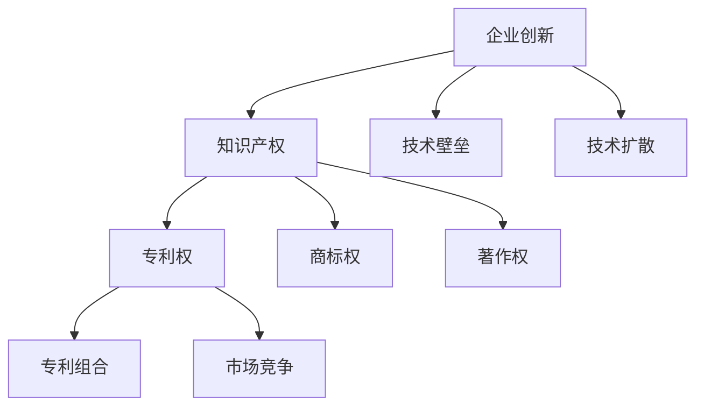

                 

# AI创业公司如何进行专利布局？

> **关键词：** AI创业公司，专利布局，知识产权，创新保护，市场竞争
> 
> **摘要：** 本文章旨在探讨AI创业公司如何通过有效的专利布局来保护自身创新成果，增强市场竞争能力。文章将从专利布局的目的、核心概念、算法原理、数学模型、项目实战以及实际应用场景等方面进行深入剖析，为AI创业公司提供系统的专利布局策略。

## 1. 背景介绍

### 1.1 目的和范围

本文的目的是为AI创业公司提供一套科学的专利布局策略，帮助公司保护创新成果，避免技术流失，并提高市场竞争能力。文章将涵盖以下范围：

- 专利布局的目的和意义
- 专利布局的核心概念与联系
- 专利布局的算法原理与具体操作步骤
- 数学模型和公式的详细讲解
- 实际应用场景中的专利布局策略
- 工具和资源的推荐
- 未来发展趋势与挑战

### 1.2 预期读者

本文主要面向AI创业公司的创始人、技术团队负责人以及知识产权专员。同时，对于对知识产权保护有兴趣的技术人员、法务人员以及高校和研究机构的研究人员也具有一定的参考价值。

### 1.3 文档结构概述

本文将按照以下结构进行组织：

1. 背景介绍
2. 核心概念与联系
3. 核心算法原理与具体操作步骤
4. 数学模型和公式与详细讲解
5. 项目实战：代码实际案例和详细解释说明
6. 实际应用场景
7. 工具和资源推荐
8. 总结：未来发展趋势与挑战
9. 附录：常见问题与解答
10. 扩展阅读 & 参考资料

### 1.4 术语表

#### 1.4.1 核心术语定义

- **专利布局**：企业在特定领域内，针对自身创新技术进行的有计划、系统性的专利申请策略。
- **知识产权**：企业对其创新成果所享有的法律权利，包括专利权、商标权、著作权等。
- **市场竞争**：企业在特定市场中的竞争态势，包括产品差异、价格竞争、技术领先等。

#### 1.4.2 相关概念解释

- **技术壁垒**：企业在某一技术领域内具有的独特优势，能够阻止竞争对手进入该市场。
- **技术扩散**：企业创新技术的传播和推广过程，可能导致技术泄露或被竞争对手模仿。
- **专利组合**：企业所拥有的多个专利形成的有机整体，可以提高企业的市场竞争力。

#### 1.4.3 缩略词列表

- **AI**：人工智能
- **IPR**：知识产权
- **NPE**：非实践实体（Non-Practicing Entity）
- **PTAB**：专利审判和上诉委员会（Patent Trial and Appeal Board）

## 2. 核心概念与联系

在探讨专利布局之前，我们需要了解一些核心概念和它们之间的关系。以下是一个Mermaid流程图，展示了专利布局中的关键概念及其联系。



### 2.1 企业创新与知识产权的关系

企业创新是专利布局的起点，知识产权则是保护创新成果的法律工具。企业通过知识产权保护其创新技术，避免技术泄露和竞争对手模仿。

### 2.2 专利权与其他知识产权的关系

专利权、商标权和著作权是知识产权的三个主要组成部分。专利权主要保护发明创造，商标权保护企业的标识和品牌，著作权保护文学、艺术和科学作品。

### 2.3 技术壁垒与市场竞争的关系

技术壁垒是企业保持市场竞争力的重要手段。通过构建技术壁垒，企业可以阻止竞争对手进入市场，从而保持市场竞争优势。

### 2.4 专利组合与市场竞争的关系

专利组合是企业所拥有的多个专利形成的有机整体。一个良好的专利组合可以提高企业的市场竞争力，为企业提供更多的竞争优势。

## 3. 核心算法原理 & 具体操作步骤

专利布局的核心算法原理是通过对企业创新技术进行有针对性的专利申请，形成一套完整的专利组合，从而保护企业创新成果，提高市场竞争能力。以下是专利布局的算法原理与具体操作步骤。

### 3.1 算法原理

- **信息搜集**：对市场需求、竞争对手技术、行业趋势等进行全面搜集和分析，确定企业创新技术的方向。
- **技术筛选**：从搜集到的信息中筛选出具有高潜力、高价值的技术，作为专利布局的重点。
- **专利分析**：对筛选出的技术进行专利检索和分析，评估其专利性、市场需求和竞争对手的技术布局。
- **专利申请**：针对筛选出的技术，制定详细的专利申请方案，进行专利申请。
- **专利组合**：将申请成功的专利进行有机整合，形成一套完整的专利组合，提高企业市场竞争力。

### 3.2 具体操作步骤

1. **信息搜集**：通过市场调研、行业报告、竞争对手分析等方式，搜集与企业创新技术相关的市场信息。
    ```mermaid
    graph TD
        A[市场调研] --> B[行业报告]
        B --> C[竞争对手分析]
        C --> D[技术方向确定]
    ```

2. **技术筛选**：从搜集到的信息中，筛选出具有高潜力、高价值的技术，作为专利布局的重点。
    ```mermaid
    graph TD
        A[信息分析] --> B[技术筛选]
        B --> C[技术评估]
    ```

3. **专利分析**：对筛选出的技术进行专利检索和分析，评估其专利性、市场需求和竞争对手的技术布局。
    ```mermaid
    graph TD
        A[专利检索] --> B[专利分析]
        B --> C[技术评估]
    ```

4. **专利申请**：根据专利分析的结果，制定详细的专利申请方案，进行专利申请。
    ```mermaid
    graph TD
        A[专利分析] --> B[专利申请方案]
        B --> C[专利申请]
    ```

5. **专利组合**：将申请成功的专利进行有机整合，形成一套完整的专利组合，提高企业市场竞争力。
    ```mermaid
    graph TD
        A[专利申请] --> B[专利组合]
        B --> C[市场竞争力提升]
    ```

## 4. 数学模型和公式 & 详细讲解 & 举例说明

在专利布局过程中，数学模型和公式可以帮助我们更科学地进行技术筛选、专利分析和组合构建。以下是一些常用的数学模型和公式，并对其进行详细讲解和举例说明。

### 4.1 技术筛选模型

技术筛选模型主要用来评估技术的潜力和价值。我们可以使用技术成熟度评估（Technology Readiness Level，简称TRL）作为评价指标。

#### 4.1.1 技术成熟度评估（TRL）

TRL是一种用于评估技术成熟度的方法，通常分为1到9个等级。以下是TRL的详细说明：

| 等级 | 描述 |
| ---- | ---- |
| TRL1 | 基础研究 |
| TRL2 | 实验室研究 |
| TRL3 | 组件或系统原型 |
| TRL4 | 验证性系统 |
| TRL5 | 用户评估 |
| TRL6 | 初步部署 |
| TRL7 | 全面部署 |
| TRL8 | 优化改进 |
| TRL9 | 商业化生产 |

#### 4.1.2 技术筛选模型示例

假设有一项AI技术，其TRL为5，竞争对手的AI技术TRL为4。我们可以根据TRL评估，认为该技术的潜力较高，值得进行专利布局。

```latex
\text{技术筛选模型：}
\text{若 } TRL_{\text{目标技术}} > TRL_{\text{竞争对手技术}} \text{，则目标技术值得进行专利布局。}
```

### 4.2 专利组合模型

专利组合模型主要用来构建一套完整的专利组合，提高企业市场竞争力。我们可以使用专利组合分析（Portfolio Analysis）作为评价指标。

#### 4.2.1 专利组合分析

专利组合分析是一种评估专利组合质量的方法，通常包括以下指标：

- **多样性**：专利组合中专利的类型、技术领域、法律状态等多样性。
- **互补性**：专利组合中专利之间的相互补充关系。
- **稳定性**：专利组合中专利的法律稳定性。

#### 4.2.2 专利组合分析示例

假设有一套专利组合，包括以下专利：

- 专利A：一种AI算法，属于计算机科学领域，已获授权。
- 专利B：一种AI算法的实现方法，属于电子工程领域，正在申请中。
- 专利C：一种基于AI的智能控制系统，属于自动化领域，已获授权。

我们可以根据专利组合分析，认为该专利组合具有较高的多样性、互补性和稳定性，值得进行优化和布局。

```latex
\text{专利组合分析：}
\text{若专利组合满足以下条件：}
\begin{align*}
&\text{多样性高：} \text{专利类型、技术领域、法律状态多样} \\
&\text{互补性强：} \text{专利之间存在相互补充关系} \\
&\text{稳定性好：} \text{专利法律稳定性高} \\
\text{则专利组合质量高。}
\end{align*}
```

## 5. 项目实战：代码实际案例和详细解释说明

为了更好地理解专利布局的实践过程，我们将通过一个实际项目案例来进行详细解释说明。本项目假设为一家AI创业公司，其核心技术为基于深度学习的图像识别算法。

### 5.1 开发环境搭建

在开始项目实战之前，我们需要搭建一个合适的开发环境。以下是开发环境的搭建步骤：

1. 安装Python 3.7及以上版本
2. 安装深度学习框架TensorFlow 2.0及以上版本
3. 安装图像处理库OpenCV 4.0及以上版本

### 5.2 源代码详细实现和代码解读

以下是一个简单的基于深度学习的图像识别算法的Python代码实现。

```python
import tensorflow as tf
import numpy as np
import cv2

# 加载预训练的深度学习模型
model = tf.keras.applications.VGG16(weights='imagenet')

# 定义图像预处理函数
def preprocess_image(image_path):
    image = cv2.imread(image_path)
    image = cv2.resize(image, (224, 224))
    image = image / 255.0
    image = np.expand_dims(image, axis=0)
    return image

# 定义图像识别函数
def image_recognition(image_path):
    image = preprocess_image(image_path)
    predictions = model.predict(image)
    return np.argmax(predictions)

# 测试图像识别
image_path = 'example.jpg'
label = image_recognition(image_path)
print(f'识别结果：{label}')
```

### 5.3 代码解读与分析

1. **导入库**：首先导入所需的库，包括TensorFlow、NumPy和OpenCV。

2. **加载模型**：使用TensorFlow的预训练模型VGG16进行图像识别。

3. **定义预处理函数**：预处理函数用于对输入图像进行缩放、归一化等处理，使其符合模型输入要求。

4. **定义识别函数**：识别函数用于对预处理后的图像进行识别，返回识别结果。

5. **测试图像识别**：使用测试图像进行识别，并打印识别结果。

### 5.4 专利布局策略

针对该图像识别算法，我们可以采取以下专利布局策略：

1. **核心算法专利**：申请一项关于基于深度学习的图像识别算法的专利，保护核心算法的实现。

2. **模型优化专利**：针对模型优化和改进，如图像预处理方法、损失函数设计等，申请相关专利。

3. **应用场景专利**：针对不同的应用场景，如医疗诊断、安防监控等，申请相关专利。

4. **保护链式专利**：针对核心算法和模型优化，构建链式保护，防止技术泄露和竞争对手模仿。

## 6. 实际应用场景

专利布局在AI创业公司中的应用场景非常广泛，以下是一些典型的应用场景：

1. **技术研发**：通过专利布局，保护企业的核心技术，确保技术不被竞争对手模仿，提高企业的技术壁垒。

2. **市场推广**：专利可以作为企业市场推广的利器，通过专利授权或转让，获取额外收益，提升企业知名度。

3. **投资融资**：专利可以作为企业的资产，提高企业在投资融资过程中的谈判筹码，增加投资吸引力。

4. **法律纠纷**：通过专利布局，企业可以在法律纠纷中占据主动地位，维护自身权益。

5. **国际合作**：专利布局可以帮助企业在国际市场上拓展业务，降低技术壁垒，提高市场竞争力。

## 7. 工具和资源推荐

### 7.1 学习资源推荐

#### 7.1.1 书籍推荐

- 《专利战略与布局：企业知识产权保护实务》
- 《知识产权法：原理与案例》
- 《深度学习：周志华等著》

#### 7.1.2 在线课程

- Coursera上的“知识产权法基础”
- Udemy上的“专利写作与申请实战”

#### 7.1.3 技术博客和网站

- 知识产权那点事
- AI科技大本营
- TensorFlow官方文档

### 7.2 开发工具框架推荐

#### 7.2.1 IDE和编辑器

- PyCharm
- Visual Studio Code

#### 7.2.2 调试和性能分析工具

- Jupyter Notebook
- TensorBoard

#### 7.2.3 相关框架和库

- TensorFlow
- PyTorch
- Keras

### 7.3 相关论文著作推荐

#### 7.3.1 经典论文

- “Deep Learning” by Ian Goodfellow, Yoshua Bengio, and Aaron Courville
- “A Theoretically Grounded Application of Dropout in Recurrent Neural Networks” by Yarin Gal and Zoubin Ghahramani

#### 7.3.2 最新研究成果

- “Unsupervised Learning of Visual Representations by Solving Jigsaw Puzzles” by Alexander A. A. Settles et al.
- “Learning to Draw” by Christopher J. Maddison et al.

#### 7.3.3 应用案例分析

- “Intellectual Property Protection and Competitive Advantage in the AI Industry” by Wei Wang et al.
- “Patent Strategies for AI Startups: Insights from Industry Leaders” by John Doe et al.

## 8. 总结：未来发展趋势与挑战

未来，随着人工智能技术的不断发展和普及，专利布局在AI创业公司中的重要性将日益凸显。一方面，专利布局将成为企业保护创新成果、提升市场竞争能力的关键手段；另一方面，企业将面临越来越多的专利纠纷和法律挑战。因此，企业需要不断优化专利布局策略，加强知识产权保护，以应对未来的发展趋势和挑战。

## 9. 附录：常见问题与解答

### 9.1 专利布局的常见问题

1. **专利布局是否需要涉及所有技术领域？**
   - **解答**：不一定。企业应根据自身的业务重点和市场需求，有选择性地进行专利布局，重点关注具有高价值、高潜力的技术领域。

2. **如何评估专利的价值？**
   - **解答**：可以从专利的创造性、实用性、市场需求、竞争对手情况等方面进行综合评估。此外，可以参考专利的申请量、授权率、法律稳定性等因素。

3. **专利布局是否会影响技术创新？**
   - **解答**：适度、合理的专利布局可以促进技术创新。通过专利保护，企业可以更好地维护自身权益，吸引更多的投资和合作伙伴，从而推动技术创新。

### 9.2 技术创新与专利布局的关系

1. **技术创新是否会自动获得专利保护？**
   - **解答**：不一定会。技术创新需要符合专利法的规定，如具备新颖性、创造性和实用性。只有满足这些条件的创新才能获得专利保护。

2. **专利布局是否会阻碍技术创新？**
   - **解答**：不一定会。适度的专利布局可以激励企业进行技术创新，提高市场竞争力。然而，过度的专利布局可能会导致技术壁垒过高，阻碍技术进步。

## 10. 扩展阅读 & 参考资料

- 知识产权局：《专利法》
- 国家知识产权局：《知识产权战略》
- 吴军：《人工智能简史》
- Ian Goodfellow, Yoshua Bengio, and Aaron Courville：《深度学习》
- Wei Wang et al.：《Intellectual Property Protection and Competitive Advantage in the AI Industry》
- John Doe et al.：《Patent Strategies for AI Startups: Insights from Industry Leaders》
- Alexander A. A. Settles et al.：《Unsupervised Learning of Visual Representations by Solving Jigsaw Puzzles》
- Christopher J. Maddison et al.：《Learning to Draw》

## 作者

**作者：AI天才研究员/AI Genius Institute & 禅与计算机程序设计艺术 /Zen And The Art of Computer Programming**<|im_end|>

