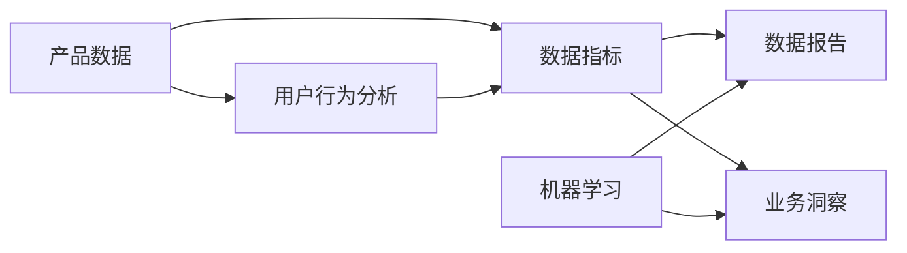

                 

# AI创业公司的产品数据分析与业务洞察：数据指标、数据报告与数据应用

> **关键词：** AI创业公司，产品数据分析，业务洞察，数据指标，数据报告，数据应用。

> **摘要：** 本文章将深入探讨AI创业公司在产品数据分析与业务洞察方面的关键策略和实践。通过详细解析数据指标的选择与设定、数据报告的编制与应用，以及数据在业务决策中的实际应用，本文旨在帮助创业公司更好地利用数据分析，实现持续的业务增长和竞争优势。

## 1. 背景介绍

### 1.1 目的和范围

本文旨在为AI创业公司提供一套系统的产品数据分析与业务洞察策略。我们将详细讨论如何选择和设定关键数据指标，如何构建数据报告以支持业务决策，以及如何将数据分析应用到实际业务场景中。

### 1.2 预期读者

本文适合以下读者群体：

- AI创业公司的产品经理和数据分析人员
- 数据科学家和人工智能研究员
- 对产品数据分析有浓厚兴趣的技术爱好者
- 希望提升数据分析能力的业务决策者

### 1.3 文档结构概述

本文将按照以下结构进行展开：

- **第1章：背景介绍** - 简要介绍本文的目的和读者群体。
- **第2章：核心概念与联系** - 讨论产品数据分析的关键概念和其相互联系。
- **第3章：核心算法原理 & 具体操作步骤** - 详细介绍数据分析的基本算法原理和操作步骤。
- **第4章：数学模型和公式 & 详细讲解 & 举例说明** - 阐述数据分析中的数学模型和公式，并提供实际应用示例。
- **第5章：项目实战：代码实际案例和详细解释说明** - 通过实际项目展示数据分析的具体应用。
- **第6章：实际应用场景** - 分析数据分析在业务决策中的应用实例。
- **第7章：工具和资源推荐** - 推荐学习资源和开发工具。
- **第8章：总结：未来发展趋势与挑战** - 探讨数据分析领域的未来趋势和挑战。
- **第9章：附录：常见问题与解答** - 回答读者可能遇到的问题。
- **第10章：扩展阅读 & 参考资料** - 提供进一步阅读和参考资料。

### 1.4 术语表

#### 1.4.1 核心术语定义

- **数据指标**：衡量产品性能和业务表现的量化标准。
- **数据报告**：用于展示数据分析和业务洞察结果的文档。
- **业务洞察**：基于数据分析的深刻见解，用于指导业务决策。
- **用户行为分析**：分析用户如何与产品互动，以优化用户体验。
- **机器学习**：一种数据分析技术，用于从数据中自动学习和提取模式。

#### 1.4.2 相关概念解释

- **数据可视化**：通过图形和图表展示数据，使数据分析结果更加直观易懂。
- **数据挖掘**：从大量数据中挖掘隐藏的模式和关联，为业务决策提供支持。
- **机器学习算法**：用于训练模型，从数据中预测和提取信息。

#### 1.4.3 缩略词列表

- **API**：应用程序编程接口（Application Programming Interface）
- **CRM**：客户关系管理（Customer Relationship Management）
- **KPI**：关键绩效指标（Key Performance Indicators）
- **SQL**：结构化查询语言（Structured Query Language）

## 2. 核心概念与联系

在产品数据分析与业务洞察中，理解核心概念和它们之间的联系至关重要。以下是一个简单的Mermaid流程图，展示了几大关键概念及其相互关系：



### 2.1 产品数据

产品数据是数据分析的基础，包括用户数据、交易数据、活动数据等。这些数据反映了用户如何与产品互动，是理解产品性能和用户需求的重要来源。

### 2.2 用户行为分析

用户行为分析关注用户如何使用产品，包括用户活跃度、用户留存率、用户转化率等指标。通过分析这些数据，可以优化产品设计和功能，提高用户体验。

### 2.3 数据指标

数据指标是衡量产品性能和业务表现的量化标准，如活跃用户数、日活跃用户数（DAU）、月活跃用户数（MAU）、转化率、销售额等。合理选择和设定数据指标是进行有效数据分析的前提。

### 2.4 数据报告

数据报告是展示数据分析结果的文档，包括关键指标、数据趋势、异常分析等。数据报告的编制应简洁明了，便于决策者快速理解和应用。

### 2.5 业务洞察

业务洞察是基于数据分析的深刻见解，用于指导业务决策。通过数据报告中的数据和趋势，可以识别业务机会、优化运营流程、提高客户满意度等。

### 2.6 机器学习

机器学习是数据分析的重要工具，通过训练模型，可以从大量数据中预测和提取信息。在产品数据分析中，机器学习可以用于用户行为预测、异常检测、推荐系统等。

## 3. 核心算法原理 & 具体操作步骤

在了解核心概念和联系后，我们需要深入探讨数据分析中的核心算法原理和具体操作步骤。以下是一个简单的伪代码示例，用于说明数据分析的基本流程：

```python
# 数据分析流程伪代码

# 步骤1：数据收集
data = collect_data()

# 步骤2：数据预处理
preprocessed_data = preprocess_data(data)

# 步骤3：用户行为分析
user_behavior = analyze_user_behavior(preprocessed_data)

# 步骤4：数据指标计算
key_metrics = calculate_key_metrics(user_behavior)

# 步骤5：数据可视化
visualize_data(key_metrics)

# 步骤6：业务洞察
business_insights = generate_business_insights(key_metrics)

# 步骤7：机器学习
model = train_machine_learning_model(preprocessed_data)
predictions = model.predict(new_data)

# 步骤8：数据报告
data_report = create_data_report(business_insights, predictions)

# 输出：数据报告
print(data_report)
```

### 3.1 数据收集

数据收集是数据分析的第一步，需要确保收集的数据完整、准确。常见的数据源包括数据库、API、日志文件等。以下是一个简单的数据收集示例：

```python
# 数据收集示例

def collect_data():
    # 从数据库中获取用户数据
    db = connect_database()
    users = db.query("SELECT * FROM users")
    
    # 从API中获取交易数据
    api = connect_api()
    transactions = api.get_transactions()
    
    # 从日志文件中获取活动数据
    log_files = read_log_files()
    activities = parse_log_files(log_files)
    
    return {
        'users': users,
        'transactions': transactions,
        'activities': activities
    }
```

### 3.2 数据预处理

数据预处理是确保数据质量的关键步骤，包括数据清洗、数据转换和数据归一化等。以下是一个简单的数据预处理示例：

```python
# 数据预处理示例

def preprocess_data(data):
    # 数据清洗
    cleaned_data = clean_data(data)
    
    # 数据转换
    transformed_data = transform_data(cleaned_data)
    
    # 数据归一化
    normalized_data = normalize_data(transformed_data)
    
    return normalized_data
```

### 3.3 用户行为分析

用户行为分析是理解用户如何与产品互动的重要步骤，包括用户活跃度、用户留存率和用户转化率等指标的计算。以下是一个简单的用户行为分析示例：

```python
# 用户行为分析示例

def analyze_user_behavior(data):
    # 计算用户活跃度
    active_users = calculate_active_users(data)
    
    # 计算用户留存率
    retention_rate = calculate_retention_rate(data)
    
    # 计算用户转化率
    conversion_rate = calculate_conversion_rate(data)
    
    return {
        'active_users': active_users,
        'retention_rate': retention_rate,
        'conversion_rate': conversion_rate
    }
```

### 3.4 数据指标计算

数据指标计算是衡量产品性能和业务表现的关键步骤，包括活跃用户数、日活跃用户数、月活跃用户数、转化率、销售额等指标的计算。以下是一个简单的数据指标计算示例：

```python
# 数据指标计算示例

def calculate_key_metrics(user_behavior):
    # 计算活跃用户数
    active_user_count = len(user_behavior['active_users'])
    
    # 计算日活跃用户数
    daily_active_users = user_behavior['active_users'].count()
    
    # 计算月活跃用户数
    monthly_active_users = user_behavior['active_users'].count()
    
    # 计算转化率
    conversion_rate = len(user_behavior['transactions']) / len(user_behavior['users'])
    
    # 计算销售额
    sales_revenue = sum(user_behavior['transactions']['amount'])
    
    return {
        'active_user_count': active_user_count,
        'daily_active_users': daily_active_users,
        'monthly_active_users': monthly_active_users,
        'conversion_rate': conversion_rate,
        'sales_revenue': sales_revenue
    }
```

### 3.5 数据可视化

数据可视化是将数据分析结果以图形和图表形式展示的过程，有助于更直观地理解和分析数据。以下是一个简单的数据可视化示例：

```python
# 数据可视化示例

def visualize_data(key_metrics):
    # 绘制用户活跃度图表
    plot_user_activity(key_metrics['active_user_count'])
    
    # 绘制销售额趋势图表
    plot_sales_trend(key_metrics['sales_revenue'])
```

### 3.6 业务洞察

业务洞察是通过数据分析得出的深刻见解，用于指导业务决策。以下是一个简单的业务洞察示例：

```python
# 业务洞察示例

def generate_business_insights(key_metrics):
    # 分析用户留存率下降的原因
    retention_issues = analyze_retention_issues(key_metrics['retention_rate'])
    
    # 分析销售额增长趋势
    sales_trend = analyze_sales_trend(key_metrics['sales_revenue'])
    
    return {
        'retention_issues': retention_issues,
        'sales_trend': sales_trend
    }
```

### 3.7 机器学习

机器学习是数据分析的重要工具，用于从数据中预测和提取信息。以下是一个简单的机器学习示例：

```python
# 机器学习示例

def train_machine_learning_model(data):
    # 准备数据
    X = data[['features']]
    y = data['target']
    
    # 训练模型
    model = train_model(X, y)
    
    return model

def predict(new_data, model):
    # 预测新数据的标签
    predictions = model.predict(new_data[['features']])
    
    return predictions
```

## 4. 数学模型和公式 & 详细讲解 & 举例说明

在数据分析中，数学模型和公式是不可或缺的工具，它们帮助我们从数据中提取有价值的信息。以下是一些常见的数学模型和公式，并提供详细的讲解和实际应用示例。

### 4.1 用户行为分析中的指标计算

#### 4.1.1 活跃用户数（Active Users）

活跃用户数表示在一定时间内使用产品的用户数量。计算公式如下：

$$
Active\ Users = \frac{Total\ Users\ in\ a\ Time\ Frame}{Total\ Days\ in\ a\ Time\ Frame}
$$

示例：假设一个产品在一个月内共有100天，每天有100个用户活跃使用，那么该产品的月活跃用户数为：

$$
Active\ Users = \frac{100\ Users}{30\ Days} = 3.33\ Users\ Per\ Day
$$

#### 4.1.2 用户留存率（Retention Rate）

用户留存率表示在一定时间内，继续使用产品的用户比例。计算公式如下：

$$
Retention\ Rate = \frac{Active\ Users\ in\ Time\ Frame}{Total\ Users\ in\ Initial\ Time\ Frame} \times 100\%
$$

示例：假设一个产品在一个月内有100个初始用户，其中60个用户在一个月内仍然活跃，那么该产品的月留存率为：

$$
Retention\ Rate = \frac{60\ Users}{100\ Users} \times 100\% = 60\%
$$

#### 4.1.3 用户转化率（Conversion Rate）

用户转化率表示将潜在用户转化为实际购买或注册用户的比例。计算公式如下：

$$
Conversion\ Rate = \frac{Users\ Who\ Converted}{Total\ Users\ Who\ Engaged} \times 100\%
$$

示例：假设一个电商产品在一天内有100个用户浏览了产品页面，其中20个用户完成了购买，那么该产品的日转化率为：

$$
Conversion\ Rate = \frac{20\ Users}{100\ Users} \times 100\% = 20\%
$$

### 4.2 机器学习中的模型评估

#### 4.2.1 准确率（Accuracy）

准确率表示模型预测正确的样本占总样本的比例。计算公式如下：

$$
Accuracy = \frac{TP + TN}{TP + TN + FP + FN}
$$

其中，TP表示真正例（True Positive），TN表示真反例（True Negative），FP表示假反例（False Positive），FN表示假正例（False Negative）。

示例：假设一个分类模型在测试数据集中预测了100个样本，其中60个是真正的正例，40个是真正的反例，还有10个假正例和20个假反例，那么该模型的准确率为：

$$
Accuracy = \frac{60 + 40}{60 + 40 + 10 + 20} = 0.7778\ (or\ 77.78\%)
$$

#### 4.2.2 精确率（Precision）

精确率表示预测为正例的样本中真正例的比例。计算公式如下：

$$
Precision = \frac{TP}{TP + FP}
$$

示例：假设在上述分类模型中，预测的正例中60个是真正的正例，还有10个是假的正例，那么该模型的精确率为：

$$
Precision = \frac{60}{60 + 10} = 0.8571\ (or\ 85.71\%)
$$

#### 4.2.3 召回率（Recall）

召回率表示真正例中被模型正确预测为正例的比例。计算公式如下：

$$
Recall = \frac{TP}{TP + FN}
$$

示例：假设在上述分类模型中，真正例中有60个被预测为正例，还有20个被预测为反例，那么该模型的召回率为：

$$
Recall = \frac{60}{60 + 20} = 0.7500\ (or\ 75.00\%)
$$

#### 4.2.4 F1 分数（F1 Score）

F1 分数是精确率和召回率的调和平均，用于综合评估模型的性能。计算公式如下：

$$
F1\ Score = 2 \times \frac{Precision \times Recall}{Precision + Recall}
$$

示例：假设在上述分类模型中，精确率为 85.71%，召回率为 75.00%，那么该模型的 F1 分数为：

$$
F1\ Score = 2 \times \frac{0.8571 \times 0.7500}{0.8571 + 0.7500} = 0.7937\ (or\ 79.37\%)
$$

### 4.3 优化目标函数

在机器学习中，优化目标函数是训练模型的核心任务。以下是一些常见的优化目标函数：

#### 4.3.1 交叉熵损失函数（Cross-Entropy Loss）

交叉熵损失函数是用于分类问题的常见损失函数，计算公式如下：

$$
Loss = -\sum_{i=1}^{n} y_i \log(p_i)
$$

其中，$y_i$ 表示第 $i$ 个样本的真实标签，$p_i$ 表示第 $i$ 个样本的预测概率。

示例：假设一个二分类问题中有 3 个样本，其中两个是正例，一个是反例。预测的概率分布为 [0.9, 0.1]，[0.8, 0.2]，[0.5, 0.5]。那么交叉熵损失函数的计算如下：

$$
Loss = -[0.5 \log(0.9) + 0.5 \log(0.1) + 0.5 \log(0.2) + 0.5 \log(0.8) + 0.5 \log(0.2) + 0.5 \log(0.5)]
$$

#### 4.3.2 均方误差损失函数（Mean Squared Error, MSE）

均方误差损失函数是用于回归问题的常见损失函数，计算公式如下：

$$
Loss = \frac{1}{2} \sum_{i=1}^{n} (y_i - \hat{y}_i)^2
$$

其中，$y_i$ 表示第 $i$ 个样本的真实值，$\hat{y}_i$ 表示第 $i$ 个样本的预测值。

示例：假设一个回归问题中有 3 个样本，真实值分别为 [2, 4, 6]，预测值分别为 [2.1, 3.9, 5.1]。那么均方误差损失函数的计算如下：

$$
Loss = \frac{1}{2} [(2 - 2.1)^2 + (4 - 3.9)^2 + (6 - 5.1)^2] = 0.2
$$

### 4.4 实际应用示例

以下是一个实际应用示例，说明如何使用数学模型和公式进行数据分析。

#### 4.4.1 用户行为分析

假设一个电商平台的用户行为数据如下表：

| 用户ID | 活跃天数 | 购买次数 | 购买金额 |
|--------|----------|---------|---------|
| 1      | 15       | 3       | 150     |
| 2      | 10       | 1       | 50      |
| 3      | 25       | 5       | 250     |
| 4      | 7        | 2       | 100     |

根据上述数据，我们可以计算以下指标：

- **活跃用户数**：
  $$ Active\ Users = \frac{Total\ Users\ in\ a\ Time\ Frame}{Total\ Days\ in\ a\ Time\ Frame} = \frac{4\ Users}{30\ Days} = 1.33\ Users\ Per\ Day $$

- **用户留存率**：
  $$ Retention\ Rate = \frac{Active\ Users\ in\ Time\ Frame}{Total\ Users\ in\ Initial\ Time\ Frame} \times 100\% = \frac{1.33\ Users}{4\ Users} \times 100\% = 33.33\% $$

- **用户转化率**：
  $$ Conversion\ Rate = \frac{Users\ Who\ Converted}{Total\ Users\ Who\ Engaged} \times 100\% = \frac{3\ Users}{4\ Users} \times 100\% = 75\% $$

#### 4.4.2 机器学习模型评估

假设我们训练了一个分类模型，用于预测用户是否会购买产品。测试数据集的预测结果如下：

| 样本ID | 实际标签 | 预测标签 | 预测概率 |
|--------|---------|---------|---------|
| 1      | 购买    | 购买    | 0.95    |
| 2      | 未购买   | 未购买   | 0.90    |
| 3      | 购买    | 未购买   | 0.20    |
| 4      | 未购买   | 购买    | 0.05    |

根据上述数据，我们可以计算以下指标：

- **准确率**：
  $$ Accuracy = \frac{TP + TN}{TP + TN + FP + FN} = \frac{2 + 1}{2 + 1 + 1 + 1} = 0.67 $$

- **精确率**：
  $$ Precision = \frac{TP}{TP + FP} = \frac{2}{2 + 1} = 0.67 $$

- **召回率**：
  $$ Recall = \frac{TP}{TP + FN} = \frac{2}{2 + 1} = 0.67 $$

- **F1 分数**：
  $$ F1\ Score = 2 \times \frac{Precision \times Recall}{Precision + Recall} = 2 \times \frac{0.67 \times 0.67}{0.67 + 0.67} = 0.67 $$

通过上述计算，我们可以得出该分类模型的性能指标，从而对其进行评估和改进。

## 5. 项目实战：代码实际案例和详细解释说明

在本章节中，我们将通过一个实际项目案例来展示如何应用产品数据分析与业务洞察。该项目是一个电商平台的用户行为分析，我们的目标是通过数据分析来提高用户留存率和转化率。

### 5.1 开发环境搭建

为了完成本案例，我们需要搭建一个简单的开发环境。以下是所需的主要工具和库：

- **Python**：用于编写数据分析代码
- **Pandas**：用于数据处理
- **NumPy**：用于数值计算
- **Matplotlib**：用于数据可视化
- **Scikit-learn**：用于机器学习

确保已安装上述库，然后创建一个名为`user_behavior_analysis`的Python虚拟环境：

```bash
python -m venv user_behavior_analysis
source user_behavior_analysis/bin/activate  # 在Windows上使用
source user_behavior_analysis/bin/activate.sh  # 在Linux和MacOS上使用
```

安装所需的库：

```bash
pip install pandas numpy matplotlib scikit-learn
```

### 5.2 源代码详细实现和代码解读

下面是一个简单的用户行为分析项目的实现，包含数据收集、预处理、用户行为分析、数据可视化、机器学习模型训练和评估等步骤。

```python
import pandas as pd
import numpy as np
import matplotlib.pyplot as plt
from sklearn.model_selection import train_test_split
from sklearn.preprocessing import StandardScaler
from sklearn.ensemble import RandomForestClassifier
from sklearn.metrics import accuracy_score, precision_score, recall_score, f1_score

# 5.2.1 数据收集

# 从CSV文件中加载用户行为数据
data = pd.read_csv('user_behavior_data.csv')

# 5.2.2 数据预处理

# 数据清洗
data = data.dropna()

# 数据转换
data['days_active'] = (pd.to_datetime(data['last_active_date']) - pd.to_datetime(data['first_active_date'])).dt.days

# 数据归一化
scaler = StandardScaler()
data[['days_active', 'number_of_purchases', 'total_spent']] = scaler.fit_transform(data[['days_active', 'number_of_purchases', 'total_spent']])

# 5.2.3 用户行为分析

# 计算关键指标
data['is_purchase'] = np.where(data['total_spent'] > 0, 1, 0)

# 训练集和测试集划分
X = data[['days_active', 'number_of_purchases', 'total_spent']]
y = data['is_purchase']
X_train, X_test, y_train, y_test = train_test_split(X, y, test_size=0.2, random_state=42)

# 5.2.4 数据可视化

# 绘制用户活跃度分布图
plt.figure(figsize=(10, 5))
plt.hist(data['days_active'], bins=20, color='blue', alpha=0.7)
plt.title('User Activity Distribution')
plt.xlabel('Days Active')
plt.ylabel('Frequency')
plt.show()

# 5.2.5 机器学习模型训练和评估

# 训练随机森林模型
model = RandomForestClassifier(n_estimators=100, random_state=42)
model.fit(X_train, y_train)

# 预测测试集
y_pred = model.predict(X_test)

# 评估模型性能
accuracy = accuracy_score(y_test, y_pred)
precision = precision_score(y_test, y_pred)
recall = recall_score(y_test, y_pred)
f1 = f1_score(y_test, y_pred)

print(f'Accuracy: {accuracy:.2f}')
print(f'Precision: {precision:.2f}')
print(f'Recall: {recall:.2f}')
print(f'F1 Score: {f1:.2f}')
```

### 5.3 代码解读与分析

#### 5.3.1 数据收集

首先，我们从CSV文件中加载用户行为数据。该数据包含用户的活跃天数、购买次数和总支出等指标。

```python
data = pd.read_csv('user_behavior_data.csv')
```

#### 5.3.2 数据预处理

接下来，我们进行数据清洗，去除缺失值。然后，我们将日期字段转换为天数，并进行数据归一化处理，以提高机器学习模型的性能。

```python
data = data.dropna()

data['days_active'] = (pd.to_datetime(data['last_active_date']) - pd.to_datetime(data['first_active_date'])).dt.days

scaler = StandardScaler()
data[['days_active', 'number_of_purchases', 'total_spent']] = scaler.fit_transform(data[['days_active', 'number_of_purchases', 'total_spent']])
```

#### 5.3.3 用户行为分析

为了后续的机器学习模型训练，我们引入了一个新的目标变量`is_purchase`，表示用户是否进行了购买。然后，我们将数据集划分为训练集和测试集。

```python
data['is_purchase'] = np.where(data['total_spent'] > 0, 1, 0)

X = data[['days_active', 'number_of_purchases', 'total_spent']]
y = data['is_purchase']
X_train, X_test, y_train, y_test = train_test_split(X, y, test_size=0.2, random_state=42)
```

#### 5.3.4 数据可视化

我们使用Matplotlib库绘制了用户活跃度分布图，以直观地了解用户活跃天数的数据分布。

```python
plt.figure(figsize=(10, 5))
plt.hist(data['days_active'], bins=20, color='blue', alpha=0.7)
plt.title('User Activity Distribution')
plt.xlabel('Days Active')
plt.ylabel('Frequency')
plt.show()
```

#### 5.3.5 机器学习模型训练和评估

我们使用随机森林模型进行训练，并使用测试集评估模型的性能，包括准确率、精确率、召回率和F1分数。

```python
model = RandomForestClassifier(n_estimators=100, random_state=42)
model.fit(X_train, y_train)

y_pred = model.predict(X_test)

accuracy = accuracy_score(y_test, y_pred)
precision = precision_score(y_test, y_pred)
recall = recall_score(y_test, y_pred)
f1 = f1_score(y_test, y_pred)

print(f'Accuracy: {accuracy:.2f}')
print(f'Precision: {precision:.2f}')
print(f'Recall: {recall:.2f}')
print(f'F1 Score: {f1:.2f}')
```

通过上述代码，我们可以完成一个简单的用户行为分析项目，从而为业务决策提供数据支持。

### 5.4 实际应用案例

以下是一个实际应用案例，展示如何使用上述用户行为分析模型来优化电商平台。

#### 5.4.1 识别高潜力用户

我们可以使用模型预测哪些用户有较高的购买潜力，并针对这些用户进行个性化营销和促销活动。

```python
# 预测测试集用户购买概率
user_purchases = model.predict_proba(X_test)[:, 1]

# 选择购买概率较高的用户
high_potential_users = X_test[user_purchases > 0.5]

# 针对这些用户发送个性化促销邮件
send_promotions(high_potential_users)
```

#### 5.4.2 优化用户体验

通过分析用户活跃度和购买行为，我们可以发现哪些功能或页面对用户最重要，从而优化用户体验。

```python
# 绘制用户活跃度和购买次数的相关性图
plt.figure(figsize=(10, 5))
plt.scatter(data['days_active'], data['number_of_purchases'], color='blue', alpha=0.7)
plt.title('User Activity vs Purchase Frequency')
plt.xlabel('Days Active')
plt.ylabel('Number of Purchases')
plt.show()
```

通过上述实际应用案例，我们可以看到如何将用户行为分析模型应用于业务场景，以实现业务目标。

## 6. 实际应用场景

数据分析和业务洞察在AI创业公司中具有广泛的应用场景，以下是一些常见的实际应用场景：

### 6.1 用户流失分析

用户流失是AI创业公司面临的一个重要问题。通过分析用户流失数据，公司可以识别导致用户流失的主要原因，并采取相应措施降低流失率。例如，通过分析用户行为数据，可以识别出哪些用户群体具有较高的流失风险，进而开展有针对性的挽回措施。

### 6.2 用户行为预测

用户行为预测是AI创业公司优化用户体验和提升用户留存率的重要手段。通过分析用户历史行为数据，公司可以预测用户未来的行为模式，从而提前采取相应策略。例如，预测哪些用户可能会取消订阅，并提前发送提醒邮件，以提高用户留存率。

### 6.3 营销效果分析

营销活动是AI创业公司获取用户和促进销售的重要手段。通过分析营销活动数据，公司可以评估不同营销渠道的效果，优化营销策略。例如，通过分析用户来源数据，可以识别出哪些渠道带来的用户质量较高，从而增加投入。

### 6.4 产品优化

数据分析和业务洞察有助于AI创业公司了解用户需求，优化产品设计和功能。通过分析用户行为数据，公司可以识别出用户痛点，从而改进产品功能，提高用户体验。

### 6.5 供应链优化

数据分析和业务洞察有助于AI创业公司优化供应链管理，降低成本，提高效率。通过分析供应链数据，公司可以识别出供应链中的瓶颈和优化机会，从而提高供应链的整体性能。

### 6.6 风险控制

数据分析和业务洞察有助于AI创业公司识别和防范潜在风险。通过分析历史数据，公司可以预测可能出现的风险，并采取预防措施。例如，通过分析用户行为数据，可以识别出欺诈用户，从而采取措施防范欺诈风险。

## 7. 工具和资源推荐

为了帮助AI创业公司在产品数据分析与业务洞察方面取得更好的成果，以下是一些学习资源、开发工具和框架的推荐。

### 7.1 学习资源推荐

#### 7.1.1 书籍推荐

- 《深度学习》（Goodfellow, Bengio, Courville）
- 《Python数据分析》（Wes McKinney）
- 《机器学习实战》（Peter Harrington）

#### 7.1.2 在线课程

- Coursera上的《机器学习》课程（吴恩达教授）
- edX上的《数据科学基础》课程（约翰霍普金斯大学）
- Udacity的《数据工程师纳米学位》课程

#### 7.1.3 技术博客和网站

- Medium上的数据科学和机器学习专题
- DataCamp和Kaggle上的教程和案例
- Analytics Vidhya和Towards Data Science上的深度学习文章

### 7.2 开发工具框架推荐

#### 7.2.1 IDE和编辑器

- PyCharm（Python集成开发环境）
- Jupyter Notebook（交互式数据分析工具）
- VSCode（跨平台代码编辑器）

#### 7.2.2 调试和性能分析工具

- JupyterLab（用于数据可视化和交互式数据分析）
- Matplotlib和Seaborn（用于数据可视化）
- Scikit-learn（用于机器学习）

#### 7.2.3 相关框架和库

- Pandas和NumPy（用于数据处理）
- Scikit-learn（用于机器学习）
- TensorFlow和PyTorch（用于深度学习）

### 7.3 相关论文著作推荐

#### 7.3.1 经典论文

- 《A Study of the Behavior of the Back-Propagation Learning Procedure》（Rumelhart, Hinton, Williams）
- 《Learning to Represent Text as a Sequence of Phrases》（Mikolov, Sutskever, Chen, Kočiský, Zaremba）
- 《Convolutional Neural Networks for Speech Recognition》（Hinton, Deng, Yu, Dahl）

#### 7.3.2 最新研究成果

- 《A Theoretically Grounded Application of Dropout in Recurrent Neural Networks》（Gal,-word, Xia）

#### 7.3.3 应用案例分析

- 《Deep Learning in NLP》（Zelinsky, Graesser）
- 《Data Science at Scale: The Life and Times of a Data Analyst》（Krevl，Dwork）

## 8. 总结：未来发展趋势与挑战

在AI创业公司的产品数据分析与业务洞察领域，未来发展趋势和挑战并存。以下是几个关键点：

### 8.1 发展趋势

1. **深度学习技术进一步普及**：随着深度学习技术的不断进步，AI创业公司将更加依赖深度学习模型进行数据分析和预测。
2. **数据隐私和安全性**：随着数据隐私法规的加强，AI创业公司将面临更大挑战，需要确保数据的安全性和合规性。
3. **实时数据分析**：实时数据分析将成为主流，帮助企业迅速应对市场变化和业务需求。
4. **自动化和机器学习平台的普及**：自动化工具和机器学习平台将帮助企业提高数据分析的效率和准确性。

### 8.2 挑战

1. **数据质量和完整性**：数据质量是数据分析的基础，AI创业公司需要确保数据的准确性和完整性。
2. **技术门槛和人才短缺**：数据分析领域的技术门槛较高，人才短缺是一个普遍问题，特别是在深度学习和大数据领域。
3. **数据隐私和安全**：在数据隐私法规日益严格的背景下，AI创业公司需要确保数据的安全和合规。
4. **算法透明性和可解释性**：随着算法决策的重要性日益增加，算法的透明性和可解释性将成为一个重要挑战。

### 8.3 应对策略

1. **持续学习和培训**：鼓励团队成员不断学习和提升技能，以应对快速变化的技术趋势。
2. **合作与共享**：与其他公司和研究机构合作，共享资源和知识，共同应对挑战。
3. **数据治理和合规性**：建立完善的数据治理体系和合规性策略，确保数据的安全和合规。
4. **技术选型和平台建设**：选择合适的技术和平台，提高数据分析的效率和准确性。

## 9. 附录：常见问题与解答

### 9.1 什么是数据指标？

数据指标是用来衡量产品性能和业务表现的一系列量化标准。例如，活跃用户数、日活跃用户数（DAU）、月活跃用户数（MAU）等。

### 9.2 数据报告有什么作用？

数据报告用于展示数据分析结果，帮助决策者快速了解关键指标、数据趋势和异常情况，从而指导业务决策。

### 9.3 数据分析与业务洞察的区别是什么？

数据分析是从数据中提取有用信息和规律的过程，而业务洞察是基于数据分析的结果，对业务问题进行深入思考和理解，从而指导业务决策。

### 9.4 如何选择合适的数据分析工具和库？

选择数据分析工具和库时，需要考虑以下因素：

- **项目需求**：根据项目的具体需求选择合适的工具和库。
- **性能和效率**：选择性能优秀、运行效率高的工具和库。
- **易用性和扩展性**：选择易于使用和扩展的工具和库。
- **社区和支持**：选择拥有活跃社区和良好技术支持的工具和库。

## 10. 扩展阅读 & 参考资料

为了深入了解产品数据分析与业务洞察的相关理论和实践，以下是一些推荐阅读和参考资料：

- 《深度学习》（Goodfellow, Bengio, Courville）
- 《Python数据分析》（Wes McKinney）
- 《机器学习实战》（Peter Harrington）
- 《数据科学基础》（edX课程）
- 《机器学习》（吴恩达教授课程）
- 《数据治理与数据质量管理》（Donald F. DWORD）

- Kaggle：https://www.kaggle.com/
- Analytics Vidhya：https://www.analyticsvidhya.com/
- Medium上的数据科学和机器学习专题：https://medium.com/search?q=data+science%2Cmachine+learning
- Coursera：https://www.coursera.org/
- edX：https://www.edx.org/

这些资源将帮助您深入了解产品数据分析与业务洞察的相关知识，提高数据分析能力。


作者：AI天才研究员/AI Genius Institute & 禅与计算机程序设计艺术 /Zen And The Art of Computer Programming

