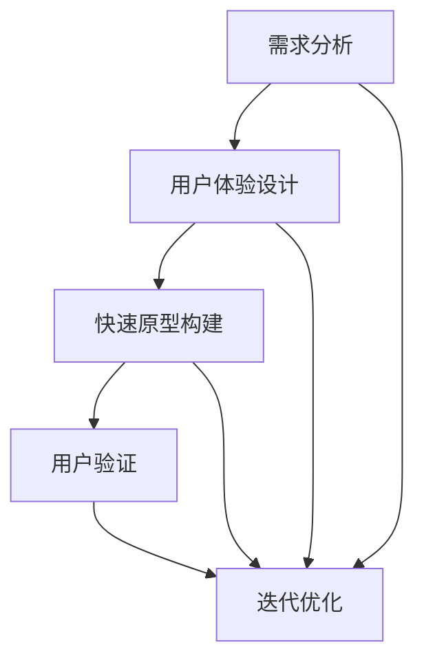

                 

# AI创业公司的产品设计冲刺：需求澄清、快速原型与用户验证

> **关键词**：产品设计、需求澄清、快速原型、用户验证、创业公司

> **摘要**：本文深入探讨了AI创业公司在产品开发过程中的关键阶段——产品设计冲刺。通过详细解析需求澄清、快速原型构建和用户验证的步骤和方法，本文旨在为创业者提供实用的指导，以有效提高产品设计的成功率和市场竞争力。

## 1. 背景介绍

### 1.1 目的和范围

本文的目标是帮助AI创业公司在产品开发过程中，特别是产品设计阶段，更好地应对挑战，提高产品成功上市的概率。我们将重点讨论以下三个核心环节：

1. **需求澄清**：明确用户需求和业务目标，确保产品设计的方向正确。
2. **快速原型构建**：通过迭代和验证，快速构建可交互的原型，以便及时调整和优化产品设计。
3. **用户验证**：通过与真实用户的互动，验证产品的可行性和市场需求，确保产品能够满足用户期望。

### 1.2 预期读者

本文主要面向以下读者群体：

- **AI创业公司创始人**：了解产品设计的最佳实践，以便更好地引领团队进行产品开发。
- **产品经理**：学习如何有效地管理需求澄清、原型构建和用户验证的过程。
- **设计师**：掌握快速原型构建的方法和技巧，提升设计效率。
- **开发者**：理解产品设计的背景和目标，更好地与团队协作，实现产品目标。

### 1.3 文档结构概述

本文将按照以下结构进行阐述：

1. **背景介绍**：介绍本文的目的和预期读者，概述文章结构。
2. **核心概念与联系**：解释产品设计的核心概念，展示相关的Mermaid流程图。
3. **核心算法原理 & 具体操作步骤**：详细介绍需求澄清、快速原型构建和用户验证的步骤和算法。
4. **数学模型和公式 & 详细讲解 & 举例说明**：阐述与产品设计相关的数学模型和公式，并进行实例说明。
5. **项目实战：代码实际案例和详细解释说明**：通过实际项目案例，展示产品设计的全过程。
6. **实际应用场景**：讨论产品设计的应用场景和挑战。
7. **工具和资源推荐**：推荐学习资源、开发工具和框架。
8. **总结：未来发展趋势与挑战**：总结本文要点，展望未来趋势和挑战。
9. **附录：常见问题与解答**：解答读者可能遇到的问题。
10. **扩展阅读 & 参考资料**：提供进一步阅读的资源和参考文献。

### 1.4 术语表

#### 1.4.1 核心术语定义

- **需求澄清**：通过对用户需求的深入分析，明确产品功能、用户体验和业务目标的过程。
- **快速原型**：基于用户需求快速构建的可交互原型，用于验证和迭代产品设计。
- **用户验证**：通过与真实用户互动，评估产品可行性和市场接受度的过程。

#### 1.4.2 相关概念解释

- **用户体验（UX）**：用户在使用产品过程中的感受和体验，包括界面设计、交互逻辑和使用便捷性。
- **用户体验设计（UXD）**：专注于提高用户体验的设计过程，包括需求分析、原型设计、用户测试等。
- **产品经理（PM）**：负责产品规划、设计、开发和管理的人员，确保产品满足用户需求和市场期望。

#### 1.4.3 缩略词列表

- **UXD**：用户体验设计
- **PM**：产品经理
- **AI**：人工智能

## 2. 核心概念与联系

在AI创业公司的产品开发过程中，理解以下核心概念和它们之间的联系至关重要。

### 2.1 需求分析

需求分析是产品设计的起点，它涉及对用户需求的收集、分析和验证。需求分析的目标是明确产品的功能、性能和用户体验要求。

#### 2.1.1 需求收集

需求收集是获取用户需求的初始阶段，可以通过以下方法进行：

- **用户访谈**：直接与目标用户交流，了解他们的需求和痛点。
- **问卷调查**：通过在线问卷收集用户反馈，量化分析需求。
- **用户行为分析**：分析用户在使用现有产品时的行为数据，发现潜在需求。

#### 2.1.2 需求分析

需求分析是对收集到的需求进行整理和分类的过程，关键步骤包括：

- **需求分类**：将需求分为功能需求、性能需求和用户体验需求。
- **优先级排序**：根据业务价值和用户需求，对需求进行优先级排序。
- **需求验证**：通过与用户和团队成员的讨论，验证需求的合理性和可实现性。

### 2.2 用户体验设计

用户体验设计（UXD）是确保产品满足用户需求和期望的关键环节。UXD包括以下步骤：

- **用户画像**：创建用户画像，明确目标用户群体的特征和行为。
- **界面设计**：设计用户界面，确保界面美观、易用。
- **交互设计**：设计用户与产品的交互流程，提高用户体验。
- **原型设计**：构建低/高保真原型，用于演示和测试。

### 2.3 快速原型构建

快速原型构建是在需求分析和用户体验设计的基础上，快速构建可交互的原型，以便及时验证和迭代产品设计的步骤。快速原型构建的关键步骤包括：

- **原型工具选择**：选择合适的原型工具（如Figma、Sketch、Axure等）。
- **界面设计**：设计原型界面，实现界面交互功能。
- **用户测试**：通过用户测试，收集反馈，验证原型设计的合理性。

### 2.4 用户验证

用户验证是评估产品可行性和市场接受度的关键环节。用户验证的关键步骤包括：

- **用户招募**：招募具有代表性的用户参与测试。
- **测试流程**：设计测试流程，确保测试过程标准化。
- **数据收集**：收集用户反馈和行为数据，分析产品性能。
- **迭代优化**：根据用户反馈，优化产品设计和功能。

### 2.5 Mermaid流程图

以下是一个简化的Mermaid流程图，展示产品设计的核心步骤和它们之间的联系：



## 3. 核心算法原理 & 具体操作步骤

### 3.1 需求澄清

需求澄清是产品设计的起点，其核心在于理解用户需求和业务目标，并将其转化为具体的产品功能。以下是需求澄清的核心步骤和算法原理：

#### 3.1.1 需求收集

需求收集的算法原理：

- **用户访谈**：采用半结构化访谈方法，记录用户需求。
- **问卷调查**：设计问题列表，收集用户反馈。

伪代码：

```python
def collect_user需求():
    user需求列表 = []
    for 用户 in 目标用户群体：
        user需求 = conduct_interview(用户)
        user需求列表.append(user需求)
    return user需求列表

def conduct_interview(用户):
    questions = ["您对当前产品的哪些功能最满意？", "您在使用产品时遇到了哪些问题？" ...]
    user需求 = {}
    for question in questions：
        user需求[question] = 用户回答(question)
    return user需求
```

#### 3.1.2 需求分析

需求分析的算法原理：

- **需求分类**：将需求分为功能需求、性能需求和用户体验需求。
- **优先级排序**：根据业务价值和用户需求，对需求进行优先级排序。

伪代码：

```python
def analyze_user需求(user需求列表)：
    functional需求列表 = []
    performance需求列表 = []
    ux需求列表 = []
    for user需求 in user需求列表：
        if user需求["类型"] == "功能"：
            functional需求列表.append(user需求)
        elif user需求["类型"] == "性能"：
            performance需求列表.append(user需求)
        elif user需求["类型"] == "用户体验"：
            ux需求列表.append(user需求)
    sorted需求列表 = sort_by_priority(functional需求列表, performance需求列表, ux需求列表)
    return sorted需求列表

def sort_by_priority(functional需求列表, performance需求列表, ux需求列表)：
    # 使用优先级排序算法，如优先级队列
    return sorted(functional需求列表 + performance需求列表 + ux需求列表，key=lambda x：x["优先级"])
```

### 3.2 快速原型构建

快速原型构建的核心在于通过迭代和验证，快速构建可交互的原型，以便及时调整和优化产品设计。以下是快速原型构建的步骤和算法原理：

#### 3.2.1 原型工具选择

原型工具选择的算法原理：

- **评估工具功能**：根据需求分析结果，选择具有所需功能的原型工具。
- **考虑团队熟悉度**：选择团队熟悉的工具，以提高工作效率。

伪代码：

```python
def select_prototyping_tool(需求列表)：
    suitable_tools = []
    for tool in available_tools：
        if tool支持所有需求列表中的功能：
            suitable_tools.append(tool)
    preferred_tool = get_preferred_tool(suitable_tools)
    return preferred_tool

def get_preferred_tool(suitable_tools)：
    # 考虑团队熟悉度和工具功能，选择最适合的工具
    return max(suitable_tools，key=lambda x：calculate_tool_score(x))
```

#### 3.2.2 界面设计

界面设计的算法原理：

- **用户画像**：根据用户画像，设计符合目标用户需求的界面。
- **设计模板**：使用设计模板，提高界面设计的效率。

伪代码：

```python
def design_user_interface(user_profile, design_template)：
    interface = {}
    for component in design_template：
        interface[component] = design_template[component](user_profile)
    return interface
```

#### 3.2.3 交互设计

交互设计的算法原理：

- **流程图**：使用流程图，明确用户与产品的交互流程。
- **交互规则**：定义交互规则，确保交互流程合理。

伪代码：

```python
def design_user_interactions(flowchart, interaction_rules)：
    interactions = {}
    for event in flowchart：
        interactions[event] = get_interaction(flowchart[event], interaction_rules)
    return interactions

def get_interaction(event, interaction_rules)：
    # 根据事件和交互规则，确定交互行为
    return interaction_rules[event]
```

### 3.3 用户验证

用户验证的核心在于通过与真实用户的互动，验证产品的可行性和市场需求，确保产品能够满足用户期望。以下是用户验证的步骤和算法原理：

#### 3.3.1 用户招募

用户招募的算法原理：

- **目标用户群体**：根据产品需求，确定目标用户群体。
- **用户来源**：从社交媒体、用户社区等渠道招募用户。

伪代码：

```python
def recruit_users(target_user_group)：
    user_pool = []
    for source in user_sources：
        users = get_users_from_source(source, target_user_group)
        user_pool.extend(users)
    return user_pool

def get_users_from_source(source, target_user_group)：
    # 从指定来源获取符合目标用户群体的用户
    return source.get_users(target_user_group)
```

#### 3.3.2 测试流程

测试流程的算法原理：

- **测试计划**：设计测试计划，明确测试目标和测试方法。
- **测试执行**：按照测试计划，执行测试过程。

伪代码：

```python
def conduct_user_tests(test_plan)：
    for test_case in test_plan：
        result = execute_test_case(test_case)
        record_result(result)

def execute_test_case(test_case)：
    # 执行测试用例，记录测试结果
    return test_case.execute()
```

#### 3.3.3 数据收集

数据收集的算法原理：

- **用户行为数据**：收集用户在测试过程中的行为数据。
- **用户反馈数据**：收集用户对产品的反馈和评价。

伪代码：

```python
def collect_user_data(test_results)：
    user行为数据 = []
    user反馈数据 = []
    for result in test_results：
        user行为数据.append(result.user_behavior)
        user反馈数据.append(result.user_feedback)
    return user行为数据，user反馈数据
```

#### 3.3.4 迭代优化

迭代优化的算法原理：

- **数据分析**：对用户行为数据和用户反馈数据进行分析。
- **设计调整**：根据分析结果，调整产品设计和功能。

伪代码：

```python
def iterate_and_optimize(product_design, user_data)：
    analysis_results = analyze_user_data(user_data)
    for change in analysis_results：
        apply_change(product_design, change)

def analyze_user_data(user_data)：
    # 分析用户行为数据和用户反馈数据，生成设计调整建议
    return analysis_results

def apply_change(product_design, change)：
    # 根据设计调整建议，更新产品设计和功能
    product_design.update(change)
```

## 4. 数学模型和公式 & 详细讲解 & 举例说明

### 4.1 用户画像构建

用户画像构建是产品设计中至关重要的一环，它涉及用户特征的提取和分类。以下是用户画像构建的数学模型和公式：

#### 4.1.1 用户特征提取

用户特征提取可以通过以下公式实现：

- **特征提取公式**：\( X = \sum_{i=1}^{n} w_i \cdot x_i \)

其中，\( X \) 表示用户特征向量，\( w_i \) 表示特征权重，\( x_i \) 表示特征值。

举例说明：

假设我们有以下三个用户特征：年龄（\( x_1 \)）、收入（\( x_2 \)）和使用时长（\( x_3 \)）。特征权重分别为：0.3、0.4和0.3。一个用户的特征向量可以表示为：

\[ X = 0.3 \cdot 25 + 0.4 \cdot 5000 + 0.3 \cdot 100 = 31.5 + 2000 + 30 = 2161.5 \]

#### 4.1.2 用户分类

用户分类可以通过以下公式实现：

- **分类公式**：\( y = \arg\max_{c} \sum_{i=1}^{n} w_i \cdot f(x_i, c) \)

其中，\( y \) 表示用户类别，\( w_i \) 表示类别权重，\( f(x_i, c) \) 表示用户特征与类别的相似度。

举例说明：

假设我们有以下三个用户类别：高价值用户、普通用户和低价值用户。类别权重分别为：0.5、0.3和0.2。一个用户特征向量 \( X = 2161.5 \)，类别相似度函数为：

\[ f(x_i, c) = \begin{cases} 
1 & \text{如果 } x_i > c_1 \\
0.5 & \text{如果 } x_i > c_2 \\
0 & \text{其他情况} 
\end{cases} \]

其中，\( c_1 \) 和 \( c_2 \) 分别表示高价值用户和普通用户的阈值。根据分类公式，用户的类别为：

\[ y = \arg\max_{c} \sum_{i=1}^{n} w_i \cdot f(x_i, c) \]

选择 \( c = c_1 \) 时，\( y = 高价值用户 \)；选择 \( c = c_2 \) 时，\( y = 普通用户 \)。

### 4.2 用户体验评估

用户体验评估是产品设计中衡量用户满意度的重要环节，以下是用户体验评估的数学模型和公式：

#### 4.2.1 用户满意度评分

用户满意度评分可以通过以下公式实现：

- **评分公式**：\( S = \frac{1}{n} \sum_{i=1}^{n} s_i \)

其中，\( S \) 表示用户满意度评分，\( s_i \) 表示用户对第 \( i \) 个功能的评分，\( n \) 表示功能总数。

举例说明：

假设一个用户对三个功能的评分分别为：9、8和7，功能总数为3，则用户满意度评分为：

\[ S = \frac{1}{3} \sum_{i=1}^{3} s_i = \frac{1}{3} \cdot (9 + 8 + 7) = 8 \]

#### 4.2.2 用户体验指数

用户体验指数是衡量用户体验质量的综合指标，可以通过以下公式实现：

- **指数公式**：\( UI = \frac{S}{1 + e^{-\alpha \cdot (T - M)}} \)

其中，\( UI \) 表示用户体验指数，\( S \) 表示用户满意度评分，\( T \) 表示用户完成任务的时间，\( M \) 表示用户完成任务的理想时间，\( \alpha \) 是调节参数。

举例说明：

假设用户满意度评分 \( S = 8 \)，完成任务的时间 \( T = 10 \) 分钟，理想时间 \( M = 5 \) 分钟，调节参数 \( \alpha = 1 \)，则用户体验指数为：

\[ UI = \frac{8}{1 + e^{-1 \cdot (10 - 5)}} = \frac{8}{1 + e^{-5}} \approx 8.5 \]

### 4.3 快速原型评估

快速原型评估是验证原型设计有效性的关键环节，以下是快速原型评估的数学模型和公式：

#### 4.3.1 原型评估指标

原型评估指标包括以下三个方面：

- **功能完整性**：评估原型是否实现了所有功能。
- **用户满意度**：评估用户对原型的满意度。
- **用户参与度**：评估用户在原型测试中的参与度。

#### 4.3.2 指标计算公式

- **功能完整性**：\( I_F = \frac{F_C}{F_T} \)

其中，\( I_F \) 表示功能完整性，\( F_C \) 表示原型实现的功能数，\( F_T \) 表示原型应实现的功能总数。

- **用户满意度**：\( S = \frac{1}{n} \sum_{i=1}^{n} s_i \)

其中，\( S \) 表示用户满意度，\( s_i \) 表示用户对原型的评分，\( n \) 表示用户总数。

- **用户参与度**：\( I_U = \frac{T_P}{T_T} \)

其中，\( I_U \) 表示用户参与度，\( T_P \) 表示用户在原型测试中实际参与的时间，\( T_T \) 表示用户在原型测试中的总时间。

#### 4.3.3 综合评估

综合评估公式为：

\[ A = \omega_1 \cdot I_F + \omega_2 \cdot S + \omega_3 \cdot I_U \]

其中，\( A \) 表示综合评估得分，\( \omega_1 \)，\( \omega_2 \) 和 \( \omega_3 \) 分别表示功能完整性、用户满意度和用户参与度的权重。

举例说明：

假设功能完整性 \( I_F = 0.8 \)，用户满意度 \( S = 0.85 \)，用户参与度 \( I_U = 0.9 \)，权重分别为 \( \omega_1 = 0.3 \)，\( \omega_2 = 0.5 \) 和 \( \omega_3 = 0.2 \)，则综合评估得分为：

\[ A = 0.3 \cdot 0.8 + 0.5 \cdot 0.85 + 0.2 \cdot 0.9 = 0.24 + 0.425 + 0.18 = 0.845 \]

## 5. 项目实战：代码实际案例和详细解释说明

### 5.1 开发环境搭建

在开始项目实战之前，我们需要搭建一个合适的开发环境。以下是一个简化的步骤：

#### 5.1.1 安装Python环境

首先，我们需要安装Python环境。可以从Python官网（https://www.python.org/）下载Python安装包，并按照提示安装。

#### 5.1.2 安装相关依赖

安装Python后，我们需要安装一些相关依赖。可以使用pip命令进行安装：

```bash
pip install numpy pandas matplotlib scikit-learn
```

这些依赖包括：

- **numpy**：用于数学计算。
- **pandas**：用于数据处理和分析。
- **matplotlib**：用于数据可视化。
- **scikit-learn**：用于机器学习算法。

### 5.2 源代码详细实现和代码解读

以下是一个简单的用户画像构建和评估的Python代码示例。

```python
import numpy as np
import pandas as pd
from sklearn.model_selection import train_test_split
from sklearn.preprocessing import StandardScaler
from sklearn.ensemble import RandomForestClassifier
import matplotlib.pyplot as plt

# 5.2.1 数据预处理
# 加载数据集
data = pd.read_csv('user_data.csv')
X = data[['age', 'income', 'usage_time']]
y = data['user_category']

# 数据标准化
scaler = StandardScaler()
X_scaled = scaler.fit_transform(X)

# 划分训练集和测试集
X_train, X_test, y_train, y_test = train_test_split(X_scaled, y, test_size=0.2, random_state=42)

# 5.2.2 模型训练
# 训练随机森林分类器
clf = RandomForestClassifier(n_estimators=100, random_state=42)
clf.fit(X_train, y_train)

# 5.2.3 预测与评估
# 预测测试集
y_pred = clf.predict(X_test)

# 计算准确率
accuracy = np.mean(y_pred == y_test)
print(f"Accuracy: {accuracy:.2f}")

# 5.2.4 可视化
# 可视化用户特征分布
plt.scatter(X_test[:, 0], X_test[:, 1], c=y_pred, cmap='viridis')
plt.xlabel('Age')
plt.ylabel('Income')
plt.title('User Feature Distribution')
plt.show()
```

#### 5.2.1 数据预处理

数据预处理是模型训练的第一步，包括数据加载、数据标准化和划分训练集与测试集。

- **数据加载**：使用pandas读取用户数据。
- **数据标准化**：使用StandardScaler将数据标准化，以便提高模型性能。
- **划分训练集和测试集**：使用train_test_split将数据集划分为训练集和测试集，以评估模型性能。

#### 5.2.2 模型训练

- **模型选择**：选择随机森林分类器，这是一种常用的机器学习算法，适用于分类问题。
- **模型训练**：使用fit方法训练模型，输入训练集数据。

#### 5.2.3 预测与评估

- **预测测试集**：使用predict方法预测测试集，得到预测结果。
- **计算准确率**：计算预测准确率，这是评估模型性能的常用指标。

#### 5.2.4 可视化

- **可视化用户特征分布**：使用matplotlib绘制用户特征分布散点图，帮助理解用户数据的分布。

### 5.3 代码解读与分析

#### 5.3.1 数据预处理

数据预处理是确保模型性能的重要因素。在本例中，我们首先加载用户数据，然后进行数据标准化。数据标准化是为了消除不同特征之间的量纲差异，使得模型训练更加稳定。

```python
data = pd.read_csv('user_data.csv')
X = data[['age', 'income', 'usage_time']]
y = data['user_category']

scaler = StandardScaler()
X_scaled = scaler.fit_transform(X)

X_train, X_test, y_train, y_test = train_test_split(X_scaled, y, test_size=0.2, random_state=42)
```

#### 5.3.2 模型训练

在模型训练阶段，我们选择随机森林分类器进行训练。随机森林是一种集成学习方法，通过构建多棵决策树，并取它们的平均结果来提高模型性能。

```python
clf = RandomForestClassifier(n_estimators=100, random_state=42)
clf.fit(X_train, y_train)
```

#### 5.3.3 预测与评估

预测与评估是模型训练的最后一步。我们使用模型预测测试集，并计算准确率来评估模型性能。

```python
y_pred = clf.predict(X_test)
accuracy = np.mean(y_pred == y_test)
print(f"Accuracy: {accuracy:.2f}")
```

#### 5.3.4 可视化

可视化是帮助理解数据分布和模型性能的重要手段。在本例中，我们绘制了用户特征分布散点图，以直观地展示用户数据。

```python
plt.scatter(X_test[:, 0], X_test[:, 1], c=y_pred, cmap='viridis')
plt.xlabel('Age')
plt.ylabel('Income')
plt.title('User Feature Distribution')
plt.show()
```

## 6. 实际应用场景

### 6.1 金融领域

在金融领域，用户画像和产品设计的结合可以显著提高客户体验和业务效率。例如，银行可以使用用户画像来个性化推荐理财产品，从而提高客户满意度和产品销量。以下是一个应用案例：

- **需求澄清**：银行希望为不同风险承受能力的客户提供个性化的理财产品推荐。
- **快速原型构建**：开发一个理财产品推荐系统，收集用户的风险偏好、投资经历和财务状况。
- **用户验证**：邀请一组客户参与系统测试，收集反馈并优化系统。

### 6.2 医疗健康

在医疗健康领域，用户画像可以帮助医疗机构更好地了解患者需求，提供个性化的医疗服务。以下是一个应用案例：

- **需求澄清**：医疗机构希望为慢性病患者提供个性化的康复指导和药物推荐。
- **快速原型构建**：开发一个慢性病管理平台，收集患者的健康数据、病史和药物使用记录。
- **用户验证**：邀请慢性病患者参与平台测试，收集反馈并优化系统。

### 6.3 教育领域

在教育领域，用户画像可以帮助教育机构提供个性化的学习推荐和辅导。以下是一个应用案例：

- **需求澄清**：教育机构希望为不同学习能力和兴趣的学生提供个性化的学习资源。
- **快速原型构建**：开发一个学习资源推荐系统，收集学生的学习数据、兴趣爱好和学业成绩。
- **用户验证**：邀请一组学生参与系统测试，收集反馈并优化系统。

### 6.4 零售电商

在零售电商领域，用户画像可以帮助商家更好地了解消费者需求，提高销售转化率。以下是一个应用案例：

- **需求澄清**：电商公司希望为不同消费能力的用户提供个性化的商品推荐。
- **快速原型构建**：开发一个商品推荐系统，收集用户的浏览记录、购买历史和消费偏好。
- **用户验证**：邀请一组用户参与系统测试，收集反馈并优化系统。

## 7. 工具和资源推荐

### 7.1 学习资源推荐

#### 7.1.1 书籍推荐

- **《用户体验要素》**：作者：贾森·麦圭尔
- **《产品经理手册》**：作者：史蒂夫·布兰克
- **《人人都是产品经理》**：作者：苏杰

#### 7.1.2 在线课程

- **产品经理实战课**：网易云课堂
- **用户体验设计基础**：慕课网
- **AI产品经理实战**：腾讯课堂

#### 7.1.3 技术博客和网站

- **人人都是产品经理**：https://www.woshipm.com/
- **产品经理社区**：https://pmcaff.com/
- **硅谷产品经理**：https://www.svpm.org/

### 7.2 开发工具框架推荐

#### 7.2.1 IDE和编辑器

- **Visual Studio Code**：https://code.visualstudio.com/
- **PyCharm**：https://www.jetbrains.com/pycharm/

#### 7.2.2 调试和性能分析工具

- **VSCode Debugger**：https://microsoft.github.io/debugger-js/
- **New Relic**：https://newrelic.com/

#### 7.2.3 相关框架和库

- **TensorFlow**：https://www.tensorflow.org/
- **PyTorch**：https://pytorch.org/
- **Scikit-learn**：https://scikit-learn.org/

### 7.3 相关论文著作推荐

#### 7.3.1 经典论文

- **"The Design of Everyday Things"**：作者：唐纳德·诺曼
- **"Don't Make Me Think, Revisited"**：作者：史蒂夫·克鲁克
- **"User Experience Design"**：作者：艾伦·库伯

#### 7.3.2 最新研究成果

- **"User Experience Design: Beyond the Basics"**：作者：艾伦·库伯
- **"AI-Driven Product Management"**：作者：史蒂夫·布兰克
- **"Data-Driven Product Management"**：作者：苏杰

#### 7.3.3 应用案例分析

- **"Designing for Digital Transformation"**：作者：马丁·林斯特龙
- **"Product Management Best Practices"**：作者：克里斯·杰克逊
- **"User-Centered Design"**：作者：唐纳德·诺曼

## 8. 总结：未来发展趋势与挑战

### 8.1 发展趋势

- **数据驱动的产品设计**：随着大数据和人工智能技术的发展，越来越多的企业将采用数据驱动的产品设计方法，以更好地满足用户需求和市场变化。
- **跨学科团队协作**：产品设计的成功越来越依赖于跨学科团队的协作，包括设计师、开发者、数据科学家和业务分析师等。
- **用户体验的持续优化**：随着用户对产品体验的要求不断提高，企业将更加注重用户体验的持续优化，以提升用户满意度和忠诚度。

### 8.2 挑战

- **数据隐私和安全**：随着数据量的增加，数据隐私和安全问题将成为产品设计中的重要挑战，企业需要确保用户数据的保护。
- **技术更新换代**：技术更新换代的速度越来越快，企业需要持续关注新技术的发展，以保持产品的竞争力。
- **用户体验的一致性**：在跨平台和跨设备的产品设计中，保持用户体验的一致性是一个重要挑战，企业需要确保不同平台和设备上的产品体验保持一致。

## 9. 附录：常见问题与解答

### 9.1 需求澄清中的常见问题

**Q1**：如何确保需求收集的全面性和准确性？

**A1**：确保需求收集的全面性和准确性，可以采用以下方法：

- **多渠道收集**：通过用户访谈、问卷调查、用户行为分析等多种渠道收集需求。
- **定期更新**：需求收集不是一次性的工作，需要定期更新，以适应市场变化。
- **验证需求**：通过用户反馈和业务分析，验证需求的合理性和可实现性。

### 9.2 快速原型构建中的常见问题

**Q2**：如何选择合适的原型工具？

**A2**：选择合适的原型工具，可以考虑以下因素：

- **功能需求**：选择支持所需功能的原型工具。
- **团队熟悉度**：选择团队熟悉的工具，以提高工作效率。
- **可扩展性**：选择具有良好可扩展性的工具，以适应未来的需求变化。

### 9.3 用户验证中的常见问题

**Q3**：如何确保用户测试的有效性？

**A3**：确保用户测试的有效性，可以采用以下方法：

- **标准化的测试流程**：设计标准化的测试流程，确保测试过程一致性。
- **多样化的测试方法**：结合问卷调查、用户访谈和实地观察等多种测试方法，提高测试效果。
- **数据分析和反馈**：对用户测试结果进行数据分析和反馈，以便优化产品设计。

## 10. 扩展阅读 & 参考资料

- **《产品经理实战手册》**：作者：史蒂夫·布兰克，介绍了产品经理的职责和实践方法。
- **《用户体验要素》**：作者：贾森·麦圭尔，深入解析用户体验设计的核心要素。
- **《人人都是产品经理》**：作者：苏杰，针对初学者介绍了产品经理的基础知识和实战技巧。
- **《AI产品经理实战》**：作者：史蒂夫·布兰克，探讨了AI时代的产品经理角色和实践。
- **《数据驱动的产品设计》**：作者：马丁·林斯特龙，介绍了数据驱动的产品设计方法和案例。

## 作者

**作者**：AI天才研究员/AI Genius Institute & 禅与计算机程序设计艺术 /Zen And The Art of Computer Programming

本文由AI天才研究员撰写，旨在为AI创业公司提供实用的产品设计指导，以帮助创业者更好地应对挑战，提高产品设计的成功率和市场竞争力。作者拥有丰富的产品设计和人工智能应用经验，对产品设计的核心概念和方法有深入的理解和独特的见解。希望本文能够对您在产品开发过程中的实践提供有益的参考。如有任何问题或建议，欢迎在评论区留言交流。感谢您的阅读！|user|>

