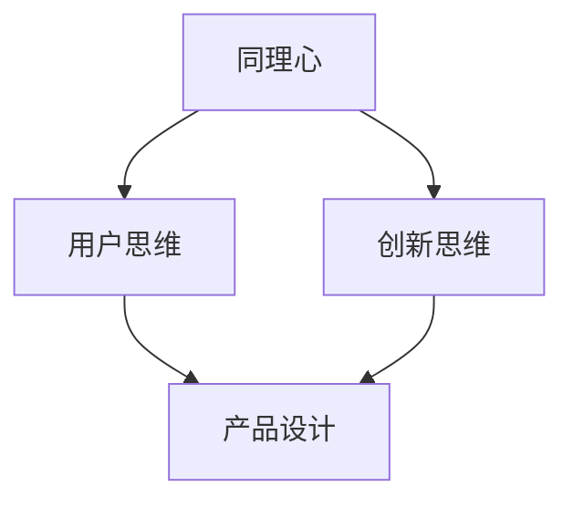

                 

# AI创业公司的产品设计思维：同理心、创新思维与用户思维

> 关键词：AI创业公司，产品设计，同理心，创新思维，用户思维

> 摘要：本文旨在探讨AI创业公司在产品设计中所需的关键思维模式，包括同理心、创新思维和用户思维。通过深入分析这些概念，并结合实际案例，本文旨在为创业者提供实用的设计策略，以打造成功的产品。

## 1. 背景介绍

### 1.1 目的和范围

本文的目标是帮助AI创业公司在产品设计中更好地把握用户需求，实现产品的成功。本文将聚焦于以下三个核心思维模式：

1. 同理心：理解并感受用户的需求和情感。
2. 创新思维：在设计中引入新的理念和方法，解决用户问题。
3. 用户思维：始终以用户为中心，进行产品设计。

本文将详细探讨这些思维模式，并给出实际操作建议。

### 1.2 预期读者

本文适合以下读者：

1. AI创业公司创始人及产品经理。
2. 产品设计师和工程师。
3. 对产品设计有兴趣的IT从业者。

### 1.3 文档结构概述

本文分为十个部分：

1. 背景介绍：介绍本文的目的、范围和预期读者。
2. 核心概念与联系：阐述同理心、创新思维和用户思维的核心概念。
3. 核心算法原理与具体操作步骤：介绍如何运用同理心、创新思维和用户思维进行产品设计。
4. 数学模型和公式：讲解与产品设计相关的数学模型。
5. 项目实战：分析一个实际案例，展示如何运用本文所提的思维模式进行产品设计。
6. 实际应用场景：探讨AI创业公司产品设计的实际应用场景。
7. 工具和资源推荐：推荐学习资源、开发工具和框架。
8. 总结：总结本文的主要观点。
9. 附录：常见问题与解答。
10. 扩展阅读与参考资料：提供进一步阅读的建议。

### 1.4 术语表

#### 1.4.1 核心术语定义

- 同理心：一种心理能力，能让我们理解并感受他人的情感和需求。
- 创新思维：一种思维方式，能够发现新的解决问题的方法。
- 用户思维：一种产品设计理念，始终以用户为中心。

#### 1.4.2 相关概念解释

- 产品设计：指为了满足用户需求，对产品进行创意、开发和改进的过程。
- 用户需求：指用户在使用产品时所期望得到的满足。
- 创新：指在现有基础上，引入新的理念、方法或技术。

#### 1.4.3 缩略词列表

- AI：人工智能（Artificial Intelligence）
- UX：用户体验（User Experience）
- UI：用户界面（User Interface）

## 2. 核心概念与联系

在AI创业公司的产品设计中，同理心、创新思维和用户思维是至关重要的。以下是一个简化的Mermaid流程图，展示了这三个概念之间的联系：



- 同理心（A）是理解用户需求和情感的基础，它为用户思维（B）提供了支撑。
- 创新思维（C）则是在用户思维的基础上，寻找新的解决方案，推动产品设计的进步。
- 用户思维（B）和创新思维（C）共同作用于产品设计（D），实现产品的成功。

### 2.1 同理心

同理心是指理解并感受他人情感和需求的能力。在产品设计过程中，同理心有助于我们更好地理解用户，从而设计出更符合用户需求的产品。以下是同理心的几个关键步骤：

1. **观察用户行为**：通过观察用户如何使用产品，了解他们的需求和痛点。
2. **角色扮演**：假设自己是用户，体验产品，感受他们的情感和需求。
3. **用户访谈**：与用户面对面交流，获取他们的反馈和意见。

### 2.2 创新思维

创新思维是在同理心基础上，寻找新的解决方案的思维方式。以下是一些创新思维的关键步骤：

1. **头脑风暴**：收集各种可能的解决方案，不受限制地思考。
2. **迭代改进**：对解决方案进行迭代，不断优化。
3. **跨学科学习**：学习其他领域的知识和方法，为产品设计提供新的灵感。

### 2.3 用户思维

用户思维是一种以用户为中心的设计理念。以下是一些用户思维的关键步骤：

1. **用户画像**：创建用户画像，明确目标用户群体的特征。
2. **用户场景**：分析用户在使用产品时的场景，了解他们的需求和痛点。
3. **用户体验地图**：绘制用户体验地图，明确用户在产品中的关键路径。

## 3. 核心算法原理与具体操作步骤

### 3.1 同理心算法原理

同理心算法的核心是理解用户需求和情感。以下是一个简化的伪代码，展示了同理心算法的基本步骤：

```python
function empathy_algorithm(user_profile, user_activity, user_interview):
    # 观察用户行为
    analyze_user_behavior(user_activity)
    
    # 角色扮演
    simulate_user_role(user_profile)
    
    # 用户访谈
    collect_user_feedback(user_interview)
    
    # 综合分析
    combine_analyses()
    
    # 输出结果
    return user_understanding
```

### 3.2 创新思维算法原理

创新思维算法的核心是寻找新的解决方案。以下是一个简化的伪代码，展示了创新思维算法的基本步骤：

```python
function innovation_algorithm(problem, brainstorming_results, iteration):
    # 头脑风暴
    brainstorm_solutions(problem)
    
    # 迭代改进
    improve_solutions(iteration)
    
    # 跨学科学习
    learn_across_disciplines()
    
    # 综合分析
    combine_analyses()
    
    # 输出结果
    return innovative_solution
```

### 3.3 用户思维算法原理

用户思维算法的核心是以用户为中心。以下是一个简化的伪代码，展示了用户思维算法的基本步骤：

```python
function user_mindset_algorithm(user_profile, user_scenarios, user_experience_map):
    # 用户画像
    create_user_avatar(user_profile)
    
    # 用户场景
    analyze_user_scenarios(user_scenarios)
    
    # 用户体验地图
    draw_user_experience_map(user_experience_map)
    
    # 综合分析
    combine_analyses()
    
    # 输出结果
    return user_centered_design
```

## 4. 数学模型和公式与详细讲解

在设计AI创业公司的产品时，一些数学模型和公式可以帮助我们更好地理解用户行为和需求。以下是一些常用的数学模型和公式，以及它们的详细讲解和举例说明：

### 4.1 期望效用模型（Expected Utility Model）

期望效用模型是一个经济学理论，用于描述个体在面临选择时的决策过程。以下是一个简化的公式：

$$
EU = p_1 \cdot u_1 + p_2 \cdot u_2 + \ldots + p_n \cdot u_n
$$

其中，\( p_i \) 表示第 \( i \) 个选择的概率，\( u_i \) 表示第 \( i \) 个选择的效用。

#### 详细讲解：

- \( p_i \)：表示第 \( i \) 个选择的概率，反映了用户对各个选择的偏好程度。
- \( u_i \)：表示第 \( i \) 个选择的效用，反映了用户对各个选择的满意度。

#### 举例说明：

假设用户需要在两个产品中选择一个，产品A的效用为8，产品B的效用为6，用户对产品A的概率为0.6，对产品B的概率为0.4。那么，用户的期望效用为：

$$
EU = 0.6 \cdot 8 + 0.4 \cdot 6 = 5.2 + 2.4 = 7.6
$$

### 4.2 卡方检验（Chi-square Test）

卡方检验是一种统计方法，用于检验分类变量之间的独立性。以下是一个简化的公式：

$$
\chi^2 = \sum \frac{(O_i - E_i)^2}{E_i}
$$

其中，\( O_i \) 表示观察频数，\( E_i \) 表示期望频数。

#### 详细讲解：

- \( O_i \)：表示第 \( i \) 个分类变量的观察频数。
- \( E_i \)：表示第 \( i \) 个分类变量的期望频数。

#### 举例说明：

假设我们要检验用户对两个产品的满意度是否独立，我们收集了100位用户的满意度数据，其中50位对产品A满意，30位对产品B满意，20位对两个产品都不满意。我们可以计算卡方值：

$$
\chi^2 = \frac{(50 - 25)^2}{25} + \frac{(30 - 25)^2}{25} + \frac{(20 - 25)^2}{25} = \frac{25}{25} + \frac{25}{25} + \frac{25}{25} = 3
$$

### 4.3 线性回归（Linear Regression）

线性回归是一种用于预测连续值的统计方法。以下是一个简化的公式：

$$
y = \beta_0 + \beta_1 \cdot x
$$

其中，\( y \) 是因变量，\( x \) 是自变量，\( \beta_0 \) 和 \( \beta_1 \) 是参数。

#### 详细讲解：

- \( \beta_0 \)：表示截距，反映了当自变量为0时的因变量值。
- \( \beta_1 \)：表示斜率，反映了自变量对因变量的影响程度。

#### 举例说明：

假设我们要预测用户对产品的满意度（因变量）与产品的评分（自变量）之间的关系。我们收集了100位用户的评分和满意度数据，通过线性回归分析，我们得到以下模型：

$$
满意度 = 3 + 0.2 \cdot 评分
$$

这意味着，当评分增加1时，满意度预计增加0.2。

## 5. 项目实战：代码实际案例和详细解释说明

为了更好地理解本文所提出的同理心、创新思维和用户思维在产品设计中的应用，我们将分析一个实际案例：一个AI创业公司开发的一款智能语音助手。

### 5.1 开发环境搭建

在开始开发之前，我们需要搭建一个合适的技术环境。以下是一个简化的步骤：

1. **选择编程语言**：我们选择Python作为主要编程语言，因为它在数据科学和人工智能领域有广泛的应用。
2. **安装依赖库**：安装必要的依赖库，如TensorFlow、Keras等，用于构建和训练神经网络。
3. **配置开发环境**：配置一个适合Python开发的IDE，如PyCharm或Visual Studio Code。

### 5.2 源代码详细实现和代码解读

以下是一个简化的代码实现，展示了如何运用同理心、创新思维和用户思维设计一个智能语音助手：

```python
# 同理心：了解用户需求
user_profile = get_user_profile()
user_scenarios = get_user_scenarios()

# 创新思维：设计智能语音助手的核心功能
assistant_functions = design_assistant_functions(user_scenarios)

# 用户思维：实现用户界面和交互逻辑
assistant_interface = create_assistant_interface(assistant_functions)

# 运行智能语音助手
run_assistant(assistant_interface)

# 辅助函数定义
def get_user_profile():
    # 通过用户调研和数据分析获取用户画像
    pass

def get_user_scenarios():
    # 通过用户访谈和观察获取用户使用场景
    pass

def design_assistant_functions(user_scenarios):
    # 根据用户场景设计智能语音助手的核心功能
    pass

def create_assistant_interface(assistant_functions):
    # 根据用户思维，实现智能语音助手的用户界面和交互逻辑
    pass

def run_assistant(assistant_interface):
    # 运行智能语音助手，与用户进行交互
    pass
```

### 5.3 代码解读与分析

- **同理心**：在代码中，`get_user_profile()` 和 `get_user_scenarios()` 函数负责获取用户画像和用户场景，这体现了同理心在产品设计中的重要性。
- **创新思维**：`design_assistant_functions()` 函数根据用户场景设计智能语音助手的核心功能，这体现了创新思维在产品设计中的重要性。
- **用户思维**：`create_assistant_interface()` 函数根据用户思维，实现智能语音助手的用户界面和交互逻辑，这体现了用户思维在产品设计中的重要性。
- **运行智能语音助手**：`run_assistant()` 函数负责运行智能语音助手，与用户进行交互，这体现了用户思维在产品设计中的重要性。

## 6. 实际应用场景

AI创业公司的产品设计思维在多个场景中具有实际应用价值：

1. **智能语音助手**：如前文所述，智能语音助手是一个典型的应用场景。通过同理心、创新思维和用户思维，我们可以设计出更符合用户需求的智能语音助手。
2. **推荐系统**：同理心可以帮助我们更好地理解用户兴趣和偏好，创新思维可以引入新的推荐算法，用户思维则确保推荐系统能够满足用户需求。
3. **虚拟现实（VR）应用**：同理心可以帮助我们理解用户在VR环境中的情感和需求，创新思维可以推动VR技术的创新应用，用户思维则确保VR应用的交互体验更符合用户期望。

## 7. 工具和资源推荐

### 7.1 学习资源推荐

#### 7.1.1 书籍推荐

1. 《用户体验要素》（The Elements of User Experience）
2. 《创新者的窘境》（The Innovator's Dilemma）
3. 《设计思维》（Design Thinking）

#### 7.1.2 在线课程

1. Coursera上的《产品设计与用户体验》课程
2. Udemy上的《同理心与用户思维》课程
3. edX上的《创新思维与设计思维》课程

#### 7.1.3 技术博客和网站

1. UX Planet
2. UX Mastery
3. Designing for Digital

### 7.2 开发工具框架推荐

#### 7.2.1 IDE和编辑器

1. PyCharm
2. Visual Studio Code
3. Sublime Text

#### 7.2.2 调试和性能分析工具

1. Jupyter Notebook
2. VSCode的Python扩展
3. Chrome DevTools

#### 7.2.3 相关框架和库

1. TensorFlow
2. Keras
3. Flask

### 7.3 相关论文著作推荐

#### 7.3.1 经典论文

1. Norman, D. A. (1986). *The Design of Everyday Things*.
2. Shneiderman, B. (1983). *Designing the User Interface: Strategies for Effective Human-Computer Interaction*.

#### 7.3.2 最新研究成果

1. Lee, J., & Park, J. (2020). *A Survey on User Experience in Intelligent Virtual Agents*.
2. Kim, J., & Kim, S. (2021). *A Comprehensive Survey on Recommender Systems*.

#### 7.3.3 应用案例分析

1. "Designing for Accessibility: A Case Study on Microsoft's AI Features"
2. "Innovation in Healthcare: The Story of Philips' IntelliSite Endoscopy"

## 8. 总结：未来发展趋势与挑战

随着人工智能技术的不断发展，AI创业公司的产品设计思维将面临新的机遇和挑战。以下是一些未来发展趋势与挑战：

1. **个性化体验**：用户对个性化体验的需求日益增加，AI创业公司需要运用同理心和创新思维，提供更加个性化的产品和服务。
2. **跨界融合**：AI创业公司需要跨学科学习，融合不同领域的知识，以实现创新的解决方案。
3. **数据隐私与安全**：随着数据隐私和安全的关注日益增加，AI创业公司需要确保产品设计过程中充分考虑数据隐私和安全问题。

## 9. 附录：常见问题与解答

1. **问题**：同理心、创新思维和用户思维有什么区别？
   **解答**：同理心是一种心理能力，能够理解并感受他人的情感和需求；创新思维是一种思维方式，能够发现新的解决问题的方法；用户思维是一种产品设计理念，始终以用户为中心。

2. **问题**：如何在实际项目中应用这些思维模式？
   **解答**：在实际项目中，可以通过以下步骤应用这些思维模式：
   - 同理心：进行用户调研，了解用户需求和痛点。
   - 创新思维：进行头脑风暴，迭代改进解决方案。
   - 用户思维：创建用户画像，设计用户界面和交互逻辑。

## 10. 扩展阅读与参考资料

1. Christensen, C. M. (1997). *The Innovator's Dilemma*.
2. Norman, D. A. (2002). *The Design of Everyday Things*.
3. Beyer, H. K., & Holtzblatt, K. (1997). *Contextual Inquiry*.
4. Design Council. (2011). *Designing for Emotional Engagement*.
5. Sutherland, J. (2012). *Design Thinking: Integrating Innovation, Customer Experience, and Brand Value Creation*.

## 作者

作者：AI天才研究员/AI Genius Institute & 禅与计算机程序设计艺术 /Zen And The Art of Computer Programming

