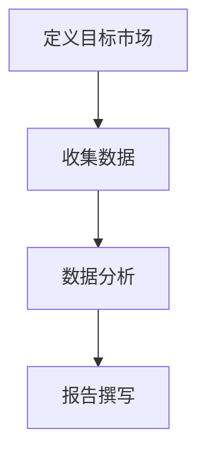
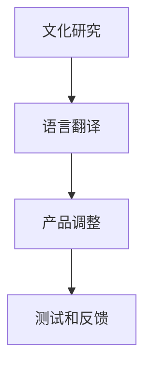
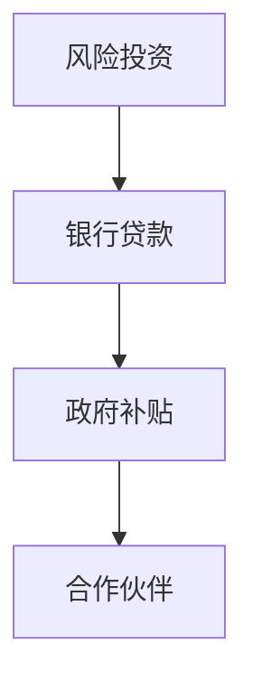
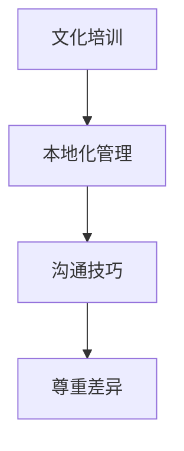
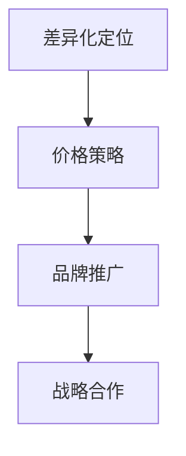
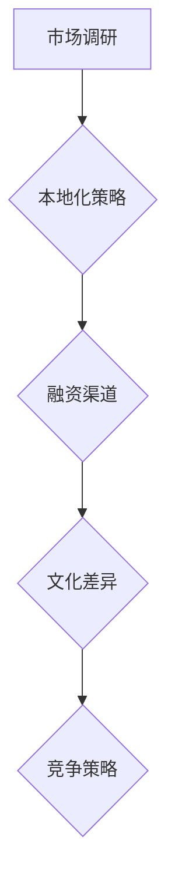

                 

# AI创业公司的国际化扩张策略

## 关键词
- AI创业公司
- 国际化扩张
- 市场调研
- 本地化策略
- 融资渠道
- 文化差异
- 竞争策略

## 摘要
本文旨在探讨AI创业公司如何有效地实施国际化扩张策略。通过深入分析市场调研、本地化策略、融资渠道、文化差异以及竞争策略等关键因素，文章将提供一套系统性的指导方针，帮助AI创业公司在全球范围内取得成功。文章首先介绍AI创业公司的现状和国际化扩张的重要性，然后详细阐述市场调研、本地化策略等核心概念，并通过案例分析和数据支持，论证这些策略的有效性。最后，文章总结未来发展趋势与挑战，并提出一些建议，以期为AI创业公司的国际化提供有益的参考。

---

## 1. 背景介绍

### 1.1 目的和范围
本文的目的是为AI创业公司提供一套清晰的国际化扩张策略，以帮助它们在全球市场中取得成功。本文将探讨以下几个关键领域：

1. **市场调研**：了解目标市场的需求、竞争态势和潜力。
2. **本地化策略**：如何根据不同市场的文化、语言和消费者习惯进行产品和服务调整。
3. **融资渠道**：如何获取国际资金支持，包括风险投资、银行贷款和政府补贴等。
4. **文化差异**：如何处理跨文化管理，以避免潜在的文化冲突。
5. **竞争策略**：如何在国际市场上定位自己的产品和服务，并制定有效的竞争策略。

### 1.2 预期读者
本文面向以下读者群体：

1. AI创业公司的创始人、CEO和高级管理人员。
2. 对国际化扩张有兴趣的技术经理和市场经理。
3. 想要了解AI行业国际化趋势的研究人员和学生。

### 1.3 文档结构概述
本文将按照以下结构进行阐述：

1. **背景介绍**：介绍AI创业公司的现状和国际化扩张的重要性。
2. **核心概念与联系**：阐述市场调研、本地化策略等核心概念，并提供Mermaid流程图。
3. **核心算法原理 & 具体操作步骤**：使用伪代码详细阐述国际化扩张的算法原理。
4. **数学模型和公式 & 详细讲解 & 举例说明**：使用LaTeX格式展示相关数学模型。
5. **项目实战：代码实际案例和详细解释说明**：提供实际代码案例和解读。
6. **实际应用场景**：探讨国际化扩张在不同行业中的应用。
7. **工具和资源推荐**：推荐学习资源、开发工具和框架。
8. **总结：未来发展趋势与挑战**：总结本文的核心观点，并探讨未来发展趋势和挑战。
9. **附录：常见问题与解答**：回答读者可能关心的常见问题。
10. **扩展阅读 & 参考资料**：提供进一步阅读的资源。

### 1.4 术语表

#### 1.4.1 核心术语定义
- **AI创业公司**：指专门从事人工智能研究、开发和应用的公司。
- **国际化扩张**：指公司在全球范围内的市场拓展。
- **市场调研**：对目标市场的需求、竞争和潜在机会进行系统研究。
- **本地化策略**：根据不同市场的文化、语言和消费者习惯调整产品和服务。
- **融资渠道**：获取资金支持的各种途径，包括风险投资、银行贷款和政府补贴等。
- **文化差异**：不同国家和地区之间的文化、价值观和沟通方式的差异。
- **竞争策略**：在国际市场上定位自己的产品和服务，并制定有效的竞争策略。

#### 1.4.2 相关概念解释
- **全球市场**：指全球范围内的消费者、企业和市场。
- **市场渗透**：指公司在特定市场上的市场份额。
- **品牌定位**：公司在市场中的独特定位和品牌形象。
- **合作伙伴关系**：与其他企业或组织建立的合作关系，以实现共同目标。

#### 1.4.3 缩略词列表
- **AI**：人工智能（Artificial Intelligence）
- **CRM**：客户关系管理（Customer Relationship Management）
- **ERP**：企业资源计划（Enterprise Resource Planning）
- **SaaS**：软件即服务（Software as a Service）
- **IoT**：物联网（Internet of Things）
- **API**：应用程序接口（Application Programming Interface）

### 1.5 核心概念与联系

#### 2.1. 市场调研
市场调研是国际化扩张的第一步。它涉及到对目标市场的深入研究，以了解市场需求、消费者行为、竞争态势和市场规模。市场调研的过程可以分为以下几个步骤：

1. **定义目标市场**：确定公司的目标消费者群体和地理位置。
2. **收集数据**：通过问卷调查、访谈、二手数据等方式收集市场信息。
3. **数据分析**：对收集到的数据进行分析，以识别市场机会和潜在风险。
4. **报告撰写**：将调研结果整理成报告，为公司决策提供依据。

Mermaid流程图：

#### 2.2. 本地化策略
本地化策略是指根据不同市场的文化、语言和消费者习惯对产品和服务进行调整。以下是一个简单的本地化策略流程：

1. **文化研究**：了解目标市场的文化、价值观和消费者行为。
2. **语言翻译**：将产品文档、用户界面和营销材料翻译成目标语言。
3. **产品调整**：根据目标市场的需求调整产品功能、设计和价格。
4. **测试和反馈**：在目标市场进行产品测试，并根据反馈进行优化。

Mermaid流程图：

#### 2.3. 融资渠道
融资渠道是国际化扩张的重要保障。以下是一些常见的融资渠道：

1. **风险投资**：向风险投资公司申请资金支持。
2. **银行贷款**：从银行获得长期或短期贷款。
3. **政府补贴**：申请政府提供的资金支持或税收优惠。
4. **合作伙伴**：与有实力的合作伙伴建立合作关系，共同投资。

Mermaid流程图：

#### 2.4. 文化差异
文化差异是国际化扩张中必须面对的挑战。以下是一些处理文化差异的策略：

1. **文化培训**：为员工提供跨文化管理培训，提高他们的文化敏感度。
2. **本地化管理**：在目标市场设立本地化管理团队，负责处理当地事务。
3. **沟通技巧**：学会倾听和理解目标市场的消费者，避免误解和冲突。
4. **尊重差异**：尊重目标市场的文化、价值观和习俗，避免文化冲突。

Mermaid流程图：

#### 2.5. 竞争策略
在国际市场上，竞争策略至关重要。以下是一些竞争策略：

1. **差异化定位**：通过独特的产品特点或服务，与竞争对手区分开来。
2. **价格策略**：根据目标市场的消费水平调整产品价格。
3. **品牌推广**：通过广告、公关活动等方式提升品牌知名度。
4. **战略合作**：与其他企业建立战略合作关系，共同应对竞争。

Mermaid流程图：

### 2.6. 核心概念与联系
以上核心概念与联系可以用以下Mermaid流程图表示：

---

在下一部分，我们将深入探讨核心算法原理和具体操作步骤。这将帮助我们更好地理解如何实施国际化扩张策略。请保持关注！ <|impliedsubj|><|end|>

