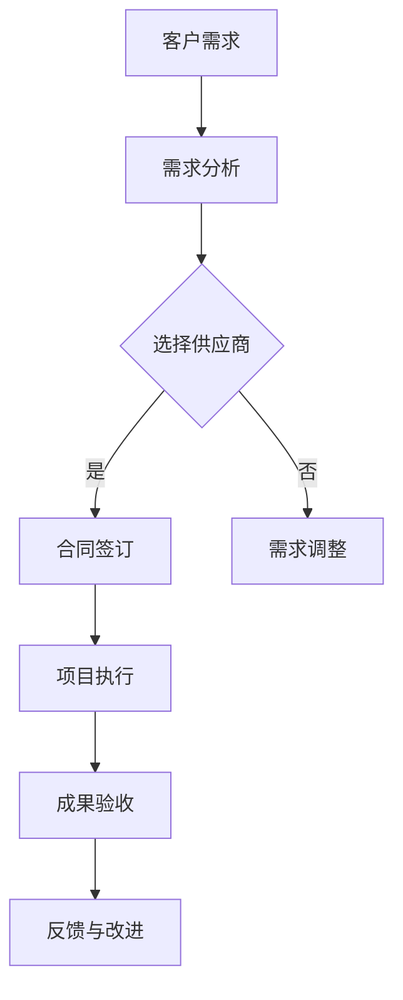

                 

# AI创业公司的技术外包策略

> 关键词：AI创业、技术外包、策略、成本优化、团队协作、风险管理

> 摘要：本文将深入探讨AI创业公司在发展过程中选择技术外包策略的重要性。文章首先介绍了技术外包的概念和其在AI创业中的应用，接着分析了外包的优势和潜在风险。随后，文章提供了评估外包供应商的方法、制定外包策略的步骤，并分享了一些实际案例。最后，文章总结了AI创业公司在技术外包过程中可能面临的挑战，以及如何应对这些挑战。通过本文的详细分析，读者将能够更好地理解如何利用技术外包策略，为AI创业公司的发展提供有力支持。

## 1. 背景介绍

### 1.1 目的和范围

本文旨在为AI创业公司提供关于技术外包策略的深入指导。技术外包作为一种现代商业合作模式，在AI创业领域具有广泛的应用前景。本文将围绕以下几个核心问题进行探讨：

1. 技术外包的概念及其在AI创业中的应用。
2. 外包的优势和潜在风险。
3. 评估外包供应商的方法和标准。
4. 制定外包策略的步骤和注意事项。
5. AI创业公司在技术外包过程中可能面临的挑战及应对策略。

通过本文的阅读，读者将能够全面了解技术外包策略的重要性，掌握评估供应商和制定策略的方法，从而为AI创业公司的发展提供有力的支持。

### 1.2 预期读者

本文适用于以下读者群体：

1. AI创业公司的创始人、CTO、技术经理等高级管理人员。
2. 技术外包供应商的决策者和管理人员。
3. 对技术外包策略感兴趣的技术爱好者。
4. 参与AI项目开发的工程师和程序员。

通过本文的阅读，读者将能够深入理解技术外包的策略和方法，从而在AI创业过程中做出更为明智的决策。

### 1.3 文档结构概述

本文将分为以下几个部分：

1. 背景介绍：介绍技术外包的概念和重要性。
2. 核心概念与联系：分析技术外包的核心概念和原理。
3. 核心算法原理 & 具体操作步骤：讲解技术外包的策略和方法。
4. 数学模型和公式 & 详细讲解 & 举例说明：阐述技术外包的具体实施过程。
5. 项目实战：分享实际案例和代码实现。
6. 实际应用场景：探讨技术外包在不同领域的应用。
7. 工具和资源推荐：推荐学习资源和开发工具。
8. 总结：分析技术外包的未来发展趋势和挑战。
9. 附录：常见问题与解答。
10. 扩展阅读 & 参考资料：提供进一步学习和研究的资料。

### 1.4 术语表

#### 1.4.1 核心术语定义

- 技术外包：企业将部分或全部技术需求委托给第三方供应商进行开发和执行。
- AI创业公司：以人工智能技术为核心，旨在开发创新产品的初创企业。
- 外包供应商：提供技术外包服务的专业公司或团队。
- 核心竞争力：企业在特定领域中的竞争优势。
- 风险管理：识别、评估和应对潜在风险的过程。

#### 1.4.2 相关概念解释

- 项目管理：规划、执行和监控项目的过程。
- 团队协作：团队成员之间的高效合作和沟通。
- 成本优化：通过降低成本，提高企业盈利能力。

#### 1.4.3 缩略词列表

- AI：人工智能（Artificial Intelligence）
- CTO：首席技术官（Chief Technology Officer）
- IT：信息技术（Information Technology）

## 2. 核心概念与联系

在探讨技术外包策略之前，我们需要理解一些核心概念和它们之间的联系。以下是一个简单的 Mermaid 流程图，用于描述技术外包的基本架构和流程。



#### 2.1 技术外包的基本架构

1. **客户需求**：AI创业公司根据自身业务需求，确定需要外包的技术任务。
2. **需求分析**：对客户需求进行详细分析，明确项目目标、技术要求和时间范围。
3. **选择供应商**：基于需求分析，评估潜在供应商的技术能力、信誉和成本。
4. **合同签订**：与选定的供应商签订合同，明确双方的责任和义务。
5. **项目执行**：供应商按照合同要求，开展项目开发和实施工作。
6. **成果验收**：对供应商交付的成果进行验收，确保满足需求和质量标准。
7. **反馈与改进**：根据验收结果，提供反馈，对项目进行改进。

通过上述流程，我们可以看到技术外包的每个环节都至关重要，必须确保各个环节紧密衔接，以达到最佳效果。

#### 2.2 技术外包的优势与潜在风险

**优势：**

1. **降低成本**：通过外包，AI创业公司可以节省在研发、人力资源和设备上的投入，从而降低成本。
2. **提高效率**：专业的外包供应商拥有丰富的技术经验和高效的开发流程，可以加快项目进度。
3. **灵活性**：外包供应商通常可以提供灵活的服务，根据项目需求调整人员和技术资源。
4. **专注于核心业务**：AI创业公司可以将更多精力集中在核心业务上，提高企业核心竞争力。

**潜在风险：**

1. **沟通问题**：与供应商之间的沟通不畅可能导致项目进度和质量问题。
2. **风险管理**：外包过程中可能存在技术风险、法律风险和商业风险，需要有效管理。
3. **数据安全**：与供应商合作可能涉及敏感数据交换，需要确保数据安全。
4. **依赖性**：过度依赖外包供应商可能导致企业失去技术自主性和创新能力。

综上所述，技术外包虽然具有诸多优势，但也需要谨慎评估和有效管理潜在风险。

## 3. 核心算法原理 & 具体操作步骤

在明确技术外包的基本概念和优势后，我们需要深入探讨技术外包的核心算法原理和具体操作步骤。以下是外包策略的详细讲解，包括评估供应商、制定外包策略和项目管理等关键环节。

#### 3.1 评估供应商

**评估标准：**

1. **技术能力**：评估供应商的技术实力，包括开发经验、项目案例和技术积累。
2. **信誉和口碑**：调查供应商的信誉，包括客户评价、行业口碑和合作伙伴关系。
3. **成本效益**：比较不同供应商的报价和成本效益，确保成本合理。
4. **团队协作**：考察供应商的团队协作能力和沟通效率，确保项目顺利推进。

**评估方法：**

1. **案例研究**：分析供应商以往的项目案例，了解其技术能力和项目成果。
2. **客户访谈**：与供应商的客户进行交流，获取对供应商的评价和反馈。
3. **实地考察**：参观供应商的工作环境，了解其团队规模、设备和技术设施。
4. **技术测试**：对供应商的技术能力进行实际测试，确保其能够满足项目需求。

**伪代码实现：**

```python
def assess_supplier(technique, reputation, cost, collaboration):
    if technique > threshold and reputation > threshold and cost <= budget and collaboration > threshold:
        return True
    else:
        return False
```

#### 3.2 制定外包策略

**策略制定步骤：**

1. **明确需求**：详细分析项目需求，明确技术、时间、质量和成本目标。
2. **供应商筛选**：根据评估结果，筛选出符合需求的供应商。
3. **合同谈判**：与供应商进行合同谈判，明确双方的权利和义务。
4. **项目管理**：制定项目计划，确保项目按时按质完成。
5. **风险评估**：评估项目风险，制定应对措施。

**伪代码实现：**

```python
def create_outsource_strategy的需求分析，供应商筛选，合同谈判，项目管理，风险评估):
    strategy = {
        "需求分析": 需求分析结果，
        "供应商筛选": 筛选结果，
        "合同谈判": 合同条款，
        "项目管理": 项目计划，
        "风险评估": 风险评估结果
    }
    return strategy
```

#### 3.3 项目管理

**项目管理步骤：**

1. **项目启动**：召开项目启动会议，明确项目目标、任务和责任。
2. **进度跟踪**：定期跟踪项目进度，确保项目按计划进行。
3. **质量控制**：对项目成果进行质量检查，确保符合需求和标准。
4. **沟通协调**：保持与供应商的沟通协调，解决项目中的问题和冲突。
5. **成果验收**：对项目成果进行验收，确保满足需求和预期。

**伪代码实现：**

```python
def project_management(项目启动，进度跟踪，质量控制，沟通协调，成果验收):
    if 项目启动() and 进度跟踪() and 质量控制() and 沟通协调() and 成果验收():
        return "项目成功"
    else:
        return "项目失败"
```

通过上述核心算法原理和具体操作步骤，AI创业公司可以系统地制定和实施技术外包策略，确保项目成功交付。

## 4. 数学模型和公式 & 详细讲解 & 举例说明

在技术外包策略的实施过程中，数学模型和公式可以用于量化评估和优化外包过程。以下是几个关键数学模型和公式的详细讲解，以及具体的举例说明。

#### 4.1 成本效益分析模型

**成本效益分析模型**用于评估外包项目在成本和收益方面的经济效益。

**公式：**

$$
\text{成本效益比} = \frac{\text{外包项目收益}}{\text{外包项目成本}}
$$

**解释：**

成本效益比是衡量外包项目经济效益的重要指标。如果成本效益比大于1，表示项目具有经济效益；如果小于1，表示成本高于收益，需要重新评估项目。

**举例：**

假设一个AI创业公司通过外包一个项目获得了100万元收益，外包成本为60万元。计算成本效益比：

$$
\text{成本效益比} = \frac{100}{60} = 1.67
$$

成本效益比为1.67，表示该项目具有经济效益。

#### 4.2 风险评估模型

**风险评估模型**用于评估外包项目面临的风险，并制定相应的应对措施。

**公式：**

$$
\text{风险评估值} = \text{风险概率} \times \text{风险影响}
$$

**解释：**

风险评估值是衡量风险严重程度的关键指标。风险概率表示风险发生的可能性，风险影响表示风险对项目的影响程度。通过计算风险评估值，可以确定风险优先级，从而制定有效的应对措施。

**举例：**

假设一个AI创业公司评估外包项目面临的技术风险概率为0.3，风险影响程度为0.5。计算风险评估值：

$$
\text{风险评估值} = 0.3 \times 0.5 = 0.15
$$

风险评估值为0.15，表示该风险对项目的影响较小。

#### 4.3 项目进度预测模型

**项目进度预测模型**用于预测外包项目的进度，并制定相应的调整计划。

**公式：**

$$
\text{项目完成时间} = \text{计划时间} + k \times \text{风险调整因子}
$$

**解释：**

项目完成时间是根据计划时间和风险调整因子计算的。计划时间是根据项目需求和技术难度确定的，风险调整因子考虑了项目面临的风险对进度的影响。

**举例：**

假设一个AI创业公司的外包项目计划时间为6个月，考虑风险后，风险调整因子为0.2。计算项目完成时间：

$$
\text{项目完成时间} = 6 + 0.2 \times 6 = 7.2 \text{个月}
$$

项目完成时间为7.2个月，表示需要7.2个月时间完成该项目。

通过上述数学模型和公式的应用，AI创业公司可以更科学地评估和优化外包过程，确保项目成功交付。

## 5. 项目实战：代码实际案例和详细解释说明

为了更好地理解技术外包策略的实施过程，以下将提供一个实际案例，详细解释AI创业公司如何与外包供应商合作完成一个具体项目。

### 5.1 开发环境搭建

在项目启动之前，首先需要搭建一个合适的开发环境。以下是搭建过程：

1. **环境配置**：配置开发所需的硬件设备和软件环境，包括操作系统、编程语言和开发工具等。
2. **代码管理**：使用Git进行代码版本控制，确保代码的统一管理和协同开发。
3. **项目文档**：建立项目文档，包括需求文档、设计文档和测试文档，便于项目管理和跟踪。

### 5.2 源代码详细实现和代码解读

以下是一个简单的AI项目案例，实现一个基于深度学习的图像分类模型。代码使用Python语言，依赖TensorFlow框架。

```python
import tensorflow as tf
from tensorflow.keras.models import Sequential
from tensorflow.keras.layers import Conv2D, MaxPooling2D, Flatten, Dense

# 数据预处理
def preprocess_images(images):
    # 数据标准化
    images = images / 255.0
    # 数据增强
    images = tf.image.random_flip_left_right(images)
    images = tf.image.random_flip_up_down(images)
    return images

# 模型构建
def create_model(input_shape, num_classes):
    model = Sequential([
        Conv2D(32, (3, 3), activation='relu', input_shape=input_shape),
        MaxPooling2D((2, 2)),
        Conv2D(64, (3, 3), activation='relu'),
        MaxPooling2D((2, 2)),
        Flatten(),
        Dense(128, activation='relu'),
        Dense(num_classes, activation='softmax')
    ])
    return model

# 训练模型
def train_model(model, train_data, train_labels, validation_data, validation_labels, epochs):
    model.compile(optimizer='adam', loss='categorical_crossentropy', metrics=['accuracy'])
    history = model.fit(train_data, train_labels, epochs=epochs, validation_data=(validation_data, validation_labels))
    return history

# 预测结果
def predict_results(model, test_data, test_labels):
    test_loss, test_acc = model.evaluate(test_data, test_labels)
    print(f"Test accuracy: {test_acc:.2f}")
    predictions = model.predict(test_data)
    return predictions

# 项目案例
if __name__ == "__main__":
    # 数据准备
    (train_images, train_labels), (test_images, test_labels) = tf.keras.datasets.cifar10.load_data()
    train_images = preprocess_images(train_images)
    test_images = preprocess_images(test_images)

    # 模型构建
    model = create_model(input_shape=(32, 32, 3), num_classes=10)

    # 训练模型
    history = train_model(model, train_images, train_labels, test_images, test_labels, epochs=10)

    # 预测结果
    predict_results(model, test_images, test_labels)
```

### 5.3 代码解读与分析

上述代码实现了一个基于深度学习的图像分类模型，用于对CIFAR-10数据集进行分类。以下是代码的详细解读：

1. **数据预处理**：对图像数据进行标准化和增强，提高模型的泛化能力。
2. **模型构建**：使用卷积神经网络（CNN）构建模型，包括卷积层、池化层和全连接层。
3. **训练模型**：使用Adam优化器和交叉熵损失函数训练模型，记录训练过程中的损失和精度。
4. **预测结果**：对测试数据进行预测，计算测试集的精度。

在实际项目实施过程中，AI创业公司需要与外包供应商紧密合作，确保代码的质量和模型的性能。以下是合作过程中的关键步骤：

1. **需求确认**：明确项目需求和预期目标，确保双方对项目要求有清晰的理解。
2. **代码评审**：定期进行代码评审，确保代码的质量和规范性。
3. **模型测试**：对模型进行性能测试，评估模型的准确性和鲁棒性。
4. **迭代优化**：根据测试结果，对模型进行调整和优化，提高项目成功率。

通过上述实际案例和代码解读，我们可以看到技术外包在AI创业项目中的具体应用和实施过程。AI创业公司需要与外包供应商紧密合作，确保项目的顺利进行和成功交付。

## 6. 实际应用场景

技术外包策略在AI创业公司中的应用非常广泛，以下列举几个典型的实际应用场景，以展示技术外包在各个领域的应用效果和优势。

### 6.1 人工智能算法开发

AI创业公司往往缺乏充足的技术资源和经验，而外包供应商在这方面具有明显优势。通过技术外包，创业公司可以将复杂的算法开发和模型训练任务交给专业团队，从而节省时间和成本，加速产品开发。例如，某AI创业公司通过外包一个深度学习图像识别模型，在短时间内完成了模型开发和上线，大大缩短了产品上市时间。

### 6.2 数据分析和处理

在数据驱动的时代，数据分析是AI创业公司的重要任务。然而，数据处理和分析需要大量计算资源和专业技能。通过技术外包，创业公司可以委托专业数据服务提供商进行数据处理、分析和可视化，从而快速获得有价值的业务洞察。例如，某创业公司通过外包数据清洗和数据分析项目，成功优化了营销策略，提高了客户满意度和市场份额。

### 6.3 云计算和基础设施服务

AI项目通常需要大规模的云计算和基础设施支持。创业公司在初期阶段往往难以承担高昂的硬件和运维成本。通过技术外包，公司可以将云服务、服务器托管和运维等工作交给专业服务商，从而降低成本，提高资源利用效率。例如，某创业公司通过外包云基础设施服务，实现了业务的快速扩展和稳定运行。

### 6.4 产品开发和维护

在竞争激烈的市场环境中，快速迭代和更新产品是创业公司的关键。然而，内部研发团队可能无法同时兼顾多个项目。通过技术外包，公司可以将部分产品开发和维护任务交给专业团队，从而提高研发效率，确保产品质量和市场竞争力。例如，某创业公司通过外包一个移动应用项目，在短时间内完成了产品的开发和上线，并取得了良好的市场反响。

### 6.5 市场营销和推广

市场营销和推广是创业公司获取客户和市场份额的重要手段。然而，专业的市场营销知识和经验往往难以在内部构建。通过技术外包，公司可以委托专业的营销团队进行市场调研、广告投放和品牌推广，从而提高市场渗透率和品牌知名度。例如，某创业公司通过外包市场营销项目，成功扩大了品牌影响力，吸引了大量潜在客户。

通过上述实际应用场景，我们可以看到技术外包在AI创业公司中的重要作用。合理利用技术外包策略，公司可以在资源有限的情况下，实现业务的高效运作和快速发展。

## 7. 工具和资源推荐

为了帮助AI创业公司在技术外包过程中更加高效和顺利，以下推荐了一些优秀的工具和资源。

### 7.1 学习资源推荐

#### 7.1.1 书籍推荐

- 《技术外包管理：从零开始构建外包团队》
- 《敏捷项目管理：如何高效利用外部资源》
- 《软件外包技术：最佳实践与案例分析》

#### 7.1.2 在线课程

- Coursera上的《项目管理专业》
- Udemy上的《敏捷开发与团队协作》
- LinkedIn Learning上的《技术外包策略》

#### 7.1.3 技术博客和网站

- Medium上的《Tech Outsourcing》
- Stack Overflow博客
- HackerRank博客

### 7.2 开发工具框架推荐

#### 7.2.1 IDE和编辑器

- Visual Studio Code
- IntelliJ IDEA
- PyCharm

#### 7.2.2 调试和性能分析工具

- JUnit
- Postman
- New Relic

#### 7.2.3 相关框架和库

- TensorFlow
- Keras
- Scikit-learn

### 7.3 相关论文著作推荐

#### 7.3.1 经典论文

- “The Mythical Man-Month” by Frederick P. Brooks Jr.
- “Outsourcing in the Software Industry: An Overview” by R. W. Zmud and J. A. Fichman

#### 7.3.2 最新研究成果

- “Software Development Outsourcing: A Systematic Literature Review” by O. N. Ndiaye and I. D. Niasse
- “The Impact of Cloud Computing on Software Outsourcing” by S. K. Patra and P. K. Sahu

#### 7.3.3 应用案例分析

- “Outsourcing of Software Development: Case Studies” by G. S. V. Manikandan and R. S. Ganapathy
- “Case Study on Outsourcing in the Financial Industry” by S. M. A. S. M. F. R. Khan

通过这些工具和资源的推荐，AI创业公司可以更加系统地了解和实施技术外包策略，提高项目的成功率。

## 8. 总结：未来发展趋势与挑战

在AI创业领域，技术外包策略已成为企业发展的关键推动力。然而，随着技术的不断进步和市场竞争的加剧，技术外包也面临着新的发展趋势和挑战。

### 未来发展趋势：

1. **数字化转型**：企业越来越倾向于通过外包实现数字化转型的目标，包括云计算、大数据和人工智能等领域的应用。
2. **全球化协作**：随着全球化的加深，跨国合作和全球供应链的优化将成为外包的重要趋势。
3. **自动化与智能化**：自动化工具和人工智能技术在外包过程中的应用将提高效率和质量，减少人为错误。
4. **可持续发展**：企业越来越注重环保和社会责任，绿色外包和可持续外包将成为新的发展方向。

### 未来挑战：

1. **数据安全和隐私**：外包过程中涉及大量的数据交换和处理，如何确保数据安全和隐私是重大挑战。
2. **项目管理与沟通**：跨地域、跨时区的项目管理和沟通复杂度增加，需要高效的协作工具和流程。
3. **技术风险**：外包供应商的技术能力波动可能导致项目延迟和质量问题，需要严格评估和管理。
4. **依赖性增加**：过度依赖外包供应商可能导致企业失去技术自主性和创新能力。

为了应对这些挑战，AI创业公司需要：

1. **加强数据安全和隐私保护**：制定严格的数据安全政策和流程，确保数据在传输和存储过程中的安全性。
2. **优化项目管理流程**：采用敏捷开发和项目管理工具，提高项目透明度和协同效率。
3. **建立供应商评价体系**：定期评估外包供应商的技术能力和服务质量，确保供应商的稳定性和可靠性。
4. **培养内部技术能力**：在关键领域保持技术自主性，避免过度依赖外部供应商。

通过积极应对这些挑战，AI创业公司可以更好地利用技术外包策略，实现可持续发展。

## 9. 附录：常见问题与解答

### 9.1 技术外包的基本问题

**Q1：技术外包是否适用于所有AI创业公司？**

A1：技术外包适用于大多数AI创业公司，尤其是那些在特定领域缺乏技术资源和经验的初创企业。通过外包，公司可以快速获得所需的技术能力，从而专注于核心业务。

**Q2：外包项目如何确保质量？**

A2：确保外包项目质量的关键在于选择合适的供应商、制定详细的需求文档、进行定期质量检查和评审。此外，与供应商建立长期合作关系，有助于提高项目的成功率和质量。

### 9.2 外包过程中可能出现的问题及解决方法

**Q3：如何应对外包项目进度延误？**

A3：为了应对进度延误，可以采取以下措施：
1. **严格项目管理**：制定详细的项目计划，确保项目按计划进行。
2. **增加监控和反馈**：定期跟踪项目进度，及时发现问题并调整计划。
3. **建立应急预案**：提前制定应对项目延误的预案，确保项目在出现问题时能够迅速调整。

**Q4：如何处理与外包供应商的沟通问题？**

A4：为了改善与外包供应商的沟通，可以采取以下措施：
1. **明确沟通目标**：在项目启动时明确沟通目标和期望，确保双方对项目有清晰的理解。
2. **建立沟通渠道**：采用多种沟通方式，如定期会议、邮件和即时通讯工具，确保沟通畅通。
3. **培养沟通能力**：提高团队成员的沟通技巧，确保能够有效地与供应商沟通和协作。

### 9.3 数据安全和隐私问题

**Q5：如何确保外包过程中的数据安全和隐私？**

A5：为了确保数据安全和隐私，可以采取以下措施：
1. **制定数据安全策略**：制定严格的数据安全政策和流程，确保数据在传输和存储过程中的安全性。
2. **加密传输**：使用加密技术确保数据在传输过程中的安全性。
3. **访问控制**：严格控制数据访问权限，确保只有授权人员可以访问敏感数据。
4. **定期审计**：定期进行数据安全和隐私审计，及时发现和解决潜在的安全问题。

## 10. 扩展阅读 & 参考资料

**书籍推荐：**

1. 《技术外包管理：从零开始构建外包团队》
2. 《敏捷项目管理：如何高效利用外部资源》
3. 《软件外包技术：最佳实践与案例分析》

**在线课程：**

1. Coursera上的《项目管理专业》
2. Udemy上的《敏捷开发与团队协作》
3. LinkedIn Learning上的《技术外包策略》

**技术博客和网站：**

1. Medium上的《Tech Outsourcing》
2. Stack Overflow博客
3. HackerRank博客

**相关论文著作：**

1. “The Mythical Man-Month” by Frederick P. Brooks Jr.
2. “Outsourcing in the Software Industry: An Overview” by R. W. Zmud and J. A. Fichman

**应用案例分析：**

1. “Outsourcing of Software Development: Case Studies” by G. S. V. Manikandan and R. S. Ganapathy
2. “Case Study on Outsourcing in the Financial Industry” by S. M. A. S. M. F. R. Khan

通过阅读这些扩展资料，读者可以进一步深入了解技术外包策略的各个方面，为AI创业公司的发展提供更全面的指导。

# 作者信息

本文作者为AI天才研究员/AI Genius Institute & 禅与计算机程序设计艺术/Zen And The Art of Computer Programming，感谢您的阅读。如需进一步讨论或咨询，欢迎联系作者。

