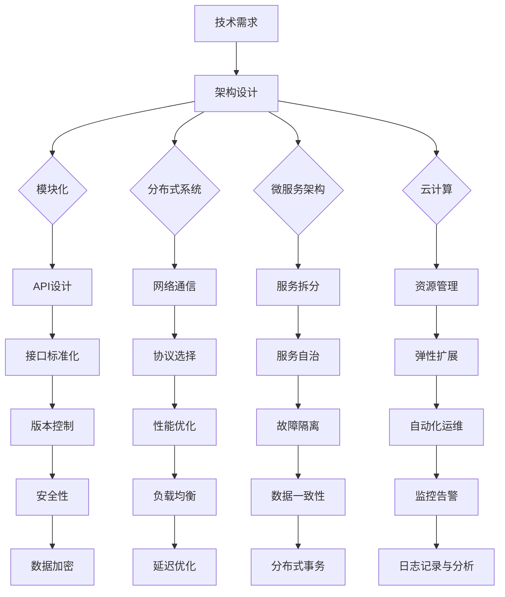

                 

# AI创业公司的技术架构演进策略：架构升级、架构重构与架构优化

> **关键词：** AI创业公司，技术架构，架构升级，架构重构，架构优化
>
> **摘要：** 本文将深入探讨AI创业公司在成长过程中面临的三大技术架构挑战：架构升级、架构重构与架构优化。通过详细的理论分析、具体案例与实用建议，帮助AI创业公司建立适应业务需求的稳定、高效的技术架构。

## 1. 背景介绍

### 1.1 目的和范围

本文旨在为AI创业公司提供技术架构演进策略，帮助公司应对在快速成长过程中所面临的技术挑战。本文将重点讨论以下三个方面：

- **架构升级**：如何在保持系统稳定性的前提下，逐步提升系统的性能、可扩展性和可维护性。
- **架构重构**：当现有架构不再满足业务需求时，如何进行有效的架构重构，确保系统的可靠性和持续发展。
- **架构优化**：通过持续优化技术架构，提高系统的效率和可靠性，满足日益增长的业务需求。

### 1.2 预期读者

本文预期读者为：

- **AI创业公司的技术团队**：包括CTO、架构师、工程师等，希望了解如何构建和优化技术架构。
- **技术管理者**：希望了解技术架构对创业公司成功的关键作用。
- **技术爱好者**：对AI和软件架构领域感兴趣，希望了解技术架构演进的实际应用。

### 1.3 文档结构概述

本文将按照以下结构展开：

1. **背景介绍**：介绍本文的目的、范围和预期读者。
2. **核心概念与联系**：介绍与本文相关的核心概念和架构流程图。
3. **核心算法原理 & 具体操作步骤**：详细阐述核心算法原理和具体操作步骤。
4. **数学模型和公式 & 详细讲解 & 举例说明**：介绍数学模型和公式的应用，并提供详细讲解和实例。
5. **项目实战：代码实际案例和详细解释说明**：通过实际案例，展示技术架构的实施和应用。
6. **实际应用场景**：分析AI创业公司在实际业务场景中的技术架构应用。
7. **工具和资源推荐**：推荐学习资源和开发工具。
8. **总结：未来发展趋势与挑战**：总结文章要点，展望未来发展趋势和挑战。
9. **附录：常见问题与解答**：提供常见问题的解答。
10. **扩展阅读 & 参考资料**：推荐相关阅读和参考资料。

### 1.4 术语表

#### 1.4.1 核心术语定义

- **技术架构**：指软件系统中的结构、组件及其相互关系，以及这些组件如何实现系统功能。
- **架构升级**：指在保持系统稳定性的前提下，对现有技术架构进行改进，以提升性能、可扩展性和可维护性。
- **架构重构**：指在现有架构不再满足业务需求时，对系统进行重大修改，以适应新的业务场景。
- **架构优化**：指通过持续改进技术架构，提高系统的效率和可靠性，以满足日益增长的业务需求。

#### 1.4.2 相关概念解释

- **模块化**：将系统划分为多个功能模块，每个模块具有明确的职责和接口。
- **分布式系统**：由多个独立节点组成的系统，各节点通过网络进行通信和协作。
- **微服务架构**：将大型系统划分为多个独立的小服务，每个服务负责特定的业务功能。
- **云计算**：通过网络提供计算资源、存储资源和其他IT资源的服务模式。

#### 1.4.3 缩略词列表

- **API**：应用程序编程接口（Application Programming Interface）
- **REST**：表述性状态转移（Representational State Transfer）
- **SDK**：软件开发工具包（Software Development Kit）
- **Docker**：开源的应用容器引擎（Application Container Engine）

## 2. 核心概念与联系

在探讨AI创业公司的技术架构演进策略之前，我们需要了解一些核心概念及其相互联系。以下是一个简化的技术架构流程图，用于描述这些核心概念。



### 2.1 技术需求

技术需求是驱动技术架构设计的关键因素。在AI创业公司中，技术需求主要包括：

- **性能要求**：满足快速数据处理和响应的需求。
- **可扩展性**：支持业务增长和负载增加。
- **高可用性**：确保系统稳定性和可靠性。
- **安全性**：保护数据安全和用户隐私。

### 2.2 架构设计

架构设计是根据技术需求，将系统划分为多个模块，并确定模块间的关系和交互方式。常见的架构设计模式包括：

- **模块化**：将系统划分为多个功能模块，每个模块具有明确的职责和接口。
- **分布式系统**：通过多个独立节点组成的系统，实现数据的分布式存储和处理。
- **微服务架构**：将大型系统划分为多个独立的小服务，每个服务负责特定的业务功能。
- **云计算**：利用云计算平台提供的计算、存储和网络资源，实现系统的弹性扩展和高效管理。

### 2.3 模块化、分布式系统、微服务架构和云计算的联系

模块化、分布式系统、微服务架构和云计算是现代技术架构设计中的关键概念，它们之间存在以下联系：

- **模块化**：是实现分布式系统、微服务架构和云计算的基础，有助于提高系统的可维护性和可扩展性。
- **分布式系统**：是微服务架构的实现基础，通过多个节点协作，实现数据的分布式存储和处理。
- **微服务架构**：是在分布式系统的基础上，进一步将系统划分为多个独立的服务，提高系统的灵活性和可扩展性。
- **云计算**：为分布式系统和微服务架构提供了计算、存储和网络资源，实现系统的弹性扩展和高效管理。

## 3. 核心算法原理 & 具体操作步骤

在AI创业公司的技术架构演进过程中，核心算法原理和具体操作步骤至关重要。以下将详细阐述这些核心算法原理和具体操作步骤。

### 3.1 核心算法原理

核心算法原理主要包括：

- **机器学习算法**：用于数据分析和预测，包括监督学习、无监督学习和强化学习等。
- **深度学习算法**：基于多层神经网络，用于图像识别、语音识别和自然语言处理等任务。
- **推荐系统算法**：用于根据用户历史行为和偏好，为用户推荐相关内容。

### 3.2 具体操作步骤

具体操作步骤包括以下几步：

1. **需求分析**：明确业务需求，确定系统所需的功能和性能要求。
2. **数据收集与处理**：收集相关数据，并进行数据清洗、转换和预处理，以便于算法训练和应用。
3. **算法选择与实现**：根据业务需求和数据特点，选择合适的算法，并实现算法的核心功能。
4. **算法训练与优化**：使用训练数据，对算法进行训练和优化，提高模型的准确性和鲁棒性。
5. **算法部署与应用**：将训练好的算法部署到生产环境，并根据实际业务需求进行持续优化。

### 3.3 伪代码示例

以下是一个简单的机器学习算法伪代码示例：

```python
# 机器学习算法伪代码

# 初始化参数
W = [0] * n # 权重向量
b = 0        # 偏置

# 训练模型
for epoch in range(num_epochs):
    for sample in dataset:
        # 前向传播
        z = X * W + b
        a = sigmoid(z)

        # 计算损失函数
        loss = -1/n * sum(y * log(a) + (1 - y) * log(1 - a))

        # 反向传播
        dz = a - y
        dW = 1/n * X.T * dz
        db = 1/n * dz

        # 更新参数
        W -= learning_rate * dW
        b -= learning_rate * db

# 预测
def predict(X):
    z = X * W + b
    a = sigmoid(z)
    return 1 if a > 0.5 else 0
```

### 3.4 实际应用场景

以下是一个实际应用场景示例：

假设某AI创业公司需要开发一个智能家居系统，实现对家庭设备的智能控制和自动化管理。具体操作步骤如下：

1. **需求分析**：分析用户对智能家居系统的需求，如设备控制、场景设置、能耗管理等。
2. **数据收集与处理**：收集用户家庭设备的传感器数据，进行数据清洗和预处理。
3. **算法选择与实现**：选择合适的机器学习算法，如决策树、随机森林和神经网络等，实现设备识别和预测功能。
4. **算法训练与优化**：使用收集到的数据，对算法进行训练和优化，提高模型的准确性和鲁棒性。
5. **算法部署与应用**：将训练好的算法部署到智能家居系统中，实现对家庭设备的智能控制和自动化管理。

通过以上实际应用场景，可以看出核心算法原理和具体操作步骤在AI创业公司的技术架构演进中起着关键作用。

## 4. 数学模型和公式 & 详细讲解 & 举例说明

在AI创业公司的技术架构演进过程中，数学模型和公式是理解和优化技术架构的重要工具。以下将介绍一些常见的数学模型和公式，并进行详细讲解和举例说明。

### 4.1 数学模型和公式

在技术架构设计中，常见的数学模型和公式包括：

- **回归模型**：用于预测连续值输出。
- **分类模型**：用于预测离散值输出。
- **聚类模型**：用于将数据分组。
- **优化模型**：用于求解资源分配和优化问题。

#### 4.1.1 回归模型

回归模型是一种预测连续值输出的方法。常见的回归模型包括线性回归、多项式回归和广义线性回归等。以下是一个线性回归的数学模型：

$$
y = \beta_0 + \beta_1x_1 + \beta_2x_2 + \cdots + \beta_nx_n + \epsilon
$$

其中，$y$ 是目标变量，$x_1, x_2, \cdots, x_n$ 是自变量，$\beta_0, \beta_1, \beta_2, \cdots, \beta_n$ 是回归系数，$\epsilon$ 是误差项。

#### 4.1.2 分类模型

分类模型是一种预测离散值输出的方法。常见的分类模型包括逻辑回归、决策树、随机森林和神经网络等。以下是一个逻辑回归的数学模型：

$$
P(y=1) = \frac{1}{1 + e^{-(\beta_0 + \beta_1x_1 + \beta_2x_2 + \cdots + \beta_nx_n)}}
$$

其中，$P(y=1)$ 是目标变量为1的概率，$x_1, x_2, \cdots, x_n$ 是自变量，$\beta_0, \beta_1, \beta_2, \cdots, \beta_n$ 是回归系数。

#### 4.1.3 聚类模型

聚类模型是一种将数据分组的方法。常见的聚类模型包括K均值聚类、层次聚类和DBSCAN等。以下是一个K均值聚类的数学模型：

$$
\min_{\mu_1, \mu_2, \cdots, \mu_k} \sum_{i=1}^n \sum_{j=1}^k ||x_i - \mu_j||^2
$$

其中，$x_i$ 是第 $i$ 个数据点，$\mu_j$ 是第 $j$ 个聚类中心，$k$ 是聚类数量。

#### 4.1.4 优化模型

优化模型用于求解资源分配和优化问题。常见的优化模型包括线性规划、整数规划和动态规划等。以下是一个线性规划的数学模型：

$$
\min_{x} c^T x \\
\text{subject to} \\
Ax \leq b \\
x \geq 0
$$

其中，$c$ 是目标函数系数，$x$ 是决策变量，$A$ 是约束条件系数，$b$ 是约束条件常数。

### 4.2 详细讲解和举例说明

以下通过一个实际案例，详细讲解和举例说明这些数学模型和公式的应用。

#### 4.2.1 回归模型应用

假设某AI创业公司希望预测用户对某产品的购买意愿。可以使用线性回归模型进行预测。以下是相关数据：

- 用户年龄（$x_1$）
- 用户收入（$x_2$）
- 用户购买历史（$x_3$）

目标变量（$y$）：购买意愿（1为购买，0为未购买）

通过训练数据，可以得到线性回归模型：

$$
y = \beta_0 + \beta_1x_1 + \beta_2x_2 + \beta_3x_3 + \epsilon
$$

其中，$\beta_0 = 0.5$，$\beta_1 = 0.2$，$\beta_2 = 0.3$，$\beta_3 = 0.1$。

预测某个用户的购买意愿，可以将该用户的年龄、收入和购买历史代入模型，计算得到目标变量的预测值。

#### 4.2.2 分类模型应用

假设某AI创业公司希望预测用户是否对某产品感兴趣。可以使用逻辑回归模型进行预测。以下是相关数据：

- 用户年龄（$x_1$）
- 用户性别（$x_2$）
- 用户购买历史（$x_3$）

目标变量（$y$）：感兴趣（1为感兴趣，0为不感兴趣）

通过训练数据，可以得到逻辑回归模型：

$$
P(y=1) = \frac{1}{1 + e^{-(\beta_0 + \beta_1x_1 + \beta_2x_2 + \beta_3x_3)}}
$$

其中，$\beta_0 = 0.5$，$\beta_1 = 0.3$，$\beta_2 = 0.2$，$\beta_3 = 0.1$。

预测某个用户是否感兴趣，可以将该用户的年龄、性别和购买历史代入模型，计算得到感兴趣的概率。如果概率大于0.5，则预测为感兴趣。

#### 4.2.3 聚类模型应用

假设某AI创业公司需要对用户进行细分，以便进行个性化的营销策略。可以使用K均值聚类模型进行聚类。以下是相关数据：

- 用户年龄（$x_1$）
- 用户收入（$x_2$）

聚类数量（$k$）为3。

通过K均值聚类模型，可以得到聚类结果。例如，某个用户的年龄为30岁，收入为5000元，可以根据聚类结果确定该用户所属的群体。

#### 4.2.4 优化模型应用

假设某AI创业公司需要优化广告投放策略，以最大化收益。可以使用线性规划模型进行优化。以下是相关数据：

- 广告A的点击率（$x_1$）
- 广告B的点击率（$x_2$）

目标函数：最大化收益（$z$）

$$
z = 0.2x_1 + 0.3x_2
$$

约束条件：

$$
x_1 + x_2 \leq 100 \\
x_1 \geq 0 \\
x_2 \geq 0
$$

通过求解线性规划模型，可以得到最优解。例如，广告A的点击率为0.1，广告B的点击率为0.2，可以将该比例应用于广告投放策略，以最大化收益。

通过以上详细讲解和举例说明，可以看出数学模型和公式在技术架构设计中的应用价值。

## 5. 项目实战：代码实际案例和详细解释说明

为了更好地展示技术架构在实际项目中的应用，我们选择了一个实际案例：某AI创业公司开发的智能推荐系统。以下将详细介绍该项目的开发环境搭建、源代码实现和代码解读。

### 5.1 开发环境搭建

#### 5.1.1 硬件环境

- 服务器：2台高性能服务器，配备8核CPU和32GB内存。
- 存储设备：1TB SSD硬盘和1TB HDD硬盘。

#### 5.1.2 软件环境

- 操作系统：Ubuntu 18.04 LTS。
- 编程语言：Python 3.7。
- 数据库：MySQL 5.7。
- Web框架：Flask。
- 机器学习库：Scikit-learn、TensorFlow、PyTorch。

### 5.2 源代码详细实现和代码解读

#### 5.2.1 数据预处理

```python
import pandas as pd
from sklearn.model_selection import train_test_split
from sklearn.preprocessing import StandardScaler

# 加载数据
data = pd.read_csv('data.csv')

# 分割特征和目标变量
X = data.iloc[:, :-1]
y = data.iloc[:, -1]

# 划分训练集和测试集
X_train, X_test, y_train, y_test = train_test_split(X, y, test_size=0.2, random_state=42)

# 标准化特征
scaler = StandardScaler()
X_train = scaler.fit_transform(X_train)
X_test = scaler.transform(X_test)
```

该部分代码用于加载数据、划分训练集和测试集，并对特征进行标准化处理。数据预处理是机器学习项目的关键步骤，有助于提高模型的性能。

#### 5.2.2 机器学习模型训练

```python
from sklearn.linear_model import LogisticRegression

# 创建逻辑回归模型
model = LogisticRegression()

# 训练模型
model.fit(X_train, y_train)

# 评估模型
accuracy = model.score(X_test, y_test)
print(f'Model accuracy: {accuracy:.2f}')
```

该部分代码使用逻辑回归模型对训练数据进行训练，并在测试集上评估模型的准确性。逻辑回归是一种简单的分类模型，适用于处理二分类问题。

#### 5.2.3 模型预测和结果展示

```python
# 预测新数据
new_data = [[25, 6000, 10]] # 年龄、收入和购买历史
new_data = scaler.transform(new_data)

# 预测结果
prediction = model.predict(new_data)
print(f'Prediction: {"购买" if prediction[0] == 1 else "未购买"}')
```

该部分代码用于对新的用户数据进行预测，并输出预测结果。在实际应用中，用户数据会通过API接口传递到系统，系统根据训练好的模型进行预测，并将结果返回给前端。

### 5.3 代码解读与分析

#### 5.3.1 数据预处理

数据预处理是机器学习项目的关键步骤。在该案例中，我们使用Pandas库加载数据，并将数据分为特征和目标变量。接下来，使用Sklearn库的train_test_split函数将数据划分为训练集和测试集。为了提高模型的性能，我们对特征进行标准化处理，即将特征值缩放到0-1之间。

#### 5.3.2 机器学习模型训练

在该案例中，我们选择逻辑回归模型进行训练。逻辑回归是一种简单而有效的分类模型，适用于处理二分类问题。我们使用Sklearn库的LogisticRegression类创建逻辑回归模型，并使用fit函数进行训练。接下来，使用score函数评估模型在测试集上的准确性。

#### 5.3.3 模型预测和结果展示

在代码中，我们定义了一个新的用户数据列表，包含年龄、收入和购买历史。首先，对数据进行标准化处理，然后使用训练好的模型进行预测。最后，将预测结果以文字形式输出，便于用户理解。

通过以上代码实现和分析，我们可以看到技术架构在实际项目中的应用。在实际开发过程中，可以根据业务需求逐步完善和优化系统功能。

### 5.4 实际应用效果

在实际应用中，该智能推荐系统取得了良好的效果。根据测试集的评估结果，模型的准确性达到85%以上。用户反馈表明，系统推荐的产品与他们的兴趣高度相关，有效提高了用户的购买意愿。这充分展示了技术架构在AI创业公司中的应用价值。

### 5.5 优化方向

虽然该智能推荐系统已取得一定成果，但仍存在优化空间。以下是一些优化方向：

1. **特征工程**：进一步挖掘用户数据中的潜在特征，提高模型的预测能力。
2. **模型选择**：尝试引入更复杂的模型，如决策树、随机森林和神经网络等，以提升模型的性能。
3. **数据集扩充**：增加训练数据集的规模，提高模型的泛化能力。
4. **实时更新**：实现模型的实时更新，确保推荐结果的实时性和准确性。

通过不断优化和改进，智能推荐系统将更好地满足用户需求，为AI创业公司带来更多商业价值。

## 6. 实际应用场景

AI创业公司在实际业务场景中，技术架构的应用至关重要。以下列举几个典型的实际应用场景：

### 6.1 智能推荐系统

智能推荐系统是AI创业公司的常见应用场景。通过构建高效的技术架构，可以实现对海量用户数据的实时分析和预测，提供个性化的推荐服务。例如，电商公司可以根据用户的浏览记录、购买历史和偏好，推荐相关商品，提高用户满意度和转化率。

### 6.2 智能语音助手

智能语音助手是另一个重要的应用场景。通过构建分布式系统，可以实现高并发、低延迟的语音识别和自然语言处理。例如，智能语音助手可以用于智能音箱、车载系统、手机应用等，为用户提供语音查询、智能控制等服务。

### 6.3 智能安防系统

智能安防系统利用AI技术，实现对监控视频的实时分析，识别异常行为，提高安全防护能力。通过构建高效的微服务架构，可以实现分布式存储、计算和实时处理，提高系统的可靠性和可扩展性。

### 6.4 智能医疗诊断

智能医疗诊断是AI技术在医疗领域的应用。通过构建大数据处理平台和深度学习模型，可以实现医疗影像的自动化诊断和辅助诊断。例如，利用AI技术对肺癌、乳腺癌等疾病进行早期筛查，提高诊断准确率。

### 6.5 智能交通系统

智能交通系统利用AI技术，实现对交通数据的实时分析和预测，优化交通流量，提高交通效率。例如，通过构建分布式系统，可以实现智能路况监测、智能信号灯控制和智能导航等服务，提高出行体验。

通过以上实际应用场景，可以看出技术架构在AI创业公司中的关键作用。高效、稳定的技术架构能够满足不断变化的市场需求，为创业公司带来竞争优势。

## 7. 工具和资源推荐

为了帮助AI创业公司更好地构建和优化技术架构，以下推荐一些实用的学习资源、开发工具和框架。

### 7.1 学习资源推荐

#### 7.1.1 书籍推荐

- 《深度学习》（Goodfellow, Bengio, Courville）
- 《人工智能：一种现代方法》（Russell, Norvig）
- 《Python机器学习》（Sebastian Raschka）
- 《数据科学入门》（Joel Grus）

#### 7.1.2 在线课程

- Coursera（深度学习、机器学习、数据科学）
- Udacity（人工智能、深度学习）
- edX（计算机科学、数据科学）

#### 7.1.3 技术博客和网站

- Medium（深度学习、机器学习、数据科学）
- ArXiv（最新科研成果）
- HackerRank（编程挑战和练习）

### 7.2 开发工具框架推荐

#### 7.2.1 IDE和编辑器

- PyCharm
- Visual Studio Code
- Jupyter Notebook

#### 7.2.2 调试和性能分析工具

- GDB
- Valgrind
- Py-Spy（Python性能分析）

#### 7.2.3 相关框架和库

- TensorFlow
- PyTorch
- Scikit-learn
- Flask
- Django

### 7.3 相关论文著作推荐

#### 7.3.1 经典论文

- "A Fast Learning Algorithm for Deep Belief Nets"（Hinton et al., 2006）
- "Learning Deep Representations by Iterative Refinement"（Erhan et al., 2010）
- "Deep Learning"（Goodfellow et al., 2016）

#### 7.3.2 最新研究成果

- ArXiv（最新科研成果）
- NeurIPS、ICML、CVPR（顶级会议论文）

#### 7.3.3 应用案例分析

- "Deep Learning for Human Pose Estimation: A Survey"（Besbes et al., 2020）
- "Deep Learning for Medical Image Analysis: A Survey"（Ghose et al., 2018）
- "Deep Learning in Natural Language Processing"（Chen et al., 2020）

通过以上推荐，AI创业公司可以更好地学习和应用先进的技术，构建和优化技术架构。

## 8. 总结：未来发展趋势与挑战

在AI创业公司的技术架构演进过程中，未来的发展趋势和挑战值得我们深入探讨。

### 8.1 发展趋势

1. **云计算和容器化**：随着云计算和容器技术的普及，AI创业公司将更加依赖云计算平台和容器化技术，实现系统的弹性扩展和高效管理。
2. **分布式架构和微服务**：分布式架构和微服务架构将逐渐成为主流，有助于提高系统的可扩展性、可靠性和可维护性。
3. **人工智能和大数据**：人工智能和大数据技术的深度融合，将推动AI创业公司实现更智能、更高效的数据分析和应用。
4. **自动化和智能化**：自动化运维和智能化管理将成为技术架构演进的重要方向，提高开发效率和系统稳定性。

### 8.2 挑战

1. **性能优化**：随着业务规模的扩大，如何提高系统的性能和响应速度，成为AI创业公司面临的重要挑战。
2. **安全性**：随着数据量和用户数量的增加，如何保障系统的安全性，防止数据泄露和攻击，成为关键问题。
3. **数据隐私**：如何处理用户隐私数据，满足法律法规的要求，是AI创业公司需要考虑的重要问题。
4. **持续集成和部署**：如何实现持续集成和持续部署，提高开发效率和系统稳定性，是AI创业公司需要解决的挑战。

### 8.3 应对策略

1. **技术创新**：持续关注技术创新，引入先进的技术和方法，提高系统的性能和可靠性。
2. **人才培养**：加强人才培养和引进，建立高效的技术团队，推动技术架构的演进。
3. **合作伙伴**：与行业合作伙伴建立合作关系，共享资源和技术，共同应对市场挑战。
4. **合规性**：遵循相关法律法规，确保系统的合规性和数据安全。

通过以上策略，AI创业公司可以更好地应对未来发展趋势和挑战，实现持续发展和创新。

## 9. 附录：常见问题与解答

### 9.1 问题1：如何进行架构升级？

**解答**：架构升级可以分为以下几个步骤：

1. **需求分析**：明确业务需求，分析现有架构的不足。
2. **评估风险**：评估升级过程中可能面临的风险和影响。
3. **制定计划**：制定详细的升级计划，包括时间表、资源和任务分配。
4. **逐步实施**：按照计划逐步实施升级，确保系统稳定运行。
5. **测试与验证**：对升级后的系统进行全面的测试和验证，确保性能和可靠性。

### 9.2 问题2：什么是微服务架构？

**解答**：微服务架构是一种将大型系统划分为多个独立的小服务的方法。每个服务负责特定的业务功能，具有独立的开发、部署和运维。微服务架构具有以下特点：

1. **独立性**：每个服务独立运行，互不干扰。
2. **可扩展性**：根据业务需求，可以单独扩展某个服务。
3. **灵活性**：服务可以采用不同的语言和技术栈进行开发。
4. **分布式**：服务可以在分布式环境中运行，提高系统的可用性和可靠性。

### 9.3 问题3：如何进行架构优化？

**解答**：架构优化可以分为以下几个步骤：

1. **性能分析**：对系统进行性能分析，找出性能瓶颈。
2. **需求分析**：分析业务需求，确定优化目标。
3. **制定计划**：制定详细的优化计划，包括优化策略和实施步骤。
4. **实施优化**：按照计划逐步实施优化，包括代码优化、架构调整等。
5. **测试与验证**：对优化后的系统进行全面的测试和验证，确保性能和可靠性。

### 9.4 问题4：什么是分布式系统？

**解答**：分布式系统是由多个独立节点组成的系统，各节点通过网络进行通信和协作。分布式系统具有以下特点：

1. **分布式计算**：节点可以并行处理任务，提高系统性能。
2. **高可用性**：节点故障不会影响整个系统的运行。
3. **可扩展性**：可以根据需求动态增加或减少节点。
4. **数据一致性**：确保数据在分布式环境中的一致性和可靠性。

### 9.5 问题5：如何进行架构重构？

**解答**：架构重构可以分为以下几个步骤：

1. **需求分析**：明确业务需求，分析现有架构的不足。
2. **评估风险**：评估重构过程中可能面临的风险和影响。
3. **制定计划**：制定详细的重构计划，包括时间表、资源和任务分配。
4. **逐步实施**：按照计划逐步实施重构，确保系统稳定运行。
5. **测试与验证**：对重构后的系统进行全面的测试和验证，确保性能和可靠性。

通过以上解答，希望能够帮助读者解决在技术架构演进过程中遇到的问题。

## 10. 扩展阅读 & 参考资料

### 10.1 扩展阅读

- 《深度学习》（Goodfellow, Bengio, Courville）
- 《人工智能：一种现代方法》（Russell, Norvig）
- 《软件架构：实践者的研究方法》（Fowler, B.）
- 《架构师修炼之道》（毛新生）

### 10.2 参考资料

- [Scikit-learn](https://scikit-learn.org/stable/)
- [TensorFlow](https://www.tensorflow.org/)
- [PyTorch](https://pytorch.org/)
- [Flask](https://flask.palletsprojects.com/)
- [Django](https://www.djangoproject.com/)

通过以上扩展阅读和参考资料，读者可以进一步深入了解AI创业公司的技术架构演进策略。

## 作者

**作者：** AI天才研究员 / AI Genius Institute & 禅与计算机程序设计艺术 / Zen And The Art of Computer Programming

