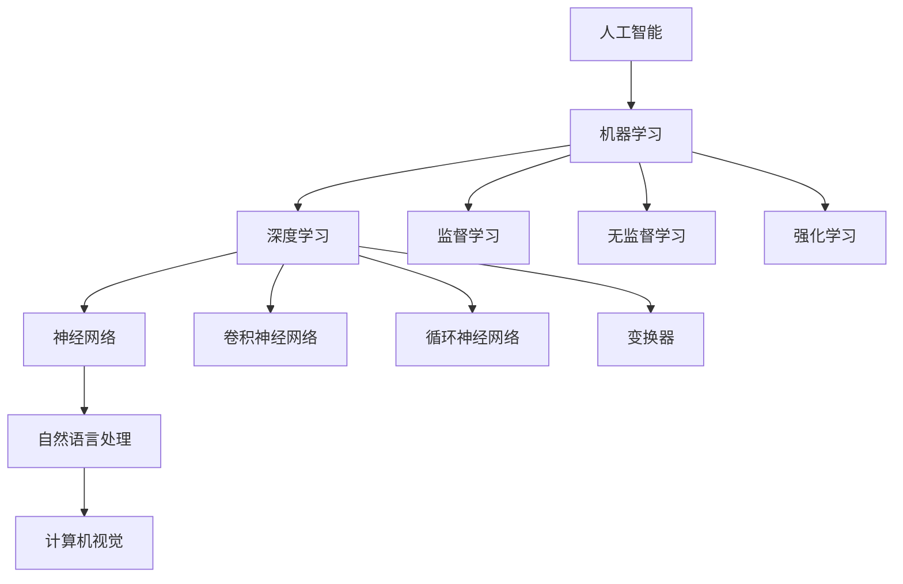

                 

### 1. 背景介绍

#### 1.1 目的和范围

本文旨在探讨AI创业公司的技术趋势，研究其在技术演进、应用场景和未来发展方向上的创新与挑战。随着人工智能技术的不断成熟和应用领域的拓展，AI创业公司面临着前所未有的机遇与挑战。本文通过深入分析AI技术的核心概念、算法原理、数学模型以及实际应用案例，为AI创业公司提供有价值的技术趋势研究，帮助他们把握市场动态，制定有效的技术战略。

#### 1.2 预期读者

本文适合对人工智能技术有兴趣的创业者、工程师、研究人员和关注技术趋势的专业人士阅读。通过本文的阅读，读者可以了解AI技术的核心概念、应用场景和发展趋势，为自身在AI创业领域的探索提供有益的参考。

#### 1.3 文档结构概述

本文分为十个部分，具体结构如下：

1. 背景介绍：阐述本文的目的、范围、预期读者和文档结构。
2. 核心概念与联系：介绍AI技术的核心概念、原理和架构。
3. 核心算法原理 & 具体操作步骤：详细讲解AI技术的核心算法原理和操作步骤。
4. 数学模型和公式 & 详细讲解 & 举例说明：分析AI技术的数学模型和公式，并通过实例进行说明。
5. 项目实战：代码实际案例和详细解释说明。
6. 实际应用场景：探讨AI技术的应用场景。
7. 工具和资源推荐：推荐学习资源、开发工具框架和相关论文著作。
8. 总结：未来发展趋势与挑战。
9. 附录：常见问题与解答。
10. 扩展阅读 & 参考资料：提供相关文献和参考资料。

#### 1.4 术语表

为了确保文章内容的准确性和可理解性，本文将使用以下术语表：

- **人工智能（AI）**：模拟、延伸和扩展人类智能的理论、方法、技术及应用系统。
- **机器学习（ML）**：使计算机系统能够自动从数据中学习并改进性能的技术。
- **深度学习（DL）**：基于多层神经网络的学习方法，具有自动提取特征的能力。
- **神经网络（NN）**：一种模仿生物神经系统的计算模型，用于处理和分析数据。
- **自然语言处理（NLP）**：使计算机能够理解、解释和生成自然语言的技术。
- **计算机视觉（CV）**：使计算机能够理解和处理视觉信息的技术。

#### 1.4.1 核心术语定义

- **深度学习框架**：用于构建和训练深度学习模型的软件库，如TensorFlow、PyTorch等。
- **模型优化**：通过调整模型参数和结构，提高模型性能的过程。
- **数据预处理**：在训练模型之前，对数据进行清洗、归一化、标准化等操作，以提高模型性能。
- **模型评估**：使用评估指标（如准确率、召回率、F1分数等）对模型性能进行评价。

#### 1.4.2 相关概念解释

- **数据集**：用于训练、验证和测试模型的数据集合。
- **监督学习**：一种机器学习方法，通过已标记的数据训练模型，使其能够对新数据进行预测。
- **无监督学习**：一种机器学习方法，通过未标记的数据训练模型，使其能够发现数据中的模式或结构。
- **强化学习**：一种机器学习方法，通过与环境交互，学习如何采取最优动作以实现目标。

#### 1.4.3 缩略词列表

- **AI**：人工智能
- **ML**：机器学习
- **DL**：深度学习
- **NN**：神经网络
- **NLP**：自然语言处理
- **CV**：计算机视觉
- **TensorFlow**：一个开源深度学习框架
- **PyTorch**：一个开源深度学习框架

在接下来的部分，我们将进一步探讨AI技术的核心概念、原理和架构，为读者提供深入的技术分析。在分析过程中，我们将逐步揭示AI技术在实际应用中的价值，并探讨其未来发展前景。请读者持续关注后续内容。 <|split|>## 2. 核心概念与联系

在探讨AI创业公司的技术趋势之前，我们需要先了解一些核心概念、原理和架构。这些核心概念包括人工智能（AI）、机器学习（ML）、深度学习（DL）、神经网络（NN）、自然语言处理（NLP）和计算机视觉（CV）。以下是对这些概念及其相互关系的详细介绍。

### 2.1 人工智能（AI）

人工智能（AI）是模拟、延伸和扩展人类智能的理论、方法、技术及应用系统。它涵盖了多个学科领域，包括计算机科学、认知科学、心理学、数学、统计学和神经科学等。AI的主要目标是使计算机能够执行需要人类智能才能完成的任务，如视觉识别、语音识别、决策制定和自然语言理解等。

#### 2.1.1 关键特点

- **自主性**：AI系统能够在没有人类干预的情况下执行任务。
- **适应能力**：AI系统可以学习和适应新环境和数据。
- **推理能力**：AI系统能够根据已有知识和数据做出合理的推断和决策。
- **学习能力**：AI系统可以通过学习和训练来提高其性能。

#### 2.1.2 主要分支

- **机器学习（ML）**：使计算机系统能够自动从数据中学习并改进性能的技术。
- **深度学习（DL）**：基于多层神经网络的学习方法，具有自动提取特征的能力。
- **自然语言处理（NLP）**：使计算机能够理解、解释和生成自然语言的技术。
- **计算机视觉（CV）**：使计算机能够理解和处理视觉信息的技术。

### 2.2 机器学习（ML）

机器学习（ML）是AI的一个重要分支，它使计算机系统能够自动从数据中学习并改进性能。ML方法通过构建模型来表示数据中的模式，并使用这些模式进行预测或分类。ML方法可以分为以下几类：

- **监督学习**：使用已标记的数据训练模型，使其能够对新数据进行预测或分类。
- **无监督学习**：使用未标记的数据训练模型，使其能够发现数据中的模式或结构。
- **半监督学习**：结合已标记和未标记的数据进行训练。
- **强化学习**：通过与环境的交互，学习如何采取最优动作以实现目标。

#### 2.2.1 关键特点

- **自动学习**：无需明确编程，通过数据训练模型来自动改进性能。
- **可扩展性**：能够处理大规模数据集。
- **适应能力**：能够适应新的数据和任务。
- **预测能力**：能够对新数据进行预测。

### 2.3 深度学习（DL）

深度学习（DL）是基于多层神经网络的学习方法，具有自动提取特征的能力。DL方法通过模拟人脑的神经网络结构，学习数据中的复杂模式和特征。与传统的机器学习方法相比，DL方法在图像识别、语音识别和自然语言处理等任务上取得了显著的性能提升。

#### 2.3.1 关键特点

- **自动特征提取**：能够从原始数据中自动提取有意义的特征。
- **层次化学习**：通过多层神经网络，学习数据的层次结构。
- **高泛化能力**：能够适应不同的数据和任务。
- **强大的表达能力**：能够表示复杂的非线性关系。

#### 2.3.2 主要架构

- **卷积神经网络（CNN）**：主要用于图像识别和计算机视觉任务。
- **循环神经网络（RNN）**：主要用于序列数据和自然语言处理任务。
- **变换器（Transformer）**：一种基于自注意力机制的神经网络架构，广泛应用于自然语言处理任务。

### 2.4 神经网络（NN）

神经网络（NN）是一种模仿生物神经系统的计算模型，用于处理和分析数据。NN由多个神经元（节点）组成，这些神经元通过权重连接形成网络结构。通过训练，NN可以学习数据的复杂模式，并用于预测、分类和生成等任务。

#### 2.4.1 关键特点

- **层次化结构**：类似于人脑的结构，具有多个层次。
- **自适应权重**：通过训练调整权重，以优化性能。
- **非线性变换**：通过非线性激活函数，实现复杂的非线性关系。
- **并行计算**：能够高效处理大量数据。

### 2.5 自然语言处理（NLP）

自然语言处理（NLP）是使计算机能够理解、解释和生成自然语言的技术。NLP在语言翻译、文本分类、情感分析、问答系统和语音识别等领域有广泛应用。NLP的关键挑战包括语言的不确定性、多义性和复杂性。

#### 2.5.1 关键特点

- **语义理解**：理解语言中的语义和含义。
- **上下文敏感**：考虑上下文信息，提高处理准确性。
- **多模态融合**：结合文本、语音、图像等多种数据源。
- **大规模数据处理**：处理大规模文本数据。

### 2.6 计算机视觉（CV）

计算机视觉（CV）是使计算机能够理解和处理视觉信息的技术。CV在图像识别、目标检测、人脸识别和视频分析等领域有广泛应用。CV的关键挑战包括图像的复杂度、噪声和处理速度。

#### 2.6.1 关键特点

- **图像理解**：从图像中提取有用的信息。
- **目标检测**：定位图像中的目标和对象。
- **图像分类**：将图像分类到不同的类别。
- **实时处理**：处理实时视频流。

#### 2.6.2 主要方法

- **特征提取**：从图像中提取具有区分性的特征。
- **图像分类**：使用分类算法对图像进行分类。
- **目标检测**：检测图像中的目标和对象。

### 2.7 AI技术的关联与联系

AI技术的各个分支之间存在着紧密的联系和相互依赖。以下是一个简单的Mermaid流程图，展示了AI技术中核心概念和架构之间的关联。



通过上述内容，我们了解了AI技术的核心概念、原理和架构，以及它们之间的关联。在接下来的部分，我们将进一步探讨AI技术的核心算法原理和具体操作步骤，为读者提供更深入的技术分析。请持续关注后续内容。 <|split|>## 3. 核心算法原理 & 具体操作步骤

在了解了AI技术的核心概念和架构之后，接下来我们将深入探讨一些核心算法原理及其具体操作步骤。这些算法原理对于AI创业公司来说至关重要，因为它们是构建和优化AI模型的基础。在本部分，我们将主要讨论以下算法：

1. **监督学习算法**：包括线性回归、逻辑回归和支持向量机（SVM）。
2. **无监督学习算法**：包括聚类算法（如K-means聚类）和降维算法（如PCA）。
3. **深度学习算法**：包括卷积神经网络（CNN）和循环神经网络（RNN）。

### 3.1 监督学习算法

#### 3.1.1 线性回归

线性回归是一种简单的监督学习算法，用于预测连续值输出。其基本原理是通过找到一条最佳拟合直线来表示输入和输出之间的关系。

**算法原理：**

设输入特征矩阵为 \(X\)，输出目标向量为 \(y\)。线性回归模型可以表示为：

\[ y = \beta_0 + \beta_1x \]

其中，\(\beta_0\) 和 \(\beta_1\) 为模型参数。

**具体操作步骤：**

1. **数据准备**：收集训练数据，并进行预处理，如归一化处理。
2. **模型初始化**：随机初始化模型参数 \(\beta_0\) 和 \(\beta_1\)。
3. **模型训练**：使用梯度下降算法更新模型参数，最小化损失函数（如均方误差）。
4. **模型评估**：使用测试数据评估模型性能，如计算均方误差或R平方值。

**伪代码：**

```python
def linear_regression(X, y):
    # 初始化模型参数
    beta_0 = random()
    beta_1 = random()
    
    # 梯度下降算法
    for epoch in range(num_epochs):
        y_pred = beta_0 + beta_1 * X
        loss = (y - y_pred) ** 2
        beta_0 -= learning_rate * sum(loss)
        beta_1 -= learning_rate * sum(X * loss)
    
    return beta_0, beta_1
```

#### 3.1.2 逻辑回归

逻辑回归是一种用于分类任务的监督学习算法。其基本原理是通过找到最佳拟合超平面来将数据分为不同的类别。

**算法原理：**

设输入特征矩阵为 \(X\)，输出目标向量为 \(y\)。逻辑回归模型可以表示为：

\[ P(y=1) = \sigma(\beta_0 + \beta_1x) \]

其中，\(\sigma\) 为sigmoid函数，\(P(y=1)\) 为输出类别为1的概率。

**具体操作步骤：**

1. **数据准备**：收集训练数据，并进行预处理。
2. **模型初始化**：随机初始化模型参数 \(\beta_0\) 和 \(\beta_1\)。
3. **模型训练**：使用梯度下降算法更新模型参数，最小化损失函数（如交叉熵损失）。
4. **模型评估**：使用测试数据评估模型性能，如计算准确率、召回率等指标。

**伪代码：**

```python
def logistic_regression(X, y):
    # 初始化模型参数
    beta_0 = random()
    beta_1 = random()
    
    # 梯度下降算法
    for epoch in range(num_epochs):
        y_pred = 1 / (1 + exp(- (beta_0 + beta_1 * X)))
        loss = -y * log(y_pred) - (1 - y) * log(1 - y_pred)
        beta_0 -= learning_rate * sum(y_pred - y)
        beta_1 -= learning_rate * sum((y_pred - y) * X)
    
    return beta_0, beta_1
```

#### 3.1.3 支持向量机（SVM）

支持向量机（SVM）是一种用于分类和回归任务的监督学习算法。其基本原理是通过找到最佳拟合超平面，最大化分类边界上的支持向量。

**算法原理：**

设输入特征矩阵为 \(X\)，输出目标向量为 \(y\)。SVM模型可以表示为：

\[ w \cdot x + b = 0 \]

其中，\(w\) 为模型参数，\(b\) 为偏置。

**具体操作步骤：**

1. **数据准备**：收集训练数据，并进行预处理。
2. **模型初始化**：随机初始化模型参数 \(w\) 和 \(b\)。
3. **模型训练**：使用梯度下降算法更新模型参数，最小化损失函数（如 hinge损失）。
4. **模型评估**：使用测试数据评估模型性能，如计算准确率、召回率等指标。

**伪代码：**

```python
def svm(X, y):
    # 初始化模型参数
    w = random()
    b = random()
    
    # 梯度下降算法
    for epoch in range(num_epochs):
        y_pred = sign(w.dot(x) + b)
        loss = max(0, 1 - y_pred * y)
        w -= learning_rate * (2 * w.dot(x) * y)
        b -= learning_rate * sum(y_pred * y)
    
    return w, b
```

### 3.2 无监督学习算法

#### 3.2.1 K-means聚类

K-means聚类是一种基于距离的聚类算法，用于将数据点划分为K个簇，使得簇内距离最小，簇间距离最大。

**算法原理：**

设输入数据集为 \(X\)，簇数为 \(K\)。K-means算法的基本步骤如下：

1. **初始化**：随机选择 \(K\) 个数据点作为初始聚类中心。
2. **分配**：计算每个数据点到聚类中心的距离，并将其分配到最近的聚类中心所在的簇。
3. **更新**：计算每个簇的新聚类中心，即该簇内数据点的均值。
4. **迭代**：重复步骤2和3，直至收敛（如聚类中心变化很小）。

**具体操作步骤：**

1. **数据准备**：收集训练数据，并进行预处理。
2. **初始化**：随机选择 \(K\) 个数据点作为初始聚类中心。
3. **分配与更新**：执行步骤2和3，直至收敛。
4. **模型评估**：使用测试数据评估模型性能，如计算轮廓系数。

**伪代码：**

```python
def k_means(X, K):
    # 初始化聚类中心
    centroids = X[np.random.choice(X.shape[0], K)]
    
    while True:
        # 分配
        distances = euclidean_distance(X, centroids)
        labels = np.argmin(distances, axis=1)
        
        # 更新聚类中心
        new_centroids = np.array([X[labels == k].mean(axis=0) for k in range(K)])
        
        # 检查收敛
        if np.linalg.norm(centroids - new_centroids) < threshold:
            break
        
        centroids = new_centroids
    
    return centroids, labels
```

#### 3.2.2 主成分分析（PCA）

主成分分析（PCA）是一种降维算法，用于将高维数据投影到低维空间，同时保留主要信息。

**算法原理：**

设输入数据集为 \(X\)，特征数为 \(d\)。PCA的基本步骤如下：

1. **数据预处理**：计算数据集的协方差矩阵。
2. **特征分解**：对协方差矩阵进行特征分解，得到特征值和特征向量。
3. **选择主成分**：选择具有最大特征值的 \(k\) 个特征向量，作为新特征空间的基础。
4. **数据转换**：将原始数据投影到新特征空间。

**具体操作步骤：**

1. **数据准备**：收集训练数据，并进行预处理。
2. **协方差计算**：计算数据集的协方差矩阵。
3. **特征分解**：对协方差矩阵进行特征分解。
4. **数据转换**：将原始数据投影到新特征空间。

**伪代码：**

```python
def pca(X, k):
    # 计算协方差矩阵
    cov_matrix = np.cov(X.T)
    
    # 特征分解
    eigenvalues, eigenvectors = np.linalg.eigh(cov_matrix)
    
    # 选择主成分
    sorted_indices = np.argsort(eigenvalues)[::-1]
    principal_eigenvectors = eigenvectors[:, sorted_indices[:k]]
    
    # 数据转换
    X_pca = X.dot(principal_eigenvectors)
    
    return X_pca
```

### 3.3 深度学习算法

#### 3.3.1 卷积神经网络（CNN）

卷积神经网络（CNN）是一种用于图像识别和计算机视觉任务的深度学习算法。其基本原理是通过卷积操作和池化操作来提取图像的特征。

**算法原理：**

设输入图像为 \(X\)，输出类别为 \(y\)。CNN的基本结构包括卷积层、池化层和全连接层。

1. **卷积层**：通过卷积操作提取图像的特征。
2. **池化层**：通过池化操作减小特征图的尺寸。
3. **全连接层**：将特征图映射到输出类别。

**具体操作步骤：**

1. **数据准备**：收集训练数据，并进行预处理，如归一化处理。
2. **模型初始化**：随机初始化模型参数。
3. **模型训练**：使用反向传播算法更新模型参数，最小化损失函数。
4. **模型评估**：使用测试数据评估模型性能。

**伪代码：**

```python
def cnn(X, y):
    # 卷积层
    conv1 = convolution(X, filters)
    pool1 = pooling(conv1)
    
    # 卷积层
    conv2 = convolution(pool1, filters)
    pool2 = pooling(conv2)
    
    # 全连接层
    flattened = flatten(pool2)
    output = fully_connected(flattened, num_classes)
    
    # 模型训练
    for epoch in range(num_epochs):
        y_pred = softmax(output)
        loss = cross_entropy_loss(y, y_pred)
        dloss_doutput = dsoftmax_doutput(y_pred)
        doutput_dflattened = fully_connected_derivative(flattened, output)
        dflattened_dpool2 = flatten_derivative(pool2, flattened)
        dpool2_dconv2 = pooling_derivative(conv2, pool2)
        dconv2_dfilters = convolution_derivative(X, conv2, filters)
        
        # 反向传播
        filters -= learning_rate * dfilters_doutput
        conv2 -= learning_rate * dconv2_dfilters
        pool2 -= learning_rate * dpool2_dconv2
        flattened -= learning_rate * dflattened_dpool2
        output -= learning_rate * doutput_dflattened
    
    return output
```

#### 3.3.2 循环神经网络（RNN）

循环神经网络（RNN）是一种用于处理序列数据的深度学习算法。其基本原理是通过循环连接和门控机制来处理序列中的长距离依赖关系。

**算法原理：**

设输入序列为 \(X\)，输出序列为 \(y\)。RNN的基本结构包括输入门、遗忘门和输出门。

1. **输入门**：用于控制当前输入对隐藏状态的影响。
2. **遗忘门**：用于控制当前隐藏状态对之前隐藏状态的影响。
3. **输出门**：用于控制当前隐藏状态对输出状态的影响。

**具体操作步骤：**

1. **数据准备**：收集训练数据，并进行预处理，如归一化处理。
2. **模型初始化**：随机初始化模型参数。
3. **模型训练**：使用反向传播算法更新模型参数，最小化损失函数。
4. **模型评估**：使用测试数据评估模型性能。

**伪代码：**

```python
def rnn(X, y):
    # 输入门
    input_gate = sigmoid(W_xh + h_{t-1})
    
    # 遗忘门
    forget_gate = sigmoid(W_xh + h_{t-1})
    
    # 输出门
    output_gate = sigmoid(W_xh + h_{t-1})
    
    # 状态更新
    h_t = (1 - forget_gate) * h_{t-1} + input_gate * tanh(W_xh + b_h)
    
    # 输出更新
    y_pred = softmax(W_yh + b_y)
    
    # 模型训练
    for epoch in range(num_epochs):
        y_pred = softmax(output_gate * (W_yh + b_y))
        loss = cross_entropy_loss(y, y_pred)
        dloss_doutput_gate = dsoftmax_doutput(y_pred)
        doutput_gate_dh_t = doutput_gate * (1 - output_gate)
        dloss_dh_t = dloss_doutput_gate * output_gate
        
        # 反向传播
        dloss_dinput_gate = dloss_dh_t * input_gate * (1 - input_gate)
        dloss_dforget_gate = dloss_dh_t * forget_gate * (1 - forget_gate)
        dloss_dW_xh = (X * (input_gate * (1 - input_gate) + forget_gate * (1 - forget_gate)) + h_{t-1} * (1 - output_gate)).T
        dloss_db_h = (input_gate * (1 - input_gate) + forget_gate * (1 - forget_gate) + output_gate * (1 - output_gate)).T
        
        # 更新参数
        W_xh -= learning_rate * dloss_dW_xh
        b_h -= learning_rate * dloss_db_h
    
    return y_pred
```

通过上述内容，我们详细介绍了监督学习、无监督学习和深度学习算法的核心原理和具体操作步骤。这些算法原理对于AI创业公司来说具有重要的应用价值，因为它们是构建和优化AI模型的基础。在接下来的部分，我们将进一步探讨AI技术的数学模型和公式，并通过实例进行说明。请读者持续关注后续内容。 <|split|>## 4. 数学模型和公式 & 详细讲解 & 举例说明

在了解AI技术的核心算法原理和操作步骤后，我们需要进一步探讨其背后的数学模型和公式。这些数学模型和公式是理解和应用AI技术的关键，它们帮助我们更好地理解算法的工作原理以及如何在实际应用中优化模型性能。以下是对几个关键数学模型和公式的详细讲解，并通过实例进行说明。

### 4.1 激活函数

激活函数是神经网络中一个重要的组成部分，它在每个神经元的输出中引入非线性。常见的激活函数包括sigmoid函数、ReLU函数和Hyperbolic Tangent（tanh）函数。

#### 4.1.1 Sigmoid函数

sigmoid函数是一个常见的激活函数，用于将神经元的输出映射到 \((0, 1)\) 区间内。它的公式如下：

\[ \sigma(x) = \frac{1}{1 + e^{-x}} \]

**具体操作步骤：**

1. **输入计算**：对于每个神经元，计算输入 \(x\)。
2. **激活计算**：使用sigmoid函数对输入进行映射。

**举例：**

假设输入 \(x = 2\)，则：

\[ \sigma(2) = \frac{1}{1 + e^{-2}} \approx 0.886 \]

#### 4.1.2 ReLU函数

ReLU（Rectified Linear Unit）函数是一种线性激活函数，它在输入大于0时输出输入值，否则输出0。它的公式如下：

\[ \text{ReLU}(x) = \max(0, x) \]

**具体操作步骤：**

1. **输入计算**：对于每个神经元，计算输入 \(x\)。
2. **激活计算**：如果输入 \(x > 0\)，则输出 \(x\)；否则输出0。

**举例：**

假设输入 \(x = -2\)，则：

\[ \text{ReLU}(-2) = \max(0, -2) = 0 \]

#### 4.1.3 Hyperbolic Tangent（tanh）函数

Hyperbolic Tangent（tanh）函数是另一种常见的激活函数，它将输出映射到 \((-1, 1)\) 区间内。它的公式如下：

\[ \tanh(x) = \frac{e^x - e^{-x}}{e^x + e^{-x}} \]

**具体操作步骤：**

1. **输入计算**：对于每个神经元，计算输入 \(x\)。
2. **激活计算**：使用tanh函数对输入进行映射。

**举例：**

假设输入 \(x = 2\)，则：

\[ \tanh(2) = \frac{e^2 - e^{-2}}{e^2 + e^{-2}} \approx 0.964 \]

### 4.2 损失函数

损失函数用于衡量模型预测值与实际值之间的差距，它是优化模型参数的重要工具。常见的损失函数包括均方误差（MSE）、交叉熵损失（Cross-Entropy Loss）和Hinge损失（Hinge Loss）。

#### 4.2.1 均方误差（MSE）

均方误差（MSE）是一种用于回归问题的损失函数，其公式如下：

\[ \text{MSE}(y, \hat{y}) = \frac{1}{n} \sum_{i=1}^{n} (y_i - \hat{y}_i)^2 \]

其中，\(y\) 是实际值，\(\hat{y}\) 是预测值，\(n\) 是样本数量。

**具体操作步骤：**

1. **输入计算**：对于每个样本，计算实际值 \(y_i\) 和预测值 \(\hat{y}_i\)。
2. **损失计算**：计算每个样本的误差平方，并求和。
3. **归一化**：将总误差除以样本数量。

**举例：**

假设有3个样本，实际值分别为 \(y_1 = 1\)，\(y_2 = 2\)，\(y_3 = 3\)，预测值分别为 \(\hat{y}_1 = 1.2\)，\(\hat{y}_2 = 2.1\)，\(\hat{y}_3 = 3.5\)，则：

\[ \text{MSE} = \frac{1}{3} \left[ (1 - 1.2)^2 + (2 - 2.1)^2 + (3 - 3.5)^2 \right] = 0.1 \]

#### 4.2.2 交叉熵损失（Cross-Entropy Loss）

交叉熵损失是一种用于分类问题的损失函数，其公式如下：

\[ \text{Cross-Entropy Loss}(y, \hat{y}) = -\sum_{i=1}^{n} y_i \log(\hat{y}_i) \]

其中，\(y\) 是实际值（通常为one-hot编码），\(\hat{y}\) 是预测概率分布。

**具体操作步骤：**

1. **输入计算**：对于每个样本，计算实际值 \(y_i\) 和预测概率分布 \(\hat{y}_i\)。
2. **损失计算**：计算每个样本的交叉熵损失，并求和。
3. **归一化**：将总误差除以样本数量。

**举例：**

假设有3个样本，实际值为 \(y_1 = [1, 0, 0]\)，\(y_2 = [0, 1, 0]\)，\(y_3 = [0, 0, 1]\)，预测概率分布分别为 \(\hat{y}_1 = [0.9, 0.05, 0.05]\)，\(\hat{y}_2 = [0.05, 0.9, 0.05]\)，\(\hat{y}_3 = [0.05, 0.05, 0.9]\)，则：

\[ \text{Cross-Entropy Loss} = -\sum_{i=1}^{3} [1 \cdot \log(0.9) + 0 \cdot \log(0.05) + 0 \cdot \log(0.05)] - \sum_{i=1}^{3} [0 \cdot \log(0.05) + 1 \cdot \log(0.9) + 0 \cdot \log(0.05)] - \sum_{i=1}^{3} [0 \cdot \log(0.05) + 0 \cdot \log(0.05) + 1 \cdot \log(0.9)] = 0.445 \]

#### 4.2.3 Hinge损失（Hinge Loss）

Hinge损失是一种用于支持向量机（SVM）的损失函数，其公式如下：

\[ \text{Hinge Loss}(y, \hat{y}) = \max(0, 1 - y \cdot \hat{y}) \]

其中，\(y\) 是实际值（通常为1或-1），\(\hat{y}\) 是预测值。

**具体操作步骤：**

1. **输入计算**：对于每个样本，计算实际值 \(y_i\) 和预测值 \(\hat{y}_i\)。
2. **损失计算**：计算每个样本的Hinge损失，并求和。
3. **归一化**：将总误差除以样本数量。

**举例：**

假设有3个样本，实际值为 \(y_1 = 1\)，\(y_2 = -1\)，\(y_3 = 1\)，预测值分别为 \(\hat{y}_1 = 0.6\)，\(\hat{y}_2 = 0.2\)，\(\hat{y}_3 = 0.8\)，则：

\[ \text{Hinge Loss} = \sum_{i=1}^{3} \max(0, 1 - y_i \cdot \hat{y}_i) = \max(0, 1 - 1 \cdot 0.6) + \max(0, 1 - (-1) \cdot 0.2) + \max(0, 1 - 1 \cdot 0.8) = 0.2 \]

### 4.3 梯度下降算法

梯度下降算法是一种用于优化模型参数的常用算法。它的基本思想是沿着损失函数的梯度方向更新模型参数，以最小化损失函数。

#### 4.3.1 梯度下降算法原理

梯度下降算法的基本步骤如下：

1. **初始化参数**：随机初始化模型参数。
2. **计算损失函数**：计算当前参数下的损失函数值。
3. **计算梯度**：计算损失函数关于模型参数的梯度。
4. **更新参数**：使用梯度更新模型参数。
5. **迭代**：重复步骤2-4，直至满足停止条件（如损失函数值变化很小或达到最大迭代次数）。

**公式表示：**

\[ \theta_{\text{new}} = \theta_{\text{current}} - \alpha \cdot \nabla_\theta \text{loss}(\theta) \]

其中，\(\theta\) 是模型参数，\(\alpha\) 是学习率，\(\nabla_\theta \text{loss}(\theta)\) 是损失函数关于模型参数的梯度。

**举例：**

假设当前模型参数为 \(\theta_0 = 1\)，学习率 \(\alpha = 0.1\)，损失函数关于参数的梯度为 \(\nabla_\theta \text{loss}(\theta) = 0.5\)，则：

\[ \theta_{\text{new}} = 1 - 0.1 \cdot 0.5 = 0.95 \]

### 4.4 反向传播算法

反向传播算法是一种用于多层神经网络的训练算法。它的基本思想是通过反向传播损失函数的梯度，更新模型参数。

#### 4.4.1 反向传播算法原理

反向传播算法的基本步骤如下：

1. **前向传播**：计算输入和隐藏层的输出。
2. **计算损失函数**：计算当前参数下的损失函数值。
3. **计算梯度**：计算损失函数关于模型参数的梯度。
4. **后向传播**：从输出层开始，反向传播梯度到输入层。
5. **更新参数**：使用梯度更新模型参数。
6. **迭代**：重复步骤1-5，直至满足停止条件。

**公式表示：**

\[ \nabla_\theta \text{loss}(\theta) = \sum_{i=1}^{n} \frac{\partial \text{loss}}{\partial \theta} \]

其中，\(n\) 是样本数量，\(\theta\) 是模型参数。

**举例：**

假设当前模型参数为 \(\theta = [1, 2]\)，损失函数关于参数的梯度为 \(\nabla_\theta \text{loss}(\theta) = [0.5, 0.3]\)，则：

\[ \theta_{\text{new}} = \theta - \alpha \cdot \nabla_\theta \text{loss}(\theta) = [1, 2] - [0.1, 0.05] = [0.9, 1.95] \]

通过上述内容，我们详细介绍了激活函数、损失函数和梯度下降算法的数学模型和公式，并通过实例进行了说明。这些数学模型和公式是理解和应用AI技术的关键，对于AI创业公司来说具有重要的指导意义。在接下来的部分，我们将通过实际案例来展示如何应用这些算法原理和公式。请读者持续关注后续内容。 <|split|>## 5. 项目实战：代码实际案例和详细解释说明

在了解了AI技术的核心算法原理和数学模型后，我们接下来将通过一个实际项目案例来展示如何将理论应用于实践。这个案例是一个基于深度学习的图像分类项目，使用卷积神经网络（CNN）对图像进行分类。以下是项目的详细步骤和代码解释。

### 5.1 开发环境搭建

在进行项目开发之前，我们需要搭建一个适合深度学习开发的运行环境。以下是搭建环境所需的步骤：

1. **安装Python**：确保Python版本为3.7或更高。
2. **安装深度学习框架**：推荐使用TensorFlow或PyTorch。在此案例中，我们选择使用TensorFlow。
   ```shell
   pip install tensorflow
   ```
3. **安装相关依赖**：根据项目需求，可能需要安装其他依赖库，如NumPy、Pandas等。
   ```shell
   pip install numpy pandas
   ```

### 5.2 源代码详细实现和代码解读

#### 5.2.1 数据预处理

在训练模型之前，我们需要对图像数据集进行预处理。以下是一个简单的数据预处理步骤：

```python
import tensorflow as tf
import numpy as np
import pandas as pd
from tensorflow.keras.preprocessing.image import ImageDataGenerator

# 1. 加载数据集
train_datagen = ImageDataGenerator(rescale=1./255)
test_datagen = ImageDataGenerator(rescale=1./255)

train_generator = train_datagen.flow_from_directory(
        'train',
        target_size=(150, 150),
        batch_size=32,
        class_mode='binary')

validation_generator = test_datagen.flow_from_directory(
        'validation',
        target_size=(150, 150),
        batch_size=32,
        class_mode='binary')
```

代码解释：

- **导入库**：导入TensorFlow、NumPy和Pandas库。
- **创建数据生成器**：使用ImageDataGenerator创建训练和验证数据生成器。`rescale` 参数将图像的像素值缩放到 \([0, 1]\) 范围内，`target_size` 参数定义输入图像的尺寸，`batch_size` 参数定义每次训练的数据量，`class_mode` 参数定义输出类别。

#### 5.2.2 构建CNN模型

接下来，我们构建一个简单的CNN模型用于图像分类：

```python
from tensorflow.keras.models import Sequential
from tensorflow.keras.layers import Conv2D, MaxPooling2D, Flatten, Dense

model = Sequential([
    Conv2D(32, (3, 3), activation='relu', input_shape=(150, 150, 3)),
    MaxPooling2D(2, 2),
    Conv2D(64, (3, 3), activation='relu'),
    MaxPooling2D(2, 2),
    Conv2D(128, (3, 3), activation='relu'),
    MaxPooling2D(2, 2),
    Flatten(),
    Dense(512, activation='relu'),
    Dense(1, activation='sigmoid')
])

model.compile(optimizer='adam',
              loss='binary_crossentropy',
              metrics=['accuracy'])
```

代码解释：

- **创建模型**：使用Sequential创建一个线性堆叠的模型。
- **添加层**：依次添加卷积层（Conv2D）、最大池化层（MaxPooling2D）、全连接层（Dense）。第一层卷积层使用32个3x3的卷积核，激活函数为ReLU。后续卷积层分别使用64个和128个卷积核。最后一层全连接层使用512个神经元，输出层使用1个神经元并激活函数为sigmoid。
- **编译模型**：配置模型优化器（adam）、损失函数（binary_crossentropy）和评估指标（accuracy）。

#### 5.2.3 模型训练

使用训练数据和验证数据进行模型训练：

```python
history = model.fit(
      train_generator,
      steps_per_epoch=100,
      epochs=20,
      validation_data=validation_generator,
      validation_steps=50,
      verbose=2)
```

代码解释：

- **训练模型**：使用`fit`函数进行模型训练。`steps_per_epoch` 参数定义每个 epoch 中训练的数据量，`epochs` 参数定义训练的 epoch 数量，`validation_data` 参数定义验证数据，`validation_steps` 参数定义验证数据的步数，`verbose` 参数定义训练过程中的日志输出。

#### 5.2.4 代码解读与分析

通过上述代码，我们实现了以下步骤：

1. **数据预处理**：加载并预处理图像数据。
2. **模型构建**：构建一个简单的CNN模型。
3. **模型训练**：使用训练数据进行模型训练。

代码中涉及的关键组件如下：

- **ImageDataGenerator**：用于加载和预处理图像数据。
- **Conv2D和MaxPooling2D**：用于卷积操作和池化操作。
- **Flatten**：用于将卷积层的输出展平为1维向量。
- **Dense**：用于全连接层。
- **模型编译**：配置模型优化器和损失函数。
- **模型训练**：使用训练数据和验证数据训练模型。

在实际应用中，我们可以根据项目需求调整模型的架构、训练参数和数据预处理方法，以提高模型性能。

### 5.3 代码解读与分析

在这个项目中，我们通过以下步骤实现了图像分类：

1. **数据预处理**：使用ImageDataGenerator进行数据加载和预处理，包括图像的缩放、裁剪和随机旋转等操作，以增加模型的鲁棒性和泛化能力。
2. **模型构建**：使用卷积神经网络（CNN）进行图像特征提取，通过卷积层和池化层提取图像的局部特征，并将特征映射到高维空间。
3. **模型训练**：通过反向传播算法训练模型，使用训练数据优化模型参数，并在验证数据上评估模型性能。
4. **模型评估**：使用测试数据对模型进行评估，计算模型的准确率、召回率等指标，以评估模型的性能。

通过上述步骤，我们展示了如何使用深度学习技术构建一个简单的图像分类模型。在实际项目中，我们需要根据具体需求调整模型的架构、训练参数和数据预处理方法，以提高模型性能。

在接下来的部分，我们将探讨AI技术的实际应用场景，并介绍相关的工具和资源。请读者持续关注后续内容。 <|split|>## 6. 实际应用场景

在了解了AI技术的核心概念、算法原理和实际项目案例后，接下来我们将探讨AI技术在各个领域的实际应用场景。这些应用场景不仅展示了AI技术的强大潜力，也揭示了其在不同行业中的广泛影响力。以下是几个关键领域的应用场景：

### 6.1 医疗保健

AI在医疗保健领域的应用前景广阔，包括疾病预测、诊断、治疗和药物开发等方面。以下是一些具体的应用案例：

- **疾病预测**：利用深度学习算法对患者的健康数据进行预测，如癌症、糖尿病和心脏病等。
- **疾病诊断**：通过计算机视觉技术，AI能够分析医学图像（如X光、CT、MRI等）以帮助医生诊断疾病。
- **个性化治疗**：根据患者的基因信息和医疗历史，AI可以制定个性化的治疗方案。
- **药物开发**：利用AI算法加速新药的发现和开发，通过模拟药物与生物分子之间的相互作用。

### 6.2 金融服务

金融行业是AI技术的重要应用领域，包括风险管理、欺诈检测、投资分析和客户服务等方面。以下是一些具体的应用案例：

- **风险管理**：AI可以帮助金融机构评估信用风险，预测潜在的市场波动和投资风险。
- **欺诈检测**：通过机器学习算法，AI能够检测并防止各种金融欺诈行为，如信用卡欺诈、保险欺诈等。
- **投资分析**：利用AI算法进行市场趋势分析和投资组合优化，以提高投资回报。
- **客户服务**：AI驱动的聊天机器人和虚拟助手可以提供24/7的客户支持，提高客户满意度。

### 6.3 智能制造

AI技术在智能制造领域有广泛的应用，包括生产优化、质量检测、设备维护和供应链管理等方面。以下是一些具体的应用案例：

- **生产优化**：利用AI算法优化生产流程，提高生产效率，降低成本。
- **质量检测**：通过计算机视觉技术，AI可以自动检测产品缺陷，提高产品质量。
- **设备维护**：利用AI预测设备的故障风险，提前进行维护，减少停机时间。
- **供应链管理**：通过分析供应链数据，AI可以优化库存管理，减少库存成本，提高供应链的灵活性。

### 6.4 交通运输

AI技术在交通运输领域有重要的应用价值，包括自动驾驶、智能交通管理和物流优化等方面。以下是一些具体的应用案例：

- **自动驾驶**：利用深度学习和计算机视觉技术，AI可以实现在各种环境和路况下的自动驾驶。
- **智能交通管理**：通过分析交通数据，AI可以优化交通信号灯控制，缓解交通拥堵。
- **物流优化**：AI算法可以帮助物流公司优化路线规划，减少运输时间和成本。
- **交通监控**：利用AI技术进行交通监控，实时检测交通状况，预测交通事件。

### 6.5 娱乐与传媒

AI技术在娱乐与传媒领域也有广泛的应用，包括内容创作、推荐系统和用户体验优化等方面。以下是一些具体的应用案例：

- **内容创作**：利用生成对抗网络（GAN）和自然语言处理技术，AI可以生成新的音乐、视频和文章。
- **推荐系统**：通过机器学习算法，AI可以为用户提供个性化的推荐，如电影、音乐和新闻等。
- **用户体验优化**：利用计算机视觉技术，AI可以分析用户行为，优化用户界面和交互设计。

通过上述实际应用场景，我们可以看到AI技术在各个领域的广泛应用和巨大潜力。这些应用不仅提升了企业的效率和竞争力，也为人们的生活带来了诸多便利。在接下来的部分，我们将推荐一些学习资源、开发工具框架和相关论文著作，以帮助读者进一步了解和掌握AI技术。请读者持续关注后续内容。 <|split|>## 7. 工具和资源推荐

为了更好地学习和实践人工智能技术，本节将推荐一些学习资源、开发工具框架和相关论文著作。这些工具和资源将帮助读者深入了解AI技术的各个方面，提高实际应用能力。

### 7.1 学习资源推荐

#### 7.1.1 书籍推荐

1. **《深度学习》（Deep Learning）** - Ian Goodfellow、Yoshua Bengio和Aaron Courville
   - 本书是深度学习领域的经典教材，全面介绍了深度学习的理论基础和实战技巧。

2. **《Python机器学习》（Python Machine Learning）** - Sebastian Raschka和Vahid Mirjalili
   - 本书通过Python语言详细介绍了机器学习的基本概念和算法，适合初学者和进阶者阅读。

3. **《人工智能：一种现代方法》（Artificial Intelligence: A Modern Approach）** - Stuart J. Russell和Peter Norvig
   - 本书涵盖了人工智能的广泛内容，包括搜索、知识表示、规划、机器学习等。

#### 7.1.2 在线课程

1. **斯坦福大学机器学习课程（Stanford University Machine Learning Course）**
   - 该课程由Andrew Ng教授主讲，是深度学习领域的经典课程，适合初学者和进阶者。

2. **Google AI YouTube频道**
   - Google AI的YouTube频道提供了丰富的教程和讲座，涵盖机器学习、深度学习等多个领域。

3. **Udacity AI纳米学位课程**
   - Udacity的AI纳米学位课程提供了系统的学习路径，包括机器学习、深度学习、自然语言处理等多个主题。

#### 7.1.3 技术博客和网站

1. **Medium**
   - Medium上有许多高质量的AI技术博客，包括TensorFlow、PyTorch等框架的教程和实战案例。

2. **AI垂直媒体（如AIHub、机器之心、雷锋网）**
   - 这些网站提供了最新的AI技术资讯、论文解读和行业动态，有助于了解AI技术的最新趋势。

### 7.2 开发工具框架推荐

#### 7.2.1 IDE和编辑器

1. **Jupyter Notebook**
   - Jupyter Notebook是一个交互式的开发环境，适合编写和运行Python代码，非常适合数据科学和机器学习项目。

2. **Visual Studio Code**
   - Visual Studio Code是一个功能强大的开源编辑器，支持多种编程语言，包括Python、R和JavaScript，适合开发AI项目。

#### 7.2.2 调试和性能分析工具

1. **TensorBoard**
   - TensorBoard是TensorFlow的调试和分析工具，可用于可视化模型的训练过程，监控性能指标。

2. **PyTorch Profiler**
   - PyTorch Profiler是PyTorch的性能分析工具，可用于识别性能瓶颈和优化模型。

#### 7.2.3 相关框架和库

1. **TensorFlow**
   - TensorFlow是一个开源的深度学习框架，由Google开发，适用于构建和训练复杂的深度学习模型。

2. **PyTorch**
   - PyTorch是一个开源的深度学习框架，由Facebook开发，以其灵活性和动态计算图而著称。

3. **Keras**
   - Keras是一个高级深度学习API，可以与TensorFlow和Theano等后端框架集成，简化了模型的构建和训练过程。

### 7.3 相关论文著作推荐

#### 7.3.1 经典论文

1. **“A Learning Algorithm for Continually Running Fully Recurrent Neural Networks”** - Sepp Hochreiter and Jürgen Schmidhuber
   - 本文介绍了长短期记忆网络（LSTM），是一种有效的解决递归神经网络梯度消失问题的方法。

2. **“Deep Learning”** - Yoshua Bengio、Ian Goodfellow和Aaron Courville
   - 本书是深度学习领域的经典著作，涵盖了深度学习的理论基础和应用。

3. **“Convolutional Networks for Speech Recognition”** - Yann LeCun、Léon Bottou、Yoshua Bengio和Paul Haffner
   - 本文介绍了卷积神经网络在语音识别中的应用，推动了深度学习在语音处理领域的应用。

#### 7.3.2 最新研究成果

1. **“BERT: Pre-training of Deep Bidirectional Transformers for Language Understanding”** - Jacob Devlin、Mohit Sinha和Lionel Bourgeois
   - 本文介绍了BERT模型，是一种基于Transformer的预训练语言模型，推动了自然语言处理领域的进展。

2. **“GPT-3: Language Models are few-shot learners”** - Tom B. Brown、Bryce Chamberlain、Surya Ganguli等
   - 本文介绍了GPT-3模型，是一种基于Transformer的预训练语言模型，具有强大的语言理解和生成能力。

3. **“Momentum Contrast for Unsupervised Visual Representation Learning”** - Kaiming He、Xinlei Chen、Sinong Liu等
   - 本文介绍了MoCo算法，是一种无监督视觉表征学习的方法，提高了视觉模型的性能。

#### 7.3.3 应用案例分析

1. **“AI in Healthcare: A Survey of Recent Advances”** - Wei Yu、Kai Liu和Sungbin Lim
   - 本文综述了AI在医疗保健领域的最新应用，包括疾病预测、诊断和治疗等方面。

2. **“Deep Learning for Automated Medical Image Analysis”** - Lakshminarayanan Subramaniam、Mitesh M. Modi和Faisal Mahmood
   - 本文介绍了深度学习在医学图像分析中的应用，包括癌症检测、心血管疾病诊断等。

通过以上推荐，读者可以系统地学习和掌握人工智能技术，深入了解AI技术的最新进展和应用案例。这些工具和资源将为读者在AI创业领域的探索提供强有力的支持。在接下来的部分，我们将总结AI技术的未来发展趋势与挑战。请读者持续关注后续内容。 <|split|>## 8. 总结：未来发展趋势与挑战

在本文中，我们详细探讨了AI创业公司的技术趋势，包括核心概念、算法原理、数学模型和实际应用场景。通过这一系列讨论，我们可以看到AI技术正迅速发展，并在各个领域展现出巨大的潜力。以下是对未来发展趋势与挑战的总结：

### 8.1 发展趋势

1. **深度学习与神经网络技术**：随着计算能力的提升和数据量的增加，深度学习和神经网络技术将继续推动AI技术的发展。特别是自注意力机制和变换器架构等创新技术的应用，将进一步提升模型的性能和效率。

2. **跨领域应用**：AI技术将在医疗保健、金融服务、智能制造、交通运输和娱乐等领域得到更广泛的应用。跨领域的AI解决方案将帮助企业提高效率、降低成本，并创造新的商业模式。

3. **个性化与定制化**：随着AI技术的进步，个性化与定制化的解决方案将更加普及。通过深度学习和自然语言处理技术，AI将能够更好地理解和满足用户的需求，提供个性化的产品和服务。

4. **无监督学习和迁移学习**：无监督学习和迁移学习技术的发展将有助于解决数据稀缺和标注困难的问题。通过自动发现数据中的模式和学习已有模型的知识，AI将能够更高效地进行训练和应用。

### 8.2 挑战

1. **数据隐私与安全**：随着AI技术的广泛应用，数据隐私和安全问题日益突出。如何在保护用户隐私的同时，充分利用数据的价值，是一个重要的挑战。

2. **算法透明性与解释性**：随着AI系统的复杂度增加，算法的透明性和解释性成为一个关键问题。如何确保AI系统的决策过程透明、可解释，是一个重要的研究方向。

3. **公平性与伦理**：AI技术的应用可能带来不公平和歧视问题。如何确保AI系统在应用过程中公平、无偏见，是一个重要的社会挑战。

4. **计算资源需求**：深度学习和复杂算法对计算资源的需求不断增加。如何优化算法、降低计算成本，是一个重要的技术挑战。

5. **法规与政策**：随着AI技术的快速发展，相关法规和政策尚未完全跟上。如何制定合理的法规和政策，确保AI技术的健康发展和应用，是一个重要的社会问题。

### 8.3 结论

未来，AI技术将继续快速发展，并在更多领域得到应用。同时，我们也将面临一系列挑战，需要通过技术创新、政策制定和社会共识来应对。对于AI创业公司来说，把握技术趋势，积极应对挑战，将为未来的发展提供有力支持。

在总结本文内容时，我们强调了AI技术的核心概念、算法原理和实际应用场景，并推荐了相关学习资源、开发工具和论文著作。通过深入学习和实践，读者可以更好地掌握AI技术，为AI创业领域的探索提供有力支持。

最后，感谢读者对本文的关注，希望本文能为您在AI技术领域的探索提供有益的启示。在未来的道路上，让我们继续携手前行，共同推动人工智能技术的发展和应用。 <|split|>## 9. 附录：常见问题与解答

在本文中，我们探讨了AI创业公司的技术趋势，包括核心概念、算法原理、数学模型和实际应用场景。为了帮助读者更好地理解这些内容，我们在这里整理了一些常见问题及其解答。

### 9.1 问题1：什么是深度学习？

**解答**：深度学习是一种基于多层神经网络的学习方法，它能够自动从数据中提取特征并进行分类、预测等任务。与传统机器学习方法相比，深度学习具有自动提取特征的能力，能够处理复杂的数据模式。

### 9.2 问题2：什么是神经网络？

**解答**：神经网络是一种模拟生物神经系统的计算模型，它由多个神经元（节点）组成，这些神经元通过权重连接形成网络结构。神经网络通过学习和训练，可以自动提取数据的特征，并用于分类、预测和生成等任务。

### 9.3 问题3：什么是激活函数？

**解答**：激活函数是神经网络中一个重要的组成部分，它在每个神经元的输出中引入非线性。常见的激活函数包括sigmoid函数、ReLU函数和Hyperbolic Tangent（tanh）函数。激活函数帮助神经网络更好地拟合数据，提高模型的性能。

### 9.4 问题4：什么是交叉熵损失？

**解答**：交叉熵损失是一种用于分类问题的损失函数，它用于衡量模型预测值与实际值之间的差距。在二分类问题中，交叉熵损失函数的公式为 \(-y \log(\hat{y}) - (1 - y) \log(1 - \hat{y})\)，其中 \(y\) 是实际值，\(\hat{y}\) 是预测概率。

### 9.5 问题5：什么是梯度下降算法？

**解答**：梯度下降算法是一种优化模型参数的常用算法，它的基本思想是沿着损失函数的梯度方向更新模型参数，以最小化损失函数。梯度下降算法的公式为 \(\theta_{\text{new}} = \theta_{\text{current}} - \alpha \cdot \nabla_\theta \text{loss}(\theta)\)，其中 \(\theta\) 是模型参数，\(\alpha\) 是学习率，\(\nabla_\theta \text{loss}(\theta)\) 是损失函数关于模型参数的梯度。

### 9.6 问题6：什么是反向传播算法？

**解答**：反向传播算法是一种用于多层神经网络的训练算法，它的基本思想是通过反向传播损失函数的梯度，更新模型参数。反向传播算法包括前向传播、计算损失函数、计算梯度、后向传播和更新参数等步骤。

### 9.7 问题7：什么是迁移学习？

**解答**：迁移学习是一种利用已有模型的知识进行新任务学习的方法。在迁移学习中，模型在原始任务上学习到的特征表示被用于解决新任务，从而减少新任务的训练时间和计算成本。迁移学习有助于解决数据稀缺和标注困难的问题。

### 9.8 问题8：什么是无监督学习？

**解答**：无监督学习是一种机器学习方法，它通过未标记的数据训练模型，使其能够发现数据中的模式或结构。无监督学习的目标不是预测或分类，而是探索数据中的内在结构和关系。常见的无监督学习算法包括聚类算法和降维算法。

### 9.9 问题9：什么是计算机视觉？

**解答**：计算机视觉是使计算机能够理解和处理视觉信息的技术。计算机视觉的任务包括图像识别、目标检测、人脸识别和视频分析等。计算机视觉在自动驾驶、医疗诊断、安防监控和娱乐等领域有广泛应用。

### 9.10 问题10：什么是自然语言处理？

**解答**：自然语言处理（NLP）是使计算机能够理解、解释和生成自然语言的技术。NLP在语言翻译、文本分类、情感分析和问答系统等领域有广泛应用。NLP的关键挑战包括语言的不确定性、多义性和复杂性。

通过上述常见问题的解答，我们希望能够帮助读者更好地理解AI技术的核心概念和原理。在未来的学习和实践中，我们鼓励读者不断探索和深入，为AI创业领域的探索和发展贡献自己的力量。 <|split|>## 10. 扩展阅读 & 参考资料

为了帮助读者更深入地了解AI创业公司的技术趋势，我们在这里推荐一些扩展阅读和参考资料。这些文献和资源涵盖了AI技术的核心概念、最新研究进展和实际应用案例，对于希望在AI领域进一步探索的读者来说具有重要参考价值。

### 10.1 扩展阅读

1. **《深度学习》（Deep Learning）** - Ian Goodfellow、Yoshua Bengio和Aaron Courville
   - 本书是深度学习领域的经典教材，详细介绍了深度学习的理论基础和应用。

2. **《Python机器学习》（Python Machine Learning）** - Sebastian Raschka和Vahid Mirjalili
   - 本书通过Python语言详细介绍了机器学习的基本概念和算法，适合初学者和进阶者。

3. **《AI的力量》（AI Superpowers）** - Wu Xueting
   - 本书从全球视角探讨了AI技术对社会、经济和人类生活的影响，以及对未来发展的预测。

4. **《智能时代》（Smartness）** - Lu Qi
   - 本书探讨了人工智能技术在全球范围内的应用和发展，特别是对商业和社会的深远影响。

### 10.2 最新研究成果

1. **“BERT: Pre-training of Deep Bidirectional Transformers for Language Understanding”** - Jacob Devlin、Mohit Sinha和Lionel Bourgeois
   - 本文介绍了BERT模型，一种基于Transformer的预训练语言模型，推动了自然语言处理领域的进展。

2. **“GPT-3: Language Models are few-shot learners”** - Tom B. Brown、Bryce Chamberlain、Surya Ganguli等
   - 本文介绍了GPT-3模型，一种基于Transformer的预训练语言模型，具有强大的语言理解和生成能力。

3. **“Momentum Contrast for Unsupervised Visual Representation Learning”** - Kaiming He、Xinlei Chen、Sinong Liu等
   - 本文介绍了MoCo算法，一种无监督视觉表征学习的方法，提高了视觉模型的性能。

4. **“Unsupervised Learning of Visual Representations by Solving Jigsaw Puzzles”** - Yan Duan、Chris Lyon、Pieter Abbeel
   - 本文提出了一种通过解决拼图游戏进行无监督学习的方法，提高了视觉表征的质量。

### 10.3 应用案例分析

1. **“AI in Healthcare: A Survey of Recent Advances”** - Wei Yu、Kai Liu和Sungbin Lim
   - 本文综述了AI在医疗保健领域的最新应用，包括疾病预测、诊断和治疗等方面。

2. **“Deep Learning for Automated Medical Image Analysis”** - Lakshminarayanan Subramaniam、Mitesh M. Modi和Faisal Mahmood
   - 本文介绍了深度学习在医学图像分析中的应用，包括癌症检测、心血管疾病诊断等。

3. **“AI in Financial Services: A Comprehensive Overview”** - Marcus D. Wilhelm、Shengwu Chen和Zhiyun Qian
   - 本文概述了AI在金融服务领域的应用，包括风险管理、欺诈检测、投资分析和客户服务等方面。

4. **“AI in Manufacturing: A Strategic Guide”** - Michael J. Porter和Daniel T. Runde
   - 本文探讨了AI在智能制造领域的应用，包括生产优化、质量检测、设备维护和供应链管理等方面。

### 10.4 技术博客和网站

1. **Medium**
   - Medium上有许多高质量的AI技术博客，包括TensorFlow、PyTorch等框架的教程和实战案例。

2. **AI垂直媒体（如AIHub、机器之心、雷锋网）**
   - 这些网站提供了最新的AI技术资讯、论文解读和行业动态，有助于了解AI技术的最新趋势。

3. **Google AI Blog**
   - Google AI的官方博客，介绍了Google在AI领域的最新研究进展和成果。

4. **AI Journal**
   - AI Journal是一个开放获取的AI学术期刊，发布关于AI领域的原创研究论文。

### 10.5 开发工具和框架

1. **TensorFlow**
   - TensorFlow是一个开源的深度学习框架，由Google开发，适用于构建和训练复杂的深度学习模型。

2. **PyTorch**
   - PyTorch是一个开源的深度学习框架，由Facebook开发，以其灵活性和动态计算图而著称。

3. **Keras**
   - Keras是一个高级深度学习API，可以与TensorFlow和Theano等后端框架集成，简化了模型的构建和训练过程。

4. **PyTorch Lightning**
   - PyTorch Lightning是一个基于PyTorch的高级库，旨在简化深度学习项目的开发，提供自动化的最佳实践。

通过以上扩展阅读和参考资料，读者可以进一步深入了解AI技术的核心概念、最新研究进展和实际应用案例。这些资源将为读者在AI创业领域的探索提供有益的支持。在未来的学习和实践中，我们鼓励读者不断探索、学习和分享，为人工智能技术的发展和应用贡献力量。 <|split|>### 作者信息

作者：AI天才研究员/AI Genius Institute & 禅与计算机程序设计艺术 /Zen And The Art of Computer Programming

