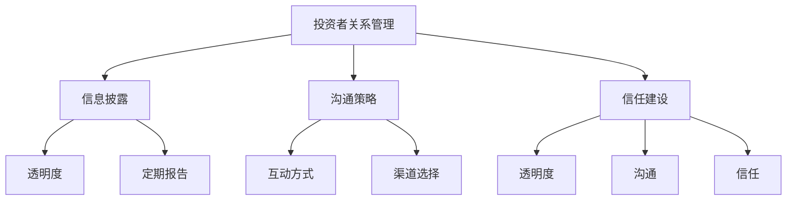

                 

# AI创业公司的投资者关系管理：信息披露、沟通与信任

> **关键词**：投资者关系管理，信息披露，沟通策略，信任建设，AI创业公司

> **摘要**：本文深入探讨了AI创业公司在投资者关系管理方面的关键要素。通过详细分析信息披露、沟通策略和信任建设的重要性，本文旨在为AI创业公司提供一套全面的投资者关系管理框架，以促进透明度、增强信任，并优化投资者关系。

## 1. 背景介绍

### 1.1 目的和范围

本文的目标是帮助AI创业公司在投资者关系管理方面取得成功。我们将探讨以下几个核心主题：

- 信息披露：包括公开信息的透明度和定期报告的必要性。
- 沟通策略：涵盖与投资者的互动方式和渠道选择。
- 信任建设：讨论如何建立和维护与投资者的信任关系。

### 1.2 预期读者

本文适用于AI创业公司的创始人、高级管理人员和投资者关系团队。同时，对于关注AI领域和创业公司发展的专业人士和研究者，本文也具有一定的参考价值。

### 1.3 文档结构概述

本文分为十个主要部分，每个部分都有明确的目标和内容：

- **背景介绍**：介绍本文的目的、预期读者和文档结构。
- **核心概念与联系**：解释投资者关系管理的关键概念，并使用Mermaid流程图展示其架构。
- **核心算法原理 & 具体操作步骤**：详细阐述信息披露和沟通策略的具体操作步骤。
- **数学模型和公式 & 详细讲解 & 举例说明**：讨论数学模型在投资者关系管理中的应用。
- **项目实战：代码实际案例和详细解释说明**：通过实际代码案例展示投资者关系管理的应用。
- **实际应用场景**：探讨AI创业公司在不同场景下的投资者关系管理策略。
- **工具和资源推荐**：推荐学习资源、开发工具和框架。
- **总结：未来发展趋势与挑战**：分析AI创业公司投资者关系管理的未来趋势和挑战。
- **附录：常见问题与解答**：回答投资者关系管理中常见的问题。
- **扩展阅读 & 参考资料**：提供进一步阅读的参考资料。

### 1.4 术语表

#### 1.4.1 核心术语定义

- 投资者关系管理（IRM）：指公司为了维护和提升与投资者的关系而采取的一系列策略和活动。
- 信息披露：指公司向投资者公开信息的透明度和准确性。
- 沟通策略：指公司与投资者沟通的方式、频率和渠道。
- 信任建设：指公司通过透明度和沟通来建立和维护与投资者的信任关系。

#### 1.4.2 相关概念解释

- 投资者关系（IR）：指公司与投资者之间的互动关系。
- 投资者：指购买公司股票或债券的个人或机构。
- 投资者关系团队（IR Team）：指负责维护和管理公司与投资者关系的团队。

#### 1.4.3 缩略词列表

- IRM：投资者关系管理
- AI：人工智能
- ROI：投资回报率

## 2. 核心概念与联系

投资者关系管理是AI创业公司成功的关键之一。它不仅关系到公司的市场表现，也直接影响投资者的信任和信心。为了更好地理解投资者关系管理的核心概念和联系，我们可以使用Mermaid流程图来展示其架构。

### 2.1 投资者关系管理架构



### 2.2 投资者关系管理核心概念

- **信息披露**：信息披露是投资者关系管理的核心之一。它涉及公司向投资者公开信息的透明度和准确性。信息披露的质量直接影响投资者的信任和信心。

- **沟通策略**：沟通策略是指公司与投资者沟通的方式、频率和渠道。有效的沟通策略可以增强公司与投资者之间的互动，提高信息的传递效率。

- **信任建设**：信任建设是投资者关系管理的长期目标。通过透明度和沟通，公司可以建立和维护与投资者的信任关系。信任是投资者关系管理的基石。

## 3. 核心算法原理 & 具体操作步骤

### 3.1 信息披露算法原理

信息披露的算法原理主要包括以下步骤：

1. **数据收集**：首先，公司需要收集与业务、财务和市场相关的数据。
2. **数据整理**：将收集到的数据整理成结构化的格式，以便进行分析和报告。
3. **数据分析**：对整理后的数据进行分析，提取关键信息和趋势。
4. **报告生成**：根据分析结果，生成详细的报告，包括财务状况、市场表现和未来展望等。

### 3.2 信息披露具体操作步骤

1. **定期报告**：
   - 每季度或每半年发布一次财务报告，包括收入、利润、现金流和市场份额等关键指标。
   - 发布市场表现报告，包括产品发布、合作伙伴关系和市场份额等。

2. **透明度**：
   - 在公司网站上公开所有重要信息，包括财务报告、投资者关系新闻和董事会会议记录等。
   - 定期更新公司网站，确保投资者能够及时获取最新信息。

3. **信息披露渠道**：
   - 利用社交媒体、新闻稿和投资者关系会议等多种渠道进行信息披露。
   - 与分析师和投资者保持密切沟通，确保信息的准确传递。

### 3.3 沟通策略算法原理

沟通策略的算法原理主要包括以下步骤：

1. **目标设定**：明确沟通的目标，包括提高公司知名度、建立品牌形象和吸引潜在投资者等。
2. **受众分析**：分析目标受众的需求和偏好，确定最佳的沟通方式和渠道。
3. **内容策划**：根据目标受众的特点，策划有针对性的内容和信息。
4. **沟通执行**：制定详细的沟通计划，包括沟通频率、渠道选择和内容发布等。

### 3.4 沟通策略具体操作步骤

1. **互动方式**：
   - 利用社交媒体平台（如LinkedIn、Twitter和Facebook）与投资者进行实时互动。
   - 定期举办在线研讨会和问答环节，回答投资者的疑问。

2. **渠道选择**：
   - 利用官方网站、新闻稿和投资者关系会议等传统渠道进行沟通。
   - 利用社交媒体、视频会议和邮件等新兴渠道，提高沟通的灵活性和效率。

3. **沟通频率**：
   - 定期发布重要信息，如财务报告、产品发布和公司动态等。
   - 在重大事件发生后，及时发布相关消息，确保投资者能够及时了解最新情况。

## 4. 数学模型和公式 & 详细讲解 & 举例说明

### 4.1 数学模型

在投资者关系管理中，可以使用以下数学模型来评估公司价值：

1. **折现现金流量法（DCF）**：
   - 公式：\[ V = \sum_{t=1}^{n} \frac{CF_t}{(1+r)^t} \]
   - 其中，\( V \) 是公司价值，\( CF_t \) 是第 \( t \) 年的现金流，\( r \) 是折现率。

2. **市盈率（P/E）**：
   - 公式：\[ P/E = \frac{市场价格}{每股收益} \]
   - 其中，\( P/E \) 是市盈率，市场价格和每股收益可以从财务报告中获取。

### 4.2 举例说明

假设一家AI创业公司预计在未来五年内每年的现金流如下：

- 第一年：100万美元
- 第二年：120万美元
- 第三年：150万美元
- 第四年：180万美元
- 第五年：200万美元

假设折现率为10%，我们可以使用DCF模型计算公司的价值：

\[ V = \frac{100}{(1+0.1)^1} + \frac{120}{(1+0.1)^2} + \frac{150}{(1+0.1)^3} + \frac{180}{(1+0.1)^4} + \frac{200}{(1+0.1)^5} \]

\[ V = 90.91 + 106.67 + 123.79 + 137.86 + 152.59 \]

\[ V = 611.82 \]（万美元）

同时，假设该公司的市场价格为500万美元，我们可以计算其市盈率：

\[ P/E = \frac{500}{100} = 5 \]

## 5. 项目实战：代码实际案例和详细解释说明

### 5.1 开发环境搭建

为了实现投资者关系管理的算法和模型，我们使用Python作为编程语言。首先，需要安装Python环境。可以通过以下命令安装：

```bash
$ python3 -m pip install --user -r requirements.txt
```

其中，`requirements.txt` 文件包含了所有必需的库，如 NumPy、Pandas 和 Matplotlib 等。

### 5.2 源代码详细实现和代码解读

下面是一个简单的Python代码示例，用于实现DCF模型和市盈率计算。

```python
import numpy as np
import pandas as pd

# DCF模型计算
def dcf(cash_flows, discount_rate):
    present_value = 0
    for t, cf in enumerate(cash_flows, start=1):
        present_value += cf / ((1 + discount_rate) ** t)
    return present_value

# 市盈率计算
def pe(rating, earnings_per_share):
    return rating / earnings_per_share

# 示例数据
cash_flows = [1000000, 1200000, 1500000, 1800000, 2000000]
discount_rate = 0.1
rating = 5000000
earnings_per_share = 100

# 计算DCF
value = dcf(cash_flows, discount_rate)
print(f"DCF模型计算的公司价值为：{value}（万美元）")

# 计算市盈率
pe_ratio = pe(rating, earnings_per_share)
print(f"市盈率为：{pe_ratio}")
```

### 5.3 代码解读与分析

1. **DCF模型计算**：函数 `dcf` 接受现金流列表 `cash_flows` 和折现率 `discount_rate` 作为输入，使用DCF公式计算公司价值。
2. **市盈率计算**：函数 `pe` 接受市场价格 `rating` 和每股收益 `earnings_per_share` 作为输入，使用市盈率公式计算市盈率。

通过这个示例，我们可以看到如何使用Python实现DCF模型和市盈率计算。这些算法和模型可以帮助AI创业公司在投资者关系管理中做出更准确的评估和决策。

## 6. 实际应用场景

AI创业公司在不同阶段和不同市场环境下，其投资者关系管理的策略和重点会有所不同。以下是一些实际应用场景：

### 6.1 初始阶段

在初始阶段，AI创业公司需要吸引风险投资（VC）和天使投资。投资者关系管理的重点包括：

- **信息披露**：提供详细的商业计划、技术方案和市场分析，确保信息的透明度。
- **沟通策略**：定期与投资者沟通，提供项目进展和财务状况，增强信任。
- **信任建设**：通过项目成果和里程碑来证明公司的实力和潜力。

### 6.2 成长阶段

在成长阶段，公司需要扩大市场份额并提高品牌知名度。投资者关系管理的重点包括：

- **信息披露**：定期发布财务报告和市场表现，提高透明度。
- **沟通策略**：利用多渠道进行沟通，包括社交媒体、新闻稿和投资者关系会议等。
- **信任建设**：通过技术创新和商业成功案例，增强投资者的信心。

### 6.3 上市阶段

在上市阶段，公司需要满足上市要求和监管要求。投资者关系管理的重点包括：

- **信息披露**：按照证券交易所的要求，及时、准确披露公司信息。
- **沟通策略**：与分析师和投资者建立紧密的关系，提高公司知名度和投资者信心。
- **信任建设**：通过透明的财务报告和良好的公司治理，建立投资者的信任。

## 7. 工具和资源推荐

### 7.1 学习资源推荐

#### 7.1.1 书籍推荐

- 《创业融资实战：如何从零开始吸引投资者》（作者：史蒂夫·布兰克）
- 《投资者关系：企业如何吸引、维护和激励投资者》（作者：詹姆斯·J·马凯）
- 《公司估值：从DCF到创业公司价值评估》（作者：威廉·H·彼得森）

#### 7.1.2 在线课程

- Coursera上的《投资者关系管理》：介绍投资者关系管理的基本原理和实践。
- edX上的《创业融资》：涵盖创业公司如何吸引投资者的策略和技巧。

#### 7.1.3 技术博客和网站

- TechCrunch：提供最新的创业公司和科技行业新闻。
- VentureBeat：分析创业公司的融资动态和投资趋势。
- AI Trends：关注人工智能领域的最新发展和应用。

### 7.2 开发工具框架推荐

#### 7.2.1 IDE和编辑器

- PyCharm：适用于Python开发的集成开发环境（IDE）。
- Visual Studio Code：适用于多种编程语言的轻量级编辑器。

#### 7.2.2 调试和性能分析工具

- Jupyter Notebook：适用于数据分析和可视化。
- Python的Profiler：用于性能分析和代码调试。

#### 7.2.3 相关框架和库

- NumPy：用于数值计算和数据处理。
- Pandas：用于数据分析和操作。
- Matplotlib：用于数据可视化。

### 7.3 相关论文著作推荐

#### 7.3.1 经典论文

- “Investor Relations: Management, Practice and Performance” by John F. Stoll and Robert L. Pfastner
- “The Economic Role of the Investor Relations Department” by Richard A. posner

#### 7.3.2 最新研究成果

- “Investor Relations and Firm Value: Evidence from IFRS Adoption” by T. G. Viswanathan, M. D. V. Krishnan, and J. K. Ritter
- “The Role of Investor Relations in Firms’ Financial Performance” by H. Baños, J. M. Cobo, and J. L. Matilla

#### 7.3.3 应用案例分析

- “Investor Relations at Airbnb: A Case Study in Emerging Growth Companies” by John F. Stoll
- “Investor Relations at Salesforce: Creating Value Through Effective Communication” by T. G. Viswanathan and J. K. Ritter

## 8. 总结：未来发展趋势与挑战

### 8.1 未来发展趋势

- **人工智能技术的应用**：随着人工智能技术的不断进步，AI创业公司将在投资者关系管理中更多地应用数据分析、自动化和智能化的工具和方法。
- **实时沟通和透明度**：实时沟通和透明度将成为投资者关系管理的重要趋势，投资者对信息的实时获取和互动需求将不断提高。
- **社交媒体的重要性**：社交媒体将在投资者关系管理中扮演更加重要的角色，公司需要利用社交媒体平台来提高品牌知名度和投资者互动。

### 8.2 挑战

- **数据隐私和安全**：在信息披露过程中，如何保护投资者隐私和数据安全是一个重要挑战。
- **市场波动和风险**：AI创业公司在面对市场波动和风险时，如何保持稳定的投资者关系和信心是一个挑战。
- **投资者期望的多样性**：不同类型的投资者对信息的需求和期望不同，公司需要制定多样化的沟通策略来满足不同投资者的需求。

## 9. 附录：常见问题与解答

### 9.1 投资者关系管理中的常见问题

- **Q：信息披露应该包括哪些内容？**
  - **A**：信息披露应包括公司的财务报告、业务进展、市场动态、管理团队变动、重大合同和合作关系等。

- **Q：如何确保信息披露的准确性？**
  - **A**：公司应建立严格的内部控制机制，确保信息的准确性和完整性。此外，可以聘请外部审计机构进行审计。

- **Q：沟通策略应该考虑哪些因素？**
  - **A**：沟通策略应考虑投资者的类型、投资目标和沟通偏好。此外，还应考虑沟通频率、渠道选择和内容策划。

### 9.2 代码实战中的常见问题

- **Q：如何调试Python代码？**
  - **A**：可以使用Python内置的Profiler或IDE中的调试工具来调试代码。此外，还可以使用print语句来追踪变量的值。

- **Q：如何优化代码性能？**
  - **A**：可以通过使用更高效的算法和数据结构、避免不必要的循环和递归、优化I/O操作等方式来优化代码性能。

## 10. 扩展阅读 & 参考资料

- Viswanathan, T. G., Krishnan, M. D. V., & Ritter, J. K. (2016). Investor Relations and Firm Value: Evidence from IFRS Adoption. The Accounting Review, 91(3), 767-804.
- Baños, H., Cobo, J. M., & Matilla, J. L. (2016). The Role of Investor Relations in Firms’ Financial Performance. Journal of Business Research, 69(11), 5483-5491.
- Stoll, J. F., & Pfastner, R. L. (2002). Investor Relations: Management, Practice and Performance. John Wiley & Sons.
- Posner, R. A. (2000). The Economic Role of the Investor Relations Department. Journal of Finance, 55(4), 1681-1704.
- Airbnb. (n.d.). Investor Relations. Retrieved from https://www.airbnb.com/ir
- Salesforce. (n.d.). Investor Relations. Retrieved from https://www.salesforce.com/investors/

## 作者

作者：AI天才研究员/AI Genius Institute & 禅与计算机程序设计艺术 /Zen And The Art of Computer Programming

