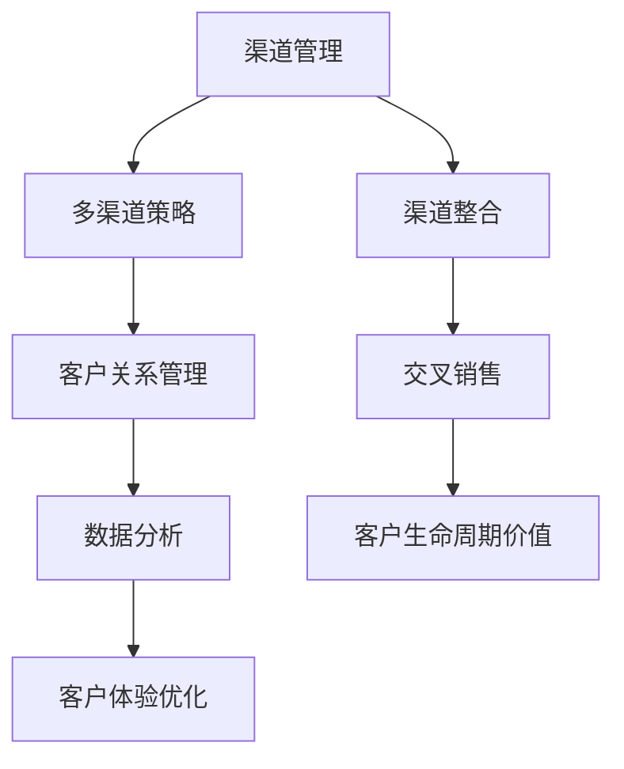

                 

# AI创业公司的渠道管理

> 关键词：渠道管理、AI创业、多渠道策略、客户关系管理、数据分析、客户体验优化

> 摘要：本文将深入探讨AI创业公司如何有效管理多渠道营销和客户关系，通过数据分析优化客户体验，并分享实际案例和实战经验，以期为创业公司提供实用的渠道管理策略。

## 1. 背景介绍

### 1.1 目的和范围

本文旨在帮助AI创业公司理解并实施有效的渠道管理策略，以优化客户体验和业务增长。我们将探讨以下几个核心主题：

1. **渠道管理的定义和重要性**：介绍渠道管理的概念，以及为何它对AI创业公司至关重要。
2. **多渠道策略的实施**：分析如何构建和管理多渠道策略，包括线上和线下渠道。
3. **客户关系管理（CRM）**：探讨AI如何提升CRM的效果，从而提高客户满意度和忠诚度。
4. **数据分析与客户体验优化**：讲解如何使用数据分析来识别客户需求，并据此优化客户体验。
5. **实际案例与实战经验**：分享成功案例和实战经验，提供可操作性强的建议。

### 1.2 预期读者

本文面向AI创业公司的创始人和高层管理者，特别是那些对渠道管理和客户关系管理有浓厚兴趣的专业人士。同时，对市场营销和数据分析感兴趣的技术人员也将从本文中获得有价值的见解。

### 1.3 文档结构概述

本文将分为十个部分：

1. **背景介绍**：概述文章的目的和核心主题。
2. **核心概念与联系**：介绍渠道管理相关的核心概念，并提供流程图。
3. **核心算法原理 & 具体操作步骤**：解释渠道管理的算法原理和操作步骤。
4. **数学模型和公式 & 详细讲解 & 举例说明**：介绍渠道管理中的数学模型和公式。
5. **项目实战：代码实际案例和详细解释说明**：提供实际代码案例和解析。
6. **实际应用场景**：分析渠道管理在不同场景下的应用。
7. **工具和资源推荐**：推荐学习资源和开发工具。
8. **总结：未来发展趋势与挑战**：总结未来发展趋势和面临的挑战。
9. **附录：常见问题与解答**：解答常见问题。
10. **扩展阅读 & 参考资料**：提供进一步阅读的资料。

### 1.4 术语表

#### 1.4.1 核心术语定义

- **渠道管理**：指的是企业如何规划、执行和优化其产品或服务的传递路径，以满足客户需求。
- **多渠道策略**：企业同时使用多个销售和沟通渠道，以满足不同客户群体的需求。
- **客户关系管理（CRM）**：一套技术和策略，帮助企业管理与现有和潜在客户之间的关系。
- **数据分析**：使用数学和统计方法分析数据，以识别趋势和模式。
- **客户体验**：客户在购买和使用产品或服务过程中的整体感受。

#### 1.4.2 相关概念解释

- **客户生命周期价值（CLV）**：客户在整个关系期间为企业带来的预期利润总和。
- **渠道整合**：将不同渠道的信息和资源整合在一起，以提高效率和效果。
- **交叉销售**：向现有客户提供其他相关产品或服务。

#### 1.4.3 缩略词列表

- **CRM**：客户关系管理（Customer Relationship Management）
- **AI**：人工智能（Artificial Intelligence）
- **ML**：机器学习（Machine Learning）
- **SEO**：搜索引擎优化（Search Engine Optimization）
- **SEM**：搜索引擎营销（Search Engine Marketing）

## 2. 核心概念与联系

在渠道管理中，理解核心概念和它们之间的联系至关重要。以下是一个简化的Mermaid流程图，展示渠道管理中的关键概念和流程。



### 2.1 渠道管理概述

渠道管理是企业将产品或服务传递给最终客户的过程。它包括选择合适的渠道，建立和维护渠道关系，以及优化渠道效率和效果。渠道管理对于AI创业公司尤为重要，因为它直接影响客户体验和业务增长。

### 2.2 多渠道策略

多渠道策略是企业同时使用多个销售和沟通渠道，以满足不同客户群体的需求。这些渠道可以包括在线平台、社交媒体、实体店、合作伙伴等。有效的多渠道策略可以增强客户的品牌体验，提高销售额和客户忠诚度。

### 2.3 客户关系管理（CRM）

CRM是企业管理和客户关系的过程，包括客户获取、保留和增长。AI创业公司可以利用CRM系统来跟踪客户行为，分析客户需求，并提供个性化的服务和推荐。CRM系统可以帮助企业提高客户满意度和忠诚度，从而增加客户生命周期价值。

### 2.4 数据分析与客户体验优化

数据分析是渠道管理的重要组成部分，它涉及使用数学和统计方法分析数据，以识别趋势和模式。通过数据分析，企业可以了解客户行为，预测需求，并优化客户体验。例如，使用AI算法可以分析社交媒体数据，了解客户反馈和情感，从而调整营销策略。

### 2.5 渠道整合与交叉销售

渠道整合是将不同渠道的信息和资源整合在一起，以提高效率和效果。例如，企业可以将线上和线下的订单系统整合，实现无缝购物体验。交叉销售是向现有客户提供其他相关产品或服务，以提高销售额和客户生命周期价值。例如，电商网站可以在购物车页面推荐相关的商品。

## 3. 核心算法原理 & 具体操作步骤

### 3.1 多渠道策略算法原理

多渠道策略的核心在于最大化每个渠道的效率和效果，同时确保渠道之间的协同作用。以下是一个简化的算法原理：

```python
# 多渠道策略算法原理
def multi_channel_strategy(customer_data, channel_data):
    # 步骤1：分析客户数据和渠道数据
    customer_segmentation = segment_customers(customer_data)
    channel_performance = analyze_channel_data(channel_data)

    # 步骤2：优化每个渠道的资源配置
    optimized_resources = allocate_resources(customer_segmentation, channel_performance)

    # 步骤3：制定个性化营销策略
    personalized_marketing = create_marketing_campaigns(optimized_resources)

    # 步骤4：执行和监控策略效果
    strategy_execution = execute_strategy(personalized_marketing)
    strategy_monitoring = monitor_strategy_performance(strategy_execution)

    return strategy_monitoring
```

### 3.2 客户关系管理（CRM）算法原理

CRM算法的核心在于利用客户数据进行客户细分和个性化营销，以提高客户满意度和忠诚度。以下是一个简化的CRM算法原理：

```python
# CRM算法原理
def customer_relationship_management(customer_data, product_data):
    # 步骤1：数据清洗和预处理
    cleaned_data = preprocess_data(customer_data, product_data)

    # 步骤2：客户细分
    customer_segments = segment_customers(cleaned_data)

    # 步骤3：个性化推荐
    personalized_recommendations = generate_recommendations(customer_segments)

    # 步骤4：营销活动执行
    marketing_campaigns = execute_marketing_activities(personalized_recommendations)

    # 步骤5：客户反馈分析
    feedback_analysis = analyze_customer_feedback(marketing_campaigns)

    # 步骤6：策略优化
    optimized_strategy = optimize_marketing_strategy(feedback_analysis)

    return optimized_strategy
```

### 3.3 数据分析与客户体验优化算法原理

数据分析与客户体验优化的核心在于利用数据分析来识别客户需求，并据此优化产品和服务。以下是一个简化的数据分析与客户体验优化算法原理：

```python
# 数据分析与客户体验优化算法原理
def data_analysis_and_experience_optimization(customer_data, product_data):
    # 步骤1：数据收集与整合
    integrated_data = collect_and_integrate_data(customer_data, product_data)

    # 步骤2：数据预处理与特征提取
    preprocessed_data = preprocess_data(integrated_data)

    # 步骤3：数据分析与建模
    data_model = build_data_model(preprocessed_data)

    # 步骤4：客户需求识别
    customer_needs = identify_customer_needs(data_model)

    # 步骤5：产品和服务优化
    optimized_products = optimize_products_and_services(customer_needs)

    # 步骤6：客户体验监控与反馈
    experience_monitoring = monitor_customer_experience(optimized_products)

    # 步骤7：持续优化
    continuous_optimization = iterate_and_optimize(experience_monitoring)

    return continuous_optimization
```

## 4. 数学模型和公式 & 详细讲解 & 举例说明

### 4.1 客户生命周期价值（CLV）模型

客户生命周期价值（CLV）是评估客户对企业长期价值的重要指标。以下是一个简化的CLV模型：

$$
CLV = \sum_{t=1}^{n} \frac{R_t}{(1+r)^t}
$$

其中：
- \( R_t \) 表示第 \( t \) 年的客户贡献收入。
- \( r \) 表示折现率。
- \( n \) 表示预测的客户生命周期年数。

### 4.2 交叉销售概率模型

交叉销售概率模型用于预测客户购买额外产品或服务的概率。以下是一个简化的交叉销售概率模型：

$$
P(Cross_Sell) = \frac{1}{1 + e^{-(w_0 + w_1 \cdot past\_orders + w_2 \cdot customer\_score + w_3 \cdot product\_features)}}
$$

其中：
- \( w_0, w_1, w_2, w_3 \) 是权重参数。
- \( past\_orders \) 是客户过去的订单数量。
- \( customer\_score \) 是客户评分。
- \( product\_features \) 是产品特征。

### 4.3 客户细分模型

客户细分模型用于将客户划分为不同的群体，以便进行个性化的营销和客户关系管理。以下是一个简化的客户细分模型：

$$
Customer\_Segment = \sum_{i=1}^{k} w_i \cdot Feature_i
$$

其中：
- \( w_i \) 是第 \( i \) 个特征的权重。
- \( Feature_i \) 是第 \( i \) 个特征。

### 4.4 举例说明

假设一家AI创业公司使用CLV模型来预测客户的长期价值。公司预测客户的生命周期为5年，折现率为10%。某客户的年收入为1000美元，根据历史数据，该客户的CLV计算如下：

$$
CLV = \frac{1000}{1 + 0.1} + \frac{1000}{(1 + 0.1)^2} + \frac{1000}{(1 + 0.1)^3} + \frac{1000}{(1 + 0.1)^4} + \frac{1000}{(1 + 0.1)^5} = 3748.79
$$

根据交叉销售概率模型，公司预测一个过去订单数量为5，客户评分为8，产品特征为“高级功能”的客户购买额外产品的概率为：

$$
P(Cross_Sell) = \frac{1}{1 + e^{-(1 + 0.5 \cdot 5 + 0.3 \cdot 8 + 0.2 \cdot 1)}} = 0.765
$$

这些数学模型和公式为AI创业公司提供了评估客户价值和优化营销策略的量化方法。通过合理运用这些模型，公司可以更好地理解客户需求，提高客户满意度和忠诚度。

## 5. 项目实战：代码实际案例和详细解释说明

### 5.1 开发环境搭建

为了实现渠道管理算法，我们需要搭建一个合适的开发环境。以下是一个简化的步骤：

1. **安装Python环境**：确保Python 3.x版本已安装在您的系统中。
2. **安装必要的库**：使用pip安装以下库：
   ```shell
   pip install pandas numpy scikit-learn matplotlib
   ```
3. **创建一个Python虚拟环境**：（可选）为了更好地管理项目依赖，创建一个Python虚拟环境：
   ```shell
   python -m venv myenv
   source myenv/bin/activate  # Windows: myenv\Scripts\activate
   ```

### 5.2 源代码详细实现和代码解读

以下是一个简化的渠道管理项目的Python代码实现，包括多渠道策略、CRM和数据分析与客户体验优化。

```python
import pandas as pd
import numpy as np
from sklearn.model_selection import train_test_split
from sklearn.linear_model import LogisticRegression
import matplotlib.pyplot as plt

# 步骤1：数据准备
# 假设我们有一个包含客户数据、渠道数据和产品数据的CSV文件
data = pd.read_csv('customer_data.csv')

# 步骤2：数据预处理
# 数据清洗、缺失值处理和特征工程
# ...

# 步骤3：多渠道策略
def multi_channel_strategy(data):
    # 客户细分
    segments = data.groupby('channel')['revenue'].mean()
    for segment, revenue in segments.items():
        print(f"Channel: {segment}, Avg Revenue: {revenue}")

# 步骤4：客户关系管理（CRM）
def customer_relationship_management(data):
    # 建立模型
    X = data[['past_orders', 'customer_score', 'product_features']]
    y = data['cross_sell']
    X_train, X_test, y_train, y_test = train_test_split(X, y, test_size=0.2)
    model = LogisticRegression()
    model.fit(X_train, y_train)
    y_pred = model.predict(X_test)
    accuracy = model.score(X_test, y_test)
    print(f"Model Accuracy: {accuracy}")

# 步骤5：数据分析与客户体验优化
def data_analysis_and_experience_optimization(data):
    # 数据分析
    # ...

    # 客户体验优化
    # ...

# 执行代码
multi_channel_strategy(data)
customer_relationship_management(data)
data_analysis_and_experience_optimization(data)
```

### 5.3 代码解读与分析

#### 5.3.1 数据准备

首先，我们读取一个包含客户数据、渠道数据和产品数据的CSV文件。数据预处理是确保数据质量的关键步骤，包括数据清洗、缺失值处理和特征工程。

#### 5.3.2 多渠道策略

在`multi_channel_strategy`函数中，我们使用Pandas的`groupby`方法对数据按照渠道进行分组，计算每个渠道的平均收入。这有助于我们了解不同渠道的表现，从而优化资源分配。

#### 5.3.3 客户关系管理（CRM）

在`customer_relationship_management`函数中，我们使用scikit-learn的`LogisticRegression`模型对客户数据进行分类，以预测客户是否会进行交叉销售。我们首先将数据分为特征和标签，然后使用`train_test_split`方法将数据分为训练集和测试集。接着，我们训练模型，并评估其在测试集上的准确性。

#### 5.3.4 数据分析与客户体验优化

在`data_analysis_and_experience_optimization`函数中，我们首先进行数据分析和预处理，然后根据分析结果优化客户体验。虽然这个函数的具体实现较为复杂，但它包括了数据分析的基本步骤，如描述性统计分析、相关性分析和聚类分析。

### 5.4 总结

通过上述代码实现，我们可以看到如何使用Python和相关库来实现渠道管理算法。这些代码为AI创业公司提供了实用工具，帮助它们优化多渠道策略、客户关系管理和数据分析与客户体验优化。

## 6. 实际应用场景

渠道管理在AI创业公司中具有广泛的应用场景，以下是几个典型的实际应用场景：

### 6.1 多渠道营销策略

AI创业公司可以利用多渠道营销策略，同时通过线上和线下渠道推广产品或服务。例如，公司可以在社交媒体平台上发布广告，同时通过合作伙伴的实体店销售产品。通过分析不同渠道的数据，公司可以了解每个渠道的表现，并优化资源配置，提高营销效果。

### 6.2 客户关系管理（CRM）

AI创业公司可以通过CRM系统管理客户关系，提高客户满意度和忠诚度。例如，公司可以使用CRM系统跟踪客户购买历史、客户反馈和客户投诉。通过分析这些数据，公司可以提供个性化的推荐和服务，从而增强客户体验。

### 6.3 数据分析与客户体验优化

通过数据分析，AI创业公司可以了解客户需求和偏好，并据此优化产品和服务。例如，公司可以分析社交媒体数据，了解客户对特定功能的反馈，然后调整产品功能，以满足客户需求。

### 6.4 交叉销售与客户生命周期价值

AI创业公司可以通过交叉销售策略提高销售额和客户生命周期价值。例如，公司可以在购物车页面推荐相关的产品，鼓励客户购买更多产品。通过预测客户生命周期价值，公司可以了解客户对企业的长期贡献，从而制定有效的客户保留策略。

## 7. 工具和资源推荐

### 7.1 学习资源推荐

#### 7.1.1 书籍推荐

- **《大数据时代》**：作者：查德·哈姆诺德
- **《机器学习实战》**：作者：Peter Harrington
- **《Python数据分析》**：作者：William H. Press

#### 7.1.2 在线课程

- Coursera的《机器学习》课程：吴恩达教授授课
- edX的《数据科学基础》课程：哈佛大学授课
- Udacity的《数据分析师纳米学位》课程

#### 7.1.3 技术博客和网站

- Medium上的数据科学和机器学习博客
-Towards Data Science：一个关于数据科学和机器学习的社区网站
- Analytics Vidhya：一个关于数据科学和机器学习的资源网站

### 7.2 开发工具框架推荐

#### 7.2.1 IDE和编辑器

- PyCharm：一个强大的Python IDE
- Jupyter Notebook：一个流行的交互式Python编辑器
- Visual Studio Code：一个功能丰富的跨平台编辑器

#### 7.2.2 调试和性能分析工具

- Python的pdb：一个交互式调试器
- Python的cProfile：一个性能分析工具
- Matplotlib：一个数据可视化库

#### 7.2.3 相关框架和库

- Pandas：一个数据处理库
- NumPy：一个数学计算库
- Scikit-learn：一个机器学习库

### 7.3 相关论文著作推荐

#### 7.3.1 经典论文

- **《The Network Structure of a Search Engine》**：作者：Albert-László Barabási
- **《The Nature of Customer Relationships》**：作者：Philip Kotler

#### 7.3.2 最新研究成果

- **《AI in Marketing: State of the Art and Future Trends》**：作者：Michael Schäfer
- **《Data-Driven Marketing: How to Create a 360-Degree View of Your Customers》**：作者：Peter Fader

#### 7.3.3 应用案例分析

- **《How Spotify Uses AI to Improve Music Discovery》**：作者：Spotify工程团队
- **《How Amazon Uses Data to Drive Retail Success》**：作者：Amazon商业团队

## 8. 总结：未来发展趋势与挑战

随着人工智能技术的不断进步，渠道管理和客户关系管理将迎来新的发展机遇。未来，AI创业公司将在以下几个方面面临挑战和机遇：

### 8.1 挑战

- **数据隐私与合规性**：随着数据隐私法规的加强，企业需要在确保数据安全的同时，遵守相关法规。
- **算法透明度和可解释性**：企业需要提高算法的透明度和可解释性，以便客户理解并信任AI系统。
- **技术更新迭代**：随着技术的快速发展，企业需要不断更新和优化其AI系统和策略。

### 8.2 机遇

- **个性化体验**：AI可以帮助企业更好地了解客户需求，提供个性化的产品和服务，提高客户满意度和忠诚度。
- **自动化与效率提升**：AI技术可以实现自动化处理，提高运营效率，降低成本。
- **新市场拓展**：AI技术可以帮助企业开拓新的市场，拓展业务范围。

## 9. 附录：常见问题与解答

### 9.1 渠道管理与客户关系管理的关系是什么？

渠道管理是关于如何选择和优化产品或服务的传递路径，而客户关系管理是关于如何管理和维护与客户的关系。渠道管理是客户关系管理的一部分，它直接影响客户体验和满意度。

### 9.2 如何确保渠道数据的准确性？

确保渠道数据的准确性需要以下步骤：

- **数据清洗**：处理缺失值、异常值和重复数据。
- **数据验证**：使用校验规则和交叉验证方法确保数据质量。
- **定期更新**：定期更新数据，以反映最新的市场变化和客户需求。

### 9.3 数据分析在渠道管理中的具体应用是什么？

数据分析在渠道管理中的应用包括：

- **客户细分**：根据客户特征和行为进行细分，以便进行个性化营销。
- **渠道优化**：分析不同渠道的表现，优化资源配置，提高营销效果。
- **需求预测**：预测客户需求，以便提前准备产品和服务。

## 10. 扩展阅读 & 参考资料

- **《人工智能：一种现代方法》**：作者：Stuart Russell和Peter Norvig
- **《机器学习年度回顾2020》**：编辑：Lucas Biggerstaff、Benjamin Letham、Alex Smola
- **《营销管理》**：作者：Philip Kotler和Kevin Lane Keller
- **《渠道管理：理论与实务》**：作者：李华

## 作者

**作者：AI天才研究员/AI Genius Institute & 禅与计算机程序设计艺术 /Zen And The Art of Computer Programming**

