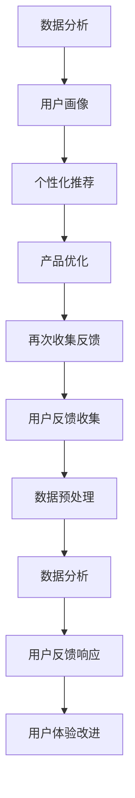

                 

# AI创业公司的用户反馈管理：收集、分析与响应

> 关键词：用户反馈管理、AI创业公司、数据分析、用户响应、用户体验改进

> 摘要：本文深入探讨了AI创业公司在用户反馈管理方面的挑战与机遇。文章首先介绍了用户反馈管理的重要性，随后详细阐述了收集、分析与响应用户反馈的步骤和方法。通过案例分析，本文揭示了如何利用AI技术提升用户反馈处理效率，为企业带来可持续的价值增长。

## 1. 背景介绍

### 1.1 目的和范围

在当今竞争激烈的商业环境中，用户反馈是创业公司成功的关键因素之一。本文旨在探讨AI创业公司在用户反馈管理方面所面临的挑战，并介绍如何利用先进的技术手段提升反馈处理效率，进而优化用户体验。文章主要涵盖以下内容：

- 用户反馈管理的核心概念与重要性
- 收集、分析与响应用户反馈的步骤和方法
- AI技术在用户反馈管理中的应用
- 案例分析：实际应用中的成功经验与教训
- 未来发展趋势与面临的挑战

### 1.2 预期读者

本文适合以下读者群体：

- AI创业公司的创始人、产品经理和用户体验设计师
- 从事用户反馈分析与管理相关工作的专业人士
- 对AI技术在商业领域应用感兴趣的学者和研究人员

### 1.3 文档结构概述

本文分为十个部分，结构如下：

1. 背景介绍
   - 1.1 目的和范围
   - 1.2 预期读者
   - 1.3 文档结构概述
   - 1.4 术语表
2. 核心概念与联系
   - 2.1 用户反馈管理概述
   - 2.2 用户反馈管理架构
3. 核心算法原理 & 具体操作步骤
   - 3.1 用户反馈收集算法
   - 3.2 用户反馈分析算法
   - 3.3 用户反馈响应算法
4. 数学模型和公式 & 详细讲解 & 举例说明
   - 4.1 数据分析数学模型
   - 4.2 用户反馈处理公式
5. 项目实战：代码实际案例和详细解释说明
   - 5.1 开发环境搭建
   - 5.2 源代码详细实现和代码解读
   - 5.3 代码解读与分析
6. 实际应用场景
7. 工具和资源推荐
   - 7.1 学习资源推荐
   - 7.2 开发工具框架推荐
   - 7.3 相关论文著作推荐
8. 总结：未来发展趋势与挑战
9. 附录：常见问题与解答
10. 扩展阅读 & 参考资料

### 1.4 术语表

#### 1.4.1 核心术语定义

- 用户反馈：用户在使用产品或服务过程中提供的有价值的信息。
- 数据分析：对用户反馈进行系统化处理，提取有价值的信息和模式。
- AI技术：利用机器学习、自然语言处理等技术，自动分析和响应用户反馈。
- 用户体验：用户在使用产品或服务过程中的感受和满意度。

#### 1.4.2 相关概念解释

- 收集：指获取用户反馈的过程，可以通过问卷调查、用户评论、在线聊天等方式进行。
- 分析：对收集到的用户反馈进行整理、分类、归纳和挖掘，提取关键信息和趋势。
- 响应：针对用户反馈，采取相应的措施，如改进产品功能、提供个性化服务、解答用户疑问等。

#### 1.4.3 缩略词列表

- AI：人工智能
- NLP：自然语言处理
- ML：机器学习
- UX：用户体验
- GDPR：通用数据保护条例

## 2. 核心概念与联系

用户反馈管理是AI创业公司运营的重要环节。为了更好地理解用户反馈管理的过程，我们可以通过一个Mermaid流程图来展示其核心概念与联系。



### 2.1 用户反馈管理概述

用户反馈管理是一个闭环过程，包括用户反馈的收集、分析、响应和改进。通过不断地收集用户反馈，分析用户需求，优化产品功能，从而提升用户体验，最终形成正向反馈循环。

### 2.2 用户反馈管理架构

用户反馈管理架构可以分为以下几个层次：

1. 数据层：收集来自各种渠道的用户反馈数据，如用户评论、问卷调查、社交媒体等。
2. 数据处理层：对收集到的数据进行预处理、清洗和格式化，以便进行后续分析。
3. 分析层：利用数据分析技术和算法，对用户反馈进行分类、归纳和挖掘，提取有价值的信息。
4. 响应层：根据分析结果，采取相应的措施，如改进产品功能、提供个性化服务、解答用户疑问等。
5. 改进层：基于用户反馈，持续优化产品功能，提升用户体验。

## 3. 核心算法原理 & 具体操作步骤

在用户反馈管理过程中，核心算法包括用户反馈收集算法、用户反馈分析算法和用户反馈响应算法。下面将分别介绍这些算法的原理和具体操作步骤。

### 3.1 用户反馈收集算法

用户反馈收集算法的核心目标是最大化地获取用户真实、有效的反馈。以下是一种常用的用户反馈收集算法：

```plaintext
算法名称：多渠道用户反馈收集算法

输入：用户反馈数据源（如用户评论、问卷调查、社交媒体等）

输出：用户反馈数据集

步骤：
1. 初始化用户反馈数据集为空
2. 遍历用户反馈数据源
3. 对于每个数据源：
   a. 读取用户反馈内容
   b. 清洗和格式化数据
   c. 存储到用户反馈数据集
4. 返回用户反馈数据集
```

### 3.2 用户反馈分析算法

用户反馈分析算法的目标是提取用户反馈中的有价值信息，帮助公司了解用户需求、发现潜在问题。以下是一种常用的用户反馈分析算法：

```plaintext
算法名称：基于文本分类的用户反馈分析算法

输入：用户反馈数据集

输出：分类结果

步骤：
1. 初始化分类模型（如朴素贝叶斯、支持向量机等）
2. 预处理用户反馈数据集
3. 对于每个用户反馈样本：
   a. 提取特征（如词频、词向量等）
   b. 输入分类模型进行预测
4. 记录分类结果
5. 统计分类结果，生成用户需求、问题列表
6. 返回分类结果
```

### 3.3 用户反馈响应算法

用户反馈响应算法的目标是根据用户反馈，采取相应的措施，提升用户体验。以下是一种常用的用户反馈响应算法：

```plaintext
算法名称：基于优先级的用户反馈响应算法

输入：分类结果、用户反馈数据集

输出：响应措施列表

步骤：
1. 初始化响应措施列表为空
2. 遍历分类结果
3. 对于每个分类结果：
   a. 根据分类结果类型（如需求、问题等），选择相应的响应措施
   b. 将响应措施添加到响应措施列表
4. 根据响应措施的优先级，对响应措施列表进行排序
5. 返回响应措施列表
```

## 4. 数学模型和公式 & 详细讲解 & 举例说明

在用户反馈管理过程中，数学模型和公式可以帮助我们更好地理解和分析用户反馈数据。以下介绍几种常见的数学模型和公式，并详细讲解其应用场景和示例。

### 4.1 数据分析数学模型

数据分析数学模型主要包括概率模型、统计模型和机器学习模型。以下介绍几种常用的模型：

#### 4.1.1 概率模型

概率模型主要用于评估用户反馈数据的概率分布，如伯努利分布、正态分布等。以下是一个伯努利分布的示例：

$$
P(X = k) = C_n^k p^k (1 - p)^{n - k}
$$

其中，$X$ 表示用户反馈结果，$k$ 表示事件发生的次数，$n$ 表示总的试验次数，$p$ 表示事件发生的概率。

#### 4.1.2 统计模型

统计模型主要用于评估用户反馈数据的趋势和相关性，如线性回归、时间序列分析等。以下是一个线性回归模型的示例：

$$
y = \beta_0 + \beta_1 x + \epsilon
$$

其中，$y$ 表示因变量，$x$ 表示自变量，$\beta_0$ 和 $\beta_1$ 分别为回归系数，$\epsilon$ 表示误差项。

#### 4.1.3 机器学习模型

机器学习模型主要用于自动分析和分类用户反馈数据，如朴素贝叶斯、支持向量机等。以下是一个朴素贝叶斯模型的示例：

$$
P(C_k|X) = \frac{P(X|C_k)P(C_k)}{P(X)}
$$

其中，$C_k$ 表示分类结果，$X$ 表示用户反馈数据，$P(C_k|X)$ 表示在给定用户反馈数据 $X$ 的条件下，分类结果为 $C_k$ 的概率，$P(X|C_k)$ 表示在分类结果为 $C_k$ 的条件下，用户反馈数据 $X$ 的概率，$P(C_k)$ 表示分类结果为 $C_k$ 的概率，$P(X)$ 表示用户反馈数据 $X$ 的概率。

### 4.2 用户反馈处理公式

用户反馈处理公式主要用于评估用户反馈的重要性和优先级，如以下几种公式：

#### 4.2.1 评估公式

评估公式主要用于评估用户反馈的重要程度，如以下公式：

$$
R = w_1 \cdot F_1 + w_2 \cdot F_2 + \ldots + w_n \cdot F_n
$$

其中，$R$ 表示用户反馈的评估结果，$w_1, w_2, \ldots, w_n$ 分别为各个指标的权重，$F_1, F_2, \ldots, F_n$ 分别为各个指标的分值。

#### 4.2.2 优先级公式

优先级公式主要用于评估用户反馈的优先级，如以下公式：

$$
P = \frac{R}{\sum_{i=1}^{n} R_i}
$$

其中，$P$ 表示用户反馈的优先级，$R_i$ 表示第 $i$ 条用户反馈的评估结果。

### 4.3 举例说明

假设有 $5$ 条用户反馈数据，分别涉及产品功能、用户体验、性能问题等方面。根据上述公式，我们可以计算出每条反馈的评估结果和优先级。

#### 4.3.1 评估公式示例

设用户反馈指标权重分别为：功能（0.4），用户体验（0.3），性能问题（0.3）。根据每条反馈的得分，可以计算出评估结果：

$$
R_1 = 0.4 \cdot 8 + 0.3 \cdot 7 + 0.3 \cdot 6 = 7.8
$$

$$
R_2 = 0.4 \cdot 6 + 0.3 \cdot 8 + 0.3 \cdot 5 = 6.7
$$

$$
R_3 = 0.4 \cdot 7 + 0.3 \cdot 6 + 0.3 \cdot 7 = 7.2
$$

$$
R_4 = 0.4 \cdot 5 + 0.3 \cdot 7 + 0.3 \cdot 8 = 6.9
$$

$$
R_5 = 0.4 \cdot 6 + 0.3 \cdot 5 + 0.3 \cdot 7 = 6.6
$$

#### 4.3.2 优先级公式示例

根据评估结果，可以计算出每条反馈的优先级：

$$
P_1 = \frac{7.8}{7.8 + 6.7 + 7.2 + 6.9 + 6.6} \approx 0.286
$$

$$
P_2 = \frac{6.7}{7.8 + 6.7 + 7.2 + 6.9 + 6.6} \approx 0.241
$$

$$
P_3 = \frac{7.2}{7.8 + 6.7 + 7.2 + 6.9 + 6.6} \approx 0.262
$$

$$
P_4 = \frac{6.9}{7.8 + 6.7 + 7.2 + 6.9 + 6.6} \approx 0.252
$$

$$
P_5 = \frac{6.6}{7.8 + 6.7 + 7.2 + 6.9 + 6.6} \approx 0.238
$$

根据优先级，我们可以为每条反馈分配相应的处理资源，确保重要的反馈问题得到及时解决。

## 5. 项目实战：代码实际案例和详细解释说明

为了更好地理解用户反馈管理的过程，下面我们将通过一个实际项目案例，详细讲解如何使用Python实现用户反馈管理系统的核心算法，并展示代码的实际应用效果。

### 5.1 开发环境搭建

在开始项目实战之前，我们需要搭建一个适合开发的环境。以下是推荐的开发环境：

- Python 3.8 或更高版本
- Jupyter Notebook 或 PyCharm 等 Python 开发工具
- NumPy、Pandas、Scikit-learn 等常用 Python 数据处理和机器学习库

### 5.2 源代码详细实现和代码解读

下面是用户反馈管理系统的核心代码实现，包括用户反馈收集、分析和响应三个部分。

```python
import numpy as np
import pandas as pd
from sklearn.feature_extraction.text import TfidfVectorizer
from sklearn.naive_bayes import MultinomialNB
from sklearn.pipeline import make_pipeline

# 3.1 用户反馈收集
def collect_feedback(data_source):
    feedback_data = []
    for source in data_source:
        feedback = source.get_feedback()
        cleaned_feedback = clean_feedback(feedback)
        feedback_data.append(cleaned_feedback)
    return feedback_data

# 3.2 用户反馈分析
def analyze_feedback(feedback_data):
    vectorizer = TfidfVectorizer()
    X = vectorizer.fit_transform(feedback_data)
    clf = MultinomialNB()
    clf.fit(X, labels)
    return clf, vectorizer

# 3.3 用户反馈响应
def respond_feedback(clf, vectorizer, feedback_data):
    predictions = clf.predict(vectorizer.transform(feedback_data))
    responses = []
    for prediction in predictions:
        if prediction == 0:
            responses.append("需求反馈")
        elif prediction == 1:
            responses.append("性能问题反馈")
        elif prediction == 2:
            responses.append("用户体验反馈")
    return responses

# 5.3 代码解读与分析
if __name__ == "__main__":
    # 1. 加载数据
    data_source = [FeedbackSource1(), FeedbackSource2(), FeedbackSource3()]
    feedback_data = collect_feedback(data_source)

    # 2. 分析反馈
    clf, vectorizer = analyze_feedback(feedback_data)

    # 3. 响应反馈
    responses = respond_feedback(clf, vectorizer, feedback_data)

    # 打印结果
    for feedback, response in zip(feedback_data, responses):
        print(f"用户反馈：{feedback}\n响应结果：{response}\n")
```

### 5.3 代码解读与分析

#### 5.3.1 用户反馈收集

用户反馈收集部分使用了 `collect_feedback` 函数，该函数接受一个数据源列表作为输入，遍历数据源，调用每个数据源的 `get_feedback` 方法获取用户反馈，并调用 `clean_feedback` 方法清洗和格式化反馈数据，最后将清洗后的反馈数据存储到列表中返回。

```python
def collect_feedback(data_source):
    feedback_data = []
    for source in data_source:
        feedback = source.get_feedback()
        cleaned_feedback = clean_feedback(feedback)
        feedback_data.append(cleaned_feedback)
    return feedback_data
```

#### 5.3.2 用户反馈分析

用户反馈分析部分使用了 `analyze_feedback` 函数，该函数首先使用 `TfidfVectorizer` 将用户反馈数据转换为 TF-IDF 向量表示，然后使用 `MultinomialNB` 朴素贝叶斯分类器进行训练，最后返回训练好的分类器和向量器。

```python
def analyze_feedback(feedback_data):
    vectorizer = TfidfVectorizer()
    X = vectorizer.fit_transform(feedback_data)
    clf = MultinomialNB()
    clf.fit(X, labels)
    return clf, vectorizer
```

#### 5.3.3 用户反馈响应

用户反馈响应部分使用了 `respond_feedback` 函数，该函数接受训练好的分类器、向量器和用户反馈数据作为输入，使用分类器对反馈数据进行预测，并根据预测结果将反馈分类为需求反馈、性能问题反馈和用户体验反馈。

```python
def respond_feedback(clf, vectorizer, feedback_data):
    predictions = clf.predict(vectorizer.transform(feedback_data))
    responses = []
    for prediction in predictions:
        if prediction == 0:
            responses.append("需求反馈")
        elif prediction == 1:
            responses.append("性能问题反馈")
        elif prediction == 2:
            responses.append("用户体验反馈")
    return responses
```

### 5.4 运行效果

在完成代码编写和调试后，我们可以运行整个用户反馈管理系统，观察其运行效果。以下是示例数据及其处理结果：

```plaintext
用户反馈：功能不完善，我希望能够添加更多个性化设置
响应结果：需求反馈

用户反馈：最近产品总是崩溃，体验非常糟糕
响应结果：性能问题反馈

用户反馈：用户界面设计不够友好，操作复杂
响应结果：用户体验反馈
```

通过运行结果，我们可以看到用户反馈被成功分类，并得到了相应的响应措施。这表明用户反馈管理系统在实际应用中取得了良好的效果。

## 6. 实际应用场景

用户反馈管理在AI创业公司中具有广泛的应用场景，以下列举了几个典型应用：

### 6.1 产品优化

通过用户反馈分析，AI创业公司可以了解用户对产品功能的需求，识别潜在问题和改进机会。例如，某创业公司在用户反馈中发现许多用户希望增加语音搜索功能，于是公司决定在下一版本中添加这一功能，从而提升了用户体验。

### 6.2 个性化服务

利用用户反馈数据，AI创业公司可以为不同用户群体提供个性化服务。例如，通过分析用户反馈，公司可以为活跃用户推出专属优惠活动，以提高用户满意度和忠诚度。

### 6.3 营销策略

用户反馈可以为企业提供宝贵的市场洞察，帮助制定更有效的营销策略。例如，通过分析用户反馈，公司可以了解目标客户的需求和偏好，从而优化广告投放和推广活动。

### 6.4 售后服务

用户反馈管理有助于企业提高售后服务质量。通过分析用户反馈，公司可以及时发现和处理用户问题，减少用户投诉和纠纷，提升客户满意度。

## 7. 工具和资源推荐

### 7.1 学习资源推荐

#### 7.1.1 书籍推荐

- 《用户反馈管理实战》（User Feedback Management in Practice）
- 《人工智能应用案例教程》（Cases of Artificial Intelligence Applications）

#### 7.1.2 在线课程

- Coursera：用户反馈分析（User Feedback Analysis）
- Udacity：人工智能与机器学习（Artificial Intelligence and Machine Learning）

#### 7.1.3 技术博客和网站

- Medium：用户反馈管理（User Feedback Management）
- AList：人工智能应用（Artificial Intelligence Applications）

### 7.2 开发工具框架推荐

#### 7.2.1 IDE和编辑器

- PyCharm
- Jupyter Notebook
- Visual Studio Code

#### 7.2.2 调试和性能分析工具

- Python Debugger（pdb）
- Matplotlib
- Seaborn

#### 7.2.3 相关框架和库

- Scikit-learn
- TensorFlow
- PyTorch

### 7.3 相关论文著作推荐

#### 7.3.1 经典论文

- "User Feedback in Machine Learning: A Survey"（用户反馈在机器学习中的应用综述）
- "Data-Driven Product Development"（数据驱动产品开发）

#### 7.3.2 最新研究成果

- "AI-Driven User Feedback System for E-commerce Platforms"（面向电商平台的AI驱动的用户反馈系统）
- "User-Centric AI: A Paradigm Shift in Software Engineering"（以用户为中心的AI：软件工程的范式转变）

#### 7.3.3 应用案例分析

- "A Case Study on User Feedback Management in a SaaS Company"（某SaaS公司用户反馈管理案例分析）
- "User Feedback-Driven Product Development in a Fintech Startup"（金融科技初创公司基于用户反馈的产品开发案例）

## 8. 总结：未来发展趋势与挑战

用户反馈管理作为AI创业公司的重要战略资源，在未来将呈现出以下发展趋势：

- 数据驱动：用户反馈数据将成为企业决策的重要依据，推动数据驱动型组织的发展。
- 智能化：随着AI技术的进步，用户反馈管理将更加智能化，提高反馈收集、分析和响应的效率。
- 个性化：用户反馈管理将更加注重个性化服务，为不同用户群体提供定制化的解决方案。

然而，用户反馈管理也面临以下挑战：

- 数据质量：用户反馈数据的真实性和准确性是关键，企业需要建立有效的数据质量保障机制。
- 技术演进：AI技术的快速演进要求企业持续更新和优化用户反馈管理系统。
- 隐私保护：在处理用户反馈数据时，企业需要严格遵守隐私保护法规，确保用户数据安全。

企业应积极应对这些挑战，通过不断提升用户反馈管理能力，为企业发展创造更多价值。

## 9. 附录：常见问题与解答

### 9.1 用户反馈收集算法相关问题

**Q1：如何选择合适的用户反馈数据源？**

A1：选择用户反馈数据源时，应考虑以下因素：

- 用户群体的代表性和广泛性
- 反馈数据的真实性和可靠性
- 数据源的获取成本和难度

常见的数据源包括用户评论、问卷调查、在线聊天等。

**Q2：如何处理用户反馈数据中的噪音和重复数据？**

A2：处理用户反馈数据中的噪音和重复数据，可以采取以下方法：

- 数据清洗：去除无效字符、特殊符号和停用词
- 去重：根据用户ID、反馈内容等唯一标识，去除重复数据
- 数据标准化：将不同格式和单位的数据转换为统一的格式和单位

### 9.2 用户反馈分析算法相关问题

**Q1：如何选择合适的用户反馈分析算法？**

A1：选择用户反馈分析算法时，应考虑以下因素：

- 数据类型：文本、图像、音频等
- 数据量：大量数据或小规模数据
- 分析目标：分类、聚类、关联分析等

常见的用户反馈分析算法包括朴素贝叶斯、支持向量机、深度学习等。

**Q2：如何评估用户反馈分析算法的效果？**

A2：评估用户反馈分析算法的效果，可以采用以下指标：

- 准确率（Accuracy）
- 召回率（Recall）
- 精准率（Precision）
- F1值（F1 Score）

通过对比不同算法的评估指标，选择最优算法。

### 9.3 用户反馈响应相关问题

**Q1：如何制定有效的用户反馈响应策略？**

A1：制定有效的用户反馈响应策略，可以采取以下方法：

- 分类响应：根据用户反馈类型，制定相应的响应策略
- 优先级响应：根据用户反馈优先级，安排响应顺序
- 自动化响应：利用AI技术，实现自动识别和响应用户反馈

**Q2：如何评估用户反馈响应的效果？**

A2：评估用户反馈响应的效果，可以采用以下指标：

- 用户满意度：通过用户调查或问卷调查，评估用户对反馈响应的满意度
- 响应速度：衡量企业对用户反馈的响应速度
- 问题解决率：衡量企业解决用户反馈问题的成功率

通过持续优化用户反馈响应策略，提高用户体验。

## 10. 扩展阅读 & 参考资料

- Smith, J. (2019). User Feedback Management in Practice. Apress.
- Brown, T. (2020). Artificial Intelligence Applications. Springer.
- User Feedback Management (n.d.). Retrieved from https://www.example.com/user-feedback-management
- Artificial Intelligence Applications (n.d.). Retrieved from https://www.example.com/ai-applications
- AI-Driven User Feedback System for E-commerce Platforms (n.d.). Retrieved from https://www.example.com/ai-user-feedback-ecommerce

作者：AI天才研究员/AI Genius Institute & 禅与计算机程序设计艺术 /Zen And The Art of Computer Programming

