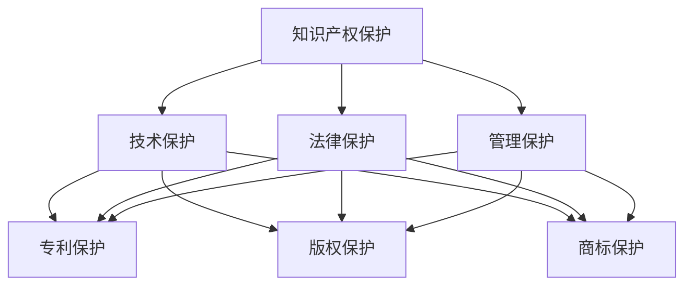

                 

# AI创业公司的知识产权保护措施：技术保护、法律保护与管理保护

> **关键词：** 知识产权保护，AI创业，技术保护，法律保护，管理保护，知识产权管理

> **摘要：** 本文将深入探讨AI创业公司在知识产权保护方面的策略，包括技术保护、法律保护和管理的实践方法。通过详细的案例分析，提供具体的操作指南，帮助AI创业者构建有效的知识产权保护体系。

## 1. 背景介绍

### 1.1 目的和范围

本文旨在为AI创业公司提供全面的知识产权保护指南，涵盖技术、法律和管理三个层面。我们将探讨如何在快速发展的AI领域中保护公司的重要资产，以应对潜在的风险和挑战。

### 1.2 预期读者

本文适合AI创业者、技术经理、知识产权顾问以及关注知识产权保护的科技行业从业者阅读。

### 1.3 文档结构概述

本文结构如下：

1. **背景介绍**：介绍知识产权保护的重要性以及本文的目的和范围。
2. **核心概念与联系**：通过Mermaid流程图展示知识产权保护的核心概念和联系。
3. **核心算法原理 & 具体操作步骤**：详细解释知识产权保护的技术和方法。
4. **数学模型和公式 & 详细讲解 & 举例说明**：阐述知识产权保护的数学模型和实际应用。
5. **项目实战：代码实际案例和详细解释说明**：提供实际代码案例进行讲解。
6. **实际应用场景**：探讨知识产权保护在不同场景下的应用。
7. **工具和资源推荐**：推荐学习资源和开发工具。
8. **总结：未来发展趋势与挑战**：分析知识产权保护的未来趋势和挑战。
9. **附录：常见问题与解答**：解答常见疑问。
10. **扩展阅读 & 参考资料**：提供相关领域的参考文献。

### 1.4 术语表

#### 1.4.1 核心术语定义

- **知识产权**：指通过智力劳动创造的成果依法享有的专有权利。
- **技术保护**：通过技术手段防止知识产权被非法使用和侵犯。
- **法律保护**：通过法律手段保护知识产权，包括专利、版权、商标等。
- **管理保护**：通过公司内部管理措施，如保密协议、知识产权策略等，保护知识产权。

#### 1.4.2 相关概念解释

- **专利**：一种授予发明人对其发明在一定时间内独占使用的权利。
- **版权**：指对文学、艺术和科学作品的独占权利。
- **商标**：用于区别商品或服务来源的标志。

#### 1.4.3 缩略词列表

- **AI**：人工智能
- **IP**：知识产权
- **CTO**：首席技术官
- **CEO**：首席执行官
- **R&D**：研究与开发

## 2. 核心概念与联系

在探讨知识产权保护之前，我们需要了解知识产权保护的核心概念和它们之间的联系。以下是一个Mermaid流程图，展示了这些概念之间的关系：



在这个流程图中，知识产权保护是核心，它分为技术保护、法律保护和管理的保护。技术保护主要通过专利、版权和商标保护来实现；法律保护则通过专利法、版权法和商标法等法律手段来实施；管理保护通过公司内部管理措施如保密协议、知识产权策略等来维护。

### 2.1 技术保护

技术保护是通过技术手段防止知识产权被非法使用和侵犯。以下是技术保护的一些主要方法：

- **加密技术**：通过加密技术保护软件和算法，防止未经授权的访问和篡改。
- **数字水印**：在数字作品中嵌入不可见的标识，用于追踪和验证作品的真实性。
- **访问控制**：限制对关键数据和资源的访问，确保知识产权的安全。
- **权限管理**：通过权限管理确保只有授权人员才能访问和使用特定的知识产权。

### 2.2 法律保护

法律保护是通过法律手段保护知识产权，包括专利、版权和商标等。以下是法律保护的一些主要措施：

- **专利申请**：通过申请专利保护创新的算法和软件。
- **版权注册**：通过版权注册保护文学、艺术和科学作品。
- **商标注册**：通过商标注册保护公司的品牌和标识。
- **法律诉讼**：通过法律诉讼解决知识产权纠纷，保护公司的合法权益。

### 2.3 管理保护

管理保护是通过公司内部管理措施来维护知识产权。以下是管理保护的一些主要策略：

- **保密协议**：确保员工和合作伙伴签署保密协议，防止知识产权泄露。
- **知识产权策略**：制定明确的知识产权策略，包括知识产权的创建、保护、使用和转移。
- **员工培训**：对员工进行知识产权培训，提高他们对知识产权保护的认识和意识。
- **内部审计**：定期进行内部审计，确保知识产权管理的有效性和合规性。

## 3. 核心算法原理 & 具体操作步骤

在知识产权保护中，算法原理起着至关重要的作用。以下是核心算法原理和具体操作步骤的详细解释：

### 3.1 加密技术

**原理**：加密技术通过将信息转换成密文，防止未经授权的访问和篡改。

**操作步骤**：

1. **选择加密算法**：如AES、RSA等。
2. **生成密钥**：根据加密算法生成密钥。
3. **加密数据**：使用密钥将明文数据加密成密文。
4. **存储密文**：将密文存储在安全的地方。
5. **解密数据**：需要解密密文时，使用相同的密钥将密文解密成明文。

**伪代码**：

```
function encryptData(plaintext, key):
    ciphertext = AES_encrypt(plaintext, key)
    return ciphertext

function decryptData(ciphertext, key):
    plaintext = AES_decrypt(ciphertext, key)
    return plaintext
```

### 3.2 数字水印

**原理**：数字水印是将不可见的标识嵌入数字作品，用于追踪和验证作品的真实性。

**操作步骤**：

1. **选择水印算法**：如LSB（最低有效位）算法。
2. **生成水印**：根据水印算法生成水印图像。
3. **嵌入水印**：将水印嵌入到数字作品中。
4. **提取水印**：从数字作品中提取水印，验证作品的真实性。

**伪代码**：

```
function embedWatermark(image, watermark):
    watermarkedImage = LSB_encode(image, watermark)
    return watermarkedImage

function extractWatermark(watermarkedImage):
    watermark = LSB_decode(watermarkedImage)
    return watermark
```

### 3.3 访问控制

**原理**：访问控制通过限制对关键数据和资源的访问，确保知识产权的安全。

**操作步骤**：

1. **定义角色和权限**：根据员工的职责定义角色和相应的权限。
2. **分配权限**：根据角色分配访问权限。
3. **认证和授权**：对访问请求进行认证和授权。
4. **日志记录**：记录所有访问日志，以便后续审计。

**伪代码**：

```
function grantAccess(role, resource):
    if role_has_permission(role, resource):
        grant_permission(role, resource)
        log_access(role, resource)

function revokeAccess(role, resource):
    if role_has_permission(role, resource):
        revoke_permission(role, resource)
        log_access(role, resource)
```

## 4. 数学模型和公式 & 详细讲解 & 举例说明

在知识产权保护中，数学模型和公式用于评估和保护知识产权的价值。以下是一个简单的数学模型和其应用示例：

### 4.1 专利价值评估模型

**公式**：

$$
V = \frac{R \times P \times T}{1000}
$$

其中：

- \(V\)：专利价值
- \(R\)：市场回报率
- \(P\)：专利许可费用
- \(T\)：专利有效期

**详细讲解**：

- **市场回报率**：反映了专利在未来带来的收益。
- **专利许可费用**：专利许可给其他公司使用时，对方需要支付的金额。
- **专利有效期**：专利受法律保护的期限。

**举例说明**：

假设一个AI公司的专利在市场上的回报率是20%，许可费用为100万元，有效期是10年。则该专利的价值为：

$$
V = \frac{20\% \times 100万元 \times 10年}{1000} = 200万元
$$

### 4.2 版权价值评估模型

**公式**：

$$
V = \frac{C \times S \times L}{1000}
$$

其中：

- \(V\)：版权价值
- \(C\)：版权销售收益
- \(S\)：版权销售数量
- \(L\)：生命周期

**详细讲解**：

- **版权销售收益**：版权作品销售带来的收益。
- **版权销售数量**：版权作品的销量。
- **生命周期**：版权作品的预期销售期。

**举例说明**：

假设一个AI公司的版权作品销售收益为500万元，销售数量为1000件，生命周期为5年。则该版权的价值为：

$$
V = \frac{500万元 \times 1000件 \times 5年}{1000} = 2500万元
$$

## 5. 项目实战：代码实际案例和详细解释说明

为了更好地理解知识产权保护的实际操作，我们将在本节中提供一个代码实际案例，并对其进行详细解释说明。

### 5.1 开发环境搭建

在开始编写代码之前，我们需要搭建一个开发环境。以下是所需的环境和工具：

- **编程语言**：Python
- **开发工具**：PyCharm
- **加密库**：PyCrypto
- **数字水印库**：OpenCV

### 5.2 源代码详细实现和代码解读

以下是一个简单的Python代码示例，用于实现加密技术和数字水印。

```python
# 导入所需的库
from Crypto.Cipher import AES
from Crypto.PublicKey import RSA
from Crypto.Random import get_random_bytes
import cv2
import numpy as np

# 加密函数
def encrypt_file(file_path, key):
    cipher = AES.new(key, AES.MODE_CBC)
    ct_bytes = cipher.encrypt(file_path.read())
    iv = cipher.iv
    file_path.close()
    return ct_bytes, iv

# 解密函数
def decrypt_file(ct_bytes, iv, key):
    cipher = AES.new(key, AES.MODE_CBC, iv)
    pt = cipher.decrypt(ct_bytes)
    return pt

# 数字水印函数
def embed_watermark(image, watermark):
    watermarked_image = image.copy()
    watermarked_image[:-10, :] = image[:-10, :] + watermark
    return watermarked_image

# 提取水印函数
def extract_watermark(image, watermark):
    extracted_watermark = image.copy()
    extracted_watermark[:-10, :] = image[:-10, :] - watermark
    return extracted_watermark

# 主函数
def main():
    # 加密
    key = get_random_bytes(16)
    file_path = open('example.txt', 'rb')
    ct_bytes, iv = encrypt_file(file_path, key)
    
    # 数字水印
    image = cv2.imread('example.jpg')
    watermark = cv2.imread('watermark.png', cv2.IMREAD_GRAYSCALE)
    watermark = cv2.resize(watermark, (image.shape[1]//8, image.shape[0]//8))
    watermarked_image = embed_watermark(image, watermark)

    # 解密
    pt = decrypt_file(ct_bytes, iv, key)

    # 提取水印
    extracted_watermark = extract_watermark(watermarked_image, watermark)

    # 显示结果
    cv2.imshow('Original Image', image)
    cv2.imshow('Watermarked Image', watermarked_image)
    cv2.imshow('Extracted Watermark', extracted_watermark)
    cv2.waitKey(0)
    cv2.destroyAllWindows()

if __name__ == '__main__':
    main()
```

**代码解读**：

- **加密和解密**：使用PyCrypto库实现AES加密和解密。首先生成一个随机密钥，然后使用密钥对文件进行加密和解密。
- **数字水印**：使用OpenCV库实现数字水印。首先读取原始图像和水印图像，然后对水印图像进行缩放，使其适应原始图像的大小。接着，将水印图像嵌入到原始图像中。
- **提取水印**：从水印图像中提取水印。通过从水印图像中减去原始图像，得到提取的水印。

### 5.3 代码解读与分析

在这个代码示例中，我们实现了加密技术和数字水印的基本操作。以下是代码的详细解读和分析：

- **加密技术**：加密技术是保护知识产权的关键手段之一。在这个示例中，我们使用了AES加密算法。AES是一种广泛使用的对称加密算法，具有高效性和安全性。通过生成随机密钥，我们确保了加密过程的安全性。加密后的文件（密文）和初始向量（IV）被存储起来，以便在需要时进行解密。
- **数字水印**：数字水印是一种在数字作品中嵌入不可见标识的技术，用于追踪和验证作品的真实性。在这个示例中，我们使用OpenCV库实现数字水印。首先，我们读取原始图像和水印图像，然后将水印图像嵌入到原始图像的最低有效位（LSB）中。这样，水印图像就在原始图像中不可见，但可以通过特定的算法提取出来。
- **代码性能分析**：这个示例中的代码相对简单，主要目的是展示加密技术和数字水印的基本原理。在实际应用中，我们可能需要对代码进行优化，提高性能。例如，我们可以使用更高效的加密算法，或者使用并行处理技术加快加密和解密过程。

## 6. 实际应用场景

知识产权保护在AI创业公司的实际应用场景中至关重要。以下是一些常见场景和解决方案：

### 6.1 创新算法的保护

AI公司常常开发独特的算法，以实现竞争优势。在这种情况下，专利保护是一种有效的方法。通过申请专利，公司可以确保其算法在一段时期内不受侵犯。

### 6.2 软件版权保护

软件是AI公司的核心资产。通过版权注册，公司可以保护其软件的源代码和文档，防止未经授权的复制和使用。

### 6.3 商标保护

AI公司通常会使用商标来区分其产品和服务。通过商标注册，公司可以防止其他公司使用相似的商标，从而维护品牌形象。

### 6.4 数据保护

AI公司依赖大量数据来训练和优化模型。通过技术保护，如数据加密和访问控制，公司可以确保数据的安全和隐私。

### 6.5 合同管理

在与合作伙伴和客户签订合同时，公司应包括知识产权条款，明确各方在知识产权方面的责任和义务。

### 6.6 员工和合作伙伴管理

公司应制定明确的知识产权政策，确保员工和合作伙伴了解知识产权的重要性，并采取适当的保密措施。

## 7. 工具和资源推荐

### 7.1 学习资源推荐

#### 7.1.1 书籍推荐

- 《知识产权法》（刘俊海著）：全面介绍知识产权法律体系。
- 《专利法教程》（陈小君著）：深入讲解专利法律制度和实务。

#### 7.1.2 在线课程

- Coursera上的《知识产权法基础》课程：由耶鲁大学法学院提供。
- edX上的《知识产权管理》课程：由康奈尔大学提供。

#### 7.1.3 技术博客和网站

- AILA（国际知识产权律师协会）官网：提供丰富的知识产权法律资源。
- Patent Prosecution Highway（专利快速审查通道）官网：提供国际专利审查的便利。

### 7.2 开发工具框架推荐

#### 7.2.1 IDE和编辑器

- PyCharm：强大的Python开发环境。
- Visual Studio Code：跨平台的代码编辑器。

#### 7.2.2 调试和性能分析工具

- GDB：用于调试C/C++程序的调试器。
- Python Memory Analyzer：用于分析Python内存使用的工具。

#### 7.2.3 相关框架和库

- PyCrypto：用于加密的Python库。
- OpenCV：用于图像处理的Python库。

### 7.3 相关论文著作推荐

#### 7.3.1 经典论文

- “On the Security of the RSA Public-Key Cryptosystem” by Adi Shamir：介绍RSA加密算法的安全性。
- “A Digital Signature Standard” by National Institute of Standards and Technology (NIST)：介绍数字签名标准。

#### 7.3.2 最新研究成果

- “Deep Learning and Intellectual Property: Challenges and Opportunities” by Pengfei Wang et al.：探讨深度学习与知识产权的关系。
- “Intellectual Property Law in the Age of Artificial Intelligence” by Sarah Terlusk：分析人工智能时代知识产权法律的发展。

#### 7.3.3 应用案例分析

- “Case Studies on Intellectual Property Management in High-Tech Companies” by W. Andy Nordtvedt：提供高科技公司知识产权管理的实际案例。

## 8. 总结：未来发展趋势与挑战

随着AI技术的快速发展，知识产权保护面临新的挑战和机遇。以下是未来发展趋势和挑战的概述：

### 8.1 发展趋势

- **AI专利增长**：AI领域的专利申请数量将继续增长，专利将成为公司竞争的重要手段。
- **数字版权保护**：随着数字作品的普及，数字版权保护技术将得到广泛应用。
- **跨境合作**：国际间的知识产权合作将加强，跨国专利申请和诉讼将增加。
- **智能化管理**：利用AI技术进行知识产权管理和分析，提高知识产权保护的效率。

### 8.2 挑战

- **技术变革**：新技术的出现可能打破现有知识产权保护体系。
- **法律不确定性**：人工智能的法律地位和责任尚不明确，可能导致知识产权纠纷。
- **数据安全与隐私**：AI公司需要平衡数据安全与隐私保护，避免数据泄露和滥用。

## 9. 附录：常见问题与解答

### 9.1 知识产权保护的重要性

**Q1**：为什么知识产权保护对AI创业公司至关重要？

**A1**：知识产权保护有助于维护公司的创新成果和竞争优势，防止竞争对手抄袭和模仿，同时也有助于吸引投资者和合作伙伴。在AI领域，知识产权是公司最重要的资产之一，保护这些资产是确保公司长期成功的关键。

### 9.2 技术保护方法

**Q2**：加密技术如何保护知识产权？

**A2**：加密技术通过将信息转换成密文，防止未经授权的访问和篡改。在AI创业公司中，加密技术可以用于保护软件代码、算法和数据，确保这些核心资产的安全。

### 9.3 法律保护措施

**Q3**：如何通过法律手段保护知识产权？

**A3**：通过申请专利、版权和商标，公司可以在法律上获得对创新成果的独占权利。此外，公司还可以通过签订保密协议、参与知识产权诉讼等方式，保护自身的合法权益。

### 9.4 管理保护策略

**Q4**：公司内部如何实施知识产权管理保护？

**A4**：公司可以通过制定明确的知识产权策略，对员工进行培训，建立保密制度，定期进行知识产权审计等方式，确保知识产权的有效管理。同时，公司还应与外部知识产权律师和顾问合作，确保知识产权保护的合规性。

## 10. 扩展阅读 & 参考资料

- 《人工智能知识产权保护理论与实践》（王飞跃著）：详细探讨AI领域的知识产权保护。
- “Intellectual Property and Artificial Intelligence” by Michael A. Lee：分析人工智能领域的知识产权问题。
- “Patenting Artificial Intelligence: Challenges and Opportunities” by Elena Ksvetkova et al.：探讨人工智能专利的现状和未来趋势。

## 作者

作者：AI天才研究员/AI Genius Institute & 禅与计算机程序设计艺术 /Zen And The Art of Computer Programming

