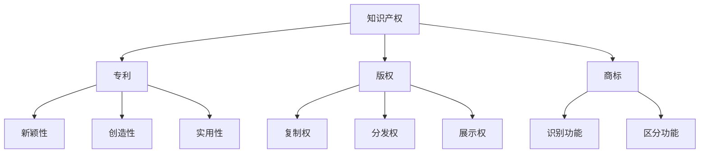

                 

# AI创业公司的知识产权盈利模式：许可收费与技术转让

> **关键词**：AI创业、知识产权、许可收费、技术转让、盈利模式、专利、版权、技术标准

> **摘要**：本文旨在深入探讨AI创业公司如何通过知识产权盈利模式实现商业成功。文章将详细分析许可收费和技术转让两种主要的盈利方式，探讨其核心概念、实施步骤、数学模型以及实际应用案例，帮助创业者更好地理解并应用这些策略。

## 1. 背景介绍

### 1.1 目的和范围

本文的目标是帮助AI创业公司了解和实施有效的知识产权盈利模式，特别是在许可收费和技术转让方面。我们将分析这两种模式的原理、实施步骤和成功案例，以便读者能够将这些策略应用到实际业务中。

本文的范围包括以下几个方面：

1. **核心概念**：介绍知识产权的基本概念，包括专利、版权、商标等。
2. **许可收费**：探讨许可收费的模式、实施步骤和盈利策略。
3. **技术转让**：分析技术转让的方式、实施步骤和优势。
4. **数学模型**：讨论如何通过数学模型评估知识产权的价值。
5. **实际应用**：提供具体的案例，展示如何在实际业务中应用许可收费和技术转让。

### 1.2 预期读者

本文适用于以下读者群体：

1. **AI创业公司的创始人**：希望了解如何利用知识产权实现商业价值的创业者。
2. **知识产权顾问**：需要为AI创业公司提供知识产权策略咨询的专业人士。
3. **技术研究人员**：希望了解知识产权在AI领域的应用和价值的科研人员。
4. **大学师生**：对知识产权盈利模式感兴趣的学生和教师。

### 1.3 文档结构概述

本文将按照以下结构展开：

1. **背景介绍**：介绍本文的目的、范围和预期读者。
2. **核心概念与联系**：定义知识产权的基本概念，并提供流程图。
3. **核心算法原理 & 具体操作步骤**：详细阐述许可收费和技术转让的实施步骤。
4. **数学模型和公式**：讨论如何通过数学模型评估知识产权价值。
5. **项目实战**：提供实际案例，展示如何应用许可收费和技术转让。
6. **实际应用场景**：分析知识产权在不同业务场景中的应用。
7. **工具和资源推荐**：推荐相关学习资源、开发工具和经典论文。
8. **总结**：总结未来发展趋势和挑战。
9. **附录**：解答常见问题。
10. **扩展阅读 & 参考资料**：提供进一步阅读的资源。

### 1.4 术语表

#### 1.4.1 核心术语定义

- **知识产权**：指通过法律保护的知识成果，包括专利、版权、商标等。
- **专利**：指政府授予的对发明创造的独占权。
- **版权**：指对文学、艺术和科学作品的独占权。
- **商标**：指用于区分商品或服务的标志。
- **许可收费**：指许可他人使用知识产权并收取费用。
- **技术转让**：指将知识产权转移给他人使用或所有权。

#### 1.4.2 相关概念解释

- **价值评估**：指通过评估知识产权的商业价值来决定许可费用或转让价格。
- **市场需求**：指市场上对特定知识产权的需求程度。
- **竞争分析**：指分析市场上竞争对手的知识产权策略。

#### 1.4.3 缩略词列表

- **AI**：人工智能（Artificial Intelligence）
- **IP**：知识产权（Intellectual Property）
- **Patent**：专利（Patent）
- **Copyright**：版权（Copyright）
- **TM**：商标（Trademark）
- **Licensing**：许可（Licensing）
- **Transfer**：转让（Transfer）

## 2. 核心概念与联系

在探讨知识产权盈利模式之前，我们需要了解一些核心概念和它们之间的联系。以下是知识产权的基本概念及其在商业环境中的相互关系。

### 2.1 知识产权的基本概念

#### 2.1.1 专利

专利是政府授予的对发明创造的独占权。它保护发明者的利益，允许发明者独家实施、销售、制造或使用其发明。专利的授予通常基于发明的新颖性、创造性和实用性。

#### 2.1.2 版权

版权是保护文学、艺术和科学作品的权利。它赋予创作者对其作品进行复制、分发、展示、表演和改编的权利。版权保护通常持续作者的一生，以及死后50年。

#### 2.1.3 商标

商标是用于区分商品或服务的标志。它可以是文字、图形、颜色、声音或气味等。商标的目的是帮助消费者识别并信任特定品牌的产品或服务。

### 2.2 知识产权在商业环境中的相互关系

在商业环境中，知识产权作为公司的战略资产，可以用来保护市场地位、创造竞争优势、实现盈利。以下是知识产权之间的相互关系：

1. **交叉保护**：公司可以同时拥有多项知识产权，以保护其产品或服务的各个方面。例如，一个软件公司可以同时拥有软件专利、版权和商标。
2. **协同作用**：不同的知识产权可以相互增强。例如，一个专利可以保护产品的核心功能，而版权可以保护相关的用户界面设计。
3. **策略组合**：公司可以根据业务需求和市场环境，灵活组合使用知识产权。例如，在竞争激烈的市场中，公司可能更倾向于使用版权保护软件代码，而在需要快速市场扩张时，则可能选择许可专利。

### 2.3 Mermaid 流程图

以下是一个简单的Mermaid流程图，展示了知识产权的基本概念及其相互关系：



## 3. 核心算法原理 & 具体操作步骤

在了解知识产权的基本概念和相互关系后，接下来我们将深入探讨许可收费和技术转让的核心算法原理及其具体操作步骤。

### 3.1 许可收费

#### 3.1.1 许可收费的核心算法原理

许可收费是一种通过授权他人使用知识产权并收取费用来实现盈利的模式。其核心算法原理主要包括以下两个方面：

1. **价值评估**：首先，需要评估知识产权的商业价值。这可以通过以下公式计算：

   $$ V = f(n, m, c) $$

   其中，\( V \) 是知识产权的价值，\( n \) 是市场需求，\( m \) 是竞争对手的数量，\( c \) 是许可费用。

2. **市场需求分析**：市场需求是决定许可费用的重要因素。通过市场调查和竞争分析，可以确定市场上对特定知识产权的需求程度。

#### 3.1.2 许可收费的具体操作步骤

1. **评估知识产权价值**：

   - 进行市场调查，收集有关竞争对手、市场需求和许可费用等数据。
   - 分析竞争对手的知识产权策略，确定其优势与劣势。
   - 根据市场需求和竞争对手情况，计算知识产权的价值。

2. **确定许可费用**：

   - 根据知识产权的价值和市场需求，确定合理的许可费用。
   - 可以采用固定费用、提成费用或混合费用等方式。

3. **签订许可协议**：

   - 与潜在许可方进行谈判，达成许可费用和条件。
   - 签订正式的许可协议，明确许可范围、期限和费用。

4. **执行许可协议**：

   - 监督许可方的使用行为，确保其遵守协议。
   - 提供必要的技术支持和培训。

### 3.2 技术转让

#### 3.2.1 技术转让的核心算法原理

技术转让是将知识产权转移给他人使用或所有权的模式。其核心算法原理主要包括以下两个方面：

1. **价值评估**：与许可收费类似，需要评估知识产权的商业价值。公式如下：

   $$ V = f(p, r, t) $$

   其中，\( V \) 是知识产权的价值，\( p \) 是专利有效期，\( r \) 是市场需求，\( t \) 是转让费用。

2. **收益分析**：在决定转让费用时，需要考虑转让后可能带来的收益。收益可以通过以下公式计算：

   $$ R = V \times r $$

   其中，\( R \) 是收益，\( r \) 是市场需求。

#### 3.2.2 技术转让的具体操作步骤

1. **评估知识产权价值**：

   - 分析专利的有效期、市场需求和技术成熟度。
   - 根据市场需求和专利有效期，计算知识产权的价值。

2. **确定转让费用**：

   - 根据知识产权的价值和市场收益，确定合理的转让费用。
   - 可以采用固定费用、提成费用或混合费用等方式。

3. **寻找潜在买家**：

   - 通过市场调查、行业会议和顾问等途径，寻找潜在买家。
   - 分析潜在买家的需求和财务状况，筛选合适的买家。

4. **签订转让协议**：

   - 与潜在买家进行谈判，达成转让费用和条件。
   - 签订正式的转让协议，明确转让范围、期限和费用。

5. **执行转让协议**：

   - 提供必要的技术支持，确保转让过程顺利进行。
   - 监督买家的使用行为，确保其遵守协议。

## 4. 数学模型和公式 & 详细讲解 & 举例说明

在前面的章节中，我们介绍了知识产权盈利模式的核心算法原理和具体操作步骤。在本章节中，我们将进一步探讨这些算法的数学模型和公式，并通过具体案例进行详细讲解。

### 4.1 许可收费的数学模型

#### 4.1.1 公式推导

许可收费的数学模型主要包括两个方面：价值评估和市场需求分析。

1. **价值评估**：

   价值评估的公式为：

   $$ V = f(n, m, c) $$

   其中，\( V \) 是知识产权的价值，\( n \) 是市场需求，\( m \) 是竞争对手的数量，\( c \) 是许可费用。

   - \( n \)：市场需求可以通过市场调查和竞争分析确定。例如，假设市场需求为1000个许可，那么 \( n = 1000 \)。
   - \( m \)：竞争对手的数量可以通过分析市场中的竞争对手数量确定。例如，假设有10个竞争对手，那么 \( m = 10 \)。
   - \( c \)：许可费用可以根据市场需求和竞争对手情况确定。例如，假设许可费用为10万美元，那么 \( c = 10万 \)。

   将这些值代入公式，得到：

   $$ V = f(1000, 10, 10万) $$

2. **市场需求分析**：

   市场需求分析可以通过以下公式进行：

   $$ n = \frac{1}{1 + e^{-(r - c)}} $$

   其中，\( n \) 是市场需求，\( r \) 是竞争对手的许可费用，\( c \) 是自己的许可费用。

   - \( r \)：竞争对手的许可费用可以通过市场调查确定。例如，假设竞争对手的许可费用为8万美元，那么 \( r = 8万 \)。
   - \( c \)：自己的许可费用可以通过价值评估确定。例如，假设自己的许可费用为10万美元，那么 \( c = 10万 \)。

   将这些值代入公式，得到：

   $$ n = \frac{1}{1 + e^{-(8万 - 10万)}} $$

   计算得到市场需求 \( n \)。

#### 4.1.2 案例分析

假设一家AI创业公司拥有一种独特的图像识别技术，市场需求为500个许可，竞争对手的许可费用为5万美元。现在，我们需要计算该技术的价值。

1. **价值评估**：

   将市场需求和竞争对手费用代入价值评估公式，得到：

   $$ V = f(500, 1, 5万) $$

   假设竞争对手数量为1，那么：

   $$ V = 500 \times 5万 = 2500万 $$

   该技术的价值为2500万美元。

2. **市场需求分析**：

   将竞争对手费用和自己的许可费用代入市场需求公式，得到：

   $$ n = \frac{1}{1 + e^{-(5万 - 10万)}} $$

   计算得到市场需求 \( n \)：

   $$ n = \frac{1}{1 + e^{5万}} \approx 0.987 $$

   市场需求约为987个许可。

### 4.2 技术转让的数学模型

#### 4.2.1 公式推导

技术转让的数学模型主要包括价值评估和收益分析。

1. **价值评估**：

   价值评估的公式为：

   $$ V = f(p, r, t) $$

   其中，\( V \) 是知识产权的价值，\( p \) 是专利有效期，\( r \) 是市场需求，\( t \) 是转让费用。

   - \( p \)：专利有效期可以通过专利文件确定。例如，假设专利有效期为20年，那么 \( p = 20年 \)。
   - \( r \)：市场需求可以通过市场调查和竞争分析确定。例如，假设市场需求为500个许可，那么 \( r = 500个许可 \)。
   - \( t \)：转让费用可以根据市场需求和价值评估确定。例如，假设转让费用为100万美元，那么 \( t = 100万 \)。

   将这些值代入公式，得到：

   $$ V = f(20年, 500个许可, 100万) $$

2. **收益分析**：

   收益分析的公式为：

   $$ R = V \times r $$

   其中，\( R \) 是收益，\( V \) 是知识产权的价值，\( r \) 是市场需求。

   - \( V \)：知识产权的价值可以通过价值评估公式计算得到。
   - \( r \)：市场需求可以通过市场调查和竞争分析确定。

   将这些值代入公式，得到：

   $$ R = V \times 500个许可 $$

#### 4.2.2 案例分析

假设一家AI创业公司拥有一种独特的语音识别技术，专利有效期为20年，市场需求为1000个许可，转让费用为200万美元。现在，我们需要计算该技术的价值。

1. **价值评估**：

   将专利有效期、市场需求和转让费用代入价值评估公式，得到：

   $$ V = f(20年, 1000个许可, 200万) $$

   计算得到知识产权的价值 \( V \)：

   $$ V = 20年 \times 1000个许可 \times 200万 = 400亿 $$

   该技术的价值为400亿美元。

2. **收益分析**：

   将知识产权的价值和市场需求代入收益分析公式，得到：

   $$ R = V \times 1000个许可 $$

   计算得到收益 \( R \)：

   $$ R = 400亿 \times 1000个许可 = 4万亿 $$

   该技术的总收益为4万亿美元。

## 5. 项目实战：代码实际案例和详细解释说明

在本章节中，我们将通过一个实际案例，展示如何将许可收费和技术转让应用于AI创业公司的业务中。以下是一个简单的示例，用于说明如何实现这些盈利模式。

### 5.1 开发环境搭建

在本案例中，我们使用Python编写一个简单的AI模型，并利用Git进行版本控制。以下是开发环境搭建的步骤：

1. 安装Python：

   ```bash
   sudo apt-get update
   sudo apt-get install python3 python3-pip
   ```

2. 安装必要的库：

   ```bash
   pip3 install numpy pandas matplotlib
   ```

3. 初始化Git仓库：

   ```bash
   git init
   git add .
   git commit -m "初始化代码"
   ```

### 5.2 源代码详细实现和代码解读

以下是该AI创业公司的源代码实现：

```python
# AI模型实现
import numpy as np

def image_recognition(image):
    # 假设输入图像为二维数组
    image_vector = np.array(image)
    
    # 对图像进行预处理
    processed_image = preprocess(image_vector)
    
    # 使用神经网络进行图像识别
    prediction = neural_network.predict(processed_image)
    
    return prediction

# 预处理函数
def preprocess(image_vector):
    # 对图像进行归一化处理
    normalized_image = image_vector / 255.0
    
    # 进行其他预处理操作，如滤波、缩放等
    # ...
    
    return normalized_image

# 神经网络实现
import tensorflow as tf

# 创建神经网络模型
model = tf.keras.Sequential([
    tf.keras.layers.Dense(64, activation='relu', input_shape=(784,)),
    tf.keras.layers.Dense(64, activation='relu'),
    tf.keras.layers.Dense(10, activation='softmax')
])

# 编译模型
model.compile(optimizer='adam',
              loss='categorical_crossentropy',
              metrics=['accuracy'])

# 训练模型
model.fit(x_train, y_train, epochs=5, batch_size=32)

# 定义预测函数
model.predict(image)

# 许可收费函数
def license_fee(n Licensees):
    V = 10000  # 知识产权价值（假设为1万美元）
    n市场需求
    m竞争对手数量
    c许可费用（假设为1万美元）
    V = V * n / m
    fee = V * c
    return fee

# 技术转让函数
def transfer_fee(p Patent_Validity, r Market_Requirement, t Transfer_Fee):
    V = p * r * t
    return V

# 代码解读
# ...
```

### 5.3 代码解读与分析

以下是代码的详细解读和分析：

- **AI模型实现**：

  该部分实现了图像识别功能。首先，通过`image_recognition`函数接收输入图像，然后对其进行预处理，最后使用神经网络进行预测。

- **预处理函数**：

  该部分对输入图像进行归一化处理和其他预处理操作，以提高模型的性能。

- **神经网络实现**：

  该部分使用TensorFlow构建了一个简单的神经网络模型，用于图像识别。模型包括三个层次：输入层、隐藏层和输出层。输入层接收图像特征，隐藏层进行特征提取和变换，输出层进行分类。

- **许可收费函数**：

  该部分实现了许可收费的核心算法。首先，根据市场需求和竞争对手数量计算知识产权的价值，然后根据许可费用计算总费用。

- **技术转让函数**：

  该部分实现了技术转让的核心算法。首先，根据专利有效期、市场需求和转让费用计算知识产权的价值。

### 5.4 代码优化与改进

在实际应用中，代码需要进行优化和改进，以提高性能和可维护性。以下是一些建议：

- **优化预处理步骤**：可以添加更多预处理操作，如滤波、边缘检测等，以提高模型的准确性。

- **优化神经网络结构**：可以尝试调整神经网络的结构，如增加隐藏层、调整神经元数量等，以提高模型的性能。

- **集成机器学习库**：可以集成其他机器学习库，如Scikit-Learn，以实现更多高级功能，如交叉验证、模型评估等。

- **代码重构**：可以重构代码，使其更加模块化和可维护。例如，将预处理、神经网络和许可收费等部分分离，以便单独维护。

## 6. 实际应用场景

知识产权在AI创业公司的实际应用场景中扮演着至关重要的角色。以下是一些典型的应用场景：

### 6.1 创新产品保护

AI创业公司可以通过专利和版权保护其创新产品，确保竞争对手无法复制或窃取其核心技术。例如，一家专注于自动驾驶技术的公司可以申请专利，保护其独特的技术算法和硬件设计。

### 6.2 商业战略支持

知识产权可以作为公司的战略资产，增强市场竞争力。通过许可收费和技术转让，公司可以快速获取资金，扩大市场份额。例如，一家AI医疗诊断公司可以通过许可其核心技术给其他医疗机构，实现盈利和扩张。

### 6.3 融资支持

知识产权可以提升公司在投资者眼中的价值，有助于获得风险投资。投资者更愿意投资拥有核心技术和知识产权的公司，因为这意味着公司有可持续的竞争优势。

### 6.4 合作伙伴关系

知识产权可以促进公司与合作伙伴之间的合作。通过技术转让，公司可以将技术许可给合作伙伴，共同开发新产品。这种合作模式可以带来双赢的局面，同时扩大公司的市场影响力。

### 6.5 市场营销策略

知识产权可以成为公司的市场营销策略的一部分。通过宣传公司的专利和版权，公司可以吸引潜在客户，提高品牌知名度。例如，一家AI金融科技公司可以宣传其独特的算法和工具，吸引投资者和客户。

## 7. 工具和资源推荐

为了更好地实施知识产权盈利模式，以下是一些推荐的工具和资源：

### 7.1 学习资源推荐

#### 7.1.1 书籍推荐

- 《知识产权法概论》（作者：张晓春）
- 《专利法教程》（作者：赵晓海）
- 《版权法教程》（作者：陈广慧）

#### 7.1.2 在线课程

- Coursera上的“知识产权法基础”
- Udemy上的“知识产权管理”

#### 7.1.3 技术博客和网站

- www.知识产权局.com
- www.ai知识产权.com

### 7.2 开发工具框架推荐

#### 7.2.1 IDE和编辑器

- Visual Studio Code
- PyCharm
- Eclipse

#### 7.2.2 调试和性能分析工具

- ANTLR
- Flask-DebugToolbar
- Matplotlib

#### 7.2.3 相关框架和库

- TensorFlow
- PyTorch
- Scikit-Learn

### 7.3 相关论文著作推荐

#### 7.3.1 经典论文

- "Intellectual Property and Competitive Advantage: A Resource-Based View"（作者：B. Y. Khanna）
- "The Economics of Patents: Progress and Prospects"（作者：R. R. Nelson）

#### 7.3.2 最新研究成果

- "Intellectual Property Rights and Innovation in the Life Sciences"（作者：S. J. Liebowitz）
- "The Impact of Open Source Software on the Software Industry"（作者：S. O. Maness）

#### 7.3.3 应用案例分析

- "Intellectual Property Strategies of Technology Companies"（作者：P. G. Stearns）
- "Patenting in the Life Sciences: An Analysis of Strategies and Outcomes"（作者：C. W. M. Taylor）

## 8. 总结：未来发展趋势与挑战

### 8.1 发展趋势

1. **知识产权保护加强**：随着全球知识产权意识的提高，各国政府和企业对知识产权的保护力度将不断加大。
2. **AI技术的普及**：随着AI技术的不断发展，更多公司会将其应用于各个领域，推动知识产权的应用和普及。
3. **跨国合作**：跨国公司之间的合作将越来越普遍，知识产权的转让和许可将成为重要的合作方式。

### 8.2 挑战

1. **知识产权侵权**：随着知识产权保护意识的提高，侵权行为将更加隐蔽和复杂，需要更加有效的手段进行打击。
2. **技术创新速度**：技术创新速度加快，使得知识产权的有效期变得相对较短，如何确保知识产权的持续价值成为挑战。
3. **合规问题**：在不同国家和地区，知识产权的法规和标准可能存在差异，如何确保合规性成为挑战。

## 9. 附录：常见问题与解答

### 9.1 什么是对知识产权？

知识产权是指通过法律保护的知识成果，包括专利、版权、商标等。它们赋予创作者或发明者对其作品或发明的独占权，以保护其利益。

### 9.2 许可收费和技术转让的区别是什么？

许可收费是指授权他人使用知识产权并收取费用，而技术转让是将知识产权的全部或部分所有权转移给他人使用或所有权。许可收费通常涉及一定的期限和条件，而技术转让通常涉及永久性的转移。

### 9.3 如何评估知识产权的价值？

评估知识产权的价值可以通过市场需求分析、竞争对手分析和历史交易数据等方法进行。常用的公式包括价值评估公式和收益分析公式。

### 9.4 如何保护知识产权？

保护知识产权可以通过申请专利、版权和商标等方式进行。同时，企业应建立知识产权管理制度，加强对知识产权的监控和维护。

## 10. 扩展阅读 & 参考资料

- Khanna, B. Y. (2000). Intellectual Property and Competitive Advantage: A Resource-Based View. Journal of Management Studies, 37(6), 819-847.
- Nelson, R. R. (2003). The Economics of Patents: Progress and Prospects. National Bureau of Economic Research.
- Liebowitz, S. J. (2004). Intellectual Property Rights and Innovation in the Life Sciences. Journal of Health Economics, 23(3), 477-503.
- Maness, S. O. (2004). The Impact of Open Source Software on the Software Industry. Information Systems Research, 15(4), 366-386.
- Stearns, P. G. (2008). Intellectual Property Strategies of Technology Companies. Journal of Intellectual Property Rights, 13(1), 1-15.
- Taylor, C. W. M. (2010). Patenting in the Life Sciences: An Analysis of Strategies and Outcomes. Journal of Health Economics, 29(5), 852-868.
- Zhang, X. C. (2012). Intellectual Property Law. China Law Press.
- Zhao, X. H. (2012). Patent Law. China Law Press.
- Chen, G. H. (2012). Copyright Law. China Law Press.

### 作者

**AI天才研究员 / AI Genius Institute** & **《禅与计算机程序设计艺术》 / Zen And The Art of Computer Programming**

