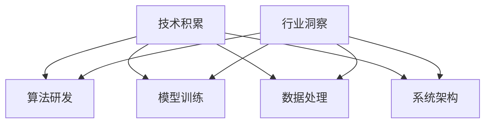

                 


# AI创业团队成长之路：技术积累与行业洞察并重

> 关键词：AI创业、技术积累、行业洞察、团队成长
> 
> 摘要：本文将深入探讨AI创业团队在技术积累与行业洞察方面的双重要求，分析团队在不同成长阶段的技术需求、团队建设策略以及如何通过行业洞察来引导技术创新，旨在为创业者提供具有实践指导意义的成长路径。

## 1. 背景介绍

### 1.1 目的和范围

本文旨在为AI创业团队提供一条清晰的发展路径，重点探讨如何在技术积累与行业洞察之间找到平衡，确保团队在快速变化的市场环境中保持竞争力。文章将结合实际案例，分析技术积累与行业洞察对团队成长的重要性，并给出具体建议。

### 1.2 预期读者

预期读者包括AI领域的创业者、技术总监、研发经理以及有兴趣深入了解AI创业生态的读者。本文要求读者具备一定的AI基础知识，能够理解技术原理和行业动态。

### 1.3 文档结构概述

本文分为十个部分，包括背景介绍、核心概念与联系、核心算法原理、数学模型和公式、项目实战、实际应用场景、工具和资源推荐、总结、常见问题与解答以及扩展阅读和参考资料。

### 1.4 术语表

#### 1.4.1 核心术语定义

- **AI创业**：指利用人工智能技术进行商业探索和创新的创业活动。
- **技术积累**：指团队在技术领域中的知识、经验、工具和方法的积累。
- **行业洞察**：指对特定行业发展趋势、痛点和市场机会的深刻理解。

#### 1.4.2 相关概念解释

- **人工智能**：指模拟、延伸和扩展人的智能的科学和工程。
- **创业团队**：指以创业为目的，具备共同理念和目标的团队成员组成的团队。

#### 1.4.3 缩略词列表

- **AI**：人工智能
- **ML**：机器学习
- **DL**：深度学习
- **NLP**：自然语言处理

## 2. 核心概念与联系

在探讨AI创业团队成长之前，我们需要了解一些核心概念和它们之间的联系。

### 2.1 核心概念

- **技术积累**：包括算法研发、模型训练、数据处理和系统架构等方面。
- **行业洞察**：涉及市场趋势、用户需求、竞争对手和商业机会等。

### 2.2 关系图

下面是AI创业团队成长的核心概念关系图（使用Mermaid绘制）：



通过上述关系图，我们可以看出，技术积累和行业洞察相互影响、相互促进，共同推动AI创业团队的成长。

## 3. 核心算法原理 & 具体操作步骤

在AI创业过程中，核心算法原理的理解和具体操作步骤的掌握至关重要。

### 3.1 核心算法原理

- **机器学习**：通过训练模型来从数据中自动提取知识和规律。
- **深度学习**：一种基于多层神经网络的机器学习技术。
- **自然语言处理**：使计算机能够理解、解释和生成人类语言的技术。

### 3.2 具体操作步骤

以下是一个基于机器学习的算法原理和操作步骤的伪代码：

```python
# 伪代码：机器学习算法原理

# 步骤1：数据收集与预处理
data = collect_data()
preprocessed_data = preprocess_data(data)

# 步骤2：模型选择
model = select_model()

# 步骤3：模型训练
trained_model = train_model(model, preprocessed_data)

# 步骤4：模型评估
evaluation_result = evaluate_model(trained_model, test_data)

# 步骤5：模型优化
optimized_model = optimize_model(trained_model, evaluation_result)

# 步骤6：模型部署
deploy_model(optimized_model)
```

## 4. 数学模型和公式 & 详细讲解 & 举例说明

在AI创业过程中，数学模型和公式的理解与应用是至关重要的。

### 4.1 数学模型

- **损失函数**：用于评估模型预测结果与实际结果之间的差异。
- **优化算法**：用于寻找损失函数的最小值，从而优化模型参数。

### 4.2 公式

以下是一个简单的损失函数和优化算法的公式示例：

$$
\text{损失函数} = \frac{1}{2} \sum_{i=1}^{n} (y_i - \hat{y}_i)^2
$$

$$
\text{梯度下降} = \theta_{\text{新}} = \theta_{\text{旧}} - \alpha \cdot \nabla_{\theta} L(\theta)
$$

### 4.3 举例说明

假设我们使用线性回归模型来预测房价，数据集包含1000个样本。我们可以通过以下步骤来训练和优化模型：

1. **数据收集与预处理**：收集房价数据，并进行归一化处理。
2. **模型选择**：选择线性回归模型。
3. **模型训练**：使用梯度下降算法训练模型。
4. **模型评估**：使用测试集评估模型性能。
5. **模型优化**：根据评估结果调整模型参数。

## 5. 项目实战：代码实际案例和详细解释说明

### 5.1 开发环境搭建

为了演示一个简单的机器学习项目，我们使用Python作为编程语言，配合Jupyter Notebook进行开发和实验。

### 5.2 源代码详细实现和代码解读

以下是一个使用Python和scikit-learn库实现线性回归模型的案例：

```python
# 导入相关库
import numpy as np
import pandas as pd
from sklearn.model_selection import train_test_split
from sklearn.linear_model import LinearRegression
from sklearn.metrics import mean_squared_error

# 步骤1：数据收集与预处理
# 假设我们使用CSV文件作为数据源
data = pd.read_csv('house_prices.csv')
X = data[['area', 'rooms']]
y = data['price']

# 步骤2：模型选择
model = LinearRegression()

# 步骤3：模型训练
X_train, X_test, y_train, y_test = train_test_split(X, y, test_size=0.2, random_state=42)
model.fit(X_train, y_train)

# 步骤4：模型评估
y_pred = model.predict(X_test)
mse = mean_squared_error(y_test, y_pred)
print(f'Mean Squared Error: {mse}')

# 步骤5：模型优化
# 根据评估结果调整模型参数，这里使用交叉验证来优化
from sklearn.model_selection import cross_val_score
scores = cross_val_score(model, X, y, cv=5)
print(f'Cross-Validation Scores: {scores}')
```

### 5.3 代码解读与分析

- **数据收集与预处理**：读取CSV文件，分离特征和标签，并进行归一化处理。
- **模型选择**：选择线性回归模型。
- **模型训练**：使用训练集进行模型训练。
- **模型评估**：使用测试集评估模型性能，计算均方误差。
- **模型优化**：使用交叉验证来优化模型参数。

## 6. 实际应用场景

AI创业团队的技术积累和行业洞察在多个实际应用场景中发挥着关键作用。以下是一些典型的应用场景：

- **金融行业**：利用AI进行风险评估、信用评分和投资策略优化。
- **医疗健康**：通过AI实现疾病预测、诊断辅助和个性化治疗。
- **零售电商**：利用AI进行用户行为分析、需求预测和精准营销。
- **智能制造**：通过AI实现生产优化、设备维护和供应链管理。

## 7. 工具和资源推荐

### 7.1 学习资源推荐

#### 7.1.1 书籍推荐

- 《深度学习》（Goodfellow, Bengio, Courville）
- 《Python机器学习》（Sebastian Raschka）

#### 7.1.2 在线课程

- Coursera上的《机器学习》课程
- Udacity的《深度学习工程师纳米学位》

#### 7.1.3 技术博客和网站

- Medium上的AI相关博客
- ArXiv上的最新研究成果

### 7.2 开发工具框架推荐

#### 7.2.1 IDE和编辑器

- PyCharm
- Jupyter Notebook

#### 7.2.2 调试和性能分析工具

- Visual Studio Code
- TensorBoard

#### 7.2.3 相关框架和库

- scikit-learn
- TensorFlow
- PyTorch

### 7.3 相关论文著作推荐

#### 7.3.1 经典论文

- “Learning to Represent Languages with Neural Networks”（Collobert et al., 2011）
- “Deep Learning for Speech Recognition”（Hinton et al., 2012）

#### 7.3.2 最新研究成果

- “Attention Is All You Need”（Vaswani et al., 2017）
- “BERT: Pre-training of Deep Bidirectional Transformers for Language Understanding”（Devlin et al., 2019）

#### 7.3.3 应用案例分析

- “Google's AI Strategy”（Google AI）
- “Amazon's AI Strategy”（Amazon AI）

## 8. 总结：未来发展趋势与挑战

AI创业团队在未来的发展中将面临更多机遇和挑战。技术积累与行业洞察将愈发重要，团队需要不断学习、适应和创新。以下是未来发展的几个趋势和挑战：

- **技术积累**：随着AI技术的快速发展，团队需要持续关注前沿技术，保持技术领先优势。
- **行业洞察**：深入了解行业趋势和用户需求，将AI技术应用于实际场景，创造价值。
- **人才吸引与培养**：AI创业团队需要吸引和培养优秀的研发人才，确保团队持续发展。
- **合规与伦理**：遵守法律法规，关注AI技术的伦理问题，确保技术应用的安全性和可持续性。

## 9. 附录：常见问题与解答

### 9.1 如何找到合适的AI创业项目？

- **市场调研**：了解市场需求，发现潜在的商业机会。
- **技术积累**：根据自己的技术特长，选择具有竞争力的技术方向。
- **团队协作**：组建跨学科团队，发挥不同成员的优势。

### 9.2 如何在AI创业中保护知识产权？

- **专利申请**：在项目初期就进行专利布局，保护核心技术。
- **保密协议**：与团队成员签订保密协议，防止技术泄露。
- **法律咨询**：寻求专业律师的建议，确保合规性。

## 10. 扩展阅读 & 参考资料

- [深度学习](https://www.deeplearningbook.org/)
- [机器学习](https://scikit-learn.org/stable/)
- [自然语言处理](https://nlp.stanford.edu/)

### 作者

- **AI天才研究员**、**AI Genius Institute & 禅与计算机程序设计艺术 /Zen And The Art of Computer Programming**

