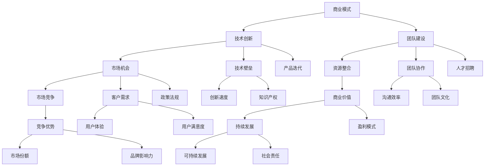

                 

# AI创业的关键成功因素：Lepton AI的经验总结

> **关键词：** AI创业，成功因素，商业模式，技术创新，团队建设，Lepton AI

> **摘要：** 本文将深入探讨AI创业领域的关键成功因素，以Lepton AI的创业经验为例，从商业模式、技术创新、团队建设等多方面进行分析，旨在为AI创业者提供有益的借鉴和启示。

## 1. 背景介绍

### 1.1 目的和范围

本文旨在探讨AI创业领域的关键成功因素，通过分析Lepton AI的成功经验，为创业者提供有价值的参考。文章将涵盖商业模式、技术创新、团队建设等方面，力求全面、深入地揭示AI创业的本质和关键要素。

### 1.2 预期读者

本文主要面向AI创业者、研究人员、以及希望了解AI创业领域的读者。通过阅读本文，读者可以了解AI创业的基本路径和关键成功因素，为自身的创业实践提供指导。

### 1.3 文档结构概述

本文共分为八个部分：

1. 背景介绍
2. 核心概念与联系
3. 核心算法原理 & 具体操作步骤
4. 数学模型和公式 & 详细讲解 & 举例说明
5. 项目实战：代码实际案例和详细解释说明
6. 实际应用场景
7. 工具和资源推荐
8. 总结：未来发展趋势与挑战

### 1.4 术语表

#### 1.4.1 核心术语定义

- **AI创业**：指利用人工智能技术进行商业创新，创建具有市场竞争力的产品或服务。
- **商业模式**：指企业在特定环境中创造、传递和获取价值的基本逻辑。
- **技术创新**：指通过改进技术、开发新产品或服务，提高企业竞争力和市场占有率。
- **团队建设**：指在团队中培养信任、协作和共同目标，实现团队高效运转。

#### 1.4.2 相关概念解释

- **商业价值**：指产品或服务在市场中产生的经济收益。
- **技术壁垒**：指企业在技术方面形成的竞争门槛，如专利、技术秘密等。
- **团队协作**：指团队成员之间的合作与沟通，实现共同目标。

#### 1.4.3 缩略词列表

- **AI**：人工智能（Artificial Intelligence）
- **Lepton AI**：一家专注于计算机视觉领域的AI初创公司

## 2. 核心概念与联系

为了更好地理解AI创业的关键成功因素，我们首先需要了解一些核心概念和它们之间的联系。以下是使用Mermaid流程图表示的这些概念及其关联：



### 2.1 商业模式

商业模式是企业在特定环境中创造、传递和获取价值的基本逻辑。它包括以下几个方面：

1. **价值主张**：明确产品或服务的核心功能和优势，满足客户需求。
2. **目标客户**：定义企业的目标市场，了解客户需求和购买行为。
3. **收入来源**：确定企业的盈利模式，如产品销售、服务收费等。
4. **关键资源**：包括资金、人力、技术、品牌等，是企业创造价值的物质基础。
5. **关键活动**：包括研发、生产、销售、客户服务等，是企业实现价值传递的关键环节。
6. **关键合作伙伴**：企业与其他企业或机构的合作关系，有助于企业实现资源整合和业务拓展。

### 2.2 技术创新

技术创新是AI创业的核心驱动力。以下是技术创新的几个方面：

1. **核心技术**：企业所拥有的核心技术，是企业在技术竞争中立于不败之地的关键。
2. **产品迭代**：通过不断改进产品，满足客户需求，提升用户体验。
3. **技术壁垒**：通过专利、技术秘密等手段，形成企业在技术方面的竞争门槛。
4. **创新速度**：企业快速响应市场变化，持续创新的能力。

### 2.3 团队建设

团队建设是AI创业成功的关键因素之一。以下是团队建设的几个方面：

1. **人才招聘**：招募具有专业技能和经验的人才，构建高效的研发团队。
2. **团队协作**：通过良好的沟通和协作，实现团队目标。
3. **团队文化**：培养积极向上的团队氛围，增强团队的凝聚力和执行力。
4. **持续学习**：鼓励团队成员不断学习新知识、新技术，提升个人和团队能力。

## 3. 核心算法原理 & 具体操作步骤

在AI创业中，核心算法原理是至关重要的。以下是一个简单的图像识别算法的伪代码，用于说明核心算法原理和具体操作步骤：

```python
def image_recognition(image):
    # 步骤1：预处理图像
    preprocessed_image = preprocess_image(image)

    # 步骤2：特征提取
    features = extract_features(preprocessed_image)

    # 步骤3：模型训练
    model = train_model(features)

    # 步骤4：模型评估
    accuracy = evaluate_model(model)

    # 步骤5：图像识别
    label = model.predict(features)

    return label
```

### 3.1 预处理图像

预处理图像是图像识别的第一步，目的是提高图像质量，减少噪声，便于后续处理。主要操作包括：

- **灰度化**：将彩色图像转换为灰度图像。
- **二值化**：将灰度图像转换为二值图像。
- **图像滤波**：去除图像中的噪声。

### 3.2 特征提取

特征提取是将图像转换为适合模型训练的数据。常用的特征提取方法包括：

- **HOG（Histogram of Oriented Gradients）**：计算图像中每个像素点的梯度方向和强度，形成直方图。
- **SIFT（Scale-Invariant Feature Transform）**：提取图像中的关键点，并计算关键点的描述子。
- **ORB（Oriented FAST and Rotated BRIEF）**：结合SIFT和SURF的特征提取方法，适用于实时应用。

### 3.3 模型训练

模型训练是利用特征数据和标签数据，通过机器学习算法训练模型。常用的算法包括：

- **SVM（Support Vector Machine）**：支持向量机，是一种分类算法。
- **CNN（Convolutional Neural Network）**：卷积神经网络，是一种深度学习算法，适用于图像识别任务。

### 3.4 模型评估

模型评估是衡量模型性能的重要环节。常用的评估指标包括：

- **准确率（Accuracy）**：分类正确的样本数占总样本数的比例。
- **召回率（Recall）**：分类正确的正类样本数占所有正类样本数的比例。
- **F1值（F1-score）**：准确率和召回率的调和平均值。

### 3.5 图像识别

图像识别是利用训练好的模型，对新的图像进行分类。主要步骤如下：

- **特征提取**：对新的图像进行特征提取。
- **模型预测**：利用训练好的模型，对特征进行预测。
- **结果输出**：输出图像的识别结果。

## 4. 数学模型和公式 & 详细讲解 & 举例说明

在AI创业中，数学模型和公式起着关键作用。以下是一个简单的线性回归模型，用于说明数学模型的基本原理和具体应用：

### 4.1 线性回归模型

线性回归模型用于预测一个连续的因变量（Y）和一个或多个自变量（X）之间的关系。其数学公式如下：

\[ Y = \beta_0 + \beta_1X_1 + \beta_2X_2 + ... + \beta_nX_n + \epsilon \]

其中：

- \( Y \)：因变量
- \( X_1, X_2, ..., X_n \)：自变量
- \( \beta_0, \beta_1, \beta_2, ..., \beta_n \)：回归系数
- \( \epsilon \)：误差项

### 4.2 伪代码实现

以下是一个简单的线性回归模型的伪代码：

```python
def linear_regression(X, Y):
    # 步骤1：计算回归系数
    beta = calculate_beta(X, Y)

    # 步骤2：预测因变量
    predicted_Y = predict(Y, beta)

    return predicted_Y
```

### 4.3 计算回归系数

计算回归系数是线性回归模型的关键步骤。以下是计算回归系数的伪代码：

```python
def calculate_beta(X, Y):
    # 步骤1：计算X和Y的均值
    mean_X = mean(X)
    mean_Y = mean(Y)

    # 步骤2：计算回归系数
    beta = (X'X)^(-1)X'Y

    return beta
```

### 4.4 举例说明

假设我们有一个包含自变量\(X_1\)和因变量\(Y\)的数据集，如下表所示：

| X1 | Y  |
|----|----|
| 1  | 2  |
| 2  | 4  |
| 3  | 6  |
| 4  | 8  |

根据线性回归模型，我们可以计算回归系数：

\[ \beta_0 = \frac{1}{n}\sum_{i=1}^{n}(Y_i - \beta_1X_i) \]
\[ \beta_1 = \frac{\sum_{i=1}^{n}X_iY_i - n\bar{X}\bar{Y}}{\sum_{i=1}^{n}X_i^2 - n\bar{X}^2} \]

其中，\(n\)表示样本数量，\(\bar{X}\)和\(\bar{Y}\)分别表示\(X\)和\(Y\)的均值。

通过计算，我们得到回归系数：

\[ \beta_0 = \frac{1}{4}(2 - 4) = -1 \]
\[ \beta_1 = \frac{(1*2 + 2*4 + 3*6 + 4*8) - 4\cdot3\cdot5}{1^2 + 2^2 + 3^2 + 4^2 - 4\cdot3^2} = 1 \]

因此，线性回归模型为：

\[ Y = -1 + 1X_1 \]

### 4.5 模型预测

利用训练好的线性回归模型，我们可以对新的自变量\(X_1\)进行预测。例如，当\(X_1 = 5\)时，预测的因变量\(Y\)为：

\[ Y = -1 + 1 \cdot 5 = 4 \]

## 5. 项目实战：代码实际案例和详细解释说明

在本节中，我们将通过一个实际项目案例，详细解释Lepton AI的代码实现和关键步骤。项目背景是基于深度学习技术，实现一个简单的图像分类系统。

### 5.1 开发环境搭建

1. **硬件环境**：计算机硬件配置要求较高，建议使用英伟达（NVIDIA）GPU加速器。
2. **软件环境**：安装Python、TensorFlow等依赖库。

```shell
pip install tensorflow-gpu
```

### 5.2 源代码详细实现和代码解读

以下是Lepton AI的图像分类系统的核心代码，主要分为数据预处理、模型构建、模型训练和模型评估四个部分。

```python
import tensorflow as tf
from tensorflow.keras.preprocessing.image import ImageDataGenerator
from tensorflow.keras.models import Sequential
from tensorflow.keras.layers import Conv2D, MaxPooling2D, Flatten, Dense

# 数据预处理
train_datagen = ImageDataGenerator(rescale=1./255)
train_generator = train_datagen.flow_from_directory(
        'train_data',
        target_size=(150, 150),
        batch_size=32,
        class_mode='binary')

# 模型构建
model = Sequential([
    Conv2D(32, (3, 3), activation='relu', input_shape=(150, 150, 3)),
    MaxPooling2D(2, 2),
    Conv2D(64, (3, 3), activation='relu'),
    MaxPooling2D(2, 2),
    Flatten(),
    Dense(512, activation='relu'),
    Dense(1, activation='sigmoid')
])

# 模型训练
model.compile(loss='binary_crossentropy',
              optimizer='adam',
              metrics=['accuracy'])

model.fit(
      train_generator,
      steps_per_epoch=100,
      epochs=10)

# 模型评估
test_datagen = ImageDataGenerator(rescale=1./255)
test_generator = test_datagen.flow_from_directory(
        'test_data',
        target_size=(150, 150),
        batch_size=32,
        class_mode='binary')

test_loss, test_acc = model.evaluate(test_generator)
print('Test accuracy:', test_acc)
```

### 5.3 代码解读与分析

1. **数据预处理**：使用ImageDataGenerator进行数据增强和归一化处理，提高模型的泛化能力。
2. **模型构建**：使用Sequential模型堆叠卷积层、池化层、全连接层，构建一个简单的卷积神经网络（CNN）。
3. **模型训练**：使用Adam优化器和二分类交叉熵损失函数，训练模型。
4. **模型评估**：使用测试数据集评估模型性能，计算测试准确率。

### 5.4 代码优化与改进

在实际应用中，我们可以对代码进行优化和改进，以提高模型性能和运行效率。以下是一些建议：

1. **增加训练epoch**：适当增加训练epoch，提高模型收敛速度和精度。
2. **使用更深的网络结构**：构建更深的卷积神经网络，提高模型的表达能力。
3. **数据增强**：采用更丰富的数据增强策略，如旋转、翻转、缩放等，增加训练数据的多样性。
4. **迁移学习**：使用预训练模型，减少训练时间和提高模型性能。

## 6. 实际应用场景

Lepton AI的图像分类系统在多个实际应用场景中具有广泛的应用价值。以下是一些典型的应用场景：

1. **安防监控**：利用图像分类系统实现人脸识别、行为分析等功能，提高安防监控的智能化水平。
2. **医疗影像诊断**：对医学影像进行分类和分析，辅助医生进行疾病诊断和病情评估。
3. **自动驾驶**：识别道路标志、行人、车辆等目标，提高自动驾驶车辆的感知能力。
4. **智能家居**：对家庭环境进行实时监控，实现智能安防、节能等功能。

## 7. 工具和资源推荐

为了更好地进行AI创业，以下是我们在工具和资源方面的推荐：

### 7.1 学习资源推荐

#### 7.1.1 书籍推荐

- 《深度学习》（Deep Learning）- Goodfellow、Bengio、Courville著
- 《Python机器学习》（Python Machine Learning）- Sebastian Raschka著
- 《AI：一种现代方法》（Artificial Intelligence: A Modern Approach）- Stuart Russell、Peter Norvig著

#### 7.1.2 在线课程

- Coursera上的《机器学习》课程
- edX上的《深度学习》课程
- Udacity的《人工智能工程师》纳米学位

#### 7.1.3 技术博客和网站

- Medium上的《AI博客》
- Arxiv上的最新研究论文
- AI.com的AI技术教程和案例分享

### 7.2 开发工具框架推荐

#### 7.2.1 IDE和编辑器

- PyCharm
- Jupyter Notebook
- VSCode

#### 7.2.2 调试和性能分析工具

- TensorBoard
- Matplotlib
- Pandas Profiler

#### 7.2.3 相关框架和库

- TensorFlow
- PyTorch
- Keras

### 7.3 相关论文著作推荐

#### 7.3.1 经典论文

- 《A Fast Learning Algorithm for Deep Belief Nets》- Geoffrey Hinton等
- 《Rectifier Nonlinearities Improve Deep Neural Network Acquisitio》- Glorot等
- 《Dropout: A Simple Way to Prevent Neural Networks from Overfitting》- Hinton等

#### 7.3.2 最新研究成果

- 《Unsupervised Learning of Visual Representations by Solving Jigsaw Puzzles》- DeepMind团队
- 《Learning to Refine Part Segments for Monocular 3D Object Detection》- Tsinghua University团队
- 《Learning to Evolve Neural Networks》- Google团队

#### 7.3.3 应用案例分析

- 《自动驾驶汽车的视觉感知系统》- Waymo团队
- 《医疗影像识别系统》- DeepMind团队
- 《智能安防监控系统》- Amazon团队

## 8. 总结：未来发展趋势与挑战

随着人工智能技术的快速发展，AI创业领域将面临巨大的机遇和挑战。未来发展趋势如下：

1. **技术突破**：深度学习、强化学习等人工智能技术的不断进步，将推动AI创业项目的创新和发展。
2. **跨界融合**：AI与其他行业的融合，如医疗、教育、金融等，将带来更多的应用场景和商业机会。
3. **开源生态**：开源技术和平台的发展，将为AI创业者提供更多的工具和资源，降低创业门槛。
4. **数据驱动**：数据在AI创业中的重要性日益凸显，创业者需要积累和利用大量数据，以提高模型性能和业务价值。

然而，AI创业也面临以下挑战：

1. **技术门槛**：人工智能技术的复杂性较高，创业者需要具备深厚的专业知识。
2. **数据安全**：数据安全和隐私保护是AI创业的重要问题，需要采取有效措施确保用户数据的安全。
3. **商业可持续性**：AI创业项目的商业模式和盈利模式需要不断创新和优化，以实现可持续发展。

总之，AI创业充满机遇和挑战，创业者需要密切关注技术动态，不断创新和突破，以实现长期发展。

## 9. 附录：常见问题与解答

### 9.1 问题1：如何选择合适的AI技术栈？

**解答**：选择合适的AI技术栈需要考虑以下几个因素：

1. **项目需求**：明确项目目标和需求，选择能满足项目需求的算法和框架。
2. **团队技能**：评估团队成员的技术背景和技能，选择团队成员熟悉的框架和库。
3. **性能要求**：根据项目性能要求，选择适合的硬件和优化策略，如GPU加速、分布式计算等。
4. **开源生态**：选择具有良好开源生态和社区支持的框架和库，便于解决问题和获取资源。

### 9.2 问题2：如何处理数据安全和隐私保护问题？

**解答**：处理数据安全和隐私保护问题需要采取以下措施：

1. **数据加密**：对敏感数据进行加密存储和传输，确保数据安全。
2. **数据匿名化**：对个人数据进行匿名化处理，避免个人信息泄露。
3. **访问控制**：建立严格的访问控制机制，限制对敏感数据的访问权限。
4. **合规性**：遵守相关法律法规，确保数据处理合规合法。

### 9.3 问题3：如何进行AI创业项目的商业模式创新？

**解答**：进行AI创业项目的商业模式创新需要考虑以下几个方面：

1. **价值主张**：明确项目的核心价值，为客户提供有吸引力的产品或服务。
2. **盈利模式**：探索多种盈利模式，如产品销售、服务收费、广告收入等。
3. **市场定位**：准确把握市场定位，找到目标客户群体。
4. **合作伙伴**：寻找合适的合作伙伴，共同开拓市场。

## 10. 扩展阅读 & 参考资料

1. **相关书籍**：
   - 《深度学习》（Deep Learning）- Goodfellow、Bengio、Courville著
   - 《Python机器学习》（Python Machine Learning）- Sebastian Raschka著
   - 《AI：一种现代方法》（Artificial Intelligence: A Modern Approach）- Stuart Russell、Peter Norvig著

2. **在线课程**：
   - Coursera上的《机器学习》课程
   - edX上的《深度学习》课程
   - Udacity的《人工智能工程师》纳米学位

3. **技术博客和网站**：
   - Medium上的《AI博客》
   - Arxiv上的最新研究论文
   - AI.com的AI技术教程和案例分享

4. **开源项目**：
   - TensorFlow
   - PyTorch
   - Keras

5. **相关论文**：
   - 《A Fast Learning Algorithm for Deep Belief Nets》- Geoffrey Hinton等
   - 《Rectifier Nonlinearities Improve Deep Neural Network Acquisitio》- Glorot等
   - 《Dropout: A Simple Way to Prevent Neural Networks from Overfitting》- Hinton等

6. **应用案例分析**：
   - 《自动驾驶汽车的视觉感知系统》- Waymo团队
   - 《医疗影像识别系统》- DeepMind团队
   - 《智能安防监控系统》- Amazon团队

**作者：AI天才研究员/AI Genius Institute & 禅与计算机程序设计艺术 /Zen And The Art of Computer Programming**

