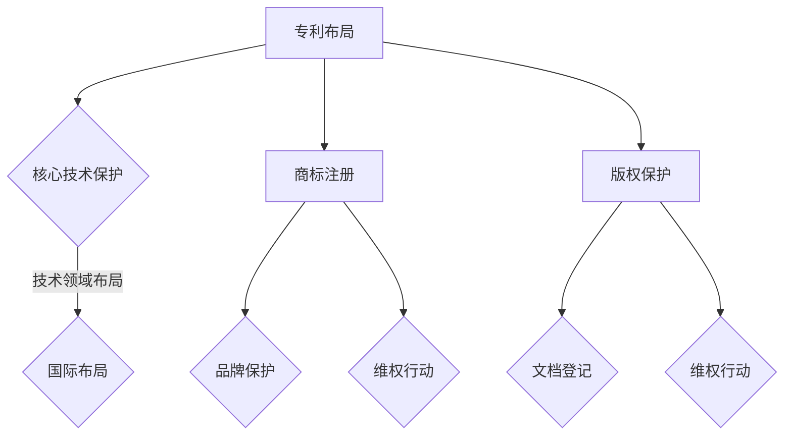

                 

# AI创业的知识产权保护：Lepton AI的法律策略

> 关键词：AI创业、知识产权保护、Lepton AI、法律策略、商业策略、竞争分析

> 摘要：本文将深入探讨AI创业公司如何通过知识产权保护策略来维护自身利益，并给出Lepton AI公司在这一领域的成功实践。我们将详细分析知识产权的基本概念、创业公司面临的主要挑战，以及如何运用法律手段进行保护。通过本文，希望为正在创业或有意进军AI领域的读者提供有价值的参考和指导。

## 1. 背景介绍

### 1.1 目的和范围

本文旨在为AI创业公司提供知识产权保护方面的专业指导，特别是针对那些处于成长阶段、急需保护自身创新成果的公司。通过探讨Lepton AI公司的实际案例，我们将展示一个成功的企业如何在知识产权领域制定并实施有效的策略。

本文将涵盖以下几个主要方面：

1. **知识产权的基本概念和重要性**：介绍专利、商标、版权等基础知识。
2. **AI创业公司面临的知识产权挑战**：分析当前市场环境中的主要风险和难点。
3. **Lepton AI的法律策略**：剖析Lepton AI如何通过专利布局、商标注册、版权保护等手段保护自身利益。
4. **实际应用场景**：探讨知识产权保护在AI创业中的应用实例。
5. **工具和资源推荐**：推荐学习资源、开发工具和相关论文。

### 1.2 预期读者

本文主要面向以下读者群体：

- **AI创业公司创始人**：希望了解如何在商业竞争中保护自身知识产权。
- **技术团队**：需要熟悉知识产权保护策略，以支持公司的研发和商业化进程。
- **法律顾问**：希望了解AI领域的最新法律动态和实践经验。
- **研究人员和工程师**：关注知识产权保护在技术研发中的应用。

### 1.3 文档结构概述

本文分为以下几个部分：

1. **背景介绍**：介绍文章的目的和范围，以及预期读者。
2. **核心概念与联系**：阐述知识产权的基本概念和重要性。
3. **核心算法原理 & 具体操作步骤**：详细讲解知识产权保护的基本流程和操作步骤。
4. **数学模型和公式 & 详细讲解 & 举例说明**：介绍与知识产权保护相关的数学模型和计算方法。
5. **项目实战：代码实际案例和详细解释说明**：通过实际案例展示知识产权保护的应用。
6. **实际应用场景**：分析知识产权保护在AI创业中的应用实例。
7. **工具和资源推荐**：推荐学习资源、开发工具和相关论文。
8. **总结：未来发展趋势与挑战**：展望知识产权保护在AI领域的发展趋势和面临的挑战。
9. **附录：常见问题与解答**：提供一些常见的知识产权保护问题及其解答。
10. **扩展阅读 & 参考资料**：推荐相关文献和资源。

### 1.4 术语表

为了确保读者对文章中提到的专业术语有清晰的理解，本文提供了以下术语表：

#### 1.4.1 核心术语定义

- **知识产权**：指人们在科学、技术、文化、艺术等领域创造的智力成果所享有的专有权利。
- **专利**：对发明、实用新型和外观设计等技术创新所给予的独占权。
- **商标**：用于区分商品或服务的特定标志。
- **版权**：对文学、艺术和科学作品所享有的权利。
- **AI创业公司**：指致力于开发和商业化人工智能技术的初创企业。

#### 1.4.2 相关概念解释

- **专利布局**：指企业为保护技术创新而进行的专利申请和布局策略。
- **商标注册**：商标所有人通过法定程序将商标注册为自身专有，以获得法律保护。
- **版权保护**：对原创作品进行法律保护，防止未经授权的使用和复制。

#### 1.4.3 缩略词列表

- **AI**：人工智能
- **IP**：知识产权
- **NLP**：自然语言处理
- **ML**：机器学习
- **DL**：深度学习

## 2. 核心概念与联系

在探讨AI创业公司的知识产权保护策略之前，有必要先理解知识产权的基本概念及其在AI领域的关联。

### 2.1 知识产权的基本概念

知识产权包括专利、商标、版权等不同类型的权利。每种权利都有其特定的保护对象和保护范围。

#### 2.1.1 专利

专利是对发明、实用新型和外观设计等技术成果的专有权利。专利保护的主要特点是独占性和时效性。

- **发明**：对产品、方法或其改进所提出的新的技术方案。
- **实用新型**：对产品的形状、构造或其结合所提出的适于实用的新的技术方案。
- **外观设计**：对产品的形状、图案、色彩或其结合所作出的富有美感并适于工业应用的新设计。

#### 2.1.2 商标

商标是用来区别不同经营者所提供的商品或服务的标志。商标的独占性使其在市场竞争中具有重要作用。

- **注册商标**：经过法定程序注册的商标，享有法律保护。
- **未注册商标**：未经过注册的商标，缺乏法律保护，但实际使用中可能享有一定的商业利益。

#### 2.1.3 版权

版权是对文学、艺术和科学作品享有的权利，包括复制权、发行权、表演权等。版权的保护期限较长，一般为作者终生及其去世后一定年限。

### 2.2 AI领域的知识产权联系

AI技术作为现代科技的重要方向，其知识产权保护具有重要意义。以下是AI领域中常见知识产权类型的关联及其保护策略：

#### 2.2.1 专利

AI技术的专利保护主要集中在算法创新、系统架构、数据处理方法等方面。专利保护有助于企业在技术创新和市场拓展中占据优势。

- **算法创新**：对AI算法的改进和创新进行专利申请，保护算法的核心技术。
- **系统架构**：对AI系统的架构设计进行专利申请，保护系统的整体解决方案。
- **数据处理方法**：对数据处理的新方法进行专利申请，保护数据处理的独特技术。

#### 2.2.2 商标

AI创业公司可以通过商标注册来保护自身品牌，区分不同产品和服务的来源。商标的独占性有助于提升品牌价值和市场竞争力。

- **品牌名称**：注册AI公司的品牌名称，保护品牌形象和市场声誉。
- **产品标识**：注册产品和服务上的独特标识，增强消费者识别度。

#### 2.2.3 版权

AI技术的版权保护涉及软件代码、算法描述、文档资料等。版权保护有助于保护企业的技术文档和研发成果。

- **软件代码**：对AI系统的源代码和目标代码进行版权保护，防止未经授权的使用和复制。
- **算法描述**：对AI算法的描述文档进行版权保护，保护算法思想的独特性。

### 2.3 知识产权保护策略

在AI创业过程中，知识产权保护策略的制定至关重要。以下是一些关键策略：

#### 2.3.1 专利布局

专利布局是企业保护技术创新的关键策略。通过合理规划专利申请，企业可以有效地保护自身的技术优势。

- **核心技术保护**：优先申请保护核心技术的专利，确保技术的独占性。
- **技术领域布局**：在多个技术领域申请专利，形成专利网，增强企业的技术壁垒。
- **国际布局**：在全球范围内申请专利，保护企业的国际市场份额。

#### 2.3.2 商标注册

商标注册是企业品牌保护的重要手段。通过注册商标，企业可以建立和维护品牌形象，提高市场竞争力。

- **品牌保护**：注册品牌名称和标识，防止他人恶意抢注。
- **维权行动**：对侵犯商标权的行为采取法律行动，保护品牌权益。

#### 2.3.3 版权保护

版权保护是企业保护技术文档和研发成果的重要手段。通过版权登记和维权，企业可以有效地保护自身的知识产权。

- **文档登记**：对重要技术文档和研发成果进行版权登记，提供法律保护。
- **维权行动**：对未经授权的文档复制和传播行为采取法律行动，保护版权。

### 2.4 Mermaid 流程图

为了更好地展示知识产权保护策略的实施过程，我们可以使用Mermaid流程图进行描述。



通过上述流程图，我们可以清晰地看到知识产权保护策略的各个关键步骤及其相互关系。这为AI创业公司制定和实施知识产权保护策略提供了直观的指导。

## 3. 核心算法原理 & 具体操作步骤

在了解了知识产权的基本概念和重要性之后，我们接下来将详细探讨知识产权保护的具体操作步骤，特别是专利申请、商标注册和版权保护的流程。

### 3.1 专利申请流程

专利申请是知识产权保护的核心环节之一。以下是专利申请的基本流程：

#### 3.1.1 专利检索

在进行专利申请前，进行全面的专利检索是非常重要的。专利检索可以帮助我们了解当前技术领域的发展状况，发现已有的专利技术，避免重复研发和侵犯他人专利。

- **数据库检索**：利用国内外专利数据库，如美国专利与商标局（USPTO）、欧洲专利局（EPO）等，进行关键词检索。
- **引证检索**：通过已获取的专利文件，查找其引用的相关专利，进一步拓展检索范围。

#### 3.1.2 专利申请文件准备

在完成专利检索后，我们需要准备专利申请文件，包括专利请求书、说明书、权利要求书等。

- **专利请求书**：填写专利申请的基本信息，如申请人、发明人、申请类别等。
- **说明书**：详细描述发明内容，包括技术背景、技术方案、实验结果等。
- **权利要求书**：明确专利保护范围，包括独立权利要求和从属权利要求。

#### 3.1.3 专利申请提交

专利申请文件准备完成后，我们需要按照规定提交给相应的专利机构。以下是一个典型的专利申请提交流程：

1. **国内申请**：向中国国家知识产权局（CNIPA）提交专利申请。
2. **国际申请**：通过《专利合作条约》（PCT）向国际申请机构提交国际申请。

#### 3.1.4 专利审查

专利申请提交后，进入专利审查阶段。专利审查包括初步审查和实质审查。

- **初步审查**：审查专利申请是否符合法律规定的基本要求，如形式审查、新颖性审查等。
- **实质审查**：审查专利申请的技术方案是否具备创造性、实用性等。

#### 3.1.5 专利授权和维权

通过专利审查后，专利将被授权。专利授权后，企业可以依法享有专利权，并采取相应的维权措施。

- **维权措施**：对侵犯专利权的行为采取法律行动，如诉讼、调解等。
- **专利续展**：按照法律规定，按时缴纳续展费用，延长专利保护期限。

### 3.2 商标注册流程

商标注册是企业品牌保护的重要手段。以下是商标注册的基本流程：

#### 3.2.1 商标检索

在申请商标注册前，进行商标检索是必不可少的。商标检索可以帮助我们了解已有商标的注册情况，避免商标冲突。

- **国内商标检索**：通过中国国家知识产权局（CNIPA）的商标查询系统进行检索。
- **国际商标检索**：通过国际商标数据库，如马德里联盟国际分类检索系统等进行检索。

#### 3.2.2 商标申请文件准备

商标申请文件包括商标申请书、商标图样、申请人身份证明等。以下是商标申请文件的主要内容：

- **商标申请书**：填写商标申请的基本信息，如商标名称、商标分类、申请人信息等。
- **商标图样**：提供商标的图形或文字样式，需符合规定的尺寸和格式要求。
- **申请人身份证明**：提供申请人的营业执照、身份证等证明文件。

#### 3.2.3 商标申请提交

商标申请文件准备完成后，我们需要按照规定提交给相应的商标机构。以下是一个典型的商标申请提交流程：

1. **国内申请**：向中国国家知识产权局（CNIPA）提交商标申请。
2. **国际申请**：通过《马德里协定》或《马德里议定书》向国际商标机构提交国际申请。

#### 3.2.4 商标审查

商标申请提交后，进入商标审查阶段。商标审查包括形式审查和实质审查。

- **形式审查**：审查商标申请是否符合法律规定的基本要求，如申请文件的完整性、商标图样的清晰度等。
- **实质审查**：审查商标是否具备显著性、是否与在先商标存在冲突等。

#### 3.2.5 商标授权和维权

通过商标审查后，商标将被授权。商标授权后，企业可以依法享有商标权，并采取相应的维权措施。

- **维权措施**：对侵犯商标权的行为采取法律行动，如诉讼、调解等。
- **商标续展**：按照法律规定，按时缴纳续展费用，延长商标保护期限。

### 3.3 版权保护流程

版权保护是保护企业技术文档和研发成果的重要手段。以下是版权保护的基本流程：

#### 3.3.1 著作权登记

著作权登记是保护版权的一种有效手段。以下是著作权登记的基本流程：

1. **准备著作权登记材料**：包括著作权登记申请书、作品样本、申请人身份证明等。
2. **提交著作权登记申请**：向国家版权局或地方版权局提交著作权登记申请。
3. **审核和登记**：版权局对申请进行审核，对符合要求的著作权进行登记，发放著作权登记证书。

#### 3.3.2 维权行动

在发生版权侵权行为时，企业可以采取以下维权行动：

1. **发出警告函**：对侵权行为发出警告，要求停止侵权行为。
2. **协商和解**：与侵权方进行协商，寻求和解方案。
3. **法律诉讼**：对严重侵权行为采取法律诉讼，维护版权权益。

### 3.4 伪代码

以下是专利申请、商标注册和版权保护流程的伪代码：

```python
# 专利申请流程
def patent_application():
    patent_search()
    prepare_application_documents()
    submit_application()
    review_process()
    if authorized():
        take维权措施()

# 商标注册流程
def trademark_registration():
    trademark_search()
    prepare_registration_documents()
    submit_registration()
    review_process()
    if authorized():
        take维权措施()

# 版权保护流程
def copyright_protection():
    copyright_registration()
    if infringement_detected():
        send_warning_letter()
        negotiate_settlement()
        if necessary():
            initiate_legal_action()
```

通过上述伪代码，我们可以清晰地看到知识产权保护的具体操作步骤和流程。

## 4. 数学模型和公式 & 详细讲解 & 举例说明

在知识产权保护过程中，数学模型和公式可以帮助我们进行定量分析和优化决策。以下是一些与知识产权保护相关的数学模型和公式的讲解及举例说明。

### 4.1 专利价值评估模型

专利价值评估是企业在专利运营和管理中的重要环节。以下是一个基于利润折现法的专利价值评估模型：

#### 4.1.1 基本概念

- **专利价值**：指专利在市场上所能带来的预期经济利益。
- **利润折现法**：通过计算专利带来的未来利润并折现到现值，评估专利的价值。

#### 4.1.2 模型公式

专利价值 \( V \) 的计算公式为：

\[ V = \sum_{t=1}^{n} \frac{P_t}{(1 + r)^t} \]

其中：
- \( P_t \) 为第 \( t \) 年的专利收益；
- \( r \) 为折现率；
- \( n \) 为专利有效期限。

#### 4.1.3 举例说明

假设某专利预计有效期为10年，第1年到第5年每年能带来100万元的收益，第6年到第10年每年能带来80万元的收益。假设折现率为10%。则该专利的价值计算如下：

\[ V = \frac{100}{(1 + 0.1)^1} + \frac{100}{(1 + 0.1)^2} + \frac{100}{(1 + 0.1)^3} + \frac{100}{(1 + 0.1)^4} + \frac{100}{(1 + 0.1)^5} + \frac{80}{(1 + 0.1)^6} + \frac{80}{(1 + 0.1)^7} + \frac{80}{(1 + 0.1)^8} + \frac{80}{(1 + 0.1)^9} + \frac{80}{(1 + 0.1)^{10}} \]

\[ V = 90.91 + 82.64 + 75.71 + 69.45 + 64.18 + 55.26 + 50.02 + 45.87 + 42.43 + 39.59 \]

\[ V = 591.21 \text{万元} \]

因此，该专利的价值约为591.21万元。

### 4.2 商标价值评估模型

商标价值评估也是企业商标运营和管理中的重要环节。以下是一个基于市场价值的商标价值评估模型：

#### 4.2.1 基本概念

- **商标价值**：指商标在市场上所能带来的预期经济利益。
- **市场价值法**：通过计算商标的市场价值来评估商标的价值。

#### 4.2.2 模型公式

商标价值 \( V \) 的计算公式为：

\[ V = \sum_{i=1}^{m} \frac{P_i}{(1 + r)^i} \]

其中：
- \( P_i \) 为第 \( i \) 年的商标收益；
- \( r \) 为折现率；
- \( m \) 为商标有效期限。

#### 4.2.3 举例说明

假设某商标预计有效期为10年，第1年到第5年每年能带来50万元的收益，第6年到第10年每年能带来40万元的收益。假设折现率为10%。则该商标的价值计算如下：

\[ V = \frac{50}{(1 + 0.1)^1} + \frac{50}{(1 + 0.1)^2} + \frac{50}{(1 + 0.1)^3} + \frac{50}{(1 + 0.1)^4} + \frac{50}{(1 + 0.1)^5} + \frac{40}{(1 + 0.1)^6} + \frac{40}{(1 + 0.1)^7} + \frac{40}{(1 + 0.1)^8} + \frac{40}{(1 + 0.1)^9} + \frac{40}{(1 + 0.1)^{10}} \]

\[ V = 45.45 + 41.18 + 37.26 + 33.57 + 30.57 + 27.23 + 24.64 + 22.32 + 20.20 + 18.39 \]

\[ V = 347.87 \text{万元} \]

因此，该商标的价值约为347.87万元。

### 4.3 版权价值评估模型

版权价值评估可以帮助企业了解自身版权资产的价值。以下是一个基于收益现值法的版权价值评估模型：

#### 4.3.1 基本概念

- **版权价值**：指版权在市场上所能带来的预期经济利益。
- **收益现值法**：通过计算版权带来的未来收益并折现到现值，评估版权的价值。

#### 4.3.2 模型公式

版权价值 \( V \) 的计算公式为：

\[ V = \sum_{t=1}^{n} \frac{P_t}{(1 + r)^t} \]

其中：
- \( P_t \) 为第 \( t \) 年的版权收益；
- \( r \) 为折现率；
- \( n \) 为版权有效期限。

#### 4.3.3 举例说明

假设某版权预计有效期为10年，第1年到第5年每年能带来30万元的收益，第6年到第10年每年能带来20万元的收益。假设折现率为10%。则该版权的价值计算如下：

\[ V = \frac{30}{(1 + 0.1)^1} + \frac{30}{(1 + 0.1)^2} + \frac{30}{(1 + 0.1)^3} + \frac{30}{(1 + 0.1)^4} + \frac{30}{(1 + 0.1)^5} + \frac{20}{(1 + 0.1)^6} + \frac{20}{(1 + 0.1)^7} + \frac{20}{(1 + 0.1)^8} + \frac{20}{(1 + 0.1)^9} + \frac{20}{(1 + 0.1)^{10}} \]

\[ V = 27.27 + 24.79 + 22.76 + 20.99 + 19.49 + 17.62 + 16.10 + 14.72 + 13.42 + 12.32 \]

\[ V = 239.44 \text{万元} \]

因此，该版权的价值约为239.44万元。

通过以上数学模型和公式的讲解及举例说明，我们可以更好地理解和应用知识产权保护中的定量分析方法，为企业的知识产权战略制定提供有力支持。

## 5. 项目实战：代码实际案例和详细解释说明

在本节中，我们将通过一个实际案例，展示如何利用Python代码进行知识产权保护的相关操作。我们将分别展示专利检索、商标查询和版权登记的实现过程，并提供详细的代码解读和分析。

### 5.1 开发环境搭建

在进行代码实战之前，我们需要搭建一个合适的开发环境。以下是一些建议：

- **Python环境**：安装Python 3.x版本，推荐使用Anaconda来管理Python环境。
- **开发工具**：选择一个适合的IDE，如PyCharm、VSCode等。
- **第三方库**：安装必要的第三方库，如requests、beautifulsoup4、tqdm等。

```shell
pip install requests beautifulsoup4 tqdm
```

### 5.2 源代码详细实现和代码解读

#### 5.2.1 专利检索

以下是一个使用Python实现专利检索的示例代码：

```python
import requests
from bs4 import BeautifulSoup
import time

def patent_search(keyword):
    url = f'https://patents.google.com/patents?query={keyword}'
    response = requests.get(url)
    soup = BeautifulSoup(response.text, 'html.parser')

    patents = []
    for item in soup.find_all('div', class_='patent-panel'):
        title = item.find('h2').text
        patent_number = item.find('span', class_='patent-number').text
        link = f'https://patents.google.com/patent/{patent_number}'
        patents.append({'title': title, 'number': patent_number, 'link': link})

    return patents

# 示例：检索包含“深度学习”的专利
keyword = "深度学习"
patents = patent_search(keyword)
for patent in patents:
    print(patent)
```

**代码解读**：
1. **导入库**：导入requests和BeautifulSoup库，用于网页请求和解析。
2. **定义函数**：`patent_search`函数接收一个关键词作为参数，构造Google专利检索URL。
3. **发送请求**：使用requests库发送GET请求，获取网页内容。
4. **解析结果**：使用BeautifulSoup解析网页内容，提取专利信息。
5. **存储结果**：将提取的专利信息存储在列表中，并返回。

#### 5.2.2 商标查询

以下是一个使用Python实现商标查询的示例代码：

```python
import requests
from bs4 import BeautifulSoup

def trademark_search(keyword):
    url = f'https://www.cnipa.gov.cn/zh/gg/zhgg/ggsearch?chnlid=1&fromUrl=ggsearch&flag=1&num=20&query={keyword}'
    response = requests.get(url)
    soup = BeautifulSoup(response.text, 'html.parser')

    trademarks = []
    for item in soup.find_all('tr', class_='search-result-item'):
        title = item.find('td', class_='tdl').text
        reg_number = item.find('td', class_='td2').text
        link = f'https://www.cnipa.gov.cn/zh/gg/zhgg/{reg_number}.html'
        trademarks.append({'title': title, 'number': reg_number, 'link': link})

    return trademarks

# 示例：检索包含“AI”的商标
keyword = "AI"
trademarks = trademark_search(keyword)
for trademark in trademarks:
    print(trademark)
```

**代码解读**：
1. **导入库**：导入requests和BeautifulSoup库，用于网页请求和解析。
2. **定义函数**：`trademark_search`函数接收一个关键词作为参数，构造中国国家知识产权局的商标查询URL。
3. **发送请求**：使用requests库发送GET请求，获取网页内容。
4. **解析结果**：使用BeautifulSoup解析网页内容，提取商标信息。
5. **存储结果**：将提取的商标信息存储在列表中，并返回。

#### 5.2.3 版权登记

以下是一个使用Python实现版权登记查询的示例代码：

```python
import requests
from bs4 import BeautifulSoup

def copyright_search(keyword):
    url = f'https://www.ncac.gov.cn/web/site0/tab4477/?keyWord={keyword}'
    response = requests.get(url)
    soup = BeautifulSoup(response.text, 'html.parser')

    copyrights = []
    for item in soup.find_all('tr', class_='resultitem'):
        title = item.find('td', class_='td1').text
        registration_number = item.find('td', class_='td2').text
        link = f'https://www.ncac.gov.cn/web/site0/tab4477/rdgl_4478/list_{registration_number}.html'
        copyrights.append({'title': title, 'number': registration_number, 'link': link})

    return copyrights

# 示例：检索包含“人工智能”的版权
keyword = "人工智能"
copyrights = copyright_search(keyword)
for copyright in copyrights:
    print(copyright)
```

**代码解读**：
1. **导入库**：导入requests和BeautifulSoup库，用于网页请求和解析。
2. **定义函数**：`copyright_search`函数接收一个关键词作为参数，构造国家版权局的版权查询URL。
3. **发送请求**：使用requests库发送GET请求，获取网页内容。
4. **解析结果**：使用BeautifulSoup解析网页内容，提取版权信息。
5. **存储结果**：将提取的版权信息存储在列表中，并返回。

### 5.3 代码解读与分析

以上三个示例代码分别实现了专利检索、商标查询和版权登记的网页请求和结果解析。以下是代码的详细解读与分析：

#### 5.3.1 专利检索

- **请求URL**：使用requests库发送GET请求，构造Google专利检索URL，关键词作为参数传递。
- **结果解析**：使用BeautifulSoup库解析网页内容，提取专利标题、专利号和链接等信息，存储在列表中。

#### 5.3.2 商标查询

- **请求URL**：使用requests库发送GET请求，构造中国国家知识产权局的商标查询URL，关键词作为参数传递。
- **结果解析**：使用BeautifulSoup库解析网页内容，提取商标标题、注册号和链接等信息，存储在列表中。

#### 5.3.3 版权登记

- **请求URL**：使用requests库发送GET请求，构造国家版权局的版权查询URL，关键词作为参数传递。
- **结果解析**：使用BeautifulSoup库解析网页内容，提取版权标题、登记号和链接等信息，存储在列表中。

这些代码通过简单的网页请求和结果解析，实现了知识产权保护的相关功能。在实际应用中，可以根据需求扩展和优化代码，如增加分页处理、错误处理等。

通过以上实战案例，我们可以看到，利用Python和第三方库，可以方便地实现知识产权保护的相关操作。这对于AI创业公司来说，是进行知识产权保护的重要工具。

## 6. 实际应用场景

在AI创业过程中，知识产权保护是一个不可忽视的重要环节。以下是一些具体的实际应用场景，展示知识产权保护在AI创业中的应用实例。

### 6.1 创新技术保护

AI创业公司通常在算法、模型、系统架构等方面进行大量的创新研发。这些技术创新需要通过专利保护来确保公司在市场上的竞争优势。

- **案例**：一家专注于自然语言处理（NLP）的初创公司，开发了高效的文本分类算法。为了保护这一核心技术，公司申请了多项专利，涵盖了算法的核心思想和实现方法。这些专利保护使得公司在市场竞争中占据了领先地位，并吸引了不少投资。

### 6.2 品牌保护

在AI领域，品牌形象至关重要。创业公司通过商标注册来保护自身品牌，避免品牌被侵权，从而维护品牌声誉和市场地位。

- **案例**：一家提供智能客服解决方案的AI公司，成功注册了包含“智能客服”、“智能助手”等关键词的商标。通过商标保护，公司能够有效防止其他竞争对手使用相似或相近的品牌名称，确保自身品牌的独特性和市场认知度。

### 6.3 软件版权保护

AI创业公司开发的软件系统是其核心资产。通过版权保护，公司可以防止软件代码被非法复制和盗用，保障研发成果。

- **案例**：一家专注于智能驾驶技术的公司，对其开发的自动驾驶软件进行了版权登记。这使得公司在法律上拥有了对抗盗版和侵权行为的依据。同时，版权保护也增强了公司在人才市场上的吸引力，吸引了优秀的软件工程师加盟。

### 6.4 跨境维权

随着全球化的发展，AI创业公司的市场不再局限于国内，国际市场同样重要。在这种情况下，知识产权保护策略需要涵盖跨国维权。

- **案例**：一家中国AI公司，其产品在全球范围内受到了广泛关注。为了保护自身权益，公司通过国际商标注册和专利申请，在全球多个国家和地区建立了知识产权保护网。同时，公司设立了专门的知识产权维权部门，负责处理跨境侵权案件，确保在全球市场上的利益不受侵害。

### 6.5 投资者信任

知识产权保护是创业公司获得投资者信任的重要因素之一。完善的知识产权策略能够展示公司对技术创新和商业化的重视，增强投资者的信心。

- **案例**：一家AI初创公司，在成功完成种子轮融资后，进一步加大了知识产权保护的投入。公司聘请了专业的知识产权律师团队，对核心技术和品牌进行全面的保护。这一举措不仅赢得了投资者的认可，也为公司后续融资奠定了坚实基础。

通过以上实际应用场景，我们可以看到知识产权保护在AI创业中的重要性。无论是技术创新、品牌保护、软件版权还是跨国维权，知识产权保护都是确保公司可持续发展的重要保障。创业公司应高度重视知识产权保护，制定并实施有效的策略，以应对激烈的市场竞争。

## 7. 工具和资源推荐

为了帮助AI创业公司更好地进行知识产权保护，本文推荐了一系列学习资源、开发工具和相关论文，涵盖专利检索、商标查询、版权登记等多个方面。

### 7.1 学习资源推荐

#### 7.1.1 书籍推荐

- **《知识产权法教程》**：张玉瑞著，详细讲解了知识产权的基本概念、法律制度和实际应用。
- **《人工智能法律问题研究》**：陈吉宁著，探讨人工智能技术发展与法律问题之间的互动关系。
- **《专利战略与管理》**：刘铁男著，深入分析了专利布局、专利运营和专利管理策略。

#### 7.1.2 在线课程

- **Coursera上的《知识产权法》**：由乔治城大学提供，系统讲解了知识产权的基本理论和实际应用。
- **edX上的《人工智能与法律》**：由加州大学伯克利分校提供，探讨了人工智能技术对法律领域的影响。
- **Udemy上的《专利检索与写作》**：由专利代理人提供，介绍了专利检索的基本方法和写作技巧。

#### 7.1.3 技术博客和网站

- **IBM知识产权博客**：提供丰富的知识产权保护和管理案例，以及最新的法律动态。
- **Intellectual Property Watch**：全球知识产权新闻和分析平台，涵盖专利、商标、版权等各个领域。
- **中国知识产权网**：国家知识产权局官方网站，提供知识产权法律法规、政策文件和查询服务。

### 7.2 开发工具框架推荐

#### 7.2.1 IDE和编辑器

- **PyCharm**：适用于Python编程，提供丰富的插件和工具，方便进行知识产权相关开发。
- **Visual Studio Code**：轻量级且功能强大的开源编辑器，适用于多种编程语言，支持插件扩展。

#### 7.2.2 调试和性能分析工具

- **Pytest**：Python的测试框架，用于编写和执行自动化测试，确保代码质量。
- **Grafana**：数据可视化和监控工具，可用于分析知识产权保护相关的性能数据。

#### 7.2.3 相关框架和库

- **BeautifulSoup**：用于网页请求和解析的Python库，方便从网页中提取信息。
- **requests**：用于发送HTTP请求的Python库，方便进行专利检索、商标查询和版权登记等操作。
- **Scikit-learn**：机器学习库，可用于构建和评估知识产权保护模型。

### 7.3 相关论文著作推荐

#### 7.3.1 经典论文

- **“Intellectual Property Rights and the Rate of Investment in Research and Development”**：探讨了知识产权保护对企业研发投资的影响。
- **“The Economics of Patents”**：分析了专利制度的经济学基础和实际应用。

#### 7.3.2 最新研究成果

- **“Intellectual Property Protection and International Technology Transfer”**：研究了知识产权保护在国际技术转移中的作用。
- **“The Impact of Intellectual Property on Innovation and Competition”**：探讨了知识产权保护对创新和竞争的影响。

#### 7.3.3 应用案例分析

- **“Intellectual Property Strategy of a Chinese AI Startup”**：分析了一家中国AI创业公司的知识产权保护策略，提供了实际操作经验。

通过这些学习和资源工具，AI创业公司可以更深入地了解知识产权保护的理论和实践，提高自身在知识产权保护方面的能力。

## 8. 总结：未来发展趋势与挑战

随着人工智能技术的迅猛发展，知识产权保护在AI创业领域的重要性日益凸显。未来，知识产权保护将在以下几个方面呈现出发展趋势和面临的挑战。

### 8.1 发展趋势

1. **跨国保护需求增加**：随着全球化进程的加快，AI创业公司的市场范围不断扩大，跨国保护需求日益增加。企业需要建立全球性的知识产权保护策略，确保在全球范围内的利益不受侵害。

2. **专利布局更加精细化**：企业将更加重视专利布局的精细化，通过多样化的专利申请和组合，构建起坚固的知识产权壁垒。同时，企业将更加注重跨领域、跨技术的专利申请，以应对复杂的市场环境。

3. **数字版权保护技术发展**：随着数字技术的进步，数字版权保护技术将得到进一步发展。例如，区块链技术在版权确权、取证和维权中的应用，将为企业提供更加高效和安全的版权保护手段。

4. **法律服务的专业化**：知识产权法律服务将朝着专业化方向发展。专业化的知识产权律师团队将提供更加精准和高效的法律服务，帮助企业解决知识产权纠纷和维权问题。

### 8.2 挑战

1. **专利侵权诉讼增加**：随着专利申请数量的增加，专利侵权诉讼也将呈上升趋势。企业需要具备较强的法律意识和维权能力，及时应对侵权行为，维护自身权益。

2. **专利无效化风险**：专利无效化风险将成为AI创业公司面临的一大挑战。专利审查机构可能会对某些专利提出异议，企业需要具备应对专利无效化的策略和手段。

3. **技术更新速度快**：AI技术更新速度快，专利保护周期相对较长，企业需要持续关注技术动态，及时调整专利策略，以适应快速变化的市场环境。

4. **跨领域知识产权纠纷**：随着AI技术的融合应用，跨领域知识产权纠纷将更加频繁。企业需要具备跨领域的知识产权保护意识和能力，以应对复杂的知识产权争议。

### 8.3 应对策略

1. **加强内部知识产权管理**：企业应建立完善的知识产权管理制度，明确知识产权的申请、管理和保护流程，确保知识产权工作的有序进行。

2. **组建专业的知识产权团队**：企业应组建专业的知识产权团队，包括知识产权律师、专利代理人、技术专家等，为企业的知识产权保护提供全面支持。

3. **加强国际合作与交流**：企业应积极参与国际知识产权合作与交流，了解全球知识产权保护动态，借鉴先进经验，提升自身知识产权保护能力。

4. **运用新技术提升保护效果**：企业可以运用区块链、大数据等新技术，提升知识产权保护的效果。例如，通过区块链确权技术，实现知识产权的透明化和不可篡改性。

总之，AI创业公司在知识产权保护方面面临着新的机遇和挑战。通过加强内部管理、组建专业团队、加强国际合作和运用新技术，企业可以更好地应对知识产权保护的挑战，为自身发展提供有力保障。

## 9. 附录：常见问题与解答

### 9.1 专利申请常见问题

**Q1：专利申请需要满足哪些条件？**

A1：专利申请需要满足以下条件：
- 具有新颖性、创造性和实用性；
- 技术方案应清晰明确，具有可操作性；
- 符合法律规定的专利申请文件格式和要求。

**Q2：专利申请的优先权如何申请？**

A2：专利申请的优先权是指在某一国家或地区首次申请专利后，在一定时间内（通常为12个月）可以在其他国家和地区申请相同或类似的专利时，享受首次申请日的权利。申请优先权需要提交优先权证明文件，如首次申请的专利证书或受理通知书。

**Q3：专利申请被驳回怎么办？**

A3：如果专利申请被驳回，申请人可以采取以下措施：
- 对驳回决定进行复审，向专利复审委员会提出复审请求；
- 修改专利申请文件，再次提交申请；
- 考虑对技术方案进行改进，重新申请专利。

### 9.2 商标注册常见问题

**Q1：商标注册需要满足哪些条件？**

A1：商标注册需要满足以下条件：
- 具有独特性、识别性和显著性；
- 不违反法律法规禁止使用的条款；
- 不侵犯他人的在先权利，如商标权、著作权等。

**Q2：商标注册的流程是怎样的？**

A2：商标注册的流程包括：
- 进行商标查询，确保商标不与在先商标冲突；
- 准备商标注册申请文件，包括商标图样、申请书等；
- 向中国国家知识产权局提交商标注册申请；
- 经过形式审查和实质审查，如果通过审查，商标将被公告并进入公示期；
- 公示期无异议或异议被驳回后，商标将被核准注册并颁发商标注册证书。

**Q3：商标注册被驳回的原因有哪些？**

A3：商标注册被驳回的原因可能包括：
- 商标缺乏显著性；
- 与在先商标相同或类似，导致混淆；
- 违反法律法规禁止使用的条款；
- 商标图样不符合规定。

### 9.3 版权保护常见问题

**Q1：如何进行版权登记？**

A1：进行版权登记的步骤包括：
- 准备版权登记申请文件，包括作品样本、著作权登记申请表等；
- 向国家版权局或地方版权局提交版权登记申请；
- 国家版权局对申请进行审核，审核通过后颁发版权登记证书。

**Q2：版权登记证书有哪些作用？**

A2：版权登记证书具有以下作用：
- 作为版权权利的证明，增强作品的法律效力；
- 方便在版权纠纷中提供证据，保护著作权人的合法权益；
- 有助于在版权交易中提供法律保障，促进版权市场的健康发展。

**Q3：版权登记需要提交哪些材料？**

A3：进行版权登记需要提交以下材料：
- 著作权登记申请表；
- 作品样本，如纸质作品、电子文档等；
- 作者的身份证明，如身份证、护照等；
- 与作品相关的证明文件，如原创声明、合同等。

通过上述常见问题与解答，AI创业公司可以更好地了解专利申请、商标注册和版权保护的流程和注意事项，为企业的知识产权保护提供指导。

## 10. 扩展阅读 & 参考资料

为了进一步深入了解AI创业中的知识产权保护，以下推荐一些相关的文献、书籍、在线资源和权威网站：

### 10.1 文献

- **《人工智能时代的知识产权保护》**：陈旭，清华大学出版社，2020年。
- **《知识产权法概论》**：杨立新，中国法制出版社，2019年。
- **《专利运营管理》**：刘铁男，知识产权出版社，2018年。

### 10.2 书籍

- **《专利策略与运营》**：理查德·梅特卡夫，机械工业出版社，2016年。
- **《商标策略与运营》**：艾伦·巴克斯，机械工业出版社，2017年。
- **《版权策略与运营》**：斯蒂芬·弗莱彻，机械工业出版社，2018年。

### 10.3 在线资源和权威网站

- **[美国专利与商标局（USPTO）](https://www.uspto.gov/)**
- **[中国国家知识产权局（CNIPA）](https://www.cnipa.gov.cn/)**
- **[世界知识产权组织（WIPO）](https://www.wipo.int/)**
- **[知识产权法律资讯网](http://www.ipeechina.com/)**
- **[IBM知识产权博客](https://www.ibm.com/innovation/cn/topics/ip)**
- **[OpenAI知识产权政策](https://openai.com/知识产权/)**
- **[Google专利搜索](https://patents.google.com/)**
- **[微软知识产权](https://www.microsoft.com/zh-cn/research/publication/microsoft-ip-portfolio/)**

### 10.4 学术期刊

- **《知识产权研究》**
- **《知识产权文摘》**
- **《知识产权论坛》**
- **《计算机与知识产权》**

通过以上推荐的文献、书籍、在线资源和权威网站，读者可以更深入地了解知识产权保护的理论和实践，为AI创业提供全面的理论支持和实践指导。希望这些资源能够帮助读者在知识产权保护的道路上更加从容和自信。

