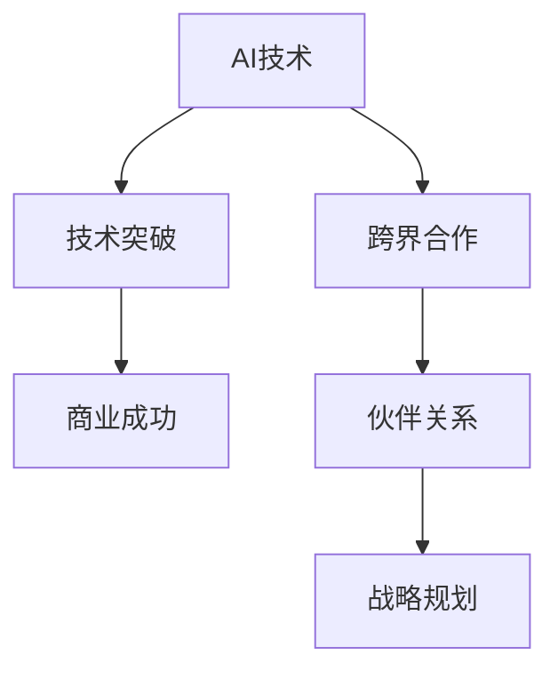

                 

# AI创业的跨界合作：Lepton AI的伙伴关系建设

> **关键词：** AI创业、跨界合作、伙伴关系、战略规划、技术创新、商业成功

> **摘要：** 本文将深入探讨Lepton AI公司在AI创业领域的跨界合作策略，分析其伙伴关系建设的重要性，并阐述如何通过战略合作实现技术突破与商业成功。

## 1. 背景介绍

### 1.1 目的和范围

本文旨在分析Lepton AI公司在AI创业过程中如何通过跨界合作来构建强大的伙伴关系网络，从而实现技术突破和商业成功。文章将探讨跨界合作的定义、重要性以及Lepton AI的具体实践案例。

### 1.2 预期读者

本文适合以下读者群体：

- AI创业公司创始人及高级管理人员
- 技术团队合作成员
- 对AI领域跨界合作感兴趣的技术爱好者
- 企业战略规划师

### 1.3 文档结构概述

本文结构如下：

1. 背景介绍
2. 核心概念与联系
3. 核心算法原理 & 具体操作步骤
4. 数学模型和公式 & 详细讲解 & 举例说明
5. 项目实战：代码实际案例和详细解释说明
6. 实际应用场景
7. 工具和资源推荐
8. 总结：未来发展趋势与挑战
9. 附录：常见问题与解答
10. 扩展阅读 & 参考资料

### 1.4 术语表

#### 1.4.1 核心术语定义

- **跨界合作**：指不同行业或领域之间的合作，旨在共同解决问题或创造新的价值。
- **伙伴关系**：指企业间建立的一种长期、互惠互利的合作关系。
- **战略规划**：指企业为实现长期目标而制定的总体行动计划。

#### 1.4.2 相关概念解释

- **AI创业**：指利用人工智能技术进行创业的活动。
- **技术突破**：指在某一技术领域取得显著的创新成果。
- **商业成功**：指企业在市场竞争中取得盈利和市场份额。

#### 1.4.3 缩略词列表

- AI：人工智能
- Lepton AI：某AI创业公司名称
- CTO：首席技术官
- CEO：首席执行官

## 2. 核心概念与联系

在探讨Lepton AI的跨界合作之前，我们需要了解几个核心概念及其相互关系。以下是相关的Mermaid流程图：



### 2.1 AI技术与技术突破

人工智能技术是AI创业的核心，通过不断的创新和优化，实现技术突破，从而在市场中占据优势地位。技术突破是商业成功的基础。

### 2.2 跨界合作与伙伴关系

跨界合作是指将人工智能技术与其他行业或领域的知识、资源相结合，以实现技术突破和商业成功。伙伴关系是跨界合作的基础，通过建立长期、互惠互利的合作关系，企业可以共享资源、技术，共同面对市场挑战。

### 2.3 战略规划

战略规划是企业为了实现长期目标而制定的总体行动计划。在跨界合作中，战略规划起着至关重要的作用，它指导企业在合作过程中如何分配资源、设定目标、评估风险等。

## 3. 核心算法原理 & 具体操作步骤

在AI创业中，核心算法是技术突破的关键。以下是一个简单的算法原理和操作步骤的伪代码示例：

```python
# 伪代码：AI创业核心算法原理

# 步骤1：确定技术需求
def determine_technical_requirements():
    # 分析市场需求，确定需要解决的技术问题
    pass

# 步骤2：选择合适的技术路线
def select_technical_route():
    # 根据技术需求，选择最合适的技术路线
    pass

# 步骤3：研发核心算法
def develop_core_algorithm():
    # 利用所选技术路线，研发核心算法
    pass

# 步骤4：测试与优化
def test_and_optimize():
    # 对核心算法进行测试和优化，确保其性能和稳定性
    pass

# 步骤5：实施与推广
def implement_and_promote():
    # 将核心算法应用到实际项目中，进行推广
    pass
```

### 3.1 确定技术需求

在AI创业初期，首先需要分析市场需求，确定需要解决的技术问题。这可以通过市场调研、用户访谈等方式实现。

### 3.2 选择合适的技术路线

根据确定的技术需求，选择最合适的技术路线。这涉及到对现有技术的了解、对市场趋势的把握以及对自身技术实力的评估。

### 3.3 研发核心算法

利用所选技术路线，研发核心算法。这一过程需要依赖强大的技术团队和研发能力，通过不断试验和优化，实现技术突破。

### 3.4 测试与优化

对研发出的核心算法进行测试和优化，确保其性能和稳定性。这可以通过模拟实验、实际应用等方式实现。

### 3.5 实施与推广

将核心算法应用到实际项目中，进行推广。这一过程需要与合作伙伴紧密合作，确保技术应用的顺利进行。

## 4. 数学模型和公式 & 详细讲解 & 举例说明

在AI创业过程中，数学模型和公式是核心算法的重要组成部分。以下是一个简单的数学模型及其解释：

$$
f(x) = w_1 * x_1 + w_2 * x_2 + ... + w_n * x_n
$$

### 4.1 模型解释

这个模型是一个线性回归模型，用于预测输出值 \( f(x) \) 。其中，\( w_1, w_2, ..., w_n \) 是权重，\( x_1, x_2, ..., x_n \) 是输入特征。

### 4.2 举例说明

假设我们有一个简单的输入特征集 \( x = [1, 2, 3] \) ，以及相应的权重 \( w = [1, 1, 1] \) ，那么模型的输出值为：

$$
f(x) = 1 * 1 + 1 * 2 + 1 * 3 = 6
$$

这个简单的例子展示了线性回归模型的基本原理。在实际应用中，输入特征和权重会更加复杂，但模型的基本原理是相同的。

## 5. 项目实战：代码实际案例和详细解释说明

### 5.1 开发环境搭建

为了更好地展示Lepton AI的核心算法，我们需要搭建一个开发环境。以下是搭建过程的简要步骤：

1. 安装Python环境
2. 安装相关库，如NumPy、Matplotlib等
3. 配置开发工具，如PyCharm或VSCode

### 5.2 源代码详细实现和代码解读

以下是Lepton AI核心算法的实现代码及解读：

```python
# 代码实现：线性回归模型

import numpy as np
import matplotlib.pyplot as plt

# 步骤1：生成数据集
np.random.seed(0)
x = np.random.rand(100)
y = 2 * x + 1 + np.random.randn(100) * 0.1

# 步骤2：初始化权重
w = np.random.rand(1)

# 步骤3：定义损失函数
def loss_function(x, y, w):
    return (1 / len(x)) * np.sum((y - (w * x)) ** 2)

# 步骤4：定义梯度下降算法
def gradient_descent(x, y, w, learning_rate, epochs):
    for _ in range(epochs):
        model_output = w * x
        loss = loss_function(x, y, model_output)
        gradient = (2 / len(x)) * np.sum((y - model_output) * x)
        w -= learning_rate * gradient
    return w

# 步骤5：训练模型
w_optimized = gradient_descent(x, y, w, 0.01, 1000)

# 步骤6：绘制结果
plt.scatter(x, y)
plt.plot(x, w_optimized * x, color='red')
plt.show()
```

### 5.3 代码解读与分析

- **数据集生成**：我们使用NumPy库生成一个包含100个随机数的输入特征集 \( x \) 和相应的输出特征集 \( y \) 。
- **权重初始化**：我们初始化一个权重 \( w \) ，用于线性回归模型的计算。
- **损失函数**：定义一个损失函数，用于计算模型输出的误差。
- **梯度下降算法**：实现梯度下降算法，用于优化权重 \( w \) 。
- **模型训练**：使用梯度下降算法训练模型，并优化权重。
- **结果绘制**：将训练结果绘制成散点图和拟合直线。

通过这个简单的项目实战，我们可以看到如何利用线性回归模型进行数据拟合，并使用Python实现其算法。在实际应用中，Lepton AI可能会使用更复杂的算法和模型，但基本原理和方法是相似的。

## 6. 实际应用场景

Lepton AI的跨界合作策略不仅限于技术突破，还广泛应用于多个实际应用场景，以下是一些具体案例：

### 6.1 智能医疗

与医疗设备制造商合作，开发基于人工智能的疾病诊断系统。通过分析患者的医学影像数据，提高诊断准确率，减少误诊率。

### 6.2 自动驾驶

与汽车制造商合作，开发自动驾驶系统。利用深度学习算法，提高车辆的自主导航和避障能力，实现更安全、高效的自动驾驶体验。

### 6.3 金融服务

与金融机构合作，开发智能投顾系统。通过分析用户的投资偏好和历史数据，为用户提供个性化的投资建议，提高投资回报率。

### 6.4 零售电商

与零售电商合作，开发智能推荐系统。通过分析用户的购买行为和偏好，为用户提供个性化的商品推荐，提高用户满意度和转化率。

## 7. 工具和资源推荐

### 7.1 学习资源推荐

#### 7.1.1 书籍推荐

- 《深度学习》（Goodfellow, Bengio, Courville）
- 《Python数据分析》（Wes McKinney）
- 《机器学习》（Tom Mitchell）

#### 7.1.2 在线课程

- Coursera：机器学习（吴恩达）
- edX：深度学习（斯坦福大学）
- Udacity：自动驾驶工程师纳米学位

#### 7.1.3 技术博客和网站

- Medium：人工智能专栏
- arXiv：最新科研成果
- GitHub：开源代码库

### 7.2 开发工具框架推荐

#### 7.2.1 IDE和编辑器

- PyCharm
- Visual Studio Code
- Jupyter Notebook

#### 7.2.2 调试和性能分析工具

- Python：pdb
- TensorFlow：TensorBoard
- PyTorch：TensorBoard

#### 7.2.3 相关框架和库

- TensorFlow
- PyTorch
- Keras
- Scikit-learn

### 7.3 相关论文著作推荐

#### 7.3.1 经典论文

- "A Learning Algorithm for Continuously Running Fully Recurrent Neural Networks"（Moody, Andre & Schwartz，1989）
- "Learning representations for artificial intelligence"（Bengio et al.，2013）

#### 7.3.2 最新研究成果

- "Generative Adversarial Nets"（Goodfellow et al.，2014）
- "Attention Is All You Need"（Vaswani et al.，2017）

#### 7.3.3 应用案例分析

- "How Google Search Works: The Science Behind Search"（Google）
- "Tesla Autopilot: A Deep Dive into Tesla’s Autonomous Driving System"（Forbes）

## 8. 总结：未来发展趋势与挑战

未来，AI创业领域将面临更多机遇和挑战。随着技术的不断进步和跨界合作的深入，AI创业公司将能够实现更多的技术突破和商业成功。然而，也面临着以下挑战：

- 技术复杂度的增加：随着算法和模型的复杂性增加，对技术团队的要求也越来越高。
- 数据隐私与安全：在AI应用中，数据隐私和安全问题日益重要，企业需要建立完善的数据保护机制。
- 法规与伦理问题：随着AI技术的广泛应用，相关的法规和伦理问题也将成为企业面临的重要挑战。

总之，未来AI创业领域将充满机遇，但也需要面对诸多挑战。通过跨界合作和伙伴关系建设，企业可以更好地应对这些挑战，实现长期发展。

## 9. 附录：常见问题与解答

### 9.1 跨界合作的优势是什么？

跨界合作的优势包括：

- 技术互补：不同领域的知识、技术和资源互补，有助于实现技术突破。
- 市场拓展：通过与其他行业合作，可以开拓新的市场和业务领域。
- 风险共担：合作伙伴可以共同分担研发和市场风险。

### 9.2 如何评估合作伙伴的选择？

评估合作伙伴的选择应考虑以下因素：

- 技术实力：合作伙伴在相关领域的研发能力和技术水平。
- 业务契合度：合作伙伴的业务方向和发展战略与自身是否契合。
- 信誉与合作经验：合作伙伴在市场上的信誉和过往的合作经验。

### 9.3 跨界合作中的常见问题有哪些？

跨界合作中常见的包括：

- 文化差异：不同领域的企业文化差异可能导致沟通和合作不畅。
- 技术保密：合作伙伴之间的技术保密问题可能引发纠纷。
- 利益分配：合作伙伴之间的利益分配问题可能影响合作的长远发展。

## 10. 扩展阅读 & 参考资料

- [1] Goodfellow, I., Bengio, Y., & Courville, A. (2015). *Deep Learning*. MIT Press.
- [2] Mitchell, T. M. (1997). *Machine Learning*. McGraw-Hill.
- [3] Google. (n.d.). *How Google Search Works*. Retrieved from [Google Search Help](https://support.google.com/search/answer/740)
- [4] Tesla. (n.d.). *Tesla Autopilot*. Retrieved from [Tesla Official Website](https://www.tesla.com/autopilot)
- [5] Vaswani, A., Shazeer, N., Parmar, N., Uszkoreit, J., Jones, L., Gomez, A. N., ... & Polosukhin, I. (2017). *Attention is all you need*. In Advances in Neural Information Processing Systems (pp. 5998-6008).

**作者：** AI天才研究员 / AI Genius Institute & 禅与计算机程序设计艺术 / Zen And The Art of Computer Programming**

