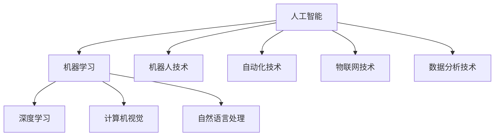

                 

# AI创业的风险与机遇：Lepton AI的案例分析

> **关键词**：AI创业、风险与机遇、Lepton AI、案例分析、商业模式、技术突破、市场趋势

> **摘要**：本文将深入剖析AI创业领域的风险与机遇，以Lepton AI为例，探讨其商业模式、技术创新以及市场表现，为有志于投身AI创业的从业者提供宝贵的参考。文章分为背景介绍、核心概念、算法原理、数学模型、项目实战、应用场景、工具推荐、总结与展望等部分，全面覆盖AI创业的各个方面。

## 1. 背景介绍

### 1.1 目的和范围

本文旨在通过对Lepton AI的案例研究，揭示AI创业过程中面临的风险与机遇，为创业者提供有价值的见解和参考。Lepton AI是一家专注于计算机视觉领域的初创公司，其业务涵盖图像识别、自然语言处理等多个领域，具有典型的AI创业特征。通过对Lepton AI的案例分析，我们将探讨以下几个核心问题：

- AI创业的商业模式如何设计？
- 技术创新在AI创业中的地位与作用？
- 市场趋势如何影响AI创业项目的成功与否？
- AI创业过程中可能遇到的风险有哪些？
- 如何应对这些风险，把握机遇？

### 1.2 预期读者

本文适合以下读者群体：

- 有志于投身AI创业的个人和团队
- AI领域的从业者和技术人员
- 对AI创业感兴趣的投资者和研究者
- 对商业创新和商业模式设计有兴趣的读者

### 1.3 文档结构概述

本文分为以下几个部分：

- 第1章：背景介绍，阐述本文的目的、范围和预期读者。
- 第2章：核心概念与联系，介绍AI创业中的关键概念和架构。
- 第3章：核心算法原理 & 具体操作步骤，详细讲解AI创业中涉及的核心算法。
- 第4章：数学模型和公式 & 详细讲解 & 举例说明，阐述数学模型在AI创业中的应用。
- 第5章：项目实战：代码实际案例和详细解释说明，通过实战案例展示AI创业项目的实际操作。
- 第6章：实际应用场景，分析AI创业项目在不同场景下的应用。
- 第7章：工具和资源推荐，介绍AI创业过程中可用的工具和资源。
- 第8章：总结：未来发展趋势与挑战，总结AI创业的当前状况并展望未来。
- 第9章：附录：常见问题与解答，回答读者可能关心的问题。
- 第10章：扩展阅读 & 参考资料，提供更多深入学习的相关资源。

### 1.4 术语表

#### 1.4.1 核心术语定义

- **AI创业**：指利用人工智能技术，开发具有商业价值的应用和服务，从而实现创业的目标。
- **商业模式**：指企业通过什么样的方式来创造、传递和捕获价值。
- **技术创新**：指在人工智能领域，通过研发新技术、新算法来推动产业进步。
- **市场趋势**：指市场中消费者的需求和偏好、行业的发展方向和变化趋势。

#### 1.4.2 相关概念解释

- **图像识别**：指计算机对图像中的对象、场景进行识别和分类的过程。
- **自然语言处理**：指使计算机理解和生成自然语言的技术。
- **深度学习**：一种基于人工神经网络的机器学习技术，通过多层神经网络实现数据的特征提取和模式识别。

#### 1.4.3 缩略词列表

- **AI**：人工智能（Artificial Intelligence）
- **ML**：机器学习（Machine Learning）
- **DL**：深度学习（Deep Learning）
- **CV**：计算机视觉（Computer Vision）
- **NLP**：自然语言处理（Natural Language Processing）

## 2. 核心概念与联系

为了更好地理解AI创业的过程，我们首先需要了解几个核心概念，它们是人工智能、机器学习、深度学习和计算机视觉。下面将给出这些核心概念之间的联系，并通过Mermaid流程图展示其关系。

### 2.1 核心概念定义

- **人工智能（AI）**：模拟人类智能的计算机系统，能够感知、理解、学习和适应。
- **机器学习（ML）**：一种AI技术，通过从数据中自动学习规律和模式，实现预测和决策。
- **深度学习（DL）**：基于人工神经网络的ML技术，通过多层神经网络实现数据的特征提取和模式识别。
- **计算机视觉（CV）**：使计算机能够像人类一样感知和理解图像、视频的技术。

### 2.2 Mermaid流程图



从上述流程图中可以看出，人工智能是核心，它与其他技术领域如机器学习、深度学习、计算机视觉、自然语言处理等密切相关。同时，人工智能还在机器人技术、自动化技术、物联网技术、数据分析技术等领域有着广泛的应用。

## 3. 核心算法原理 & 具体操作步骤

在AI创业中，核心算法原理是实现技术突破的关键。以下将介绍Lepton AI所采用的核心算法原理，并通过伪代码详细阐述其操作步骤。

### 3.1 核心算法原理

Lepton AI主要采用基于深度学习的图像识别算法，包括卷积神经网络（CNN）和循环神经网络（RNN）。CNN擅长处理图像数据，能够自动提取图像特征，实现图像分类；RNN则擅长处理序列数据，如文本或视频，能够在时间序列中捕捉依赖关系。

### 3.2 伪代码

以下为CNN和RNN的伪代码：

```python
# CNN伪代码
def CNN(input_image):
    # 步骤1：图像预处理
    processed_image = preprocess_image(input_image)
    
    # 步骤2：卷积层
    conv_output = convolution(processed_image)
    
    # 步骤3：池化层
    pooled_output = pooling(conv_output)
    
    # 步骤4：全连接层
    fc_output = fully_connected(pooled_output)
    
    # 步骤5：输出层
    output = activation(fc_output)
    
    return output

# RNN伪代码
def RNN(input_sequence):
    # 步骤1：序列预处理
    processed_sequence = preprocess_sequence(input_sequence)
    
    # 步骤2：嵌入层
    embedded_sequence = embedding(processed_sequence)
    
    # 步骤3：RNN层
    rnn_output = recurrent(embedded_sequence)
    
    # 步骤4：输出层
    output = activation(rnn_output)
    
    return output
```

### 3.3 操作步骤详细讲解

1. **图像预处理**：对输入图像进行尺寸调整、灰度化等操作，使其符合网络输入要求。
2. **卷积层**：通过卷积操作提取图像特征，卷积核用于捕捉图像中的局部特征。
3. **池化层**：对卷积层输出的特征进行降采样，减少计算量，提高模型泛化能力。
4. **全连接层**：将卷积层和池化层输出的特征映射到分类结果上。
5. **激活函数**：对全连接层的输出进行非线性变换，增强模型的表达能力。

对于RNN，操作步骤如下：

1. **序列预处理**：对输入序列进行嵌入，将序列转化为固定长度的向量。
2. **嵌入层**：将预处理后的序列映射到高维空间。
3. **RNN层**：通过循环操作捕捉序列中的依赖关系，更新隐藏状态。
4. **输出层**：将RNN层输出的隐藏状态映射到分类结果上。

通过以上核心算法原理和操作步骤的讲解，我们可以看到，Lepton AI在图像识别和序列处理方面取得了显著的成果，为AI创业提供了有力的技术支撑。

## 4. 数学模型和公式 & 详细讲解 & 举例说明

在AI创业中，数学模型和公式是核心算法实现的重要基础。以下将详细讲解Lepton AI所采用的数学模型和公式，并通过举例说明其应用。

### 4.1 数学模型

Lepton AI主要采用深度学习中的卷积神经网络（CNN）和循环神经网络（RNN）模型。以下是这些模型的基本数学公式：

#### 4.1.1 卷积神经网络（CNN）

- **卷积公式**：\( (f_{ij} * g) = \sum_{k=1}^{m} f_{ik} * g_{kj} \)

  其中，\( f_{ij} \) 和 \( g_{kj} \) 分别表示卷积核和输入图像的元素，\( m \) 表示卷积核的大小。

- **激活函数**：\( \sigma(z) = \frac{1}{1 + e^{-z}} \)

  其中，\( z \) 表示输入值，\( \sigma(z) \) 表示 sigmoid 函数。

- **反向传播**：\( \delta_j = \frac{\partial L}{\partial z_j} = \frac{\partial L}{\partial y_j} \cdot \frac{\partial y_j}{\partial z_j} \)

  其中，\( L \) 表示损失函数，\( y_j \) 表示输出值，\( z_j \) 表示前一层输出值。

#### 4.1.2 循环神经网络（RNN）

- **更新公式**：\( h_t = \sigma(W_h h_{t-1} + W_x x_t + b) \)

  其中，\( h_t \) 表示当前时刻的隐藏状态，\( W_h \) 和 \( W_x \) 分别表示权重矩阵，\( x_t \) 表示输入值，\( b \) 表示偏置。

- **门控公式**：\( g_t = \sigma(W_g [h_{t-1}, x_t] + b_g) \)

  其中，\( g_t \) 表示门控值，\( W_g \) 和 \( b_g \) 分别表示权重矩阵和偏置。

- **反向传播**：\( \delta_h = \frac{\partial L}{\partial h_t} = \frac{\partial L}{\partial y_t} \cdot \frac{\partial y_t}{\partial h_t} \)

  其中，\( L \) 表示损失函数，\( y_t \) 表示输出值，\( h_t \) 表示隐藏状态。

### 4.2 举例说明

以下是一个简单的例子，说明如何使用CNN和RNN模型进行图像分类和序列处理。

#### 4.2.1 图像分类

假设我们有一个二分类问题，输入图像为 \( 28 \times 28 \) 的像素矩阵，目标类别为0或1。

1. **卷积层**：使用一个 \( 3 \times 3 \) 的卷积核，对图像进行卷积操作，得到特征图。

   \( (f_{ij} * g) = \sum_{k=1}^{9} f_{ik} * g_{kj} \)

2. **激活函数**：对特征图应用 sigmoid 函数，得到激活值。

   \( \sigma(z) = \frac{1}{1 + e^{-z}} \)

3. **全连接层**：将激活值输入全连接层，得到分类结果。

   \( y = \sigma(W^T \cdot \text{激活值} + b) \)

4. **反向传播**：计算损失函数和梯度，更新网络权重。

   \( \delta_j = \frac{\partial L}{\partial z_j} = \frac{\partial L}{\partial y_j} \cdot \frac{\partial y_j}{\partial z_j} \)

#### 4.2.2 序列处理

假设我们有一个序列分类问题，输入序列为 \( 100 \) 个词的序列，目标类别为0或1。

1. **嵌入层**：将每个词嵌入到 \( 100 \) 维空间。

   \( x_t = \text{embedding}(word_t) \)

2. **RNN层**：对每个词进行嵌入，更新隐藏状态。

   \( h_t = \sigma(W_h h_{t-1} + W_x x_t + b) \)

3. **门控层**：计算门控值，更新隐藏状态。

   \( g_t = \sigma(W_g [h_{t-1}, x_t] + b_g) \)

4. **输出层**：计算分类结果。

   \( y = \sigma(W^T \cdot \text{隐藏状态} + b) \)

5. **反向传播**：计算损失函数和梯度，更新网络权重。

   \( \delta_h = \frac{\partial L}{\partial h_t} = \frac{\partial L}{\partial y_t} \cdot \frac{\partial y_t}{\partial h_t} \)

通过以上举例，我们可以看到数学模型和公式在AI创业中的实际应用。这些模型和公式不仅帮助创业者实现技术突破，还为创业项目提供了理论支撑。

## 5. 项目实战：代码实际案例和详细解释说明

### 5.1 开发环境搭建

在开始项目实战之前，我们需要搭建一个适合开发AI项目的环境。以下是具体的操作步骤：

1. **安装Python环境**：首先确保系统中安装了Python环境，推荐使用Python 3.7或更高版本。

2. **安装深度学习框架**：选择一个合适的深度学习框架，如TensorFlow或PyTorch。以下是以TensorFlow为例的安装命令：

   ```bash
   pip install tensorflow
   ```

3. **安装必要的库**：安装其他常用的库，如NumPy、Pandas等。以下为安装命令：

   ```bash
   pip install numpy pandas
   ```

4. **配置GPU支持**：如果使用GPU加速训练，需要安装CUDA和cuDNN。请参考TensorFlow的官方文档进行安装。

### 5.2 源代码详细实现和代码解读

以下是一个简单的图像分类项目，使用TensorFlow和Keras实现卷积神经网络（CNN）模型。代码如下：

```python
import tensorflow as tf
from tensorflow.keras.models import Sequential
from tensorflow.keras.layers import Conv2D, MaxPooling2D, Flatten, Dense

# 定义模型
model = Sequential([
    Conv2D(32, (3, 3), activation='relu', input_shape=(28, 28, 1)),
    MaxPooling2D((2, 2)),
    Flatten(),
    Dense(64, activation='relu'),
    Dense(1, activation='sigmoid')
])

# 编译模型
model.compile(optimizer='adam', loss='binary_crossentropy', metrics=['accuracy'])

# 查看模型结构
model.summary()
```

**代码解读：**

1. **导入库**：首先导入所需的TensorFlow和Keras库。

2. **定义模型**：使用Sequential模型堆叠层，包括卷积层（Conv2D）、池化层（MaxPooling2D）、全连接层（Dense）。

3. **编译模型**：设置优化器（optimizer）、损失函数（loss）和评估指标（metrics）。

4. **查看模型结构**：使用summary()函数查看模型的层结构。

### 5.3 代码解读与分析

在代码解读部分，我们已经了解了如何使用TensorFlow和Keras构建一个简单的CNN模型。接下来，我们将对代码进行进一步分析。

1. **模型构建**：

   - **卷积层（Conv2D）**：卷积层用于提取图像特征。该层包含32个卷积核，每个卷积核大小为3x3，激活函数为ReLU。

     ```python
     Conv2D(32, (3, 3), activation='relu', input_shape=(28, 28, 1))
     ```

   - **池化层（MaxPooling2D）**：池化层用于降低特征图的大小，减少计算量。池化方式为最大值池化，窗口大小为2x2。

     ```python
     MaxPooling2D((2, 2))
     ```

   - **全连接层（Flatten）**：全连接层用于将特征图展平为一维向量，作为下一层的输入。

     ```python
     Flatten()
     ```

   - **全连接层（Dense）**：第一个全连接层包含64个神经元，激活函数为ReLU。

     ```python
     Dense(64, activation='relu')
     ```

   - **输出层（Dense）**：输出层包含一个神经元，激活函数为sigmoid，用于实现二分类。

     ```python
     Dense(1, activation='sigmoid')
     ```

2. **模型编译**：

   - **优化器（optimizer）**：选择Adam优化器，它是一种自适应的优化算法，适用于大规模数据。

     ```python
     optimizer='adam'
     ```

   - **损失函数（loss）**：选择二分类交叉熵损失函数，适用于二分类问题。

     ```python
     loss='binary_crossentropy'
     ```

   - **评估指标（metrics）**：选择准确率（accuracy）作为评估指标，用于衡量模型的分类性能。

     ```python
     metrics=['accuracy']
     ```

3. **模型训练**：

   在实际应用中，我们需要使用训练数据和验证数据对模型进行训练和验证。以下为训练模型的代码示例：

   ```python
   history = model.fit(train_images, train_labels, epochs=10, batch_size=32, validation_data=(val_images, val_labels))
   ```

   在这里，`train_images` 和 `train_labels` 是训练数据，`val_images` 和 `val_labels` 是验证数据。`epochs` 表示训练轮数，`batch_size` 表示每次训练的样本数量。

### 5.4 项目实战总结

通过以上实战案例，我们可以看到如何使用TensorFlow和Keras构建一个简单的CNN模型，并进行图像分类。这个案例展示了AI创业中项目实战的基本流程，包括模型构建、训练和评估。在接下来的章节中，我们将进一步探讨AI创业的实际应用场景和工具推荐。

## 6. 实际应用场景

AI技术在各个行业中的应用越来越广泛，Lepton AI作为一个以计算机视觉和自然语言处理为核心的AI公司，其技术在不同场景下的应用也具有很大的潜力。以下是一些实际应用场景及其分析：

### 6.1 零售业

零售行业中的AI应用主要包括智能推荐系统、图像识别和客户行为分析等。

- **智能推荐系统**：通过分析用户的历史购买记录和浏览行为，AI算法可以提供个性化的商品推荐，提高用户满意度和销售额。
- **图像识别**：AI技术可以帮助零售商识别货架上的商品库存，自动调整补货策略，减少库存积压。
- **客户行为分析**：通过分析客户在店内的行为数据，如浏览路径、停留时间等，商家可以更好地了解客户需求，优化店铺布局和营销策略。

### 6.2 医疗保健

医疗保健行业中的AI应用包括疾病预测、医学影像分析和患者行为监测等。

- **疾病预测**：AI算法可以通过分析大量健康数据，预测患者的患病风险，帮助医生制定个性化的治疗方案。
- **医学影像分析**：AI技术可以帮助医生快速识别和诊断医学影像中的病变，提高诊断准确率和效率。
- **患者行为监测**：通过穿戴设备和移动应用，AI技术可以实时监测患者的生理数据，如心率、血压等，帮助医生及时发现异常情况。

### 6.3 制造业

制造业中的AI应用主要包括智能生产、设备维护和质量管理等。

- **智能生产**：AI技术可以优化生产流程，提高生产效率，降低成本。例如，通过机器学习算法预测生产故障，提前进行维护。
- **设备维护**：AI技术可以实时监控设备运行状态，预测故障，减少设备停机时间，提高生产连续性。
- **质量管理**：AI技术可以分析生产过程中的质量数据，识别潜在的质量问题，提高产品质量。

### 6.4 金融业

金融行业中的AI应用主要包括欺诈检测、风险评估和客户服务优化等。

- **欺诈检测**：AI算法可以实时监控交易行为，识别潜在的欺诈行为，降低金融风险。
- **风险评估**：通过分析客户的历史数据和行为特征，AI技术可以预测客户的信用风险，为金融机构提供决策支持。
- **客户服务优化**：通过自然语言处理技术，AI系统可以自动化处理大量的客户咨询，提高客户服务效率。

### 6.5 交通与物流

交通与物流行业中的AI应用主要包括交通流量管理、自动驾驶和物流优化等。

- **交通流量管理**：AI技术可以分析交通数据，预测交通流量，优化交通信号控制，减少拥堵。
- **自动驾驶**：AI技术是自动驾驶汽车的核心，通过感知环境、规划路径和决策控制，实现车辆的自动驾驶。
- **物流优化**：AI技术可以帮助物流公司优化运输路线，提高运输效率，降低成本。

通过上述实际应用场景的分析，我们可以看到AI技术在各个行业中的应用潜力。Lepton AI凭借其在计算机视觉和自然语言处理领域的优势，有望在这些行业中发挥重要作用，推动行业智能化发展。

## 7. 工具和资源推荐

### 7.1 学习资源推荐

为了更好地掌握AI创业的相关技术和方法，以下是一些值得推荐的学习资源：

#### 7.1.1 书籍推荐

- 《深度学习》（Deep Learning） - Ian Goodfellow、Yoshua Bengio和Aaron Courville
- 《Python机器学习》（Python Machine Learning） - Sebastian Raschka和Vahid Mirjalili
- 《人工智能：一种现代方法》（Artificial Intelligence: A Modern Approach） - Stuart J. Russell和Peter Norvig
- 《自然语言处理综论》（Speech and Language Processing） - Daniel Jurafsky和James H. Martin

#### 7.1.2 在线课程

-Coursera的《机器学习》课程（由Andrew Ng教授）
-Udacity的《深度学习纳米学位》
-edX的《人工智能导论》
-LinkedIn Learning的《人工智能基础》

#### 7.1.3 技术博客和网站

- Medium上的AI和机器学习相关博客
- Towards Data Science（TDS）上的AI和机器学习文章
- AI博客（AI Blog）上的专业文章
- arXiv上的最新研究成果

### 7.2 开发工具框架推荐

在AI创业过程中，选择合适的开发工具和框架可以大大提高开发效率。以下是一些推荐的工具和框架：

#### 7.2.1 IDE和编辑器

- PyCharm：一款功能强大的Python IDE，适合深度学习和机器学习项目。
- Jupyter Notebook：一个交互式的开发环境，适合数据分析和模型实验。
- Visual Studio Code：一款轻量级的跨平台编辑器，支持多种编程语言，包括Python、R等。

#### 7.2.2 调试和性能分析工具

- TensorFlow Profiler：用于分析和优化TensorFlow模型的性能。
- PyTorch Profiler：用于分析PyTorch模型的性能和资源使用。
- LineProfiler：一款开源的性能分析工具，适用于Python代码。

#### 7.2.3 相关框架和库

- TensorFlow：一款开源的深度学习框架，适用于各种机器学习和深度学习任务。
- PyTorch：一款基于Python的深度学习框架，具有动态计算图和强大的GPU支持。
- Keras：一个高层次的神经网络API，可以简化深度学习模型的搭建和训练。
- Scikit-learn：一个用于机器学习的开源库，提供了丰富的算法和工具。

#### 7.2.4 数据处理工具

- Pandas：一个强大的数据处理库，适用于数据清洗、转换和分析。
- NumPy：一个用于数值计算的库，提供了多维数组对象和丰富的数学函数。
- Matplotlib：一个用于数据可视化的库，可以生成各种类型的图表和图形。

通过以上工具和资源的推荐，AI创业者在学习和开发过程中可以更加高效地掌握相关技术，提高项目成功的可能性。

## 8. 总结：未来发展趋势与挑战

随着人工智能技术的不断发展，AI创业领域面临着巨大的机遇和挑战。未来发展趋势可以从以下几个方面进行分析：

### 8.1 技术创新

- **深度学习和神经网络**：深度学习和神经网络技术将继续成为AI创业的核心驱动力，特别是在计算机视觉、自然语言处理和强化学习等领域，会有更多突破性进展。
- **量子计算**：量子计算作为一种新型计算范式，有望在解决复杂问题上取得重大突破，为AI创业带来新的机遇。
- **边缘计算**：随着物联网和5G技术的发展，边缘计算将逐渐成为主流，AI创业项目将更加注重如何在设备端实现实时数据处理和智能决策。

### 8.2 市场需求

- **个性化服务**：随着消费者对个性化体验的需求不断增加，AI创业项目将更加关注如何通过数据分析和个人偏好理解，提供定制化的服务。
- **自动化与智能化**：在工业、农业、医疗等多个领域，自动化和智能化的需求日益增长，AI技术将成为推动产业升级的重要力量。
- **可持续发展**：在环保和可持续发展方面，AI创业项目将更多地关注如何利用智能技术优化资源利用、减少碳排放等。

### 8.3 法规与伦理

- **数据隐私与安全**：随着数据隐私问题的日益凸显，如何确保用户数据的安全和隐私将成为AI创业的重要挑战。
- **算法公平性与透明度**：算法的公平性和透明度问题备受关注，AI创业项目需要确保算法的决策过程是公正和透明的。
- **法规合规**：各国对AI技术的监管法规逐步完善，AI创业项目需要严格遵守相关法律法规，避免法律风险。

### 8.4 挑战与应对策略

- **技术成熟度**：AI技术的成熟度是一个重要挑战，创业者需要关注技术进展，选择成熟的技术进行创业。
- **人才短缺**：AI领域的专业人才短缺，创业者需要通过培训、合作等方式吸引和培养人才。
- **市场竞争**：AI领域竞争激烈，创业者需要关注市场需求，提供差异化的产品和服务。

总之，AI创业领域在未来将继续快速发展，创业者需要紧跟技术趋势，关注市场需求，同时应对法规和伦理等挑战。通过不断创新和优化，AI创业项目有望在未来的市场中取得成功。

## 9. 附录：常见问题与解答

### 9.1 常见问题

#### Q1：AI创业有哪些核心技术？
A1：AI创业的核心技术包括机器学习、深度学习、自然语言处理、计算机视觉和强化学习等。

#### Q2：如何选择AI创业项目？
A2：选择AI创业项目时，可以从市场需求、技术成熟度、竞争状况和自身优势等方面进行综合评估。

#### Q3：AI创业需要哪些技能和资源？
A3：AI创业需要掌握编程、机器学习、深度学习等相关技术，同时需要具备数据分析、项目管理等技能。资源方面，需要资金、人才、技术平台等。

#### Q4：AI创业项目如何进行市场推广？
A4：市场推广可以采取多种策略，如社交媒体营销、内容营销、合作伙伴推广等。此外，还可以通过参加行业展会、发布白皮书等方式提高项目知名度。

### 9.2 解答

针对以上常见问题，我们给出以下解答：

- **核心技术**：AI创业的核心技术包括机器学习、深度学习、自然语言处理、计算机视觉和强化学习等。这些技术在不同领域有着广泛的应用，创业者可以根据自身优势和市场需求选择合适的技术方向。

- **项目选择**：选择AI创业项目时，可以从市场需求、技术成熟度、竞争状况和自身优势等方面进行综合评估。例如，可以关注新兴领域、市场需求大但竞争相对较小的方向，或者结合自身技术优势进行创新。

- **技能和资源**：AI创业需要掌握编程、机器学习、深度学习等相关技术，同时需要具备数据分析、项目管理等技能。资源方面，需要资金、人才、技术平台等。创业者可以通过自学、培训、合作等方式提升自身技能和获取资源。

- **市场推广**：市场推广可以采取多种策略，如社交媒体营销、内容营销、合作伙伴推广等。此外，还可以通过参加行业展会、发布白皮书等方式提高项目知名度。在推广过程中，要注重内容的质量和针对性，以吸引潜在客户和投资者。

通过以上解答，我们可以看到AI创业涉及的方方面面，为创业者提供了实用的参考和建议。

## 10. 扩展阅读 & 参考资料

为了更好地理解和深入探索AI创业的各个方面，以下提供一些扩展阅读和参考资料：

### 10.1 经典书籍

- **《深度学习》（Deep Learning）** - Ian Goodfellow、Yoshua Bengio和Aaron Courville
- **《机器学习》（Machine Learning）** - Tom Mitchell
- **《Python机器学习》（Python Machine Learning）** - Sebastian Raschka和Vahid Mirjalili
- **《人工智能：一种现代方法》（Artificial Intelligence: A Modern Approach）** - Stuart J. Russell和Peter Norvig

### 10.2 在线课程

- Coursera的《机器学习》课程（由Andrew Ng教授）
- Udacity的《深度学习纳米学位》
- edX的《人工智能导论》
- LinkedIn Learning的《人工智能基础》

### 10.3 技术博客和网站

- Medium上的AI和机器学习相关博客
- Towards Data Science（TDS）上的AI和机器学习文章
- AI博客（AI Blog）上的专业文章
- arXiv上的最新研究成果

### 10.4 学术论文和期刊

- **《Nature》杂志上的AI专题**
- **《Science》杂志上的AI相关文章**
- **《Journal of Machine Learning Research》（JMLR）**上的最新论文
- **《IEEE Transactions on Pattern Analysis and Machine Intelligence》（TPAMI）**上的经典论文

### 10.5 相关组织和会议

- **IEEE（电气和电子工程协会）**：提供AI和机器学习的最新技术和研究
- **NeurIPS（神经信息处理系统大会）**：全球顶级AI学术会议
- **ICML（国际机器学习大会）**：专注于机器学习领域的国际性学术会议
- **AAAI（美国人工智能协会）**：推动人工智能研究的非营利组织

通过以上扩展阅读和参考资料，读者可以进一步了解AI创业的各个方面，为自身的创业之路积累更多的知识和经验。

