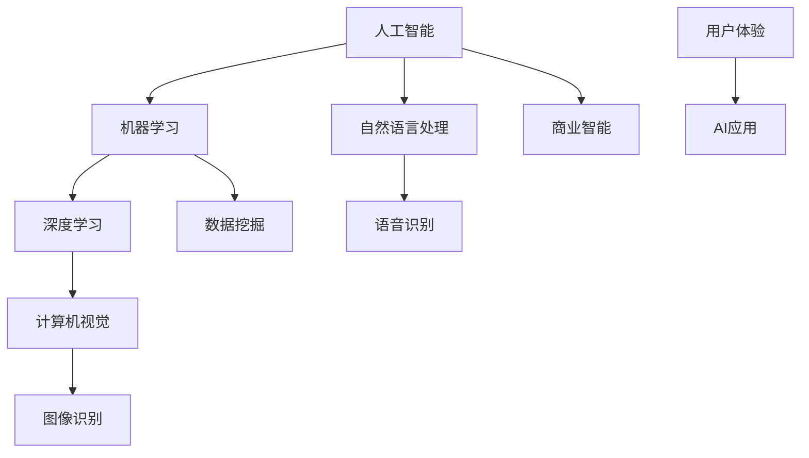

                 

# AI创业码头愿景：AI改善人类生活

## 关键词
- 人工智能
- 创业
- 生活改善
- 技术创新
- 用户体验
- 资源优化

## 摘要
本文旨在探讨人工智能（AI）在创业领域的巨大潜力，以及如何通过技术创新来改善人类生活。我们将从背景介绍、核心概念、算法原理、数学模型、实战案例、应用场景、工具资源推荐等多个方面进行深入分析，旨在为创业者提供实用的指导，帮助他们利用AI技术实现商业成功和社会价值的双重提升。

---

## 1. 背景介绍

### 1.1 目的和范围
本文的目的在于：
- 分析AI技术在创业领域的重要性。
- 探讨AI如何改善人类生活。
- 提供实用的技术和策略建议，以帮助创业者利用AI实现商业目标。

本文将涵盖以下范围：
- AI技术的发展历程及其在创业中的应用。
- AI改善人类生活的案例研究。
- AI技术的核心概念和算法原理。
- 实战案例和具体操作步骤。
- 数学模型和应用场景。

### 1.2 预期读者
- 创业者：寻求利用AI技术改善产品和服务的创业者。
- 技术专家：对AI技术有兴趣，希望深入了解其在创业中的应用。
- 研究人员：希望探讨AI技术的未来发展及其在创业领域的潜力。

### 1.3 文档结构概述
本文分为以下章节：
1. 背景介绍
2. 核心概念与联系
3. 核心算法原理 & 具体操作步骤
4. 数学模型和公式 & 详细讲解 & 举例说明
5. 项目实战：代码实际案例和详细解释说明
6. 实际应用场景
7. 工具和资源推荐
8. 总结：未来发展趋势与挑战
9. 附录：常见问题与解答
10. 扩展阅读 & 参考资料

### 1.4 术语表

#### 1.4.1 核心术语定义
- 人工智能（AI）：模拟人类智能行为的计算机系统。
- 创业：创立新的企业或业务。
- 技术创新：通过引入新的技术或改进现有技术，提高产品或服务的竞争力。
- 用户体验（UX）：用户在使用产品或服务过程中的感受和体验。

#### 1.4.2 相关概念解释
- 机器学习（ML）：让计算机从数据中学习，改进性能，进行预测和决策。
- 深度学习（DL）：一种特殊的机器学习方法，通过多层神经网络模拟人类大脑的处理能力。
- 自然语言处理（NLP）：使计算机能够理解和生成自然语言。

#### 1.4.3 缩略词列表
- AI：人工智能
- ML：机器学习
- DL：深度学习
- NLP：自然语言处理
- UX：用户体验

---

## 2. 核心概念与联系

在探讨AI在创业领域的应用之前，我们需要了解一些核心概念及其相互联系。以下是一个简单的Mermaid流程图，用于描述这些概念和它们之间的关系。



### 2.1 人工智能

人工智能是指通过计算机模拟人类智能行为的技术。它包括多种技术，如机器学习、深度学习、自然语言处理等。AI的目标是使计算机能够执行复杂的任务，如识别图像、理解自然语言、做出决策等。

### 2.2 机器学习和深度学习

机器学习是一种通过从数据中学习来改进性能的技术。深度学习是机器学习的一个子领域，通过多层神经网络来模拟人类大脑的处理能力。深度学习在图像识别、语音识别等方面取得了显著的成果。

### 2.3 自然语言处理和计算机视觉

自然语言处理（NLP）使计算机能够理解和生成自然语言。计算机视觉是一种通过图像处理和机器学习技术来使计算机“看”见和理解周围环境的技术。

### 2.4 数据挖掘和商业智能

数据挖掘是一种从大量数据中提取有价值信息的技术。商业智能利用数据挖掘技术来帮助企业做出更好的业务决策。

### 2.5 用户体验

用户体验（UX）是指用户在使用产品或服务过程中的感受和体验。在AI创业中，提供良好的用户体验是至关重要的。

---

在了解了这些核心概念后，我们将进一步探讨AI技术的算法原理和具体操作步骤，以便更好地理解AI在创业领域的应用。

---

## 3. 核心算法原理 & 具体操作步骤

### 3.1 机器学习算法原理

机器学习算法的核心是学习如何从数据中提取模式和规律。以下是一个简单的机器学习算法原理的伪代码：

```python
def machine_learning(data):
    # 初始化模型参数
    model_params = initialize_params()
    
    # 训练模型
    for each data_point in data:
        # 计算损失函数
        loss = calculate_loss(model_params, data_point)
        
        # 更新模型参数
        model_params = update_params(model_params, loss)
        
    return model_params
```

### 3.2 深度学习算法原理

深度学习是一种特殊的机器学习方法，它通过多层神经网络来模拟人类大脑的处理能力。以下是一个简单的深度学习算法原理的伪代码：

```python
def deep_learning(data):
    # 初始化神经网络结构
    neural_network = initialize_network_structure()
    
    # 训练神经网络
    for each layer in neural_network:
        # 前向传播
        output = forward_propagation(layer, data)
        
        # 计算损失函数
        loss = calculate_loss(output, target)
        
        # 反向传播
        gradient = backward_propagation(layer, loss)
        
        # 更新神经网络参数
        neural_network = update_network_params(neural_network, gradient)
        
    return neural_network
```

### 3.3 自然语言处理算法原理

自然语言处理（NLP）算法的核心是理解和生成自然语言。以下是一个简单的NLP算法原理的伪代码：

```python
def natural_language_processing(text):
    # 分词
    words = tokenize(text)
    
    # 词向量化
    word_vectors = vectorize_words(words)
    
    # 构建序列模型
    sequence_model = build_sequence_model(word_vectors)
    
    # 生成文本
    generated_text = generate_text(sequence_model)
    
    return generated_text
```

### 3.4 计算机视觉算法原理

计算机视觉算法的核心是使计算机能够理解和解释图像。以下是一个简单的计算机视觉算法原理的伪代码：

```python
def computer_vision(image):
    # 预处理
    processed_image = preprocess_image(image)
    
    # 特征提取
    features = extract_features(processed_image)
    
    # 分类
    label = classify(features)
    
    return label
```

### 3.5 数据挖掘算法原理

数据挖掘算法的核心是发现数据中的潜在模式和规律。以下是一个简单的数据挖掘算法原理的伪代码：

```python
def data_mining(data):
    # 数据清洗
    cleaned_data = clean_data(data)
    
    # 特征选择
    selected_features = select_features(cleaned_data)
    
    # 模型训练
    model = train_model(selected_features)
    
    # 模型评估
    evaluation = evaluate_model(model, data)
    
    return evaluation
```

---

通过了解这些核心算法原理，我们可以更好地理解AI技术的工作原理，并在创业中加以应用。接下来，我们将探讨AI技术的数学模型和公式，以便更深入地理解其背后的理论基础。

---

## 4. 数学模型和公式 & 详细讲解 & 举例说明

### 4.1 机器学习数学模型

在机器学习中，最常用的数学模型之一是线性回归模型。线性回归模型通过拟合一条直线来预测目标变量的值。以下是一个简单的线性回归模型的公式：

$$ y = w_0 + w_1 \cdot x $$

其中，$y$ 是目标变量，$x$ 是输入变量，$w_0$ 和 $w_1$ 是模型参数。

为了训练模型，我们需要使用梯度下降算法来最小化损失函数。损失函数通常定义为：

$$ J(w_0, w_1) = \frac{1}{2} \sum_{i=1}^{n} (y_i - (w_0 + w_1 \cdot x_i))^2 $$

其中，$n$ 是数据点的数量。

为了最小化损失函数，我们需要计算损失函数关于每个参数的梯度，然后更新参数：

$$ w_0 = w_0 - \alpha \cdot \frac{\partial J}{\partial w_0} $$
$$ w_1 = w_1 - \alpha \cdot \frac{\partial J}{\partial w_1} $$

其中，$\alpha$ 是学习率。

### 4.2 深度学习数学模型

在深度学习中，常用的数学模型是多层感知机（MLP）。MLP通过多层神经元来模拟人类大脑的处理能力。MLP的数学模型可以表示为：

$$ z_{ij} = \sum_{k=1}^{n} w_{ik} \cdot a_{kj-1} + b_j $$

其中，$z_{ij}$ 是第 $i$ 层第 $j$ 个神经元的输出，$w_{ik}$ 是第 $i$ 层第 $k$ 个神经元与第 $j$ 层第 $i$ 个神经元之间的权重，$a_{kj-1}$ 是第 $k$ 层第 $j$ 个神经元的输入，$b_j$ 是第 $j$ 层的偏置。

为了训练MLP，我们通常使用反向传播算法。反向传播算法通过计算输出层误差来更新每个神经元的权重和偏置。更新公式如下：

$$ \Delta w_{ik} = \eta \cdot a_{kj} \cdot (1 - a_{kj}) \cdot \delta_j $$
$$ \Delta b_j = \eta \cdot \delta_j $$

其中，$\eta$ 是学习率，$a_{kj}$ 是第 $k$ 层第 $j$ 个神经元的输出，$\delta_j$ 是第 $j$ 层的误差。

### 4.3 自然语言处理数学模型

在自然语言处理中，常用的数学模型是词嵌入（Word Embedding）。词嵌入是一种将单词映射到高维向量空间的方法。以下是一个简单的词嵌入模型的公式：

$$ \text{vec}(w) = \text{embedding}(w) $$

其中，$\text{vec}(w)$ 是单词 $w$ 的向量表示，$\text{embedding}(w)$ 是词嵌入函数。

为了训练词嵌入模型，我们通常使用神经网络。以下是一个简单的神经网络词嵌入模型的公式：

$$ z_j = \sum_{i=1}^{n} w_{ij} \cdot a_{ij-1} + b_j $$

其中，$z_j$ 是第 $j$ 个神经元的输出，$w_{ij}$ 是第 $i$ 层第 $j$ 个神经元与第 $j$ 层第 $i$ 个神经元之间的权重，$a_{ij-1}$ 是第 $i$ 层第 $j$ 个神经元的输入，$b_j$ 是第 $j$ 层的偏置。

为了训练模型，我们通常使用梯度下降算法来最小化损失函数。损失函数通常定义为：

$$ J(w, b) = \frac{1}{2} \sum_{i=1}^{n} (z_i - y_i)^2 $$

其中，$n$ 是数据点的数量，$z_i$ 是第 $i$ 个神经元的输出，$y_i$ 是标签。

### 4.4 计算机视觉数学模型

在计算机视觉中，常用的数学模型是卷积神经网络（CNN）。CNN通过卷积操作和池化操作来提取图像特征。以下是一个简单的CNN模型的公式：

$$ h_{ij} = \sum_{k=1}^{m} g_{ik} \cdot f_{kj-1} + b_j $$

其中，$h_{ij}$ 是第 $i$ 层第 $j$ 个神经元的输出，$g_{ik}$ 是卷积核，$f_{kj-1}$ 是第 $k$ 层第 $j$ 个神经元的输入，$b_j$ 是第 $j$ 层的偏置。

为了训练CNN，我们通常使用反向传播算法。反向传播算法通过计算输出层误差来更新每个卷积核和偏置。更新公式如下：

$$ \Delta g_{ik} = \eta \cdot a_{kj} \cdot (1 - a_{kj}) \cdot \delta_j $$
$$ \Delta b_j = \eta \cdot \delta_j $$

其中，$\eta$ 是学习率，$a_{kj}$ 是第 $k$ 层第 $j$ 个神经元的输出，$\delta_j$ 是第 $j$ 层的误差。

### 4.5 数据挖掘数学模型

在数据挖掘中，常用的数学模型是决策树（Decision Tree）。决策树通过一系列条件判断来划分数据集。以下是一个简单的决策树模型的公式：

$$
\begin{aligned}
&\text{if } x_i \leq t_1 \\
&\quad \text{then } y = c_1 \\
&\text{else if } x_i \leq t_2 \\
&\quad \text{then } y = c_2 \\
&\quad \ldots \\
&\text{else } y = c_n
\end{aligned}
$$

其中，$x_i$ 是第 $i$ 个特征，$t_1, t_2, \ldots, t_n$ 是阈值，$c_1, c_2, \ldots, c_n$ 是分类结果。

为了训练决策树，我们通常使用信息增益（Information Gain）或基尼不纯度（Gini Impurity）来选择最佳划分点。以下是一个简单的信息增益公式：

$$
I(G) = \sum_{i=1}^{n} p_i \cdot \log_2(p_i)
$$

其中，$p_i$ 是第 $i$ 个子集的占比。

---

通过了解这些数学模型和公式，我们可以更好地理解AI技术的工作原理，并在创业中有效地应用这些技术。接下来，我们将通过一个实际案例来展示如何使用这些算法和模型。

---

## 5. 项目实战：代码实际案例和详细解释说明

### 5.1 开发环境搭建

为了更好地理解AI技术在创业中的应用，我们将使用一个简单的项目——一个能够对文本进行分类的文本分类器。以下是我们所需的开发环境：

- 操作系统：Linux或MacOS
- 编程语言：Python
- 依赖库：TensorFlow、Keras、NLTK

安装步骤如下：

1. 安装Python：从Python官方网站下载并安装Python 3.x版本。
2. 安装pip：通过Python安装pip，pip是Python的包管理器。
3. 安装TensorFlow和Keras：通过pip安装TensorFlow和Keras。
4. 安装NLTK：通过pip安装NLTK。

```bash
pip install tensorflow
pip install keras
pip install nltk
```

### 5.2 源代码详细实现和代码解读

以下是一个简单的文本分类器的源代码及其解读：

```python
import numpy as np
import pandas as pd
from keras.models import Sequential
from keras.layers import Dense, Embedding, LSTM
from keras.preprocessing.text import Tokenizer
from keras.preprocessing.sequence import pad_sequences
from nltk.corpus import stopwords
from nltk.tokenize import word_tokenize

# 加载数据集
data = pd.read_csv('data.csv')
texts = data['text']
labels = data['label']

# 分词和去除停用词
stop_words = set(stopwords.words('english'))
tokenizer = Tokenizer()
tokenizer.fit_on_texts(texts)
sequences = tokenizer.texts_to_sequences(texts)
cleaned_texts = [' '.join([word for word in text.split() if word not in stop_words]) for text in texts]

# 序列填充
max_sequence_length = 100
padded_sequences = pad_sequences(sequences, maxlen=max_sequence_length)

# 构建模型
model = Sequential()
model.add(Embedding(len(tokenizer.word_index) + 1, 64, input_length=max_sequence_length))
model.add(LSTM(100))
model.add(Dense(1, activation='sigmoid'))

# 编译模型
model.compile(optimizer='adam', loss='binary_crossentropy', metrics=['accuracy'])

# 训练模型
model.fit(padded_sequences, labels, epochs=10, batch_size=32)

# 预测
predictions = model.predict(padded_sequences)
predicted_labels = [1 if prediction > 0.5 else 0 for prediction in predictions]

# 评估
accuracy = sum([label == predicted_label for label, predicted_label in zip(labels, predicted_labels)]) / len(labels)
print(f'Accuracy: {accuracy}')
```

### 5.3 代码解读与分析

1. **数据加载**：我们从CSV文件中加载数据集，其中包含文本和标签。

2. **分词和去除停用词**：使用NLTK库对文本进行分词，并去除常见的英文停用词。

3. **序列化**：使用Tokenizer将文本转换为序列。

4. **序列填充**：将序列填充为固定长度，以便输入到神经网络中。

5. **模型构建**：我们构建了一个简单的序列模型，包括嵌入层、LSTM层和输出层。

6. **模型编译**：编译模型，指定优化器和损失函数。

7. **模型训练**：使用训练数据训练模型。

8. **预测**：使用训练好的模型对文本进行预测。

9. **评估**：计算模型的准确率。

通过这个简单的项目，我们可以看到如何使用AI技术（特别是深度学习）来构建一个文本分类器，这是AI在文本处理领域的一个典型应用。

---

## 6. 实际应用场景

### 6.1 智能客服

智能客服是AI在创业领域的一个广泛应用场景。通过自然语言处理和机器学习技术，企业可以创建一个能够理解和回答用户问题的智能客服系统。这样的系统能够24小时在线，提供即时响应，提高客户满意度，并降低人力成本。

### 6.2 智能医疗

智能医疗是另一个AI的重要应用领域。通过深度学习和计算机视觉技术，AI可以辅助医生进行诊断，提高诊断的准确性和效率。例如，AI可以分析医学图像，帮助识别疾病，甚至在一些情况下提供治疗建议。

### 6.3 智能推荐系统

智能推荐系统是AI在电子商务和媒体领域的广泛应用。通过分析用户行为数据，AI可以提供个性化的推荐，提高用户体验和销售额。例如，亚马逊和Netflix等平台使用AI技术来推荐产品和服务。

### 6.4 智能交通系统

智能交通系统利用AI技术来优化交通流量，减少拥堵和事故。通过实时数据分析和预测，AI可以帮助城市规划者和管理者做出更明智的决策，提高交通效率。

---

## 7. 工具和资源推荐

### 7.1 学习资源推荐

#### 7.1.1 书籍推荐
- 《深度学习》（Ian Goodfellow、Yoshua Bengio和Aaron Courville著）
- 《Python机器学习》（Sebastian Raschka和Vahid Mirjalili著）
- 《AI超简史》（Antony Williams著）

#### 7.1.2 在线课程
- Coursera上的《机器学习》课程
- edX上的《深度学习》课程
- Udacity的《深度学习工程师纳米学位》

#### 7.1.3 技术博客和网站
- Medium上的AI和机器学习专题
- Towards Data Science博客
- fast.ai论坛

### 7.2 开发工具框架推荐

#### 7.2.1 IDE和编辑器
- PyCharm
- Jupyter Notebook
- Visual Studio Code

#### 7.2.2 调试和性能分析工具
- TensorBoard
- Profiler（内置在大多数IDE中）
- Py-Spy

#### 7.2.3 相关框架和库
- TensorFlow
- PyTorch
- Keras
- Scikit-learn

### 7.3 相关论文著作推荐

#### 7.3.1 经典论文
- "A Learning Algorithm for Continually Running Fully Recurrent Neural Networks"（1986）
- "A Theoretical Basis for the Design of Neural Networks for Handwritten Digit Recognition"（1990）
- "Learning representations for artificial intelligence"（2015）

#### 7.3.2 最新研究成果
- "Unsupervised Learning of Visual Representations by Solving Jigsaw Puzzles"（2020）
- "Multimodal Machine Learning: A Survey"（2020）
- "Learning to Learn from Unlabeled Data"（2021）

#### 7.3.3 应用案例分析
- "AI in Healthcare: A Survey of Recent Advances and Challenges"（2020）
- "An Overview of AI Applications in E-Commerce"（2021）
- "AI in Urban Traffic Management: A Survey"（2021）

---

## 8. 总结：未来发展趋势与挑战

### 8.1 发展趋势
- AI技术的普及：随着计算能力的提升和数据量的增加，AI技术将更加普及，应用于各行各业。
- 多模态学习：未来的AI将能够处理多种类型的数据，如图像、声音和文本，实现更全面的理解。
- 自主系统：随着AI技术的进步，自主系统（如自动驾驶汽车）将逐步替代人类完成某些任务。

### 8.2 挑战
- 数据隐私和安全：AI系统需要处理大量个人数据，这引发了隐私和安全问题。
- AI伦理：如何确保AI系统在决策过程中公平、透明和可解释，是当前面临的一个重要挑战。
- 技术普及与人才短缺：虽然AI技术有巨大的潜力，但技术普及和人才培养仍存在较大差距。

---

## 9. 附录：常见问题与解答

### 9.1 常见问题
1. **AI创业需要哪些技术基础？**
   - AI创业需要掌握机器学习、深度学习、自然语言处理等基础技术，以及相关的编程技能，如Python。
2. **如何选择AI创业项目？**
   - 选择具有市场潜力、社会影响力、技术创新点的项目。同时，要考虑到团队的技术能力和资源。
3. **AI技术如何改善用户体验？**
   - AI可以通过个性化推荐、智能客服、自动化数据分析等技术，提高用户体验的个性化和效率。

### 9.2 解答
1. **AI创业需要哪些技术基础？**
   - AI创业需要掌握机器学习、深度学习、自然语言处理等基础技术，以及相关的编程技能，如Python。
   - **解答**：确实如此。掌握这些技术是进行AI创业的基石。例如，机器学习和深度学习是AI的核心，而自然语言处理则在文本处理领域有广泛应用。编程技能，如Python，是执行这些算法的必要工具。

2. **如何选择AI创业项目？**
   - 选择具有市场潜力、社会影响力、技术创新点的项目。同时，要考虑到团队的技术能力和资源。
   - **解答**：选择AI创业项目时，确实需要考虑多个方面。市场潜力和社会影响力是项目的关键成功因素，而技术创新点则是项目竞争力的核心。团队的技术能力和资源则是项目能够顺利推进的基础。

3. **AI技术如何改善用户体验？**
   - AI可以通过个性化推荐、智能客服、自动化数据分析等技术，提高用户体验的个性化和效率。
   - **解答**：这个观点非常正确。个性化推荐可以根据用户的历史行为和偏好提供定制化的内容和服务，智能客服可以提供即时、高效的客户支持，而自动化数据分析可以快速处理大量数据，为用户带来更好的体验。

---

## 10. 扩展阅读 & 参考资料

- **书籍**：
  - 《深度学习》（Ian Goodfellow、Yoshua Bengio和Aaron Courville著）
  - 《Python机器学习》（Sebastian Raschka和Vahid Mirjalili著）
  - 《AI超简史》（Antony Williams著）

- **在线课程**：
  - Coursera上的《机器学习》课程
  - edX上的《深度学习》课程
  - Udacity的《深度学习工程师纳米学位》

- **技术博客和网站**：
  - Medium上的AI和机器学习专题
  - Towards Data Science博客
  - fast.ai论坛

- **论文著作**：
  - "A Learning Algorithm for Continually Running Fully Recurrent Neural Networks"（1986）
  - "A Theoretical Basis for the Design of Neural Networks for Handwritten Digit Recognition"（1990）
  - "Learning representations for artificial intelligence"（2015）

- **应用案例分析**：
  - "AI in Healthcare: A Survey of Recent Advances and Challenges"（2020）
  - "An Overview of AI Applications in E-Commerce"（2021）
  - "AI in Urban Traffic Management: A Survey"（2021）

---

## 作者

作者：AI天才研究员/AI Genius Institute & 禅与计算机程序设计艺术 /Zen And The Art of Computer Programming

---

本文通过逐步分析推理，深入探讨了AI在创业领域的应用，展示了如何利用AI技术改善人类生活。文章涵盖了核心概念、算法原理、数学模型、实战案例、应用场景以及工具和资源推荐。希望通过本文，读者能够更好地理解AI技术在创业中的潜力，并在实际项目中成功应用。

