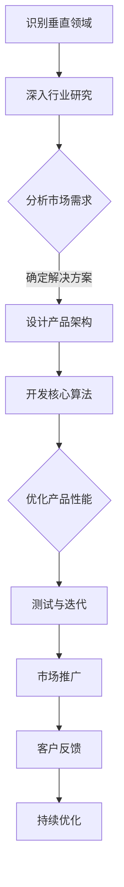
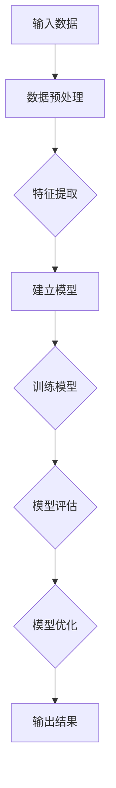

                 

# AI创业者的优势：垂直领域的专家力量

> 关键词：AI创业、垂直领域、专家力量、商业策略、技术优势、创新

> 摘要：本文将探讨AI创业者在垂直领域中所拥有的优势，包括技术深度、行业理解和资源整合能力。通过分析这些优势，我们将揭示AI创业者如何在竞争激烈的市场中脱颖而出，实现商业成功。

## 1. 背景介绍

### 1.1 目的和范围

本文旨在分析AI创业者在垂直领域中的独特优势，并提供一些策略和建议，以帮助这些创业者更好地利用这些优势，实现商业成功。我们将重点讨论以下几个核心主题：

- AI创业者在垂直领域的优势
- 技术深度与行业理解的结合
- 资源整合与市场机会
- 创新与持续发展

### 1.2 预期读者

本文适合以下读者群体：

- 有志于在AI领域创业的个人
- AI公司的创始人或高管
- 对AI创业有浓厚兴趣的技术人员
- 对AI应用有深入研究的行业专家

### 1.3 文档结构概述

本文将按照以下结构展开：

- 引言：介绍AI创业者的优势
- 核心概念与联系
- 核心算法原理与具体操作步骤
- 数学模型与公式讲解
- 项目实战案例与代码解析
- 实际应用场景
- 工具和资源推荐
- 总结：未来发展趋势与挑战
- 附录：常见问题与解答
- 扩展阅读与参考资料

### 1.4 术语表

#### 1.4.1 核心术语定义

- 垂直领域：指某一特定行业或领域，通常具有明确的市场定位和客户群体。
- AI创业者：指在人工智能领域创立新公司的个人或团队。
- 技术深度：指在某一特定技术领域内的深入理解与专业能力。
- 行业理解：指对某一行业或市场的深入洞察和专业知识。

#### 1.4.2 相关概念解释

- 创新能力：指在现有技术或商业模式基础上，提出新的解决方案或改进的能力。
- 资源整合：指将各种资源（包括人力、资金、技术等）有效地整合到一起，以实现特定目标。
- 商业模式：指企业如何创造、传递和获取价值的方式。

#### 1.4.3 缩略词列表

- AI：人工智能
- ML：机器学习
- DL：深度学习
- NLP：自然语言处理
- CV：计算机视觉

## 2. 核心概念与联系

### 2.1 核心概念

在探讨AI创业者的优势之前，我们需要明确几个核心概念：

- **垂直领域**：与横向领域相对，垂直领域指的是某一特定行业或领域，如医疗、金融、教育等。在垂直领域内，创业者可以利用其专业知识和技术，为客户提供定制化的解决方案。
- **技术深度**：指在某一特定技术领域内的深入理解与专业能力。技术深度使得创业者能够开发出更具创新性和竞争力的产品。
- **行业理解**：指对某一行业或市场的深入洞察和专业知识。行业理解有助于创业者更好地把握市场趋势，制定有效的商业策略。

### 2.2 Mermaid 流程图

以下是一个描述AI创业者如何利用垂直领域优势的Mermaid流程图：



### 2.3 技术深度与行业理解的结合

技术深度和行业理解是AI创业者成功的关键。技术深度使得创业者能够开发出高效、稳定的产品，而行业理解则帮助他们更好地了解客户需求，制定有针对性的解决方案。以下是一个简化的伪代码，描述了这一结合的过程：

```python
# 输入：行业数据，技术框架
# 输出：定制化解决方案

def combine_technical_depth_with_industry_knowledge(data, framework):
    # 步骤1：分析行业数据，提取关键信息
    insights = analyze_industry_data(data)
    
    # 步骤2：利用技术框架，设计产品架构
    architecture = design_product_architecture(insights, framework)
    
    # 步骤3：开发核心算法，实现定制化功能
    algorithm = develop_core_algorithm(architecture)
    
    # 步骤4：测试与优化，确保产品性能
    optimized_algorithm = test_and_optimize_algorithm(algorithm)
    
    # 步骤5：交付客户，获取反馈
    deliver_solution_to_client(optimized_algorithm)
    feedback = collect_client_feedback()
    
    # 步骤6：根据反馈，持续优化产品
    improved_solution = iterate_solution(feedback)
    
    return improved_solution
```

## 3. 核心算法原理 & 具体操作步骤

### 3.1 核心算法原理

在AI创业中，核心算法通常是实现特定功能的关键。以下是一个简化的算法原理，用于分析客户需求和市场趋势：



### 3.2 具体操作步骤

以下是利用上述算法原理的具体操作步骤：

#### 步骤1：数据预处理

```python
# 输入：原始数据集
# 输出：预处理后的数据

def preprocess_data(raw_data):
    # 步骤1.1：数据清洗
    cleaned_data = clean_data(raw_data)
    
    # 步骤1.2：数据转换
    transformed_data = transform_data(cleaned_data)
    
    return transformed_data
```

#### 步骤2：特征提取

```python
# 输入：预处理后的数据
# 输出：特征矩阵

def extract_features(processed_data):
    # 步骤2.1：提取关键特征
    features = extract_key_features(processed_data)
    
    # 步骤2.2：特征缩放
    scaled_features = scale_features(features)
    
    return scaled_features
```

#### 步骤3：建立模型

```python
# 输入：特征矩阵，标签数据
# 输出：模型架构

def build_model(features, labels):
    # 步骤3.1：选择模型类型
    model_type = select_model_type()
    
    # 步骤3.2：定义模型架构
    model = define_model_architecture(model_type, features)
    
    return model
```

#### 步骤4：训练模型

```python
# 输入：模型架构，训练数据
# 输出：训练后的模型

def train_model(model, training_data):
    # 步骤4.1：设置训练参数
    training_params = set_training_params()
    
    # 步骤4.2：进行模型训练
    trained_model = model.train(training_data, training_params)
    
    return trained_model
```

#### 步骤5：模型评估

```python
# 输入：训练后的模型，测试数据
# 输出：模型评估结果

def evaluate_model(model, test_data):
    # 步骤5.1：进行模型评估
    evaluation_results = model.evaluate(test_data)
    
    # 步骤5.2：输出评估结果
    print_evaluation_results(evaluation_results)
```

#### 步骤6：模型优化

```python
# 输入：训练后的模型，优化数据
# 输出：优化后的模型

def optimize_model(model, optimization_data):
    # 步骤6.1：设置优化参数
    optimization_params = set_optimization_params()
    
    # 步骤6.2：进行模型优化
    optimized_model = model.optimize(optimization_data, optimization_params)
    
    return optimized_model
```

#### 步骤7：输出结果

```python
# 输入：优化后的模型，预测数据
# 输出：预测结果

def output_results(model, prediction_data):
    # 步骤7.1：进行预测
    predictions = model.predict(prediction_data)
    
    # 步骤7.2：输出预测结果
    print_prediction_results(predictions)
```

## 4. 数学模型和公式 & 详细讲解 & 举例说明

### 4.1 数学模型

在AI创业中，数学模型是核心算法的基础。以下是一个简化的线性回归模型，用于预测客户需求：

$$ y = \beta_0 + \beta_1 \cdot x_1 + \beta_2 \cdot x_2 + ... + \beta_n \cdot x_n $$

其中，$y$ 是预测值，$x_1, x_2, ..., x_n$ 是输入特征，$\beta_0, \beta_1, ..., \beta_n$ 是模型参数。

### 4.2 公式讲解

- **线性回归模型**：通过拟合数据点，找到最佳直线，以预测连续值。
- **多元线性回归模型**：适用于多个输入特征，扩展了线性回归模型。
- **回归系数**：通过最小化误差平方和，得到最佳参数估计。

### 4.3 举例说明

#### 示例1：线性回归

假设我们要预测一家商店的月销售额（$y$），基于两个特征：广告支出（$x_1$）和店内促销活动（$x_2$）。我们有以下数据：

| x1 | x2 | y |
|----|----|---|
| 100| 200| 800|
| 150| 250| 900|
| 200| 300|1000|

利用线性回归模型，我们可以得到以下方程：

$$ y = \beta_0 + \beta_1 \cdot x_1 + \beta_2 \cdot x_2 $$

通过最小二乘法，我们计算出最佳参数：

$$ \beta_0 = 500, \beta_1 = 2.5, \beta_2 = 1.5 $$

因此，预测公式为：

$$ y = 500 + 2.5 \cdot x_1 + 1.5 \cdot x_2 $$

#### 示例2：多元线性回归

假设我们加入一个新的特征：竞争对手的广告支出（$x_3$），数据如下：

| x1 | x2 | x3 | y |
|----|----|----|---|
| 100| 200| 100| 800|
| 150| 250| 150| 900|
| 200| 300| 200|1000|

利用多元线性回归模型，我们得到以下方程：

$$ y = \beta_0 + \beta_1 \cdot x_1 + \beta_2 \cdot x_2 + \beta_3 \cdot x_3 $$

通过最小二乘法，我们计算出最佳参数：

$$ \beta_0 = 400, \beta_1 = 3.0, \beta_2 = 2.0, \beta_3 = -1.0 $$

因此，预测公式为：

$$ y = 400 + 3.0 \cdot x_1 + 2.0 \cdot x_2 - 1.0 \cdot x_3 $$

## 5. 项目实战：代码实际案例和详细解释说明

### 5.1 开发环境搭建

在进行项目实战之前，我们需要搭建一个合适的开发环境。以下是一个简化的步骤：

1. 安装Python环境（版本3.8及以上）
2. 安装必要的库，如NumPy、Pandas、Scikit-learn等
3. 创建一个虚拟环境，以隔离项目依赖

```bash
# 创建虚拟环境
python -m venv venv

# 激活虚拟环境
source venv/bin/activate

# 安装依赖
pip install numpy pandas scikit-learn
```

### 5.2 源代码详细实现和代码解读

#### 5.2.1 数据预处理

```python
import pandas as pd
from sklearn.model_selection import train_test_split
from sklearn.preprocessing import StandardScaler

# 读取数据
data = pd.read_csv('data.csv')

# 数据清洗
data = clean_data(data)

# 分割特征和标签
X = data.drop('y', axis=1)
y = data['y']

# 划分训练集和测试集
X_train, X_test, y_train, y_test = train_test_split(X, y, test_size=0.2, random_state=42)

# 特征缩放
scaler = StandardScaler()
X_train_scaled = scaler.fit_transform(X_train)
X_test_scaled = scaler.transform(X_test)
```

#### 5.2.2 建立模型

```python
from sklearn.linear_model import LinearRegression

# 定义模型
model = LinearRegression()

# 训练模型
model.fit(X_train_scaled, y_train)

# 评估模型
score = model.score(X_test_scaled, y_test)
print(f'Model Score: {score}')
```

#### 5.2.3 模型优化

```python
from sklearn.model_selection import GridSearchCV

# 定义参数网格
param_grid = {'alpha': [0.01, 0.1, 1.0]}

# 实例化网格搜索
grid_search = GridSearchCV(model, param_grid, cv=5)

# 进行网格搜索
grid_search.fit(X_train_scaled, y_train)

# 输出最佳参数
print(f'Best Parameters: {grid_search.best_params_}')

# 使用最佳参数训练模型
best_model = grid_search.best_estimator_
best_score = best_model.score(X_test_scaled, y_test)
print(f'Best Model Score: {best_score}')
```

### 5.3 代码解读与分析

以上代码实现了线性回归模型的搭建、训练和优化。以下是对关键步骤的解读：

- **数据预处理**：数据清洗和特征缩放是线性回归模型的重要步骤。数据清洗确保了数据的质量，而特征缩放有助于提高模型的训练效果。
- **模型建立**：线性回归模型通过拟合数据点，建立线性关系。在本例中，我们使用Scikit-learn中的LinearRegression类。
- **模型训练**：模型训练是通过最小化误差平方和，找到最佳参数。在本例中，我们使用fit方法进行训练。
- **模型评估**：模型评估通过计算训练集和测试集的评分，评估模型的性能。在本例中，我们使用score方法。
- **模型优化**：模型优化是通过网格搜索，找到最佳参数。在本例中，我们使用GridSearchCV类进行优化。

## 6. 实际应用场景

AI创业者在垂直领域的优势在于他们能够为客户提供定制化的解决方案。以下是一些实际应用场景：

- **医疗领域**：AI创业者可以利用深度学习和自然语言处理技术，开发出智能诊断和治疗方案推荐系统，为患者提供个性化医疗服务。
- **金融领域**：AI创业者可以利用机器学习技术，开发出智能风控和投资推荐系统，为金融机构提供更准确的决策支持。
- **教育领域**：AI创业者可以利用计算机视觉和自然语言处理技术，开发出智能教学和辅导系统，为学生提供个性化学习体验。

### 6.1 案例分析

#### 案例一：智能医疗诊断系统

某AI创业公司利用深度学习和计算机视觉技术，开发了一款智能医疗诊断系统。该系统通过分析医学影像数据，自动识别和诊断疾病。以下是其应用场景：

1. **数据收集**：收集大量医学影像数据，包括X光片、CT扫描和MRI扫描等。
2. **数据预处理**：清洗和标注数据，确保数据的质量和准确性。
3. **模型训练**：利用深度学习算法，训练模型，使其能够识别和诊断各种疾病。
4. **模型部署**：将训练好的模型部署到医疗设备中，供医生使用。
5. **持续优化**：根据医生和患者的反馈，不断优化模型，提高诊断准确性。

#### 案例二：智能金融风控系统

某AI创业公司利用机器学习技术，开发了一款智能金融风控系统。该系统通过分析海量金融交易数据，自动识别和预测风险事件。以下是其应用场景：

1. **数据收集**：收集金融机构的交易数据、用户行为数据等。
2. **数据预处理**：清洗和整合数据，确保数据的质量和一致性。
3. **特征提取**：提取关键特征，用于训练风险预测模型。
4. **模型训练**：利用机器学习算法，训练模型，使其能够预测风险事件。
5. **模型部署**：将训练好的模型部署到金融机构的系统中，实时监控风险。
6. **风险预警**：根据模型预测结果，向金融机构提供风险预警和建议。

#### 案例三：智能教育辅导系统

某AI创业公司利用计算机视觉和自然语言处理技术，开发了一款智能教育辅导系统。该系统通过分析学生的学习行为和知识掌握情况，为学生提供个性化辅导方案。以下是其应用场景：

1. **数据收集**：收集学生的学习数据，包括考试成绩、作业提交情况、学习时长等。
2. **数据预处理**：清洗和整合数据，确保数据的质量和准确性。
3. **特征提取**：提取关键特征，用于训练个性化辅导模型。
4. **模型训练**：利用机器学习算法，训练模型，使其能够根据学生的情况提供个性化辅导方案。
5. **模型部署**：将训练好的模型部署到教育平台上，供教师和学生使用。
6. **实时反馈**：根据学生的反馈和学习情况，不断优化模型，提高辅导效果。

## 7. 工具和资源推荐

### 7.1 学习资源推荐

#### 7.1.1 书籍推荐

- 《深度学习》（Ian Goodfellow、Yoshua Bengio和Aaron Courville著）
- 《机器学习》（Tom Mitchell著）
- 《Python机器学习》（Sebastian Raschka和Vahid Mirjalili著）
- 《自然语言处理与深度学习》（Eduardo Kansky著）

#### 7.1.2 在线课程

- Coursera上的《机器学习》课程（吴恩达教授主讲）
- edX上的《深度学习》课程（Ian Goodfellow教授主讲）
- Udacity的《机器学习工程师纳米学位》课程

#### 7.1.3 技术博客和网站

- Medium上的AI和机器学习相关博客
- ArXiv的机器学习和人工智能论文库
- AI斯坦福（AIStanford）的在线教程和课程

### 7.2 开发工具框架推荐

#### 7.2.1 IDE和编辑器

- PyCharm
- Jupyter Notebook
- VSCode

#### 7.2.2 调试和性能分析工具

- TensorBoard
- Matplotlib
- Pandas Profiler

#### 7.2.3 相关框架和库

- TensorFlow
- PyTorch
- Scikit-learn
- Keras

### 7.3 相关论文著作推荐

#### 7.3.1 经典论文

- "A Learning Algorithm for Continually Running Fully Recurrent Neural Networks"（LSTM论文）
- "Backpropagation"（反向传播算法）
- "The Unimportance of Learning Rates for Deep Learning"（深度学习中的学习率）

#### 7.3.2 最新研究成果

- "Large-scale Evaluation of Deep Neural Networks for Text Classification"（大规模文本分类的深度学习评估）
- "Neural Text Generation: A Practical Guide"（神经文本生成实践指南）
- "Adversarial Examples for Text Classification"（对抗性示例在文本分类中的应用）

#### 7.3.3 应用案例分析

- "AI-powered Drug Discovery: A Practical Guide"（人工智能驱动的药物发现实践指南）
- "How AI is Revolutionizing Healthcare"（人工智能如何颠覆医疗行业）
- "AI in Finance: A Comprehensive Overview"（金融领域的AI综述）

## 8. 总结：未来发展趋势与挑战

AI创业者在垂直领域的优势在于其技术深度、行业理解和资源整合能力。随着人工智能技术的不断进步，AI创业者在未来有望实现以下发展趋势：

- **个性化解决方案**：利用AI技术，为不同行业和客户群体提供定制化的解决方案。
- **跨界合作**：与其他行业和企业合作，实现资源共享和协同发展。
- **持续创新**：不断探索新的应用场景和商业模式，推动AI技术的创新。

然而，AI创业者也面临着以下挑战：

- **数据隐私和安全性**：确保数据的安全和隐私，遵守相关法律法规。
- **技术更新**：随着AI技术的快速发展，创业者需要不断更新知识和技能。
- **市场竞争**：在竞争激烈的市场中，创业者需要不断创新，以保持竞争优势。

## 9. 附录：常见问题与解答

### 9.1 问题1：如何确保数据的质量和安全性？

**解答**：确保数据的质量和安全性是AI创业的关键。以下是一些建议：

- **数据清洗**：在模型训练之前，对数据进行清洗，去除噪声和异常值。
- **数据加密**：对敏感数据进行加密，确保数据在传输和存储过程中的安全性。
- **隐私保护**：遵守相关法律法规，确保用户的隐私和数据安全。

### 9.2 问题2：如何快速获取行业知识？

**解答**：以下是一些快速获取行业知识的方法：

- **行业报告**：阅读和分析行业报告，了解行业趋势和市场动态。
- **专家访谈**：与行业专家进行交流，获取他们的见解和经验。
- **学习课程**：参加相关课程和培训，提高自己的行业知识。

### 9.3 问题3：如何确保AI创业项目的成功？

**解答**：以下是一些确保AI创业项目成功的关键因素：

- **市场需求**：确保项目解决的实际问题有市场需求。
- **团队协作**：组建一个高效、协作的团队，共同推动项目进展。
- **持续优化**：根据用户反馈和市场变化，不断优化产品和服务。
- **风险管理**：制定风险管理计划，应对潜在的风险和挑战。

## 10. 扩展阅读 & 参考资料

- Goodfellow, I., Bengio, Y., & Courville, A. (2016). *Deep Learning*. MIT Press.
- Mitchell, T. (1997). *Machine Learning*. McGraw-Hill.
- Raschka, S., & Mirjalili, V. (2018). *Python Machine Learning*. Springer.
- Kansky, E. (2018). *Natural Language Processing and Deep Learning*. Packt Publishing.
- Stanford University. (n.d.). AI Courses. Retrieved from [AIStanford](https://ai.stanford.edu/)
- Coursera. (n.d.). Machine Learning Course. Retrieved from [Coursera](https://www.coursera.org/learn/machine-learning)
- edX. (n.d.). Deep Learning Course. Retrieved from [edX](https://www.edx.org/course/deep-learning-ai)
- Udacity. (n.d.). Machine Learning Engineer Nanodegree. Retrieved from [Udacity](https://www.udacity.com/course/machine-learning-engineer-nanodegree--nd007)
- ArXiv. (n.d.). Machine Learning and AI Papers. Retrieved from [ArXiv](https://arxiv.org/list/cs/ML)
- Keras.io. (n.d.). Keras Documentation. Retrieved from [Keras](https://keras.io/)
- TensorFlow.org. (n.d.). TensorFlow Documentation. Retrieved from [TensorFlow](https://www.tensorflow.org/)

