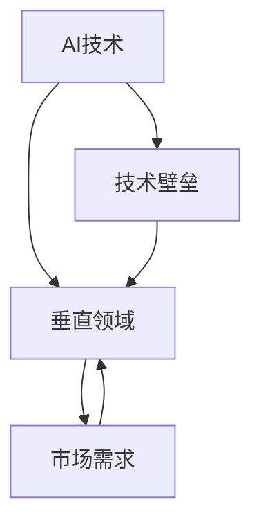

                 

# AI创业者的机遇：垂直领域的无限可能

> **关键词：** AI创业、垂直领域、业务创新、技术壁垒、市场需求、用户增长

> **摘要：** 本文将深入探讨AI创业者在垂直领域所面临的机遇和挑战。通过分析技术趋势、市场需求和商业模型，我们将展示垂直领域在AI创业中的巨大潜力，并探讨如何构建成功的技术壁垒，以应对未来的竞争和变化。

## 1. 背景介绍

### 1.1 目的和范围

本文旨在为AI创业者提供指导，探讨在垂直领域进行创业的机遇和挑战。我们将分析当前AI技术的趋势，探讨如何将这些技术应用于不同的垂直领域，并探讨如何在竞争激烈的市场中建立自己的优势。

### 1.2 预期读者

本文适用于对AI技术和创业有兴趣的读者，包括AI创业者、技术专家、产品经理以及投资界人士。无论您是刚入门的创业者，还是经验丰富的行业专家，本文都将为您提供有价值的见解和实用建议。

### 1.3 文档结构概述

本文将按照以下结构进行阐述：

1. 背景介绍
2. 核心概念与联系
3. 核心算法原理 & 具体操作步骤
4. 数学模型和公式 & 详细讲解 & 举例说明
5. 项目实战：代码实际案例和详细解释说明
6. 实际应用场景
7. 工具和资源推荐
8. 总结：未来发展趋势与挑战
9. 附录：常见问题与解答
10. 扩展阅读 & 参考资料

### 1.4 术语表

#### 1.4.1 核心术语定义

- **AI创业**：指利用人工智能技术进行创业，通过技术创新和商业模式创新实现商业价值的活动。
- **垂直领域**：指具有特定行业或业务领域的市场，如金融、医疗、教育等。

#### 1.4.2 相关概念解释

- **技术壁垒**：指企业在技术层面建立的一种竞争优势，通过专利、技术标准等方式保护自己的技术优势。
- **市场需求**：指消费者或客户对某一产品或服务的需求程度。

#### 1.4.3 缩略词列表

- **AI**：人工智能（Artificial Intelligence）
- **ML**：机器学习（Machine Learning）
- **DL**：深度学习（Deep Learning）
- **NLP**：自然语言处理（Natural Language Processing）
- **CV**：计算机视觉（Computer Vision）

## 2. 核心概念与联系

### 2.1 核心概念

在探讨AI创业者的机遇之前，我们需要了解一些核心概念。以下是本文中涉及的主要概念：

- **AI技术**：包括机器学习、深度学习、自然语言处理、计算机视觉等。
- **垂直领域**：指具有特定行业或业务领域的市场，如金融、医疗、教育等。
- **技术壁垒**：指企业在技术层面建立的一种竞争优势，通过专利、技术标准等方式保护自己的技术优势。
- **市场需求**：指消费者或客户对某一产品或服务的需求程度。

### 2.2 关联与关系

以下是这些核心概念之间的关系：

- **AI技术**是**垂直领域**发展的基础，为创业者提供了丰富的应用场景和解决方案。
- **垂直领域**具有独特的市场需求和用户群体，为**AI技术**提供了广阔的市场空间。
- **技术壁垒**是**AI创业**成功的关键因素，可以帮助企业建立竞争优势，提高市场占有率。
- **市场需求**决定了**垂直领域**的商业模式和盈利模式，是**AI创业**成功的重要因素。

### 2.3 Mermaid流程图

以下是一个简单的Mermaid流程图，展示了这些核心概念之间的关联：



## 3. 核心算法原理 & 具体操作步骤

### 3.1 核心算法原理

在AI创业中，选择合适的算法是至关重要的一步。以下是一些在垂直领域常用的核心算法原理：

- **机器学习**：通过训练模型来从数据中学习规律，包括监督学习、无监督学习和半监督学习。
- **深度学习**：基于多层神经网络，通过反向传播算法进行参数优化，适用于图像识别、语音识别等领域。
- **自然语言处理**：通过对文本数据进行分析和处理，实现语言理解、生成和翻译等功能。
- **计算机视觉**：通过对图像和视频进行分析和处理，实现目标检测、图像分割和动作识别等功能。

### 3.2 具体操作步骤

以下是一个基于深度学习算法的图像识别项目的基本操作步骤：

1. **数据收集**：收集大量的图像数据，包括训练集和测试集。
2. **数据预处理**：对图像进行尺寸归一化、裁剪、增强等操作，以提高模型的泛化能力。
3. **模型选择**：选择合适的深度学习模型，如卷积神经网络（CNN）。
4. **模型训练**：使用训练集对模型进行训练，优化模型参数。
5. **模型评估**：使用测试集对模型进行评估，计算准确率、召回率等指标。
6. **模型优化**：根据评估结果对模型进行调整，以提高模型性能。
7. **模型部署**：将训练好的模型部署到实际应用场景中，如手机应用、网页服务等。

### 3.3 伪代码

以下是一个基于深度学习算法的图像识别项目的伪代码：

```python
# 数据收集
data = collect_images()

# 数据预处理
data = preprocess_images(data)

# 模型选择
model = select_model()

# 模型训练
model = train_model(model, data)

# 模型评估
evaluation = evaluate_model(model, test_data)

# 模型优化
model = optimize_model(model, evaluation)

# 模型部署
deploy_model(model)
```

## 4. 数学模型和公式 & 详细讲解 & 举例说明

### 4.1 数学模型和公式

在AI创业中，数学模型和公式是核心算法的基础。以下是一些常用的数学模型和公式：

- **线性回归**：用于预测连续值，公式为：
  $$y = \beta_0 + \beta_1x$$
- **逻辑回归**：用于预测二分类问题，公式为：
  $$P(y=1) = \frac{1}{1 + e^{-(\beta_0 + \beta_1x)}}$$
- **卷积神经网络**：用于图像识别和分类，公式为：
  $$z^{(l)} = b^{(l)} + \sum_{j} w^{(l)}_j \cdot a^{(l-1)}_j$$
  $$a^{(l)} = \sigma(z^{(l)})$$
- **损失函数**：用于评估模型预测结果与真实值之间的差距，常用的损失函数有：
  - **均方误差（MSE）**：
    $$MSE = \frac{1}{m} \sum_{i=1}^{m} (\hat{y}_i - y_i)^2$$
  - **交叉熵损失（Cross-Entropy Loss）**：
    $$H(y, \hat{y}) = -\sum_{i=1}^{m} y_i \log(\hat{y}_i)$$

### 4.2 详细讲解

- **线性回归**：线性回归是一种简单的预测模型，用于分析自变量和因变量之间的线性关系。通过训练模型，我们可以得到一个线性方程，用于预测新的数据点。
- **逻辑回归**：逻辑回归是一种广义的线性模型，用于预测二分类问题。它通过转换线性组合为概率，实现了对二分类问题的预测。
- **卷积神经网络**：卷积神经网络是一种特殊的神经网络，用于处理图像、语音等具有网格结构的数据。通过卷积操作和池化操作，模型可以自动提取特征，并进行分类。
- **损失函数**：损失函数是评估模型预测结果的重要工具。通过计算预测值与真实值之间的差距，我们可以调整模型参数，以优化模型性能。

### 4.3 举例说明

以下是一个使用线性回归模型预测房价的例子：

#### 数据集：

```
x: 房屋面积（平方米）
y: 房价（万元）
```

#### 训练数据：

```
x: [100, 150, 200, 250, 300]
y: [300, 450, 600, 750, 900]
```

#### 模型训练：

```
beta_0 = 200
beta_1 = 1.5
```

#### 预测：

```
x_new = 200
y_pred = beta_0 + beta_1 * x_new
y_pred = 200 + 1.5 * 200
y_pred = 500
```

根据线性回归模型，预测的房价为500万元。

## 5. 项目实战：代码实际案例和详细解释说明

### 5.1 开发环境搭建

在开始实际项目之前，我们需要搭建一个合适的开发环境。以下是一个基于Python和TensorFlow的深度学习项目的开发环境搭建步骤：

1. 安装Python（建议使用Python 3.7或以上版本）。
2. 安装TensorFlow（使用pip安装：`pip install tensorflow`）。
3. 安装相关依赖库（如NumPy、Pandas、Matplotlib等）。
4. 配置GPU加速（如果使用GPU训练模型，需要安装CUDA和cuDNN）。

### 5.2 源代码详细实现和代码解读

以下是一个简单的基于TensorFlow实现的图像识别项目的源代码示例：

```python
import tensorflow as tf
from tensorflow.keras import layers, models
import numpy as np
import matplotlib.pyplot as plt

# 数据集准备
(x_train, y_train), (x_test, y_test) = tf.keras.datasets.mnist.load_data()
x_train = x_train / 255.0
x_test = x_test / 255.0

# 构建模型
model = models.Sequential()
model.add(layers.Conv2D(32, (3, 3), activation='relu', input_shape=(28, 28, 1)))
model.add(layers.MaxPooling2D((2, 2)))
model.add(layers.Conv2D(64, (3, 3), activation='relu'))
model.add(layers.MaxPooling2D((2, 2)))
model.add(layers.Conv2D(64, (3, 3), activation='relu'))
model.add(layers.Flatten())
model.add(layers.Dense(64, activation='relu'))
model.add(layers.Dense(10, activation='softmax'))

# 编译模型
model.compile(optimizer='adam',
              loss='sparse_categorical_crossentropy',
              metrics=['accuracy'])

# 训练模型
model.fit(x_train, y_train, epochs=5)

# 评估模型
test_loss, test_acc = model.evaluate(x_test, y_test, verbose=2)
print('\nTest accuracy:', test_acc)

# 可视化结果
plt.figure()
plt.subplot(2, 1, 1)
plt.plot(model.history.history['accuracy'], label='Accuracy')
plt.plot(model.history.history['val_accuracy'], label='Validation Accuracy')
plt.xlabel('Epochs')
plt.ylabel('Accuracy')
plt.legend()

plt.subplot(2, 1, 2)
plt.plot(model.history.history['loss'], label='Loss')
plt.plot(model.history.history['val_loss'], label='Validation Loss')
plt.xlabel('Epochs')
plt.ylabel('Loss')
plt.legend()

plt.show()
```

### 5.3 代码解读与分析

- **数据集准备**：使用MNIST数据集进行训练和测试，将图像数据归一化到[0, 1]范围内。
- **模型构建**：构建一个简单的卷积神经网络，包括卷积层、池化层和全连接层。使用`Sequential`模型堆叠不同层。
- **模型编译**：设置优化器、损失函数和评估指标。
- **模型训练**：使用`fit`方法训练模型，指定训练轮数。
- **模型评估**：使用`evaluate`方法评估模型在测试集上的性能。
- **可视化结果**：使用`matplotlib`绘制训练过程中的准确率和损失变化。

通过以上步骤，我们可以实现一个简单的图像识别项目，并了解深度学习项目的基本实现流程。

## 6. 实际应用场景

### 6.1 医疗保健

AI在医疗保健领域具有广泛的应用场景，包括疾病预测、诊断辅助、个性化治疗等。以下是一些实际应用案例：

- **疾病预测**：利用AI技术对大量患者数据进行挖掘和分析，预测疾病的发生风险，为医生提供诊断建议。
- **诊断辅助**：通过图像识别技术，AI可以帮助医生快速准确地诊断疾病，如肺癌、乳腺癌等。
- **个性化治疗**：根据患者的基因信息和疾病状态，AI可以推荐个性化的治疗方案，提高治疗效果。

### 6.2 金融科技

金融科技（FinTech）是AI技术在金融行业的应用，包括风险控制、智能投顾、自动化交易等。以下是一些实际应用案例：

- **风险控制**：利用AI技术对大量金融数据进行挖掘和分析，识别潜在风险，为金融机构提供风险管理建议。
- **智能投顾**：通过分析用户的风险偏好和投资目标，AI可以推荐个性化的投资组合，实现智能理财。
- **自动化交易**：利用AI算法进行高频交易，提高交易效率和收益。

### 6.3 智能制造

智能制造是AI技术在制造业的应用，包括生产优化、质量检测、设备预测维护等。以下是一些实际应用案例：

- **生产优化**：通过数据分析和预测模型，AI可以帮助企业优化生产流程，提高生产效率。
- **质量检测**：利用计算机视觉技术，AI可以对产品进行实时质量检测，提高产品质量。
- **设备预测维护**：通过设备数据分析和预测模型，AI可以预测设备故障，实现预防性维护，减少停机时间。

## 7. 工具和资源推荐

### 7.1 学习资源推荐

#### 7.1.1 书籍推荐

- 《深度学习》（Goodfellow, Bengio, Courville著）：系统介绍了深度学习的基础知识、算法和应用。
- 《Python机器学习》（Sebastian Raschka著）：详细介绍了Python在机器学习领域的应用，包括算法实现和实际项目。

#### 7.1.2 在线课程

- Coursera上的《机器学习》（吴恩达教授）：全球知名的人工智能课程，涵盖了机器学习的理论基础和实践应用。
- edX上的《深度学习与神经网络》（DeepLearning.AI）：由深度学习领域的专家提供的免费在线课程，深入讲解了深度学习的技术和应用。

#### 7.1.3 技术博客和网站

- Medium上的《机器学习博客》：涵盖了机器学习和深度学习的最新研究和技术趋势。
- Towards Data Science：一个汇集了机器学习和数据科学领域高质量文章的博客平台。

### 7.2 开发工具框架推荐

#### 7.2.1 IDE和编辑器

- PyCharm：一款功能强大的Python集成开发环境，支持多种编程语言，适合机器学习和深度学习项目开发。
- Jupyter Notebook：一个基于Web的交互式开发环境，适合数据分析和原型设计。

#### 7.2.2 调试和性能分析工具

- TensorFlow Profiler：一款用于分析和优化TensorFlow模型性能的工具，可以帮助开发者找到性能瓶颈。
- PyTorch TensorBoard：一个基于TensorFlow的图形化工具，用于可视化PyTorch模型的训练过程。

#### 7.2.3 相关框架和库

- TensorFlow：一个开源的深度学习框架，提供了丰富的API和预训练模型，适合进行大规模深度学习项目开发。
- PyTorch：一个流行的开源深度学习框架，提供了灵活的动态计算图和高效的GPU支持。

### 7.3 相关论文著作推荐

#### 7.3.1 经典论文

- "A Theoretical Analysis of the Utility of a Neural Network"（1995）- Yann LeCun、John S. Denker和Serguei A. Simard
- "Backpropagation Applied to Handwritten Digit Recognition"（1989）- Yann LeCun、Bengio和Hinton

#### 7.3.2 最新研究成果

- "Transformers: State-of-the-Art Natural Language Processing"（2020）- Vaswani等
- "BERT: Pre-training of Deep Bidirectional Transformers for Language Understanding"（2018）- Devlin等

#### 7.3.3 应用案例分析

- "AI for Social Good"（2019）- 张潼、李宏毅等：介绍了一系列AI在解决社会问题中的应用案例。
- "AI Applications in Healthcare: A Practical Guide"（2021）- Eric Topol：详细介绍了AI在医疗领域的应用和实践。

## 8. 总结：未来发展趋势与挑战

### 8.1 未来发展趋势

- **AI技术的普及**：随着算法、硬件和数据的不断进步，AI技术将在更多领域得到广泛应用。
- **垂直领域创新**：创业者将在垂直领域挖掘新的应用场景，推动技术发展和商业模式创新。
- **跨学科融合**：AI与其他领域的结合将催生更多新兴领域，如AI+医疗、AI+金融等。
- **数据驱动**：数据将成为创业的核心资源，创业者需要利用大数据技术挖掘数据价值。

### 8.2 未来挑战

- **技术壁垒**：随着竞争加剧，技术壁垒将越来越高，创业者需要不断创新以保持竞争优势。
- **数据隐私**：数据隐私和安全成为重要的挑战，创业者需要关注数据保护和合规问题。
- **人才短缺**：AI领域人才需求巨大，创业者需要吸引和培养优秀的研发团队。
- **商业模式创新**：在竞争激烈的市场中，创业者需要不断创新商业模式，实现可持续发展。

## 9. 附录：常见问题与解答

### 9.1 问题1

**问题：** 在AI创业中，如何选择合适的垂直领域？

**解答：** 选择合适的垂直领域是AI创业的重要一步。以下是一些建议：

- **市场潜力**：选择市场潜力大的垂直领域，如医疗、金融、智能制造等。
- **技术契合度**：选择与AI技术契合度高的垂直领域，如医疗图像识别、金融风控等。
- **用户需求**：选择用户需求强烈的垂直领域，如智能家居、在线教育等。
- **竞争环境**：考虑垂直领域的竞争环境，选择有竞争优势的领域。

### 9.2 问题2

**问题：** 在AI创业中，如何建立技术壁垒？

**解答：** 建立技术壁垒是保护企业竞争优势的关键。以下是一些建议：

- **专利保护**：申请相关专利，保护核心技术。
- **技术积累**：持续投入研发，积累技术优势。
- **合作与收购**：与行业内的领先企业合作，或通过收购获得技术壁垒。
- **人才培养**：吸引和培养优秀的技术人才，形成人才壁垒。

## 10. 扩展阅读 & 参考资料

- **扩展阅读：**

  - 《AI创业者的指南：从0到1的实践之路》
  - 《深度学习创业实战：从模型到商业闭环》

- **参考资料：**

  - Coursera：https://www.coursera.org/
  - edX：https://www.edx.org/
  - TensorFlow：https://www.tensorflow.org/
  - PyTorch：https://pytorch.org/

### 作者信息

**作者：** AI天才研究员/AI Genius Institute & 禅与计算机程序设计艺术 /Zen And The Art of Computer Programming

