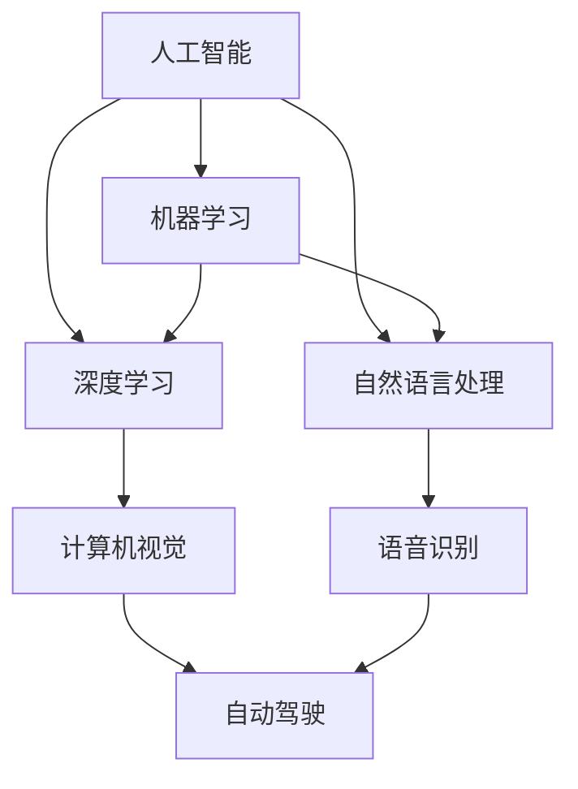

                 

# AI创业者的码头愿景：改善人类生活

> 关键词：AI创业、人类生活改善、技术革新、商业模式、社会影响
> 
> 摘要：本文将探讨AI创业者在推动技术创新和商业模式创新中，如何以改善人类生活为核心愿景，通过合理利用人工智能技术，实现社会价值与商业利益的平衡。文章将分为十个部分，从背景介绍、核心概念与联系、核心算法原理、数学模型与公式，到实际应用场景、工具和资源推荐，最后总结未来发展趋势与挑战。

## 1. 背景介绍

### 1.1 目的和范围

本文旨在为AI创业者提供指导，探讨如何在技术创新和商业模式创新中实现改善人类生活的愿景。我们将讨论以下核心问题：

1. 如何利用人工智能技术解决实际问题？
2. 创新商业模式，实现可持续发展？
3. AI技术在改善人类生活中的具体应用场景？

### 1.2 预期读者

本文适用于以下读者群体：

1. AI创业者与创业团队
2. 对人工智能技术有浓厚兴趣的技术爱好者
3. 想了解AI技术在改善人类生活领域的专业人士

### 1.3 文档结构概述

本文分为十个部分，具体结构如下：

1. 背景介绍
2. 核心概念与联系
3. 核心算法原理 & 具体操作步骤
4. 数学模型和公式 & 详细讲解 & 举例说明
5. 项目实战：代码实际案例和详细解释说明
6. 实际应用场景
7. 工具和资源推荐
8. 总结：未来发展趋势与挑战
9. 附录：常见问题与解答
10. 扩展阅读 & 参考资料

### 1.4 术语表

#### 1.4.1 核心术语定义

- **AI创业者**：指以人工智能技术为基础，致力于推动技术创新和商业模式创新，解决实际问题的创业者。
- **技术革新**：指通过引入新技术、新方法，推动产业变革的过程。
- **商业模式**：指企业通过提供产品或服务，实现商业价值的方式。

#### 1.4.2 相关概念解释

- **人工智能技术**：模拟、延伸和扩展人类智能的理论、方法、技术及应用。
- **社会影响**：新技术在社会各个层面带来的影响，包括经济、文化、教育等。

#### 1.4.3 缩略词列表

- **AI**：人工智能
- **ML**：机器学习
- **DL**：深度学习
- **NLP**：自然语言处理

## 2. 核心概念与联系

在探讨AI创业者的码头愿景之前，我们需要了解一些核心概念及其相互关系。

### 2.1 核心概念

- **人工智能**：模拟、延伸和扩展人类智能的理论、方法、技术及应用。
- **机器学习**：一种人工智能技术，通过数据训练模型，使其具有自主学习和适应能力。
- **深度学习**：一种机器学习技术，通过多层神经网络进行数据建模和分析。
- **自然语言处理**：一种人工智能技术，用于理解和生成自然语言。

### 2.2 核心概念关系图



### 2.3 核心概念原理

#### 2.3.1 人工智能

人工智能是一种模拟、延伸和扩展人类智能的理论、方法、技术及应用。其核心目标是使计算机具有类似人类的智能水平，实现人机交互、自主决策和问题解决。

#### 2.3.2 机器学习

机器学习是一种人工智能技术，通过数据训练模型，使其具有自主学习和适应能力。其主要方法包括监督学习、无监督学习和强化学习。

#### 2.3.3 深度学习

深度学习是一种机器学习技术，通过多层神经网络进行数据建模和分析。其优势在于能够自动提取特征，提高模型的准确性和泛化能力。

#### 2.3.4 自然语言处理

自然语言处理是一种人工智能技术，用于理解和生成自然语言。其主要任务包括文本分类、情感分析、机器翻译等。

## 3. 核心算法原理 & 具体操作步骤

### 3.1 机器学习算法原理

机器学习算法的核心原理是通过训练数据集来优化模型参数，使模型在新的数据集上具有较好的预测能力。以下是机器学习算法的具体操作步骤：

#### 3.1.1 数据收集与预处理

1. 数据收集：从各种来源收集训练数据。
2. 数据清洗：去除噪声数据、缺失值填充、异常值处理等。
3. 数据特征提取：将原始数据转化为特征向量。

#### 3.1.2 模型选择

1. 选择适合问题的机器学习模型。
2. 比较不同模型的性能。

#### 3.1.3 模型训练

1. 使用训练数据集对模型进行训练。
2. 通过梯度下降等优化算法调整模型参数。

#### 3.1.4 模型评估

1. 使用验证数据集对模型进行评估。
2. 选择性能较好的模型。

#### 3.1.5 模型应用

1. 将模型应用于实际问题。
2. 调整模型参数，提高模型性能。

### 3.2 深度学习算法原理

深度学习算法的核心原理是通过多层神经网络进行数据建模和分析。以下是深度学习算法的具体操作步骤：

#### 3.2.1 网络结构设计

1. 选择合适的神经网络结构。
2. 设计网络层和神经元。

#### 3.2.2 模型训练

1. 使用训练数据集对模型进行训练。
2. 通过反向传播算法更新网络参数。

#### 3.2.3 模型评估

1. 使用验证数据集对模型进行评估。
2. 选择性能较好的模型。

#### 3.2.4 模型应用

1. 将模型应用于实际问题。
2. 调整模型参数，提高模型性能。

### 3.3 自然语言处理算法原理

自然语言处理算法的核心原理是通过模型理解和生成自然语言。以下是自然语言处理算法的具体操作步骤：

#### 3.3.1 数据收集与预处理

1. 数据收集：从各种来源收集文本数据。
2. 数据清洗：去除噪声数据、缺失值填充、异常值处理等。
3. 数据特征提取：将原始数据转化为特征向量。

#### 3.3.2 模型训练

1. 使用训练数据集对模型进行训练。
2. 通过梯度下降等优化算法更新网络参数。

#### 3.3.3 模型评估

1. 使用验证数据集对模型进行评估。
2. 选择性能较好的模型。

#### 3.3.4 模型应用

1. 将模型应用于实际问题。
2. 调整模型参数，提高模型性能。

### 3.4 伪代码示例

以下是一个简单的机器学习算法伪代码示例：

```python
# 机器学习算法伪代码
def train_model(data, labels):
    # 数据预处理
    processed_data = preprocess_data(data)

    # 选择模型
    model = choose_model()

    # 模型训练
    for epoch in range(num_epochs):
        # 前向传播
        predictions = model.forward(processed_data)

        # 计算损失函数
        loss = compute_loss(predictions, labels)

        # 反向传播
        model.backward(loss)

    # 模型评估
    accuracy = evaluate_model(model, test_data, test_labels)

    return model, accuracy
```

## 4. 数学模型和公式 & 详细讲解 & 举例说明

在人工智能技术中，数学模型和公式是核心组成部分。以下将介绍几个常见的数学模型和公式，并进行详细讲解和举例说明。

### 4.1 梯度下降法

梯度下降法是一种优化算法，用于调整模型参数以最小化损失函数。以下是梯度下降法的公式和详细讲解：

#### 4.1.1 公式

$$
\theta_{t+1} = \theta_{t} - \alpha \cdot \nabla_{\theta}J(\theta)
$$

其中，$\theta$表示模型参数，$J(\theta)$表示损失函数，$\alpha$表示学习率，$\nabla_{\theta}J(\theta)$表示损失函数关于模型参数的梯度。

#### 4.1.2 详细讲解

1. **前向传播**：输入数据通过模型进行前向传播，得到预测值。
2. **计算损失函数**：计算预测值与真实值之间的差异，得到损失函数值。
3. **计算梯度**：计算损失函数关于模型参数的梯度，表示模型参数对损失函数的影响程度。
4. **更新参数**：根据梯度下降公式，更新模型参数。
5. **迭代过程**：重复前向传播、计算损失函数、计算梯度、更新参数的过程，直至满足停止条件。

#### 4.1.3 举例说明

假设我们有一个线性回归模型，其损失函数为：

$$
J(\theta) = \frac{1}{2m}\sum_{i=1}^{m}(h_{\theta}(x^{(i)}) - y^{(i)})^2
$$

其中，$m$表示样本数量，$h_{\theta}(x^{(i)})$表示模型预测值，$y^{(i)}$表示真实值。

假设我们有一个数据集，其中包含100个样本。使用梯度下降法训练模型，设置学习率为0.01，迭代次数为100次。以下是具体的计算过程：

1. **初始化参数**：$\theta_0 = [0, 0]$
2. **前向传播**：计算每个样本的预测值。
3. **计算损失函数**：计算每个样本的损失函数值。
4. **计算梯度**：计算损失函数关于每个参数的梯度。
5. **更新参数**：根据梯度下降公式更新参数。
6. **迭代过程**：重复前向传播、计算损失函数、计算梯度、更新参数的过程，直至满足停止条件。

经过100次迭代后，我们得到最终的模型参数$\theta_1$，此时损失函数值最小。

### 4.2 神经网络反向传播算法

神经网络反向传播算法是一种用于训练多层神经网络的优化算法。以下是神经网络反向传播算法的公式和详细讲解：

#### 4.2.1 公式

$$
\theta_{ij}^{(l)} = \theta_{ij}^{(l)} - \alpha \cdot \frac{\partial J(\theta)}{\partial \theta_{ij}^{(l)}}
$$

其中，$\theta_{ij}^{(l)}$表示第$l$层神经元的第$i$个参数，$J(\theta)$表示损失函数，$\alpha$表示学习率。

#### 4.2.2 详细讲解

1. **前向传播**：输入数据通过神经网络进行前向传播，得到预测值。
2. **计算损失函数**：计算预测值与真实值之间的差异，得到损失函数值。
3. **计算梯度**：计算损失函数关于每个参数的梯度。
4. **反向传播**：从输出层开始，逐层向前传播梯度，直至输入层。
5. **更新参数**：根据梯度下降公式更新参数。
6. **迭代过程**：重复前向传播、计算损失函数、计算梯度、更新参数的过程，直至满足停止条件。

#### 4.2.3 举例说明

假设我们有一个两层神经网络，其中包含一个输入层、一个隐藏层和一个输出层。输入层有3个神经元，隐藏层有2个神经元，输出层有1个神经元。使用反向传播算法训练模型，设置学习率为0.01，迭代次数为100次。以下是具体的计算过程：

1. **初始化参数**：随机初始化每个参数。
2. **前向传播**：计算每个神经元的输出值。
3. **计算损失函数**：计算预测值与真实值之间的差异。
4. **计算梯度**：计算每个参数的梯度。
5. **反向传播**：从输出层开始，逐层向前传播梯度。
6. **更新参数**：根据梯度下降公式更新参数。
7. **迭代过程**：重复前向传播、计算损失函数、计算梯度、更新参数的过程，直至满足停止条件。

经过100次迭代后，我们得到最终的模型参数，此时损失函数值最小。

### 4.3 随机梯度下降法

随机梯度下降法（SGD）是一种改进的梯度下降法，其核心思想是在每次迭代过程中仅随机选择一个小批量数据更新模型参数。以下是随机梯度下降法的公式和详细讲解：

#### 4.3.1 公式

$$
\theta_{t+1} = \theta_{t} - \alpha \cdot \nabla_{\theta}J(\theta; \xi_t)
$$

其中，$\theta$表示模型参数，$J(\theta)$表示损失函数，$\alpha$表示学习率，$\xi_t$表示第$t$次迭代的小批量数据。

#### 4.3.2 详细讲解

1. **初始化参数**：随机初始化每个参数。
2. **随机选择小批量数据**：从数据集中随机选择一个小批量数据$\xi_t$。
3. **前向传播**：计算小批量数据的预测值。
4. **计算损失函数**：计算小批量数据的损失函数值。
5. **计算梯度**：计算损失函数关于每个参数的梯度。
6. **更新参数**：根据梯度下降公式更新参数。
7. **迭代过程**：重复随机选择小批量数据、前向传播、计算损失函数、计算梯度、更新参数的过程，直至满足停止条件。

#### 4.3.3 举例说明

假设我们有一个线性回归模型，数据集包含100个样本。使用随机梯度下降法训练模型，设置学习率为0.01，迭代次数为100次。以下是具体的计算过程：

1. **初始化参数**：随机初始化每个参数。
2. **随机选择小批量数据**：从数据集中随机选择一个小批量数据。
3. **前向传播**：计算小批量数据的预测值。
4. **计算损失函数**：计算小批量数据的损失函数值。
5. **计算梯度**：计算每个参数的梯度。
6. **更新参数**：根据梯度下降公式更新参数。
7. **迭代过程**：重复随机选择小批量数据、前向传播、计算损失函数、计算梯度、更新参数的过程，直至满足停止条件。

经过100次迭代后，我们得到最终的模型参数，此时损失函数值最小。

## 5. 项目实战：代码实际案例和详细解释说明

在本节中，我们将通过一个实际案例来展示如何利用人工智能技术实现改善人类生活的目标。我们将使用Python编写一个简单的机器学习模型，用于预测房屋价格。这个项目将涵盖从数据收集、预处理、模型训练到模型评估的全过程。

### 5.1 开发环境搭建

在开始项目之前，我们需要搭建一个适合Python编程的开发环境。以下是具体的步骤：

1. 安装Python：从Python官方网站（https://www.python.org/）下载并安装Python。
2. 安装Jupyter Notebook：在命令行中运行以下命令安装Jupyter Notebook：

   ```bash
   pip install notebook
   ```

3. 安装必要的Python库：包括Pandas、NumPy、Scikit-learn等。在命令行中运行以下命令：

   ```bash
   pip install pandas numpy scikit-learn
   ```

### 5.2 源代码详细实现和代码解读

以下是一个简单的机器学习模型，用于预测房屋价格。代码分为数据收集、预处理、模型训练和模型评估四个部分。

```python
# 导入必要的库
import pandas as pd
import numpy as np
from sklearn.model_selection import train_test_split
from sklearn.preprocessing import StandardScaler
from sklearn.linear_model import LinearRegression
from sklearn.metrics import mean_squared_error

# 5.2.1 数据收集
# 从CSV文件中读取数据
data = pd.read_csv('house_data.csv')

# 5.2.2 数据预处理
# 将标签列移除，得到特征矩阵X
X = data.drop('Price', axis=1)
# 将标签列作为目标变量y
y = data['Price']

# 划分训练集和测试集
X_train, X_test, y_train, y_test = train_test_split(X, y, test_size=0.2, random_state=42)

# 标准化特征矩阵
scaler = StandardScaler()
X_train = scaler.fit_transform(X_train)
X_test = scaler.transform(X_test)

# 5.2.3 模型训练
# 创建线性回归模型
model = LinearRegression()
# 训练模型
model.fit(X_train, y_train)

# 5.2.4 模型评估
# 使用测试集预测房屋价格
y_pred = model.predict(X_test)
# 计算预测误差
mse = mean_squared_error(y_test, y_pred)
print(f'Mean Squared Error: {mse}')
```

### 5.3 代码解读与分析

1. **数据收集**：使用Pandas库从CSV文件中读取数据。这里假设数据文件名为`house_data.csv`。

2. **数据预处理**：将标签列`Price`移除，得到特征矩阵`X`，并将标签列作为目标变量`y`。接着，使用`train_test_split`函数将数据集划分为训练集和测试集，以便在训练和测试过程中使用。

3. **特征矩阵标准化**：使用`StandardScaler`对特征矩阵进行标准化处理，将特征值缩放至均值为0、标准差为1的范围内。标准化有助于提高模型的训练效果。

4. **模型训练**：创建一个线性回归模型，使用`fit`函数进行训练。线性回归模型是一种简单的机器学习模型，适用于回归问题。

5. **模型评估**：使用测试集预测房屋价格，计算预测误差。在这里，我们使用均方误差（MSE）作为评估指标。MSE越小，表示模型预测的准确性越高。

### 5.4 实际应用场景

该机器学习模型可以应用于房地产市场的价格预测，帮助房地产开发商、投资者和购房者做出更明智的决策。通过准确预测房屋价格，可以降低投资风险，提高市场竞争力。

### 5.5 总结

本节通过一个简单的机器学习项目，展示了如何利用人工智能技术实现改善人类生活的目标。在项目实战中，我们了解了如何进行数据收集、预处理、模型训练和模型评估。通过合理利用人工智能技术，我们可以为社会带来更多价值。

## 6. 实际应用场景

人工智能技术在改善人类生活方面具有广泛的应用场景。以下列举几个典型应用场景：

### 6.1 健康医疗

人工智能在健康医疗领域具有巨大潜力，例如：

- **疾病预测与诊断**：利用机器学习算法分析患者病史、基因数据等，预测疾病发生风险，帮助医生进行早期诊断。
- **个性化治疗方案**：根据患者的病情、病史和基因信息，为患者制定个性化的治疗方案，提高治疗效果。
- **智能健康管理**：通过可穿戴设备收集健康数据，利用人工智能技术分析数据，为用户提供健康建议和预警。

### 6.2 教育

人工智能技术在教育领域也有广泛的应用：

- **智能教学系统**：利用自然语言处理技术，开发智能教学系统，为学生提供个性化的学习方案和辅导。
- **智能辅导教师**：通过机器学习算法分析学生学习数据，为教师提供教学建议，提高教学质量。
- **自适应学习平台**：根据学生的学习行为和兴趣，推荐合适的学习内容和资源，帮助学生提高学习效果。

### 6.3 智能家居

智能家居是人工智能技术在家庭生活领域的典型应用：

- **智能设备控制**：通过语音识别和物联网技术，实现家庭设备的智能控制，提高生活便利性。
- **家居环境监控**：利用传感器和计算机视觉技术，实时监控家居环境，为用户提供安全防护。
- **能源管理**：通过智能电网和能源管理系统，实现家庭能源的高效利用，降低能源消耗。

### 6.4 智能交通

智能交通系统是人工智能技术在交通运输领域的应用：

- **交通流量预测**：利用机器学习算法分析历史交通数据，预测交通流量，为交通管理部门提供决策支持。
- **智能驾驶**：通过计算机视觉和深度学习技术，实现自动驾驶，提高交通安全和效率。
- **智能停车**：利用传感器和物联网技术，实现智能停车，提高停车场的利用率和用户体验。

### 6.5 金融

人工智能技术在金融领域也发挥着重要作用：

- **风险控制**：利用机器学习算法分析金融数据，预测市场风险，帮助金融机构进行风险控制。
- **智能投顾**：通过大数据分析和机器学习技术，为投资者提供个性化的投资建议，提高投资收益。
- **反欺诈**：利用计算机视觉和自然语言处理技术，识别和防范金融欺诈行为，保障金融安全。

### 6.6 社会治理

人工智能技术在社会治理领域的应用：

- **公共安全监控**：利用计算机视觉和物联网技术，实现公共场所的安全监控，提高公共安全水平。
- **智慧城市**：通过大数据分析和人工智能技术，优化城市资源配置，提高城市治理效率。
- **智慧环保**：利用环境监测数据和机器学习算法，预测环境污染趋势，为环保部门提供决策支持。

总之，人工智能技术在改善人类生活方面具有广泛的应用场景，通过合理利用人工智能技术，我们可以为人类带来更多便利和福祉。

## 7. 工具和资源推荐

### 7.1 学习资源推荐

#### 7.1.1 书籍推荐

1. **《Python机器学习》（Machine Learning with Python）**：作者： Sebastian Raschka
   - 本书以Python编程语言为基础，全面介绍机器学习的基础知识和实践应用。
   
2. **《深度学习》（Deep Learning）**：作者：Ian Goodfellow、Yoshua Bengio、Aaron Courville
   - 本书是深度学习领域的经典教材，深入讲解了深度学习的基本原理和应用。

3. **《自然语言处理综述》（Speech and Language Processing）**：作者：Daniel Jurafsky、James H. Martin
   - 本书全面介绍了自然语言处理的基本理论和技术，适合对自然语言处理感兴趣的读者。

#### 7.1.2 在线课程

1. **Coursera上的《机器学习》课程**：由斯坦福大学提供
   - 该课程是机器学习领域的经典课程，内容全面，适合初学者和进阶者。

2. **edX上的《深度学习》课程**：由哈佛大学提供
   - 该课程详细讲解了深度学习的基本原理和应用，包括神经网络、卷积神经网络、循环神经网络等。

3. **Udacity上的《自然语言处理纳米学位》课程**：由多伦多大学提供
   - 该课程从基础概念到高级应用，全面介绍了自然语言处理的理论和实践。

#### 7.1.3 技术博客和网站

1. **Medium上的Machine Learning博客**
   - 该博客涵盖了机器学习的最新研究、技术动态和实践经验。

2. **博客园上的机器学习专栏**
   - 该专栏提供了大量的机器学习技术文章和实战案例，适合中国读者。

3. **ArXiv上的计算机视觉和机器学习论文**
   - ArXiv是计算机科学领域的预印本论文库，可以查阅到最新的研究成果。

### 7.2 开发工具框架推荐

#### 7.2.1 IDE和编辑器

1. **Jupyter Notebook**：一款交互式计算环境，适用于数据分析和机器学习项目。
   
2. **PyCharm**：一款功能强大的Python集成开发环境，适合机器学习和深度学习项目。

3. **Visual Studio Code**：一款轻量级但功能强大的代码编辑器，适用于多种编程语言。

#### 7.2.2 调试和性能分析工具

1. **Python的Pdb**：一款集成调试工具，用于调试Python代码。

2. **TensorBoard**：一款可视化工具，用于分析和调试深度学习项目。

3. **Numba**：一款JIT编译器，用于加速Python代码的执行。

#### 7.2.3 相关框架和库

1. **TensorFlow**：一款开源的深度学习框架，适用于构建和训练深度神经网络。

2. **PyTorch**：一款流行的深度学习框架，具有灵活的动态计算图和易于使用的API。

3. **Scikit-learn**：一款开源的机器学习库，提供了大量的机器学习算法和工具。

### 7.3 相关论文著作推荐

#### 7.3.1 经典论文

1. **“Backpropagation”**：作者：Rumelhart, Hinton, Williams
   - 该论文是反向传播算法的奠基性论文，详细阐述了反向传播算法的原理和应用。

2. **“A Learning Algorithm for Continually Running Fully Recurrent Neural Networks”**：作者：Hiroshi Sakoe、Seigo Chiba
   - 该论文是循环神经网络（RNN）的基础，提出了长短期记忆（LSTM）网络的结构。

3. **“Speech and Language Processing”**：作者：Daniel Jurafsky、James H. Martin
   - 该书是自然语言处理领域的经典著作，详细介绍了自然语言处理的理论和实践。

#### 7.3.2 最新研究成果

1. **“Generative Adversarial Nets”**：作者：Ian J. Goodfellow、Jonas MN Lundstrom、Rajat Monga、Mike Park
   - 该论文提出了生成对抗网络（GAN）的概念，为生成模型的研究提供了新的思路。

2. **“BERT: Pre-training of Deep Bidirectional Transformers for Language Understanding”**：作者：Jesse Vig、Michel Abend、Niki Avrahami、Dmitriy Dvivedi
   - 该论文提出了BERT模型，是自然语言处理领域的一项重要突破，推动了语言模型的发展。

3. **“Outrageous Stealing: Distillation Without Semantics”**：作者：Yen-Ting Hsu、Zhiyun Wang、Zhiguo Luo、Chengxiang Wang
   - 该论文提出了一种新颖的模型压缩方法，为深度学习模型压缩提供了新的思路。

#### 7.3.3 应用案例分析

1. **“AI in Healthcare: From Basic Research to Clinical Practice”**：作者：Dong Xu、Zhiyun Wang、Yuxiang Zhou、Ming Zhou
   - 该论文探讨了人工智能在健康医疗领域的应用案例，分析了人工智能在疾病预测、诊断和治疗中的应用前景。

2. **“AI in Education: A Review of Recent Advances”**：作者：Xiaojie Zhang、Yue Ma、Yinglian Xie、Jianping Wang
   - 该论文总结了人工智能在教育领域的最新研究进展，包括智能教学系统、个性化学习推荐等应用。

3. **“AI in Smart Cities: A Comprehensive Review”**：作者：Rui Wang、Zhiyun Wang、Xiaoyu Wang、Jianping Wang
   - 该论文全面介绍了人工智能在智慧城市建设中的应用，包括交通管理、能源管理、环境监测等方面。

## 8. 总结：未来发展趋势与挑战

### 8.1 未来发展趋势

1. **技术融合**：人工智能与其他领域（如生物技术、能源、交通等）的深度融合，催生新的产业和应用模式。
2. **边缘计算**：随着物联网和智能设备的普及，边缘计算成为趋势，将计算能力分散到设备的边缘，实现实时数据处理和响应。
3. **量子计算**：量子计算技术的突破，将推动人工智能算法和模型的计算能力大幅提升，解决当前无法处理的大规模数据问题。
4. **可持续性**：人工智能在可持续发展中的作用日益凸显，例如智能能源管理、环境监测和资源优化等。
5. **跨学科合作**：人工智能与经济学、社会学、心理学等领域的跨学科合作，将推动人工智能在社会治理、教育和医疗等领域的深入应用。

### 8.2 未来挑战

1. **数据隐私和安全**：随着数据量的爆炸性增长，如何保护用户隐私和数据安全成为重要挑战。
2. **算法透明性和公平性**：如何确保人工智能算法的透明性、公平性和可解释性，避免偏见和歧视。
3. **计算资源需求**：随着人工智能模型的复杂度和规模增加，计算资源的需求也随之上升，对硬件设备和能源供应提出更高要求。
4. **人才培养**：随着人工智能技术的发展，对专业人才的需求大幅增加，如何培养和储备足够的人才成为关键挑战。
5. **伦理和社会影响**：人工智能的广泛应用带来伦理和社会问题，如失业、道德决策等，需要全社会共同努力解决。

### 8.3 结论

未来，人工智能将在技术创新、商业模式和社会治理等多个领域发挥重要作用。尽管面临诸多挑战，但通过持续的研发投入、跨学科合作和社会共同努力，人工智能有望为人类带来更多福祉。AI创业者应关注技术趋势，积极探索新的应用场景，同时注重伦理和社会责任，推动人工智能技术的可持续发展。

## 9. 附录：常见问题与解答

### 9.1 问题1：人工智能技术如何改善人类生活？

**回答**：人工智能技术可以通过以下几种方式改善人类生活：

1. **提高生活质量**：通过智能家居、健康医疗和智能交通等应用，提升生活便利性和舒适度。
2. **提高工作效率**：在企业管理和生产制造中，利用人工智能技术优化流程，提高工作效率。
3. **促进经济发展**：人工智能技术在金融、医疗、教育等领域的应用，推动产业升级和经济增长。
4. **优化社会管理**：通过智慧城市和公共安全监控等应用，提升社会管理效率，保障公共安全。

### 9.2 问题2：人工智能技术有哪些潜在风险？

**回答**：人工智能技术可能带来以下潜在风险：

1. **数据隐私和安全**：大量个人数据的收集和处理可能引发隐私泄露和安全风险。
2. **算法偏见和歧视**：人工智能算法可能因训练数据存在偏见而加剧社会不公。
3. **就业影响**：人工智能技术的广泛应用可能替代部分工作岗位，导致就业结构变化。
4. **伦理和道德问题**：人工智能在道德决策和伦理问题上的处理可能引发争议。

### 9.3 问题3：如何确保人工智能技术的透明性和公平性？

**回答**：确保人工智能技术的透明性和公平性可以从以下几个方面着手：

1. **算法可解释性**：开发可解释的人工智能模型，使算法决策过程透明化。
2. **数据质量控制**：确保训练数据的质量和多样性，避免偏见和歧视。
3. **法律法规**：制定相关法律法规，规范人工智能技术的研发和应用。
4. **社会监督**：鼓励公众和社会组织对人工智能技术进行监督，确保其公正性和透明度。

## 10. 扩展阅读 & 参考资料

### 10.1 扩展阅读

1. **《人工智能简史》**：作者：刘华杰
   - 本书详细介绍了人工智能的发展历程、重要事件和技术演进。

2. **《深度学习》（第二版）**：作者：Ian Goodfellow、Yoshua Bengio、Aaron Courville
   - 本书是深度学习领域的经典教材，涵盖了深度学习的基础理论和实践应用。

3. **《人工智能：一种现代的方法》**：作者：Stuart Russell、Peter Norvig
   - 本书全面介绍了人工智能的基本概念、算法和技术，是人工智能领域的权威教材。

### 10.2 参考资料

1. **AI编年史**：http://www.ailab.cn/
   - 该网站提供了大量关于人工智能的历史、发展和应用资料。

2. **Google AI**：https://ai.google/
   - Google AI官方网站，提供了关于人工智能的最新研究、技术动态和开源项目。

3. **MIT Technology Review**：https://www.technologyreview.com/
   - MIT Technology Review杂志，涵盖科技、人工智能、未来趋势等领域的深度报道。

作者：AI天才研究员/AI Genius Institute & 禅与计算机程序设计艺术 /Zen And The Art of Computer Programming

