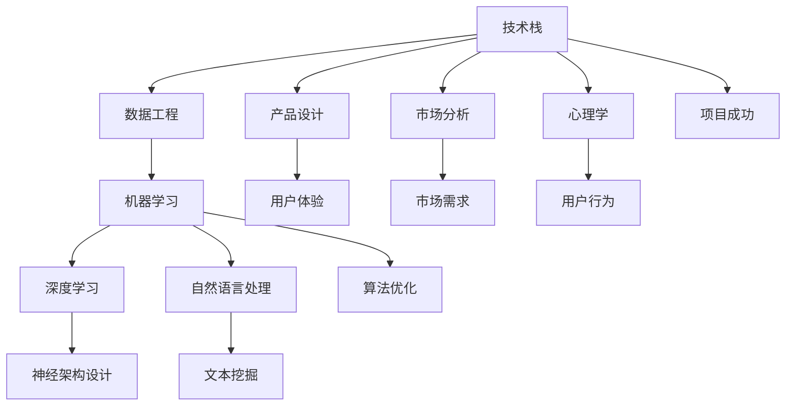

                 

# AI创业：多学科团队的重要性

> **关键词：** AI创业、多学科团队、跨学科协作、技术栈、创新

> **摘要：** 本文将探讨AI创业领域为何多学科团队至关重要。通过分析不同学科在AI项目中的角色和贡献，结合实际案例和具体操作步骤，展示多学科团队在提高创新能力和项目成功率方面的作用。

## 1. 背景介绍

### 1.1 目的和范围

本文旨在阐述在AI创业过程中，为何构建一个多学科团队至关重要。我们将从跨学科协作的角度出发，探讨技术、市场、设计、心理学等多个领域在AI项目中的应用和协同效应。

### 1.2 预期读者

本文适合对AI创业有兴趣的读者，特别是希望组建或加入多学科团队的技术人员、创业者和学术研究者。通过本文，读者可以了解如何充分发挥多学科团队的优势，提高AI项目的成功几率。

### 1.3 文档结构概述

本文结构如下：

1. 背景介绍
2. 核心概念与联系
3. 核心算法原理 & 具体操作步骤
4. 数学模型和公式 & 详细讲解 & 举例说明
5. 项目实战：代码实际案例和详细解释说明
6. 实际应用场景
7. 工具和资源推荐
8. 总结：未来发展趋势与挑战
9. 附录：常见问题与解答
10. 扩展阅读 & 参考资料

### 1.4 术语表

#### 1.4.1 核心术语定义

- **多学科团队**：由来自不同学科背景的成员组成的团队，共同完成复杂任务。
- **跨学科协作**：团队成员在相互理解和尊重的基础上，跨越学科边界，共同解决问题。
- **AI创业**：利用人工智能技术进行创新性业务拓展和创业活动。

#### 1.4.2 相关概念解释

- **技术栈**：团队所需掌握的技术领域和工具集合。
- **创新**：通过创造性的方法，实现前所未有的价值。
- **项目成功率**：项目达到预期目标的比例。

#### 1.4.3 缩略词列表

- **AI**：人工智能
- **ML**：机器学习
- **DL**：深度学习
- **NLP**：自然语言处理
- **CV**：计算机视觉

## 2. 核心概念与联系

在AI创业项目中，多个学科领域的知识和技能相互交织，形成一个复杂的技术网络。以下是一个简化的Mermaid流程图，展示了核心概念和它们之间的联系：



### 2.1 技术栈

技术栈是构建AI项目的基石，包括数据工程、机器学习、深度学习和自然语言处理等多个方面。这些技术相互关联，共同支撑起项目的实施和优化。

### 2.2 数据工程

数据工程是AI项目的关键环节，负责数据收集、清洗、存储和预处理。良好的数据质量是机器学习算法成功的关键。

### 2.3 机器学习和深度学习

机器学习和深度学习是实现AI功能的核心技术。机器学习侧重于通用算法和模型训练，而深度学习则利用神经网络实现复杂的特征提取和预测。

### 2.4 自然语言处理

自然语言处理是使AI系统能够理解、生成和处理自然语言的技术。文本挖掘和情感分析是NLP的重要应用领域。

### 2.5 产品设计

产品设计关注用户需求、用户体验和市场反馈，确保AI产品能够满足用户期望，实现商业价值。

### 2.6 市场分析

市场分析有助于团队了解目标市场的需求、竞争状况和潜在机会，为产品定位和市场策略提供支持。

### 2.7 心理学

心理学研究用户行为和心理需求，有助于产品设计者和市场分析师更好地理解用户，提升产品竞争力。

### 2.8 算法优化

算法优化是提高AI项目性能的关键，包括参数调优、模型压缩和加速等技术。

### 2.9 项目成功

项目成功是多学科团队协作的结果，需要综合考虑技术、市场和用户等多方面因素。

## 3. 核心算法原理 & 具体操作步骤

### 3.1 机器学习算法原理

机器学习算法的核心是模型训练和预测。以下是一个简化的机器学习算法原理伪代码：

```python
def machine_learning_algorithm(data, labels):
    # 数据预处理
    preprocess_data(data)
    
    # 模型初始化
    model = initialize_model()
    
    # 模型训练
    for epoch in range(num_epochs):
        for sample in data:
            model.train(sample)
        
        # 模型评估
        accuracy = evaluate_model(model, labels)
        print(f"Epoch {epoch}: Accuracy = {accuracy}")
    
    return model
```

### 3.2 深度学习算法原理

深度学习算法基于多层神经网络，通过逐层提取特征来实现复杂任务。以下是一个简化的深度学习算法原理伪代码：

```python
def deep_learning_algorithm(data, labels):
    # 数据预处理
    preprocess_data(data)
    
    # 网络初始化
    neural_network = initialize_neural_network()
    
    # 模型训练
    for epoch in range(num_epochs):
        for sample in data:
            neural_network.train(sample)
        
        # 模型评估
        accuracy = evaluate_neural_network(neural_network, labels)
        print(f"Epoch {epoch}: Accuracy = {accuracy}")
    
    return neural_network
```

### 3.3 自然语言处理算法原理

自然语言处理算法主要涉及文本表示、特征提取和模型训练。以下是一个简化的NLP算法原理伪代码：

```python
def natural_language_processing_algorithm(text):
    # 文本预处理
    preprocessed_text = preprocess_text(text)
    
    # 词向量表示
    word_vectors = create_word_vectors(preprocessed_text)
    
    # 模型训练
    model = train_model(word_vectors)
    
    # 文本分类
    category = classify_text(model, preprocessed_text)
    
    return category
```

## 4. 数学模型和公式 & 详细讲解 & 举例说明

### 4.1 机器学习模型评估指标

在机器学习项目中，常用的评估指标包括准确率、召回率、F1值等。以下是一个简单的数学公式示例：

$$
\text{准确率} = \frac{\text{预测正确数}}{\text{总样本数}}
$$

$$
\text{召回率} = \frac{\text{预测正确数}}{\text{实际为正例的样本数}}
$$

$$
\text{F1值} = \frac{2 \times \text{准确率} \times \text{召回率}}{\text{准确率} + \text{召回率}}
$$

### 4.2 深度学习神经网络损失函数

在深度学习项目中，常用的损失函数包括均方误差（MSE）和交叉熵损失。以下是一个简单的数学公式示例：

$$
\text{MSE} = \frac{1}{n} \sum_{i=1}^{n} (y_i - \hat{y}_i)^2
$$

$$
\text{交叉熵损失} = -\frac{1}{n} \sum_{i=1}^{n} y_i \log(\hat{y}_i)
$$

### 4.3 自然语言处理模型评价指标

在自然语言处理项目中，常用的评价指标包括准确率、召回率、F1值等。以下是一个简单的数学公式示例：

$$
\text{准确率} = \frac{\text{预测正确数}}{\text{总样本数}}
$$

$$
\text{召回率} = \frac{\text{预测正确数}}{\text{实际为正例的样本数}}
$$

$$
\text{F1值} = \frac{2 \times \text{准确率} \times \text{召回率}}{\text{准确率} + \text{召回率}}
$$

### 4.4 举例说明

假设我们有一个分类问题，使用机器学习算法进行预测，得到的预测结果和实际标签如下：

| 标签 | 预测 |
| --- | --- |
| 正例 | 正确 |
| 正例 | 错误 |
| 负例 | 正确 |
| 负例 | 错误 |

根据上述评价指标公式，我们可以计算出准确率、召回率和F1值：

$$
\text{准确率} = \frac{2}{4} = 0.5
$$

$$
\text{召回率} = \frac{2}{2} = 1.0
$$

$$
\text{F1值} = \frac{2 \times 0.5 \times 1.0}{0.5 + 1.0} = 0.67
$$

## 5. 项目实战：代码实际案例和详细解释说明

### 5.1 开发环境搭建

在本次项目实战中，我们使用Python作为主要编程语言，结合TensorFlow和Keras进行深度学习模型的开发。以下是搭建开发环境的基本步骤：

1. 安装Python 3.x版本
2. 安装TensorFlow 2.x版本
3. 安装Keras 2.x版本
4. 安装必要的依赖库（如NumPy、Pandas等）

### 5.2 源代码详细实现和代码解读

以下是一个简单的深度学习项目示例，包括数据预处理、模型定义、模型训练和模型评估等步骤。

```python
import tensorflow as tf
from tensorflow.keras.models import Sequential
from tensorflow.keras.layers import Dense, Dropout, Flatten
from tensorflow.keras.optimizers import Adam

# 数据预处理
(x_train, y_train), (x_test, y_test) = tf.keras.datasets.mnist.load_data()
x_train = x_train.astype('float32') / 255.0
x_test = x_test.astype('float32') / 255.0
y_train = tf.keras.utils.to_categorical(y_train, 10)
y_test = tf.keras.utils.to_categorical(y_test, 10)

# 模型定义
model = Sequential()
model.add(Flatten(input_shape=(28, 28)))
model.add(Dense(128, activation='relu'))
model.add(Dropout(0.2))
model.add(Dense(10, activation='softmax'))

# 模型编译
model.compile(optimizer=Adam(), loss='categorical_crossentropy', metrics=['accuracy'])

# 模型训练
model.fit(x_train, y_train, batch_size=128, epochs=10, validation_data=(x_test, y_test))

# 模型评估
test_loss, test_acc = model.evaluate(x_test, y_test)
print(f"Test accuracy: {test_acc}")
```

### 5.3 代码解读与分析

1. **数据预处理**：加载MNIST数据集，对图像数据进行归一化处理，将标签转换为one-hot编码。
2. **模型定义**：使用Sequential模型，定义一个简单的全连接神经网络，包括一个输入层、一个隐藏层和一个输出层。隐藏层使用ReLU激活函数，输出层使用softmax激活函数实现多分类。
3. **模型编译**：选择Adam优化器和categorical_crossentropy损失函数，并指定评估指标为准确率。
4. **模型训练**：使用fit函数进行模型训练，设置batch_size和epochs，同时提供验证数据用于模型验证。
5. **模型评估**：使用evaluate函数对训练好的模型进行评估，输出测试集上的准确率。

### 5.4 项目实战总结

通过以上实战案例，我们可以看到如何使用Python和深度学习框架构建一个简单的分类模型。在实际项目中，需要根据具体需求和数据特点，选择合适的模型架构和训练策略，以实现更高的性能。

## 6. 实际应用场景

### 6.1 金融领域

在金融领域，多学科团队可以帮助开发智能投顾系统、风险管理平台和信用评分系统。技术团队与金融分析师、市场研究员和风险管理专家密切合作，利用机器学习和大数据分析技术，实现精准的投资建议和风险控制。

### 6.2 医疗健康

在医疗健康领域，多学科团队可以构建智能诊断系统、健康管理系统和个性化治疗方案。医学专家、数据科学家和软件工程师共同开发AI驱动的医疗工具，提高诊断准确率和治疗效果。

### 6.3 交通运输

在交通运输领域，多学科团队可以开发智能交通管理系统、自动驾驶车辆和物流优化系统。交通工程师、数据科学家、软件工程师和心理学家共同合作，实现更高效、安全的交通网络。

### 6.4 教育领域

在教育领域，多学科团队可以开发智能教育平台、学习分析和个性化学习系统。教育专家、心理学家、数据科学家和软件工程师合作，提高教育质量和学习效果。

## 7. 工具和资源推荐

### 7.1 学习资源推荐

#### 7.1.1 书籍推荐

- **《Python机器学习》**：提供丰富的Python机器学习实践案例，适合初学者。
- **《深度学习》（Goodfellow et al.）**：深度学习领域的经典教材，深入讲解深度学习原理和应用。
- **《自然语言处理与Python》**：介绍自然语言处理基础和Python实现方法，适合NLP初学者。

#### 7.1.2 在线课程

- **Coursera的《机器学习》**：吴恩达教授的顶级机器学习课程，内容全面且深入。
- **edX的《深度学习专项课程》**：由斯坦福大学提供的深度学习课程，包括理论、实践和项目。
- **Udacity的《自然语言处理纳米学位》**：涵盖NLP基础知识、文本处理和深度学习应用。

#### 7.1.3 技术博客和网站

- **Medium上的AI博客**：涵盖广泛的人工智能领域文章，适合读者了解最新技术动态。
- **TensorFlow官方文档**：提供丰富的TensorFlow教程和API文档，是深度学习开发的必备资源。
- **Kaggle**：提供大量的数据集和竞赛项目，适合实战练习和数据分析。

### 7.2 开发工具框架推荐

#### 7.2.1 IDE和编辑器

- **PyCharm**：功能强大的Python IDE，支持多种编程语言和框架。
- **Jupyter Notebook**：交互式编程环境，适合数据科学和机器学习项目。
- **Visual Studio Code**：轻量级开源编辑器，支持多种编程语言和插件。

#### 7.2.2 调试和性能分析工具

- **TensorBoard**：TensorFlow提供的可视化工具，用于分析模型训练过程和性能指标。
- **PyTorch Debugger**：PyTorch提供的调试工具，帮助开发者定位和修复代码错误。
- **Numba**：Python并行计算库，用于加速数学计算和循环操作。

#### 7.2.3 相关框架和库

- **TensorFlow**：强大的深度学习框架，支持多种神经网络架构。
- **PyTorch**：灵活且易用的深度学习框架，适合研究和开发。
- **Scikit-learn**：用于机器学习的Python库，提供丰富的算法和工具。

### 7.3 相关论文著作推荐

#### 7.3.1 经典论文

- **“Backpropagation”**：Rumelhart, Hinton, 和 Williams提出的反向传播算法，是深度学习的基础。
- **“A Theoretical Basis for the Design of Spiking Neural Networks”**：Sanger提出的Sigmoid激活函数，用于多层神经网络。

#### 7.3.2 最新研究成果

- **“Attention is All You Need”**：Vaswani等人提出的Transformer模型，改变了自然语言处理领域的格局。
- **“Gshard: Scaling巨量级模型训练”**：Google提出的分布式训练方法，用于训练大规模深度学习模型。

#### 7.3.3 应用案例分析

- **“How Google Did It: Scaling Deep Learning in Practice”**：Google分享的深度学习应用实践，包括模型训练和部署。
- **“Natural Language Processing in the Age of AI”**：微软研究团队关于NLP在人工智能中的应用和挑战。

## 8. 总结：未来发展趋势与挑战

随着人工智能技术的不断发展，多学科团队在AI创业领域的重要性愈发凸显。未来，以下几个方面将影响多学科团队的发展趋势：

1. **技术融合**：不同学科的交叉融合将推动AI技术的创新和突破，如AI与生物医学、AI与教育、AI与金融等领域的结合。
2. **数据治理**：数据质量和数据隐私问题将变得更加重要，多学科团队需要共同解决这些挑战，确保数据的有效利用和合规性。
3. **跨学科协作**：有效沟通和协作将成为多学科团队成功的关键，团队需要建立良好的协作文化和沟通机制。
4. **人才培养**：AI领域的快速发展需要大量具备跨学科背景的人才，教育和培训体系需要与时俱进，培养具有创新能力和协作精神的下一代AI从业者。

## 9. 附录：常见问题与解答

### 9.1 多学科团队的优势有哪些？

多学科团队的优势主要体现在以下几个方面：

1. **全面的知识结构**：团队成员来自不同学科，具备多样化的知识背景，有助于更全面地分析和解决问题。
2. **互补性技能**：团队成员的技能和专长相互补充，能够更高效地完成任务。
3. **创新驱动**：不同学科的融合往往能够激发新的创意和解决方案。
4. **快速响应**：多学科团队能够快速调整和优化项目策略，应对市场变化和用户需求。

### 9.2 如何组建一个高效的多学科团队？

组建一个高效的多学科团队需要注意以下几点：

1. **明确目标**：确保团队成员对项目目标和预期成果有清晰的认识。
2. **合理分工**：根据团队成员的技能和专长进行合理分工，确保每个成员都能发挥其优势。
3. **有效沟通**：建立良好的沟通机制，确保团队成员之间的信息共享和协同工作。
4. **文化融合**：尊重不同学科的文化差异，促进团队成员之间的相互理解和尊重。
5. **持续培训**：定期进行培训和学习，提升团队成员的专业技能和跨学科能力。

## 10. 扩展阅读 & 参考资料

1. **《人工智能：一种现代的方法》**：作者：Stuart Russell 和 Peter Norvig
2. **《深度学习》**：作者：Ian Goodfellow、Yoshua Bengio 和 Aaron Courville
3. **《机器学习实战》**：作者：Peter Harrington
4. **《自然语言处理综合教程》**：作者：Daniel Jurafsky 和 James H. Martin
5. **《人工智能与机器学习：原理与应用》**：作者：刘知远 等

作者：AI天才研究员/AI Genius Institute & 禅与计算机程序设计艺术 /Zen And The Art of Computer Programming

---

本文旨在系统地阐述多学科团队在AI创业领域的重要性，通过分析核心概念、算法原理、实际案例和未来趋势，展示多学科团队在提高创新能力和项目成功率方面的关键作用。希望本文能够为从事AI创业的技术人员、创业者和研究者提供有价值的参考和启示。在未来的发展中，多学科团队将继续发挥重要作用，推动人工智能技术的创新和应用。让我们携手共进，迎接AI时代的挑战与机遇！

