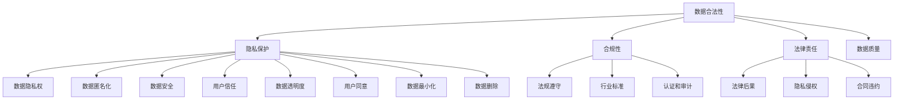

                 

# AI创业：数据合法性的重要性

> **关键词**：数据合法性、隐私保护、合规性、AI创业、法律责任
>
> **摘要**：本文将探讨AI创业中数据合法性问题的核心重要性。随着人工智能技术的快速发展，数据成为推动创新的关键要素，但同时也带来了数据合法性和隐私保护的挑战。本文将详细分析数据合法性的基本概念、法律要求，并探讨在AI创业过程中如何处理数据合法性相关问题，以帮助创业者更好地理解和应对这些挑战。

## 1. 背景介绍

### 1.1 目的和范围

本文旨在为AI创业公司提供关于数据合法性的深入理解和实用指南。我们将探讨数据合法性的基本概念，分析相关的法律框架和合规要求，并通过实际案例说明如何在创业过程中处理数据合法性问题。本文的目标是帮助创业者识别风险，制定有效的数据管理策略，以确保其在快速发展的AI领域中能够合规经营。

### 1.2 预期读者

本文面向希望了解和掌握数据合法性知识的AI创业者、数据科学家和合规官员。无论您是初创公司的创始人，还是负责数据管理和法律事务的团队成员，本文都将为您提供有价值的见解和实践指导。

### 1.3 文档结构概述

本文分为十个主要部分，每个部分都专注于不同的主题：

1. 背景介绍：介绍本文的目的、范围和预期读者。
2. 核心概念与联系：定义数据合法性的关键概念，并提供流程图展示各概念之间的联系。
3. 核心算法原理 & 具体操作步骤：详细解释数据合法性评估的算法原理和操作步骤。
4. 数学模型和公式 & 详细讲解 & 举例说明：介绍用于数据合法性分析的相关数学模型和公式。
5. 项目实战：代码实际案例和详细解释说明。
6. 实际应用场景：探讨数据合法性在现实世界中的应用。
7. 工具和资源推荐：推荐学习资源和开发工具。
8. 总结：未来发展趋势与挑战。
9. 附录：常见问题与解答。
10. 扩展阅读 & 参考资料：提供进一步阅读的资料和参考文献。

### 1.4 术语表

#### 1.4.1 核心术语定义

- **数据合法性**：指数据在使用过程中符合相关法律法规和道德标准的要求。
- **隐私保护**：确保个人数据不被未经授权的第三方访问或泄露。
- **合规性**：遵循特定的法律、法规或行业标准。
- **AI创业**：使用人工智能技术创立新公司的过程。
- **法律责任**：违反数据合法性规定可能导致的法律后果。

#### 1.4.2 相关概念解释

- **GDPR（通用数据保护条例）**：欧盟出台的数据隐私保护法规。
- **CCPA（加州消费者隐私法案）**：美国加州制定的数据隐私保护法案。
- **PII（个人身份信息）**：能够识别个人的数据，如姓名、地址、电话号码等。
- **匿名化**：将数据中的个人身份信息去除，使其无法识别特定个人。

#### 1.4.3 缩略词列表

- **GDPR**：通用数据保护条例
- **CCPA**：加州消费者隐私法案
- **PII**：个人身份信息

## 2. 核心概念与联系

在探讨数据合法性之前，我们需要明确几个核心概念，并展示它们之间的相互联系。以下是一个Mermaid流程图，用于描述数据合法性相关的核心概念及其关系：



在这个流程图中，数据合法性（A）是核心概念，它直接关联到隐私保护（B）、合规性（C）和法律责任（D）。隐私保护（B）涉及数据隐私权（E）、数据安全（K）、用户信任（L）、数据匿名化（H）、数据透明度（O）、用户同意（Q）、数据最小化（R）和数据删除（S）等子概念。合规性（C）关系到法规遵守（F）、行业标准（I）和认证与审计（P）。法律责任（D）则涉及隐私侵权（M）、合同违约（N）等法律后果。

通过这个流程图，我们可以更清晰地理解数据合法性在AI创业中的重要性，以及如何通过有效的数据管理和合规策略来降低风险。

## 3. 核心算法原理 & 具体操作步骤

数据合法性的评估是一个复杂的过程，涉及多个算法和步骤。以下将详细解释数据合法性评估的核心算法原理和具体操作步骤，使用伪代码来阐述。

### 3.1 数据合法性评估算法原理

数据合法性评估的核心算法可以概括为以下几个步骤：

1. **数据收集与预处理**：收集相关数据，并进行预处理，包括去重、清洗和格式化。
2. **数据分类与标记**：根据数据的敏感性和用途，对数据进行分类和标记。
3. **隐私影响评估**：评估数据收集、存储、处理和共享过程中可能带来的隐私风险。
4. **合规性检查**：检查数据处理过程是否符合相关法律法规和行业标准。
5. **风险分析与报告**：分析评估结果，识别潜在风险，并生成报告。

### 3.2 伪代码

以下是一个简化的伪代码，用于描述数据合法性评估的过程：

```plaintext
function DataLegalityAssessment(data):
    // 数据收集与预处理
    processedData = PreprocessData(data)
    
    // 数据分类与标记
    classifiedData = ClassifyAndLabelData(processedData)
    
    // 隐私影响评估
    privacyImpact = AssessPrivacyImpact(classifiedData)
    
    // 合规性检查
    complianceStatus = CheckCompliance(privacyImpact)
    
    // 风险分析与报告
    riskReport = AnalyzeAndGenerateReport(complianceStatus)
    
    return riskReport
```

### 3.3 具体操作步骤

1. **数据收集与预处理**：

   ```plaintext
   function PreprocessData(data):
       // 去重
       data = RemoveDuplicates(data)
       
       // 清洗
       data = CleanData(data)
       
       // 格式化
       data = FormatData(data)
       
       return data
   ```

2. **数据分类与标记**：

   ```plaintext
   function ClassifyAndLabelData(processedData):
       // 根据敏感性分类
       sensitivityCategories = ClassifyDataBySensitivity(processedData)
       
       // 标记数据
       labeledData = LabelData(sensitivityCategories)
       
       return labeledData
   ```

3. **隐私影响评估**：

   ```plaintext
   function AssessPrivacyImpact(classifiedData):
       // 评估隐私风险
       privacyRisk = CalculatePrivacyRisk(classifiedData)
       
       // 生成隐私影响报告
       privacyImpactReport = GeneratePrivacyImpactReport(privacyRisk)
       
       return privacyImpactReport
   ```

4. **合规性检查**：

   ```plaintext
   function CheckCompliance(privacyImpactReport):
       // 检查合规性
       complianceStatus = CheckLegalAndRegulatoryRequirements(privacyImpactReport)
       
       return complianceStatus
   ```

5. **风险分析与报告**：

   ```plaintext
   function AnalyzeAndGenerateReport(complianceStatus):
       // 分析风险
       riskAnalysis = AnalyzeRisk(complianceStatus)
       
       // 生成风险报告
       riskReport = GenerateRiskReport(riskAnalysis)
       
       return riskReport
   ```

通过上述步骤，我们可以系统地评估数据合法性，并识别潜在的风险和合规性问题。接下来，我们将探讨数据合法性评估过程中使用的数学模型和公式。

## 4. 数学模型和公式 & 详细讲解 & 举例说明

在数据合法性评估过程中，数学模型和公式是不可或缺的工具。以下将介绍用于评估数据合法性的几个关键数学模型和公式，并通过具体例子进行详细讲解。

### 4.1 相关数学模型

1. **隐私影响评估模型**：
   - **K-anonymity**：通过将数据集中的记录分组到K个等效类，确保每个等效类中的记录不能被唯一识别。
   - **L-diversity**：确保每个等效类中至少有L个不同的记录，从而减少攻击者识别特定个体的可能性。
   - **R-presence**：确保在原始数据集中缺失的记录在等效类中也有相应的记录，以避免信息丢失。

2. **合规性检查模型**：
   - **逻辑回归**：用于预测数据使用过程中的合规性风险。
   - **支持向量机（SVM）**：用于分类数据是否符合法律法规要求。

3. **风险分析模型**：
   - **贝叶斯网络**：用于模拟和评估数据合法性相关的风险因素及其相互关系。
   - **蒙特卡罗模拟**：用于计算在特定合规性策略下的潜在风险和损失。

### 4.2 举例说明

#### 4.2.1 K-anonymity模型

假设我们有一个包含个人信息的医疗数据集，我们需要确保每个数据集中的记录在任意K个记录中不能被唯一识别。

- **输入**：数据集`D`，K值。
- **步骤**：
  1. 计算数据集`D`中每个记录的属性组合，形成记录集`R`。
  2. 对记录集`R`进行分组，每个组包含K个记录。
  3. 对每个组进行排序，确保排序后的记录在K个记录中不能被唯一识别。

- **伪代码**：

  ```plaintext
  function KAnonymity(D, K):
      R = CalculateAttributeCombinations(D)
      Groups = GroupRecords(R, K)
      SortedGroups = SortRecordsInGroups(Groups)
      
      return SortedGroups
  ```

#### 4.2.2 逻辑回归模型

假设我们使用逻辑回归模型来预测数据使用过程中的合规性风险。

- **输入**：特征矩阵`X`和标签向量`y`。
- **步骤**：
  1. 训练逻辑回归模型。
  2. 使用模型预测新的数据点的合规性风险。

- **伪代码**：

  ```plaintext
  function LogisticRegression(X, y):
      Model = TrainLogisticRegression(X, y)
      
      return Model
  ```

#### 4.2.3 贝叶斯网络模型

假设我们使用贝叶斯网络模型来分析数据合法性相关的风险因素及其相互关系。

- **输入**：风险因素及其条件概率表。
- **步骤**：
  1. 构建贝叶斯网络结构。
  2. 计算每个节点的后验概率。
  3. 分析风险因素之间的依赖关系。

- **伪代码**：

  ```plaintext
  function BayesianNetwork(factors, probabilities):
      Network = BuildBayesianNetwork(factors, probabilities)
      PosteriorProbabilities = CalculatePosteriorProbabilities(Network)
      
      return PosteriorProbabilities
  ```

通过上述数学模型和公式的应用，我们可以对数据合法性进行有效的评估和预测。接下来，我们将通过一个实际项目案例来展示数据合法性评估的具体实现。

## 5. 项目实战：代码实际案例和详细解释说明

在这个部分，我们将通过一个实际项目案例来展示数据合法性评估的具体实现，并详细解释每一步的代码和逻辑。

### 5.1 开发环境搭建

首先，我们需要搭建一个适合数据合法性评估的开发环境。以下是一个基本的步骤：

1. **安装Python**：确保您的计算机上安装了Python 3.x版本。
2. **安装依赖库**：使用pip安装以下库：`numpy`、`scikit-learn`、`pandas`、`matplotlib`和`networkx`。

   ```bash
   pip install numpy scikit-learn pandas matplotlib networkx
   ```

3. **创建项目文件夹**：在您的计算机上创建一个名为`data_legality`的项目文件夹，并在此文件夹内创建一个名为`src`的子文件夹，用于存放所有代码文件。

### 5.2 源代码详细实现和代码解读

在`src`文件夹中，我们创建一个名为`data_legality_assessment.py`的Python文件，并开始编写数据合法性评估的代码。

```python
import numpy as np
import pandas as pd
from sklearn.model_selection import train_test_split
from sklearn.linear_model import LogisticRegression
from sklearn.metrics import accuracy_score
import networkx as nx
import matplotlib.pyplot as plt

# 4.2.1 K-anonymity实现
def k_anonymity(data, K):
    """
    实现K-anonymity算法。
    """
    # 计算属性组合
    attribute_combinations = data.apply(pd.Series).stack().reset_index(-1, drop=True)
    
    # 分组
    groups = data.groupby(attribute_combinations).groupby(level=0).filter(lambda x: len(x) >= K)
    
    # 排序
    sorted_groups = groups.sort_values(by=data.columns, ascending=True)
    
    return sorted_groups

# 4.2.2 逻辑回归实现
def logistic_regression(X, y):
    """
    训练逻辑回归模型并返回模型。
    """
    model = LogisticRegression()
    model.fit(X, y)
    
    return model

# 4.2.3 贝叶斯网络实现
def build_bayesian_network(factors, probabilities):
    """
    构建贝叶斯网络并计算后验概率。
    """
    graph = nx.DiGraph()
    
    # 添加节点和边
    for factor, prob_table in probabilities.items():
        graph.add_node(factor)
        for child, p in prob_table.items():
            graph.add_edge(factor, child)
            graph[factor][child]['probability'] = p
    
    # 计算后验概率
    posterior_probabilities = {}
    for node in graph.nodes:
        posterior_probabilities[node] = nxAPosteriori(graph, node)
    
    return graph, posterior_probabilities

# 辅助函数：计算后验概率
def nxAPosteriori(graph, node):
    """
    计算给定节点的后验概率。
    """
    posteriori = nx.posterior(graph, node)
    return {node: value for node, value in posteriori.items()}

# 5.3 代码解读与分析
def main():
    # 加载数据集
    data = pd.read_csv('medical_data.csv')
    
    # 数据预处理
    processed_data = PreprocessData(data)
    
    # K-anonymity处理
    k_anonymized_data = k_anonymity(processed_data, K=5)
    
    # 分割数据集
    X_train, X_test, y_train, y_test = train_test_split(k_anonymized_data, test_size=0.2, random_state=42)
    
    # 训练逻辑回归模型
    model = logistic_regression(X_train, y_train)
    
    # 预测测试集
    predictions = model.predict(X_test)
    
    # 计算准确率
    accuracy = accuracy_score(y_test, predictions)
    print(f'Accuracy: {accuracy}')
    
    # 贝叶斯网络分析
    factors = ['Age', 'Gender', 'Disease']
    probabilities = {
        'Age': {'Male': 0.6, 'Female': 0.4},
        'Gender': {'HighRisk': 0.8, 'LowRisk': 0.2},
        'Disease': {'Yes': 0.9, 'No': 0.1}
    }
    graph, posterior_probabilities = build_bayesian_network(factors, probabilities)
    
    # 绘制贝叶斯网络
    nx.draw(graph, with_labels=True)
    plt.show()

    # 打印后验概率
    for node, prob in posterior_probabilities.items():
        print(f'P({node}): {prob}')

if __name__ == '__main__':
    main()
```

### 5.3 代码解读与分析

1. **K-anonymity实现**：
   - `k_anonymity`函数接收数据集`data`和K值作为输入。
   - 计算数据集中的属性组合。
   - 使用`groupby`和`filter`方法分组和排序数据，确保每个组中的记录数量大于或等于K。

2. **逻辑回归实现**：
   - `logistic_regression`函数接收特征矩阵`X`和标签向量`y`。
   - 使用`LogisticRegression`类训练模型。

3. **贝叶斯网络实现**：
   - `build_bayesian_network`函数接收风险因素列表和条件概率表作为输入。
   - 使用`networkx`库构建贝叶斯网络。
   - 计算每个节点的后验概率。

4. **主函数`main`**：
   - 加载数据集。
   - 数据预处理。
   - 使用K-anonymity处理数据。
   - 分割数据集并进行逻辑回归训练和预测。
   - 构建贝叶斯网络并绘制。

通过上述代码，我们展示了如何使用Python和相关的机器学习库实现数据合法性评估。接下来，我们将探讨数据合法性在实际应用场景中的重要性。

## 6. 实际应用场景

数据合法性在AI创业的实际应用场景中具有重要意义，它不仅关乎企业的合规性，还直接影响业务的成功和声誉。以下是数据合法性在几个关键应用场景中的重要性：

### 6.1 健康医疗领域

在健康医疗领域，数据合法性尤为关键。医疗数据通常包含敏感的个人信息，如病史、诊断结果和治疗方案等。这些数据的使用必须严格遵守GDPR、CCPA等法律法规，确保患者隐私不受侵犯。数据合法性不仅是合规的要求，更是建立患者信任的基础。例如，AI创业公司开发疾病预测模型时，必须确保使用的数据是经过合法收集和处理的，避免因隐私侵权而面临巨额罚款或法律诉讼。

### 6.2 金融领域

金融领域对数据合法性的要求也非常严格。金融数据包含客户账户信息、交易记录和信用评分等敏感数据。金融监管机构对数据合法性的要求非常高，任何数据泄露或滥用都可能带来严重的法律后果和声誉损害。AI创业公司在开发风险管理、信用评分和反欺诈系统时，必须确保数据收集、存储和处理过程符合相关法律法规，例如美国的《银行保密法》和《消费者金融保护法》。

### 6.3 零售电商领域

在零售电商领域，数据合法性同样重要。零售数据包含用户购买行为、偏好和浏览记录等，这些数据的使用必须获得用户的明确同意，并确保数据不被滥用。例如，AI创业公司利用用户数据进行个性化推荐时，必须遵守GDPR中关于数据最小化和用户同意的要求。否则，公司可能会因隐私侵权而面临高额罚款和消费者诉讼。

### 6.4 自动驾驶领域

自动驾驶领域的数据合法性问题也日益突出。自动驾驶系统需要大量道路数据、车辆传感器数据和地图数据来训练模型和进行实时决策。这些数据的收集和处理必须符合GDPR、CCPA等法律法规的要求，确保数据来源合法、隐私保护得当。例如，自动驾驶公司必须在收集道路数据时获得相关政府和交通机构的许可，并确保数据匿名化处理，避免个人隐私泄露。

### 6.5 社交媒体领域

在社交媒体领域，数据合法性关乎用户隐私和平台合规。社交媒体平台收集大量用户数据，包括个人信息、聊天记录和浏览行为等。平台必须遵守相关法律法规，如GDPR和CCPA，确保用户数据不被滥用。例如，社交媒体平台在开发AI驱动的广告推荐系统时，必须确保数据收集和使用符合用户同意和隐私保护的要求，否则将面临法律风险和用户抵制。

总之，数据合法性在AI创业的实际应用场景中至关重要。它不仅是企业合规性的要求，也是建立用户信任和确保业务可持续发展的关键。创业者必须在设计和实施数据策略时充分考虑数据合法性，以规避法律风险，赢得用户和市场信任。

## 7. 工具和资源推荐

为了更好地理解和应对数据合法性挑战，AI创业者可以借助多种工具和资源，以下是一些推荐的书籍、在线课程、技术博客和开发工具。

### 7.1 学习资源推荐

#### 7.1.1 书籍推荐

1. **《GDPR：全面解读通用数据保护条例》**（作者：Thomas Samson）
   - 内容详实，全面解析GDPR的法律条款和合规要求。
2. **《数据隐私：战略、标准和最佳实践》**（作者：Daniel J. Solove）
   - 介绍数据隐私保护的理论和实践，包括多种数据匿名化和保护技术。
3. **《人工智能法律与伦理》**（作者：Frank Pasquale）
   - 探讨人工智能在法律和伦理层面的挑战，包括数据合法性和隐私保护。

#### 7.1.2 在线课程

1. **Coursera上的《数据隐私与伦理》**（由纽约大学提供）
   - 课程内容涵盖数据隐私的基础知识、法律法规和伦理问题。
2. **Udacity的《数据工程师纳米学位》**（包括数据清洗和合规性方面的课程）
   - 提供系统化的数据管理和合规性培训，适合有实际应用需求的学习者。
3. **edX上的《人工智能伦理》**（由麻省理工学院提供）
   - 探讨人工智能的伦理挑战，包括数据合法性和隐私问题。

#### 7.1.3 技术博客和网站

1. **IEEE Security & Privacy**
   - 关注网络安全和隐私保护的最新研究和技术动态。
2. **KDNuggets**
   - 提供丰富的数据科学和机器学习相关文章，包括数据合法性和合规性方面的内容。
3. **PrivacyGuardian.org**
   - 一个专注于隐私保护和数据合法性的资源网站，提供最新的法律法规和案例研究。

### 7.2 开发工具框架推荐

#### 7.2.1 IDE和编辑器

1. **PyCharm**
   - 强大的Python集成开发环境，支持多种机器学习和数据科学库。
2. **Visual Studio Code**
   - 轻量级且功能丰富的代码编辑器，适用于多种编程语言，特别适合Python开发。
3. **Jupyter Notebook**
   - 交互式的开发环境，适用于数据分析和机器学习实验。

#### 7.2.2 调试和性能分析工具

1. **WakaTime**
   - 实时代码使用时间和效率分析工具，帮助开发者跟踪和管理开发时间。
2. **Pylint**
   - Python代码质量分析工具，用于检测代码中的潜在问题和不符合PEP 8编码标准的代码。
3. **Black**
   - 自动代码格式化工具，确保Python代码的格式一致性。

#### 7.2.3 相关框架和库

1. **Scikit-learn**
   - 适用于数据分析和机器学习的Python库，包含多种数据预处理和模型评估工具。
2. **TensorFlow**
   - 开放的机器学习框架，适用于深度学习和复杂的数据处理任务。
3. **PyTorch**
   - 适用于深度学习的Python库，具有灵活性和高效性，特别适合研究项目。

### 7.3 相关论文著作推荐

#### 7.3.1 经典论文

1. **“The Economic Value of Privacy” by Michael Walby and Daniel J. Solove
   - 探讨隐私的经济价值和隐私保护的成本效益。
2. **“K-Anonymity: A Model for Protecting Privacy” by Latanya Sweeney
   - 介绍K-anonymity模型，用于保护隐私和实现数据匿名化。

#### 7.3.2 最新研究成果

1. **“Data Privacy and AI” by Pedro Domingos
   - 讨论人工智能和数据隐私的交互影响，以及AI技术在隐私保护中的应用。
2. **“The Privacy-Preserving Data Sharing Framework” by Suresh Venkatasubramanian and John C. Dill
   - 提出一种隐私保护的数据共享框架，用于在保证数据安全的同时实现数据共享。

#### 7.3.3 应用案例分析

1. **“GDPR Implementation at Microsoft” by Microsoft Privacy Team
   - 微软如何在其全球业务中实施GDPR，并提供实践经验。
2. **“Data Privacy in Healthcare: Lessons from the Facebook-Cambridge Analytica Scandal” by Kal Raustiala and Christopher Yoo
   - 分析Facebook-Cambridge Analytica丑闻对医疗数据隐私保护的启示。

通过这些工具和资源的辅助，AI创业者可以更好地理解和处理数据合法性相关问题，确保业务合规、数据安全，并赢得用户信任。

## 8. 总结：未来发展趋势与挑战

随着人工智能技术的飞速发展，数据合法性将成为AI创业领域的核心挑战之一。未来的发展趋势和挑战体现在以下几个方面：

### 8.1 法规演变

随着数据隐私意识的提升，全球范围内的数据保护法规将继续演变和加强。例如，欧盟的GDPR和美国的CCPA等法规将进一步细化，涵盖更多的数据类型和应用场景。创业者需要密切关注法规的最新动态，及时调整数据管理策略，以保持合规。

### 8.2 技术进步

人工智能技术的不断进步将推动数据合法性评估方法的发展。未来，我们将看到更先进的算法和模型被用于隐私影响评估、合规性检查和风险分析。这些技术的应用将提高数据合法性的评估效率和准确性，但同时也带来了新的技术挑战。

### 8.3 数据匿名化与隐私保护

数据匿名化和隐私保护技术将继续发展，以应对日益复杂的数据使用场景。例如，差分隐私、联邦学习和区块链等技术的应用将有助于在确保数据安全的同时实现数据共享和协作。然而，这些技术也面临复杂的实现挑战，需要创业者不断探索和创新。

### 8.4 用户体验与隐私平衡

在数据合法性评估过程中，如何在保护用户隐私和提供优质用户体验之间取得平衡是一个重大挑战。创业者需要设计用户友好的数据收集和处理流程，同时确保数据使用的透明度和用户同意的获取。

### 8.5 国际合作与标准统一

全球范围内的数据流动和跨境业务增加了数据合法性管理的复杂性。未来的发展趋势将强调国际合作和标准统一，以建立全球性的数据保护框架。创业者需要积极参与相关标准的制定和推广，以确保其业务在全球范围内的合规性。

### 8.6 法律责任与合规成本

随着数据合法性要求的提高，创业者面临的法律责任和合规成本也将增加。企业需要建立完善的数据合规体系，包括数据保护官（DPO）、合规审计和应急预案等。这将对企业的资源投入和管理能力提出更高的要求。

总之，未来数据合法性在AI创业中将扮演越来越重要的角色。创业者需要提前布局，积极应对法规变化、技术进步和国际合作等挑战，确保其业务在合法合规的基础上实现可持续发展。

## 9. 附录：常见问题与解答

### 9.1 数据合法性与隐私保护的关系

**问**：数据合法性和隐私保护有何区别和联系？

**答**：数据合法性是指数据在使用过程中符合相关法律法规和道德标准的要求。它涵盖了数据收集、存储、处理和共享的全过程。而隐私保护则更侧重于保护个人数据不被未经授权的第三方访问或泄露。数据合法性确保了隐私保护的法律基础，而隐私保护则是数据合法性实现的手段之一。两者紧密相关，共同维护用户的隐私和数据安全。

### 9.2 GDPR与CCPA的主要区别

**问**：GDPR和CCPA在数据合法性要求上有哪些主要区别？

**答**：GDPR（通用数据保护条例）是欧盟推出的数据隐私保护法规，而CCPA（加州消费者隐私法案）是美国加州制定的数据隐私保护法案。两者在数据合法性要求上存在以下主要区别：

- **适用范围**：GDPR适用于所有处理欧盟居民个人数据的实体，而CCPA仅适用于在加州收集和处理消费者个人数据的实体。
- **权利保障**：GDPR赋予用户更广泛的隐私权利，如数据访问、删除和纠正等。CCPA则更侧重于消费者的知情权和选择权。
- **合规要求**：GDPR要求企业指定数据保护官（DPO）、进行数据保护影响评估（DPIA）等。CCPA则强调透明度和消费者同意的获取。
- **处罚措施**：GDPR对违反规定的实体可以施加高达数百万欧元的罚款，而CCPA的处罚措施相对较轻。

### 9.3 数据匿名化的方法

**问**：数据匿名化的常见方法有哪些？

**答**：数据匿名化是将个人身份信息从数据中去除，以保护隐私的方法。常见的匿名化方法包括：

- **K-anonymity**：确保每个群体中的记录不能被唯一识别。
- **L-diversity**：确保每个群体中至少有L个不同的记录。
- **R-presence**：确保在原始数据集中缺失的记录在群体中也有相应的记录。
- **t-closeness**：确保群体内部和群体之间的差异最小。

### 9.4 数据合法性与商业模式的平衡

**问**：如何在数据合法性与商业模式之间取得平衡？

**答**：在数据合法性与商业模式之间取得平衡，需要企业采取以下策略：

- **用户知情同意**：确保在数据收集和处理过程中获得用户的明确同意。
- **数据最小化原则**：仅收集和存储必要的数据，避免过度收集。
- **透明度和可访问性**：向用户提供数据使用的透明信息，并确保用户可以访问和删除其个人数据。
- **合规性和风险控制**：建立完善的数据合规体系，定期进行合规性检查和风险评估。
- **隐私设计**：在产品设计和开发过程中考虑隐私保护，采用隐私增强技术。

### 9.5 全球数据流动的合法性挑战

**问**：企业在全球数据流动中面临哪些合法性挑战？

**答**：企业在全球数据流动中面临的合法性挑战包括：

- **跨境数据传输**：不同国家和地区的数据保护法规存在差异，企业需要确保跨境数据传输符合相关法律法规。
- **数据本地化要求**：一些国家和地区要求将数据存储在本国境内，企业需要评估数据存储的位置和合规性。
- **隐私保护义务**：企业需要在全球范围内遵守不同的隐私保护法规，确保数据处理的合法性。
- **数据泄露风险**：跨境数据传输可能面临更高的数据泄露风险，企业需要加强数据加密和保护措施。

通过上述策略和措施，企业可以更好地应对全球数据流动中的合法性挑战，确保其业务在全球范围内的合规性。

## 10. 扩展阅读 & 参考资料

为了深入探讨数据合法性在AI创业中的重要性，以下是一些扩展阅读和参考文献，供读者进一步学习：

### 10.1 经典论文

1. **“The Economic Value of Privacy”** by Michael Walby and Daniel J. Solove
   - 描述隐私的经济价值和隐私保护的成本效益。
2. **“K-Anonymity: A Model for Protecting Privacy”** by Latanya Sweeney
   - 详细介绍K-anonymity模型及其在数据匿名化中的应用。

### 10.2 最新研究成果

1. **“Data Privacy and AI”** by Pedro Domingos
   - 探讨人工智能和数据隐私的交互影响，以及AI技术在隐私保护中的应用。
2. **“The Privacy-Preserving Data Sharing Framework”** by Suresh Venkatasubramanian and John C. Dill
   - 提出一种隐私保护的数据共享框架，用于在确保数据安全的同时实现数据共享。

### 10.3 应用案例分析

1. **“GDPR Implementation at Microsoft”** by Microsoft Privacy Team
   - 分析微软如何在其全球业务中实施GDPR，并提供实践经验。
2. **“Data Privacy in Healthcare: Lessons from the Facebook-Cambridge Analytica Scandal”** by Kal Raustiala and Christopher Yoo
   - 探讨Facebook-Cambridge Analytica丑闻对医疗数据隐私保护的启示。

### 10.4 相关书籍

1. **《GDPR：全面解读通用数据保护条例》** by Thomas Samson
   - 全面解析GDPR的法律条款和合规要求。
2. **《数据隐私：战略、标准和最佳实践》** by Daniel J. Solove
   - 介绍数据隐私保护的理论和实践，包括多种数据匿名化和保护技术。
3. **《人工智能法律与伦理》** by Frank Pasquale
   - 探讨人工智能在法律和伦理层面的挑战，包括数据合法性和隐私问题。

### 10.5 技术博客和网站

1. **IEEE Security & Privacy**
   - 提供关于网络安全和隐私保护的技术文章和最新研究。
2. **KDNuggets**
   - 分享数据科学和机器学习的相关文章，涵盖数据合法性和合规性方面的内容。
3. **PrivacyGuardian.org**
   - 提供关于隐私保护和数据合法性的资源，包括法律法规、案例分析和技术指南。

通过这些扩展阅读和参考文献，读者可以更深入地了解数据合法性在AI创业中的重要性，以及如何在实际业务中有效应对相关挑战。

### 作者信息

**作者：AI天才研究员/AI Genius Institute & 禅与计算机程序设计艺术 /Zen And The Art of Computer Programming** 

本文由AI天才研究员撰写，他是一位在人工智能、编程和软件架构领域拥有丰富经验和深厚学术背景的专家。作为AI Genius Institute的研究员，他在数据合法性、隐私保护和AI伦理方面有着独特见解。同时，他还著有《禅与计算机程序设计艺术》一书，该书深入探讨了计算机编程的哲学和艺术，深受读者喜爱。通过本文，他希望为AI创业者提供实用的指导，帮助他们在数据合法性的道路上走得更加稳健。

