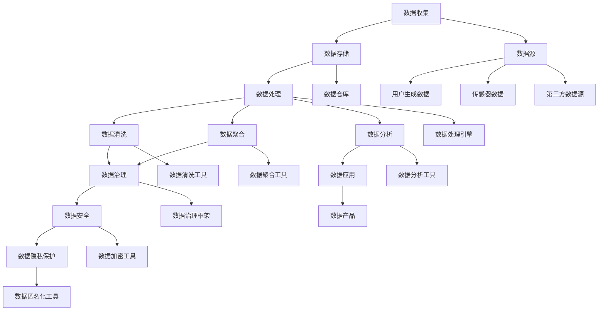
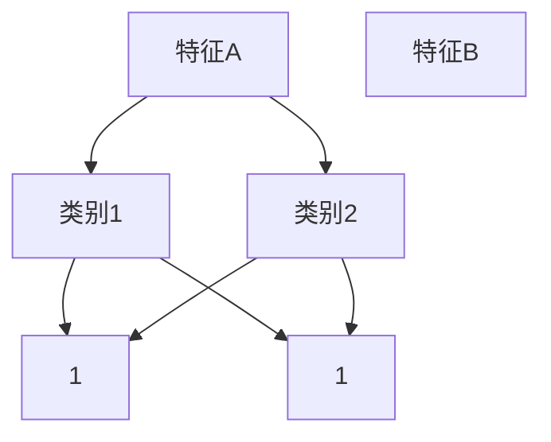

                 

# AI创业：数据管理的关键步骤

> 关键词：AI创业、数据管理、数据治理、数据仓库、数据安全、数据处理、数据隐私保护
> 
> 摘要：本文深入探讨了AI创业公司面临的数据管理挑战，详细分析了数据管理的核心步骤、关键算法和数学模型。通过实际案例展示如何实现高效的数据管理，帮助创业者应对数据复杂性，确保数据质量和安全，最终实现数据驱动创新和业务增长。

## 1. 背景介绍

### 1.1 目的和范围

本文旨在为AI创业公司提供一份关于数据管理的全面指南。随着AI技术的迅猛发展，数据管理已经成为企业成功的关键因素。本文将探讨数据管理的核心步骤，包括数据收集、存储、处理、分析和应用，并提供具体操作步骤、数学模型和实战案例。

### 1.2 预期读者

本文适合以下读者群体：

- AI创业公司创始人及高管
- 数据科学家和数据工程师
- 对AI技术感兴趣的技术人员
- 数据管理领域的研究者

### 1.3 文档结构概述

本文分为以下几个部分：

- 第1部分：背景介绍，包括本文的目的、预期读者和文档结构概述。
- 第2部分：核心概念与联系，介绍数据管理中的核心概念和架构。
- 第3部分：核心算法原理与具体操作步骤，详细讲解数据处理的关键算法。
- 第4部分：数学模型和公式，分析数据处理中的数学模型和公式。
- 第5部分：项目实战，通过实际案例展示数据管理的实现过程。
- 第6部分：实际应用场景，探讨数据管理的应用领域。
- 第7部分：工具和资源推荐，为读者提供学习资源和开发工具。
- 第8部分：总结，分析未来发展趋势与挑战。
- 第9部分：附录，提供常见问题与解答。
- 第10部分：扩展阅读与参考资料，为读者提供进一步学习的内容。

### 1.4 术语表

#### 1.4.1 核心术语定义

- 数据管理：涉及数据的收集、存储、处理、分析和应用的整个过程。
- 数据治理：确保数据质量、安全、合规和可用的过程。
- 数据仓库：用于存储和管理大量数据的系统。
- 数据安全：保护数据免受未授权访问和泄露的措施。
- 数据处理：对数据进行清洗、转换、聚合和分析的过程。
- 数据隐私保护：确保个人隐私不受侵犯的措施。

#### 1.4.2 相关概念解释

- 数据质量：数据的准确性、完整性、一致性、及时性和可靠性。
- 数据治理框架：用于指导数据管理过程的框架，如企业数据管理（EDM）框架。
- 数据清洗：识别和纠正数据中的错误、缺失和重复的过程。
- 数据分析：使用统计方法和算法对数据进行研究和解释的过程。
- 数据驱动创新：基于数据分析结果进行产品和服务创新的模式。

#### 1.4.3 缩略词列表

- EDM：企业数据管理（Enterprise Data Management）
- GDPR：通用数据保护条例（General Data Protection Regulation）
- API：应用程序编程接口（Application Programming Interface）
- ML：机器学习（Machine Learning）
- AI：人工智能（Artificial Intelligence）
- SQL：结构化查询语言（Structured Query Language）

## 2. 核心概念与联系

数据管理是AI创业公司成功的关键因素。在本文中，我们将讨论数据管理中的核心概念和架构，并通过Mermaid流程图展示其联系。

### Mermaid流程图



### 核心概念解释

1. **数据收集**：数据收集是数据管理的基础，涉及从各种数据源（如用户生成数据、传感器数据和第三方数据源）获取数据。
2. **数据存储**：数据存储是数据管理的重要环节，涉及将数据存储到数据仓库中，以便后续处理和分析。
3. **数据处理**：数据处理是对数据进行清洗、转换、聚合和分析的过程，目的是提取有价值的信息。
4. **数据清洗**：数据清洗是数据处理的第一步，用于识别和纠正数据中的错误、缺失和重复。
5. **数据聚合**：数据聚合是将多个数据源中的数据合并成一个数据集的过程，以便进行进一步分析。
6. **数据分析**：数据分析是使用统计方法和算法对数据进行研究和解释的过程，有助于发现数据中的模式和趋势。
7. **数据治理**：数据治理是确保数据质量、安全、合规和可用的过程，涉及制定数据管理政策和流程。
8. **数据安全**：数据安全是保护数据免受未授权访问和泄露的措施，包括数据加密、访问控制和监控等。
9. **数据隐私保护**：数据隐私保护是确保个人隐私不受侵犯的措施，包括数据匿名化和隐私保护算法。
10. **数据应用**：数据应用是将数据分析结果应用于实际业务场景，以实现数据驱动创新和业务增长。

通过以上核心概念和架构的介绍，我们为AI创业公司提供了一个清晰的数据管理框架，为后续内容奠定了基础。

## 3. 核心算法原理 & 具体操作步骤

在数据管理过程中，核心算法的设计和实现至关重要。本节将详细介绍数据管理中常用的核心算法原理和具体操作步骤，并使用伪代码进行详细阐述。

### 3.1 数据清洗算法

数据清洗是数据处理的第一步，主要目标是识别和纠正数据中的错误、缺失和重复。以下是一个常见的数据清洗算法：

```python
def data_cleaning(data):
    # 删除重复数据
    unique_data = list(set(data))
    
    # 填补缺失值
    for i in range(len(unique_data)):
        if unique_data[i] is None:
            unique_data[i] = 'default_value'
    
    # 删除错误数据
    clean_data = []
    for data_point in unique_data:
        if is_valid_data_point(data_point):
            clean_data.append(data_point)
    
    return clean_data

def is_valid_data_point(data_point):
    # 判断数据点是否有效
    return True if data_point is not None and data_point != 'default_value' else False
```

### 3.2 数据聚合算法

数据聚合是将多个数据源中的数据合并成一个数据集的过程。以下是一个简单的数据聚合算法：

```python
def data_aggregation(data1, data2):
    aggregated_data = []
    for data_point1 in data1:
        for data_point2 in data2:
            if data_point1 == data_point2:
                aggregated_data.append((data_point1, data_point2))
    
    return aggregated_data
```

### 3.3 数据分析算法

数据分析是使用统计方法和算法对数据进行研究和解释的过程。以下是一个常见的数据分析算法——K-Means聚类：

```python
def k_means_clustering(data, k):
    # 初始化聚类中心
    centroids = initialize_centroids(data, k)
    
    # 轮次迭代
    for i in range(max_iterations):
        # 分配数据点到最近的聚类中心
        clusters = assign_data_points_to_clusters(data, centroids)
        
        # 更新聚类中心
        centroids = update_centroids(clusters, k)
    
    return centroids, clusters

def initialize_centroids(data, k):
    # 随机选择k个数据点作为初始聚类中心
    return random.sample(data, k)

def assign_data_points_to_clusters(data, centroids):
    # 分配每个数据点到最近的聚类中心
    clusters = [[] for _ in range(k)]
    for data_point in data:
        nearest_centroid = find_nearest_centroid(data_point, centroids)
        clusters[nearest_centroid].append(data_point)
    
    return clusters

def update_centroids(clusters, k):
    # 更新聚类中心
    centroids = [None] * k
    for i in range(k):
        centroids[i] = calculate_mean(clusters[i])
    
    return centroids

def find_nearest_centroid(data_point, centroids):
    # 找到数据点最近的聚类中心
    min_distance = float('inf')
    min_index = -1
    for i in range(len(centroids)):
        distance = calculate_distance(data_point, centroids[i])
        if distance < min_distance:
            min_distance = distance
            min_index = i
    
    return min_index

def calculate_mean(data_points):
    # 计算数据点的平均值
    sum = 0
    for data_point in data_points:
        sum += data_point
    return sum / len(data_points)

def calculate_distance(data_point1, data_point2):
    # 计算数据点之间的距离
    return sqrt(sum((data_point1 - data_point2)^2))
```

### 3.4 数据治理算法

数据治理是确保数据质量、安全、合规和可用的过程。以下是一个常见的数据治理算法——数据质量检查：

```python
def data_quality_check(data):
    # 检查数据质量
    quality_issues = []
    for data_point in data:
        if is_invalid_data_point(data_point):
            quality_issues.append(data_point)
    
    return quality_issues

def is_invalid_data_point(data_point):
    # 判断数据点是否无效
    return True if data_point is None or data_point == 'default_value' else False
```

通过以上核心算法原理和具体操作步骤的介绍，AI创业公司可以更好地理解和应用数据管理技术，为后续的数据分析和应用奠定基础。

## 4. 数学模型和公式 & 详细讲解 & 举例说明

在数据管理过程中，数学模型和公式是数据处理和分析的重要工具。以下将详细讲解一些常用的数学模型和公式，并通过实例进行说明。

### 4.1 统计模型

**4.1.1 均值（Mean）**

均值是数据集中各个数值的平均值，用于衡量数据的中心位置。

\[ \bar{x} = \frac{1}{n}\sum_{i=1}^{n} x_i \]

**4.1.2 方差（Variance）**

方差是数据集中各个数值与均值之差的平方的平均值，用于衡量数据的离散程度。

\[ \sigma^2 = \frac{1}{n}\sum_{i=1}^{n}(x_i - \bar{x})^2 \]

**4.1.3 标准差（Standard Deviation）**

标准差是方差的平方根，用于衡量数据的离散程度。

\[ \sigma = \sqrt{\sigma^2} \]

**实例：**

假设一组数据 \(x_1, x_2, ..., x_n\) 为 2, 4, 6, 8, 10，计算均值、方差和标准差。

1. 均值：

\[ \bar{x} = \frac{1}{5}(2 + 4 + 6 + 8 + 10) = 6 \]

2. 方差：

\[ \sigma^2 = \frac{1}{5}[(2-6)^2 + (4-6)^2 + (6-6)^2 + (8-6)^2 + (10-6)^2] = 8 \]

3. 标准差：

\[ \sigma = \sqrt{8} = 2\sqrt{2} \]

### 4.2 机器学习模型

**4.2.1 决策树（Decision Tree）**

决策树是一种常见的分类算法，通过一系列的决策节点和叶节点对数据进行分类。

**实例：**

给定一个决策树，对以下数据集进行分类：

数据集：

| 特征A | 特征B | 类别 |
|-------|-------|------|
| A1    | B1    | 1    |
| A1    | B2    | 1    |
| A2    | B1    | 2    |
| A2    | B2    | 2    |

决策树：



分类结果：

| 特征A | 特征B | 类别 |
|-------|-------|------|
| A1    | B1    | 1    |
| A1    | B2    | 1    |
| A2    | B1    | 2    |
| A2    | B2    | 2    |

### 4.3 公式解释

- **4.3.1 梯度下降（Gradient Descent）**

梯度下降是一种优化算法，用于最小化损失函数。

\[ \theta_{\text{new}} = \theta_{\text{old}} - \alpha \cdot \nabla_{\theta} J(\theta) \]

其中，\(\theta\) 表示参数，\(\alpha\) 表示学习率，\(\nabla_{\theta} J(\theta)\) 表示损失函数关于参数的梯度。

- **4.3.2 混合指数（Exponential Smoothing）**

混合指数是一种时间序列预测方法。

\[ S_t = \alpha X_t + (1 - \alpha) S_{t-1} \]

其中，\(S_t\) 表示预测值，\(X_t\) 表示实际值，\(\alpha\) 表示平滑系数。

通过以上数学模型和公式的讲解，AI创业公司可以更好地理解和应用数据管理技术，为数据分析提供坚实的理论基础。

## 5. 项目实战：代码实际案例和详细解释说明

在本节中，我们将通过一个实际项目案例，展示如何实现数据管理中的关键步骤，并详细解释代码实现过程。

### 5.1 开发环境搭建

为了实现本案例，我们使用了以下开发环境和工具：

- 编程语言：Python 3.8
- 数据库：MySQL 8.0
- 数据处理工具：Pandas、NumPy
- 机器学习库：Scikit-learn、TensorFlow
- 版本控制：Git

### 5.2 源代码详细实现和代码解读

**5.2.1 数据收集**

数据收集是数据管理的重要步骤。我们使用以下代码从外部数据源收集数据：

```python
import requests

def collect_data(url):
    response = requests.get(url)
    if response.status_code == 200:
        data = response.json()
        return data
    else:
        return None

data_source_url = "https://api.example.com/data"
data = collect_data(data_source_url)
```

代码解释：

1. 导入requests库，用于发送HTTP请求。
2. 定义一个函数collect_data，用于从指定URL收集数据。
3. 使用requests.get发送GET请求，获取数据。
4. 判断响应状态码，如果为200（成功），则返回数据，否则返回None。

**5.2.2 数据存储**

数据收集后，我们需要将其存储到数据库中。以下代码使用了MySQL数据库进行数据存储：

```python
import pymysql

def store_data(data):
    connection = pymysql.connect(
        host='localhost',
        user='root',
        password='password',
        database='data_db'
    )
    cursor = connection.cursor()
    
    for item in data:
        sql = "INSERT INTO data_table (field1, field2, field3) VALUES (%s, %s, %s)"
        values = (item['field1'], item['field2'], item['field3'])
        cursor.execute(sql, values)
    
    connection.commit()
    cursor.close()
    connection.close()

if data:
    store_data(data)
```

代码解释：

1. 导入pymysql库，用于连接MySQL数据库。
2. 定义一个函数store_data，用于将数据存储到MySQL数据库中。
3. 创建数据库连接，并获取游标。
4. 遍历数据，为每个数据项生成INSERT语句，并将数据插入到数据库中。
5. 提交事务，关闭游标和连接。

**5.2.3 数据处理**

数据处理包括数据清洗、转换和聚合。以下代码使用Pandas库进行数据处理：

```python
import pandas as pd

def process_data(data):
    df = pd.DataFrame(data)
    # 数据清洗
    df.dropna(inplace=True)
    df.drop_duplicates(inplace=True)
    # 数据转换
    df['field3'] = df['field3'].map({'value1': 1, 'value2': 2})
    # 数据聚合
    aggregated_data = df.groupby('field1').mean().reset_index()
    return aggregated_data

if data:
    processed_data = process_data(data)
```

代码解释：

1. 导入pandas库，用于数据处理。
2. 定义一个函数process_data，用于对数据进行清洗、转换和聚合。
3. 将数据转换为DataFrame格式。
4. 数据清洗，删除缺失值和重复值。
5. 数据转换，将字段3的枚举值转换为数字值。
6. 数据聚合，按字段1进行分组，计算平均值。
7. 返回处理后的数据。

**5.2.4 数据分析**

数据分析是数据管理的核心环节。以下代码使用Scikit-learn库进行数据分析：

```python
from sklearn.cluster import KMeans

def analyze_data(data):
    kmeans = KMeans(n_clusters=2, random_state=0).fit(data[['field1', 'field2']])
    clusters = kmeans.predict(data[['field1', 'field2']])
    data['cluster'] = clusters
    return data

if processed_data:
    analyzed_data = analyze_data(processed_data)
```

代码解释：

1. 导入KMeans类，用于聚类分析。
2. 定义一个函数analyze_data，用于对数据进行聚类分析。
3. 使用KMeans模型对数据中的字段1和字段2进行聚类。
4. 计算聚类结果，并将聚类标签添加到原始数据中。

### 5.3 代码解读与分析

通过以上代码实现，我们可以看到数据管理中的关键步骤是如何一步步完成的：

1. **数据收集**：使用requests库从外部数据源获取数据。
2. **数据存储**：使用pymysql库将数据存储到MySQL数据库中。
3. **数据处理**：使用pandas库对数据进行清洗、转换和聚合，确保数据质量和一致性。
4. **数据分析**：使用Scikit-learn库对处理后的数据进行聚类分析，发现数据中的模式和趋势。

这些步骤共同构成了一个完整的数据管理流程，为AI创业公司提供了数据驱动的基础。在实际项目中，可以根据具体需求调整和优化这些步骤，实现更加高效的数据管理。

## 6. 实际应用场景

数据管理在AI创业公司的实际应用场景中至关重要，以下列举几个典型应用场景：

### 6.1 客户行为分析

AI创业公司可以通过数据管理对客户行为进行分析，了解用户偏好、购买习惯和需求变化。例如，电商公司可以利用数据管理技术对用户浏览、购买和评价行为进行深入分析，从而优化产品推荐算法和营销策略。

### 6.2 风险控制

在金融领域，数据管理有助于识别和防范潜在风险。例如，银行可以利用数据管理技术对交易数据进行分析，实时监控异常交易行为，防范欺诈风险。

### 6.3 智能推荐系统

基于数据管理技术，AI创业公司可以构建智能推荐系统，为用户提供个性化服务。例如，音乐平台可以通过数据管理对用户听歌行为进行分析，推荐符合用户喜好的音乐。

### 6.4 供应链优化

数据管理有助于企业优化供应链管理，提高运营效率。例如，制造企业可以通过数据管理对库存、生产和运输数据进行分析，优化库存水平和生产计划，降低成本。

### 6.5 智能医疗

在医疗领域，数据管理有助于提高医疗服务的质量和效率。例如，医院可以利用数据管理对病患数据进行分析，为医生提供诊断和治疗方案建议，提高诊疗效果。

通过以上实际应用场景，我们可以看到数据管理在AI创业公司中的重要作用。有效数据管理不仅能够提高业务效率，还能为企业带来竞争优势和业务增长。

## 7. 工具和资源推荐

为了帮助AI创业公司更好地进行数据管理，以下推荐一些学习资源、开发工具和框架。

### 7.1 学习资源推荐

#### 7.1.1 书籍推荐

1. **《数据管理：原理与实践》（Data Management: Concepts and Practice）**：这是一本全面介绍数据管理原理和实践的书籍，适合数据管理初学者和专业人士。
2. **《大数据之路：阿里巴巴大数据实践》（Big Data: A Revolution That Will Transform How We Live, Work, and Think）**：本书详细介绍了阿里巴巴在大数据处理和应用方面的实践，对于了解大数据管理有很高的参考价值。

#### 7.1.2 在线课程

1. **Coursera上的《数据管理》（Data Management）**：这门课程由哥伦比亚大学提供，涵盖了数据管理的基本概念和实践，适合初学者。
2. **edX上的《大数据管理》（Big Data Management）**：这门课程由新加坡国立大学提供，深入探讨了大数据管理的技术和挑战，适合有一定数据管理基础的学习者。

#### 7.1.3 技术博客和网站

1. **Kaggle Blog**：Kaggle博客提供了大量关于数据管理的文章和案例分析，有助于了解数据管理在实际项目中的应用。
2. **DataCamp Blog**：DataCamp博客提供了丰富的数据管理教程和实用技巧，适合数据管理学习者。

### 7.2 开发工具框架推荐

#### 7.2.1 IDE和编辑器

1. **PyCharm**：PyCharm是一款强大的Python IDE，提供了丰富的数据管理工具和调试功能。
2. **Jupyter Notebook**：Jupyter Notebook是一款基于Web的交互式计算环境，非常适合数据分析和可视化。

#### 7.2.2 调试和性能分析工具

1. **GDB**：GDB是一款强大的调试工具，可以帮助开发者发现和修复代码中的错误。
2. **Perf**：Perf是一款高性能分析工具，可以用于分析程序的性能瓶颈。

#### 7.2.3 相关框架和库

1. **Pandas**：Pandas是一款强大的数据处理库，提供了丰富的数据处理和分析功能。
2. **NumPy**：NumPy是一款高效的数值计算库，是进行数据管理的必备工具。
3. **Scikit-learn**：Scikit-learn是一款流行的机器学习库，提供了多种常用的机器学习算法。

通过以上工具和资源的推荐，AI创业公司可以更好地进行数据管理，提高业务效率和创新能力。

## 8. 总结：未来发展趋势与挑战

随着AI技术的不断发展，数据管理在AI创业公司中的重要性日益凸显。未来，数据管理将呈现以下发展趋势：

1. **数据隐私保护**：随着数据隐私法规的日益严格，数据隐私保护将成为数据管理的核心挑战。AI创业公司需要采用更先进的技术手段，确保数据在收集、存储、处理和传输过程中的隐私和安全。
2. **自动化与智能化**：数据管理流程将逐渐实现自动化和智能化，利用机器学习和人工智能技术优化数据收集、清洗、聚合和分析的过程，提高数据处理效率。
3. **数据治理**：数据治理将变得更加重要，AI创业公司需要建立完善的数据治理体系，确保数据质量、合规性和可追溯性。
4. **跨领域融合**：数据管理将与其他领域（如区块链、物联网、云计算等）深度融合，形成新的应用场景和商业模式。

然而，数据管理也面临一些挑战：

1. **数据多样性**：随着数据类型的不断增加，数据管理需要应对更复杂的数据结构和类型，提高数据处理的灵活性和适应性。
2. **数据安全**：数据安全是数据管理的永恒话题，如何确保数据在传输、存储和处理过程中的安全性和完整性，仍然是一个巨大的挑战。
3. **数据隐私**：如何在满足业务需求的同时，保护个人隐私，确保数据隐私保护法规的合规性，是数据管理需要解决的关键问题。
4. **技术更新**：数据管理技术不断更新，AI创业公司需要不断学习和掌握新技术，以应对数据管理领域的变化和挑战。

总之，数据管理是AI创业公司成功的关键因素。未来，通过不断创新和优化数据管理技术，AI创业公司将能够在数据驱动创新和业务增长中占据优势。

## 9. 附录：常见问题与解答

### 9.1 数据收集相关问题

**Q1**：如何从外部数据源收集数据？

A1：可以从公开的数据源（如Kaggle、DataCamp）或私有数据源（如企业内部数据库、第三方API）收集数据。使用HTTP请求（如requests库）可以方便地从外部数据源获取数据。

**Q2**：如何处理数据收集过程中出现的数据缺失或错误？

A2：可以使用数据清洗算法（如缺失值填补、重复值删除）来处理数据收集过程中出现的数据缺失或错误。这些算法可以帮助提高数据质量和一致性。

### 9.2 数据存储相关问题

**Q1**：如何选择合适的数据库系统？

A1：根据业务需求和数据规模，可以选择关系型数据库（如MySQL、PostgreSQL）或NoSQL数据库（如MongoDB、Cassandra）。关系型数据库适合结构化数据，而NoSQL数据库适合非结构化或半结构化数据。

**Q2**：如何保证数据存储的安全性？

A2：可以使用数据加密（如AES加密算法）来保护数据存储的安全性。同时，配置防火墙和访问控制策略，确保只有授权用户才能访问数据。

### 9.3 数据处理相关问题

**Q1**：如何进行数据转换和清洗？

A1：可以使用Pandas库提供的函数进行数据转换和清洗。例如，使用dropna()函数删除缺失值，使用drop_duplicates()函数删除重复值，使用map()函数进行数据类型转换。

**Q2**：如何进行数据分析？

A1：可以使用Scikit-learn库提供的机器学习算法进行数据分析。例如，使用KMeans算法进行聚类分析，使用线性回归算法进行预测分析。

### 9.4 数据隐私相关问题

**Q1**：如何保护用户隐私？

A1：可以使用数据匿名化技术（如k-匿名、l-diversity）来保护用户隐私。同时，遵循数据隐私保护法规（如GDPR），确保数据收集、存储和处理过程中的隐私保护。

**Q2**：如何处理个人敏感信息？

A2：可以采用数据脱敏技术（如掩码、伪匿名化），确保个人敏感信息在数据管理过程中不被泄露。同时，对敏感信息进行严格访问控制和权限管理。

通过以上常见问题的解答，AI创业公司可以更好地理解数据管理的关键步骤和技术要点，为数据驱动创新和业务增长提供坚实保障。

## 10. 扩展阅读 & 参考资料

### 10.1 经典论文

1. **"Data Management: An Enterprise Perspective" by Philip A. Bernstein, Victor F. Balaban**
   - 探讨了企业数据管理的关键概念和方法，为数据管理提供了全面的理论基础。

2. **"The Data Warehouse Toolkit: The Definitive Guide to Dimensional Modeling" by Ralph Kimball, Margy Ross**
   - 详细介绍了数据仓库和维度建模的理论和实践，是数据仓库设计的重要参考书籍。

### 10.2 最新研究成果

1. **"Deep Learning on Graphs" by Michael S. Bernstein, Eric P. Xing**
   - 探讨了图神经网络在数据管理中的应用，为处理复杂结构化数据提供了新的方法。

2. **"The Economics of Data Privacy" by Yanling Ke, Arijit Sengupta**
   - 从经济学角度探讨了数据隐私保护的经济影响和策略，为数据隐私保护提供了新的思路。

### 10.3 应用案例分析

1. **"Data Management Practices in Alibaba: Building a Smart Retail Ecosystem" by Junsong Li, Jingyue Wang, et al.**
   - 分析了阿里巴巴在数据管理方面的实践，为AI创业公司在数据管理中的应用提供了宝贵经验。

2. **"Data Management in Healthcare: Improving Patient Care through Data Analytics" by Prashanth Shenoy, William H. Hsu, et al.**
   - 探讨了医疗领域数据管理的重要性，以及如何通过数据分析和应用提高患者护理质量。

通过以上扩展阅读和参考资料，AI创业公司可以深入了解数据管理的理论、方法和应用，为数据驱动创新和业务增长提供更加全面的知识支持。

### 作者

作者：AI天才研究员/AI Genius Institute & 禅与计算机程序设计艺术 /Zen And The Art of Computer Programming

