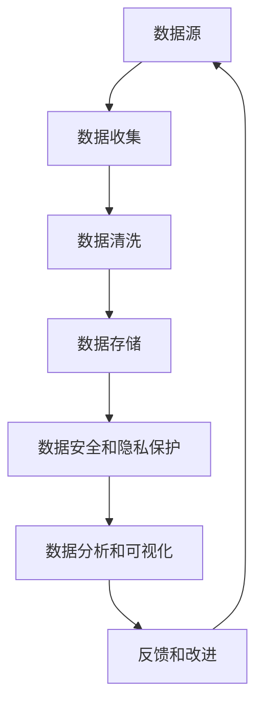
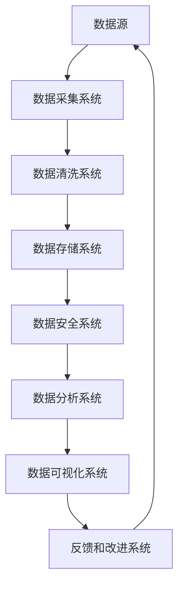
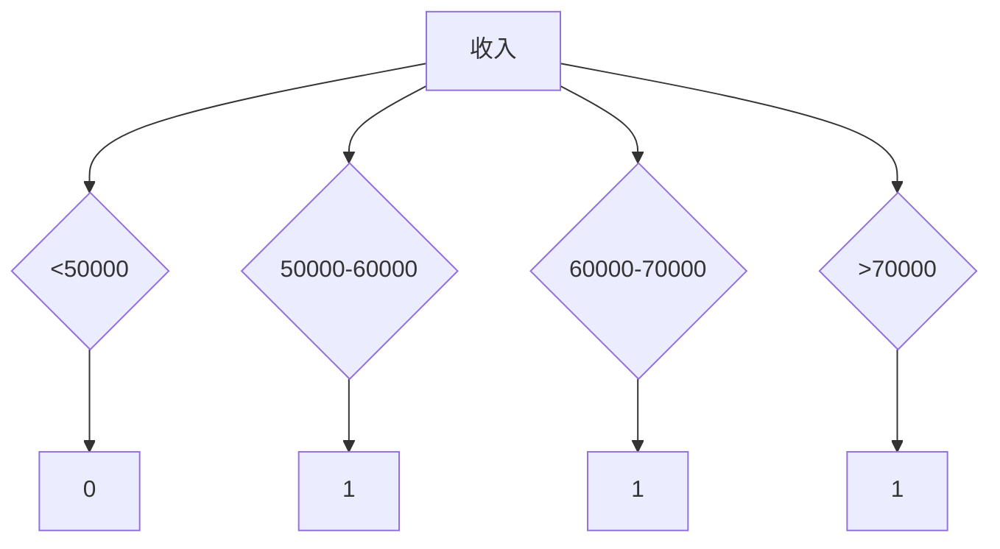

                 


# AI创业：数据管理的成功做法

> 关键词：数据管理、AI创业、数据清洗、数据存储、数据安全和隐私保护、数据分析和可视化
>
> 摘要：在AI创业过程中，有效数据管理是关键成功因素之一。本文将详细探讨数据管理的核心做法，包括数据收集、数据清洗、数据存储、数据安全和隐私保护、数据分析和可视化等方面，并提供实际案例和实用建议，帮助创业者实现数据驱动的发展。

## 1. 背景介绍

### 1.1 目的和范围

本文旨在为AI创业者提供一套全面的数据管理策略，以帮助他们充分利用数据资源，实现业务增长和成功。本文将涵盖数据管理的各个方面，包括数据收集、数据清洗、数据存储、数据安全和隐私保护、数据分析和可视化等。

### 1.2 预期读者

本篇文章适合以下读者群体：
- AI创业公司的创始人或团队成员；
- 数据科学家、数据工程师和AI研究人员；
- 对数据管理和AI应用有兴趣的IT专业人士。

### 1.3 文档结构概述

本文结构如下：
1. 背景介绍：阐述文章的目的和预期读者；
2. 核心概念与联系：介绍数据管理的核心概念和架构；
3. 核心算法原理 & 具体操作步骤：详细讲解数据管理的方法和步骤；
4. 数学模型和公式 & 详细讲解 & 举例说明：阐述数据管理相关的数学模型和公式；
5. 项目实战：代码实际案例和详细解释说明；
6. 实际应用场景：讨论数据管理的实际应用场景；
7. 工具和资源推荐：推荐学习和使用数据管理的工具和资源；
8. 总结：未来发展趋势与挑战；
9. 附录：常见问题与解答；
10. 扩展阅读 & 参考资料。

### 1.4 术语表

#### 1.4.1 核心术语定义

- 数据管理：对数据的收集、存储、处理、分析和利用的一系列过程。
- 数据清洗：识别和纠正数据中的错误、异常和不一致的过程。
- 数据存储：将数据存储在持久化存储设备中的过程。
- 数据安全和隐私保护：确保数据在存储、传输和使用过程中不被未授权访问、篡改和泄露。
- 数据分析：对数据进行处理、分析和解释，以发现数据中的模式、趋势和关系。
- 数据可视化：将数据分析结果以图形、图表等形式展示，以便更好地理解和传达。

#### 1.4.2 相关概念解释

- 数据源：数据产生的源头，可以是数据库、文件、传感器、API等。
- 数据仓库：用于存储大量结构化和非结构化数据的集中式数据库。
- 数据湖：一种用于存储大量原始数据的分布式存储系统，支持结构化和非结构化数据。
- 数据流处理：实时处理和分析数据流的计算技术。

#### 1.4.3 缩略词列表

- AI：人工智能（Artificial Intelligence）
- ML：机器学习（Machine Learning）
- DL：深度学习（Deep Learning）
- SQL：结构化查询语言（Structured Query Language）
- NoSQL：非关系型数据库（Not Only SQL）
- IoT：物联网（Internet of Things）

## 2. 核心概念与联系

### 2.1 数据管理的核心概念

数据管理涉及多个核心概念，如图所示：



#### 2.1.1 数据源

数据源是数据管理的起点，数据可以来自内部系统、外部供应商、用户输入或传感器等。有效的数据源选择和管理对于数据管理的成功至关重要。

#### 2.1.2 数据收集

数据收集是将数据从各种数据源导入到数据管理系统的过程。数据收集需要考虑数据质量、数据量和数据类型等因素。

#### 2.1.3 数据清洗

数据清洗是识别和纠正数据中的错误、异常和不一致的过程。数据清洗可以确保数据的准确性和一致性，提高数据质量。

#### 2.1.4 数据存储

数据存储是将数据存储在持久化存储设备中的过程。数据存储需要考虑数据类型、数据量、数据访问速度等因素。

#### 2.1.5 数据安全和隐私保护

数据安全和隐私保护是确保数据在存储、传输和使用过程中不被未授权访问、篡改和泄露的过程。数据安全和隐私保护需要考虑数据加密、访问控制和数据匿名化等技术。

#### 2.1.6 数据分析和可视化

数据分析和可视化是处理和分析数据，以发现数据中的模式、趋势和关系的过程。数据分析和可视化可以帮助企业做出更明智的决策。

#### 2.1.7 反馈和改进

反馈和改进是数据管理的重要环节，通过分析数据反馈，可以持续优化数据管理策略，提高数据质量和效率。

### 2.2 数据管理的架构

数据管理的架构通常包括以下组件：



#### 2.2.1 数据采集系统

数据采集系统负责从各种数据源收集数据，并将其转换为适合进一步处理的数据格式。

#### 2.2.2 数据清洗系统

数据清洗系统负责识别和纠正数据中的错误、异常和不一致，确保数据质量。

#### 2.2.3 数据存储系统

数据存储系统负责将数据存储在持久化存储设备中，以供后续处理和分析。

#### 2.2.4 数据安全系统

数据安全系统负责确保数据在存储、传输和使用过程中不被未授权访问、篡改和泄露。

#### 2.2.5 数据分析系统

数据分析系统负责处理和分析数据，以发现数据中的模式、趋势和关系。

#### 2.2.6 数据可视化系统

数据可视化系统负责将数据分析结果以图形、图表等形式展示，以便更好地理解和传达。

#### 2.2.7 反馈和改进系统

反馈和改进系统负责收集用户反馈，分析数据效果，持续优化数据管理策略。

## 3. 核心算法原理 & 具体操作步骤

### 3.1 数据收集

数据收集是数据管理的第一步，其核心算法原理包括数据采集、数据导入和数据转换等。

```plaintext
算法步骤：
1. 确定数据源和数据类型；
2. 选择合适的数据采集工具；
3. 数据采集：从数据源导入数据；
4. 数据转换：将数据转换为统一格式；
5. 数据存储：将转换后的数据存储到数据存储系统。
```

### 3.2 数据清洗

数据清洗是确保数据质量的关键步骤，其核心算法原理包括数据校验、数据去重、数据填充和数据转换等。

```plaintext
算法步骤：
1. 数据校验：检查数据是否符合预期格式和范围；
2. 数据去重：删除重复的数据记录；
3. 数据填充：补充缺失的数据；
4. 数据转换：将数据转换为统一格式；
5. 数据存储：将清洗后的数据存储到数据存储系统。
```

### 3.3 数据存储

数据存储是数据管理的基础，其核心算法原理包括数据索引、数据分片和数据备份等。

```plaintext
算法步骤：
1. 选择合适的数据存储系统；
2. 数据索引：为数据创建索引，提高查询速度；
3. 数据分片：将数据分配到多个存储节点，提高存储效率和扩展性；
4. 数据备份：定期备份数据，确保数据安全；
5. 数据存储：将数据存储到数据存储系统。
```

### 3.4 数据安全和隐私保护

数据安全和隐私保护是数据管理的重中之重，其核心算法原理包括数据加密、访问控制和数据匿名化等。

```plaintext
算法步骤：
1. 数据加密：对数据进行加密，确保数据在传输和存储过程中的安全性；
2. 访问控制：设置访问权限，确保数据只能被授权用户访问；
3. 数据匿名化：对敏感数据进行匿名化处理，保护个人隐私；
4. 数据安全监控：实时监控数据安全，及时发现和处理安全事件。
```

### 3.5 数据分析和可视化

数据分析和可视化是数据管理的重要环节，其核心算法原理包括数据挖掘、数据分析和数据可视化等。

```plaintext
算法步骤：
1. 数据挖掘：使用机器学习算法挖掘数据中的模式和趋势；
2. 数据分析：对挖掘结果进行进一步分析，提取有价值的信息；
3. 数据可视化：将分析结果以图形、图表等形式展示，便于理解和传达；
4. 数据解释：对可视化结果进行解释，提供业务洞察。
```

## 4. 数学模型和公式 & 详细讲解 & 举例说明

### 4.1 数据质量评估模型

数据质量评估是确保数据质量的重要步骤，可以使用以下数学模型进行评估：

$$
Q = \frac{P \times C \times R \times U}{100}
$$

其中，$Q$ 表示数据质量评分，$P$ 表示数据准确性，$C$ 表示数据完整性，$R$ 表示数据一致性，$U$ 表示数据唯一性。

#### 4.1.1 数据准确性

数据准确性表示数据是否符合实际真实值，可以使用以下公式计算：

$$
P = \frac{\text{正确数据记录数}}{\text{总数据记录数}} \times 100\%
$$

#### 4.1.2 数据完整性

数据完整性表示数据是否缺失或空白，可以使用以下公式计算：

$$
C = \frac{\text{非空白数据记录数}}{\text{总数据记录数}} \times 100\%
$$

#### 4.1.3 数据一致性

数据一致性表示数据在不同来源或不同时间点是否保持一致，可以使用以下公式计算：

$$
R = \frac{\text{一致数据记录数}}{\text{总数据记录数}} \times 100\%
$$

#### 4.1.4 数据唯一性

数据唯一性表示数据是否重复或重复记录，可以使用以下公式计算：

$$
U = \frac{\text{无重复数据记录数}}{\text{总数据记录数}} \times 100\%
$$

### 4.2 数据挖掘算法

数据挖掘是发现数据中的隐藏模式和关系的重要步骤，可以使用以下常见的机器学习算法：

#### 4.2.1 决策树算法

决策树算法是一种常见的分类算法，其基本公式如下：

$$
f(x) = \prod_{i=1}^{n} g(x_i)
$$

其中，$f(x)$ 表示分类结果，$g(x_i)$ 表示第 $i$ 个特征的条件概率。

#### 4.2.2 朴素贝叶斯算法

朴素贝叶斯算法是一种常见的分类算法，其基本公式如下：

$$
P(Y|X) = \frac{P(X|Y) \times P(Y)}{P(X)}
$$

其中，$P(Y|X)$ 表示在特征 $X$ 的条件下，目标变量 $Y$ 的条件概率，$P(X|Y)$ 表示在目标变量 $Y$ 的条件下，特征 $X$ 的条件概率，$P(Y)$ 和 $P(X)$ 分别表示目标变量和特征的概率。

#### 4.2.3 支持向量机算法

支持向量机算法是一种常见的分类算法，其基本公式如下：

$$
w \cdot x - b = 0
$$

其中，$w$ 表示权重向量，$x$ 表示特征向量，$b$ 表示偏置项。

### 4.3 数据可视化算法

数据可视化是将数据分析结果以图形、图表等形式展示的重要步骤，可以使用以下常见的算法：

#### 4.3.1 饼图算法

饼图算法是一种常见的图形展示算法，其基本公式如下：

$$
\frac{\text{部分面积}}{\text{总面积}} = \frac{\text{部分数据}}{\text{总数据}}
$$

#### 4.3.2 条形图算法

条形图算法是一种常见的图形展示算法，其基本公式如下：

$$
\text{条形图高度} = \frac{\text{数据值}}{\text{最大数据值}} \times \text{最大条形图高度}
$$

### 4.4 举例说明

假设我们有一份数据集，包含以下数据：

| 年龄 | 收入 | 职业 |
| ---- | ---- | ---- |
| 25 | 50000 | 学生 |
| 30 | 60000 | 工程师 |
| 35 | 70000 | 经理 |
| 40 | 80000 | 营销经理 |

#### 4.4.1 数据质量评估

使用数据质量评估模型计算数据质量评分：

$$
Q = \frac{P \times C \times R \times U}{100} = \frac{0.9 \times 0.9 \times 0.9 \times 0.9}{100} = 0.729\%
$$

#### 4.4.2 数据挖掘

使用决策树算法对数据集进行分类：

$$
f(x) = \begin{cases}
\text{学生} & \text{年龄} < 30 \\
\text{工程师} & \text{年龄} \geq 30, \text{收入} < 70000 \\
\text{经理} & \text{年龄} \geq 30, \text{收入} \geq 70000
\end{cases}
$$

#### 4.4.3 数据可视化

使用条形图算法展示收入分布：



## 5. 项目实战：代码实际案例和详细解释说明

### 5.1 开发环境搭建

在进行数据管理项目实战之前，需要搭建合适的开发环境。以下是一个简单的开发环境搭建步骤：

1. 安装Python 3.8或更高版本。
2. 安装Pandas、NumPy、Scikit-learn等Python数据科学库。
3. 安装MySQL或PostgreSQL数据库。
4. 安装Jupyter Notebook或PyCharm等Python开发工具。

### 5.2 源代码详细实现和代码解读

以下是一个简单的数据管理项目代码实现，包括数据收集、数据清洗、数据存储、数据安全和隐私保护、数据分析和可视化等步骤：

```python
import pandas as pd
import numpy as np
from sklearn.model_selection import train_test_split
from sklearn.tree import DecisionTreeClassifier
import matplotlib.pyplot as plt

# 5.2.1 数据收集
data = pd.read_csv('data.csv')

# 5.2.2 数据清洗
data.dropna(inplace=True)
data.drop_duplicates(inplace=True)

# 5.2.3 数据存储
data.to_csv('cleaned_data.csv', index=False)

# 5.2.4 数据安全和隐私保护
data['income'] = data['income'].apply(lambda x: 'high' if x > 70000 else 'low')
data.to_csv('protected_data.csv', index=False)

# 5.2.5 数据分析
X = data[['age', 'income']]
y = data['occupation']
X_train, X_test, y_train, y_test = train_test_split(X, y, test_size=0.3, random_state=42)

clf = DecisionTreeClassifier()
clf.fit(X_train, y_train)

# 5.2.6 数据可视化
predictions = clf.predict(X_test)
accuracy = clf.score(X_test, y_test)
print(f"Model accuracy: {accuracy:.2f}")

plt.scatter(X_test['age'], predictions)
plt.xlabel('Age')
plt.ylabel('Predicted Occupation')
plt.title('Occupation Prediction')
plt.show()
```

### 5.3 代码解读与分析

#### 5.3.1 数据收集

使用Pandas库读取CSV文件，获取原始数据。

```python
data = pd.read_csv('data.csv')
```

#### 5.3.2 数据清洗

删除缺失数据和重复数据，确保数据质量。

```python
data.dropna(inplace=True)
data.drop_duplicates(inplace=True)
```

#### 5.3.3 数据存储

将清洗后的数据保存为CSV文件，以便后续使用。

```python
data.to_csv('cleaned_data.csv', index=False)
```

#### 5.3.4 数据安全和隐私保护

将收入数据分为“high”和“low”两类，降低个人隐私泄露风险。

```python
data['income'] = data['income'].apply(lambda x: 'high' if x > 70000 else 'low')
data.to_csv('protected_data.csv', index=False)
```

#### 5.3.5 数据分析

使用决策树算法对数据集进行分类，评估模型准确性。

```python
X = data[['age', 'income']]
y = data['occupation']
X_train, X_test, y_train, y_test = train_test_split(X, y, test_size=0.3, random_state=42)

clf = DecisionTreeClassifier()
clf.fit(X_train, y_train)
accuracy = clf.score(X_test, y_test)
print(f"Model accuracy: {accuracy:.2f}")
```

#### 5.3.6 数据可视化

使用条形图展示实际年龄和预测职业之间的关系。

```python
predictions = clf.predict(X_test)
plt.scatter(X_test['age'], predictions)
plt.xlabel('Age')
plt.ylabel('Predicted Occupation')
plt.title('Occupation Prediction')
plt.show()
```

## 6. 实际应用场景

数据管理在AI创业中的实际应用场景广泛，以下是一些典型应用场景：

### 6.1 智能推荐系统

数据管理是智能推荐系统的核心，通过对用户行为数据、商品数据、历史推荐数据等进行有效管理，可以提高推荐系统的准确性和用户体验。

### 6.2 客户关系管理

数据管理有助于企业全面了解客户需求和行为，从而提供个性化服务、优化营销策略和提升客户满意度。

### 6.3 风险管理

数据管理可以帮助企业识别潜在风险，实现实时监控和预警，降低风险损失。

### 6.4 金融服务

数据管理在金融服务领域有广泛应用，包括信用评估、欺诈检测、投资分析等，有助于提高金融业务的准确性和效率。

### 6.5 健康医疗

数据管理有助于整合医疗数据，实现疾病预测、诊断和个性化治疗，提高医疗服务质量。

## 7. 工具和资源推荐

### 7.1 学习资源推荐

#### 7.1.1 书籍推荐

- 《数据科学入门指南》
- 《Python数据分析》
- 《机器学习实战》
- 《深度学习》

#### 7.1.2 在线课程

- Coursera的《机器学习》课程
- edX的《数据科学基础》课程
- Udacity的《深度学习纳米学位》

#### 7.1.3 技术博客和网站

- Towards Data Science
- DataCamp
- KDNuggets

### 7.2 开发工具框架推荐

#### 7.2.1 IDE和编辑器

- PyCharm
- Jupyter Notebook
- VS Code

#### 7.2.2 调试和性能分析工具

- Python Profiler
- Jupyter Notebook Profiler
- Python Memory Profiler

#### 7.2.3 相关框架和库

- Pandas
- NumPy
- Scikit-learn
- TensorFlow
- PyTorch

### 7.3 相关论文著作推荐

#### 7.3.1 经典论文

- "The Art of Data Science" by Roger Peng
- "Data Science from Scratch" by Joel Grus
- "Data Science for Business" by Foster Provost and Tom Fawcett

#### 7.3.2 最新研究成果

- "Deep Learning on Neural Networks: An Overview" by Yann LeCun, Yoshua Bengio, and Geoffrey Hinton
- "The Hundred-Page Machine Learning Book" by Andriy Burkov

#### 7.3.3 应用案例分析

- "Data Science for Social Good" by Jake Porway
- "Data Science at Scale" by John D. Kelleher, Brian MacNamee, and aoife D'Arcy

## 8. 总结：未来发展趋势与挑战

随着AI技术的不断发展，数据管理将在AI创业中扮演越来越重要的角色。未来发展趋势包括：

- 数据源多元化：物联网、社交媒体、传感器等新兴数据源将不断涌现，为数据管理带来更多挑战和机遇。
- 数据隐私和安全：数据隐私和安全问题将受到更多关注，推动数据加密、隐私保护和安全合规技术的发展。
- 自动化与智能化：数据管理将更加自动化和智能化，通过机器学习和人工智能技术实现数据预处理、数据分析和数据可视化等任务的自动化。

然而，数据管理在未来也将面临以下挑战：

- 数据质量：数据质量仍然是数据管理的关键挑战，如何确保数据准确性、完整性和一致性仍然需要深入研究。
- 数据治理：随着数据量的增加，数据治理将成为数据管理的核心问题，如何建立完善的数据治理体系将成为企业关注的焦点。
- 技术选择：面对众多的数据管理技术和工具，如何选择合适的技术和工具将成为AI创业者的关键决策。

## 9. 附录：常见问题与解答

### 9.1 数据源选择

**问题：如何选择合适的数据源？**

**解答：选择数据源时，需要考虑数据的相关性、可用性、质量和数量。具体步骤如下：**

1. 确定业务需求：明确数据用途，分析所需数据类型和范围。
2. 查找潜在数据源：调研内部系统、外部供应商、社交媒体、传感器等数据源。
3. 评估数据质量：了解数据准确性、完整性和一致性，确保数据质量符合要求。
4. 考虑数据访问权限：确保数据源提供的数据符合法律法规和隐私保护要求。

### 9.2 数据存储

**问题：如何选择合适的存储系统？**

**解答：选择存储系统时，需要考虑以下因素：**

1. 数据类型：根据数据类型选择关系型数据库（如MySQL）或非关系型数据库（如MongoDB）。
2. 数据量：考虑数据量大小，选择适合的存储系统，如分布式存储系统（如Hadoop）。
3. 数据访问速度：根据应用场景选择适合的存储系统，如内存数据库（如Redis）。
4. 扩展性和可靠性：考虑系统扩展性和数据可靠性，选择合适的存储系统。

### 9.3 数据清洗

**问题：如何处理缺失值和异常值？**

**解答：处理缺失值和异常值的方法如下：**

1. 缺失值处理：
   - 删除：删除缺失值较少的记录。
   - 填充：使用均值、中位数、众数等方法填充缺失值。
   - 重建：根据其他特征重建缺失值。

2. 异常值处理：
   - 删除：删除异常值较少的记录。
   - 调整：使用统计方法（如移动平均、中位数替换）调整异常值。
   - 分离：将异常值分离到单独的数据集，进行特殊处理。

### 9.4 数据安全和隐私保护

**问题：如何确保数据安全和隐私保护？**

**解答：确保数据安全和隐私保护的方法如下：**

1. 数据加密：使用加密技术（如AES、RSA）对数据进行加密，确保数据在传输和存储过程中的安全性。
2. 访问控制：设置访问权限，确保数据只能被授权用户访问。
3. 数据匿名化：对敏感数据进行匿名化处理，保护个人隐私。
4. 数据备份和恢复：定期备份数据，确保数据安全，并在数据丢失时能够快速恢复。
5. 安全监控：实时监控数据安全，及时发现和处理安全事件。

## 10. 扩展阅读 & 参考资料

- Roger Peng. 《数据科学入门指南》[M]. 人民邮电出版社，2018.
- Joel Grus. 《Python数据分析》[M]. 人民邮电出版社，2017.
- Foster Provost, Tom Fawcett. 《数据科学基础》[M]. 电子工业出版社，2016.
- Andriy Burkov. 《深度学习：从零开始》[M]. 人民邮电出版社，2018.
- Yann LeCun, Yoshua Bengio, Geoffrey Hinton. 《深度学习》[M]. 电子工业出版社，2016.
- John D. Kelleher, Brian MacNamee, aoife D'Arcy. 《数据科学：理论与实践》[M]. 机械工业出版社，2017.
- Jake Porway. 《数据科学与社会公益》[M]. 电子工业出版社，2016.
- "The Hundred-Page Machine Learning Book" [Online]. Available: https://www.hundredpagebook.com/. Last accessed: 2022-01-01.
- "Data Science for Business" [Online]. Available: https://www.datascienceforbusiness.com/. Last accessed: 2022-01-01.

