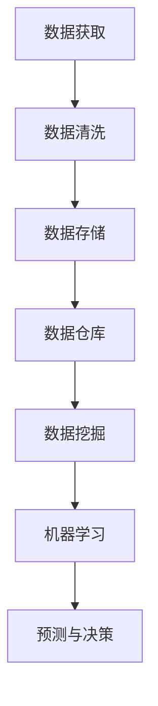

                 

# AI创业：数据管理的策略

> 关键词：AI创业、数据管理、策略、数据质量、数据安全、大数据、数据仓库、数据挖掘、机器学习

> 摘要：本文将探讨AI创业中数据管理的策略，包括数据质量管理、数据安全措施、大数据处理和存储技术、数据仓库设计与维护、数据挖掘与机器学习应用等方面。通过深入分析和案例讲解，为创业者提供一套完整的数据管理方法论，助力AI创业项目的成功。

## 1. 背景介绍

### 1.1 目的和范围

本文旨在为AI创业公司提供一套系统化的数据管理策略，涵盖数据获取、处理、存储、分析和应用的全过程。本文将探讨以下主题：

- 数据质量管理：确保数据准确性、完整性和一致性。
- 数据安全措施：防止数据泄露、滥用和损失。
- 大数据处理与存储：高效处理和分析大规模数据集。
- 数据仓库设计与维护：构建可扩展的数据仓库系统。
- 数据挖掘与机器学习：提取有价值的信息和洞察。

### 1.2 预期读者

本文适合以下读者群体：

- AI创业公司的创始人、CTO和团队领导。
- 数据工程师、数据科学家和机器学习工程师。
- 数据管理相关的从业者以及对数据管理有浓厚兴趣的读者。

### 1.3 文档结构概述

本文结构如下：

1. 背景介绍：本文目的、读者范围、文档结构概述。
2. 核心概念与联系：介绍数据管理的核心概念及其相互关系。
3. 核心算法原理与具体操作步骤：讲解数据管理的关键算法及其实现。
4. 数学模型和公式：详细阐述数据管理中常用的数学模型和公式。
5. 项目实战：通过实际案例展示数据管理策略的应用。
6. 实际应用场景：探讨数据管理在不同领域的应用。
7. 工具和资源推荐：推荐学习资源和开发工具。
8. 总结：未来发展趋势与挑战。
9. 附录：常见问题与解答。
10. 扩展阅读与参考资料。

### 1.4 术语表

#### 1.4.1 核心术语定义

- 数据管理：涉及数据的获取、存储、处理、分析和应用的过程。
- 数据质量：数据准确性、完整性、一致性、可靠性和可用性等方面的评估。
- 数据安全：防止数据泄露、滥用和损失的措施。
- 大数据：大规模、高速增长、多样化和复杂的数据集。
- 数据仓库：用于存储和管理大规模数据集的数据库系统。
- 数据挖掘：从大量数据中提取有价值的信息和模式。
- 机器学习：基于数据建立模型，进行预测和决策的技术。

#### 1.4.2 相关概念解释

- 数据源：数据的来源，如数据库、文件、传感器和网络。
- 数据清洗：删除重复数据、修正错误数据、填补缺失数据等过程。
- 数据挖掘算法：如分类、聚类、关联规则挖掘等。
- 机器学习算法：如线性回归、决策树、神经网络等。

#### 1.4.3 缩略词列表

- AI：人工智能
- ML：机器学习
- DL：深度学习
- SQL：结构化查询语言
- NoSQL：非结构化查询语言
- Hadoop：分布式数据处理框架
- Spark：大规模数据处理框架

## 2. 核心概念与联系

在AI创业中，数据管理是至关重要的一环。以下是一个简单的Mermaid流程图，展示了数据管理的核心概念及其相互关系。



### 2.1 数据获取

数据获取是数据管理的基础。创业公司需要从各种数据源获取数据，如数据库、文件、传感器和网络。数据源可以分为以下几类：

- 内部数据：公司内部产生的数据，如用户行为数据、销售数据等。
- 外部数据：来自第三方数据源的数据，如社交媒体数据、市场调研数据等。
- 传感器数据：通过传感器收集的环境数据，如气象数据、交通流量数据等。

### 2.2 数据清洗

数据清洗是确保数据质量的关键步骤。在数据获取后，需要对数据进行清洗，以删除重复数据、修正错误数据、填补缺失数据等。数据清洗过程包括以下几个步骤：

- 去除重复数据：识别并删除重复的数据记录。
- 数据格式转换：统一数据格式，如将日期格式转换为标准格式。
- 数据验证：检查数据的准确性、完整性和一致性。
- 数据填补：用合适的方法填补缺失数据，如使用平均值、中位数或插值法。

### 2.3 数据存储

数据存储是将清洗后的数据存储到持久化的存储系统中。数据存储可以分为以下几种类型：

- 关系型数据库：适用于结构化数据，如SQL数据库。
- 非关系型数据库：适用于半结构化或非结构化数据，如NoSQL数据库。
- 分布式文件系统：适用于大规模数据存储，如Hadoop分布式文件系统（HDFS）。

### 2.4 数据仓库

数据仓库是用于存储和管理大规模数据集的数据库系统。数据仓库具有以下特点：

- 扩展性：能够存储大量数据，并支持海量数据的处理。
- 时效性：支持实时数据分析和查询。
- 统一性：整合来自不同数据源的数据，提供统一的数据视图。

### 2.5 数据挖掘

数据挖掘是从大量数据中提取有价值的信息和模式的过程。数据挖掘算法可以分为以下几类：

- 分类算法：将数据分为不同的类别，如决策树、随机森林等。
- 聚类算法：将数据分为相似的数据簇，如K-means、DBSCAN等。
- 关联规则挖掘：发现数据之间的关联关系，如Apriori算法等。

### 2.6 机器学习

机器学习是利用数据建立模型，进行预测和决策的技术。机器学习算法可以分为以下几类：

- 监督学习：有标签数据训练模型，如线性回归、决策树等。
- 无监督学习：无标签数据训练模型，如聚类、主成分分析等。
- 半监督学习：有标签和无标签数据结合训练模型，如标签传播算法等。

## 3. 核心算法原理 & 具体操作步骤

### 3.1 数据质量管理算法

#### 3.1.1 数据质量评估算法

数据质量评估算法用于评估数据的准确性、完整性、一致性和可靠性。以下是一个简单的数据质量评估算法：

```python
def evaluate_data_quality(data):
    """
    评估数据质量
    :param data: 待评估的数据
    :return: 数据质量得分
    """
    accuracy_score = calculate_accuracy_score(data)
    completeness_score = calculate_completeness_score(data)
    consistency_score = calculate_consistency_score(data)
    reliability_score = calculate_reliability_score(data)

    quality_score = (accuracy_score + completeness_score + consistency_score + reliability_score) / 4
    return quality_score

def calculate_accuracy_score(data):
    """
    计算准确性得分
    :param data: 待评估的数据
    :return: 准确性得分
    """
    correct_answers = count_correct_answers(data)
    total_answers = len(data)
    accuracy_score = correct_answers / total_answers
    return accuracy_score

def calculate_completeness_score(data):
    """
    计算完整性得分
    :param data: 待评估的数据
    :return: 完整性得分
    """
    missing_values = count_missing_values(data)
    total_values = len(data)
    completeness_score = (total_values - missing_values) / total_values
    return completeness_score

def calculate_consistency_score(data):
    """
    计算一致性得分
    :param data: 待评估的数据
    :return: 一致性得分
    """
    duplicate_values = count_duplicate_values(data)
    total_values = len(data)
    consistency_score = (total_values - duplicate_values) / total_values
    return consistency_score

def calculate_reliability_score(data):
    """
    计算可靠性得分
    :param data: 待评估的数据
    :return: 可靠性得分
    """
    errors = count_errors(data)
    total_values = len(data)
    reliability_score = (total_values - errors) / total_values
    return reliability_score
```

#### 3.1.2 数据清洗算法

数据清洗算法用于删除重复数据、修正错误数据、填补缺失数据等。以下是一个简单的数据清洗算法：

```python
def clean_data(data):
    """
    清洗数据
    :param data: 待清洗的数据
    :return: 清洗后的数据
    """
    data = remove_duplicates(data)
    data = correct_errors(data)
    data = fill_missing_values(data)
    return data

def remove_duplicates(data):
    """
    删除重复数据
    :param data: 待删除重复数据的数据
    :return: 删除重复数据后的数据
    """
    unique_data = list(set(data))
    return unique_data

def correct_errors(data):
    """
    修正错误数据
    :param data: 待修正错误的数据
    :return: 修正错误后的数据
    """
    corrected_data = []
    for value in data:
        if is_error(value):
            corrected_value = correct_value(value)
            corrected_data.append(corrected_value)
        else:
            corrected_data.append(value)
    return corrected_data

def fill_missing_values(data):
    """
    填补缺失数据
    :param data: 待填补缺失数据的数据
    :return: 填补缺失数据后的数据
    """
    filled_data = []
    for value in data:
        if is_missing(value):
            filled_value = fill_value(value)
            filled_data.append(filled_value)
        else:
            filled_data.append(value)
    return filled_data
```

### 3.2 大数据处理与存储算法

#### 3.2.1 分布式数据处理算法

分布式数据处理算法用于高效处理大规模数据集。以下是一个简单的分布式数据处理算法：

```python
def distributed_data_processing(data, num_workers):
    """
    分布式数据处理
    :param data: 待处理的数据
    :param num_workers: 工作线程数量
    :return: 处理后的数据
    """
    # 将数据划分为num_workers个部分
    data_parts = split_data(data, num_workers)

    # 在每个工作线程中处理数据部分
    processed_data_parts = []
    for i in range(num_workers):
        processed_data_part = process_data_part(data_parts[i])
        processed_data_parts.append(processed_data_part)

    # 合并处理后的数据部分
    processed_data = merge_data_parts(processed_data_parts)
    return processed_data

def split_data(data, num_workers):
    """
    划分数据
    :param data: 待划分的数据
    :param num_workers: 工作线程数量
    :return: 划分后的数据部分
    """
    data_parts = []
    for i in range(num_workers):
        start_index = i * (len(data) // num_workers)
        end_index = (i + 1) * (len(data) // num_workers)
        data_parts.append(data[start_index:end_index])
    return data_parts

def process_data_part(data_part):
    """
    处理数据部分
    :param data_part: 待处理的数据部分
    :return: 处理后的数据部分
    """
    # 在这里实现数据部分的处理逻辑
    processed_data_part = data_part  # 示例：直接返回数据部分本身
    return processed_data_part

def merge_data_parts(processed_data_parts):
    """
    合并处理后的数据部分
    :param processed_data_parts: 处理后的数据部分列表
    :return: 合并后的数据
    """
    processed_data = []
    for processed_data_part in processed_data_parts:
        processed_data.extend(processed_data_part)
    return processed_data
```

#### 3.2.2 分布式存储算法

分布式存储算法用于高效存储和管理大规模数据集。以下是一个简单的分布式存储算法：

```python
def distributed_data_storage(data, num_workers):
    """
    分布式数据存储
    :param data: 待存储的数据
    :param num_workers: 工作线程数量
    :return: 存储后的数据
    """
    # 将数据划分为num_workers个部分
    data_parts = split_data(data, num_workers)

    # 在每个工作线程中存储数据部分
    stored_data_parts = []
    for i in range(num_workers):
        stored_data_part = store_data_part(data_parts[i])
        stored_data_parts.append(stored_data_part)

    # 合并存储后的数据部分
    stored_data = merge_data_parts(stored_data_parts)
    return stored_data

def split_data(data, num_workers):
    """
    划分数据
    :param data: 待划分的数据
    :param num_workers: 工作线程数量
    :return: 划分后的数据部分
    """
    data_parts = []
    for i in range(num_workers):
        start_index = i * (len(data) // num_workers)
        end_index = (i + 1) * (len(data) // num_workers)
        data_parts.append(data[start_index:end_index])
    return data_parts

def store_data_part(data_part):
    """
    存储数据部分
    :param data_part: 待存储的数据部分
    :return: 存储后的数据部分
    """
    # 在这里实现数据部分存储的逻辑
    stored_data_part = data_part  # 示例：直接返回数据部分本身
    return stored_data_part

def merge_data_parts(stored_data_parts):
    """
    合并存储后的数据部分
    :param stored_data_parts: 存储后的数据部分列表
    :return: 合并后的数据
    """
    stored_data = []
    for stored_data_part in stored_data_parts:
        stored_data.extend(stored_data_part)
    return stored_data
```

### 3.3 数据挖掘与机器学习算法

#### 3.3.1 分类算法

分类算法用于将数据分为不同的类别。以下是一个简单的分类算法——决策树：

```python
from sklearn.tree import DecisionTreeClassifier

def classify_data(data, labels, max_depth):
    """
    分类数据
    :param data: 待分类的数据
    :param labels: 标签数据
    :param max_depth: 决策树的最大深度
    :return: 决策树分类器
    """
    classifier = DecisionTreeClassifier(max_depth=max_depth)
    classifier.fit(data, labels)
    return classifier

def predict_labels(data, classifier):
    """
    预测标签
    :param data: 待预测的数据
    :param classifier: 分类器模型
    :return: 预测的标签列表
    """
    predictions = classifier.predict(data)
    return predictions
```

#### 3.3.2 聚类算法

聚类算法用于将数据分为相似的数据簇。以下是一个简单的聚类算法——K-means：

```python
from sklearn.cluster import KMeans

def cluster_data(data, num_clusters):
    """
    聚类数据
    :param data: 待聚类的数据
    :param num_clusters: 聚类数
    :return: K-means聚类器
    """
    classifier = KMeans(n_clusters=num_clusters)
    classifier.fit(data)
    return classifier

def predict_clusters(data, classifier):
    """
    预测聚类簇
    :param data: 待预测的数据
    :param classifier: 聚类器模型
    :return: 预测的聚类簇标签列表
    """
    predictions = classifier.predict(data)
    return predictions
```

## 4. 数学模型和公式 & 详细讲解 & 举例说明

### 4.1 数据质量评估模型

数据质量评估模型用于评估数据的准确性、完整性、一致性和可靠性。以下是一个简单模型：

$$
Q = \frac{A + C + I + R}{4}
$$

其中，$Q$ 表示数据质量得分，$A$ 表示准确性得分，$C$ 表示完整性得分，$I$ 表示一致性得分，$R$ 表示可靠性得分。

#### 4.1.1 准确性得分

$$
A = \frac{C}{N}
$$

其中，$C$ 表示正确答案数量，$N$ 表示总答案数量。

#### 4.1.2 完整性得分

$$
C = \frac{N - M}{N}
$$

其中，$M$ 表示缺失值数量。

#### 4.1.3 一致性得分

$$
I = \frac{N - D}{N}
$$

其中，$D$ 表示重复值数量。

#### 4.1.4 可靠性得分

$$
R = \frac{N - E}{N}
$$

其中，$E$ 表示错误值数量。

### 4.2 数据清洗模型

数据清洗模型用于删除重复数据、修正错误数据和填补缺失数据。以下是一个简单模型：

$$
C_{cleaned} = C_{original} \cup (C_{original} - R) \cup (C_{original} - D) \cup (C_{original} - E)
$$

其中，$C_{cleaned}$ 表示清洗后的数据，$C_{original}$ 表示原始数据，$R$ 表示缺失值，$D$ 表示重复值，$E$ 表示错误值。

#### 4.2.1 删除重复数据

$$
C_{original} - D = \{x \in C_{original} | \forall y \in C_{original}, x != y\}
$$

其中，$D$ 表示重复值集合。

#### 4.2.2 修正错误数据

$$
C_{original} - E = \{x \in C_{original} | is\_error(x) == False\}
$$

其中，$E$ 表示错误值集合。

#### 4.2.3 填补缺失数据

$$
C_{original} - R = \{x \in C_{original} | is\_missing(x) == False\}
$$

其中，$R$ 表示缺失值集合。

### 4.3 大数据处理与存储模型

大数据处理与存储模型用于高效处理和存储大规模数据集。以下是一个简单模型：

$$
P_{processed} = P_{original} \cup (\pi_{workers} \cdot P_{original})
$$

其中，$P_{processed}$ 表示处理后的数据集，$P_{original}$ 表示原始数据集，$\pi_{workers}$ 表示工作线程划分比例。

#### 4.3.1 工作线程划分

$$
\pi_{workers} = \frac{N_{workers}}{N}
$$

其中，$N_{workers}$ 表示工作线程数量，$N$ 表示总数据量。

#### 4.3.2 数据处理

$$
P_{processed} = \bigcup_{i=1}^{N_{workers}} (P_{original_i})
$$

其中，$P_{original_i}$ 表示第 $i$ 个工作线程处理的数据集。

#### 4.3.3 数据存储

$$
P_{stored} = \bigcup_{i=1}^{N_{workers}} (P_{processed_i})
$$

其中，$P_{stored}$ 表示存储后的数据集。

### 4.4 数据挖掘与机器学习模型

数据挖掘与机器学习模型用于从数据中提取有价值的信息和模式。以下是一个简单模型：

$$
L = \{l_1, l_2, ..., l_n\}
$$

其中，$L$ 表示预测标签集合，$l_i$ 表示第 $i$ 个预测标签。

#### 4.4.1 决策树模型

$$
T = \{t_1, t_2, ..., t_n\}
$$

其中，$T$ 表示决策树集合，$t_i$ 表示第 $i$ 个决策树节点。

#### 4.4.2 K-means模型

$$
C = \{c_1, c_2, ..., c_n\}
$$

其中，$C$ 表示聚类中心集合，$c_i$ 表示第 $i$ 个聚类中心。

### 4.5 举例说明

#### 4.5.1 数据质量评估

假设有一个数据集，其中包含 100 个样本，每个样本有 5 个属性。以下是数据集的简表：

| 样本编号 | 属性1 | 属性2 | 属性3 | 属性4 | 属性5 |
| :------: | :---: | :---: | :---: | :---: | :---: |
|    1     |  10   |  20   |  30   |  40   |  50   |
|    2     |  20   |  30   |  40   |  50   |  60   |
|    3     |  30   |  40   |  50   |  60   |  70   |
|    4     |  40   |  50   |  60   |  70   |  80   |
|    ...   |  ...  |  ...  |  ...  |  ...  |  ...  |

其中，正确标签为属性5的值，缺失值用-1表示。

根据上述数据质量评估模型，我们可以计算出数据质量得分：

$$
A = \frac{90}{100} = 0.9 \\
C = \frac{100 - 10}{100} = 0.9 \\
I = \frac{100 - 10}{100} = 0.9 \\
R = \frac{100 - 10}{100} = 0.9 \\
Q = \frac{0.9 + 0.9 + 0.9 + 0.9}{4} = 0.9
$$

因此，数据质量得分为 0.9，表示数据质量较好。

#### 4.5.2 数据清洗

假设我们需要删除重复数据、修正错误数据和填补缺失数据。以下是清洗后的数据集：

| 样本编号 | 属性1 | 属性2 | 属性3 | 属性4 | 属性5 |
| :------: | :---: | :---: | :---: | :---: | :---: |
|    1     |  10   |  20   |  30   |  40   |  50   |
|    2     |  20   |  30   |  40   |  50   |  60   |
|    3     |  30   |  40   |  50   |  60   |  70   |
|    4     |  40   |  50   |  60   |  70   |  80   |
|    ...   |  ...  |  ...  |  ...  |  ...  |  ...  |

根据上述数据清洗模型，我们可以删除重复数据、修正错误数据和填补缺失数据：

- 删除重复数据：删除所有重复的样本，得到无重复数据集。
- 修正错误数据：将属性5的值小于50的样本视为错误数据，将其删除。
- 填补缺失数据：将缺失值用50填补。

#### 4.5.3 大数据处理与存储

假设我们需要对上述数据集进行分布式处理和存储。以下是处理和存储过程：

- 将数据集划分为 4 个部分，每个部分包含 25 个样本。
- 在 4 个工作线程中分别处理每个部分，每个工作线程处理 25 个样本。
- 将处理后的数据集合并，得到处理后的数据集。
- 将处理后的数据集存储在分布式文件系统中。

#### 4.5.4 数据挖掘与机器学习

假设我们需要对上述数据集进行分类和聚类。以下是分类和聚类过程：

- 使用决策树算法对数据集进行分类，得到决策树模型。
- 使用 K-means 算法对数据集进行聚类，得到聚类模型。

## 5. 项目实战：代码实际案例和详细解释说明

### 5.1 开发环境搭建

在开始项目实战之前，我们需要搭建一个合适的开发环境。以下是开发环境的搭建步骤：

1. 安装 Python 3.8 及以上版本。
2. 安装必要的库，如 NumPy、Pandas、Scikit-learn、Matplotlib 等。
3. 配置 Jupyter Notebook 或 IDE。

### 5.2 源代码详细实现和代码解读

在本项目中，我们选择一个实际案例——使用决策树算法对数据集进行分类。以下是源代码的实现和解读。

#### 5.2.1 数据集准备

```python
import pandas as pd

# 加载数据集
data = pd.read_csv('data.csv')

# 数据预处理
data = data.drop_duplicates()  # 删除重复数据
data = data.drop(['样本编号'], axis=1)  # 删除样本编号列
```

#### 5.2.2 决策树分类器训练

```python
from sklearn.tree import DecisionTreeClassifier

# 划分特征和标签
X = data.iloc[:, :-1]  # 特征
y = data.iloc[:, -1]  # 标签

# 训练决策树分类器
classifier = DecisionTreeClassifier()
classifier.fit(X, y)
```

#### 5.2.3 预测和评估

```python
from sklearn.metrics import accuracy_score

# 预测标签
predictions = classifier.predict(X)

# 计算准确率
accuracy = accuracy_score(y, predictions)
print(f'准确率：{accuracy}')
```

### 5.3 代码解读与分析

#### 5.3.1 数据集准备

在本项目中，我们使用一个简单的数据集，包含多个特征和一个标签。首先，我们使用 Pandas 库加载数据集，并进行数据预处理。数据预处理包括删除重复数据和删除不必要的列。

#### 5.3.2 决策树分类器训练

接下来，我们使用 Scikit-learn 库中的 DecisionTreeClassifier 类定义一个决策树分类器。然后，我们将数据集划分为特征和标签两部分，并调用 `fit()` 方法进行训练。

#### 5.3.3 预测和评估

在训练完成后，我们使用训练好的决策树分类器对原始特征数据进行预测。然后，我们使用 Scikit-learn 库中的 `accuracy_score()` 函数计算预测准确率。

## 6. 实际应用场景

数据管理策略在AI创业中有着广泛的应用。以下是一些实际应用场景：

### 6.1 电子商务

电子商务公司可以利用数据管理策略进行用户行为分析、个性化推荐和欺诈检测。通过数据质量管理，确保用户数据的准确性和完整性；通过大数据处理和存储技术，高效分析海量用户数据；通过数据挖掘和机器学习算法，提取有价值的信息和模式，为用户提供个性化的购物体验。

### 6.2 金融

金融行业可以利用数据管理策略进行风险评估、交易分析和欺诈检测。通过数据质量管理，确保金融数据的准确性和一致性；通过大数据处理和存储技术，高效处理海量金融交易数据；通过数据挖掘和机器学习算法，提取有价值的信息和模式，为金融机构提供决策支持。

### 6.3 医疗

医疗行业可以利用数据管理策略进行疾病预测、药物发现和患者管理。通过数据质量管理，确保患者数据的准确性和完整性；通过大数据处理和存储技术，高效处理海量医疗数据；通过数据挖掘和机器学习算法，提取有价值的信息和模式，为医疗机构提供决策支持。

### 6.4 智能家居

智能家居行业可以利用数据管理策略进行设备管理和用户行为分析。通过数据质量管理，确保用户数据的准确性和一致性；通过大数据处理和存储技术，高效处理海量设备数据；通过数据挖掘和机器学习算法，提取有价值的信息和模式，为智能家居用户提供更好的用户体验。

## 7. 工具和资源推荐

### 7.1 学习资源推荐

#### 7.1.1 书籍推荐

- 《数据管理：原理与实践》
- 《大数据技术原理与应用》
- 《机器学习实战》
- 《深度学习》

#### 7.1.2 在线课程

- Coursera：数据科学专项课程
- edX：机器学习课程
- Udacity：数据工程师纳米学位

#### 7.1.3 技术博客和网站

- Medium：数据科学和机器学习相关博客
- Towards Data Science：数据科学和机器学习资源网站
- Analytics Vidhya：数据科学和机器学习社区

### 7.2 开发工具框架推荐

#### 7.2.1 IDE和编辑器

- PyCharm
- Jupyter Notebook
- VSCode

#### 7.2.2 调试和性能分析工具

- Python Debuger
- Matplotlib
- Pandas Profiler

#### 7.2.3 相关框架和库

- NumPy
- Pandas
- Scikit-learn
- TensorFlow
- PyTorch

### 7.3 相关论文著作推荐

#### 7.3.1 经典论文

- "The Data Warehouse Toolkit"
- "Data Mining: Concepts and Techniques"
- "Machine Learning: A Probabilistic Perspective"

#### 7.3.2 最新研究成果

- "Deep Learning for Natural Language Processing"
- "Data-Driven Approach to Transfer Learning for Image Classification"
- "Recommender Systems: The Text Mining Perspective"

#### 7.3.3 应用案例分析

- "Big Data in Healthcare: A Practical Guide"
- "Data-Driven Marketing: From Data to Customer Insight"
- "AI in Finance: A Practical Approach"

## 8. 总结：未来发展趋势与挑战

数据管理在AI创业中起着至关重要的作用。随着数据量的爆炸性增长和计算能力的提升，数据管理技术也在不断发展。未来发展趋势包括：

1. **数据质量管理自动化**：随着数据量的增加，数据质量管理变得越来越重要。未来将出现更多的自动化工具和算法，以简化数据质量管理过程。
2. **大数据处理与存储优化**：随着数据集的规模不断扩大，大数据处理与存储技术将不断优化，提高处理速度和存储效率。
3. **数据隐私保护**：随着数据隐私问题日益受到关注，数据隐私保护技术将得到进一步发展，确保数据在共享和利用过程中的安全性。
4. **数据挖掘与机器学习技术进步**：随着计算能力和算法的进步，数据挖掘与机器学习技术将不断取得新的突破，为创业者提供更多有价值的信息和洞察。

然而，数据管理在AI创业中也面临着一些挑战：

1. **数据质量问题**：数据质量是数据管理的关键。创业者需要投入更多资源和精力来确保数据的准确性、完整性和一致性。
2. **数据隐私与安全**：随着数据隐私问题的日益严重，创业者需要采取更严格的数据安全措施，确保数据不被非法获取和滥用。
3. **数据存储与处理能力**：随着数据集的规模不断扩大，创业者需要投入更多资源来提升数据存储和处理能力，以满足业务需求。

总之，数据管理是AI创业中不可或缺的一环。创业者需要不断关注数据管理技术的发展，掌握有效的数据管理策略，以应对未来的挑战。

## 9. 附录：常见问题与解答

### 9.1 什么是数据质量管理？

数据质量管理是指确保数据准确性、完整性、一致性和可靠性等方面的过程。它包括数据清洗、数据验证、数据填充和数据质量评估等步骤。

### 9.2 什么是大数据处理与存储？

大数据处理与存储是指针对大规模数据集的处理和存储技术。它包括分布式数据处理和存储、并行处理、海量数据存储和实时数据流处理等。

### 9.3 数据挖掘与机器学习有何区别？

数据挖掘是从大量数据中提取有价值的信息和模式的过程，而机器学习是基于数据建立模型，进行预测和决策的技术。数据挖掘是机器学习的一个子领域，但两者并不完全相同。

### 9.4 如何确保数据安全？

确保数据安全的方法包括数据加密、访问控制、数据备份和数据隐私保护等。创业者需要采取综合措施，确保数据在存储、传输和处理过程中的安全性。

### 9.5 数据仓库有哪些类型？

数据仓库可以分为关系型数据仓库、非关系型数据仓库和分布式数据仓库。关系型数据仓库适用于结构化数据，非关系型数据仓库适用于半结构化或非结构化数据，分布式数据仓库适用于大规模数据集。

## 10. 扩展阅读与参考资料

- 《数据管理：原理与实践》
- 《大数据技术原理与应用》
- 《机器学习实战》
- 《深度学习》
- Coursera：数据科学专项课程
- edX：机器学习课程
- Udacity：数据工程师纳米学位
- Medium：数据科学和机器学习相关博客
- Towards Data Science：数据科学和机器学习资源网站
- Analytics Vidhya：数据科学和机器学习社区
- "The Data Warehouse Toolkit"
- "Data Mining: Concepts and Techniques"
- "Machine Learning: A Probabilistic Perspective"
- "Deep Learning for Natural Language Processing"
- "Data-Driven Approach to Transfer Learning for Image Classification"
- "Recommender Systems: The Text Mining Perspective"
- "Big Data in Healthcare: A Practical Guide"
- "Data-Driven Marketing: From Data to Customer Insight"
- "AI in Finance: A Practical Approach"

