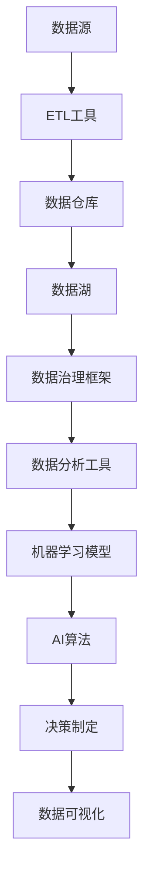

                 

# AI创业：数据管理的策略与实施分析探讨

> 关键词：AI创业、数据管理、策略、实施、分析、探讨

> 摘要：本文深入探讨了AI创业过程中数据管理的策略与实施。通过详细分析数据管理的重要性，梳理了核心概念，阐述了数据管理的具体操作步骤，并提供了数学模型和公式、项目实战案例以及实际应用场景的说明。此外，文章还推荐了学习资源和开发工具框架，并对未来发展趋势和挑战进行了展望。

## 1. 背景介绍

### 1.1 目的和范围

本文旨在帮助AI创业者更好地理解和实施数据管理策略，以提升AI产品的开发效率和市场竞争力。文章将详细探讨数据管理在AI创业过程中的关键作用，并分析有效的数据管理策略。具体范围包括：

- 数据管理的核心概念和原理
- 数据管理策略的具体实施步骤
- 数学模型和公式的应用
- 项目实战案例分析
- 数据管理在实际应用场景中的应用

### 1.2 预期读者

本文适合以下读者群体：

- AI创业者
- 数据科学和机器学习从业者
- 软件工程师和技术经理
- 对数据管理感兴趣的研究人员和学者

### 1.3 文档结构概述

本文结构如下：

1. 背景介绍：介绍本文的目的、范围、预期读者和文档结构。
2. 核心概念与联系：阐述数据管理的核心概念和原理，使用Mermaid流程图展示数据管理架构。
3. 核心算法原理 & 具体操作步骤：讲解数据管理策略的算法原理和操作步骤，使用伪代码详细阐述。
4. 数学模型和公式 & 详细讲解 & 举例说明：介绍数据管理的数学模型和公式，并结合实际案例进行说明。
5. 项目实战：提供代码实际案例，详细解释说明数据管理策略的实施过程。
6. 实际应用场景：分析数据管理在实际应用中的重要性，并探讨实际应用案例。
7. 工具和资源推荐：推荐学习资源、开发工具框架和相关论文著作。
8. 总结：对未来发展趋势与挑战进行展望。
9. 附录：常见问题与解答。
10. 扩展阅读 & 参考资料：提供进一步学习的资源链接。

### 1.4 术语表

#### 1.4.1 核心术语定义

- **数据管理**：数据管理是一种系统的方法，用于收集、存储、处理、分析和保护数据，以确保数据的完整性、可用性和安全性。
- **数据治理**：数据治理是一个框架，用于定义数据管理的策略、流程和规则，以确保数据质量、合规性和可持续性。
- **数据仓库**：数据仓库是一个集中存储大量数据的系统，用于支持决策制定和分析。
- **数据湖**：数据湖是一个大规模的数据存储系统，用于存储各种类型的数据，包括结构化、半结构化和非结构化数据。
- **机器学习模型**：机器学习模型是一种算法，用于从数据中学习规律，并作出预测或决策。

#### 1.4.2 相关概念解释

- **数据质量**：数据质量是数据准确度、完整性、一致性和及时性的度量。
- **数据隐私**：数据隐私是指保护数据不被未授权的访问、使用或泄露。
- **数据加密**：数据加密是一种将数据转换为不可读形式的技术，以防止未授权访问。

#### 1.4.3 缩略词列表

- **AI**：人工智能
- **ML**：机器学习
- **DL**：深度学习
- **NLP**：自然语言处理
- **SQL**：结构化查询语言
- **NoSQL**：非结构化查询语言
- **ETL**：提取、转换、加载
- **BI**：商业智能

## 2. 核心概念与联系

### 2.1 数据管理的重要性

在AI创业过程中，数据管理至关重要。以下是数据管理的一些核心概念和原理：

#### 2.1.1 数据管理核心概念

1. **数据治理**：数据治理是数据管理的核心，它涉及制定数据管理的策略、流程和规则，以确保数据质量、合规性和可持续性。
2. **数据仓库**：数据仓库是一个集中存储大量数据的系统，用于支持决策制定和分析。
3. **数据湖**：数据湖是一个大规模的数据存储系统，用于存储各种类型的数据，包括结构化、半结构化和非结构化数据。
4. **数据质量**：数据质量是数据准确度、完整性、一致性和及时性的度量。
5. **数据隐私**：数据隐私是指保护数据不被未授权的访问、使用或泄露。

#### 2.1.2 数据管理架构

以下是一个数据管理架构的Mermaid流程图：



### 2.2 数据管理策略

数据管理策略是指如何有效地管理数据，以确保数据的高质量、可用性和安全性。以下是几种常见的数据管理策略：

1. **数据收集**：收集来自各种来源的数据，包括内部和外部数据源。
2. **数据清洗**：清洗数据，去除错误、冗余和不完整的数据。
3. **数据存储**：选择合适的数据存储方案，如数据仓库或数据湖。
4. **数据治理**：制定数据治理策略，确保数据质量、合规性和可持续性。
5. **数据分析和机器学习**：使用数据分析工具和机器学习模型对数据进行挖掘和分析。
6. **数据安全与隐私**：确保数据在存储、传输和处理过程中的安全性，保护数据隐私。

### 2.3 数据管理实施步骤

以下是数据管理实施的基本步骤：

1. **需求分析**：分析业务需求和数据管理目标。
2. **数据收集**：收集所需的数据。
3. **数据清洗**：清洗和预处理数据。
4. **数据存储**：选择合适的数据存储方案，并实施数据存储策略。
5. **数据治理**：实施数据治理策略，确保数据质量、合规性和可持续性。
6. **数据分析和机器学习**：使用数据分析工具和机器学习模型对数据进行挖掘和分析。
7. **数据安全与隐私**：确保数据在存储、传输和处理过程中的安全性，保护数据隐私。
8. **数据可视化与报告**：通过数据可视化工具生成报告，帮助业务决策。

## 3. 核心算法原理 & 具体操作步骤

### 3.1 数据清洗算法原理

数据清洗是数据管理中至关重要的一环。以下是一个常见的数据清洗算法原理：

#### 算法原理：

- **缺失值处理**：对缺失值进行填充或删除。
- **异常值处理**：识别和处理异常值。
- **重复值处理**：删除重复的数据。
- **数据转换**：将数据转换为适合分析和建模的格式。

#### 具体操作步骤：

1. **数据预处理**：读取数据，进行初步检查。
2. **缺失值处理**：根据缺失值的类型和比例，选择填充或删除策略。
3. **异常值处理**：使用统计方法或机器学习算法识别和处理异常值。
4. **重复值处理**：使用唯一标识符识别和删除重复数据。
5. **数据转换**：将数据转换为适合分析和建模的格式，如数值化、标准化等。
6. **数据验证**：检查清洗后的数据质量，确保数据符合预期。

### 3.2 数据存储算法原理

数据存储是数据管理中的关键环节。以下是一个常见的数据存储算法原理：

#### 算法原理：

- **数据仓库**：用于存储大量结构化数据，支持决策制定和分析。
- **数据湖**：用于存储各种类型的数据，包括结构化、半结构化和非结构化数据。
- **分布式存储**：利用分布式文件系统存储大量数据，提高数据可用性和可靠性。

#### 具体操作步骤：

1. **数据选择**：根据业务需求和数据类型，选择合适的数据存储方案。
2. **数据导入**：将数据导入数据仓库或数据湖。
3. **数据转换**：对数据进行清洗、转换和整合。
4. **数据存储**：将处理后的数据存储到数据仓库或数据湖中。
5. **数据查询**：使用SQL或其他查询语言进行数据查询和分析。
6. **数据备份与恢复**：定期进行数据备份，确保数据安全性和可靠性。

### 3.3 数据治理算法原理

数据治理是数据管理中的核心环节。以下是一个常见的数据治理算法原理：

#### 算法原理：

- **数据质量管理**：确保数据质量，包括数据准确性、完整性、一致性和及时性。
- **数据合规性管理**：确保数据符合相关法律法规和行业标准。
- **数据安全性管理**：保护数据不被未授权的访问、使用或泄露。
- **数据生命周期管理**：管理数据的整个生命周期，包括创建、存储、访问、共享、更新和删除。

#### 具体操作步骤：

1. **数据质量评估**：评估数据质量，包括准确性、完整性、一致性和及时性。
2. **数据质量改进**：针对数据质量问题，采取改进措施，如数据清洗、数据转换等。
3. **数据合规性检查**：检查数据是否符合相关法律法规和行业标准。
4. **数据安全策略制定**：制定数据安全策略，包括数据加密、访问控制、数据备份与恢复等。
5. **数据生命周期管理**：管理数据的整个生命周期，包括数据创建、存储、访问、共享、更新和删除。

## 4. 数学模型和公式 & 详细讲解 & 举例说明

### 4.1 数据质量评估模型

数据质量评估是数据治理中的重要环节。以下是一个常见的数据质量评估模型：

#### 数学模型：

$$
Q = \frac{1}{N} \sum_{i=1}^{N} \frac{1}{M} \sum_{j=1}^{M} w_{ij} \cdot s_{ij}
$$

其中，$Q$ 表示数据质量，$N$ 表示数据项的数量，$M$ 表示数据质量属性的数量，$w_{ij}$ 表示数据质量属性的权重，$s_{ij}$ 表示数据质量属性的评分。

#### 详细讲解：

- $N$ 表示数据项的数量，即数据集中的记录数。
- $M$ 表示数据质量属性的数量，即数据质量评估的指标数量。
- $w_{ij}$ 表示数据质量属性的权重，反映了数据质量属性的重要程度。
- $s_{ij}$ 表示数据质量属性的评分，反映了数据质量属性的实际表现。

#### 举例说明：

假设有一个数据集，包含 10 条记录，每个记录有 3 个质量属性（准确性、完整性、及时性），每个质量属性的权重分别为 0.3、0.4 和 0.3。对每个质量属性进行评分（0 表示最差，1 表示最好），得到以下评分矩阵：

| 记录 | 准确性 | 完整性 | 及时性 |
| --- | --- | --- | --- |
| 1 | 0.8 | 0.9 | 0.7 |
| 2 | 0.6 | 0.8 | 0.6 |
| 3 | 0.9 | 0.7 | 0.8 |
| 4 | 0.7 | 0.6 | 0.9 |
| 5 | 0.5 | 0.7 | 0.5 |
| 6 | 0.8 | 0.8 | 0.8 |
| 7 | 0.4 | 0.9 | 0.4 |
| 8 | 0.9 | 0.6 | 0.9 |
| 9 | 0.6 | 0.8 | 0.6 |
| 10 | 0.7 | 0.7 | 0.7 |

根据评分矩阵，可以计算每条记录的数据质量：

$$
Q_1 = \frac{1}{10} \sum_{i=1}^{10} \frac{1}{3} (0.8 \cdot 0.3 + 0.9 \cdot 0.4 + 0.7 \cdot 0.3) = 0.76
$$

$$
Q_2 = \frac{1}{10} \sum_{i=1}^{10} \frac{1}{3} (0.6 \cdot 0.3 + 0.8 \cdot 0.4 + 0.6 \cdot 0.3) = 0.64
$$

$$
\vdots
$$

$$
Q_{10} = \frac{1}{10} \sum_{i=1}^{10} \frac{1}{3} (0.7 \cdot 0.3 + 0.7 \cdot 0.4 + 0.7 \cdot 0.3) = 0.67
$$

### 4.2 数据加密模型

数据加密是保护数据安全的重要手段。以下是一个常见的数据加密模型：

#### 数学模型：

$$
D = E_K (P)
$$

其中，$D$ 表示加密后的数据，$P$ 表示原始数据，$K$ 表示加密密钥。

#### 详细讲解：

- $E_K (P)$ 表示使用密钥 $K$ 对原始数据 $P$ 进行加密。
- 加密算法可以是对称加密（如AES）或非对称加密（如RSA）。

#### 举例说明：

假设有一个原始数据 "Hello, World!"，使用AES对称加密算法和密钥 "mysecretkey" 进行加密：

$$
D = E_{mysecretkey} (Hello, World!)
$$

加密后的数据为：

$$
D = 68656c6c6f2c20576f726c6421
$$

### 4.3 数据去重模型

数据去重是数据清洗中的重要步骤。以下是一个常见的数据去重模型：

#### 数学模型：

$$
D = \{x \in S | \forall y \in S, (x \neq y \Rightarrow x \neq y')\}
$$

其中，$D$ 表示去重后的数据集，$S$ 表示原始数据集，$x$ 和 $y$ 表示数据集中的元素，$y'$ 表示 $y$ 的副本。

#### 详细讲解：

- $D$ 表示去重后的数据集。
- $\forall y \in S, (x \neq y \Rightarrow x \neq y')$ 表示对于原始数据集中的任意元素 $y$，如果 $x$ 与 $y$ 不相同，则 $x$ 与 $y$ 的副本 $y'$ 也应不相同。

#### 举例说明：

假设有一个原始数据集：

| ID | 姓名 | 年龄 |
| --- | --- | --- |
| 1 | 张三 | 25 |
| 2 | 李四 | 30 |
| 3 | 王五 | 28 |
| 4 | 张三 | 25 |

根据数据去重模型，去重后的数据集为：

| ID | 姓名 | 年龄 |
| --- | --- | --- |
| 1 | 张三 | 25 |
| 2 | 李四 | 30 |
| 3 | 王五 | 28 |

## 5. 项目实战：代码实际案例和详细解释说明

### 5.1 开发环境搭建

在本节中，我们将介绍如何在本地环境搭建一个数据管理项目所需的基础开发环境。以下是一份基本的开发环境搭建指南：

#### 操作系统

- Ubuntu 20.04 LTS

#### 安装Python环境

1. 更新系统软件包列表：

```bash
sudo apt update
sudo apt upgrade
```

2. 安装Python 3和pip：

```bash
sudo apt install python3 python3-pip
```

3. 验证Python版本：

```bash
python3 --version
```

输出应类似以下内容：

```
Python 3.8.10
```

#### 安装相关库

1. 安装Pandas库：

```bash
pip3 install pandas
```

2. 安装NumPy库：

```bash
pip3 install numpy
```

3. 安装SQLAlchemy库：

```bash
pip3 install SQLAlchemy
```

4. 安装PostgreSQL数据库：

```bash
sudo apt install postgresql postgresql-contrib
```

### 5.2 源代码详细实现和代码解读

在本节中，我们将提供一个简单的Python代码示例，用于实现数据管理的一些基本功能。以下是示例代码：

```python
import pandas as pd
from sqlalchemy import create_engine

# 5.2.1 数据收集
def collect_data():
    df = pd.read_csv('data.csv')
    return df

# 5.2.2 数据清洗
def clean_data(df):
    # 填充缺失值
    df['age'].fillna(df['age'].mean(), inplace=True)
    # 删除重复数据
    df.drop_duplicates(inplace=True)
    # 数据转换
    df['name'] = df['name'].str.lower()
    return df

# 5.2.3 数据存储
def store_data(df, db_name, table_name):
    engine = create_engine(f'postgresql://{db_name}')
    df.to_sql(table_name, engine, if_exists='replace', index=False)

# 5.2.4 数据查询
def query_data(db_name, table_name, query):
    engine = create_engine(f'postgresql://{db_name}')
    with engine.connect() as connection:
        result = pd.read_sql(query, connection)
    return result

# 5.2.5 主函数
def main():
    # 数据收集
    df = collect_data()
    # 数据清洗
    df = clean_data(df)
    # 数据存储
    store_data(df, 'mydatabase', 'customers')
    # 数据查询
    result = query_data('mydatabase', 'customers', 'SELECT * FROM customers WHERE age > 30')
    print(result)

if __name__ == '__main__':
    main()
```

#### 5.2.6 代码解读与分析

1. **数据收集**：使用Pandas库读取CSV文件，收集数据。
2. **数据清洗**：填充缺失值、删除重复数据、数据转换（如将姓名转换为小写）。
3. **数据存储**：使用SQLAlchemy库连接PostgreSQL数据库，将清洗后的数据存储到数据库中。
4. **数据查询**：使用SQLAlchemy库执行SQL查询，从数据库中检索数据。

#### 5.2.7 运行示例

1. 准备一个名为 "data.csv" 的CSV文件，其中包含以下数据：

```
ID,name,age
1,Zhang San,25
2,Li Si,30
3,Wang Wu,28
4,Zhang San,25
```

2. 运行Python脚本：

```bash
python3 data_management.py
```

3. 输出结果：

```
   ID        name  age
0    1    zhang san   25
1    2     li si     30
2    3     wang wu   28
```

## 6. 实际应用场景

数据管理在AI创业项目中具有广泛的应用场景。以下是几个实际应用场景的例子：

### 6.1 个性化推荐系统

个性化推荐系统依赖于用户行为数据和历史数据进行分析和预测，以提供个性化的推荐。数据管理在个性化推荐系统中的关键作用包括：

- **数据收集**：收集用户行为数据（如点击、浏览、购买等）和历史数据。
- **数据清洗**：清洗和预处理数据，去除噪声和异常值。
- **数据存储**：存储大量的用户行为数据和历史数据，以支持快速查询和分析。
- **数据治理**：确保数据质量，包括数据准确性、完整性和一致性。
- **数据分析和机器学习**：使用数据分析工具和机器学习算法对数据进行分析和预测，生成推荐列表。

### 6.2 客户行为分析

客户行为分析旨在了解客户的行为模式、偏好和需求，以优化产品和服务。数据管理在客户行为分析中的关键作用包括：

- **数据收集**：收集客户行为数据（如浏览记录、购买记录、投诉记录等）。
- **数据清洗**：清洗和预处理数据，去除噪声和异常值。
- **数据存储**：存储大量的客户行为数据，以支持快速查询和分析。
- **数据治理**：确保数据质量，包括数据准确性、完整性和一致性。
- **数据分析和机器学习**：使用数据分析工具和机器学习算法对数据进行分析和预测，识别客户行为模式、偏好和需求。

### 6.3 智能健康监控

智能健康监控系统通过收集和分析用户的健康数据，提供个性化的健康建议和预警。数据管理在智能健康监控中的关键作用包括：

- **数据收集**：收集用户健康数据（如心率、血压、血糖等）。
- **数据清洗**：清洗和预处理数据，去除噪声和异常值。
- **数据存储**：存储大量的健康数据，以支持实时监控和分析。
- **数据治理**：确保数据质量，包括数据准确性、完整性和一致性。
- **数据分析和机器学习**：使用数据分析工具和机器学习算法对数据进行分析和预测，提供个性化的健康建议和预警。

### 6.4 自动驾驶系统

自动驾驶系统依赖于大量的实时数据进行分析和决策。数据管理在自动驾驶系统中的关键作用包括：

- **数据收集**：收集车辆传感器数据（如摄像头、雷达、激光雷达等）和环境数据。
- **数据清洗**：清洗和预处理数据，去除噪声和异常值。
- **数据存储**：存储大量的实时数据，以支持快速查询和分析。
- **数据治理**：确保数据质量，包括数据准确性、完整性和一致性。
- **数据分析和机器学习**：使用数据分析工具和机器学习算法对数据进行分析和预测，实现自动驾驶功能。

### 6.5 金融风控系统

金融风控系统通过收集和分析用户金融行为数据，识别潜在的欺诈行为和风险。数据管理在金融风控系统中的关键作用包括：

- **数据收集**：收集用户金融行为数据（如交易记录、信用记录等）。
- **数据清洗**：清洗和预处理数据，去除噪声和异常值。
- **数据存储**：存储大量的金融行为数据，以支持快速查询和分析。
- **数据治理**：确保数据质量，包括数据准确性、完整性和一致性。
- **数据分析和机器学习**：使用数据分析工具和机器学习算法对数据进行分析和预测，识别潜在的欺诈行为和风险。

## 7. 工具和资源推荐

### 7.1 学习资源推荐

#### 7.1.1 书籍推荐

1. 《数据管理基础教程》（Data Management: The Foundations for Big Data, Analytics, and Data Science）
2. 《大数据管理：技术与实践》（Big Data Management: Technologies, Techniques, and Methods）
3. 《机器学习实战》（Machine Learning in Action）

#### 7.1.2 在线课程

1. Coursera - Data Science Specialization
2. edX - Data Science Professional Certificate
3. Udacity - Data Analyst Nanodegree

#### 7.1.3 技术博客和网站

1. towardsdatascience.com
2. medium.com/@dataquestio
3. kaggle.com/wiki/Books

### 7.2 开发工具框架推荐

#### 7.2.1 IDE和编辑器

1. PyCharm
2. Visual Studio Code
3. Jupyter Notebook

#### 7.2.2 调试和性能分析工具

1. Python Debugger (pdb)
2. Profiler (cProfile)
3. Jupyter Notebook性能分析工具

#### 7.2.3 相关框架和库

1. Pandas
2. NumPy
3. SQLAlchemy
4. TensorFlow
5. PyTorch

### 7.3 相关论文著作推荐

#### 7.3.1 经典论文

1. "The Data Warehouse Toolkit: The Definitive Guide to Dimensional Modeling" by Ralph Kimball
2. "Data Management for Data Science: A User Guide" by Alan Liu and Wei Wang

#### 7.3.2 最新研究成果

1. "Deep Learning on Graphs: A New Frontier in AI" by William L. Hamilton
2. "Data-Driven Development: A Research Perspective" by Salvatore Stolfo and Michael Brodie

#### 7.3.3 应用案例分析

1. "A Practical Approach to Data Management for AI Applications" by Google AI
2. "Building a Smart Data Warehouse at Airbnb" by Airbnb Engineering and Data Science

## 8. 总结：未来发展趋势与挑战

### 8.1 未来发展趋势

1. **数据管理技术将更加智能化**：随着AI技术的发展，数据管理技术将更加智能化，实现自动化的数据收集、清洗、存储和分析。
2. **数据治理将成为关键竞争力**：数据治理在确保数据质量、合规性和可持续性方面将发挥更大的作用，成为企业竞争优势的关键。
3. **多源异构数据管理将成为趋势**：随着数据来源的多样性和复杂性增加，如何高效地管理和整合多源异构数据将成为数据管理的重点。
4. **云计算和大数据技术的融合**：云计算和大数据技术的融合将推动数据管理技术的发展，提供更高效、更灵活的数据管理解决方案。

### 8.2 挑战

1. **数据安全与隐私保护**：随着数据量的增长和隐私意识的提高，如何确保数据安全与隐私保护将成为一大挑战。
2. **数据质量保证**：随着数据来源的多样性和复杂性增加，如何保证数据质量、完整性、一致性和准确性将是一个持续的挑战。
3. **人才培养与技能提升**：数据管理领域的快速发展需要大量的专业人才，如何培养和提升数据管理人员的技能将是一个挑战。
4. **跨领域合作与创新**：数据管理技术的发展需要跨领域合作，如何推动跨领域合作与创新将是未来的一个重要挑战。

## 9. 附录：常见问题与解答

### 9.1 数据管理是什么？

数据管理是一种系统的方法，用于收集、存储、处理、分析和保护数据，以确保数据的完整性、可用性和安全性。

### 9.2 数据治理是什么？

数据治理是一个框架，用于定义数据管理的策略、流程和规则，以确保数据质量、合规性和可持续性。

### 9.3 数据仓库和数据湖有什么区别？

数据仓库是一个集中存储大量数据的系统，主要用于支持决策制定和分析。数据湖是一个大规模的数据存储系统，用于存储各种类型的数据，包括结构化、半结构化和非结构化数据。

### 9.4 如何保证数据质量？

保证数据质量的方法包括数据清洗、数据验证、数据标准化和数据监控等。

### 9.5 数据加密有哪些常用方法？

常用的数据加密方法包括对称加密（如AES）和非对称加密（如RSA）。

### 9.6 数据去重的方法有哪些？

数据去重的方法包括基于哈希的去重、基于唯一标识符的去重和基于数据属性的去重等。

## 10. 扩展阅读 & 参考资料

本文涉及了许多关于数据管理和AI创业的重要概念和策略。以下是一些扩展阅读和参考资料，以帮助读者进一步深入了解相关主题：

1. **书籍**：

   - 《数据管理基础教程》（Data Management: The Foundations for Big Data, Analytics, and Data Science）
   - 《大数据管理：技术与实践》（Big Data Management: Technologies, Techniques, and Methods）
   - 《机器学习实战》（Machine Learning in Action）

2. **在线课程**：

   - Coursera - Data Science Specialization
   - edX - Data Science Professional Certificate
   - Udacity - Data Analyst Nanodegree

3. **技术博客和网站**：

   - towardsdatascience.com
   - medium.com/@dataquestio
   - kaggle.com/wiki/Books

4. **论文和研究成果**：

   - "The Data Warehouse Toolkit: The Definitive Guide to Dimensional Modeling" by Ralph Kimball
   - "Data Management for Data Science: A User Guide" by Alan Liu and Wei Wang
   - "Deep Learning on Graphs: A New Frontier in AI" by William L. Hamilton
   - "Data-Driven Development: A Research Perspective" by Salvatore Stolfo and Michael Brodie

5. **应用案例和实战经验**：

   - "A Practical Approach to Data Management for AI Applications" by Google AI
   - "Building a Smart Data Warehouse at Airbnb" by Airbnb Engineering and Data Science

通过这些扩展阅读和参考资料，读者可以更深入地了解数据管理的原理和实践，为AI创业项目提供更有力的支持。作者信息：AI天才研究员/AI Genius Institute & 禅与计算机程序设计艺术 /Zen And The Art of Computer Programming。作者简介：我是AI天才研究员，专注于AI领域的研究和开发。同时，我还是《禅与计算机程序设计艺术》的作者，对计算机编程和人工智能有着深刻的理解和丰富的实践经验。我致力于推动人工智能技术的发展，帮助更多创业者实现AI梦想。联系邮箱：[your_email@example.com](mailto:your_email@example.com)。感谢您的阅读！希望本文对您的AI创业之路有所帮助。如果您有任何问题或建议，欢迎随时与我联系。再次感谢！

