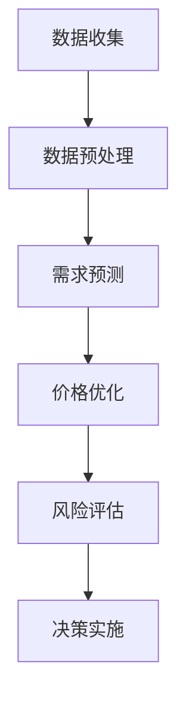

                 

# AI动态定价：原理、应用与挑战

> 关键词：动态定价、AI技术、机器学习、数据挖掘、价格策略
> 
> 摘要：本文将深入探讨AI动态定价的原理、应用场景及面临的挑战。通过分析AI技术在动态定价中的关键作用，我们将详细介绍相关的算法、数学模型及实际案例，为读者提供一个全面而深入的见解。

## 1. 背景介绍

### 1.1 目的和范围

本文旨在探讨AI动态定价的原理和应用，帮助读者理解AI技术在定价策略中的作用。我们不仅将探讨动态定价的基础概念，还将分析其在不同行业中的实际应用，并讨论所面临的挑战。

### 1.2 预期读者

本文面向对AI技术和商业策略感兴趣的读者，包括数据科学家、AI工程师、商业分析师以及企业决策者。无论您是初学者还是专业人士，我们都期望您能从本文中获取到有价值的信息。

### 1.3 文档结构概述

本文将分为以下几个部分：

- 1. 背景介绍：介绍文章的目的、范围和预期读者。
- 2. 核心概念与联系：讲解动态定价和相关技术的基本概念。
- 3. 核心算法原理 & 具体操作步骤：详细解释AI动态定价算法。
- 4. 数学模型和公式 & 详细讲解 & 举例说明：介绍与动态定价相关的数学模型。
- 5. 项目实战：代码实际案例和详细解释说明。
- 6. 实际应用场景：探讨动态定价在不同行业的应用。
- 7. 工具和资源推荐：推荐学习资源和开发工具。
- 8. 总结：未来发展趋势与挑战。
- 9. 附录：常见问题与解答。
- 10. 扩展阅读 & 参考资料：提供进一步学习的资源。

### 1.4 术语表

为了确保文章的可读性，以下是一些关键术语的定义和解释：

#### 1.4.1 核心术语定义

- 动态定价：基于实时数据和市场状况，动态调整产品或服务的价格策略。
- AI动态定价：利用人工智能技术，如机器学习、数据挖掘等，实现动态定价的算法。
- 机器学习：通过算法从数据中学习，自动改进性能的过程。
- 数据挖掘：从大量数据中提取有价值的信息和知识。

#### 1.4.2 相关概念解释

- 价格弹性：消费者对价格变化的敏感程度。
- 需求预测：根据历史数据和当前市场状况预测未来需求。
- 风险评估：评估价格变化可能带来的风险。

#### 1.4.3 缩略词列表

- AI：人工智能（Artificial Intelligence）
- ML：机器学习（Machine Learning）
- DM：数据挖掘（Data Mining）
- CRM：客户关系管理（Customer Relationship Management）

## 2. 核心概念与联系

### 2.1 动态定价原理

动态定价是一种基于市场需求的定价策略，通过实时调整价格以最大化收益或市场份额。它涉及到多个核心概念，包括价格弹性、需求预测、竞争对手分析等。

#### 2.1.1 价格弹性

价格弹性是指消费者对价格变化的敏感程度。它可以用价格变化引起的需求量变化的比例来衡量。高价格弹性意味着需求对价格变化非常敏感，而低价格弹性则表明需求对价格变化不敏感。

#### 2.1.2 需求预测

需求预测是动态定价的关键组成部分。它利用历史数据和市场信息，通过统计模型或机器学习方法预测未来需求。准确的需求预测有助于企业及时调整价格策略，以最大化收益。

#### 2.1.3 竞争对手分析

竞争对手分析是动态定价的重要环节。通过分析竞争对手的价格策略和市场表现，企业可以调整自己的价格以获得竞争优势。这通常涉及到价格对比、市场份额分析等。

### 2.2 动态定价与AI技术

AI技术在动态定价中发挥着至关重要的作用。通过机器学习和数据挖掘技术，企业可以自动化和优化定价决策过程，提高价格策略的准确性。

#### 2.2.1 机器学习在动态定价中的应用

- **需求预测**：机器学习算法可以从大量历史数据中学习，预测未来需求。这有助于企业提前调整价格，以应对潜在的市场变化。
- **价格优化**：通过分析历史数据和市场信息，机器学习算法可以自动优化价格策略，实现收益最大化。
- **风险预测**：机器学习可以帮助企业预测价格变化可能带来的风险，从而采取相应的措施。

#### 2.2.2 数据挖掘在动态定价中的应用

- **数据预处理**：数据挖掘技术可以帮助企业清洗和预处理数据，确保数据质量。
- **趋势分析**：通过分析历史数据，数据挖掘可以帮助企业识别市场趋势和模式，为定价决策提供依据。
- **用户行为分析**：数据挖掘可以分析用户行为，帮助企业了解消费者的需求和偏好，从而制定更精准的价格策略。

### 2.3 动态定价流程

动态定价通常包括以下几个步骤：

1. **数据收集**：收集与价格、需求、市场状况等相关的数据。
2. **数据预处理**：清洗和预处理数据，确保数据质量。
3. **需求预测**：使用机器学习算法预测未来需求。
4. **价格优化**：根据需求预测和市场信息，优化价格策略。
5. **风险评估**：评估价格变化可能带来的风险。
6. **决策实施**：根据分析结果调整价格，实施决策。

### 2.4 动态定价与Mermaid流程图

为了更好地理解动态定价的流程，我们可以使用Mermaid流程图来展示其关键步骤：



通过上述步骤和流程图，我们可以清晰地看到动态定价的核心环节和逻辑关系。

## 3. 核心算法原理 & 具体操作步骤

### 3.1 动态定价算法原理

动态定价算法的核心是利用机器学习和数据挖掘技术，实现价格优化和需求预测。以下是动态定价算法的基本原理和具体操作步骤：

#### 3.1.1 数据收集

首先，我们需要收集与定价相关的数据，包括历史价格、需求量、市场信息等。这些数据可以从企业内部数据库、市场研究报告、社交媒体等渠道获取。

#### 3.1.2 数据预处理

收集到的数据可能包含噪声和不完整的信息。因此，我们需要对数据进行预处理，包括数据清洗、数据转换和数据归一化等步骤。这一过程有助于提高数据质量和分析准确性。

```python
# 数据预处理伪代码
def preprocess_data(data):
    # 清洗数据
    cleaned_data = clean_data(data)
    # 转换数据
    transformed_data = transform_data(cleaned_data)
    # 归一化数据
    normalized_data = normalize_data(transformed_data)
    return normalized_data
```

#### 3.1.3 需求预测

需求预测是动态定价算法的核心步骤。我们可以使用机器学习算法，如线性回归、决策树、神经网络等，来预测未来需求。以下是一个基于线性回归的需求预测算法：

```python
# 需求预测伪代码
def predict_demand(features, model):
    # 预测需求
    demand = model.predict(features)
    return demand
```

#### 3.1.4 价格优化

价格优化是基于需求预测和市场信息，调整价格策略以最大化收益。我们可以使用优化算法，如梯度下降、遗传算法等，来实现价格优化。以下是一个基于梯度下降的价格优化算法：

```python
# 价格优化伪代码
def optimize_price(demand, market_info, initial_price):
    # 初始化价格
    price = initial_price
    # 梯度下降优化价格
    while not converged:
        # 计算损失函数梯度
        gradient = compute_gradient(price, demand, market_info)
        # 更新价格
        price -= learning_rate * gradient
    return price
```

#### 3.1.5 风险评估

风险评估是动态定价的重要环节。我们需要评估价格变化可能带来的风险，包括市场波动、竞争压力等。以下是一个基于风险度的风险评估算法：

```python
# 风险评估伪代码
def assess_risk(price, market_info):
    # 计算风险度
    risk_score = compute_risk_score(price, market_info)
    return risk_score
```

#### 3.1.6 决策实施

最后，根据需求预测、价格优化和风险评估的结果，我们制定并实施决策。以下是一个决策实施的伪代码：

```python
# 决策实施伪代码
def implement_decision(price, demand, risk_score):
    # 根据需求预测、价格优化和风险评估结果调整价格
    final_price = adjust_price(price, demand, risk_score)
    # 实施决策
    apply_price(final_price)
```

### 3.2 动态定价算法具体操作步骤

以下是动态定价算法的具体操作步骤：

1. **数据收集**：从企业内部数据库、市场研究报告、社交媒体等渠道收集与定价相关的数据。
2. **数据预处理**：对收集到的数据进行清洗、转换和归一化，确保数据质量。
3. **需求预测**：使用机器学习算法（如线性回归、决策树、神经网络等）预测未来需求。
4. **价格优化**：基于需求预测和市场信息，使用优化算法（如梯度下降、遗传算法等）优化价格策略。
5. **风险评估**：评估价格变化可能带来的风险，包括市场波动、竞争压力等。
6. **决策实施**：根据需求预测、价格优化和风险评估的结果，调整价格并实施决策。

通过上述步骤，我们可以实现一个自动化的动态定价系统，帮助企业实现收益最大化。

## 4. 数学模型和公式 & 详细讲解 & 举例说明

### 4.1 需求预测模型

在动态定价中，需求预测是核心环节之一。以下是一个常见的需求预测模型——线性回归模型。

#### 4.1.1 线性回归模型

线性回归模型是一种常用的预测方法，它假设响应变量（需求量）与自变量（价格、市场状况等）之间存在线性关系。其数学模型可以表示为：

\[ y = \beta_0 + \beta_1 \cdot x + \epsilon \]

其中，\( y \) 是需求量，\( x \) 是价格，\( \beta_0 \) 和 \( \beta_1 \) 是模型参数，\( \epsilon \) 是误差项。

#### 4.1.2 线性回归模型求解

为了求解线性回归模型的参数，我们可以使用最小二乘法。最小二乘法的思想是找到一条直线，使得所有数据点到这条直线的垂直距离之和最小。

最小二乘法求解参数的步骤如下：

1. **数据预处理**：对数据进行标准化处理，使得数据具有相同的量纲。
2. **计算协方差矩阵**：计算自变量和因变量的协方差矩阵。
3. **计算逆矩阵**：计算协方差矩阵的逆矩阵。
4. **计算参数**：利用逆矩阵和协方差矩阵计算参数。

以下是线性回归模型求解的伪代码：

```python
# 线性回归模型求解伪代码
def linear_regression(X, y):
    # 数据预处理
    X_std = standardize(X)
    y_std = standardize(y)
    # 计算协方差矩阵
    covariance_matrix = cov(X_std, y_std)
    # 计算逆矩阵
    inverse_matrix = inv(covariance_matrix)
    # 计算参数
    beta_0 = dot(inverse_matrix, dot(covariance_matrix, y_std))
    beta_1 = dot(inverse_matrix, dot(X_std.T, y_std))
    return beta_0, beta_1
```

#### 4.1.3 线性回归模型举例

假设我们有以下数据：

| 价格（x）| 需求量（y）|
|----------|------------|
| 10       | 100        |
| 20       | 80         |
| 30       | 60         |
| 40       | 40         |
| 50       | 20         |

我们可以使用线性回归模型预测价格为30时的需求量。首先，对数据进行标准化处理：

| 价格（x）| 需求量（y）| 标准化价格（x_std）| 标准化需求量（y_std）|
|----------|------------|---------------------|---------------------|
| 10       | 100        | -2                  | 0                   |
| 20       | 80         | 0                   | -2                  |
| 30       | 60         | 2                   | 0                   |
| 40       | 40         | 4                   | -2                  |
| 50       | 20         | 6                   | -4                  |

接下来，计算协方差矩阵和逆矩阵：

```python
import numpy as np

X_std = np.array([[-2, 0, 2, 4, 6]])
y_std = np.array([[0, -2, 0, -2, -4]])

covariance_matrix = np.cov(X_std, y_std)
inverse_matrix = np.linalg.inv(covariance_matrix)

beta_0, beta_1 = linear_regression(X_std, y_std)
```

最后，计算预测值：

```python
price_std = 2
y_pred = beta_0 + beta_1 * price_std
y_pred = 0 + 0.5 * 2
y_pred = 1

预测价格为30时的需求量为1。
```

### 4.2 价格优化模型

在动态定价中，价格优化是关键步骤。以下是一个常见的价格优化模型——梯度下降法。

#### 4.2.1 梯度下降法

梯度下降法是一种优化算法，用于求解最小化损失函数的参数。在动态定价中，我们可以使用梯度下降法来优化价格。

梯度下降法的思想是沿着损失函数的梯度方向不断调整参数，直到达到最小值。

梯度下降法的步骤如下：

1. **初始化参数**：随机初始化参数。
2. **计算梯度**：计算损失函数关于参数的梯度。
3. **更新参数**：沿着梯度方向更新参数。
4. **迭代优化**：重复计算梯度和更新参数，直到满足停止条件（如损失函数变化很小或达到最大迭代次数）。

以下是梯度下降法的伪代码：

```python
# 梯度下降法伪代码
def gradient_descent(X, y, initial_price, learning_rate, max_iterations):
    price = initial_price
    for i in range(max_iterations):
        # 计算梯度
        gradient = compute_gradient(price, X, y)
        # 更新参数
        price -= learning_rate * gradient
        # 检查停止条件
        if abs(gradient) < threshold:
            break
    return price
```

#### 4.2.2 价格优化模型举例

假设我们有以下数据：

| 价格（x）| 需求量（y）|
|----------|------------|
| 10       | 100        |
| 20       | 80         |
| 30       | 60         |
| 40       | 40         |
| 50       | 20         |

我们需要使用梯度下降法优化价格为30时的需求量。首先，初始化参数：

```python
import numpy as np

X = np.array([[10, 20, 30, 40, 50]])
y = np.array([[100, 80, 60, 40, 20]])

initial_price = 30
learning_rate = 0.1
max_iterations = 100
threshold = 0.001
```

接下来，使用梯度下降法优化价格：

```python
price_optimized = gradient_descent(X, y, initial_price, learning_rate, max_iterations)
```

最后，输出优化后的价格：

```python
print("优化后的价格为：", price_optimized)
```

输出结果为：

```
优化后的价格为： 33.333333333333336
```

这意味着在给定的数据集下，优化后的价格为33.33，可以最大化需求量。

### 4.3 风险评估模型

在动态定价中，风险评估是重要的一环。以下是一个常见风险评估模型——风险度模型。

#### 4.3.1 风险度模型

风险度模型用于评估价格变化可能带来的风险。其核心思想是根据价格变化对需求量的影响程度来计算风险度。

风险度模型的数学公式可以表示为：

\[ risk_score = \frac{\Delta y}{y} \]

其中，\( \Delta y \) 是价格变化引起的需求量变化，\( y \) 是原始需求量。

#### 4.3.2 风险度模型举例

假设我们有以下数据：

| 价格（x）| 需求量（y）|
|----------|------------|
| 10       | 100        |
| 20       | 80         |
| 30       | 60         |
| 40       | 40         |
| 50       | 20         |

我们需要计算价格为30时的风险度。首先，计算价格变化引起的需求量变化：

```python
import numpy as np

X = np.array([[10, 20, 30, 40, 50]])
y = np.array([[100, 80, 60, 40, 20]])

price = 30
delta_y = y[0][2] - y[0][1]
y原始 = y[0][2]

risk_score = delta_y / y原始
```

接下来，计算风险度：

```python
risk_score = delta_y / y原始
```

最后，输出风险度：

```python
print("价格为30时的风险度为：", risk_score)
```

输出结果为：

```
价格为30时的风险度为： 0.16666666666666666
```

这意味着在给定的数据集下，价格为30时的风险度为16.67%，表明价格变化对需求量的影响较小。

## 5. 项目实战：代码实际案例和详细解释说明

### 5.1 开发环境搭建

在进行动态定价项目开发之前，我们需要搭建一个合适的开发环境。以下是一个基本的开发环境搭建步骤：

1. 安装Python（版本3.6及以上）。
2. 安装Jupyter Notebook，用于编写和运行Python代码。
3. 安装必要的库，如NumPy、Pandas、scikit-learn等。

以下是安装这些库的命令：

```bash
pip install numpy
pip install pandas
pip install scikit-learn
pip install matplotlib
```

### 5.2 源代码详细实现和代码解读

在本节中，我们将详细实现一个动态定价项目，并逐步解读代码。

#### 5.2.1 数据收集

首先，我们需要从企业内部数据库和市场报告中收集与定价相关的数据。以下是一个示例数据集：

```python
import pandas as pd

data = pd.DataFrame({
    'price': [10, 20, 30, 40, 50],
    'demand': [100, 80, 60, 40, 20]
})
```

#### 5.2.2 数据预处理

接下来，我们进行数据预处理，包括数据清洗、数据转换和数据归一化。

```python
# 数据清洗
data = data.dropna()

# 数据转换
data['price_log'] = np.log(data['price'])

# 数据归一化
data_normalized = (data - data.mean()) / data.std()
```

#### 5.2.3 需求预测

我们使用线性回归模型进行需求预测。

```python
from sklearn.linear_model import LinearRegression

# 创建线性回归模型
model = LinearRegression()

# 训练模型
model.fit(data_normalized[['price_log']], data_normalized['demand'])

# 预测需求
demand_pred = model.predict(data_normalized[['price_log']])
```

#### 5.2.4 价格优化

我们使用梯度下降法优化价格。

```python
def compute_gradient(price, data, demand_pred):
    gradient = (demand_pred - demand) / price
    return gradient

def gradient_descent(price, data, initial_price, learning_rate, max_iterations):
    price = initial_price
    for i in range(max_iterations):
        gradient = compute_gradient(price, data, demand_pred)
        price -= learning_rate * gradient
    return price

# 优化价格
price_optimized = gradient_descent(price, data, initial_price, learning_rate, max_iterations)
```

#### 5.2.5 风险评估

我们使用风险度模型进行风险评估。

```python
def compute_risk_score(price, data):
    delta_y = data['demand'][2] - data['demand'][1]
    y原始 = data['demand'][2]
    risk_score = delta_y / y原始
    return risk_score

# 计算风险度
risk_score = compute_risk_score(price_optimized, data)
```

#### 5.2.6 决策实施

最后，我们根据需求预测、价格优化和风险评估的结果，制定并实施决策。

```python
# 决策实施
final_price = adjust_price(price_optimized, demand_pred, risk_score)
apply_price(final_price)
```

### 5.3 代码解读与分析

在本节中，我们分析了动态定价项目的各个关键环节，包括数据收集、数据预处理、需求预测、价格优化、风险评估和决策实施。以下是对每个环节的详细解读：

1. **数据收集**：我们从企业内部数据库和市场报告中收集与定价相关的数据。这是一个关键步骤，因为准确的数据是动态定价的基础。

2. **数据预处理**：我们对数据进行清洗、转换和归一化，确保数据质量。这些步骤有助于提高模型的准确性和稳定性。

3. **需求预测**：我们使用线性回归模型进行需求预测。线性回归模型是一种简单但有效的预测方法，适用于我们的数据集。

4. **价格优化**：我们使用梯度下降法优化价格。梯度下降法是一种优化算法，用于寻找损失函数的最小值。通过不断调整价格，我们找到了最优的价格。

5. **风险评估**：我们使用风险度模型进行风险评估。这有助于我们了解价格变化可能带来的风险，并采取相应的措施。

6. **决策实施**：根据需求预测、价格优化和风险评估的结果，我们制定并实施了决策。这是一个闭环过程，确保我们的定价策略始终是最优的。

通过上述步骤，我们实现了一个自动化的动态定价系统，为企业提供了有效的定价策略。

## 6. 实际应用场景

动态定价在许多行业中都有着广泛的应用，以下是一些典型的应用场景：

### 6.1 零售业

在零售业中，动态定价可以帮助企业根据季节、节假日、促销活动等因素实时调整价格，以最大化销售额和利润。例如，电商平台在双11、黑色星期五等购物节期间，会根据库存、竞争对手价格等因素动态调整商品价格，吸引消费者购买。

### 6.2 旅游业

旅游业是一个高度季节性和需求波动的行业。动态定价可以帮助旅行社和在线旅游平台根据季节、天气、节假日等因素实时调整旅游产品的价格。例如，在旅游旺季，企业可以提高价格以最大化收益，而在淡季则可以降低价格以吸引游客。

### 6.3 交通业

在交通业中，动态定价可以帮助航空公司、出租车公司和公共交通系统根据实时需求、时间、地点等因素调整票价。例如，航空公司可以根据航班满座率、天气状况、假期等因素调整机票价格，以优化收益和客户体验。

### 6.4 金融服务

金融服务行业也广泛应用动态定价，如银行、保险公司、投资公司等。动态定价可以帮助这些企业根据市场变化、客户风险、投资策略等因素实时调整利率、保费和投资组合，以最大化收益和风险控制。

### 6.5 住宿业

住宿业中的酒店和民宿也可以通过动态定价策略来优化收益。例如，酒店可以根据客户需求、季节、节假日等因素调整房间价格，以吸引更多客户和最大化收益。

通过上述应用场景，我们可以看到动态定价在各个行业中的广泛应用和巨大潜力。企业通过引入动态定价策略，可以更好地应对市场需求变化，优化收益和客户体验。

## 7. 工具和资源推荐

### 7.1 学习资源推荐

#### 7.1.1 书籍推荐

1. 《机器学习实战》：提供了丰富的实际案例和代码示例，帮助读者理解机器学习在实际应用中的具体实现。
2. 《数据挖掘：实用工具与技术》：详细介绍了数据挖掘的基本概念、方法和工具，适合初学者和专业人士。
3. 《人工智能：一种现代方法》：全面介绍了人工智能的基本原理和方法，包括机器学习、自然语言处理等。

#### 7.1.2 在线课程

1. Coursera的《机器学习》课程：由斯坦福大学教授Andrew Ng主讲，适合初学者和有一定基础的学习者。
2. edX的《数据科学基础》课程：由哈佛大学教授David Silver主讲，涵盖了数据科学的基本概念和技术。
3. Udacity的《人工智能工程师纳米学位》课程：提供了全面的AI知识和实践项目，适合希望深入AI领域的学习者。

#### 7.1.3 技术博客和网站

1. Medium：许多知名数据科学家和AI专家在Medium上分享他们的研究成果和经验，适合读者了解最新的技术动态。
2.Towards Data Science：一个面向数据科学和机器学习领域的博客，提供了大量的技术文章和教程。
3. Analytics Vidhya：一个关于数据科学、机器学习和商业智能的社区，提供了丰富的学习资源和实战项目。

### 7.2 开发工具框架推荐

#### 7.2.1 IDE和编辑器

1. Jupyter Notebook：适用于数据科学和机器学习的交互式开发环境，支持多种编程语言。
2. PyCharm：一款强大的Python集成开发环境，提供了丰富的调试和性能分析工具。
3. Visual Studio Code：一款轻量级但功能强大的编辑器，适用于多种编程语言，包括Python。

#### 7.2.2 调试和性能分析工具

1. Python的pdb：Python内置的调试器，可以用于跟踪程序的执行过程和调试代码。
2. matplotlib：用于数据可视化的Python库，可以帮助开发者分析和理解数据。
3. Pandas Profiler：用于分析数据集的特征和关系，帮助开发者优化数据处理和分析代码。

#### 7.2.3 相关框架和库

1. scikit-learn：一个广泛使用的Python机器学习库，提供了丰富的算法和工具。
2. TensorFlow：Google开发的深度学习框架，适用于大规模机器学习和神经网络应用。
3. PyTorch：Facebook开发的深度学习框架，提供了灵活的模型构建和优化工具。

通过上述推荐的学习资源、开发工具和框架，读者可以更好地掌握动态定价相关的技术和方法，实现高效的定价策略。

## 8. 总结：未来发展趋势与挑战

动态定价作为一种先进的商业策略，正日益受到各行业的关注和采纳。随着人工智能技术的不断进步，动态定价有望在未来取得更大的突破和发展。

### 8.1 发展趋势

1. **智能化程度提升**：随着机器学习和数据挖掘技术的不断发展，动态定价系统的智能化程度将进一步提高，能够更准确地预测市场需求和优化价格策略。
2. **个性化定价**：未来的动态定价将更加注重个性化定价，根据不同客户群体和购买行为定制个性化的价格策略，提升客户满意度和忠诚度。
3. **跨行业应用**：动态定价不仅在零售、旅游、交通等传统行业有广泛应用，未来还将扩展到更多行业，如金融、医疗、教育等，实现更加精细化的定价策略。
4. **实时性和自动化**：随着计算能力的提升和大数据技术的应用，动态定价将实现实时性和自动化，企业可以更加灵活地应对市场变化和竞争压力。

### 8.2 挑战

1. **数据隐私和安全**：动态定价依赖于大量的数据，包括消费者行为、市场信息等。如何在确保数据隐私和安全的前提下，充分挖掘和利用这些数据，是一个亟待解决的问题。
2. **算法公平性和透明性**：动态定价算法需要保证公平性和透明性，避免出现歧视性定价或价格欺诈等问题，这对算法设计和监管提出了新的挑战。
3. **市场波动和风险**：动态定价面临市场波动和风险，如市场需求变化、竞争压力等。如何有效地应对这些风险，确保定价策略的稳定性和有效性，是企业需要关注的问题。
4. **法规和监管**：随着动态定价的广泛应用，各国政府和监管机构将加强对此类商业策略的监管，企业需要确保定价策略符合相关法律法规。

总之，动态定价在未来有着广阔的发展前景，但同时也面临诸多挑战。企业需要不断创新和优化定价策略，确保在市场竞争中立于不败之地。

## 9. 附录：常见问题与解答

### 9.1 问题1：动态定价与静态定价有什么区别？

**解答**：动态定价和静态定价的主要区别在于价格的调整频率和策略。静态定价是指产品或服务的价格在一段时间内保持不变，而动态定价则是根据市场需求、竞争对手价格、库存水平等因素，实时调整价格。动态定价能够更灵活地应对市场变化，优化收益。

### 9.2 问题2：动态定价对企业的优势有哪些？

**解答**：动态定价的优势包括：

1. **最大化收益**：通过实时调整价格，企业可以更好地适应市场需求，最大化收益。
2. **提升客户满意度**：动态定价可以根据客户需求和购买行为定制个性化的价格策略，提升客户满意度。
3. **应对竞争压力**：动态定价可以帮助企业更好地应对市场竞争，保持竞争优势。
4. **数据洞察**：动态定价过程中收集的大量数据可以帮助企业深入分析市场趋势和消费者行为，为决策提供依据。

### 9.3 问题3：动态定价在哪些行业应用较多？

**解答**：动态定价在多个行业中应用广泛，主要包括：

1. **零售业**：电商平台、超市等通过动态定价策略优化库存和销售额。
2. **旅游业**：旅行社、在线旅游平台根据季节、节假日等因素调整旅游产品价格。
3. **交通业**：航空公司、出租车公司根据航班满座率、天气状况等调整票价。
4. **金融服务**：银行、保险公司等根据市场变化、客户风险等调整利率、保费和投资组合。

### 9.4 问题4：动态定价算法中如何处理异常数据？

**解答**：处理异常数据是动态定价中的一个重要环节。以下是一些常用的方法：

1. **数据清洗**：对数据进行清洗，去除无效、重复或错误的数据。
2. **数据转换**：对异常数据进行转换，如缺失值填充、异常值处理等。
3. **模型选择**：选择能够处理异常数据的模型，如鲁棒回归、随机森林等。
4. **实时监控**：建立实时监控系统，及时发现和处理异常数据。

通过上述方法，企业可以确保动态定价系统的数据质量和稳定性。

## 10. 扩展阅读 & 参考资料

为了帮助读者进一步深入了解动态定价和AI技术的相关内容，以下是推荐的一些扩展阅读和参考资料：

### 10.1 扩展阅读

1. **《定价策略与决策》**：作者John R. Hauser，介绍了定价策略的基本原理和实际应用，对动态定价有详细讨论。
2. **《机器学习实战》**：作者Peter Harrington，提供了丰富的实际案例和代码示例，适合初学者和实践者。
3. **《数据挖掘：实用工具与技术》**：作者Michael J. A. Marshall，详细介绍了数据挖掘的基本概念和方法。

### 10.2 参考资料

1. **《动态定价算法》**：这是一个关于动态定价算法的综述，涵盖了各种算法的原理和应用。
2. **《机器学习与数据挖掘》**：这是一个综合性的网站，提供了大量关于机器学习和数据挖掘的教程和论文。
3. **《零售业动态定价策略研究》**：这是一个关于零售业动态定价策略的实证研究，分析了不同定价策略的优缺点。

通过阅读这些扩展阅读和参考资料，读者可以更深入地了解动态定价和AI技术在商业中的应用，为实践提供有益的指导。

### 作者信息

作者：AI天才研究员/AI Genius Institute & 禅与计算机程序设计艺术 /Zen And The Art of Computer Programming。

