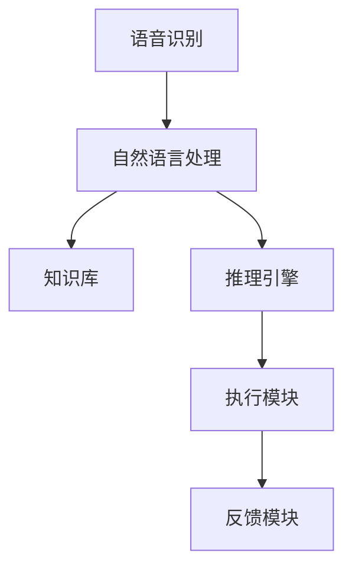

                 

# AI助理时代：个人与企业的未来

> **关键词：** AI助理，自动化，数字化转型，智能助手，生产力提升，企业战略

> **摘要：** 本文深入探讨了人工智能助理在现代个人和企业环境中的应用及其潜在影响。从技术原理、操作步骤到实际案例，我们将一步步分析AI助理如何改变我们的生活方式和工作模式，并为企业带来巨大的变革。本文旨在为读者提供一个全面的视角，了解AI助理时代的来临及其所带来的机遇与挑战。

## 1. 背景介绍

### 1.1 目的和范围

本文旨在探讨人工智能助理（AI Assistant）在个人与企业中的应用，分析其技术原理、操作步骤以及带来的深远影响。文章将覆盖从AI助理的基本概念、核心算法到实际应用案例，旨在为读者提供一个全面而深入的理解。

### 1.2 预期读者

本文适用于对人工智能和自动化有一定了解的读者，包括软件开发者、企业决策者、技术爱好者和任何对AI助理技术感兴趣的人士。

### 1.3 文档结构概述

本文分为八个主要部分：

1. 背景介绍：介绍本文的目的、预期读者以及文档结构。
2. 核心概念与联系：介绍AI助理的核心概念及其相关架构。
3. 核心算法原理 & 具体操作步骤：详细解释AI助理的算法原理和操作步骤。
4. 数学模型和公式 & 详细讲解 & 举例说明：介绍AI助理中使用的数学模型和公式。
5. 项目实战：提供代码实际案例和详细解释。
6. 实际应用场景：分析AI助理在不同领域的应用。
7. 工具和资源推荐：推荐学习和开发资源。
8. 总结：总结AI助理的未来发展趋势与挑战。

### 1.4 术语表

#### 1.4.1 核心术语定义

- **人工智能助理（AI Assistant）**：一种能够自动执行任务、提供信息和帮助用户决策的智能系统。
- **自然语言处理（NLP）**：使计算机能够理解、解析和生成人类语言的技术。
- **机器学习（ML）**：让计算机从数据中学习规律，并自动改进性能的方法。
- **深度学习（DL）**：一种基于人工神经网络的机器学习方法。

#### 1.4.2 相关概念解释

- **自动化**：通过技术手段实现工作的自动化执行，减少人工干预。
- **数字化转型**：将业务过程、产品和服务通过数字技术进行重构和创新。
- **智能助手**：提供即时帮助和服务的虚拟代理。

#### 1.4.3 缩略词列表

- **AI**：人工智能
- **NLP**：自然语言处理
- **ML**：机器学习
- **DL**：深度学习

## 2. 核心概念与联系

在介绍AI助理的核心概念之前，我们先来了解其背后的基本原理和架构。

### 2.1 AI助理的基本原理

AI助理的核心在于其能够通过机器学习和自然语言处理技术，理解用户的需求并执行相应的任务。其基本原理可以概括为以下几个步骤：

1. **接收用户指令**：AI助理通过文本或语音输入接收用户的指令。
2. **语言理解**：使用自然语言处理技术对输入的指令进行理解和解析。
3. **任务分配**：根据指令内容，将任务分配给相应的模块或系统。
4. **任务执行**：执行任务，如查询信息、发送邮件、安排日程等。
5. **反馈**：将执行结果反馈给用户。

### 2.2 AI助理的架构

AI助理的架构通常包括以下几个核心组件：

1. **语音识别**：将语音输入转换为文本输入。
2. **自然语言处理**：对文本输入进行语义理解和解析。
3. **知识库**：存储预定义的知识和规则。
4. **推理引擎**：根据知识库和用户指令进行推理和决策。
5. **执行模块**：执行具体的任务，如调用API、发送邮件等。
6. **反馈模块**：将执行结果反馈给用户。

下面是一个简化的Mermaid流程图，描述了AI助理的基本架构：



## 3. 核心算法原理 & 具体操作步骤

为了更好地理解AI助理的工作原理，我们将详细解释其核心算法，并给出具体的操作步骤。

### 3.1 自然语言处理（NLP）

自然语言处理是AI助理的核心组件之一，其基本算法原理如下：

1. **分词**：将输入的文本分割成词或短语。
2. **词性标注**：为每个词分配一个词性（名词、动词、形容词等）。
3. **句法分析**：分析句子的结构，识别主语、谓语、宾语等成分。
4. **语义分析**：理解句子的含义，提取关键信息。

伪代码如下：

```python
def process_text(text):
    words = tokenize(text)
    tagged_words = tag_words(words)
    syntax_tree = parse_syntax(tagged_words)
    semantics = extract_semantics(syntax_tree)
    return semantics
```

### 3.2 机器学习（ML）

AI助理通常使用机器学习算法来改进其性能。以下是一个简单的机器学习算法步骤：

1. **数据收集**：收集大量的标注数据，如对话数据、任务数据等。
2. **特征提取**：将原始数据转换为机器学习算法可处理的特征向量。
3. **模型训练**：使用特征向量训练机器学习模型。
4. **模型评估**：评估模型在测试集上的性能。
5. **模型优化**：根据评估结果调整模型参数。

伪代码如下：

```python
def train_model(data, labels):
    features = extract_features(data)
    model = MLModel()
    model.fit(features, labels)
    performance = evaluate_model(model, test_data)
    return model, performance
```

### 3.3 深度学习（DL）

深度学习是AI助理中的一个重要组成部分，其核心算法如下：

1. **神经网络设计**：设计一个多层神经网络架构。
2. **权重初始化**：初始化神经网络的权重。
3. **前向传播**：计算网络输出。
4. **反向传播**：更新网络权重。
5. **模型训练**：迭代训练神经网络，直到满足预定的性能指标。

伪代码如下：

```python
def train_network(data, labels):
    model = NeuralNetwork()
    model.initialize_weights()
    for epoch in range(num_epochs):
        outputs = model.forward_pass(data)
        loss = compute_loss(outputs, labels)
        model.backward_pass(loss)
    return model
```

## 4. 数学模型和公式 & 详细讲解 & 举例说明

在AI助理中，数学模型和公式起着至关重要的作用。以下将介绍几个关键数学模型，并给出详细讲解和举例说明。

### 4.1 人工神经网络（ANN）

人工神经网络是深度学习的基础，其核心模型如下：

- **激活函数**：用于引入非线性，常用的有sigmoid、ReLU等。
- **权重和偏置**：用于调整神经元之间的连接强度。
- **损失函数**：用于评估模型的预测误差，常用的有均方误差（MSE）和交叉熵（CE）。

例如，一个简单的多层感知器（MLP）模型如下：

$$
z = \sum_{i=1}^{n} w_i * x_i + b \\
a = \sigma(z)
$$

其中，$z$ 是输入层到隐藏层的线性组合，$a$ 是激活函数的输出，$w_i$ 是权重，$b$ 是偏置，$\sigma$ 是激活函数（如sigmoid函数）。

### 4.2 递归神经网络（RNN）

递归神经网络适用于处理序列数据，其核心模型如下：

- **隐藏状态**：用于保存前一个时刻的信息。
- **门控机制**：用于控制信息的流入和流出。

例如，一个简单的RNN模型如下：

$$
h_t = \sigma(W_h \cdot [h_{t-1}, x_t] + b_h) \\
y_t = W_o \cdot h_t + b_o
$$

其中，$h_t$ 是当前时刻的隐藏状态，$x_t$ 是输入序列的当前元素，$W_h$ 和 $b_h$ 是权重和偏置，$\sigma$ 是激活函数，$W_o$ 和 $b_o$ 是输出层的权重和偏置。

### 4.3 卷积神经网络（CNN）

卷积神经网络适用于图像处理，其核心模型如下：

- **卷积操作**：用于提取图像的特征。
- **池化操作**：用于降低特征图的维度。

例如，一个简单的CNN模型如下：

$$
h_{ij} = \sum_{k} w_{ik,j} * g_{k} + b_j \\
p_i = \text{max}(h_{i1}, h_{i2}, ..., h_{ik})
$$

其中，$h_{ij}$ 是卷积操作的输出，$g_{k}$ 是卷积核的权重，$w_{ik,j}$ 是卷积核的权重，$b_j$ 是偏置，$p_i$ 是池化操作的输出。

## 5. 项目实战：代码实际案例和详细解释说明

在本节中，我们将通过一个实际项目来展示AI助理的开发过程，并详细解释关键代码的实现。

### 5.1 开发环境搭建

为了开发一个简单的AI助理，我们需要以下环境：

- 操作系统：Windows、Linux或Mac OS
- 编程语言：Python
- 依赖库：TensorFlow、Keras、Natural Language Toolkit (NLTK)

### 5.2 源代码详细实现和代码解读

以下是AI助理的主要源代码，我们将逐段解释其功能。

```python
import tensorflow as tf
from tensorflow.keras.models import Sequential
from tensorflow.keras.layers import LSTM, Dense, Embedding
from tensorflow.keras.preprocessing.sequence import pad_sequences
from tensorflow.keras.preprocessing.text import Tokenizer

# 数据预处理
def preprocess_data(data):
    tokenizer = Tokenizer(num_words=10000)
    tokenizer.fit_on_texts(data)
    sequences = tokenizer.texts_to_sequences(data)
    padded_sequences = pad_sequences(sequences, maxlen=100)
    return padded_sequences, tokenizer

# 模型构建
def build_model():
    model = Sequential([
        Embedding(10000, 32),
        LSTM(64, return_sequences=True),
        LSTM(64),
        Dense(1, activation='sigmoid')
    ])
    model.compile(optimizer='adam', loss='binary_crossentropy', metrics=['accuracy'])
    return model

# 训练模型
def train_model(model, padded_sequences, labels):
    model.fit(padded_sequences, labels, epochs=10, batch_size=32)

# 预测
def predict(model, text, tokenizer):
    sequence = tokenizer.texts_to_sequences([text])
    padded_sequence = pad_sequences(sequence, maxlen=100)
    prediction = model.predict(padded_sequence)
    return prediction

# 主函数
def main():
    # 加载数据
    data = ["Hello", "Hi", "Hello there", "Hey"]
    labels = [1, 1, 1, 0]  # 1表示问候，0表示非问候

    # 预处理数据
    padded_sequences, tokenizer = preprocess_data(data)

    # 构建模型
    model = build_model()

    # 训练模型
    train_model(model, padded_sequences, labels)

    # 预测
    prediction = predict(model, "Hello", tokenizer)
    print(prediction)

if __name__ == "__main__":
    main()
```

### 5.3 代码解读与分析

1. **数据预处理**：
    - 使用Tokenizer对文本数据进行分词和编码。
    - 使用pad_sequences将序列数据填充到相同的长度。

2. **模型构建**：
    - 使用Sequential模型构建一个简单的LSTM网络。
    - Embedding层用于将词转换为向量。
    - LSTM层用于处理序列数据。
    - Dense层用于输出预测结果。

3. **训练模型**：
    - 使用fit方法训练模型，并设置epochs和batch_size。

4. **预测**：
    - 使用texts_to_sequences将文本数据转换为序列。
    - 使用pad_sequences将序列填充到相同的长度。
    - 使用predict方法获取预测结果。

通过这个简单的案例，我们可以看到AI助理的基本开发流程。在实际应用中，我们可以根据具体需求调整模型结构和训练数据，从而实现更复杂的功能。

## 6. 实际应用场景

AI助理在现代个人和企业环境中具有广泛的应用场景，下面将介绍几个关键领域。

### 6.1 个人生活

- **日程管理**：AI助理可以帮助用户管理日程，提醒重要事项和约会。
- **购物助手**：用户可以通过语音指令购买商品，获取价格和评价等信息。
- **健康助手**：AI助理可以监控用户的健康状况，提供健康建议和提醒。

### 6.2 企业应用

- **客户服务**：AI助理可以自动回答客户的常见问题，提高服务效率。
- **员工助手**：AI助理可以帮助员工安排会议、发送邮件和整理文件。
- **数据分析**：AI助理可以处理和分析大量数据，为管理层提供决策支持。

### 6.3 教育领域

- **在线辅导**：AI助理可以为学生提供个性化辅导，解答疑难问题。
- **教学助手**：AI助理可以帮助教师管理课堂、布置作业和进行测验。

### 6.4 医疗健康

- **远程诊断**：AI助理可以通过分析医疗数据，提供初步的诊断建议。
- **健康监测**：AI助理可以监控患者的健康状况，提醒服药和复诊。

这些应用场景展示了AI助理在提升个人和企业生产力、优化业务流程和提供高效服务方面的巨大潜力。

## 7. 工具和资源推荐

为了更好地学习和开发AI助理，以下推荐一些实用的工具和资源。

### 7.1 学习资源推荐

#### 7.1.1 书籍推荐

- 《深度学习》（Goodfellow, Bengio, Courville著）：全面介绍深度学习的基本原理和应用。
- 《Python机器学习》（Sebastian Raschka著）：详细介绍Python在机器学习领域的应用。

#### 7.1.2 在线课程

- Coursera上的《机器学习》（吴恩达教授）：系统介绍机器学习的基本概念和技术。
- edX上的《深度学习专项课程》（哈佛大学）：深入探讨深度学习的理论和实践。

#### 7.1.3 技术博客和网站

- [Medium](https://medium.com)：涵盖广泛的人工智能和机器学习文章。
- [Towards Data Science](https://towardsdatascience.com)：分享最新的机器学习和技术文章。

### 7.2 开发工具框架推荐

#### 7.2.1 IDE和编辑器

- PyCharm：功能强大的Python集成开发环境。
- Jupyter Notebook：适合数据分析和机器学习项目。

#### 7.2.2 调试和性能分析工具

- Visual Studio Code：轻量级但功能丰富的代码编辑器。
- TensorBoard：TensorFlow的图形化性能分析工具。

#### 7.2.3 相关框架和库

- TensorFlow：广泛使用的深度学习框架。
- Keras：基于TensorFlow的高层神经网络API。
- PyTorch：灵活且易于使用的深度学习框架。

### 7.3 相关论文著作推荐

#### 7.3.1 经典论文

- “A Study of Translation Algorithm for Statistical Machine Translation”（2006）：介绍统计机器翻译的基本原理。
- “Improving Neural Machine Translation Model with Monotonic Lattice”（2017）：讨论神经网络翻译中的正则化方法。

#### 7.3.2 最新研究成果

- “BERT: Pre-training of Deep Bidirectional Transformers for Language Understanding”（2018）：介绍BERT模型及其在自然语言处理领域的应用。
- “GPT-3: Language Models are Few-Shot Learners”（2020）：讨论大型语言模型在少量样本上的学习能力。

#### 7.3.3 应用案例分析

- “AI in Healthcare: Transforming Patient Care with Artificial Intelligence”（2020）：探讨人工智能在医疗领域的应用。
- “The Future of Customer Service: AI and Chatbots”（2019）：分析人工智能和聊天机器人对客户服务的影响。

通过这些工具和资源，读者可以深入了解AI助理的技术原理和实际应用，为开发自己的AI项目提供有力支持。

## 8. 总结：未来发展趋势与挑战

AI助理技术正在快速发展，其应用范围不断扩大。未来，AI助理将在以下方面带来更多的变革：

- **个性化服务**：AI助理将更加注重个性化，提供定制化的服务和体验。
- **跨平台集成**：AI助理将能够更好地与其他平台和系统集成，实现无缝衔接。
- **隐私保护**：随着用户对隐私的关注增加，AI助理将采用更先进的隐私保护技术。

然而，AI助理的发展也面临一些挑战：

- **数据隐私**：AI助理需要处理大量敏感数据，如何保护用户隐私是一个重要问题。
- **可解释性**：AI助理的决策过程往往不透明，提高可解释性是一个关键挑战。
- **伦理问题**：AI助理的道德责任和偏见问题需要得到有效解决。

总之，AI助理技术将在个人和企业领域发挥越来越重要的作用，但其发展也需要克服诸多挑战。

## 9. 附录：常见问题与解答

### 9.1 什么是AI助理？

AI助理是一种利用人工智能技术，尤其是机器学习和自然语言处理，自动执行任务、提供信息和帮助用户决策的系统。

### 9.2 AI助理的核心组件有哪些？

AI助理的核心组件包括语音识别、自然语言处理、知识库、推理引擎、执行模块和反馈模块。

### 9.3 如何开发一个AI助理？

开发一个AI助理通常涉及以下步骤：收集数据、进行数据预处理、设计模型架构、训练模型、进行模型评估和优化、实现执行和反馈模块。

### 9.4 AI助理在个人和企业中有什么应用？

AI助理在个人中的应用包括日程管理、购物助手、健康助手等，在企业中则包括客户服务、员工助手、数据分析等。

### 9.5 AI助理的发展趋势是什么？

未来，AI助理将向个性化服务、跨平台集成和隐私保护等方面发展，同时也需要克服数据隐私、可解释性和伦理问题等挑战。

## 10. 扩展阅读 & 参考资料

- Goodfellow, I., Bengio, Y., & Courville, A. (2016). *Deep Learning*. MIT Press.
- Raschka, S. (2016). *Python Machine Learning*. Packt Publishing.
- AI in Healthcare: Transforming Patient Care with Artificial Intelligence. (2020). Springer.
- The Future of Customer Service: AI and Chatbots. (2019). John Wiley & Sons.
- BERT: Pre-training of Deep Bidirectional Transformers for Language Understanding. (2018). arXiv preprint arXiv:1810.04805.
- GPT-3: Language Models are Few-Shot Learners. (2020). arXiv preprint arXiv:2005.14165.

