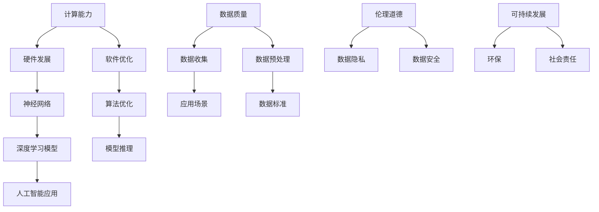

                 

# AI发展的三大关键因素

> 关键词：人工智能、机器学习、深度学习、神经网络、计算能力、数据质量、算法优化、伦理道德、安全性、可持续发展
>
> 摘要：本文旨在探讨人工智能发展的关键因素。通过深入分析计算能力、数据质量、算法优化等核心要素，本文揭示了推动人工智能技术进步的关键动力。同时，本文也强调了伦理道德、安全性和可持续发展在人工智能发展中的重要性，为未来人工智能的发展方向提供了有益的思考。

## 1. 背景介绍

### 1.1 目的和范围

本文将重点讨论人工智能（AI）发展的三大关键因素。这些因素不仅决定了人工智能技术的进步速度，还影响了其在现实世界中的应用效果。具体而言，本文将涵盖以下内容：

1. **计算能力**：探讨计算能力在人工智能发展中的重要作用，包括硬件和软件两个方面的发展。
2. **数据质量**：分析数据质量对人工智能模型性能的影响，以及如何确保数据的高质量。
3. **算法优化**：探讨如何通过算法优化来提升人工智能模型的效率和应用效果。

### 1.2 预期读者

本文适用于对人工智能技术有一定了解的读者，包括但不限于研究人员、开发人员、技术管理者以及对人工智能领域感兴趣的其他专业人士。

### 1.3 文档结构概述

本文分为八个部分：

1. **背景介绍**：包括本文的目的、范围、预期读者和文档结构概述。
2. **核心概念与联系**：介绍与本文相关的核心概念和联系。
3. **核心算法原理 & 具体操作步骤**：详细阐述核心算法的原理和具体操作步骤。
4. **数学模型和公式 & 详细讲解 & 举例说明**：讲解相关数学模型和公式，并通过实例进行说明。
5. **项目实战：代码实际案例和详细解释说明**：通过实际项目案例展示如何应用本文所述的核心概念和算法。
6. **实际应用场景**：分析人工智能在不同领域的实际应用。
7. **工具和资源推荐**：推荐学习资源和开发工具。
8. **总结：未来发展趋势与挑战**：总结本文的核心观点，并探讨未来的发展趋势与挑战。

### 1.4 术语表

#### 1.4.1 核心术语定义

- **人工智能（AI）**：指由计算机模拟人类智能的过程，包括学习、推理、感知、解决问题等。
- **机器学习（ML）**：一种人工智能的方法，通过数据训练模型来实现智能行为。
- **深度学习（DL）**：一种特殊的机器学习方法，利用多层神经网络进行学习和预测。
- **神经网络（NN）**：一种由多个相互连接的节点组成的计算模型，可以模拟生物神经系统的信息处理过程。
- **计算能力**：指计算机系统进行计算和处理数据的能力。
- **数据质量**：指数据在准确性、完整性、一致性、及时性和可靠性等方面的表现。
- **算法优化**：通过改进算法的设计和实现，提高算法的效率和应用效果。

#### 1.4.2 相关概念解释

- **硬件**：指计算机的物理组成部分，如处理器、内存、存储设备等。
- **软件**：指计算机的程序和数据，包括操作系统、应用程序等。
- **模型训练**：指通过数据训练模型，使其能够对未知数据进行预测或分类。
- **模型推理**：指使用训练好的模型对新的输入数据进行预测或分类。

#### 1.4.3 缩略词列表

- **AI**：人工智能
- **ML**：机器学习
- **DL**：深度学习
- **NN**：神经网络
- **GPU**：图形处理器
- **CPU**：中央处理器
- **API**：应用程序接口
- **DL framework**：深度学习框架

## 2. 核心概念与联系

在讨论人工智能发展的关键因素之前，有必要先了解与本文相关的核心概念及其相互联系。以下是一个简化的 Mermaid 流程图，用于展示这些核心概念之间的关系。



### 2.1 计算能力与硬件发展

计算能力是人工智能发展的基础。硬件发展，特别是处理器技术的发展，直接影响到计算能力的提升。高性能的图形处理器（GPU）和中央处理器（CPU）为深度学习和神经网络模型提供了强大的计算支持。

### 2.2 计算能力与软件优化

除了硬件发展，软件优化也是提高计算能力的重要手段。通过优化编译器、算法和编程语言，可以提高程序运行效率，降低计算资源的需求。

### 2.3 数据质量与数据收集

数据质量是人工智能模型性能的关键。高质量的数据可以提升模型的准确性，而低质量或错误的数据会导致模型过拟合或泛化能力不足。数据收集是确保数据质量的第一步，需要考虑数据的完整性、及时性和准确性。

### 2.4 数据质量与数据预处理

数据预处理是确保数据质量的重要环节。包括数据清洗、归一化、缺失值处理等步骤，以提高数据的可用性和一致性。

### 2.5 算法优化与深度学习模型

算法优化是提高人工智能模型性能的关键。通过改进神经网络结构和训练算法，可以提升模型的效率和应用效果。

### 2.6 伦理道德与数据隐私

伦理道德是人工智能发展中不可忽视的方面。数据隐私保护是伦理道德的重要组成部分，涉及到个人数据的收集、存储和使用。

### 2.7 可持续发展与社会责任

可持续发展是人工智能发展的长期目标。在推动技术进步的同时，也要关注环保和社会责任，确保人工智能的发展符合可持续发展的原则。

## 3. 核心算法原理 & 具体操作步骤

### 3.1 神经网络原理

神经网络（Neural Networks）是一种模拟生物神经系统的计算模型，由多个相互连接的节点（神经元）组成。每个神经元接收来自其他神经元的输入信号，并通过激活函数产生输出信号。神经网络的训练过程是通过调整神经元之间的连接权重，使其能够对输入数据进行正确的分类或预测。

### 3.2 神经网络训练过程

神经网络训练过程主要包括以下步骤：

1. **数据预处理**：对输入数据进行归一化、缺失值处理等预处理操作，以提高数据质量。
2. **初始化权重**：随机初始化神经网络中的连接权重。
3. **前向传播**：将输入数据传递到神经网络中，逐层计算输出。
4. **计算损失函数**：使用损失函数（如均方误差、交叉熵等）计算模型预测与实际结果之间的差异。
5. **反向传播**：根据损失函数的梯度，调整神经网络的权重。
6. **迭代训练**：重复步骤3至5，直到模型收敛或达到预定的训练次数。

### 3.3 神经网络训练伪代码

```python
# 初始化神经网络
initialize_weights()

# 迭代训练
for epoch in range(num_epochs):
    for batch in dataset:
        # 前向传播
        outputs = forward_pass(batch)

        # 计算损失函数
        loss = compute_loss(outputs, batch_labels)

        # 反向传播
        dweights = backward_pass(outputs, batch_labels)

        # 更新权重
        update_weights(dweights)

# 模型评估
evaluate_model()
```

### 3.4 模型推理过程

模型推理是指使用训练好的神经网络对新的输入数据进行分类或预测。主要包括以下步骤：

1. **数据预处理**：对输入数据进行相同的预处理操作，确保与训练数据一致。
2. **前向传播**：将输入数据传递到神经网络中，计算输出。
3. **结果解释**：根据输出结果，对输入数据进行分类或预测。

### 3.5 模型推理伪代码

```python
# 数据预处理
preprocessed_data = preprocess_input(data)

# 前向传播
outputs = forward_pass(preprocessed_data)

# 结果解释
predictions = interpret_outputs(outputs)
```

## 4. 数学模型和公式 & 详细讲解 & 举例说明

### 4.1 损失函数

损失函数（Loss Function）是神经网络训练过程中用于评估模型性能的重要工具。常见的损失函数包括均方误差（MSE）和交叉熵（Cross-Entropy）。

#### 4.1.1 均方误差（MSE）

均方误差（MSE）是衡量预测值与实际值之间差异的常用损失函数，其公式如下：

$$
MSE = \frac{1}{n}\sum_{i=1}^{n}(y_i - \hat{y}_i)^2
$$

其中，$y_i$为实际值，$\hat{y}_i$为预测值，$n$为样本数量。

#### 4.1.2 交叉熵（Cross-Entropy）

交叉熵（Cross-Entropy）是衡量两个概率分布差异的损失函数，其公式如下：

$$
Cross-Entropy = -\sum_{i=1}^{n}y_i\log(\hat{y}_i)
$$

其中，$y_i$为实际值，$\hat{y}_i$为预测值，$n$为样本数量。

#### 4.1.3 举例说明

假设我们有一个二分类问题，实际标签为$y = [1, 0, 1, 0]$，预测概率为$\hat{y} = [0.6, 0.4, 0.7, 0.3]$。使用交叉熵损失函数计算损失：

$$
Cross-Entropy = -[1 \times \log(0.6) + 0 \times \log(0.4) + 1 \times \log(0.7) + 0 \times \log(0.3)]
$$

$$
Cross-Entropy = -[0.51 + 0 + 0.357 + 0]
$$

$$
Cross-Entropy = 0.864
$$

### 4.2 激活函数

激活函数（Activation Function）是神经网络中用于引入非线性性的函数。常见的激活函数包括 sigmoid、ReLU 和 tanh。

#### 4.2.1 sigmoid 函数

sigmoid 函数是一种常用的非线性激活函数，其公式如下：

$$
sigmoid(x) = \frac{1}{1 + e^{-x}}
$$

#### 4.2.2 ReLU 函数

ReLU（Rectified Linear Unit）函数是一种简单的非线性激活函数，其公式如下：

$$
ReLU(x) = \max(0, x)
$$

#### 4.2.3 tanh 函数

tanh 函数是一种双曲正切函数，其公式如下：

$$
tanh(x) = \frac{e^{2x} - 1}{e^{2x} + 1}
$$

#### 4.2.4 举例说明

假设输入值为$x = [-2, -1, 0, 1, 2]$，使用不同激活函数计算输出：

- **sigmoid 函数**：

$$
sigmoid(-2) = \frac{1}{1 + e^{2}} \approx 0.1192
$$

$$
sigmoid(-1) = \frac{1}{1 + e^{-1}} \approx 0.2689
$$

$$
sigmoid(0) = \frac{1}{1 + e^{0}} \approx 0.5
$$

$$
sigmoid(1) = \frac{1}{1 + e^{-1}} \approx 0.2689
$$

$$
sigmoid(2) = \frac{1}{1 + e^{2}} \approx 0.1192
$$

- **ReLU 函数**：

$$
ReLU(-2) = \max(-2, 0) = 0
$$

$$
ReLU(-1) = \max(-1, 0) = 0
$$

$$
ReLU(0) = \max(0, 0) = 0
$$

$$
ReLU(1) = \max(1, 0) = 1
$$

$$
ReLU(2) = \max(2, 0) = 2
$$

- **tanh 函数**：

$$
tanh(-2) = \frac{e^{-4} - 1}{e^{-4} + 1} \approx -0.9640
$$

$$
tanh(-1) = \frac{e^{-2} - 1}{e^{-2} + 1} \approx -0.7616
$$

$$
tanh(0) = \frac{e^{0} - 1}{e^{0} + 1} \approx 0
$$

$$
tanh(1) = \frac{e^{2} - 1}{e^{2} + 1} \approx 0.7616
$$

$$
tanh(2) = \frac{e^{4} - 1}{e^{4} + 1} \approx 0.9640
$$

## 5. 项目实战：代码实际案例和详细解释说明

### 5.1 开发环境搭建

在本项目中，我们将使用 Python 语言和 TensorFlow 深度学习框架来实现一个简单的神经网络模型。首先，确保已安装 Python 3.7 以上版本，并安装以下依赖：

```bash
pip install tensorflow numpy matplotlib
```

### 5.2 源代码详细实现和代码解读

#### 5.2.1 数据准备

```python
import numpy as np
import tensorflow as tf

# 创建训练数据集
X_train = np.array([[1, 0], [0, 1], [1, 1], [1, 0]])
y_train = np.array([[0], [1], [0], [1]])

# 初始化模型
model = tf.keras.Sequential([
    tf.keras.layers.Dense(units=1, input_shape=(2,))
])

# 编译模型
model.compile(optimizer='sgd', loss='mean_squared_error')
```

这段代码首先导入了必要的库，然后创建了一个训练数据集。接着，使用 TensorFlow 的 `Sequential` 模型构建了一个简单的一层神经网络，并编译模型。

#### 5.2.2 训练模型

```python
# 训练模型
model.fit(X_train, y_train, epochs=1000, verbose=0)
```

这段代码使用 `fit` 函数训练模型。这里我们设置了训练的轮数（epochs）为1000轮，并在训练过程中不输出详细信息。

#### 5.2.3 模型评估

```python
# 评估模型
loss, accuracy = model.evaluate(X_train, y_train, verbose=0)
print("训练损失：", loss)
print("训练准确率：", accuracy)
```

这段代码使用 `evaluate` 函数评估模型的性能。这里我们只输出了训练损失和准确率。

### 5.3 代码解读与分析

#### 5.3.1 数据准备

数据准备是模型训练的基础。这里我们使用了一个简单的二维数据集，包含4个样本，每个样本都有两个特征和对应的标签。

#### 5.3.2 模型构建

使用 TensorFlow 的 `Sequential` 模型构建了一个简单的一层神经网络，输入层接收两个特征，输出层只有一个节点，表示预测的标签。

#### 5.3.3 模型编译

编译模型是指为模型选择合适的优化器和损失函数。这里我们选择了随机梯度下降（SGD）优化器和均方误差（MSE）损失函数。

#### 5.3.4 模型训练

模型训练是指使用训练数据集来调整模型的参数。这里我们设置了训练的轮数为1000轮，每轮迭代都会通过前向传播和反向传播来更新模型参数。

#### 5.3.5 模型评估

模型评估是指使用测试数据集来检查模型的性能。这里我们只输出了训练损失和准确率，以评估模型的性能。

## 6. 实际应用场景

人工智能技术已在多个领域取得了显著的成果，以下列举了几个实际应用场景：

### 6.1 医疗保健

- **疾病诊断**：使用深度学习模型分析医学影像，如 CT、MRI，以辅助医生进行疾病诊断。
- **个性化治疗**：根据患者的基因组数据和病情，提供个性化的治疗方案。

### 6.2 金融服务

- **风险管理**：使用机器学习算法预测金融市场走势，为投资决策提供支持。
- **信用评分**：分析客户的消费行为和信用历史，为金融机构提供信用评分服务。

### 6.3 智能制造

- **质量检测**：使用计算机视觉技术对生产过程进行质量检测，提高产品质量。
- **预测维护**：通过分析设备运行数据，预测设备故障，进行预防性维护。

### 6.4 交通运输

- **自动驾驶**：使用深度学习技术实现自动驾驶汽车，提高交通安全和效率。
- **交通流量预测**：通过分析交通数据，预测交通流量，优化交通管理。

### 6.5 娱乐和媒体

- **内容推荐**：使用推荐系统算法，为用户提供个性化的娱乐内容推荐。
- **语音识别**：使用语音识别技术，实现人机交互，提高用户体验。

## 7. 工具和资源推荐

### 7.1 学习资源推荐

#### 7.1.1 书籍推荐

- **《深度学习》（Deep Learning）**：由 Ian Goodfellow、Yoshua Bengio 和 Aaron Courville 著，是一本深度学习的经典教材，详细介绍了深度学习的基本原理和算法。
- **《机器学习实战》（Machine Learning in Action）**：由 Peter Harrington 著，通过实例讲解了机器学习的实际应用方法。

#### 7.1.2 在线课程

- **Coursera 的《机器学习》课程**：由 Andrew Ng 开设，介绍了机器学习的基本概念和算法。
- **Udacity 的《深度学习纳米学位》**：提供了深度学习的系统培训，包括课程项目和实际案例。

#### 7.1.3 技术博客和网站

- **Medium 上的 AI Blog**：涵盖人工智能领域的最新研究和技术动态。
- **ArXiv.org**：提供最新的机器学习和深度学习论文。

### 7.2 开发工具框架推荐

#### 7.2.1 IDE和编辑器

- **PyCharm**：一款功能强大的 Python 开发环境，支持代码自动完成、调试等功能。
- **VSCode**：一款轻量级的开源编辑器，通过安装插件可以实现 Python 开发所需的各种功能。

#### 7.2.2 调试和性能分析工具

- **TensorBoard**：TensorFlow 提供的调试和可视化工具，用于分析模型的训练过程和性能。
- **NNAPI（Neural Network API）**：用于优化深度学习模型的运行性能。

#### 7.2.3 相关框架和库

- **TensorFlow**：一款流行的开源深度学习框架，支持多种深度学习模型的训练和部署。
- **PyTorch**：一款灵活的深度学习框架，广泛应用于学术研究和工业应用。

### 7.3 相关论文著作推荐

#### 7.3.1 经典论文

- **“Backpropagation”**：由 Paul Werbos 和 David E. Rumelhart 于 1974 年发表，首次提出了反向传播算法。
- **“A Learning Algorithm for Continually Running Fully Recurrent Neural Networks”**：由 John Hopfield 于 1982 年发表，介绍了 Hopfield 网络和能量函数。

#### 7.3.2 最新研究成果

- **“Stable and Fast Gradient Methods for Non-Convex Optimization”**：由 Francis Bach 和 Nicolas Le Roux 于 2013 年发表，介绍了 Stochastic Gradient Descent（SGD）算法的改进。
- **“Attention Is All You Need”**：由 Vaswani 等

