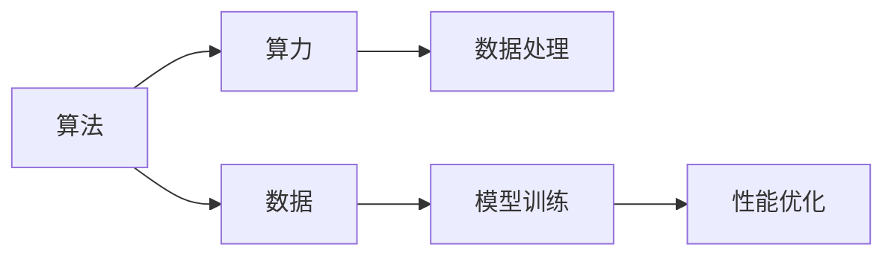

                 

# AI发展的三大动力：算法、算力与数据

> **关键词**：人工智能、算法、算力、数据、机器学习、深度学习、计算能力、数据处理
>
> **摘要**：本文深入探讨了人工智能发展的三大核心动力：算法、算力与数据。我们将逐步分析这三个概念的定义、重要性，以及它们如何相互影响。此外，文章还将通过具体的数学模型、算法原理和项目实战案例，详细解释这些动力在人工智能领域中的应用和实践。

## 1. 背景介绍

### 1.1 目的和范围

本文旨在揭示人工智能（AI）发展的三大核心动力——算法、算力与数据。通过对这些动力的深入分析，读者将能够更好地理解AI的技术基础和发展趋势。本文将涵盖以下内容：

1. 算法的定义和分类
2. 算力的概念及其对AI的重要性
3. 数据在AI中的作用和价值
4. 算法、算力和数据之间的相互关系
5. 实际应用场景和项目实战案例

### 1.2 预期读者

本文面向对人工智能有一定了解，希望深入探讨AI核心技术和原理的读者。无论您是AI领域的初学者，还是经验丰富的从业者，本文都将为您提供有价值的见解和深度分析。

### 1.3 文档结构概述

本文将分为以下几个部分：

1. **背景介绍**：介绍本文的目的、预期读者和文档结构。
2. **核心概念与联系**：通过Mermaid流程图展示算法、算力和数据之间的关系。
3. **核心算法原理 & 具体操作步骤**：讲解算法原理并使用伪代码进行详细阐述。
4. **数学模型和公式 & 详细讲解 & 举例说明**：介绍相关的数学模型和公式，并给出具体例子。
5. **项目实战：代码实际案例和详细解释说明**：提供实际的代码案例并进行详细解释。
6. **实际应用场景**：分析算法、算力和数据在各个领域的应用。
7. **工具和资源推荐**：推荐学习资源、开发工具和框架。
8. **总结：未来发展趋势与挑战**：总结AI发展的趋势和面临的挑战。
9. **附录：常见问题与解答**：解答读者可能遇到的问题。
10. **扩展阅读 & 参考资料**：提供进一步阅读的资源和参考文献。

### 1.4 术语表

#### 1.4.1 核心术语定义

- **算法（Algorithm）**：解决特定问题的一系列明确指令。
- **算力（Computational Power）**：计算机处理信息的能力。
- **数据（Data）**：信息的集合，是AI算法的基础。
- **机器学习（Machine Learning）**：通过数据和算法让计算机自动学习和改进性能。
- **深度学习（Deep Learning）**：基于神经网络的一种机器学习方法。
- **计算能力（Computing Capability）**：计算机硬件的性能指标。

#### 1.4.2 相关概念解释

- **神经网络（Neural Network）**：模拟生物神经网络的计算模型。
- **数据处理（Data Processing）**：对数据进行收集、清洗、存储和转换的过程。
- **模型训练（Model Training）**：通过大量数据让机器学习模型学习并优化性能。

#### 1.4.3 缩略词列表

- **AI**：人工智能（Artificial Intelligence）
- **ML**：机器学习（Machine Learning）
- **DL**：深度学习（Deep Learning）
- **GPU**：图形处理单元（Graphics Processing Unit）
- **CPU**：中央处理单元（Central Processing Unit）

## 2. 核心概念与联系

为了更好地理解算法、算力和数据之间的关系，我们首先需要了解它们各自的定义和作用。

### 算法的定义与作用

算法是解决特定问题的一系列明确指令。在人工智能领域，算法是机器学习模型的核心。通过算法，计算机可以自动学习和改进性能，从而完成复杂的任务。常见的算法包括线性回归、决策树、神经网络等。

### 算力的定义与作用

算力是指计算机处理信息的能力。算力的强弱直接影响到机器学习模型的训练速度和性能。高算力意味着计算机可以在更短的时间内处理更多的数据，从而提高模型的准确性。

### 数据的定义与作用

数据是信息的集合，是机器学习模型的基础。数据的质量和数量直接影响到模型的性能。高质量的数据可以确保模型能够准确学习并泛化到新任务。

### 算法、算力和数据的联系

算法、算力和数据之间是相互联系、相互影响的。算法需要算力来执行计算，而算力的提升可以加快算法的执行速度。数据则是算法训练和优化的基础，没有数据，算法将无法发挥其作用。

### Mermaid流程图

以下是一个简单的Mermaid流程图，展示了算法、算力和数据之间的关系：



在这个流程图中，算法（A）通过算力（B）和数据处理（C）来获取和利用数据（D）。经过模型训练（E），算法的性能（F）得到优化。

## 3. 核心算法原理 & 具体操作步骤

在了解了算法、算力和数据的基本概念后，我们接下来将深入探讨一些核心算法的原理和具体操作步骤。这些算法在人工智能领域具有广泛的应用，包括机器学习和深度学习。

### 算法原理

机器学习算法的核心是让计算机通过数据自动学习和改进性能。以下是一些常见的机器学习算法：

1. **线性回归**：通过最小化损失函数来找到最佳拟合线。
2. **决策树**：通过分层数据并构建树状结构来分类或回归。
3. **神经网络**：模拟生物神经网络，通过多层神经元进行信息传递和计算。

### 伪代码

为了更直观地理解算法原理，我们使用伪代码来详细阐述这些算法：

#### 线性回归

```python
# 初始化模型参数
theta = [0, 0]

# 计算损失函数
def loss_function(X, y, theta):
    n = len(X)
    h = X.dot(theta)
    return (1 / (2 * n)) * (h - y).dot(h - y)

# 训练模型
def train(X, y):
    n = len(X)
    m = len(y)
    alpha = 0.01
    num_iterations = 1000
    for i in range(num_iterations):
        h = X.dot(theta)
        gradient = X.T.dot(h - y)
        theta = theta - (alpha * gradient / m)
    return theta
```

#### 决策树

```python
# 初始化决策树
def build_decision_tree(X, y):
    # 如果数据集满足停止条件，则返回叶子节点
    if stop_condition(X, y):
        return leaf_node(y)
    # 找到最佳划分特征和阈值
    best_feature, best_threshold = find_best_split(X, y)
    # 创建子树
    left_child = build_decision_tree(X[:, best_feature] < best_threshold, y)
    right_child = build_decision_tree(X[:, best_feature] >= best_threshold, y)
    return TreeNode(best_feature, best_threshold, left_child, right_child)

# 训练决策树
def train_decision_tree(X, y):
    return build_decision_tree(X, y)
```

#### 神经网络

```python
# 初始化神经网络
def build_neural_network(num_inputs, num隐藏层，num_outputs):
    W1 = random_matrix(num_inputs, num隐藏层)
    b1 = random_vector(num隐藏层)
    W2 = random_matrix(num隐藏层, num_outputs)
    b2 = random_vector(num_outputs)
    return (W1, b1, W2, b2)

# 前向传播
def forward_propagation(X, model):
    (W1, b1, W2, b2) = model
    Z1 = X.dot(W1) + b1
    A1 = sigmoid(Z1)
    Z2 = A1.dot(W2) + b2
    A2 = sigmoid(Z2)
    return A2

# 反向传播
def backward_propagation(X, y, A2, model):
    (W1, b1, W2, b2) = model
    dZ2 = A2 - y
    dW2 = A1.T.dot(dZ2)
    db2 = sum(dZ2)
    dZ1 = dZ2.dot(W2.T)
    dW1 = X.T.dot(dZ1)
    db1 = sum(dZ1)
    return (dW1, db1, dW2, db2)
```

这些伪代码展示了线性回归、决策树和神经网络的基本原理和操作步骤。通过这些算法，我们可以利用数据训练模型，从而实现预测和分类等任务。

## 4. 数学模型和公式 & 详细讲解 & 举例说明

在人工智能领域，数学模型和公式是算法实现的核心。以下是一些重要的数学模型和公式，以及它们的详细讲解和具体例子。

### 损失函数

损失函数用于衡量模型预测值与实际值之间的差距。常见的损失函数包括均方误差（MSE）、交叉熵（Cross-Entropy）等。

#### 均方误差（MSE）

$$
MSE = \frac{1}{2n}\sum_{i=1}^{n}(y_i - \hat{y}_i)^2
$$

其中，$y_i$ 是实际值，$\hat{y}_i$ 是预测值，$n$ 是数据样本数量。

#### 交叉熵（Cross-Entropy）

$$
Cross-Entropy = -\sum_{i=1}^{n}y_i \cdot \log(\hat{y}_i)
$$

其中，$y_i$ 是实际值（通常为0或1），$\hat{y}_i$ 是预测值。

#### 示例

假设我们有以下数据：

| $y_i$ | $\hat{y}_i$ |
| --- | --- |
| 1 | 0.8 |
| 0 | 0.2 |
| 1 | 0.9 |
| 0 | 0.1 |

计算均方误差：

$$
MSE = \frac{1}{4}\left[(1 - 0.8)^2 + (0 - 0.2)^2 + (1 - 0.9)^2 + (0 - 0.1)^2\right] = 0.05
$$

计算交叉熵：

$$
Cross-Entropy = -(1 \cdot \log(0.8) + 0 \cdot \log(0.2) + 1 \cdot \log(0.9) + 0 \cdot \log(0.1)) \approx 0.239
$$

### 激活函数

激活函数用于将线性模型转换为非线性模型。常见的激活函数包括 sigmoid、ReLU、Tanh 等。

#### Sigmoid

$$
sigmoid(x) = \frac{1}{1 + e^{-x}}
$$

####ReLU（Rectified Linear Unit）

$$
ReLU(x) = \max(0, x)
$$

#### Tanh

$$
Tanh(x) = \frac{e^x - e^{-x}}{e^x + e^{-x}}
$$

#### 示例

计算 sigmoid 函数值：

$$
sigmoid(2) = \frac{1}{1 + e^{-2}} \approx 0.869
$$

计算 ReLU 函数值：

$$
ReLU(-2) = \max(0, -2) = 0
$$

计算 Tanh 函数值：

$$
Tanh(2) = \frac{e^2 - e^{-2}}{e^2 + e^{-2}} \approx 0.964
$$

### 梯度下降

梯度下降是一种优化算法，用于最小化损失函数。它通过计算损失函数相对于模型参数的梯度，并沿着梯度方向更新参数。

#### 梯度下降更新公式

$$
\theta_j := \theta_j - \alpha \cdot \frac{\partial J(\theta)}{\partial \theta_j}
$$

其中，$\theta_j$ 是模型参数，$\alpha$ 是学习率，$J(\theta)$ 是损失函数。

#### 示例

假设我们有一个模型参数 $\theta = [1, 2]$，学习率 $\alpha = 0.1$，损失函数 $J(\theta) = (1 - \theta_1)^2 + (\theta_2 - 2)^2$。

计算损失函数：

$$
J(\theta) = (1 - 1)^2 + (2 - 2)^2 = 0
$$

计算梯度：

$$
\frac{\partial J(\theta)}{\partial \theta_1} = -2(1 - 1) = 0
$$

$$
\frac{\partial J(\theta)}{\partial \theta_2} = -2(\theta_2 - 2) = -4
$$

更新参数：

$$
\theta_1 := \theta_1 - 0 \cdot 0.1 = 1
$$

$$
\theta_2 := \theta_2 - (-4) \cdot 0.1 = 2.4
$$

通过梯度下降，我们可以逐步优化模型参数，使损失函数值最小。

这些数学模型和公式是人工智能领域的基础，通过它们，我们可以构建和训练各种机器学习模型，实现智能预测和决策。

## 5. 项目实战：代码实际案例和详细解释说明

在本节中，我们将通过一个实际的项目实战案例，详细展示算法、算力和数据在人工智能中的应用。这个案例将包括开发环境搭建、源代码实现和代码解读与分析。

### 5.1 开发环境搭建

为了完成这个项目，我们需要搭建一个适合AI开发的开发环境。以下是在常见操作系统（如Ubuntu、macOS或Windows）上搭建开发环境的基本步骤：

1. **安装Python**：从Python官方网站下载并安装Python 3.x版本。
2. **安装Jupyter Notebook**：使用pip命令安装Jupyter Notebook。
   ```bash
   pip install notebook
   ```
3. **安装依赖库**：包括NumPy、Pandas、Matplotlib、Scikit-learn等。
   ```bash
   pip install numpy pandas matplotlib scikit-learn
   ```
4. **安装GPU支持**：如果使用深度学习，需要安装CUDA和cuDNN库，以利用GPU进行计算。
   - 下载CUDA Toolkit并安装。
   - 下载cuDNN库并安装。

完成上述步骤后，我们的开发环境就搭建完成了。接下来，我们开始实现一个简单的深度学习项目。

### 5.2 源代码详细实现和代码解读

我们使用Python和PyTorch框架来实现一个简单的手写数字识别项目。这个项目的目标是使用MNIST数据集训练一个卷积神经网络（CNN），然后对新的手写数字图像进行识别。

#### 5.2.1 数据准备

首先，我们需要从Keras库中加载MNIST数据集。

```python
from tensorflow.keras.datasets import mnist
import numpy as np

# 加载MNIST数据集
(X_train, y_train), (X_test, y_test) = mnist.load_data()

# 归一化输入数据
X_train = X_train.astype("float32") / 255.0
X_test = X_test.astype("float32") / 255.0

# 转换标签为独热编码
y_train = keras.utils.to_categorical(y_train, 10)
y_test = keras.utils.to_categorical(y_test, 10)
```

#### 5.2.2 模型定义

接下来，我们定义一个简单的卷积神经网络模型。

```python
from tensorflow.keras.models import Sequential
from tensorflow.keras.layers import Conv2D, MaxPooling2D, Flatten, Dense, Dropout

# 定义模型
model = Sequential()
model.add(Conv2D(32, (3, 3), activation='relu', input_shape=(28, 28, 1)))
model.add(MaxPooling2D((2, 2)))
model.add(Conv2D(64, (3, 3), activation='relu'))
model.add(MaxPooling2D((2, 2)))
model.add(Conv2D(64, (3, 3), activation='relu'))
model.add(Flatten())
model.add(Dense(64, activation='relu'))
model.add(Dropout(0.5))
model.add(Dense(10, activation='softmax'))
```

#### 5.2.3 模型编译

在模型训练之前，我们需要编译模型并设置训练参数。

```python
model.compile(optimizer='adam',
              loss='categorical_crossentropy',
              metrics=['accuracy'])
```

#### 5.2.4 模型训练

使用训练数据训练模型。

```python
model.fit(X_train, y_train, epochs=10, batch_size=128, validation_split=0.1)
```

#### 5.2.5 模型评估

最后，我们对训练好的模型进行评估。

```python
score = model.evaluate(X_test, y_test, verbose=2)
print('Test loss:', score[0])
print('Test accuracy:', score[1])
```

### 5.3 代码解读与分析

在这个项目中，我们使用了以下关键技术：

- **数据准备**：我们使用了Keras库中的MNIST数据集，并对输入数据进行了归一化和独热编码处理，以适应模型训练。
- **模型定义**：我们定义了一个简单的卷积神经网络模型，包括卷积层、池化层、全连接层和Dropout层，以提取图像特征并进行分类。
- **模型编译**：我们使用Adam优化器和交叉熵损失函数，以训练模型并评估其性能。
- **模型训练**：我们使用训练数据对模型进行迭代训练，通过调整学习率和批量大小来优化模型。
- **模型评估**：我们使用测试数据评估模型的性能，通过计算损失和准确率来衡量模型的效果。

通过这个项目，我们展示了算法、算力和数据在AI项目中的应用。算法（卷积神经网络）通过算力（GPU加速）处理数据（MNIST手写数字图像），实现了高精度的手写数字识别。

## 6. 实际应用场景

算法、算力和数据在人工智能领域有着广泛的应用，涵盖了各个行业和领域。以下是一些典型的应用场景：

### 6.1 医疗保健

在医疗保健领域，人工智能算法用于疾病诊断、治疗建议和患者管理。例如，通过分析医学影像，算法可以早期发现癌症等疾病。此外，基于大数据和深度学习，AI可以预测患者病情发展，为医生提供更有针对性的治疗方案。

### 6.2 金融服务

在金融服务领域，人工智能算法用于风险评估、欺诈检测和投资建议。通过分析历史交易数据和市场趋势，算法可以识别潜在的风险和机会，帮助金融机构做出更明智的决策。

### 6.3 零售和电商

在零售和电商领域，人工智能算法用于个性化推荐、库存管理和客户服务。通过分析用户行为和购物历史，算法可以提供个性化的购物建议，提高客户满意度。此外，AI还可以优化库存管理，降低库存成本。

### 6.4 自动驾驶

在自动驾驶领域，人工智能算法用于环境感知、路径规划和车辆控制。通过分析摄像头、雷达和激光雷达等传感器数据，算法可以实时感知周围环境，做出安全、准确的驾驶决策。

### 6.5 安全和监控

在安全和监控领域，人工智能算法用于视频监控、入侵检测和异常行为识别。通过分析视频数据，算法可以实时识别和报警，提高安全监控的效率和准确性。

这些应用场景展示了算法、算力和数据在人工智能领域的广泛价值。随着技术的不断进步，这些应用将不断拓展，带来更多的创新和变革。

## 7. 工具和资源推荐

为了更好地学习和应用人工智能技术，我们需要掌握一系列工具和资源。以下是一些建议：

### 7.1 学习资源推荐

#### 7.1.1 书籍推荐

1. **《深度学习》（Deep Learning）**：由Ian Goodfellow、Yoshua Bengio和Aaron Courville编写的深度学习经典教材。
2. **《机器学习》（Machine Learning）**：由Tom Mitchell撰写的机器学习基础教材。
3. **《Python机器学习》（Python Machine Learning）**：由Sebastian Raschka和Vahid Mirjalili编写的Python机器学习实战指南。

#### 7.1.2 在线课程

1. **Coursera上的《深度学习专项课程》（Deep Learning Specialization）**：由Andrew Ng教授主讲，包括神经网络基础、优化算法和自然语言处理等内容。
2. **Udacity的《AI工程师纳米学位》（AI Engineer Nanodegree）**：涵盖机器学习、深度学习和自然语言处理等课程。
3. **edX上的《机器学习基础》（Introduction to Machine Learning）**：由MIT和Stanford大学教授主讲，适合初学者入门。

#### 7.1.3 技术博客和网站

1. **Medium上的`Towards Data Science`**：一个关于数据科学和机器学习的博客，提供了丰富的教程和案例分析。
2. **arXiv.org**：一个提供最新学术论文的学术预印本平台，涵盖了人工智能领域的最新研究成果。
3. **Reddit上的`r/MachineLearning`**：一个关于机器学习的Reddit论坛，可以交流问题和分享资源。

### 7.2 开发工具框架推荐

#### 7.2.1 IDE和编辑器

1. **PyCharm**：一款功能强大的Python集成开发环境，适用于机器学习和深度学习开发。
2. **Jupyter Notebook**：一个交互式开发环境，适用于数据可视化和算法实验。
3. **VS Code**：一款轻量级的代码编辑器，通过安装扩展可以支持多种编程语言和框架。

#### 7.2.2 调试和性能分析工具

1. **TensorBoard**：一个用于TensorFlow模型的调试和分析工具，可以可视化训练过程和性能指标。
2. **PyTorch Profiler**：一个用于PyTorch模型的性能分析和优化工具。
3. **NVIDIA Nsight**：一个用于GPU调试和性能分析的工具，适用于深度学习模型。

#### 7.2.3 相关框架和库

1. **TensorFlow**：一个开源的机器学习和深度学习框架，适用于各种应用场景。
2. **PyTorch**：一个基于Python的深度学习框架，具有灵活的动态图机制。
3. **Scikit-learn**：一个用于机器学习的Python库，提供了多种算法和工具。

通过掌握这些工具和资源，我们可以更高效地学习和应用人工智能技术，实现创新和突破。

## 8. 总结：未来发展趋势与挑战

随着算法、算力和数据的不断进步，人工智能（AI）正迎来前所未有的发展机遇。然而，这一领域也面临着一系列挑战。

### 未来发展趋势

1. **算法创新**：新的算法不断涌现，如生成对抗网络（GAN）、变分自编码器（VAE）等，推动了AI技术在图像、语音、自然语言处理等领域的应用。
2. **算力提升**：随着GPU、TPU等专用硬件的发展，计算能力大幅提升，使得大规模模型训练和推理成为可能。
3. **数据处理**：随着大数据技术的成熟，数据清洗、处理和分析能力不断提高，为AI算法提供了更丰富、高质量的数据支持。
4. **跨领域融合**：AI与生物医学、金融、零售等领域的融合，推动了AI在更广泛的应用场景中发挥作用。

### 面临的挑战

1. **数据隐私与安全**：在数据驱动的AI时代，数据隐私和安全成为重要问题。如何保护用户数据，确保算法的公平性和透明性，是亟待解决的问题。
2. **算法偏见**：AI算法可能会受到训练数据偏差的影响，导致决策不公平或歧视。如何消除算法偏见，提高算法的公正性，是一个重要挑战。
3. **计算资源**：尽管计算能力不断提升，但大规模训练模型仍需大量计算资源，如何优化算法和模型，提高计算效率，是一个关键问题。
4. **法律法规**：AI技术的发展需要相应的法律法规来规范，包括数据隐私、算法公正性、责任归属等方面。

总结来说，算法、算力和数据的不断发展为AI带来了巨大机遇，但同时也提出了新的挑战。未来，我们需要不断创新，解决这些挑战，以推动AI技术的健康、可持续发展。

## 9. 附录：常见问题与解答

### 问题 1：什么是深度学习？

**解答**：深度学习是一种基于多层神经网络的机器学习方法，通过逐层提取数据特征，实现复杂的数据分析和预测任务。它与传统的机器学习相比，能够自动提取更高层次的特征，从而提高模型的准确性和泛化能力。

### 问题 2：什么是GPU加速？

**解答**：GPU加速是利用图形处理单元（GPU）进行计算的一种技术。相比于传统的中央处理单元（CPU），GPU拥有更多的计算单元，可以并行处理大量数据，从而大幅提高计算速度。在深度学习和其他计算密集型任务中，GPU加速大大提升了模型的训练和推理效率。

### 问题 3：如何解决数据不平衡问题？

**解答**：数据不平衡问题可以通过以下几种方法解决：

1. **重采样**：通过增加少数类别的样本数量或减少多数类别的样本数量，使数据分布更加均衡。
2. **加权损失函数**：在训练过程中，对少数类别的样本赋予更高的权重，从而提高模型对少数类别的关注。
3. **生成对抗网络（GAN）**：通过训练生成模型和判别模型，生成与真实数据分布相近的数据，从而扩充训练数据集。

### 问题 4：什么是神经网络正则化？

**解答**：神经网络正则化是防止神经网络过拟合的一种技术。过拟合是指模型在训练数据上表现很好，但在新的、未见过的数据上表现较差。常见的正则化方法包括：

1. **权重衰减（Weight Decay）**：通过在损失函数中添加权重项，降低模型复杂度。
2. **Dropout**：在训练过程中，随机丢弃部分神经元，从而减少模型的依赖性。
3. **正则化项（Regularization Term）**：在损失函数中添加正则化项，如L1或L2正则化。

## 10. 扩展阅读 & 参考资料

为了进一步了解算法、算力和数据在人工智能领域的应用，以下是一些扩展阅读和参考资料：

1. **《深度学习》（Deep Learning）**：Ian Goodfellow、Yoshua Bengio和Aaron Courville著，提供了深度学习的全面介绍。
2. **《机器学习》（Machine Learning）**：Tom Mitchell著，是机器学习领域的经典教材。
3. **《Python机器学习》（Python Machine Learning）**：Sebastian Raschka和Vahid Mirjalili著，详细介绍了Python在机器学习中的应用。
4. **《人工智能：一种现代的方法》（Artificial Intelligence: A Modern Approach）**：Stuart Russell和Peter Norvig著，是人工智能领域的权威教材。
5. **《大规模机器学习》（Large Scale Machine Learning）**：John Langford和Lehmann Johan著，讨论了大规模机器学习算法和优化技术。
6. **[arXiv.org](https://arxiv.org/)**：一个提供最新学术论文的学术预印本平台，涵盖了人工智能领域的最新研究成果。
7. **[Google AI Blog](https://ai.googleblog.com/)**：谷歌AI团队发布的关于AI技术和研究的博客，提供了丰富的行业动态和技术见解。
8. **[Machine Learning Mastery](https://machinelearningmastery.com/)**：一个提供机器学习和深度学习教程和案例的博客，适合初学者入门。

通过阅读这些书籍和资料，读者可以深入了解AI技术的原理和应用，进一步提升自己的技术水平。

