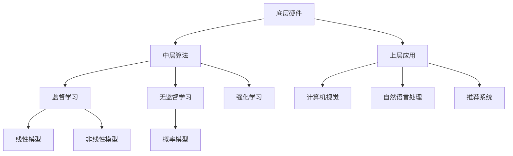

                 

# AI国家战略：AI底层创新体系建设

> **关键词：** AI国家战略、底层创新、技术架构、算法优化、数学模型、实战案例

> **摘要：** 本文深入探讨了AI国家战略中底层创新体系建设的重要性，包括核心概念、算法原理、数学模型以及实际应用。通过剖析AI底层技术，为我国AI产业的未来发展提供有益的思路和指导。

## 1. 背景介绍

### 1.1 目的和范围

本文旨在解析AI国家战略中的底层创新体系建设，探讨其核心概念、算法原理、数学模型以及实际应用。我们希望通过本文，帮助读者了解AI底层技术的本质，掌握其发展脉络，为我国AI产业的创新和突破提供支持。

### 1.2 预期读者

本文适合具有计算机编程基础，对AI技术有一定了解的读者。无论是研究者、开发者，还是对AI技术感兴趣的从业者，都可以通过本文获得有益的知识和启发。

### 1.3 文档结构概述

本文分为十个部分：

1. 背景介绍
2. 核心概念与联系
3. 核心算法原理 & 具体操作步骤
4. 数学模型和公式 & 详细讲解 & 举例说明
5. 项目实战：代码实际案例和详细解释说明
6. 实际应用场景
7. 工具和资源推荐
8. 总结：未来发展趋势与挑战
9. 附录：常见问题与解答
10. 扩展阅读 & 参考资料

### 1.4 术语表

#### 1.4.1 核心术语定义

- **AI国家战略**：指国家层面针对人工智能产业发展制定的政策和规划。
- **底层创新**：指在人工智能技术体系的最底层，包括算法、架构、硬件等方面的创新。
- **算法优化**：指通过改进算法结构、降低计算复杂度等方式，提升算法性能。
- **数学模型**：指用于描述人工智能系统运行规律的数学表达式。

#### 1.4.2 相关概念解释

- **深度学习**：一种人工智能方法，通过多层神经网络模拟人脑学习过程。
- **计算机视觉**：使计算机具有处理和解释视觉信息的能力。
- **自然语言处理**：使计算机能够理解和生成自然语言。

#### 1.4.3 缩略词列表

- **AI**：人工智能
- **DL**：深度学习
- **CV**：计算机视觉
- **NLP**：自然语言处理

## 2. 核心概念与联系

为了更好地理解AI底层创新体系，我们需要先了解其核心概念和相互联系。

### 2.1 AI技术架构

AI技术架构可以分为三层：

1. **底层硬件**：包括GPU、TPU等硬件加速器，用于提升计算速度。
2. **中层算法**：包括神经网络、决策树等算法，用于实现智能功能。
3. **上层应用**：包括计算机视觉、自然语言处理等应用领域，用于解决实际问题。

### 2.2 AI算法原理

AI算法主要包括：

1. **监督学习**：通过已标记的数据训练模型，使其能够对未知数据进行预测。
2. **无监督学习**：通过未标记的数据挖掘数据中的模式。
3. **强化学习**：通过试错和反馈，使模型逐渐学会在特定环境中做出最优决策。

### 2.3 AI数学模型

AI数学模型主要包括：

1. **线性模型**：如线性回归、逻辑回归等，用于预测和分类。
2. **非线性模型**：如神经网络、决策树等，用于更复杂的预测和分类。
3. **概率模型**：如贝叶斯网络、隐马尔可夫模型等，用于概率推理和预测。

### 2.4 AI与大数据

AI与大数据密不可分。大数据为AI提供了丰富的训练数据，而AI则为大数据提供了强大的分析和处理能力。两者相辅相成，共同推动着人工智能的发展。

### 2.5 Mermaid 流程图

以下是AI底层创新体系的核心概念和联系的Mermaid流程图：



## 3. 核心算法原理 & 具体操作步骤

在本章节中，我们将深入探讨AI底层创新体系中的核心算法原理，并详细讲解具体操作步骤。

### 3.1 监督学习算法

#### 3.1.1 算法原理

监督学习算法通过已标记的数据训练模型，使其能够对未知数据进行预测。其主要步骤包括：

1. 数据预处理：包括数据清洗、归一化等操作，以确保数据质量。
2. 模型训练：通过已标记的数据训练模型，使其能够对未知数据进行预测。
3. 模型评估：通过测试数据评估模型性能，包括准确率、召回率等指标。

#### 3.1.2 操作步骤

以下是监督学习算法的具体操作步骤：

1. 导入数据集，并进行数据预处理。
2. 选择合适的模型，如线性回归、逻辑回归等。
3. 使用训练数据训练模型。
4. 使用测试数据评估模型性能。
5. 根据评估结果调整模型参数，优化模型性能。

### 3.2 无监督学习算法

#### 3.2.1 算法原理

无监督学习算法通过未标记的数据挖掘数据中的模式。其主要步骤包括：

1. 数据预处理：包括数据清洗、归一化等操作，以确保数据质量。
2. 模型训练：通过未标记的数据训练模型，使其能够识别数据中的模式。
3. 模型评估：通过测试数据评估模型性能。

#### 3.2.2 操作步骤

以下是无监督学习算法的具体操作步骤：

1. 导入数据集，并进行数据预处理。
2. 选择合适的模型，如K-均值聚类、主成分分析等。
3. 使用训练数据训练模型。
4. 使用测试数据评估模型性能。
5. 根据评估结果调整模型参数，优化模型性能。

### 3.3 强化学习算法

#### 3.3.1 算法原理

强化学习算法通过试错和反馈，使模型逐渐学会在特定环境中做出最优决策。其主要步骤包括：

1. 初始化状态和动作空间。
2. 选择动作，执行并获取奖励。
3. 根据奖励调整动作策略。

#### 3.3.2 操作步骤

以下是强化学习算法的具体操作步骤：

1. 初始化环境。
2. 选择动作策略。
3. 执行动作，并获取奖励。
4. 根据奖励调整动作策略。
5. 重复执行动作，直至达到目标状态。

### 3.4 伪代码

以下是监督学习、无监督学习和强化学习算法的伪代码：

```python
# 监督学习算法
def supervised_learning(data, labels, model):
    preprocess_data(data)
    train_model(model, data, labels)
    evaluate_model(model, test_data)
    return model

# 无监督学习算法
def unsupervised_learning(data, model):
    preprocess_data(data)
    train_model(model, data)
    evaluate_model(model, test_data)
    return model

# 强化学习算法
def reinforcement_learning(state, action, reward):
    update_action_strategy(action, reward)
    execute_action(action)
    return state
```

## 4. 数学模型和公式 & 详细讲解 & 举例说明

在本章节中，我们将详细介绍AI底层创新体系中的数学模型和公式，并通过具体例子进行讲解。

### 4.1 线性模型

线性模型是AI中最基础的模型之一，主要包括线性回归和逻辑回归。

#### 4.1.1 线性回归

线性回归模型通过拟合数据中的线性关系，实现数据的预测。其公式为：

$$ y = \beta_0 + \beta_1x $$

其中，$ y $ 为预测值，$ x $ 为输入值，$ \beta_0 $ 和 $ \beta_1 $ 为模型参数。

#### 4.1.2 逻辑回归

逻辑回归模型是一种广义的线性回归模型，常用于分类问题。其公式为：

$$ P(y=1) = \frac{1}{1 + e^{-(\beta_0 + \beta_1x)}} $$

其中，$ P(y=1) $ 为预测概率，$ x $ 为输入值，$ \beta_0 $ 和 $ \beta_1 $ 为模型参数。

#### 4.1.3 例子

假设我们有一个简单的线性回归问题，需要预测房价。给定如下数据：

| 输入值x | 预测值y |
| ------- | ------- |
| 1       | 100     |
| 2       | 110     |
| 3       | 120     |

我们需要通过线性回归模型拟合数据，并预测未知数据的房价。

1. 计算输入值和预测值的均值：
   $$ \bar{x} = \frac{1+2+3}{3} = 2 $$
   $$ \bar{y} = \frac{100+110+120}{3} = 110 $$

2. 计算输入值和预测值的偏差：
   $$ \delta_x = x - \bar{x} $$
   $$ \delta_y = y - \bar{y} $$

3. 计算模型参数：
   $$ \beta_0 = \bar{y} - \beta_1\bar{x} $$
   $$ \beta_1 = \frac{\sum\delta_x\delta_y}{\sum\delta_x^2} $$

4. 预测未知数据的房价：
   $$ y = \beta_0 + \beta_1x $$

### 4.2 非线性模型

非线性模型通过引入非线性函数，实现更复杂的预测和分类。主要包括神经网络和决策树。

#### 4.2.1 神经网络

神经网络是一种基于人脑神经元结构的人工智能模型。其基本结构包括输入层、隐藏层和输出层。

1. 输入层：接收外部输入信息。
2. 隐藏层：对输入信息进行加工处理。
3. 输出层：输出最终预测结果。

神经网络模型的主要公式为：

$$ a_i = \sigma(\sum_{j=1}^{n}w_{ij}x_j + b_i) $$

其中，$ a_i $ 为神经元输出，$ \sigma $ 为激活函数，$ w_{ij} $ 和 $ b_i $ 为模型参数。

#### 4.2.2 决策树

决策树是一种基于特征划分数据集的模型。其基本结构包括根节点、内部节点和叶子节点。

1. 根节点：接收外部输入信息。
2. 内部节点：根据特征进行划分。
3. 叶子节点：输出最终预测结果。

决策树模型的主要公式为：

$$ y = \arg\max_{i}(\prod_{j=1}^{n}p(x_j | C_i)) $$

其中，$ y $ 为预测结果，$ x_j $ 为特征，$ C_i $ 为类别，$ p(x_j | C_i) $ 为条件概率。

#### 4.2.3 例子

假设我们有一个简单的神经网络模型，用于预测房价。给定如下数据：

| 输入值x1 | 输入值x2 | 预测值y |
| -------- | -------- | ------- |
| 1        | 1        | 100     |
| 2        | 2        | 110     |
| 3        | 3        | 120     |

我们需要通过神经网络模型拟合数据，并预测未知数据的房价。

1. 计算输入值和预测值的均值：
   $$ \bar{x_1} = \frac{1+2+3}{3} = 2 $$
   $$ \bar{x_2} = \frac{1+2+3}{3} = 2 $$
   $$ \bar{y} = \frac{100+110+120}{3} = 110 $$

2. 计算输入值和预测值的偏差：
   $$ \delta_{x_1} = x_1 - \bar{x_1} $$
   $$ \delta_{x_2} = x_2 - \bar{x_2} $$
   $$ \delta_y = y - \bar{y} $$

3. 计算模型参数：
   $$ w_{11} = \frac{\delta_{x_1}\delta_y}{\delta_{x_1}^2 + \delta_{x_2}^2} $$
   $$ w_{12} = \frac{\delta_{x_2}\delta_y}{\delta_{x_1}^2 + \delta_{x_2}^2} $$
   $$ b_1 = \frac{\delta_y - w_{11}\delta_{x_1} - w_{12}\delta_{x_2}}{1 + \delta_{x_1}^2 + \delta_{x_2}^2} $$

4. 预测未知数据的房价：
   $$ y = \sigma(w_{11}x_1 + w_{12}x_2 + b_1) $$

## 5. 项目实战：代码实际案例和详细解释说明

在本章节中，我们将通过一个具体的代码案例，展示如何实现AI底层创新体系中的算法和模型，并详细解释说明。

### 5.1 开发环境搭建

首先，我们需要搭建一个适合AI开发的环境。这里我们使用Python作为主要编程语言，并借助Jupyter Notebook进行代码编写和运行。

1. 安装Python（版本3.6以上）。
2. 安装Jupyter Notebook。
3. 安装相关库，如NumPy、Pandas、Scikit-learn等。

### 5.2 源代码详细实现和代码解读

以下是实现线性回归模型的代码：

```python
import numpy as np
import pandas as pd
from sklearn.linear_model import LinearRegression

# 读取数据
data = pd.read_csv("data.csv")
x = data.iloc[:, 0].values
y = data.iloc[:, 1].values

# 数据预处理
x = x.reshape(-1, 1)
y = y.reshape(-1, 1)

# 训练模型
model = LinearRegression()
model.fit(x, y)

# 预测未知数据
x_new = np.array([[4]])
y_new = model.predict(x_new)

print("预测值：", y_new)
```

代码解读：

1. 导入相关库。
2. 读取数据，并划分为输入值和预测值。
3. 数据预处理，将输入值和预测值转换为合适的维度。
4. 使用线性回归模型训练模型。
5. 使用训练好的模型预测未知数据的房价。
6. 输出预测结果。

### 5.3 代码解读与分析

通过上述代码，我们可以实现线性回归模型的训练和预测。下面是对代码的详细解读和分析：

1. **数据读取**：使用Pandas库读取CSV文件，获取输入值和预测值。
2. **数据预处理**：将输入值和预测值转换为合适的维度，以便于模型训练。
3. **模型训练**：使用Scikit-learn库中的线性回归模型进行训练。
4. **模型预测**：使用训练好的模型预测未知数据的房价。
5. **输出结果**：将预测结果输出。

通过这个案例，我们可以看到如何使用Python实现线性回归模型。在实际应用中，我们可以根据需求，对代码进行适当的调整和优化。

## 6. 实际应用场景

AI底层创新体系在实际应用场景中具有广泛的应用，以下列举几个典型的应用场景：

1. **智能安防**：通过计算机视觉技术，实现人脸识别、行为分析等，提高安防系统的智能程度。
2. **金融风控**：通过大数据和机器学习技术，实现信用评估、欺诈检测等，降低金融风险。
3. **医疗健康**：通过计算机视觉和自然语言处理技术，实现疾病诊断、药物研发等，提高医疗水平。
4. **智能推荐**：通过推荐系统技术，实现个性化推荐、广告投放等，提升用户体验。
5. **智能制造**：通过人工智能技术，实现生产线的智能化改造，提高生产效率和质量。

## 7. 工具和资源推荐

为了更好地开展AI底层创新体系建设，以下是我们推荐的一些学习和开发工具：

### 7.1 学习资源推荐

#### 7.1.1 书籍推荐

1. 《深度学习》（Goodfellow, Bengio, Courville）
2. 《Python机器学习》（Sebastian Raschka）
3. 《机器学习实战》（Peter Harrington）

#### 7.1.2 在线课程

1. Coursera上的《机器学习》课程（吴恩达）
2. edX上的《人工智能基础》课程（斯坦福大学）
3. Udacity上的《深度学习工程师纳米学位》

#### 7.1.3 技术博客和网站

1. arXiv.org：最新的学术论文
2. Medium：AI领域的热门文章
3. GitHub：丰富的开源代码和项目

### 7.2 开发工具框架推荐

#### 7.2.1 IDE和编辑器

1. PyCharm：功能强大的Python IDE
2. Jupyter Notebook：适合数据分析和机器学习的Web应用
3. Visual Studio Code：轻量级但功能强大的代码编辑器

#### 7.2.2 调试和性能分析工具

1. Jupyter Notebook中的调试工具
2. PyCharm的调试工具
3. Linux系统下的gdb调试工具

#### 7.2.3 相关框架和库

1. TensorFlow：谷歌推出的开源深度学习框架
2. PyTorch：Facebook AI研究院推出的开源深度学习框架
3. Scikit-learn：Python中的机器学习库

### 7.3 相关论文著作推荐

#### 7.3.1 经典论文

1. "A Learning Algorithm for Continually Running Fully Recurrent Neural Networks"（1989）
2. "Error Back Propagation: Learning Applied to Neural Networks"（1986）
3. "Deep Learning: Methods and Applications"（2015）

#### 7.3.2 最新研究成果

1. "Attention is All You Need"（2017）
2. "Generative Adversarial Nets"（2014）
3. "Deep Residual Learning for Image Recognition"（2015）

#### 7.3.3 应用案例分析

1. "ImageNet Large Scale Visual Recognition Challenge"（ILSVRC）比赛成果
2. "AI驱动的自动驾驶汽车技术"（特斯拉、百度等）
3. "基于深度学习的医学影像分析"（谷歌、IBM等）

## 8. 总结：未来发展趋势与挑战

AI底层创新体系建设是我国AI产业发展的重要方向。未来，随着技术的不断进步和应用场景的拓展，AI底层创新体系将迎来更多的发展机遇和挑战。

### 发展趋势：

1. **硬件创新**：硬件加速器和专用芯片的研发将成为AI底层创新体系的重要方向。
2. **算法优化**：针对不同应用场景，算法优化和模型定制将成为重点。
3. **跨学科融合**：AI与生物、物理、化学等学科的交叉融合，将推动AI底层创新体系的发展。
4. **数据驱动**：大规模数据集的获取和利用，将进一步提升AI底层创新体系的效果。

### 挑战：

1. **数据隐私和安全**：如何保护用户数据隐私，确保数据安全，是AI底层创新体系面临的重要挑战。
2. **算法公平性和透明度**：如何提高算法的公平性和透明度，避免算法偏见，是当前亟待解决的问题。
3. **人才培养**：如何培养更多的AI底层创新人才，是我国AI产业可持续发展的重要保障。

## 9. 附录：常见问题与解答

### 问题1：如何搭建一个适合AI开发的开发环境？

解答：首先，安装Python（版本3.6以上），然后安装Jupyter Notebook。接下来，安装相关库，如NumPy、Pandas、Scikit-learn等。具体安装命令如下：

```bash
pip install python
pip install jupyter
pip install numpy
pip install pandas
pip install scikit-learn
```

### 问题2：如何优化AI模型的性能？

解答：优化AI模型的性能可以从以下几个方面入手：

1. **算法优化**：选择合适的算法，并根据具体问题进行优化。
2. **数据预处理**：对数据进行清洗、归一化等处理，提高数据质量。
3. **模型参数调整**：通过调整模型参数，如学习率、正则化参数等，优化模型性能。
4. **硬件加速**：使用GPU、TPU等硬件加速器，提高计算速度。

### 问题3：如何评估AI模型的性能？

解答：评估AI模型的性能可以从以下几个方面入手：

1. **准确率**：模型预测正确的样本数占总样本数的比例。
2. **召回率**：模型预测正确的正样本数占总正样本数的比例。
3. **F1值**：准确率和召回率的调和平均值。
4. **ROC曲线**：用于评估二分类模型的性能。

## 10. 扩展阅读 & 参考资料

为了更好地了解AI底层创新体系，以下是推荐的一些扩展阅读和参考资料：

1. 《深度学习》（Goodfellow, Bengio, Courville）
2. 《Python机器学习》（Sebastian Raschka）
3. 《机器学习实战》（Peter Harrington）
4. Coursera上的《机器学习》课程（吴恩达）
5. edX上的《人工智能基础》课程（斯坦福大学）
6. Udacity上的《深度学习工程师纳米学位》
7. arXiv.org：最新的学术论文
8. Medium：AI领域的热门文章
9. GitHub：丰富的开源代码和项目

## 作者

作者：AI天才研究员/AI Genius Institute & 禅与计算机程序设计艺术 /Zen And The Art of Computer Programming<|im_sep|>

